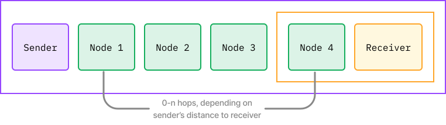
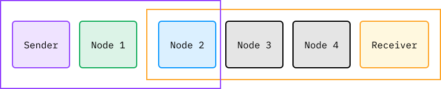
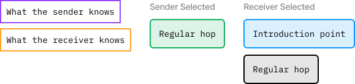

> *作者：Max Hillebrand*
>
> *来源：<https://lightningprivacy.com/en/blinded-trampoline>*
>
> *本文为多位作者的合作作品。作者详见[此页](https://github.com/BitcoinDevShop/lightning-privacy-research)。*
>
> *本文为《闪电网络隐私性研究》系列的第四篇，前篇见[此处](https://www.btcstudy.org/2023/03/01/lightning-privacy-research-channel-coinjoins/)。*

## 问题描述

虽然闪电网络上的支付发送者因为消息以洋葱路由的形式转发而具备很好的匿名性，但接收者就没有匿名性可言了，因为他们的公钥会暴露在他们给出的闪电网络发票中。

盲化路径和蹦床路由就是让接收者不必明白暴露自己的公钥的解决方案，让他们能够在接收支付时保持隐私。

## 盲化路径

“盲化路径（Blinded paths）”是“约会路由（rendez-vous routing）” 的精神继承人。在约会路由中，接收者选出一些从某些第三方触达自身的路径，然后将这些路径的洋葱加密数据包传递给发送者（一般来说，是在支付请求消息中传递的）。发送者通过发现自身到第三方节点（约会节点、入口节点）的路径，来补完整条路径，然后在这些路径上尝试支付。接收者必须告知发送者应该在路由中添加几跳 —— 每一跳都会给接收者带来更多隐私性。

盲化路径（也叫 “盲化路由”）是一种类似的技术，接收者可以提供一条盲化的路径给潜在的支付者。路径上的每个节点的公钥都是调整过的，可能包含无意义的跳（dummy hops）。

**通常情形 —— 起源地路由，整条路径都是由发送者计算出来的**

**可能情形 —— 盲化路由，后段是由接收者计算出来的**

**完美！**

- 紫色框内为发送者可知的信息；橙色框内为接收者可知的信息；发送者公开约会点，发送者补完到达约为点的路径 -

盲化路径比之约会路由要更灵活和简单。有了盲化路径，路径上的节点的公钥会被替换成随机公钥，同时，由发送者选择要在每一跳的洋葱消息中添加什么数据。约会路由的发送者无法为某一部分洋葱路由添加数据，也无法重新利用它。这就意味着，这部分路由所流转的数额必须提前确定，这不利于多路径支付。盲化路由是可以重复使用的（在使用洋葱消息的时候）。

为了支持盲化路径，下列各方需要升级自己的节点：

- 接收者：需要构造盲化的节点公钥和加密数据
- 发送者：需要在洋葱消息中加入致盲点和加密数据
- 转发者：需要能够推导出共享秘密值，以解密发送给自己的数据

幸运的是，并不是闪电网络中的每个人都需要升级 —— 只有帮助执行交易的参与者才需要升级。但是，越多人升级到支持盲化路径就越好，因为接收者可以在路径中包含更多节点。

## 蹦床路由

蹦床路由是你在给一个拥有更大网络视野的节点支付时可用于推迟路由计算的方法。这对于移动端用户来说尤其有用，因为它们容易受制于设备和连接限制，难以同步整个闪电网络的图谱。蹦床节点可以计算支付路径中缺失的部分，同时提供跟完全由起源地计算的路径同样的隐私性。

蹦床路由提议还提出了一种新的路由提示格式，不过也是向后兼容的。它通过要求至少两个蹦床节点参与来提升隐私性、不至于泄露通道信息。它也通过提供更灵活的设计空间，增加了匿名的可能。

为了支持蹦床路由，下列各方需要升级自己的节点：

- 接收者：它们需要提供蹦床节点
- 发送者：需要不期待能创建端到端的全部洋葱消息
- 蹦床节点：需要能够帮助用户路由交易（废话）！

路径上的非蹦床节点不需要升级。

## 盲化路径 + 蹦床路由

蹦床支付可以跟盲化路径相结合（甚至跟约会路由相结合），以提高接收者的隐私性。

后一个蹦床节点不再直接路由支付给接收者，而是路由给接收者指定的盲化路径（或者约会节点），因此永不能获知接收者的身份。

这是非常神奇的，因为接收者将可以匿名地接收支付，而且可以接收对网络的了解非常有限的节点的支付。这样一来，移动端的发送者即使资源受限，也可以获得跟拥有完整网络图谱的发送者同样的隐私性。

蹦床支付也可以嵌套，在到达接收者之前在多个蹦床之间跳跃。

## 选择一条盲化路径

在用户为盲化路径选择入口节点时，会有一些用户体验上的挑战。新手用户更多会希望默认由钱包软件为他们构造盲化路径。而面向消费者的闪电钱包将全都希望以类似的方式作出选择，以保证整个生态系统拥有很高的隐私性。首先，我们必须统一在盲化路径中用到的跳数；三跳（一个入口节点加上两个中间节点）似乎是最低限度了，但也许钱包会希望在洋葱消息中包含两到三条不同的路径。其次，我们必须鼓励主要的服务供应商和经典网络中的节点支持盲化路径，这样它们可以全部用作入口节点。为了提高隐私性，钱包不应该默认让用户使用钱包服务商自己的节点，而应该在网络中支持盲化路径的高流量节点中随机洗牌。

更高级的钱包也 应该尝试遵循跟面向消费者的钱包相同的指南。用户应该在选择构造非标准大小的洋葱消息时得到提醒。

Core Lightning 客户端已经支持通过命令行工具构造盲化路径好一段时间了，但手动构造的 UX 负担意味着很少人真的使用它。我们鼓励应用和实现们提供自动化和手动的构造方法，以鼓励用户在日常中使用它，同时给予喜欢钻研的用户更多的控制权。

## 误解

最大的误解是 “盲化路径是跟 BOLT12/Offer 提议完全绑定的”。绝非如此。盲化路径可以跟 BOLT11 发票结合。BOLT12 解决的一个隐患是，盲化路径跟 BOLT11 结合时，发票的数据会大很多，会创建住更大的 QR 码，让手机更难扫出来。这可以通过动画 QR 码、NFC（近场通讯技术）和 LNURL 来缓解。只不过 BOLT12 有更多的升级灵活性。

## 取舍

**优点**

- 洋葱消息可以在多个发票中重复使用
- 接收者不需要明确请求发送者应该在支付中安排多少跳

**缺点**

- 相比于约会路由，盲化路径的隐私性保障稍弱，而且需要更多的工作（例如，在处理故障时）
- 遇到支付失败时，接收者需要主动介入、生成一条新的洋葱消息
- 更长的路径可能意味着发送者需要支付更高的手续费，以及更多的时间来寻找路径，主要是处理盲化路径的虚假步数和公钥调整
- 蹦床路由提示也会产生更大的发票，如果我们希望让“老派”发送者也能支付的话

## 攻击

BOLT 中提到了两者需要知晓的攻击。其一，通道有可能因为支付侦测（probing）而解除盲化。接收者必须谨慎为支付选择盲化路由，以避免让攻击者猜到哪些节点隐藏在路径中。如果攻击者知道了接收者在入口节点的至多 N 跳以内，就可以推迟支付，观察入口节点 N 跳半径内的通道手续费和 CLTV（绝对时间锁）更新信息、尝试支付、观察支付出错，然后推断出手续费增加的通道对手就是最终接收者。

BOLT12 的加入会让情况变得更加严重。有了 BOLT12 之后，攻击者甚至无需尝试支付。他们只需向不断向接收者请求发票，等到接收者提高手续费或盲化路径的 CLTV，就可以将接收者与最近的通道更新关联起来。为了缓解这一点，用户需要为路径当前使用的节点数量增加一个足够大的余量，以预备未来可能的增加。

另一种类似的攻击是，等待节点下线，然后尝试支付（不是等待通道的价值提升更新消息）。为了缓解这一点，接收者应该在路径中放置正常运行时间更长的节点。

## 实现进度

Core Lightning 从 2020 年开始就已经有盲化路径的实验性实现，不过没有在文档中写明。见[此处](https://github.com/ElementsProject/lightning/pull/3623)。

2022 年 6 越，LND 团队为自己的 lightning-onion 库提交了一项 PR。[这项 PR](https://github.com/lightningnetwork/lightning-onion/pull/57) 还在依然在审核中。一旦该 PR 合并，我们预见将它整合进 LND 的工作就会开启，但这应该会比在 lightning-onion 中集成要更轻松。

Eclair 的盲化路径开发工作已经持续了一段时间了，但用户还用不上。进展见[此处](https://github.com/ACINQ/eclair/pulls?q=blinded)。似乎其实现将跟 BOLT12 绑定，见[此处](https://github.com/ACINQ/eclair/pull/2021)。

LND 似乎也将让盲化路径跟 BOLT12 集成。

Eclair 是当前唯一一种支持蹦床路由的实现。

## 进一步研究

### BOLT

- [Route Blinding (Feature 24/25)](https://github.com/lightning/bolts/pull/765)
- [Trampoline Routing (2021 edition) (Feature 56/57)](https://github.com/lightning/bolts/pull/829)
- [Trampoline onion format (Feature 56/57)](https://github.com/lightning/bolts/pull/836)

### Misc.

- [Rendez-vous routing original proposal](https://lists.linuxfoundation.org/pipermail/lightning-dev/2018-November/001498.html)
- [How route blinding fits in with BOLT12 (Offers)](https://github.com/lightningnetwork/lnd/issues/5594#issuecomment-1150822223)

（完）