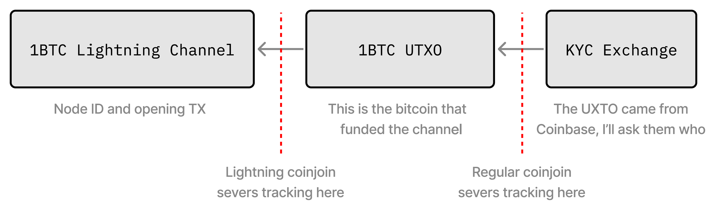
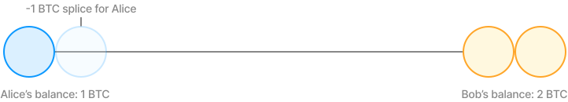

> *作者：Max Hillebrand*
>
> *来源：<https://lightningprivacy.com/en/channel-coinjoins>*
>
> *本文为多位作者的合作作品。作者详见[此页](https://github.com/BitcoinDevShop/lightning-privacy-research)。*
>
> *本文为《闪电网络隐私性研究》系列的第三篇，前篇见[此处](https://www.btcstudy.org/2023/02/28/lightning-privacy-research-routing-analysis/)。*

## 前言

闪电网络相比传统的链上比特币，提供了一些隐私性优化，但是，它依然跟底层的比特币网络有关联。在使用闪电网络时，我们依然需要使用传统的比特币隐私技术，来保护我们自己的资金不被窥视。我们讲解释如何使用 coinjoin、拼接和其它可能的技术，来保护用户的隐私。

## 问题描述

闪电节点必须使用一笔链上交易来开启通道，在关闭通道时也需要发起链上交易。这自然而然会曝光一个闪电节点的链上历史，甚至可能伤害其隐私性。向整个网络公开了自己的通道的路由节点尤其要面对这个问题。

- Alice 在某经过身份认证的交易所有个账户；看起来她取出了 1 BTC，然后用这笔资金建立了一条闪电通道 -

那么，哪些链上隐私技术可以保护我们免于被监视呢？

## 深入了解通道 coinjoin

### 预先 coinjoin

当前，在使用闪电网络的同时保护你的链上隐私的主要方法是在开启闪电通道 *之前* 参与 coinjoin。具体做法就是把一些资金发送到支持 coinjoin 的钱包里去。在获得足够大的匿名集之后，再把 coinjoin 后的资金发送到你的闪电节点的链上钱包（不论是使用专门的交易，还是直接利用 coinjoin 交易，都可以）。然后，你就可以使用这个 UTXO 来开设闪电通道了；这样的闪电通道 *应该* 不会有让你的链上钱包去匿名化的风险。

这种做法有几个缺点，最明显的一点是它需要许多笔链上交易，尤其是你想获得很高的匿名性的话。对  coinjoin 协议的优化（比如 wabisabi 钱包）以及具有免费混淆机会的 coinjoin 协议可以降低用户的成本，但是，用户依然有时间上的开销（网络出块需要时间）。即使是最理想的情况，也需要两笔交易，一笔 coinjoin，另一笔是通道开启交易。

更重要的是，这样做也会影响隐私。在创建一笔交易为你的闪电通道注资的时候，你是创建了一笔公然让自己的资金离开 coinjoin 流动性池的交易。这意味着，你的 UTXO 不再是增长中的 coinjoin 池子的一部分，而且可能会被当成一个普通的 UTXO。这意味着，你的 UTXO 的匿名集，会因为跟你一起 coinjoin 的朋友在链上做了去匿名化的操作而缩小。

如果你尝试同时开启多个通道，那就更有趣的。如果你发起了这样的批量开启操作，而且事先没有 coinjoin，那么显然，他人可以假设你这笔交易中的所有输出都是你的节点拥有的通道。相反，如果你是放在 coinjoin 交易中的话，那么虽然这些输出可能被认为是通道，但他人将无法断定这些通道都属于同一个所有者。

还有一些原因，导致人们现在做不到这样预先 Coinjoin。第一个原因是，现在还没有 coinjoin 软件支持这种功能（不过 [Vortex](https://github.com/ln-vortex/ln-vortex) 很快就要发布了）。闪电通道有其特殊性，开设通道不是将资金发送到某一个链上地址这么简单。参与通道的两个闪电节点需要事先沟通，然后才能将资金发送到某个地址上，而且有时间窗口。如果你不能保证及时完成，你可能会损失金钱，最少也会头疼一阵子。因为这种限制，一个 coinjoin 的协调员如果想支持在 coinjoin 交易的输出中开启闪电通道，需要专门定制。这是因为当前的 coinjoin 协调员为用户设置了很长的排队时间，所以用户可以任意进入和退出，但如果要开启闪电通道，你就需要重新开发协调员，使之能在 10 分钟的窗口内完成登记、签名和广播交易的工作。

另一个问题是，现在的闪电通道是一个 P2WSH 输出，而用户的钱包一般使用的是 P2WPKH 地址，这在链上是明显有区别的，所以你可以分辨出哪一笔资金是个人钱包（可能会被进一步混合），哪一笔输出是闪电通道这样的合约。理想情况下，在一笔 coinjoin 交易中，我们希望每一个输出看起来都尽可能相像，这样解释的可能性就会尽可能多（混淆效果越好）。此外，闪电通道的脚本会在通道关闭交易中揭开。幸运的是，我们已经有一种解决方案了，就是 taproot！Taproot 让单签名的钱包和多签名的钱包在链上看起来一摸一样。不过，截至本文撰写之时，还没有闪电节点实现支持 taproot 的闪电通道。

现在 Vortex 已经完全支持闪电通道和 taproot。Wabisabi [协调员](https://github.com/zkSNACKs/WalletWasabi/pull/8831)也已经支持 taproot，[客户端支持](https://github.com/zkSNACKs/WalletWasabi/pull/9070)也正在开发者。Samourai Wallet 已经声明[没有计划](https://twitter.com/SamouraiWallet/status/1415788631491497985)支持 taproot。JoinMarket 已经支持发送到 taproot 地址，但[还没有计划](https://github.com/JoinMarket-Org/joinmarket-clientserver/issues/1079#issuecomment-1041594917)在钱包中实现。

### 通道开启时 Coinjoin

我们已经讲了预先参与 coinjoin 的缺点，那么在 coinjoin 交易中开启闪电通道呢？这将允许我们用一笔交易开启多条通道，并且各通道在链上看起来跟彼此是没有区别的。这样做有几个重大好处。

最大的好处在于，你可以将你的链上历史与其他许多人的链上历史联系在一起。这意味着，当某个观察者尝试从你的闪电通道中发现关于你的链上钱包的历史时，他们将无法分辨 coinjoin 交易的哪个输入用来给哪条通道充值，实际上就是无法确定哪一份链上历史属于你的闪电节点。不仅如此，因为开启闪电通道的资金不需要离开 coinjoin 流动性池，你的通道可以继续从 coinjoin 流动性池子中获得潜在的匿名效果，只要跟你参与过 coinjoin 的朋友还在继续混币。同时，如果一笔 coinjoin 交易打开了多个通道，观察者将无法分辨其它通道属于你还是他人。

Taproot 可以让所有这一切变得更加健壮，因为 taproot 让你的闪电通道看起来跟普通钱包的 UTXO 没有区别。这意味着，我们可以在一笔 coinjoin 交易中开启一条闪电通道，而其他人无法分辨哪个输出是通道，哪个输出是普通钱包 UTXO。这意味着我们可以让一笔 coinjoin 交易服务于多个目标 —— 一些用户用它来开设通道，一些用户用它混淆输出以备日后支付。这听起来可能没啥大不了，但这可以让不同的人群共享同一个流动性池和匿名集（一般来说是 conjoin 交易最大的资源约束），也会让我们更接近每一笔链上交易都是一次 coinjoin 的梦想。

### 通道关闭 v2

在 coinjoin 交易中开启闪电通道是挺好的，但关闭通道呢？当前的闪电协议[不支持在 coinjoin 交易中关闭通道](https://github.com/lightning/bolts/blob/341ec844f13c0c0abc4fe849059fbb98173f9766/02-peer-protocol.md#closing-initiation-shutdown)。为了关闭一条通道，你需要告知你的通道对手，商议关闭哪条通道、将剩余资金发送到哪里。这就意味着你没法通道一笔 coinjoin 交易来完成这件事，因为 coinjoin 是一个交互式的流程，涉及到其它的输入和输出。

当前的协议不支持这样做，但关于如何添加这个功能，我们已经有一些想法了。“[Interactive-tx](https://github.com/lightning/bolts/pull/851)” 提议指出人们可以交互式地创建一笔交易来开启闪电通道。这个提议可以扩展成允许人们使用交互式地构造交易来关闭通道。此外，你可以加入一种 shutdownV2 消息，让你可以指定一笔交易来关闭通道（而不是只能提供一个地址）。这使得你可以构造一笔关闭通道的 coinjoin 交易，然后交给你的通道对手验证。（译者注：这里的“交互式”的意思是：双方都提供了输入。当前的闪电网络协议中，开启通道一般仅由一方提供输入，因此，虽然双方需要提前签署承诺交易，但也不叫“交互式”。）

Core Lightning 客户端和 Eclair 客户端已经实现了 interactive-tx，但是，只限于通道开启操作。现在还没有使用 interactive-tx 了关闭通道的实现，甚至连准确的实现都没有。不过，已经有人讨论过了，而且似乎是闪电网络协议在充分部署 interactive-tx 之后合乎逻辑的下一步。

### 拼接 Coinjoin

拼接（splicaing）是一种[正在加入](https://github.com/lightning/bolts/pull/863)闪电网络协议的新特性，允许你升级一个正在服役的闪电通道。意思是，你可以 为一个通道添加资金/从中移除资金，而不必关闭它。这是一种非常强大的特性，因为它允许你一边让通道保持开启，一边又不影响你使用通道中的余额发起链上交易的能力。它是建立在双向注资通道基础上的（双向注资通道正是使用 interactive-tx 协议实现的）。它允许通道双方交互式地构造比特币交易，实现通道的拼接。

**常规拼接**

拼接可以在任意数量的对等节点之间实现，你可以跟一个对手初始化一次拼接，然后让另一个对手加入这次拼接。这就让拼接可以变成一种 coinjoin 协调机制，每个人都可以加入、登记一个自己希望混淆的 UTXO。因为这主要是在做拼接，所以不需要让每个输出的面额都相等，因为我们可以伪装结果的数量 —— 用户到底收到了多少钱，从链上看是看不出来的，能够看出来的只有拼接之后的各个通道的总价值。这意味着我们可以让 coinjoin 在闪电网络中协调、使用不等的输出数量来更新闪电通道。这需要很多工作来实现，但这是非常强大的特性，对链上隐私和闪电网络隐私性都有巨大的影响。

**Coinjoin 拼接**

拼接可以重塑我们对 coinjoin 协调程序的理解，会不会也可以动摇我们对闪电通道的理解呢？以前，我们理解闪电通道的方式是，（假定）一条闪电通道存在了，那它就不可能再被混淆了，因为混币需要关闭通道；而且，如果没有“通道关闭 v2”这样的东西，也无法在 coinjoin 交易中关闭通道。但是，有了拼接，我们可以让一条通道保持开启，同时 为之增加资金/从中移除资金；那么，我们也可以选择拼接一条通道而不改变其容量呀。乍看起来这是一个无聊的想法，因为只会浪费链上手续费，但实际上，这是闪电网络隐私性的破局者。

拼接可以支持我们混合闪电通道。甚至，它可以让闪电通道进一步与其它链上的 UTXO 混同、无法区分。它意味着我们可以让闪电通道一直开启，但不断改变其链上历史，并不断跟其它 UTXO 混合。因此，我们没准可以让所有的闪电网络流动性，都变成一个单一的 coinjoin 流动性池子。

你可以这样理解：参与 coinjoin 就是给我们的车换漆。一旦某人能够将某条闪电通道跟我们关联起来的时候，我们就做一次拼接 coinjoin，改变我们的通道的链上历史，以保护我们的隐私。所以闪电通道可以一直开着，但会变得非常难跟踪，我们的闪电活动也就可以变得更加匿名。

这将极大地扩大闪电通道以及链上 UTXO 的匿名集。

