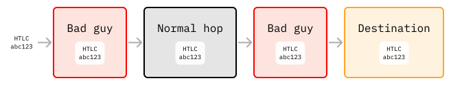
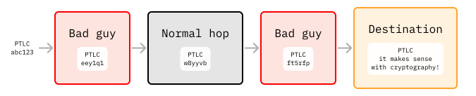
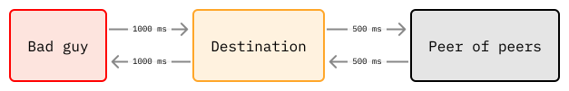
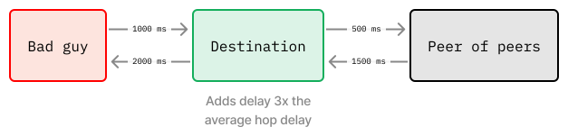
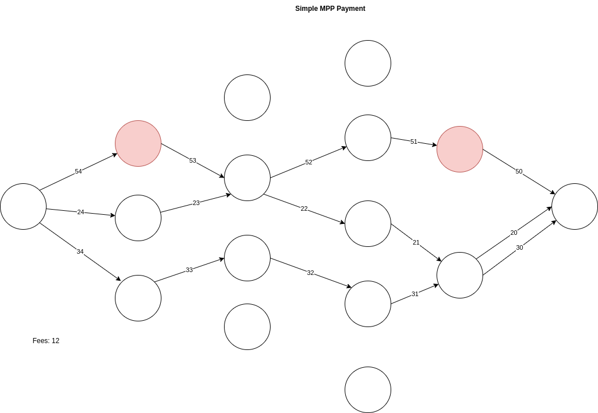
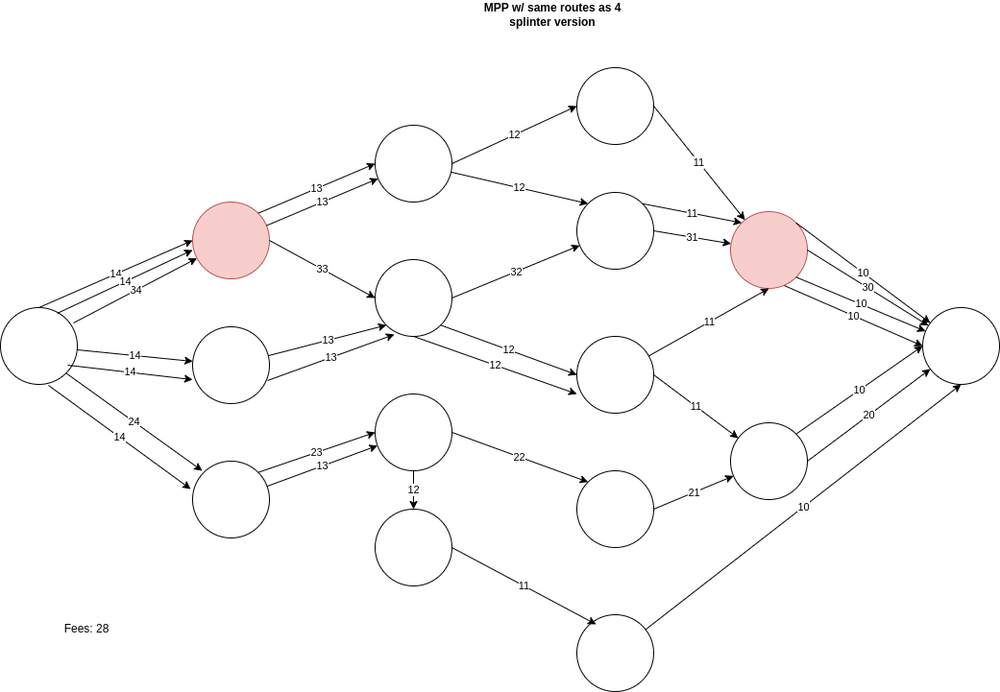
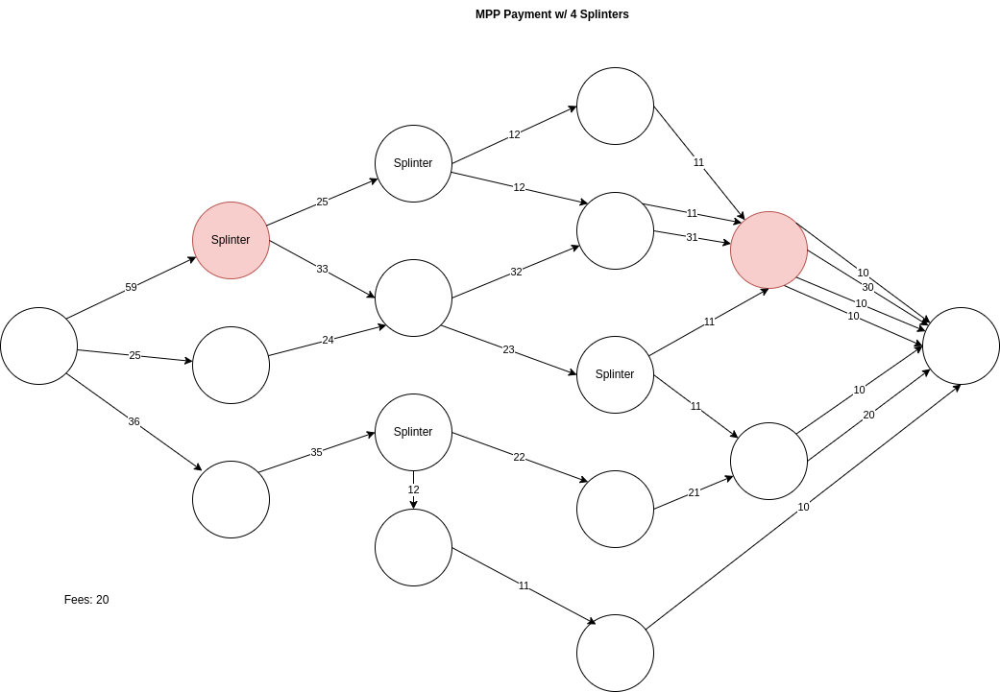

> *作者：Max Hillebrand*
>
> *来源：<https://lightningprivacy.com/en/routing-analysis>*
>
> *本文为多位作者的合作作品。作者详见[此页](https://github.com/BitcoinDevShop/lightning-privacy-research)。*
>
> *本文为《闪电网络隐私性研究》系列的第二篇，前篇见[此处](https://www.btcstudy.org/2023/02/27/lightning-privacy-research-introduction/)。*

## 前言

不论任何支付，在穿越闪电网络时，由于采用了洋葱路由来转发消息，起源地和目的地总能得到一定程度的隐私性。因为闪电支付一般都会经过第三方，隐藏起源地和目的地以及其它元信息是很重要的。闪电节点在路由支付时可以收取服务费，知道必要限度以上的信息可能导致审查和隐私性隐患。

## 问题描述

在某些情况下，路由节点可能推导出关于闪电支付的支付者和接收者的信息。本文将深入研究少数这样的场景，以及一些能够让任意路径中的支付都变得更难观察的优化措施。

## 深入研究路由分析

### 当前的路由隐患

闪电支付的洋葱路由特性，提供了许多相似于 Tor 的洋葱路由的好处。人们预期支付的起源地和目的地是途中的节点无法得知的。然而，在一些情况下，路由节点可以推断这些信息。还有一种情况是，支付路径上的多个节点由同一人控制，因此孤立的信息可以被联系起来。

不论什么时候，当一个节点直接给自己的通道对手支付时，这笔支付当然有可能是从别的地方转发过来的。但是，如果支付者跟其他节点并无公开的通道，那这笔支付来自于其他人的可能性就非常小。同样的逻辑也适用于目的地没有任何其他公开通道的两跳支付。在用户使用 LSP（闪电网络供应商）时，就常常是这种情况。

只有良好的通道分布，是不足以解决这个问题的。如今，闪电路由的多个方面都在接受改进，以提供更好的保证。我们在下文详细说明。

### PTLC

PTLC（点时间锁合约）为闪电网络提供了两大提升。一是 托管/DLC/智能合约 可能性，二是取消支付的可关联性。还有别的好处，比如修复虫洞攻击（wormhole attack）。

当一个 HTLC 支付流经多个节点时，它的每一跳都会使用相同的支付哈希值。所以，如果路径上有多个节点的实际操控者是同一个人，他就能知道它们属于同一笔支付。他们也许不能知道这笔支付来自那里、去往何处（除非刚好也是上面说的隐患情形）。如果一个闪电网络服务商路由了用户的一笔支付，是发送给一个大型企业的，那么这个服务商可能就能推断处其具体的起源地和目的地。

**现状**

**理想**

Surebits 有一篇博客文章，非常深入地解释了 [PTLC 的工作原理](https://suredbits.com/payment-points-part-1/)（[中文译本](https://www.btcstudy.org/2021/10/26/payment-points-part-1-replacing-HTLC/)）。

### 时机推迟

时机推迟（Timing delays）是重要的技术，它使得观察者不再能根据时间来预估支付的起源地和目的地离自己有多远。一些初步的研究显示，当前的观察者是可以做到的。网络中一些最大的节点可以分析出[50% 到 72% 的支付](https://arxiv.org/pdf/2006.12143.pdf)的起源地和目的地。仅仅是预估 起源地/目的地 的距离，就有可能基于网络的拓扑图找到具体的节点。做法是观察可能被采用的预期路径、然后进行时机分析。

在讨论闪电支付路由时，时机分析会带来两大隐患。一个是路由者将能估计下一跳是否就是最终目的地。另一个是让不同的跳步产生关联（假定 HTLC 的关联性已被修复）。

我们看看实际分析是怎么回事。假定 Alice 和 Bob 之间的平均网络延迟为 100 ms；当 Alice 路由了一笔支付给 Bob 时，Bob 立即就回复 HTLC 的原像，那么 Alice 就可以合理假设 Bob 就是支付的最终目的地。Alice 甚至可以进一步延伸这样的推测，假如她知道 Bob 跟其他节点的网络延迟的话。这不能断定谁是最终目的地，但 Alice 可以假设自己在给 Bob 路由（或给 Bob 的通道对手、通道对手的通道对手 …… 路由），然后根据网络拓扑图，找出可能采取自己这条路径的目的地节点。大多数情况下，Bob 的通道对手都不太可能通过 Alice 来给 Bob 支付，这不是最短路径（而闪电网络节点实现一般都会选择最短路径）。一种例外是因为流动性问题或 节点出错/宕机 问题而严格指定了备用路径，但使用打探方法（probing）的话，这样的信息也能找出来（译者注：“通道打探（probing）”指的是通过重复发起支付来打探一条通道内部情况的做法）。

如果  Bob 还有另一个节点 Bob-2 ，而且事实表明支付是  Alice -> Bob -> Charlie -> Bob-2 -> Evan 这样路由的，那么还可以进一步分析。其一，今天的 Bob 可以断定这就是同一笔支付，因为使用了相同的哈希值。但是，即使没有支付哈希值，Bob 也可能看出来，因为他的第一个节点先收到、第二个节点后收到的支付有相同的数额。在闪电网络上，我们没法断定不同的节点背后一定是不同的人。可能有许多节点都属于同一个人。

**解决时机分析**

在 PTLC 实现之后，有一些方案可以解决时机分析问题。在《[Counting Down Thunder](https://arxiv.org/pdf/2006.12143.pdf)》一文中，作者们建议节点给自己路由的支付添加一个随机的延迟。为了让这个时延富有意义，应该添加两到三倍于节点平均延迟的量。如果平均的延迟是 100 ms，但只添加了几 ms 的延迟，那就没有什么意义了。如果每个节点都以这种方式添加随机的时延，那么支付将需要花费两到三倍的时长来完成。这可能会大大损害闪电网络网络的支付可靠性。

另一个角度是 Peter Todd 在 [Lightning-Dev 邮件组](https://lists.linuxfoundation.org/pipermail/lightning-dev/2022-June/003621.html)中提出的，让发送者自选是否加入时延。发送者可以要求每一跳的节点都为支付添加一个时延，然后再发送到下一个节点。这使得发送者可以更细粒度地控制自己的支付的匿名集。如果一笔交易道道一个路由节点时，这个节点被要求扣住交易 10 秒钟，与此同时，另外两笔相同数额的支付进入这个节点，那这个节点显然更难分辨这些交易的最终目的地。因为发送者是自己决定是否要添加时延的，所以他们肯定能接受交易需要更长时间来完成。只要接收者在发票过期之前获得支付，多花点时间应该不会给他们带来困扰。

**现状**

**理想**

但是，让发送者自选是否添加时延也有一些问题。一个是在事实上，这没法要求强制执行。如果发送者要求某个节点添加一个时延，但从上一跳收到交易后这个节点决定立即转发出去，那发送者也没有办法。路由者可以无视这种时延请求。一种可能的解决方案是，提醒下一个节点注意这个时延，如果下一个节点遵守这个时延，他们可以推算出自己要扣住这笔交易到哪个时间点（上一个节点也知道）（但无需公开总时长），如果不遵守这个时延请求，将被拒绝。但是，没有激励机制让节点按这种方式更新协议。因为单条通道可以同时持有的 HTLC 上限是 483 个，让节点保留 HTLC 更长时间总的来说是个问题。如果我们能够达成共识，也许能设置一个合理的上限，但这样做会增加复杂性，而且可能会使路由的失败率升高。为了隐私，这一切值得吗？假定支付活动达到一定量级，会因此增加多少时延呢？

没有协议层的变更，路由延迟请求也许不会被理睬，但一些打探手段可以看出哪些节点遵守了，哪些节点没有遵守。通过侦测每个节点之间的路径并度量延迟，你可以用一个延迟特别大的测试节点，来分辨哪些节点遵守了时延请求。在做法上这可能不是完美的，因为节点间的延迟不是永远不变的。而且可能会发生一些网络问题，尤其在洋葱网络上。

### 数额随机的多路径支付

无法关联的支付哈希值，以及少许的时机延迟，还不足以完全打破路由分析。为了增加支付的来源地和目的地的可能性（模糊性），我们需要多路径支付（Multi-Path Payments），而且不同路径中的支付数额应该是随机的。平均分割总数额还不够好。

在下文中，我们假设 PTLC 已经实现（因此支付之间不可通过哈希值关联起来），而且时机延迟将使路由节点没有足够多的信息来推算合理的 “数额 + 时机” 匿名集。我们要探究有了这些提升之后，还可以作什么优化。在下面的例子中，我们假设每个节点都收取 1 聪的手续费，但在现实中，这个数额是不确定的。因为路由费率是公开的信息，任一给定路径的手续费都可以很容易地计算出来。

**简单支付分析**

在上图中，我们可以看到支付经过了 4 个节点，以支付面额 100 聪的发票。经过 4 个节点，从表面上看，可以为 来源地&目的地 提供很大的匿名集了。然而，在这个例子中，假定第一跳和最后一跳的两个节点（以粉色标记）有同一个实际控制人。TA 的节点分散在多个位置，虽然无法证明流经 TA 的两个节点的是同一笔支付，但在一些可行的假设之下， TA 可以有一个很强的推断，这两笔支付实际上是同一笔，而且来源地和目的地可能是哪里。

即使有了时机延迟，匿名集也不会太大，因为，“在时机延迟窗口内，有多少笔约 100 聪的支付流经了同一个人控制的两个路由节点”，对该人来说是可知的。手续费的数额是闪电网络的公开 gossip 信息，所以不难假设，他们可以反向计算出在到达第一个节点时是 104 聪、到达另一个节点时是 100 聪的所有可能路径。即使并不是每个节点都收取 1 聪，要计算所有可能路径上的手续费也不是什么难事。支付溢价（overpay）可以给予支付方更多一点的匿名性。但是，即使只知道路径上的少数几跳（例如观察者的两个节点），也足以缩小来源地和目的地的可能范围。如果观察者还知道自己的两个节点之间的其他节点的余额信息，则 TA 还可以进一步分析，尤其是在支付的数额较大、路径比较有限的时候。

**多路径支付分析**

有了 MPP，我们就可以看出还有什么地方可以优化：一笔支付被分成了多个部分。当前闪电网络的所有主要实现都支持这个功能。

在上面这个例子中，我们可以通过将支付分成三份、通过多个入口节点和出口节点来发送，从而削弱观察者的视野。在这个例子中，拥有两个节点的观察者只能看到 50 聪的支付流。观察者不知道真实的支付数额 —— 在最终目的地是一个商店、有公开的价格时，这样的机制将有利于接收者的隐私性 —— 但他们依然能够通过打探最终节点（在不同通道中）的余额差值，来估计支付采取的路径。但是，只要更多人在闪电网络中使用多路径支付，我们就能让匿名集变得更大。观察者将不再是回答 “观察者的路由节点路由了多少笔数额为 100 聪的支付”，而是 “观察者的节点路由了多少笔数额为 50 聪的支付”。实质上就是将每一笔支付的匿名集都乘以了从 2 到 10（以上）不等的乘数，乘数大小取决于有多少人将自己的支付分割成了更小的数额，从而让常见数额的支付变得更加频繁。

**复杂的多路径支付分析**

我们来看一个更复杂的多路径支付案例，我们将一笔支付分析成了很小数额的 7 笔，一些节点会重复收到多个部分。

将支付分成更小的部分，即使为某一些部分采用相似的路径，也可以让分析变得更加复杂。在我们这个案例中，即使粉红色的节点可以看到 40 聪的支付，分析的精确度依然在多个方面都下降了。其一，这个案例中产生了一个观察者无从观察到的 10 聪的支付（在上一个多路径支付案例中还没有这部分）。其二，因为更多低数额的支付发生了，只要网络上更多人这样做，匿名集就可以进一步扩大。支付者可以不断切分自己的支付，直至每一个部分的数额都足够小。

虽然上面的案例使用了 10/20/30 聪这样的整数，但这是为了便于理解，在现实中，可以是较小的随机数额，以消除手续费分析的隐患。

### **裂变支付**

虽然上面的案例在今天都能做到了，我们还想分析另一种可能的技术优化，它可以让基于数额的路由分析变得更难。在这一节，我们要介绍 “裂变支付（splintered payments）” 的概念。

裂变支付是一种可能的协议强化措施，它允许一笔支付在送达目的地的途中其中启动一个乃至多个 MPP（多路径支付）。所以支付在经过网络的途中可以进一步肢解。不再可能出现特定面额的支付先在某个节点出现、而后又在另一个节点出现的情形，因此数额的关联性也消失了。

这张图跟上面的高级 MPP 有相似的支付分拆效果。但是，这些分拆是在路由途中启动的，而不是在起源地就启动的。这样做也可以节约一些手续费。

不过，最主要的好处还是在于为数额引入了更多的随机性，所以路径末段的观察者的节点没法将各个部分关联起来。不是绝不可能，但如果网络中有许多节点都在发起裂变支付，通过数额来发现支付之间的关联（哪怕是发现不同部分的关联）就会变得更难。

一个重要的提示是，这项技术在目前仅仅是理论上有可能，而且，据我们所知，也没有作为对闪电网络协议的一项升级提出。一个问题是，裂变支付能够得到强制执行吗？它能够在蹦床路由层实现吗？

在（通过 PTLC 和时机延迟）实现更好的无关联性之前，可能还不值得很关心这个问题，但是，我们可以通过手动构造小额的 MPP，来实现某些可以证明足够好的东西，这是今天就可以实现的。MPP 和裂变支付的一个问题在于其用户体验。找到许多可以成功路由小额支付的路径需要多少时间？如果优先避免路径复用呢？

### 更长的路径

闪电网络隐私性的研究者们[已经讨论过了](https://bitcoin.stackexchange.com/questions/92073/what-is-the-rationale-for-the-lightning-networks-path-length-limit-20-hops)希望获得隐私性的发送者应该选择的最优支付跳数。在他们的分析中，他们利用了“[六度分割](https://en.wikipedia.org/wiki/Six_degrees_of_separation)”理论（认为所有人两两之间最多都只隔着 6 个人）。他们还指出，所有的公开节点两两之间一般都是 [10 跳到 20 跳](https://bitcoin.stackexchange.com/questions/92073/what-is-the-rationale-for-the-lightning-networks-path-length-limit-20-hops)的的距离，同时 20 步是当前的闪电网络协议支持的极限（蹦床路由可以提高这个限度）。因此，因为大多数节点两两之间都相隔 9 跳，超出这个步数应该能提供足够大的匿名集，可以避免被猜出处在闪电网络图谱的某个区域内（假设 HTLC、数额和时机关联都已失效）。

我们还可以进一步研究单一行动者掌控多少个恶意节点时可以让我们这里的假设失效。但是，闪电网络跟洋葱网络的区别在于，创建足够多有充分连接的闪电节点是很贵的，因为你需要锁定流动性。

但是，根据上文的“当前的路由隐患”一节可知，单跳或者两跳支付，会极大地缩减发送者和接收者的匿名集，有时候甚至可以准确定位这两者。

### 优点

本文提到的许多升级都是为了提升发送者和最终接收者的匿名性。这样做也可以让网络的抗审查性增强。

### 负面/牺牲

这些升级的负面效果在于，它们会影响用户体验，会提高支付失败的机率、网络出错的机率以及单方面关闭通道的比例，增加完成支付所需的时间，拉高发送者需要支付的手续费。不过，当今天使用闪电网络的参与者为用户作出选择时，这些因素也会被考虑进去。

## 实现进度

### PTLC

PTLC 的概念已经流传了很多年，但直到 taproot 在 2021 年激活，它在技术上才成为可能。不过，还没有什么公开的进展。虽然它偶然会成为[讨论的焦点](https://github.com/lightning/bolts/issues/987)，但还没有任何一个节点实现公开时机的进度。

### 时机延迟

就我们所知，除了偶尔的研究组讨论和理论建构，还没有人来主动解决这个问题。

### 多路径支付

今天的所有节点实现应该都可以做到了，应用层的开发者可以在自己的钱包软件中利用这个功能。但是，就我们所知，在路由途中启动 MPP 的想法还没有得到讨论。

## 进一步研究的文献

- [Suredbits PTLCs Introduction](https://suredbits.com/payment-points-part-1/)
- [MPP](https://lightningprivacy.com/en/[https://docs.lightning.engineering/lightning-network-tools/lnd/amp](https://docs.lightning.engineering/the-lightning-network/pathfinding/multipath-payments-mpp)) / [AMP](https://docs.lightning.engineering/lightning-network-tools/lnd/amp)
- [“Counting Down Thunder” (Timing analysis)](https://arxiv.org/pdf/2006.12143.pdf)

> 续篇见[此处](https://www.btcstudy.org/2023/03/01/lightning-privacy-research-channel-coinjoins/)。