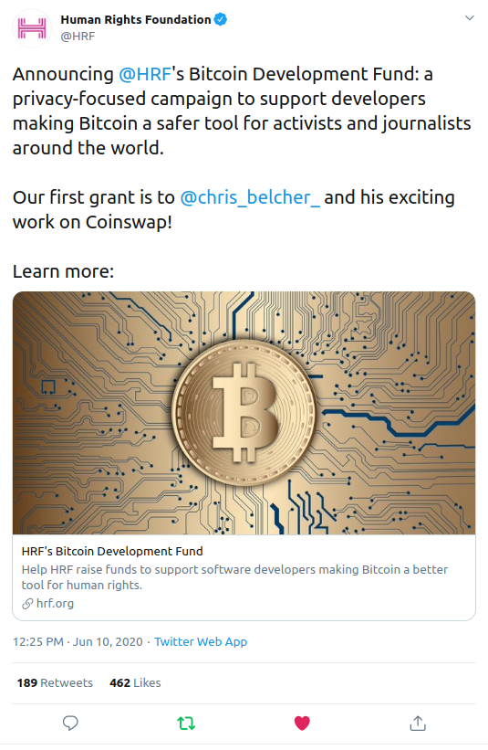
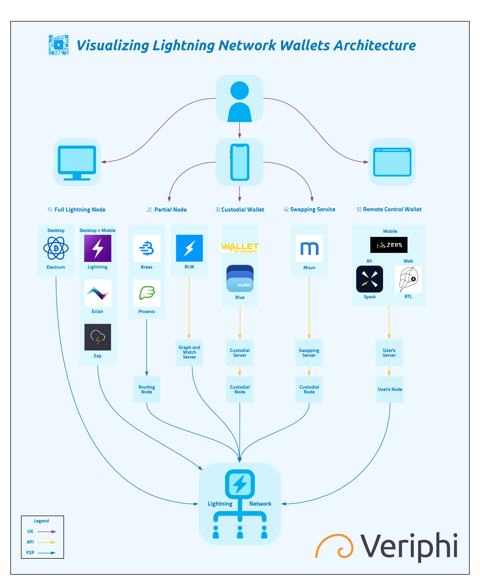

> *作者：Veriphi*
> 
> *来源：<https://www.veriphi.io/en/blog/lightning-wallet-architecture>*

## 文章结论

Veriphi 建议使用的闪电网络钱包：

1. Phoenix：闪电网络最好的入门钱包
2. Zap：适合高级用户的钱包，具备桌面版和移动版
3. RTL：适和高级用户，桌面版且适合用于商务

## 没什么比草根运动更强大的了

光靠钱袋，行之不远，“区块链” 和山寨币已经获得了**数十亿美元**的融资。但他们做成了什么事呢？乏善可陈。比特币已经带来了历史上最大的货币革命，而且至今每周都在发生技术和市场的突破。开发者生态的热情是自下而上的、真挚无比的。

到了什么程度呢？我要不要提醒你一下，所有的事情都肇始于一个以 “中本聪” 为假名的人，TA 拥有价值**几十亿美元**的比特币，但 TA 永远不会去动用，其真实身份也永远不会揭开。还有比这更草根的吗？

- 一个笑话（译者注：图中文字意为 “发明了比特币并挖出了 100 万个币，但弄丢了私钥并因为害怕嘲笑而保持匿名”—— 它假想了中本聪是这样一个倒霉蛋） -

往事如烟。如今，数十位技术高超的开发者持续在软件、密码学或概念层面创新，没有谁担保他们一定可以得到经济回报。**真正的创新只能发自对科学的热爱而不是对名利的追逐**。讽刺的是，比特币是唯一一个利用软件开发来实现货币开发的现实案例，其自身就是一场革命。

尽管许多人愿意不要报酬，但他们不该得到这样的待遇，我们也不会辜负他们。Blockstream 自 2014 年以来一直在雇佣开发者为开源项目工作，许多公司也正在加入。在 2020 年，出现了许多不同来源的开发者奖金，甚至有来自人权基金会（[Human Rights Foundation](https://hrf.org/programs_posts/devfund/)）的，他们给 Chris Belcher 奖励了 5 万美元，因后者在 CoinSwap（一种隐私技术）上的工作。有关隐私技术，过几个星期我会专门写一篇文章。

## 闪电网络钱包的开发

今天我们来谈谈闪电网络钱包的生态，从中也可以看到比特币生态的草根开源创新带来的强大驱动力。我们已经在[这个网站](https://docs.google.com/spreadsheets/d/1jzJ2Vut6q-cbr7bg3tshqJszJFLXpvi194os7GxQQ30/edit#gid=1531699029)上发布了最完整的闪电钱包功能比较，从中你可以看到 55 个细分功能。

这些数据是很有用的，但它在一张表格中塞进了大量信息，所以虽然很全面，对大部分用户来说却不够直观。**如果你想更进一步第了解闪电钱包是怎么工作的、他们的架构以及用户体验有何不同，这篇文章就是为你准备的。**

## 闪电网络钱包的架构

下面是一张对不同类别的闪电网络钱包的图解。它需要托管吗？需要使用外部得节点吗？还是说它是个中介？这些问题都可以用许多案例和我们提到的平台了解答。

这是对上图所有信息和 5 种钱包分类的文字描述。

### **1）闪电网络全节点**

闪电网络就像比特币一样，是一个点对点的网络，由许多节点组成。不过，与比特币不同的是，它没有全局共识机制，所以节点更加模块化，而且可以在彼此之间发送事务而不让其它节点知晓。重要的是记住，在这种闪电钱包中使用的私钥是由连接到网络的节点持有的。

**这个类别中的钱包都有完整的闪电网络节点，完全独立地在闪电网络中运行，不需要其它节点或服务器的协助。**

如上所述，私钥由节点持有，所以是完全处在用户的控制下的。闪电网络全节点也具有下列属性：

- 私钥管理
- 网络结构图
- 连接到一个比特币全节点
- 通道管理，开启、关闭和强制关闭通道
- 交易和流动性处理
- 对等节点连接
- 接收支付

同样地，autopilot 是基于 LND 闪电网络实现的全节点钱包（比如 Zap 和 Lightning App）中常用的功能模块。这类钱包需要承担更多的交易对手方风险，因为你的交易对手可能会欺诈你。这也是为什么 Lightning App 和 Electrum 提供了方便连接到一个瞭望塔（Watchtower）的功能。

私钥管理是另一项责任，闪电网络的私钥不像比特币私钥那么简单。静态的通道备份是有风险的，因为如果有更新的通道状态存在，而你恢复出来的是一个比较旧的状态，你的通道对手有可能会认为你是在欺诈，如果他能公开一个更新的状态，你在通道中所有的比特币都会被他拿走。这些钱包也会让你备份你的私钥，就像普通的、使用助记词的比特币钱包一样。

下面是这类钱包中最流行的几个：

- [Eclair](https://play.google.com/store/apps/details?id=fr.acinq.eclair.wallet.mainnet2)。可以在所有桌面平台上作为闪电网络全节点来使用，有图形界面和命令行的版本；但最适合日常使用的是其安卓版本。它也是一个完整的比特币钱包，你可以用它来连接你自己的比特币全节点（通过一个 Electrum 服务器）。它是用 ACINQ 语言开发的。
- [Lightning App](https://github.com/lightninglabs/lightning-app)。Linghtning Labs 在 2019 年推出了 Lightning App，在桌面和手机平台上基本都可用。这是用 Javascript 语言开发的，它使用 [Neutrino](https://bitcoinmagazine.com/articles/neutrino-privacy-preserving-light-wallet-protocol) 作为比特币全节点。
- [Zap](http://zaphq.io/)。Zap 最好用的闪电网络钱包之一，基于 LND 闪电网络实现。它也是用 Javascript 语言开发的，提供了很棒的用户界面，而且会在下一个版本中添加 [Keysend](https://wiki.ion.radar.tech/tech/research/sphinx-send) 功能。
- [Electrum](http://electrum.org/)。Electrum 是最好的比特币钱包之一，适合长期持币、搭配硬件钱包和多签名方案使用。从 2019 年开始，他们一直在开发自己的闪电钱包实现。现在已经在[这个 Github 库的主分支](https://github.com/spesmilo/electrum)里面了。只支持桌面版。

### 2）不完整节点

在业界，众所周知的是，当前的闪电网络全节点责任（尤其是私钥和通道管理）让用户的体验变差。吸引新用户进入需要教育他们，来解答他们的诸多疑惑，比如：

- 为什么我明明跟一个对等节点开了通道，但是没法收到资金？
- 为什么我明明开了一个通道，却无法发送资金给网络上的那个谁？
- 为什么我要在谷歌云盘上备份我的通道呢？
- 为什么节点启动之前要加载好几分钟？
- 为什么要等半个小时才能在闪电网络上发交易？

许多开发者团队都采取了不同的办法来解决这个问题。**他们希望通过提供更好的用户体验来简化新用户的入门流程，而这需要技术上的取舍和用户的更多信任**。

以下是几个在不完整节点钱包中已经作出的取舍：

- 如果闪电网络的网络结构图不存储在钱包内，钱包就能立即加载完成，只不过要依赖一个外部的节点（他人的节点）。
- 如果用户要恢复闪电钱包，其对手方（在这里就是钱包的开发者）愿意直接把最新的通道状态发给他们，他们就不需要担心通道备份的问题。
- 如果通道管理完全由钱包开发者来做，用户就可以发送资金给任何人，无需担心支付路径的问题。
- 如果钱包开发者跟用户开启了一个零确认的通道，用户就可以直接发交易。

不完整节点钱包总是需要一个外部的服务器或者节点。钱包与服务器之间的连接可以用传统的 “服务器-客户端” HTTP REST API 配置，也可以通过闪电网络点对点网络。

一些例子：

- [BLW](https://lightning-wallet.com/)。几乎也是一个闪电网络全节点，但它依赖于一个 Olympus 服务器来获得闪电网络结构图（强制性的）以及瞭望塔（watchtower）功能（可选）。
- [Breez](https://breez.technology/)。Breez（公司）跟每个使用了钱包的用户都开启了一个通道，来协助用户进入，并且完全移除了用户自己管理通道的责任。用户只需保存通道到自己的云盘（Google Drive 或者 iCloud），但私钥是无法备份的，因为 Breez 完全是一个闪电钱包（译者注：不是一个比特币钱包）。
- [Phoenix](http://phoenix.acinq.co/)。Phoenix 是用 ACINQ 开发的，开发者跟流行的 Eclair 钱包的是同一群。个人意见，Phoenix 是在用户体验上做得最好的闪电钱包（不考虑自主权的话）。没有通道管理功能，因为用户只使用 ACINQ 连接，只有助记词需要备份，所以也没有通道备份功能。通道无需等待区块确认就可以开始使用，而且你可以通过一个互换服务来支付链上的手续费。

### **3）托管型钱包**

跟比特币一样，闪电网络也有托管型钱包，它的用户体验会跟支付类应用比如 Venmo 和支付宝一样，因为它们都可以即时收发资金。这些钱包都有很大的安全性和隐私风险，但至少允许用户更快上手。

在只有闪电网络全节点钱包的时候，托管行钱包看起来是个挺好的解决方案，但现在，我们已经拥有了许多其它类型的钱包，尤其是不完整节点钱包（比如 Phoenix），其上手流程跟托管型钱包一样平滑，还没有对手方风险。

**Veriphi 不建议在大多数敏感场合使用托管钱包，闪电钱包也不例外**。以下是一些托管型闪电钱包的例子：

- [Blue Wallet ](https://bluewallet.io/)。它本身是一种很棒的比特币钱包，可能是除了 Blockstream 开发的 [Green Wallet](https://www.veriphi.io/lightning-wallet-architecture/blockstream.com/green) 以外，最好用的移动端钱包，在 iOS 和安卓系统上都可以用。他们提供了一种定制化的闪电钱包，该钱包默认是托管模式的，不过其后端的代码是完全开源的（钱包也是），所以你也可以拿它用作远程控制钱包。后端是 [LNDHub](https://github.com/BlueWallet/LndHub)，用了它，你就可以运行自己的银行了。
- [Wallet of Satoshi ](https://www.walletofsatoshi.com/)。最流行的闪电钱包之一，在两种手机平台上都可用。是完全闭源的。
- [LNtxbot](https://telegram.me/lntxbot)。这是一款有趣的托管钱包，因为它是作为一个 Telegram 机器人运行在你的 Telegram 聊天应用中的。它开启了一种新的用户场景：通过 Telegram 来发送聪（比特币的最小单位）。最终可能会被闪电网络原生的聊天应用如 [Sphinx](https://www.veriphi.io/lightning-wallet-architecture/sphinx.chat) 取代。

### 4）互换服务

**能不能做到我在链上给你发送比特币，你在闪电网络中付一笔钱给我呢**？可以的，这种交易形式叫做 “互换（Swap）”，其免信任的形式则叫 “潜水艇互换（[Submarine Swap](https://blockonomi.com/submarine-swaps/)）”。Lightning Labs 已经在去年推出了一个互换服务 API，叫做 “[Lightning Loop](https://lightning.engineering/loop)”，它也成了内置在钱包中的一个功能。

- Muun Wallet。这是一种链上钱包，从客户端的代码上完全看不出跟闪电网络有关。但是，你可以跟钱包开发者公司的服务器做一次互换，来支付闪电网络的发票。这个支付稍后会通过他们的节点在闪电网络中执行，完全不需要你连接闪电网络。在这种类别的钱包和服务中，闪电网络完全被抽象掉了。

### 5）远程控制节点钱包

如果你想通过浏览器来使用闪电网络，你要么使用完全托管的方案，要么就得使用远程控制节点钱包，这种钱包只是一个节点的前端管理界面。你甚至可以通过一个手机 app 来远程控制你自己的节点。

闪电网络全节点钱包是非常有用的，但因为它们是作为整体构建的，用户体验就只能那样。<strong>许多高级用户都喜欢在专用服务器或者迷你电脑上 7 * 24 小时运行自己的闪电网络全节点</strong>。实际上这是很容易的事，有即插即用的解决方案，比如 [MyNode](https://www.veriphi.io/lightning-wallet-architecture/mynodebtc.com) 和 [Nodl](https://www.veriphi.io/lightning-wallet-architecture/nodl.it)。

案例：

- [Zeus](https://zeusln.app/)。在安卓平台运行的钱包，你可以用它来连接许多后端，比如 LND、c-lightning、LNDConnect 和 BTCPay Server。它刚刚加入了 Keysend 功能。
- Spark。Spark 有多种形式，既有自主托管的 Web 应用，也有 iOS 和安卓平台上的手机 app，也有桌面版。它需要一个 NodeJS Spark 服务器来连接到 c-lighning。
- RTL。可以作为一个自主托管的 Web 应用跟 AngularJS 一起使用，它提供了最高级的接口来管理你的闪电节点。如果你安装了 BTCPay Server，它是自带了 RTL 的。你也可以用它来连接 LND 和 c-lightning，对 ptarmigan 和 Eclair 的支持也在开发中了。

## 结论

闪电网络上还有很多工作和新功能要做，比如 KeySend 和 [MPP](https://www.coindesk.com/multi-part-payments-could-bring-bigger-bitcoin-sums-to-lightning-network)（多路径支付），以在近期内来提升和改善用户的体验。**明年，重大的变更比如 Eltoo 将革新闪电网络协议，最终会将闪电网络全节点钱包的用户体验变得更加完美，更不需要折中。**

幸运的是，在比特币网络需要闪电网络的时候（比特币价格到达几万美元且手续费非常高的时候），用户有许多选择。[Square Crypto 正致力于通过推出他们的闪电钱包移动端 SDK 来帮助整个社区实现这个目标](https://medium.com/@squarecrypto/what-were-building-lightning-development-kit-1ed58b0cab06)。

**目前，Veriphi 建议你这样选择闪电钱包：**

1. Phoenix：闪电网络最好的入门钱包
2. Zap：适合高级用户的钱包，具备桌面版和移动版
3. RTL：适和高级用户，桌面版且适合用于商务

[**有任何疑问或反馈，都请在 Twitter 上联系我**](https://www.veriphi.io/lightning-wallet-architecture/twitter.com/GustavoJ_Flores)。

（完）