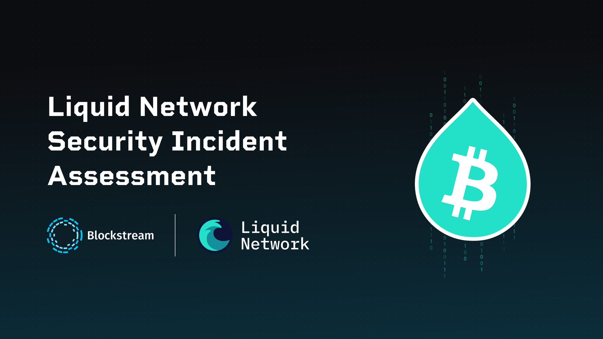
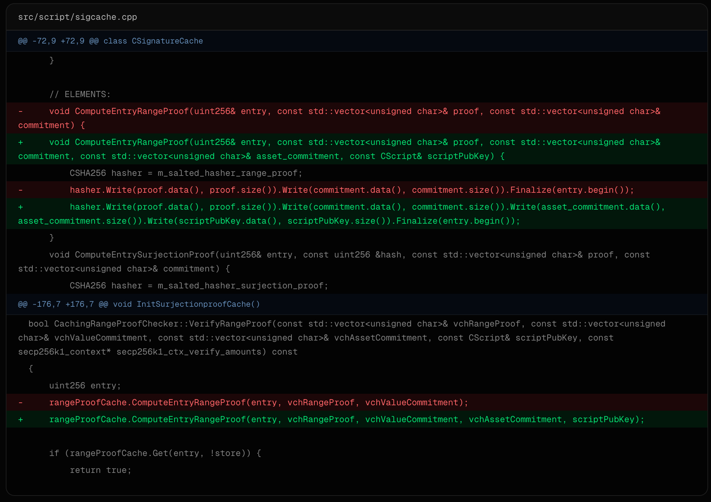

> *作者：Blockstream Team*
> 
> *来源：<https://blog.blockstream.com/liquid-network-security-incident-assessment/>*

*<strong>读者须知</strong>：本报告中的信息在出版之日为最新信息，并且可能随着研究的进展而更新。技术声明来自内部和外部文档、技术支持源材料以及区块链分析。感谢 Liquid 联盟董事会以及功能性节点运营者的密切合作，以及来自广大比特币开发者社区的审核与支持。*

## 章节 1：事故摘要

UTC 时间 2026 年 9 月 6 日 13:53（Liquid 区块 4,050,336），一名攻击者爆破了 Elements 实现的 “范围证明（range proof）” 的验证承诺缓存中的一项漏洞；该漏洞允许一笔交易通过验证程序，即便其输出的价值没有输入的价值作为支撑（也即增发货币）。Liquid 节点，包括联盟的功能性节点，接受了这笔交易，它使得 LBTC 的供给量膨胀了大约 4,000 LBTC —— 这些 LBTC 并无等值的 BTC 作为担保。

然后，这名攻击者通过 Liquid 网络的标准脱锚（peg-out，退出侧链）流程移动了这些没有担保的 LBTC，放行的是 [SideSwap](https://sideswap.io/?ref=blog.blockstream.com)，一位持有脱锚授权密钥（PAK）的 Liquid 联盟成员。这个过程产生了一笔价值大约 4,000 BTC 的[取款](https://blockstream.info/tx/8db751a650ae2f12006b7e8c69a75e4df360e8afd6b9e05ae0b9fa6458a7b140?ref=blog.blockstream.com)，在比特币区块高度 965,783 处确认。此后还有一些数额较少的脱锚操作得到确认， 让 Liquid 侧链的储备金从 4,205 BTC 下降到了 197 BTC ，随后网络的运行被中止。

所有其他类型的在 Liquid 上发行的资产（USDt、DePix 以及其它 token 化资产）不受本次事故影响，虽然在网络停摆期间，用户同样无法使用这些资产。

事故发生的几个小时内，该攻击者[在区块链上承认了](https://blockstream.info/tx/c103de95817b43f2df635ec6f35ff126ca26a7c6d20570c4b01866b2b3e69a19?ref=blog.blockstream.com)，并在多轮谈判之后，退还了 3,400 BTC（UTC 时间 9 月 7 日的 16:09 ，比特币区块高度 965,950）。大约 602 BTC 仍未退还。

攻击发生不久后，Blockstream 公司便协调叫停了 Liquid [桥梁节点](https://github.com/ElementsProject/elements/blob/master/contrib/seeds/liquid/nodes_main.txt?ref=blog.blockstream.com)（用户可以连接的公开节点），在几个小时内部署了紧急临时补丁，并在几天后发布了一份经过全面审核的加强版本：[Elements v23.3.4](https://github.com/ElementsProject/elements/releases/tag/elements-23.3.4?ref=blog.blockstream.com) 。

本报告的用意是阐述事件的经过，以及 Blockstream 公司和 Liquid 网络如何应对这次意料之外的攻击。

## 章节 2：Liquid 网络的架构以及安全不变量

Liquid 网络是一个进入生产环境的比特币侧链，其内核为 [Elements](https://docs.liquid.net/docs/elements-vs-liquid?ref=blog.blockstream.com) ，这是 Blockstream 公司开发的一款开源的区块链实现。Liquid 使用 Elements Core，但有专门的参数、共识配置和联盟，这个联盟由 15 个地理分散的功能性节点组成。需要来自 15 个功能性节点中至少 11 个的签名，才能在 Liquid 网络中产生一个区块。

其中三项架构性属性，对于理解 9 月 6 日的安全事故至关重要：

**1) 1:1 的 BTC 储备**。通过锚定（peg-in）程序在比特币区块链上锁定的 BTC，与在 Liquid 网络发行的 LBTC 在数量是 1:1 匹配的。并且，只有烧掉一些 LBTC，才能通过脱锚程序释放对应数量的 BTC。这种锚定关系，完全依赖于共识能够正确验证：没有对应且可证有效的交易，就无法创造 LBTC 。在脱锚的时刻，没有独立的、链外的储备金检查，脱锚机制完全依赖于侧链自身的经过验证的状态。

**2) 机密交易和范围证明的验证**。Liquid 网络遮掩了交易的数额和资产类型（使用 “Pedresen 承诺”）。每个机密输出都附带一个零知识的范围证明，证明其数额在一个有效的范围内，但不会揭晓具体数值；一个 “满射证明” 会将这个输出的资产生成器绑定到一种有效的输入资产。范围证明自身之证明一个数值在一个范围内。共识规则将它与一笔交易的资产生成器和 `scriptPubKey`（脚本公钥）关联起来，从而这个证据仅对一个具体位置的具体输出有意义。Elements 会缓存这种昂贵检查的结果，以避免在交易池和区块的验证中重复验证同样的证据。

**3) 基于 PAK 的脱锚授权**。根据 [Liquid 联盟成员章程](https://liquid.net/Liquid-Federation-Charter.pdf?ref=blog.blockstream.com)以及 “PAK 条目创建指令”，每一个 PAK 条目都有两个密钥，各自承担不同角色。

- **A）离线密钥**。这是一个比特币扩展公钥（`xpub`），是从这个成员的冷钱包派生的。它让功能性节点的 HSM（硬件签名模块）可以验证一笔脱锚交易的输出目的地属于一个注册过的 PAK 条目，无需知道该钱包私钥。脱锚的资金会移动到从这个密钥派生的收款地址。章程要求各成员 “保持这个比特币收款钱包离线且安全”。这让充当 LBTC 担保的比特币保持安全，即使一个攻击者能攻破其它防线。
- **B）在线密钥**。这是一个 `secp256k1` 密钥。它在私钥就放在一个运行中的 Elements 节点中，在这个节点的脱锚钱包里。它会保持在线，因为它要签名脱锚请求。

换句话说，PAK 授权控制着两件事：它控制着 BTC 可以 *去哪里*（离线密钥）、同时控制着 *谁* 能请求支付 BTC（在线密钥）。

离线密钥是上游故障的安全网。举个例子，如果共识验证出了错误、接受了坏的 LBTC，那么一个完全离线的收款钱包依然能扣住请求释放的 BTC 。 必须有人手动接触冷存储并从中移出资金。这需要实现，这个时延就给了联盟一个窗口期，可以在比特币离开掌控之前发现问题、作出反应。

## 章节 3：漏洞分析

两个漏洞让攻击者这次可以从 Liquid 网络盗取 BTC：(1) Elements 中的共识漏洞（下文描述为 “Bug A & B”；(2) 成员的 PAK 签名配置流程中的一个空白。我们后文会详细说明这两个漏洞。

### Bug A & B

Bug A 根源于一条包含在 [Elements PR #335](https://github.com/ElementsProject/elements/pull/335?ref=blog.blockstream.com) 中、编写于 [2018 年 4 月的代码提交](https://github.com/ElementsProject/elements/commit/957216523881768d9bcd6c5092dd5d50495dcd4e?ref=blog.blockstream.com)，这个 PR 在 [2018 年 5 月 30 日合并](https://github.com/ElementsProject/elements/commit/884005b?ref=blog.blockstream.com)到 Elements v0.14.1 。这项变更简化了范围证明的缓存键（key），不再包含资产承诺和 `scriptPubKey` ，这意味着，一个缓存起来的结果不会绑定某个验证范围证明的语境，而是所有语境都可以使用。

这是一个致命的共识 bug 。在某些条件下，一个节点可能会复用一个以前缓存的结果，在一个范围证明实际无效的语境下接受它，而另一个没有缓存这个结果的节点却会拒绝同一笔交易。因为共识要求所有的节点在验证一个区块时得到相同的结果，这种区别会导致网络分裂，可能会导致正常的区块生产崩溃或者停滞。

> 这个范围证明缓存键是这样计算的：`SHA256(nonce ‖ rangeproof ‖ value_commitment)`，其中没有资产承诺和 `scriptPubKey`,虽然这两者是范围证明验证的一部分。结果是，一旦一个 `(rangeproof, value commitment)` 对被缓存，节点就会把这一对当成是有效的，即便用在另一个资产承诺或脚本中，也不会再次运行范围证明验证。因此，保存了这个缓存条目的节点可能会错误地接受一笔交易，而使用冷缓存的节点会拒绝它，这就产生了共识上的不匹配，可能会导致区块链分裂并产生陈腐区块。

这个漏洞是在 2018 年引入的，而底层的缓存键设计则是在后来的 [2019 年代码重构](https://github.com/ElementsProject/elements/commit/0b5066143dcdfc3ba7780d1a2c6f18c2c6fefd6a?ref=blog.blockstream.com)中进入机密资产验证实现的。在此之后，软件的相关动作就一直保持不变，直到 2026 年。

整个行业一直都知道此类微妙故障的存在已经难以根除。在广泛的区块链生态系统中，密码学和共识代码中的潜在漏洞可能存在同样长时间而不被发现，甚至得到更多审计的项目也难以避免。安全审核天生最关注新增代码或者变更中的代码。稳定的、长期运行、通过了以往的审核、长时间无故障运行的代码，在标准的审计框架中会被当成更低风险的 —— 这种确定优先级的方法，反映的是广泛采用的软件安全实践。

AI 辅助的分析工具的出现，开始让视线转向遗留下来的代码库。这些工具可以搜索大体量的代码库、比较历史变更并测试潜在的爆破路径，并传统的只靠手工的审核更加高效。鉴于此次安全事故，Blockstream 和 Liquid 网络持续将这些新能力吸收到开展中的审核程序中（详见 “章节 6”）。

### Bug A：披露、验证和补救

| 日期              | 来源                                            | 备注                                                         |
| :---------------- | :---------------------------------------------- | :----------------------------------------------------------- |
| 2026 年 8 月 2 日 | 外部安全研究者，发送到 Blockstream 安全部门邮箱 | 报告了 Bug A，同一天先后提交了两种修复措施：一种是直接的字节拼接方法，另一种是更全面的以长度为前缀的序列化方法。 |
| 2026 年 8 月 3 日 | Blockstream， QA AI 扫描审核                    | 内部修复启动，通过字节拼接延伸缓存键；同一天部署到桥梁节点和测试网桥梁节点。 |
| 2026 年 8 月 4 日 | Blockstream Liquid 团队，辅助性 AI 扫描审核     | 在常规的 QA（质量评估）流程之外，使用额外的 AI 辅助的审核能力（Kimi-K3）来扫描 Elements 代码分支。 |
| 2026 年 8 月 5 日 | Blockstream                                     | 通过一笔缓存投毒交易，在 Liquid 测试网上验证修复措施；确认它解决了 Bug A，但没有测试 Bug B 背后的字节边界条件，那时候还不知道有 Bug B 。 |
| 2026 年 8 月 7 日 | 外部安全审核介入                                | 独立识别出了相同的漏洞并提供了可用的概念验证，提议直接拼接字节的方法，还有 5 项其它低风险漏洞。 |

在 5 天内，三次独立的审核（外部研究者的报告、Blockstream 的内部审核以及一次专门的外部参与（Bitcoin Red Team））得到了相同的归因。这给了 Blockstream 明确的信号：Bug A 是真实的、严重的。收到第一份报告开始，几天内就开始开发修复。

外部研究员 [stutxo](https://github.com/stutxo?ref=blog.blockstream.com) 提出了两种修复措施：第一种是直接拼接方法，向缓存键添加缺失的字段；第二种是更泛用的方法，使用以长度为前缀的序列化，在每个字段之间提供了更强的隔离。

Blockstream 在2026 年 8 月 3 日开启了一项内部修复，使用直接拼接方法。当时的第一目标是通过添加缺失的资产承诺和 `scriptPubkey` 来修复 Bug A 。同一天，这项修复部署到 Liquid 网络的桥梁节点，马上为功能性节点提供了保护；几乎所有交易都是经过桥梁节点才送达区块生产节点。

这项修复措施经过了 Blockstream 的标准 QA 流程中的人工审核以及一次专门的 AI 辅助审核。这些审核确认了修复措施已经添加了正确的字段，这是准确的。后来变成 Bug B 的字节拼接问题是另一种单独的漏洞类型 —— 是一种二阶交叉作用，没有被三次独立审核中的任何一次发现，包括外部研究员的分析。

外部研究员的更泛用的以长度为前缀的序列化方法，处理的是另一个非生产环境分支中的问题。Blockstream 的工程团队评估了两种方法，然后认定直接拼接方法是所报告的漏洞的合适补救措施。以长度为前缀的方法解决了被补救的具体故障以外的广泛序列化问题。两种方法对所报告的问题都是合理的工程选择。字节边界漏洞是后来才作为 Bug B 浮出水面的，是一个单独的漏洞，当时没有任何审核人发现了。

测试和审核是并行开展的。从 8 月 4 日开始，Blockstream 部署了额外的第三方 AI 辅助分析功能，在常规 QA 流程之外扫描 Elements 代码分支，得出的结果也会由工程师人工复核。这项工作先施行在一个车非生产环境的分支中，但这个分支已经包含了同样的字节拼接方法（正是后来发布到生产环境中的修复措施）。字节边界漏洞（Bug B）潜藏在被审核的代码中，但不论是 AI 扫描还是辅助性的人工审核都没有发现它 —— 这跟前述事实是一致的：没有审核人，不论是外部的还是内部的，在那时候发现了这个漏洞。

8 月 5 日，Blockstream 专门在 Liquid 测试网上测试了修复措施，使用了一笔专门用于复现 Bub A 的缓存投毒交易。修复措施正确地抵御了攻击，并且解决了由 Bug A 导致的 冷/热 缓存共识分裂。这项测试的设计目标是验证针对已知漏洞的修复措施。构成 Bug B 的字节边界碰撞还未被任何人识别出来，因此也不在测试范围内。

这些检查完成后，部署流程继续。在 8 月 11 日之前，15 个功能性节点中已经有 13 个在运行更新，其余节点也很快就跟上了。

在 2026 年 9 月 1 日，[Blockstream 在 Elements 代码库公开了修复措施](https://github.com/ElementsProject/elements/commit/c26d719c29a40da280a825b25657e9c3d8bc7d99?ref=blog.blockstream.com) 。在 9 月 3 日，所有跟踪外部报告及其补救措施（包括本次修复）的内部资料，都将此漏洞标记为已解决。

### Bug B：问题根源以及部署之后的审核

修补 Bug A 的措施将缓存键延伸为包含资产承诺和 `scriptPubKey` 。但问题不在于添加了什么字段，而在于这些字段的组合方式：

- <a href="https://github.com/ElementsProject/elements/commit/212c43f475fc202b5b9e6dbb1f1c616e1a06a6f7?ref=blog.blockstream.com"><code>212c43f</code></a> 号提交的代码差异 -

这段代码将每个字段的裸字节依次写入待哈希的序列，没有长度前缀，也没有分隔符。这就是 Bug B 。

这些字段中的两个，数值承诺和资产承诺，都是固定的 33 字节长。另外两个，范围证明和 `scriptPubKey`，长度是不确定的。范围证明有一个内嵌的头，编码了其长度，而 `scriptPubKey` 作为最后一个字段，只要所有其他字段都有长度前缀，将不需要长度前缀。

然而，范围证明内置的长度前缀，只会在范围证明验证中检查，而验证缓存正是为了跳过检查。因此，从验证缓存的角度看，范围证明只是一个长度不定的字节序列。因此，攻击者可以裁剪或延长范围证明、调整 `scriptPubKey` 来补偿，从而产生一笔带有无效范围证明的交易，但验证缓存会断言这笔交易是有效的。

[`Bitcoin Core` 中的看起来类似的代码](https://github.com/bitcoin/bitcoin/blob/f839ee1afb0ff02c58422dae6d2678e5e654b605/src/script/sigcache.cpp?ref=blog.blockstream.com#L39-L43)，基于（长度不定的）公钥以及（长度不定的）签名的拼接来缓存签名的有效性，却没有漏洞，因为在调用验证缓存之前，会先检查这些对象内嵌的长度前缀。

在现实中，这名攻击者使用了相同的资产承诺以及同一个目的地脚本的最后一个字节，作为已经被验证过的、合法缓存的交易。这将攻击难题缩减为一个在范围证明与缓存键之间发现碰撞的问题。最终的字节流 —— 攻击者的【更长的证据 + 修改过的数值承诺 + 复用的资产承诺 + 更短的脚本】—— 跟最初被缓存的字节流，是一模一样的，虽然其底层的证据和数值承诺是不一样的。因为一旦命中缓存就会完全跳过验证，伪造的范围证明实际上无需通过验证，因为只要产生一样的字节，它就能完全绕过验证。

这就是 Bug B：一种专门构造的字节重合，因为哈希函数输入的所有字段都没有长度前缀而成为可能。

**没有审核人，不论内部或外部的，在它被利用之前识别出了这种风险**。

三次独立的审核，每一次都有内部工程师的人工复核，检查了可爆破版本和修复后版本的相关代码。

- 作为 Blockstream 内部 QA 流程的一部分，一个 AI 辅助的代码审核确认了正确的字段（资产承诺和 `scriptPubKey)`）已被包含在缓存键中。这项审核的范围被恰当地限定在验证修复措施对已报告的漏洞的有效性。
- 测试网上的一项功能测试确认了修复措施可以堵住一个缓存好的证据的跨语境复用。而字节边界碰撞还没因为任何人识别到，因此不在测试范围内。
- 一项辅助性的、独立的 AI 辅助扫描，使用了当时可用的一个较新的开放权重的模型，通过 PremAI（Kimi-K3）审核了 Elements 29.x 的代码分支，作为 Blockstream 常规 AI 扫描流程的广泛审核的一部分。工程师们也人工复核了扫描及其发现。这份代码已经包含后来进入 23.x 生产环境分支的相同 Bug A 修复措施，也包含相同的没有前缀的字段拼接。被扫描和任何审核的代码已经出现了 Bug B，但没有识别出漏洞 —— 这个结果跟其他每一个审核人的经验一致，包含最初报告 Bug A 的外部研究者。

### 爆破机制与扩散

攻击者的交易（txid 为 [`f24a4b179b5cc7e88b25a763911f7cbdf2bf45d1d1b5ab611e94461cef0a183f`](https://blockstream.info/liquid/tx/f24a4b179b5cc7e88b25a763911f7cbdf2bf45d1d1b5ab611e94461cef0a183f?expand&ref=blog.blockstream.com)）在 Liquid 区块高度 4,050,336 处确认，当时为UTC 时间 2026 年 9 月 6 日 13:53 。它创建了一个机密输出，其价值实际上并无输入来支撑。这本是范围证明想要防止的事情。但 Bug B 让它通过了验证。

这笔交易的缓存键字段（不带长度框架的字节拼接）， 产生了一个与先前的合法的、经过验证的范围证明缓存条目相同的字节串。任何功能性节点，或持有较早条目的节点，都会把这个新证据当成已经验证过的，不再运行检查。

并不是每个节点都经历了一样的事情。分裂反映了各节点自身的缓存内容（刚好验证过并缓存了哪些范围证明，但并不受所运行的软件版本的影响）。当时，所有 15 个功能性节点都运行同样的修复版软件。只有从较早的、正式的验证中保存了匹配条目的节点，其缓存才会返回一个 “通过” 的结果。缓存中有这个条目的节点就会接受这个区块。而使用冷缓存的节点，或者依然存在 Bug A 的节点，会运行真正的节点，并传出失败，然后拒绝这个区块。

当大约 4,000 个无担保的 LBTC 进入了被网络接受的链状态，对于每一个（接受了它们的）节点，它们就跟真正的 LBTC 无法区分了。机密交易遮掩了数额和资产类型，但不遮掩地址或者说交易图谱。所以，虽然事后可以合理地检查区块链，但在当时，只靠例行的检查是无法发现这项异常的。

然后，这些无担保的 LBTC 进入了由 SideSwap 处理的脱锚请求中，并在 UTC 时间 14:28 在比特币区块链上得到确认（在最初那笔交易确认的大约 36 分钟后），远远早于 Blockstream 能够协调起来叫停桥梁节点的时间（UTC 时间 18:26）。

所有建立在这两个无效输出之上的交易（总计 4 个后代），后来都在复原流程中从正统的链状态中删除（详见 “章节 5”），因为它们要么本身是无效的，要么完全来自无效的输出。

### SideSwap PAK 和脱锚控制

SideSwap 是 Liquid 联盟的成员之一，持有一个 PAK 条目，这让它可以移动 LBTC 离开侧链，将价值转移到一个预先注册的比特币地址。SideSwap 的 PAK 本身并没有暴露，也没有遗忘或失盗。脱锚流程能走完，是因为 SideSwap 的节点和联盟的功能性节点已经接受了这些没有担保的 LBTC、把它们当成是有效的，然后收到了脱锚请求。PAK 机制授权了一个真实的签名请求，被请求的 LBTC 本身没有担保，却已经被共识不正确的接受了。

事故发生后，[SideSwap 发表了一份声明](https://sideswap.io/news/statement-on-the-liquid-network-incident-of-6-september-2026/?ref=blog.blockstream.com)，曝光了在运营脱锚服务时的两项经营性决定，它们对事故产生了影响。

其一，SideSwap 承认了，脱锚签名密钥一直是在线的，尽管联盟章程明确要求应该让这个密钥离线；并且，支付会自动发送给提出请求的客户，就在提出脱锚请求的同一个比特币区块中。SideSwap 承认，如果采用有延迟的、人工审核的清账流程，将让这些 BTC 可以找回。

其二，SideSwap 没有对脱锚订单应用数额限制、流出速度控制或钱包历史检查。一个价值大约 4,000 LBTC 的订单，其数额达到占据了流通数量的巨大比例，就这样在没有人工审核的情况下流出了。

## 章节 4：事故时间线

| 日期/时间                    | 事件                                                         | 来源                                                         |
| :--------------------------- | :----------------------------------------------------------- | :----------------------------------------------------------- |
| 2018 年 4 月 25 日           | 简化范围证明缓存键实现，从缓存键抛弃了资产承诺和交给公钥；引入 Bug A | [Elements GitHub](https://github.com/ElementsProject/elements/commit/957216523881768d9bcd6c5092dd5d50495dcd4e?ref=blog.blockstream.com) |
| 2019 年 3 月 19 日             | 在大范围重构中，同样的两字段范围证明缓存键设计进入后续的机密资产验证实现中；Bug A 持久化 | [Elements GitHub](https://github.com/ElementsProject/elements/commit/0b5066143dcdfc3ba7780d1a2c6f18c2c6fefd6a?ref=blog.blockstream.com) |
| 2026 年 8 月 2 日             | 外部研究员向 security@blockstream.com 报告 Bug A             | Stutxo                                                       |
| 2026 年 8 月 3 日           | Blockstream 开启了一项内部修复以供审核，并在同一天部署到生产环境和测试网桥梁节点 | Blockstream                                                  |
| 2026 年 8 月 4 日               | Blockstream 制作了一个概念验证的缓存投毒交易，用于测试网验证修复措施的有效性 | Blockstream                                                  |
| 2026 年 8 月 5 日               | Blockstream 在 Liquid 测试网上验证了修复措施 | Blockstream                                                  |
| 2026 年 8 月 6 日              | 进一步的 Blockstream 内部审核确认了 Bug A | Blockstream                                                  |
| 2026 年 8 月 7 日               | 外部安全团队报告了 Bug A 并提供了一个可用的概念验证 | Bitcoin Red Team                                             |
| 2026 年 8 月 11 日            | 15 个功能性节点中的 13 个升级到了修复 Bug A 的软件 | Blockstream                                                  |
| 2026 年 9 月 1 日           | Bug A 的修复措施合并到了公开的 Elements 仓库。从这个事后开始，包含 Bub B 的代码就公开可见了。 | [Elements GitHub](https://github.com/ElementsProject/elements/commit/c26d719c29a40da280a825b25657e9c3d8bc7d99?ref=blog.blockstream.com) |
| 2026 年 9 月 3 日          | 跟踪外部报告的内部文档将 Bub A 标记为已经解决。 | Blockstream                                                  |
| 2026 年 9 月 6 日，13:53:10  | 攻击者爆破了 Bug B，大约 4,000 没有担保的 LBTC 在原本的 Liquid 区块 4,050,336 被创造出来（后来这个区块被重组） | [Liquid transaction](https://blockstream.info/liquid/tx/f24a4b179b5cc7e88b25a763911f7cbdf2bf45d1d1b5ab611e94461cef0a183f?ref=blog.blockstream.com) |
| 2026 年 9 月 6 日，14:00     | 攻击者使用较少的数量（2.5 LBTC）测试了脱锚；SideSwap 在一分钟之后，从自己的仓库支出了 2.49749857 BTC | SideSwap                                                     |
| 2026 年 9 月 6 日，14:05     | 攻击者向 SideSwap 的脱锚服务存入了 4,000 LBTC | SideSwap                                                     |
| 2026 年 9 月 6 日，14:10     | Blockstream 的监控服务报告，一个 Liquid 区块变成了陈腐区块 | Blockstream                                                  |
| 2026 年 9 月 6 日，14:28:56  | 联盟签名人在比特币主网上释放了 3,996.02 BTC ；SideSwap 在同一区块中转发了 3,995.99999857 BTC | [Release tx ](https://blockstream.info/tx/8db751a650ae2f12006b7e8c69a75e4df360e8afd6b9e05ae0b9fa6458a7b140?ref=blog.blockstream.com)\| [forwarding tx](https://blockstream.info/tx/85d2ca15bea33a592e73ed40c6a5da887feecf1e77f58ec7f580e00841645043?ref=blog.blockstream.com) |
| 2026 年 9 月 6 日，18:26     | Blockstream 协调中止了 Liquid 桥梁节点，网络暂停运行         | Blockstream                                                  |
| 2026 年 9 月 6 日，18:30:10  | 攻击者在区块链上发文：“我们是白帽子黑客，请在链上联系我们。” | [Bitcoin transaction](https://blockstream.info/tx/c103de95817b43f2df635ec6f35ff126ca26a7c6d20570c4b01866b2b3e69a19?ref=blog.blockstream.com) |
| 2026 年 9 月 6 日，19:31     | Blockstream 在区块链上回复：“ 请联系 security@blockstream.com 。” | [Bitcoin transaction](https://blockstream.info/tx/91271efcbb5ab29abfc38ae635f0644e3ba042aad56f92d40136e1dde4742fe8?ref=blog.blockstream.com) |
| 2026 年 9 月 6 日，20:25     | Liquid 公开披露了事故，确认桥梁节点已经停用，以及侧链暂停运行 | [Liquid Network on X](https://x.com/Liquid_BTC/status/2096696272447218108?ref=blog.blockstream.com) |
| 2026 年 9 月 7 日，01:09     | Blockstream 部署了紧急临时补丁并协调桥梁节点更新 | Blockstream                                                  |
| 2026 年 9 月 7 日，16:09:25  | 攻击者向联盟锚定钱包返还了 3,400 BTC | [Bitcoin transaction](https://blockstream.info/tx/a6d697a25266ce3c78774fd1d75f896b7af522ada209b0f6228ea497bc49a46d?ref=blog.blockstream.com) |
| 2026 年 9 月 8 日，19:06     | 经过内部和外部审核后，加强的 Bug B 修复措施合并到 Elements 23.3.x 发行办分支 | [Elements PR #1600](https://github.com/ElementsProject/elements/pull/1600?ref=blog.blockstream.com) |
| 2026 年 9 月 8 日，19:10     | Liquid 发布了详细的事故报告，介绍了爆破过程、对储备金的影响、补救措施以及复原情况 | [Liquid Network on X](https://x.com/Liquid_BTC/status/2097404704028545175?s=20&ref=blog.blockstream.com) |
| 2026 年 9 月 9 日，03:14     | Elements v23.3.4 在 GitHub 作为预先发行版公开，包含了加强的证据缓存实现以及 Bug B 修复措施 | [GitHub pre-release](https://github.com/ElementsProject/elements/releases/tag/elements-23.3.4?ref=blog.blockstream.com) |
| 2026 年 9 月 9 日，13:30     | Liquid 公开宣布了 Elements v23.3.4 版本以及分步骤地网络复原计划。本发行版完全公开，计划用于生产场景 | [Liquid Network on X](https://x.com/Liquid_BTC/status/2097695714310521331?s=20&ref=blog.blockstream.com) |
| 2026 年 9 月 9 日，21:05:10  | 区块生产在正确的 Liquid 区块链上恢复，替代了原来的 4,050,336 区块，直接跟在爆破之前的 4,050,335 区块之后。锚定操作依然未恢复 | [Blockstream Explorer](https://blockstream.info/liquid/block/d4eeaa1122dab906155a803ababb83ceb7afbb4ae102b37014c9093f879fd341?ref=blog.blockstream.com) |
| 2026 年 9 月 9 日，21:11:10  | 在正确的 Liquid 链上重放经过验证是有效的交易；Liquid 区块 4,050,337 包含了 329 笔交易，因为有效的交易历史已经恢复 | [Blockstream Explorer](https://blockstream.info/liquid/block-height/4050337?ref=blog.blockstream.com) |
| 2026 年 9 月 10 日，10:00    | Liquid 报告称受控制的区块生产继续，尽管还没有新的用户交易，但可以监控网络的稳定性。锚定操作依然未恢复 | [Liquid Network on X](https://x.com/Liquid_BTC/status/2098025275921490281?ref=blog.blockstream.com) |
| 2026 年 9 月 10 日，12:31:10 | 用户交易活动重新出现在正确的链上。Liquid 区块 4,051,244 包含了常规区块服务交易以外的交易类型，证明交易处理已经恢复 | [Blockstream Explorer](https://blockstream.info/liquid/block-height/4051244?ref=blog.blockstream.com) |
| 2026 年 9 月 10 日，19:55    | Liquid 公开确认跨网络的交易已经恢复，但脱锚操作在最终复原阶段之前保持禁用。 | [Liquid Network on X](https://x.com/Liquid_BTC/status/2098140614239920622?ref=blog.blockstream.com) |

时间都是 UTC 时间。链上事件使用确认区块的时间戳（如果有的话）。内部操作事件使用 Blockstream 的记录。公开更新使用声明的 “截止” 时间；在没有截止时间时，使用出版的时间。9 月 6 日 14:00 和 14:05 的条目基于 SideSwap 的公开的事故时间线。

## 章节 5：迁移，修复和复原

**立即止血（2026 年 9 月 6 日）**。Blockstream 在 UTC 时间 18:26 协调桥梁节点离线，从而停止了后续的交易确认，包括脱锚交易。Blockstream 同时通知交易所暂停 LBTC 存入和取款。这些措施遏制了事故满意，并且阻止了后续的未经授权的资金转移。

**紧急补丁（2026 年 9 月 7 日，01:09）**。 Blockstream 在完全发布 23.3.4 之前协调桥梁节点升级，关闭了相同的漏洞路径。

**Bug B 根源修复（在 2026 年 9 月 8 日合并，在 2026 年 9 月 9 日发行的 v23.3.4 公开）**：

> Elements PR #1600 · [commit 9400096](https://github.com/ElementsProject/elements/commit/94000967f6dc05b1afd435e79b1bbc597e29f816?ref=blog.blockstream.com)
>
> 范围证明和满射证明的缓存哈希从裸的 `CSHA256` 拼接切换为 `CHashWriter `(`SER_GETHASH`)。这会使用长度前缀来序列化每一个字段，所以不同的参数元组，即使能够裸拼接出一模一样的字节，也不会再碰撞得到相同的缓存键。

向全部 4 个字段（而不仅仅是变长的两个字段）添加长度前缀，确保新的代码将保持正确，不论周围的语境，包括即使现在是固定长度、未来变成不定长度；或其长度前缀的验证程序发生变化。使用 `CHashWriter`( `SER_GETHASH`) ，每个字段都会用显式的长度标记（放在其字节前面）来序列化，所以字节序列无法用两种不同方式来阅读。 现在，没有两个不同的 【`proof`，`commitment`，`asset_commitment`，`scriptPubKey`】输入能够产生相同的序列化字节流，不论各字段是定长还是变长。这项修复措施也添加了一个 `-norangeproofcache` 启动选项，让运营者可以自选禁用缓存。

这项修复措施在发布之前经过了内部和外部的多轮审核，包括由外部团队主持的；并且， Blockstream 将为所有共识关键和密码学相关的变更采取同等审核标准。 （详见 “章节 6”）。

**链复原**。因为事故依赖于缓存漏洞，所以 Blockstream 可以识别出非法的通胀，办法就是在不使用缓存的前提下重播和验证受影响的链上的交易。禁用缓存后，Elements 正确地拒绝了依赖于 Bug A 和 Bug B 的交易，而不会复用以往缓存的结果。然后，我们的团队独立地使用 `rust-elements` 交叉检查了结果。

这给了 Blockstream 一种确定性的办法来识别无效交易及其后代。链上审计识别出两个非法输出以及四个后代，为复原重组提供了通用、可验证的基础。结果是，Blockstream 已经验证了，没有因为 Bug A 和 Bug B 引起的通胀还留在当前的 Liquid 链上。

然后，Blockstream 推出了一个分步骤的复原方案（现在仍在进行中），并且并行测试：

1) 恢复区块生产，但暂停脱锚操作。
2) 重播已经独立验证为有效的交易。
3) 在网络状态完全恢复后，恢复锚定操作。

**储备审计**。Liquid 的储备受到了非法交易以及在事故当中正在进行的常规脱锚操作的影响。因为非法交易而受到影响的部分， 3,400 BTC 已经归还。剩下大约 602 BTC 依然有待进一步努力。

根据[最新的公开播报](https://x.com/Liquid_BTC/status/2100696334596452426?s=20&ref=blog.blockstream.com)（2026 年 9 月 17 日，UTC 时间 21:05），复原计划还在积极测试中，有待修订。在单独确定安全性之前，不会推进。

## 章节 6：教训 & 纠正动作

Blockstream 收到关于 Bug A 的第一份报告之后，在 24 小时内就确定了优先级并予以补救，并在一周内通过两个额外的信道独立确认了漏洞。没有漏过报告，也没有无视警告，也没有暴露密钥。尽管如此，Blockstream 还是全面反思了自己的工程和安全流程。以下行动是审核的成果。

**1) 对共识攸关问题的补救选择**

最先报告 Bug A 的外部研究员提交了另一种更全面的修复措施，使用以长度为前缀的序列化方法。这种方法在被合并的字段之间提供更强大的分隔。它也代表了一种侵入性更大的变更，并且针对的是另一个非生产环境的分支。当时，Blockstream 的内部审核人员评估这项广泛的变更已经超出了修复被报告的问题的要求。因此，基于当时可得的信息，为生产分支选择了狭义的修复措施。

*行动：当一个共识关键问题存在多种补救措施时，应该把提供更强壮结构性安全保证的方法当成默认措施，即使需要更广泛的变更。任何偏离这种默认路径的方法都需要理由和许可。此外，Blockstream 即将增设一个要求，在发布影响生产环境的共识软件的关键修复之前，必须经过独立的安全审查员的审核。*

**2) 反复审查共识关键的代码**

Bug A 在代码库中存在了那么久，一部分原因是因为其所在的代码部分是稳定的。Blockstream 的安全审核程序与业界的普遍情形一样，专注于新的、变更中的代码。在 AI 扫描中也应用了同样的逻辑。 Blockstream 的内部扫描程序以固定的顺序扫描各个产品。在修复措施合并之前，AI 扫描已经按习惯轮换到其它代码库。不过，Blockstream 的工程流程，与 QA 轮换独立的部分，在事故发生之前就已经开始利用临时的 AI 扫描，作为常规流程的补充。章节 3 所述的独立扫描正是这项行动的一部分。这表明，辅助性扫描的价值已经在内部得到承认，并且开始服役。

*行动：共识关键的代码库将经历两种审核。第一种，任何合并到发行版分支的变更都会触发一次安全扫描；第二种，关键的共识代码将经历循环扫描，即便其最近未发生变更。工程团队还将拥有后备资源，在有变更或者有发现时调用辅助性的 AI 扫描。*

**3) 敌意测试**

Bug A 也表明，休眠的漏洞可以一直隐藏，直到有人主动寻找打破一项假设的办法。代码审核，不论是由工程师、审计员还是 AI 系统开展，只是一层防御。在这次事故的响应中，Blockstream 开发了工具来搜索历史区块链数据和交易池以寻找范围证明的缓存碰撞，以及一个零缓存的重验证工具，不依赖于以往缓存的结果来验证。这些工具最初是在事故应对中开发的。但它们将帮助更早发现类似的条件，将成为永久的。

*行动：Blockstream 正在持续强化其内部的安全攻防能力，以使用人工或 AI 辅助的技术，定期测试生产环境软件。在此期间开发的事故响应工具将持久化。Blockstream 将扩展它在模糊测试、突变测试、符号化中的作用，以及（如有可能）为共识关键代码运行形式化验证，同时监控链上出现的反常交易活动。*

**4) 为依赖于语境的证据缓存一个裸验证结果，本身就是一种脆弱的模式，不论缓存键是如何构造的**

正确的键构造可以防止本次事故的发生，但底层的模式（信任一个缓存的布尔值而不重新派生验证的语境）依然是一个风险点，Blockstream 识别出了问题，并选择专门解决，不论外部报告意见如何。

*行动：Blockstream 正在实现一种深度防御的强化措施：此类语境敏感的缓存将携带一个带有版本号的方案标签，并且在查找时将强制重新检查语境。这第二层的防御措施独立于键的构造，反映了 Blockstream 消除此类潜在问题的承诺 。*

**5) 外部研究员在开源软件安全性中扮演着有价值的角色， Blockstream 正在为他们铺路**

如果研究员有清楚的办法能够尽责地抢先披露漏洞，关键的开源基础设施将受益。虽然 Blockstream 长期维护一个安全问题报告频道（security@blockstream.com）并拥有收到报告后及时响应的良好记录，导致发现 Bug A 的披露过程已经显示了将这些路径规范化的价值。

*行动：Blockstream 正在为 Elements 和维护中的其它开源基础设施建立一个专门的 bug 赏金计划。这个计划将为善意的安全研究提供结构化的激励、明确定义的范围和安全港保护。*

**联盟的治理 & 回顾**

Liquid 联盟董事会和 Blockstream 都广泛审核了治理、安全性和运营方案。这项工作建立在事故发生之前就已在进行中的治理改革基础上，已经在上一次 Liquid 峰会中讨论。

Liquid 联盟将在正式采用之后发布更新。

## 章节 7：致谢

这次事故，以及响应措施，包含了来自 Blockstream 之外的许多人的贡献，我们希望表达谢意。

我们感谢 [stutxo](https://github.com/stutxo?ref=blog.blockstream.com) ，这位外部研究员最先通过我们的安全邮箱报告了 Bug A，并提供了研究它所需的信息。此类尽责披露对于开源基础设施的安全性是至关重要的，而且 stutxo 选择通过合适的频道来报告它（而不是直接爆破它）的举动，反映了安全研究社区的最高标准。我们也感谢  Bitcoin Red Team，这支外部的安全团队的独立审核确认了漏洞，并强调了它的重要性，同时，他们的其它多项发现也提升了代码库。最后，我们感谢独立的审核人员，比如 [Alpen Labs](https://www.alpen.org/?ref=blog.blockstream.com) ，在 Elements v23.3.4 发布前多次审核它。

**这一段写给最先爆破这个漏洞的人**。我们知道你找出了这个系统的一个故障。如果你的动机是暴露一个弱点而不是造出持久的伤害，我们督促你还回剩下的 BTC 。Liquid 网络的安全性，在这个漏洞尽责披露之后，就增强了，而且 Blockstream 承诺会让正直的研究员和发现者得到认可。

我们也感谢 SideSwap 发布了详细的、透明的公开记录，披露了自己在事故中的责任，包括其运营问题以及应对行动。这份透明性提高的报告的准确性，也指明了未来的方向。

我们感谢 Liquid 联盟及其功能性节点的运营者，感谢大家在遏制事故影响、部署补丁和复原流程中的迅速配合， 还有 Liquid 联盟董事会，感谢各位在治理和安全审核中的持续参与。最后，我们感谢广大的 Liquid 和 比特币开发者社区，感谢大家的耐心、谨慎以及在这个艰难时刻的持续参与。

Blockstream 将继续以 Liquid 网络的安全为己任，并且保持本报告这样的透明性。我们将随着复原流程以及采用章节 6 所述的纠正行动的进展，继续公开技术细节。

如有技术问题，请求或报告安全顾虑，请联系： `security@blockstream.com` 。

（完）