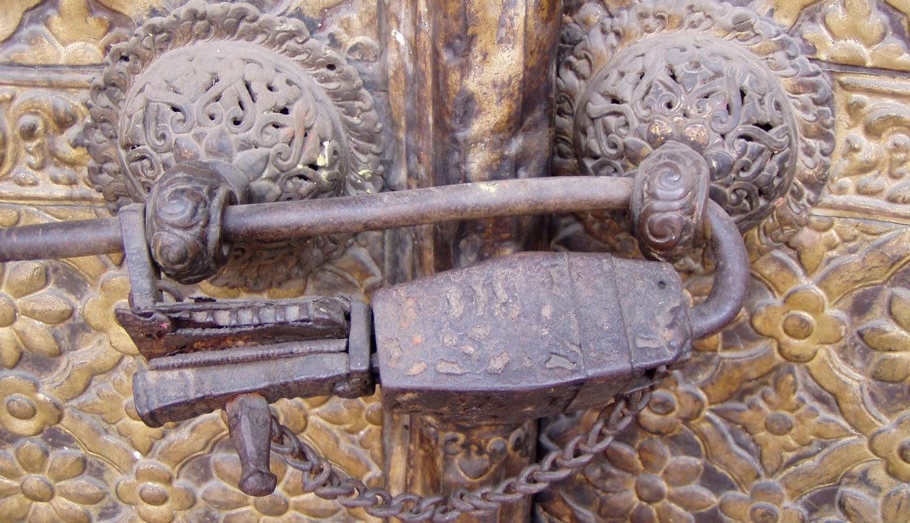
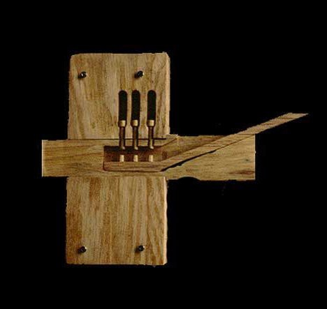
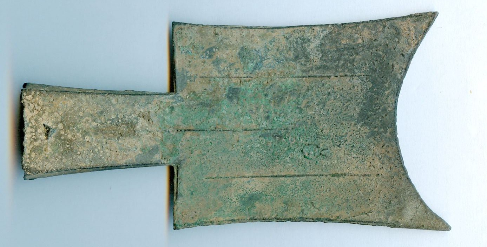

> *作者：Federico Tenga*
> 
> *来源：<https://medium.com/@FedericoTenga/locks-money-and-large-societies-83270bcb3ed8>*

- 位于尼泊尔加德满都的一座寺庙上的中世纪挂锁 -

在现代社会中，我们使用锁来保护各种形式的财富。凡是我们视若珍宝之物，无论是房、车、祖传珠宝还是数字数据，我们都会使用物理锁或电子（加密）锁来确保它们的安全性。锁是必不可少的，原因很简单：我们想要保护私有财产，但是我们周围有太多不可信赖的陌生人。

然而，历史上也有过例外。在人类文明发展初期，人们大多居住在小部落或村庄里，与一群远低于[邓巴数](https://en.wikipedia.org/wiki/Dunbar's_number)的土著频繁来往。这意味着那时候并不需要像锁这样的东西。在同一个社区里，成员之间大都对彼此的家底心知肚明。那时，最宝贵的财产莫过于牲畜和工具，这些不仅容易辨认，而且不可替代。因此，**凡盗窃者不可能不被发现**。假设 Alice 偷了 Bob 的刀，一旦她在日常工作中使用这把刀，立马就会面对诸如“嘿，你拿着 Bob 的刀在那儿干什么？”等尴尬的问题。

小型社会不需要锁，因为你很容易信任周围的人，而且很难通过偷盗获益。然而，城市化让情况变得更加复杂。当你从一个小村庄搬到一个满是陌生人的大城镇时，如何保护私有财产就成了重要问题。与周围所有人都建立信任无疑是不现实的，而且小偷可以轻松逃窜到同城市的其它区域或周边城镇享用赃物。因此，你需要采取某种保护措施来防止自己的东西不被盗走。为了迎合市场需求，最原始的一类锁诞生了。

- 古埃及锁和钥匙 -

起初，锁只是由绳索或其它材料简单系成的结，主要用来探查是否有人试图打开它们并起到威慑作用。后来，在技术发展过程中，出现了一些由木头或金属制成的锁和钥匙构造，不需要人力的守卫就可以阻止人们进入某个区域。根据考古发现，锁最早可追溯到距今约 4000 年的埃及和巴比伦，之后又传播到其它城市文明。希腊、罗马共和国以及包括中国在内的东方文明都发现了相关证据。哪里有大城市，哪里就需要锁。

那么，锁的发明有何重要意义？首先，锁是人类的一大壮举，因为它成功**将信息转化成了一道物理屏障**，使得人们无需依赖暴力威胁即可保护其财产。更重要的是，锁提高了人类社区的可扩展性。如果没有锁，在缺乏信任、处处生面孔的大型社会中，保护私人财产会艰难得多，而大城市也会变得不那么宜居，遑论促进全球贸易发展和人类文明繁荣乐。换言之，锁极大降低了社交和商业往来对信任的需求，扩大了人类社会的规模，让人类合作得以持续发展。

## 扩大人类贸易

然而，锁只是用来降低人际交互对信任需求的发明之一。另一个更古老、也更重要的发明是货币。锁能够让人们更容易在陌生环境里贮藏价值，货币则让人们更容易实现价值交换。

- 在中国周朝（公元前 650 至 400 年），铁锹被用作商品货币。铁锹币将以物易物时代的除草工具和后来演化出的纯货币关联了起来。 -

相较以物易物，货币是一大进步。其中一个原因是，交易对数量的减少提高了可扩展性和流动性，更重要的是**让被交易商品的价值更易于验证**。假设我与陌生人进行交易，我不太相信他不会骗我，因此我必须确保我收到的商品确实符合其声明的价值。在基于以物易物的经济体中，如果我没有能力验证各类商品的质量和价值，就只能选择给予对手方一定的信任。但是，借助于货币，我可以准确验证一种中间商品（钱币）的价值，从而便利地与陌生交易者进行贸易往来。

虽然货币凭借其信任最小化特性得以以各种形式在世界各地广泛传播，但是之后衍生出的[多种创新形式（例如，铸币、信用证、法币等）为提高效率重新引入了对信任的需求](https://medium.com/@FedericoTenga/bitcoin-and-the-return-of-trustless-money-dc582d8b45c8)。但是，基于信任的货币只能在受信实体（即，央行及为其背书的政府）的影响范围内发挥作用，无法扩展至更大的社会面，因此在全球贸易中产生了摩擦。相比两个使用同种货币的人，两个在不同受信实体管辖范围内使用不同货币的人交易起来确实困难得多。

## 抗强制没收的全球货币

过去十年来，比特币之所以广受欢迎，原因之一是它成功提高了个人在敌对环境中贮藏财富的能力（就像诞生于几千年前的锁那样），以及与非相同受信任实体管辖范围内的人交换财富的能力（就像诞生于数万年前的第一种货币形式那样）。

**比特币将财富转化为纯粹的信息**：知晓秘密信息与否，决定了你是否真正拥有某一些比特币，仅此而已。你只需按照正确顺序记住几个单词或将一串简短的字母数字抄写在纸上，就可以存储大量比特币，远比我们使用现金和贵金属要方便得多。在一个高度危险的环境中，例如，当你试图逃离独裁政体或政府暴敛时，比特币很容易成为贮藏大额财富的唯一手段，作为数字锁有效保护你的储蓄。

根据定义，比特币的另一个特征是，让用户无需信任第三方，能够在不依赖中间方的情况下通过网络手段进行交易。**这极大地影响了**[**社会可扩展性**](https://unenumerated.blogspot.com/2017/02/money-blockchains-and-social-scalability.html)**和互操作性**。在这方面，传统法币确实存在诸多限制。如果使用现金交易，你基本上只能使用本国货币（一些旅游热地和法币弱势国家除外），这具有很大的局限性。要想说服法国波尔多产区的农民接受客户使用英镑购买葡萄酒绝非易事，要想说服英国蒙哥马利的枪匠接受欧元付款亦是如此。

同样地，数字形式的法币也受限于信任需求，主要因为它们只能通过中间方转移，而这些中间方只为在自己的新人网络中的人提供服务。因此，有可能发生以下情况：你无法通过 PayPal 向受监管行业的从业者（例如，性从业者）付款；你无法通过银行向居住在受制裁 国家/地区（例如，伊朗或委内瑞拉）的人汇款。另外，法币不仅以信任为基础，还具有很强的政治性，让政府有办法出于政治目的干涉你的交易自由。

另一方面，**比特币有朝一日或将成为真正的全球货币**。无信任需求意味着不受限于受信任实体的管辖范围和政治目标。无中间方需求意味着无需经过任何人的许可即可直接向其他比特币用户付款。

## 总结

锁使得人们可以在陌生环境中保护其私有财产，让大型社会成为可能。货币可以增强贸易的安全性和便利性，即使是陌生人之间的交易也是如此，从而推动跨境市场的发展。这两项发明极大**增强了人类社会的可扩展性**。比特币更是在这两项发明的基础上做出了重大改进。因此，如果比特币实验成功，人类文明将登上新的台阶。

（完）