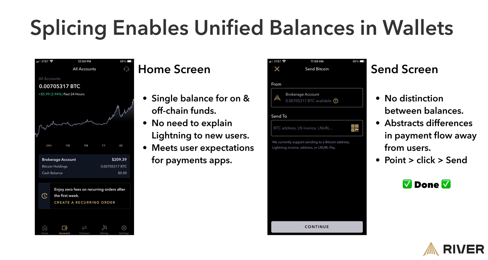
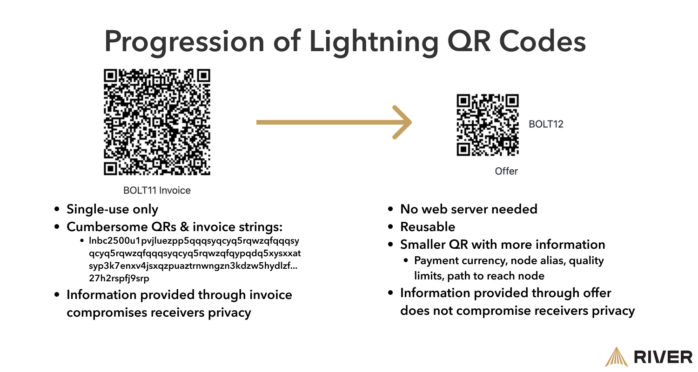

> *作者：River Finance*
> 
> *来源：<https://river.com/learn/lightning-payments-2025/>*

自诞生以来，闪电网络已经成长了很多。许许多多的优化，让闪电支付的体验称得上平滑流畅，但也不是天衣无缝。今天的用户体验可能离我们的目标不算遥远，但作为开发者，我们希望正视这个挑战：我们必须做什么来提升用户体验？

在本文中，我们将探讨，基于现在许多聪明的头脑正在开发的解决方案，闪电网络的用户体验会是什么样。

我们要先勾勒今天的用户体验以及相关的痛点。然后，我会展示，在正在实现以及积极开发的技术的帮助之下 —— 闪电网络可能的未来。

## 闪电网络在 2023 年面对什么问题？

首先指出房间里的大象：今天，大量闪电网络上得交易都是通过托管式钱包（custodial wallets）来完成的。使用[在 Nostr 协议上发生的闪电交易](https://zapalytics.com/)作为整个网络的托管用户的粗略估计，那么接近 90% 的交易都是通过用户 *需要信任一个托管商来保管自己的私钥* 的应用来完成的。

为什么当前的大部分用户都选择托管服务？因为便利、简单的用户体验，以及[自保管](https://river.com/learn/terms/n/non-custodial/)（non-custodial）的闪电钱包在使用上的挑战。我们将当前面临的这些挑战分成三个大类：

### 动手能力

如果用户 *被迫* 要采取比传统支付手段更多的动作来实现相同的目标，那么大部分用户都会失去兴趣。比如：

- **用户必须保持联网**以发送和接收支付。今天，闪电支付失败的一大原因就是接收者离线，在所有闪电支付中发生的比例[约为 0.5 ~ 1%](https://river.com/learn/files/river-lightning-report.pdf?ref=blog.river.com)。
- 用户必须**在协议外跟彼此分享发票**（[invoices](https://river.com/learn/terms/l/lightning-invoice/)），也就是通过文字、email、即时通讯工具，等等，向对方分享信息，以发起和请求支付，这是一个很麻烦的过程。
- 运行自己的[闪电节点](https://medium.com/suredbits/lightning-101-what-is-a-lightning-node-af88e3183c40)的用户必须能够在不同[通道](https://river.com/learn/terms/l/lightning-channel/)间分配比特币。向一个不活跃管理的对等节点开启通道，可能会导致资金一直呆在那里，得不到有效利用。
  - 这就是闪电网络上的资本的机会成本：如果你的资本分配给了一个反应迟钝的对等节点，这些资金就无法用来路由支付（和产生收益）。

### 技术知识

这些问题要求用户对闪电网络 以及/或者 不相关的协议有深入的了解，这是普通的闪电网络用户可能不会去追求的。

- **建立一个闪电节点**需要一定的技术能力。一个闪电节点 *必须* 总是在线，以保持跟网络的其余部分的连接。
  - 如果一个用户的节点离线了，其通道内的比特币就有可能丢失或被盗。
- 一个节点运营者必须[在自己的通道之间不断平衡流动性](https://river.com/learn/terms/l/lightning-channel/)；如果你的通道[在你这一端](https://river.com/learn/terms/o/outbound-liquidity/)没有资金，你就无法 *发送* 支付；相反，如果通道内的所有资金都在你这一端，你就无法 [*收取* 支付](https://river.com/learn/terms/i/inbound-liquidity/)。
- 在一笔支付失败，或受阻的时候，节点运营者必须熟练[运用命令行界面来解决问题](https://river.com/learn/terms/i/inbound-liquidity/)。
- **备份一个节点是[复杂的](https://raspibolt.org/guide/lightning/channel-backup.html)** —— 节点运营者需要存储自己的种子词和自己的通道状态，否则如果失去连接，现有的通道就有可能会被关闭。

### 技术缺陷

闪电网络的技术还没有全面部署。一些技术问题还亟待解决。

- 我们还没有**一种标准化的、用户友好的技术**，能够不依赖于中心化服务器而直接给任意人发送支付。
  - 例子是一种统一的 QR 码或者 [paynym](https://bitcoiner.guide/paynym/) 这样的体验。
  - LNURL 和 [Lightning address](https://lightningaddress.com/) 是可选项，但它们也有缺点，它们依然依赖于在 *某处* 运行一个服务器的 *某人*。
- 因为一个闪电节点必须一直在线，**签名密钥也必须一直在线**。这就产生了全方位的安全风险。
- 开启和关闭通道的成本跟[链上手续费](https://river.com/learn/terms/f/fee-bitcoin-transaction/)直接相关；在链上交易需求高涨期间，手续费会快速上涨，**让通道的开关变得昂贵**。
  - 为避免这一点，用户必须在手续费暴涨前建立通道，虽然决定什么时候开启通道并不容易。
- **闪电网络上的隐私性还不够好**。
  - 当你在闪电网络上请求一笔支付时，你必须暴露一些信息，比如节点的 IP 地址。
  - 虽然发送者（总的来说）比接收者有更好的隐私性，在交易过程中他们也会暴露一些信息。
  - 基于闪电节点彼此通信的方式，第三方可以容易地确定与他们的通道注资交易相关的链上 [UTXO](https://river.com/learn/terms/u/unspent-transaction-output-utxo/)。如果大规模执行这样的监视，可能导致网络的[去匿名化效果](https://arxiv.org/pdf/2007.00764.pdf)。

（译者注：作者在这里描述的问题都是真实的，但绝大部分与普通用户的闪电网络体验无关。只是为了使用（免信任的）闪电支付，你的闪电节点并不需要全天候在线，你所用的自主保管闪电钱包（实际上它也是一个闪电节点）只需在收取和发送支付时在线即可；此外，你需要定期打开这些钱包应用，以确保对手没有欺诈你。普通用户所面临的最大困扰，来自于上面也提到的几点：（1）收取/发送 支付时需要保持在线；（2）缺乏可以多次收取任意金额的收款方式（收款发票都是一次性的）；（3）入账/出账 流动性问题，即，如果你的对手在通道中没有余额，你就无法收取支付。当前，支持 LNURL 的托管钱包，让这些问题对用户来说都不存在，但代价就是用户要信任托管商。当前带有 LSP 的钱包，主要帮助解决了第三个问题，已经能在很大程度上优化体验了（用户不需要自己管理通道），但前两个问题的解决则依然依赖于技术的进步 —— 透露一下剧情：它们都是可以解决的。但话也说回来，整个闪电网络的壮大，以及普通用户的体验提升，也离不开节点运营者能够解决这些痛点，因为，闪电网络是一个**网络**。）

如果这些问题大部分（就不说全部了）都能解决，那闪电网络会是什么样？

## 2025 年的闪电网络用户体验

在这里，我们要着重指出闪电网络用户体验的潜在可能。这不是一个具体的路线图，只是对未来部署了某些升级之后， *可能* 的用户体验的预测。

### 通道拼接，让闪电通道对用户不可见

我们预期，“通道拼接（[splicing](https://voltage.cloud/blog/lightning-network-faq/what-is-splicing-lightning-network-how-it-works/)）” 在接下来几年中会在多数闪电钱包上实现，但这对于网络参与者来说有什么意义呢？

首先，节点运营者将能够 **向通道加入/从通道中移出 资金，而不需要过度支付链上手续费**，而且不用先关闭再开启通道（译者注：意思是，能在 注入/移除 资金的同时保持闪电通道的正常运行）。因为重设通道容量的操作变得便宜，节点运营者 —— 或者说自动操作的软件 —— 将可以更好地控制自己的通道，反过来也意味着支付的成功率更高。

[闪电网络服务商](https://bitcoin.design/guide/how-it-works/lightning-services/)（LSP）也可以从降低的（通道重设）成本中获得好处，而且**可以提供更好的用户隐私性**。尝试优化用户隐私性的 LSP 可以[将用户的资金合并在一起](https://lightningprivacy.com/en/channel-coinjoins/#splicing-coinjoin)，批量处理通道重设交易，从而混淆资金的来源。

当通道拼接普及的时候，资金在闪电网络和比特币链之间的迁移会变得便宜而容易，**钱包将显示一个统一的余额** —— 因为，对用户来说，不再需要区分链上的和链下的资金。

在链上手续费较高的时候，LSP 还可以通过在侧链（比如 [Liquid](https://river.com/learn/terms/l/liquid-network/)）上结合拼接以及的[原子化再平衡](https://www.peerswap.dev/)，来便宜地管理用户的通道。

（译者注：[Phoenix 移动端钱包](https://phoenix.acinq.co/)已经支持通道拼接特性；他们的开发者详细地说明了这会给用户带来的[体验提升](https://www.btcstudy.org/2023/07/12/phoenix-splicing-update/)。）

### 闪电服务供应商，降低进入门槛

在可见的未来，LSP 可能会变成用户体验的一个关键组成部分，因为**他们可以帮用户[隐去复杂性](https://rls.dev/)**。此外，LSP 可以**减少运营一个节点的资金要求**；他们可以作为用户进入网络的门户。

闪电网络的魔法是其即时结算能力，但失败支付和其它痛点会削弱用户的体验。通过 LSP 运营的基础设施，比如服务 以及/或者 节点本身，用户可以更直接地闪电网络交互。LSP 可以通过提供一种 “[云上节点](https://blockstream.com/lightning/greenlight/)” 模式消除用户跟基础设施的交互需要，用户依然控制着自己的资金，但并不需要跟这个节点交互。LSP 还可以提供这种服务的 “轻” 版本，只在手机上消耗更少的电量，或者，还可以把两种模式结合起来。

如果更多资本转移到闪电网络，用户必须能够以**相似于链上钱包的方式恢复自己的闪电节点**（或者说闪电钱包） —— 比如在应用里输入[连续的 12 或 24 个单词](https://river.com/learn/terms/s/seed-bitcoin/)。服务供应商可以让用户在云上[保存自己的闪电钱包的加密备份](https://github.com/lightningdevkit/vss-server?ref=blog.mutinywallet.com)。在用户的设备损坏或者被劫持的时候，加密的云备份可以容易导入到新设备中。

### 免去手动操作

如果一个人必须采取额外的步骤才能从比特币（乃至任何一种神奇科技）中受益，很可能他们会在这些步骤中放弃。

当前就有这样的问题，需要解决方案：LSP 可以通过[为离线用户接收支付](https://gist.github.com/remyers/e0d2bedb7bc87371d1bdbbb6fff2edd1)，来解决 “**保持在线**” 的要求，让用户体验更接近于现有的支付方案。

随着[比特币开发者获得更多资金支持](https://twitter.com/gladstein/status/1684567107621748738)，更多的解决方案会出现，让用户能够独立的接收支付而无需使用外部服务。

当前人们使用的支付 ID，比如 [Lightning Address](https://lightningaddress.com/)，是可用的，但在几乎所有时候都是托管商来支持的。用户需要能够**使用可复用的 QR 码来接收支付**，并且无需依赖于第三方。可复用是至关重要的：复制、粘贴、发送发票给支付方，太多步骤了。如果有简单的解决方案，所有闪电网络用户都能得到好处。

- 图片来源：https://bolt12.org/  -

在上图中，更小的、更简单的 QR 码，叫做 “[offer](https://bitcoinops.org/en/topics/offers/)”，它可以让钱包 *无需用户指引*，就能处理支付流程中的发票请求部分。Offer 的另一个好处在于，它可以携带例如币种、供应商名称、数量限制，以及触达接收者钱包的路径等信息。

许多人会更喜欢简单的上手流程，这意味着他们可能更喜欢带有受信任服务商的装置。一个例子是 [Fedimint](https://fedimint.org/) 协议：一群人管理着一个叫做 “e-cash 铸币厂” 的东西。这种模式提供了[更好的隐私性](https://fedimint.org/docs/CommonTerms/Blind%20Signatures)，以及一系列的[额外产品和服务](https://github.com/fedimint/fedimint/discussions/categories/fedimint-modules)，例如遗产管理、私人[矿池](https://river.com/learn/terms/m/mining-pool/)、去中心化的争议裁决、合成美元仓位，等等。因为闪电网络是内置在这些社群中的，用户可以根据自己的判断即时地离开和加入不同的联盟，而且迁移成本很低。

### 在闪电网络中标配隐私性

为了让隐私性成为闪电网络的标准特性，实现隐私性的技术必须可以隐藏起来，不让用户看见 —— 意思是用户不需要采取任何操作，就能从中获益。应用开发者和服务提供者必须在幕后行动，例如，将链上交易与闪电交易隔离开，等等。

**干扰闪电网络中的监控**

**判断一笔链上交易是不是一个闪电通道 开启/关闭 交易，将会变得非常困难**，因为新技术将日益让它们看起来跟其它比特币交易没有区别。随着更多的 [Taproot](https://voltage.cloud/blog/bitcoin-education/how-taproot-improves-the-lightning-network/) 技术实现，像[签名聚合](https://river.com/learn/terms/b/bip-340-schnorr-signatures/)这样的特性，可以隐藏一个支付通道的信息，以及有可能有多少用户参与了这笔交易。（译者注：这跟 taproot 升级引入的 Schnorr 签名有关，在一些条件下，它可以将通道双方的签名聚合成一个签名，从而在合作关闭通道的情形中，外界将无法区分这笔交易与普通的个人钱包支付有何区别。）

如果 Taproot 在钱包中广泛实现，用户可以**在向自己的对等节点以外的人支付时获得更好的隐私性**。当前，这样的多跳支付有一个支付 ID（这笔支付的[哈希值](https://river.com/learn/terms/h/hash-function/)），会被转发路径上的每一个中间节点知道。而 Taproot 处理签名的一些方式，可以[用来创建 “哑谜” 支付 ID](https://voltage.cloud/blog/lightning-network-faq/point-time-locked-contracts/)，让路径上的转发节点无法窥见全貌，只有发送者和接收者对支付有清晰的理解。（译者注：这也跟 Schnorr 签名有关，相关的技术叫做 “PTLCs”，每一跳得到的信息都是不一样的。）

闪电网络的用户可能**不再需要担心 —— 甚至不再需要知道** —— 自己的支付所通过的具体路径，但在当前，整条路径上的每个节点都可以看到支付来自哪里（译者注：这应该是一种误解，中间节点不知道支付起源的位置）。在 “加拿大自由车队” 事件中，我们可以看出，[政府可以而且也会没收资金](https://www.coindesk.com/policy/2022/02/16/canada-sanctions-34-crypto-wallets-tied-to-trucker-freedom-convoy/)、冻结法币银行账户，而且还可以审查那些反对他们的人。

LSP 可以通过提供一种服务、作为一个盲化路由的中间人，[匿名化一笔闪电交易的来源](https://lightningprivacy.com/en/blinded-trampoline)。这样一来，LSP 也只知道自己构建的部分支付路径，而发送者知道其它部分；整条路径的中间节点和目的地都会 “盲化”。这种模式将提供更强的安全性，而用户根本不需要参与其中。

（译者注：作者在这里提到的技术是 “路径盲化”。当前，闪电支付的接收方必须向支付方曝光自己的网络位置，以便支付者找出可以触达自己的支付路径。而 “路径盲化” 的想法是：接收方可以提供一条可以触达自身的路径的入口，从而隐去自身的真实位置。支付者只需找出触达这个入口节点的路径即可。因此，跟作者的理解相反，盲化路径更多是保护接收者的隐私性。至于 LSP 知道多少信息，要看 LSP 在入口节点到接收者节点的路径上的什么位置。）

**使用闪电网络作为一种虚拟私人网络**

钱包可以创造性地提供隐私增强的功能。举个例子，**钱包和 LSP 可以作为用户的 “发票中介”**；钱包创建一个发票并转发给一个 LSP，然后 LSP 完成支付。对于接收者来说，看起来就像是 LSP 给他支付了；而且这样依赖，发送者就获得了更好的隐私性，而且不会改变他们熟悉的支付流程。[Mutiny Wallet 的联合创始人 Tony Giorgio](https://www.youtube.com/watch?v=5qISqqGnQOc) 指出，这种方法允许钱包用户隐藏在 *这个 LSP 的所有用户中*。

少数闪电网络用户可能想要更强的隐私性。交易混淆的许多案例是增强隐私性的经过考验的方法，但这要求用户手动操作，而且可能付出许多链上手续费。因为 LSP 已经运行了服务器，他们在**为用户协调交易协作服务方面处于有利地位**。服务供应商可以创建加强隐私性的检查点：当用户[开启或关闭通道](https://lightningprivacy.com/en/channel-coinjoins/#channel-open-coinjoins)时，增加或减少通道的容量（如前面的 “通道拼接” 一节所述），或者在用户[为商品或服务支付](https://payjoindevkit.org/blog/pdk-an-sdk-for-payjoin-transactions/)时就这么做。

### 闪电网络提升电子商务

供应商可以通过闪电支付，**向客户提供一个退货期**。客户可以在结账时支付一种**特殊的发票**，保留 “撤回” 交易的能力，一直到商品和服务交付。这在以前是不可能做到的。

**安全性是机构采用的关键**

为了让更多机构加入闪电网络，需要**非常容易就能将离线的、冷钱包的资金转入一条闪电通道**。Taproot 通道开启了这种应用场景，而无需牺牲安全性。

此外，这也让机构能够**更安全地将大量资金存放在闪电网络上**。他们将能使用[定制化的硬件](https://vls.tech/#Intro)来保护他们免于[钱包联网](https://river.com/learn/terms/h/hot-wallet/)所带来的风险。

## 结论

闪电网络已经证明了自身在即时结算支付上的有用性 —— 但我们应该清楚，它也不是完美无缺。不过，网络参与者可以对解决 UX 障碍保持乐观；一些[最聪明的开发者](https://rls.dev/)正孜孜不倦地强化用户体验。

随着更多的技术解决方案出现、更多的资本投入闪电网络，LSP 可能会在帮助终端用户去除复杂性方面扮演更大的角色。技术上的进步也将有利于自主保管的用户，并让整个网络更加接近 “**就是这么好用**” 的体验。

闪电网络上有许多值得兴奋的东西；本文中所有对未来的预测，都基于当前正在开发的解决方案。越多开发者和企业致力于优化用户体验，网络的参与者和资本也就会越多，每个人的用户体验也会越好。

（完）