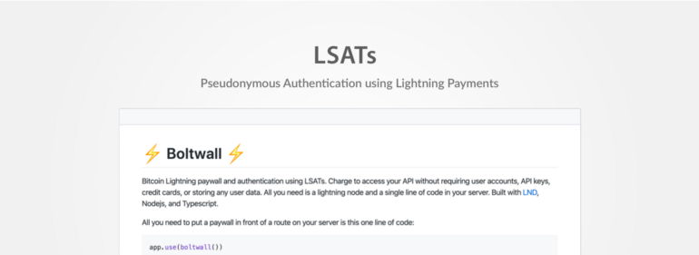

> *作者：Tierion*
> 
> *来源：<https://medium.com/tierion/lsats-pseudonymous-authentication-using-bitcoin-lightning-payments-459e209b4b36>*

几个月来，我们一直在跟 [Lightning Labs](https://lightning.engineering/) 的工程师们开发闪电网络服务身份认证 Token（Lightning Service Authentication Tokens, LSATs）。我们的目标是让用户面对服务端可以验证自己的身份，而无需要求用户创建账户和存储任何用户的数据。LAST 结合了闪电网络上的比特币微支付，以及 `402: Payment Required` HTTP 状态码、[macaroons](https://static.googleusercontent.com/media/research.google.com/en//pubs/archive/41892.pdf) 以及身份验证头这样的标准。今天我们将推出一系列的开源工具，让开发者们可以创建自己的 LSAT 应用程序。

- [Boltwall](https://github.com/Tierion/boltwall)
- [Now-Boltwall](https://github.com/tierion/now-boltwall)
- [LSAT-js](https://github.com/Tierion/lsat-js)
- [LSAT Playground](https://lsat-playground.bucko.now.sh/)

 ## 背景

身份验证和授权是许多互联网和手机应用的前提。身份验证确定是谁在发出请求，而授权则为用户设定许可。

现在的身份验证实现有两个显著的缺点。其一，它们依赖于第三方来存储敏感数据。这些信息经常遭到窃取或泄露，让用户处于风险之中。其二，用户的真实身份常常被身份验证关联起来。将你的真实身份绑定到第三方的身份验证服务（比如 Google 和 Facebook），会暴露你在使用什么服务、使用的频率如何。

在 2019 年，Tierion 开始开发这些问题的解决方案。我们推出了 [Boltwall](https://medium.com/tierion/boltwall-middleware-for-lightning-payments-authorization-e3a1dbb54a4c)，一种用于部署闪电网络付费服务的中间件。Boltwall 的初版使用了一种不记名的凭证，叫做 “[macaroons](http://hackingdistributed.com/2014/05/16/macaroons-are-better-than-cookies/)”（直译为 “马卡龙”），是关联到闪电网络发票的。请求会基于发票是否得到支付而得到许可。

几个月后，Lightning Labs 的 CTO [Olaoluwa Osuntokun‏](https://twitter.com/roasbeef) 提出了他称为 “闪电网络服务身份认证 Token” 的提议。虽然 Boltwall 是独立开发的，[LSAT 演讲](https://docs.google.com/presentation/d/1QSm8tQs35-ZGf7a7a2pvFlSduH3mzvMgQaf-06Jjaow/edit#slide=id.p)中描述的动机非常契合我们的目标：将闪电支付用于身份验证，使身份验证不依赖于个人和隐私信息。

我们意识到，有必要形成单一一个标准。在 Lightning Labs 发布他们自己的实现之后，我们决定朝着同一个目标齐头并进。我们跟 Lightning Labs 的工程师们一起优化 LAST 标准、将 Boltwall 迁移到兼容 LSAT，并开发了一个工具箱，让开发者们可以在自己的应用的使用 LSAT。

## 什么是 LSAT？

一个 LSAT 就是一个 HTTP 头，编码了一个 macaroom 和相应的闪电发票。该闪电发票的支付证据，是产生一个有效的 LAST 的基本要求。

### LSAT token

一个 LSAT token 由两部分组成：一个 macaroom 和一个支付证据。闪电网络支付提供了一种密码学安全的方式来证明支付。每个发票都会生成一个相应的 32 字节的支付哈希值。这个哈希值是由一个随机的 32 字节的字符串（称为 “原像”）使用 SHA-256 算法生成的。而这个原像，只有在这个闪电发票成功支付后才会揭晓。因为找出原像不可能靠猜，证明只有这个原像才能用来生成这个发票的支付哈希值也很简单。当你成功支付这个发票之后，你拿到了原像，就能生成一个有效的 LAST token 了。

### 身份验证流程

LSAT 的身份验证流程跟 HTTP 类似。我们用最简单的 LSAT 身份验证流程，来演示一下它是怎么工作的。

1. 客户端向一个服务端上的受保护路由发起一个请求，无需任何身份验证。
2. 服务端返回一个带有  `402: Payment Required` 的响应（详见： [IETF RFC 7231](https://tools.ietf.org/html/rfc7231#section-6.5.2)）。
3. 响应也包含一个 WWW-Autheneicate 头（[RFC 2617](https://www.ietf.org/rfc/rfc2617.txt)）。它其实是对客户端的一个 “挑战”，指明类型（LSAT）以及必须满足的编码条件：一个 macaroon 和一个发票。
4. 客户端支付发票，获得 32 字节的原像。
5. 然后，原像和来自原本的 WWW-Authenticate 头的 macaroon 编码成一个 token。客户端在带有类型前缀 “LAST” 的 Authorization 头中发送这个 token。

任何读到这个请求的人，都可以通过验证原像与 LSAT 中编码的哈希值的关系，来校验支付。Macaroon 文件中也可以编码其它的 *caveat（说明）*。说明指示了 token 使用的进一步限制，例如超时时间、请求来源、服务层级，等等。Macaroon 也支持 “[委托](https://github.com/lightningnetwork/lnd/blob/master/docs/macaroons.md#macaroon-delegation)”。所以客户端可以在他们的 LSAT 中加入说明（附带更严格的条件），例如更低的服务层级，或者更快的超时时间。然后，修改过的 LSAT 就可以借给另一个人，让 TA 使用相同的服务。

## Chainpoint 的机器间支付

Tierion 从 2019 年中开始开发基于闪电网络的身份验证技术，同时设计了完全比特币原生的一种新版 [Chainpoint Network](http://chainpoint.org/)。

Chainpoint 让开发者可以铆定数据到区块链上，创建一个时间戳证明。一个由节点组成的网络会收集和汇总哈希值，然后发送锚定交易到区块链上。Chainpoint 的运营者需要运行这项基础设施的激励和支付机制。链上的比特币支付行不通，因为比特币交易的手续费较高，而且吞吐量有限。

闪电网络让每一个 [Chainpoint Core](https://github.com/chainpoint/chainpoint-core) 节点都可以为提交一次哈希值收取一次微支付。有了 Boltwall 赋能的 LAST，Core 节点可以为任何想要提交哈希值的客户端发送一个 LAST 挑战。在支付之后，客户端在带有 LSAT 的许可请求中提交一个哈希值。这让每一个 Core 节点都能为自己的服务验证支付。客户端的开销，相比于他们自己用比特币交易在链上锚定数据，是微不足道的。

再加上 [Loop Out](https://blog.lightning.engineering/technical/posts/2019/04/15/loop-out-in-depth.html) 这样的服务，每一个 Core 节点都可以将从闪电支付中赚取的比特币转移到自己的链上钱包、为锚定交易支付手续费，从而创建一个 *完全闭环的、比特币原生的生态系统*。

### 带有 HODL 发票的一次性 token

敏锐的读者可能已经注意到了，仅仅使用一个支付过的发票来授权哈希提交会出现一个大问题：用户只要支付一次，就能无限次提交哈希值。在一个分布式网络中跟踪发票和哈希值提交请求的关系是不现实的。相反，我们使用另一个闪电网络原生的协议来跟踪状态：[HODL 发票](https://wiki.ion.radar.tech/tech/research/hodl-invoice)。对 HODL 发票的原生支持已经直接做进了 Boltwall 的 LAST 实现中，所以别的项目也可以直接使用。

HODL 发票工作的原理是，它们不是自动完成的（跟常规的发票不同）。在 *支付者* 支付之后，*接收者* 可以验证支付，但资金还不可用。当一个预定的原像向 *接收者* 揭晓时，结算才发生。要是没有揭晓，资金会退还给 *支付者*。HODL 发票有许多用途（[LND 代码库的 PR](https://github.com/lightningnetwork/lnd/pull/2022) 提供了解释和案例），但是在 Chainpoint 中，我们仅仅用来跟踪状态。

[在 Boltwall 中](https://github.com/Tierion/boltwall#hodl-invoices)，只有携带一个 HODL 发票的 LAST 才会被认为是有效的。未支付的、已经结清的发票，都是无效的。当一个客户端在提交哈希值之前给发票支付了，这个发票和对应的 LSAT 就处于 “held” 状态。如果还没提交哈希值，一段时间后支付会返回。而提交了哈希值之后，发票就会由 Chainpioint 结算、支付原像就会附加到 LSAT 上。因为结算完成的 HODL 发票就会被认为过期了，所以使用这个 LSAT 发起的任何请求都会返回  `401: Unauthorized response` （未获许可的响应）。

## LSAT 工具箱

我们优化 LSAT 的动机不仅仅是为了在 Chainpoint 中使用闪电支付和身份验证。越多应用使用 LSAT，它对每个人都会变得越有用。因此，我们决定开源我们已经开发出的工具箱，让其他人也为自己的应用嵌入 LSAT。以下就是我们已经发布的代码库：

**BOLTWALL**

Blotwall 支持比特币闪电网络付费和使用 LSAT 的身份验证。用户无需注册账户、API 密钥、信用卡，你就可以直接收费；而且你也不需要存储任何用户数据。你需要的只是在你的 Expressjs 服务端（或类似的 Nodejs 框架例如 Restify）、你想用付费来保护的路由前面加一行代码。任何尝试访问这个路由的客户端都会收到 LSAT。要了解配置、用户、安装和代码文档，请看这个 [Boltwall 代码库](https://github.com/Tierion/boltwall)。

**NOW-BOLTWALL**

[now-boltwall](https://github.com/tierion/now-boltwall) 是一种命令行工具，帮助你简单地部署一个在线的、启用 Boltwall 的服务端，连接到一个运行中的 lnd 实例。它提供了工具来帮助你检索和设置你的 lnd 连接证书、设置你的 Boltwall、甚至可以快速连接到一个 [BTCPay 服务端](https://btcpayserver.org/)。服务端使用 [Zeit's Now](https://zeit.co/home) 部署，这是一种免服务端的部署框架，有大量的免费套餐。完整的文件见[此处](https://github.com/tierion/now-boltwall)。

**LSAT-JS**

[lsat-js](https://github.com/Tierion/lsat-js) 是一种使用 TypeScript 编写的功能库，兼容大部分现在的浏览器。它提供了工具来开发、解析和验证 LSAT，不论是客户端还是服务端。代码和文档见[此处](https://github.com/Tierion/lsat-js)。

**LSAT PLAYGROUND**

我们甚至开发了一种客户端网页应用，演示了 lsat-js 中所有可用的工具。LAST Playground 包括了代码片段，并且给了你无需撰写代码就能跟 LSAT 交互的渠道。它也提供了一个在线的 demo，你可以使用一个测试网节点来支付、获得使用 Boltwall 保护的一个 API 的限时访问。试用  [LSAT Playground](https://lsat-playground.bucko.now.sh/)，立马上手 LSAT。

## 结论

比特币引入了原生于互联网的支付系统的概念。闪电网络的创新则展示了这项技术的价值不仅仅是金融交易。LSAT 向着一个我们不需要信任第三方来保管我们的私人信息、用户拥有更安全和隐私的身份验证手段的世界迈出了一步。我们希望 Boltwall 和 lsat-js 能让开发者们更容易基于更好的身份验证基础设施创建自己的应用。

请看看我们在 Github 上的代码库，并给我们反馈！[Boltwall ](https://github.com/Tierion/boltwall) 和相关 LSAT 工具的开发是由 Buck Perley 领导的。如果你有问题，请在[推特上联系他](https://twitter.com/BuckPerley)。

（完）