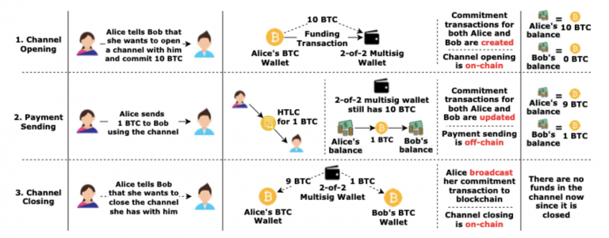
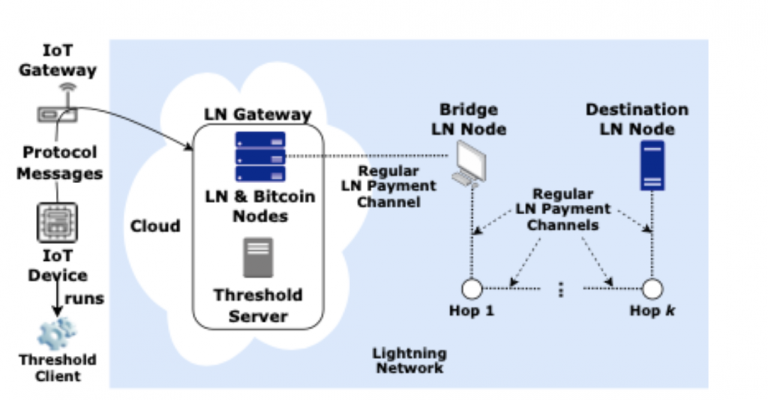

> *作者：Omer Shlomovits*
> 
> *来源：<https://zengo.com/make-micro-payments-in-a-flash-the-power-of-lngate/>*

## 引言

设想你开车到外地去参加一场重要的会议，一路上会途径三个收费站。那你要给过路费，不是又要把车慢下来，又要浪费一些时间吗。这就产生了 “自动支付系统” 的需要。

靠设备间通信（device-to-device communication，D2D）完成、无需人力介入的原子化支付，是解决这个问题的理想方案。虽然有可能将这些设备与传统的支付系统（比如信用卡）关联起来，但这就引入了一个第三方，他们可能会把管理成本转嫁给你，甚至收集你的隐私。这样来看，密码货币可以创建一个更方便的支付系统。因此，把 IoT（物联网）和密码货币（例如比特币、以太坊）结合起来可以解决这些问题。

凭借去中心化账本的概念，比特币已经成为了一种颠覆性的支付系统，但对支付场景来说，它有一些重大缺陷，比如手续费太高，交易的确认时间很长。

[闪电网络](https://lightning.network/)（Lightning Network，LN）已经用一种大胆的做法解决了这些问题 —— 链下支付。有了这一进步，用比特币来做小额支付也颇有前景，而且也能被许多 IoT 应用接受。然而，在 IoT 设备上托管闪电网络和比特币节点是不可行的，因为它们的存储、内存和处理开销。

自闪电网络问世以来，它已经有了[超过 20000 个节点](https://1ml.com/)。物联网设备只有非常有限的计算、通信和存储能力；因此，在大部分配置较低的物联网设备上安装闪电节点都是不可能的。具体来说，使用闪电网络需要你运行一个闪电节点以及一个比特币全节点，两者加起来需要超过 340 GB 的存储空间。要参与比特币区块的验证，可靠的互联网连接和相对较高的计算能力也是必不可少的。

考虑到所有这些因素，我们需要一种轻量化的解决方案。我们提议一种基于门限密码学的协议，由可信的闪电网络网关负责托管完整的闪电网络节点和比特币节点，让物联网设备能够通过这个网关发起闪电网络操作。

还可以通过支付手续费来激励 LN 网关提供这项服务。

我们提议的协议具有以下特点：

- 能够实现即时付款
- 可以运行在低带宽的网络上
- 所需物联网设备

## 闪电网络

我们的协议会用到闪电网络。闪电网络是 2015 年提出的概念，很快就被 Lightning Labs 和其他团体在比特币上实现了。它是一个比特币区块链网络之上的点对点二层网络。

闪电网络致力于解决比特币的可扩展性问题。利用比特币的智能合约功能，闪电网络让用户可以开设安全的支付通道、享受即时和便宜的比特币转账，还能在网络中实现多跳间接支付。

自问世以来，使用闪电网络的用户已有了可观的增长。闪电网络现在有总计 59192 个通道，留存 1986.06 btc。

我们用一个例子把闪电网络讲得更清楚些：

*Alice 想给 Bob 支付，所以跟 Bob 开启了一个闪电网络支付通道。在这个支付通道中，资金可以在 Alice 和 Bob 之间双向流动，无需把交易提交到比特币区块链上。也就是说交易是在链下发生的。*

- 图 1. 一个闪电网络通道的生命周期 -

从图 1 中可以看出，闪电网络的一个重要基石是承诺交易（commitment transaction）。承诺事务有三个输出。

Alice 发出的承诺事务的三个输出一般是：

1. 给 Alice 分配当前她在通道中的余额，但是带有时间锁，要过一段时间才能使用
2. 给 Bob 分配当前他在通道中的余额，是马上就可用的
3. 支付合约（实质是 HTLC，哈希时间锁合约）

（译者注：承诺事务随时可以提交到比特币区块链上，使其资金分配效果成真，所以承诺事务一经交换，便意味着双方余额更新、支付完成；只要没有任何一方把承诺事务广播到网络中，通道就一直开启，双方可以几乎无限次转账。）

## 闪电网络技术基础（BOLT）

为了我们的协议，我们修改了闪电网络的闪电网络技术基础 #2。闪电网络技术基础是闪电网络用来管理通道的对等节点协议，用来实现安全的比特币链下支付。

BOLT #2 有三个阶段：

- 通道建立
- 通道的正常操作
- 通道关闭

## 门限密码学（Threshold Cryptography）

我们的主要创新是在闪电网络中加入门限密码学。

现实生活中的密钥分割（sharing secret）是非常普遍的，但我们要借用到数字世界来。

“门限密码学” 是安全多方计算（Secure Multiparty Computation）的一个子集，处理的是超过一方参与的密码学操作。

在密码货币的世界里，私钥（private key，本身应是一个秘密值）被盗会导致资金损失。所以，人们提出了在多方间分割密钥的想法。在一个门限方案中，密钥是在多方间分割的，而且预先定义了一个阈值，参与者的数量如果少于这个阈值，无论如何也不能知道关于这个密钥的信息。

为了在物联网设备上使用闪电网络，同时无需承担所有的内存负担，我们要利用门限密码学。

这也是可以实现的，因为我们把闪电网络节点独立了出去，物联网设备只需参与关键的密码学部分。

这样做可以加速我们的开发进程，让整个系统更容易跑起来，还节约成本。

## 系统模式

- 图 2. 系统模式示意图 -

我们的系统有四个主要部分：（1）物联网设备；（2）闪电网络网关；（3）桥接闪电网络节点；（4）目标闪电网络节点。

其它中介包括：（1）门限客户端；（2）物联网设备网关；（3）闪电网络网关的比特币核闪电网络节点；（4）门限服务器。

**一些假设：**

物联网设备可通过网关连接到互联网。

物联网设备和闪电网络网关在发送支付的过程中不会掉线。

物联网设备在其余时间可以离线。

**协议**

假设一个物联网设备现在想给目标闪电网络节点支付（比如支付过路费）

- 从 IoT 网关开始，设备联系 *闪电网络网关*，网关管理着闪电网络节点、比特币节点和门限服务器
- 无论什么时候 IoT 设备发起请求，闪电网络网关便打开与桥接闪电节点的通道，以连接到目标网络节点
- 桥接网络节点可以向发起支付的闪电网络网关收取路由费
- IoT 设备的支付通过桥接节点路由到指定的目标节点
- 现在，门限密码学的操作在 IoT 设备和闪电网络网关间运行，所以只有闪电网络网关需要运行这个改进后的协议。系统的其余部分可以运行原始的 BOLT 协议。

## 安全分析

这里，我们假设我们的系统会面临三种威胁：串谋攻击、IoT 设备与闪电网关串谋和勒索攻击。

*串谋攻击*：

1. 闪电网关和桥接节点串谋

在我们的系统中，支付总是从 IoT 设备发送到目标闪电节点的，反过来说，这总是会增加桥接节点在通道中的余额。因此，桥接节点的旧通道状态余额总是会低于最新的状态，所以这种勾结不会发生。我们这套协议当前局限于单向的支付，为物联网设备实现双向的支付是未来的工作。

现在，假设闪电网关要把旧状态广播到区块链网络中。只有闪电网关的某个旧状态比当前状态具有更多资金，这样做才有好处的。但是，这也不可能，因为闪电网关会对 IoT 设备的每一次支付收费，其余额也是一直上涨的。此外，桥接节点的旧状态余额也必定较低。所以他们两个的旧状态余额都比较低，串谋是得不到好处的。

（译者注：补充一些背景也许可以帮助读者理解何以需要分析这些威胁，以及这些威胁如何得到处理：在这个系统中，IoT 设备和网关共同使用一把门限私钥与桥接节点开设通道（多签名合约），但是每次承诺事务都有输出向 IoT 设备和网关各自控制的地址分配资金，而不是把资金分配给门限私钥；所以，通道可以做到网关和桥接节点的余额总是递增的。具体细节见文末所附的完整论文。）

2. IoT 设备和闪电网关勾结：因为 IoT 设备的通道内资金总是随着支付的发生而下降，所以它很容易与闪电网关勾结，向网络广播一个过时的状态。

如果桥接节点不想丢失资金，那他在其它时间也不能下线。因此，这种勾结不是我们的协议特有的，而是闪电网络普遍的问题。

*盗窃 IoT 设备的资金*：

闪电网关可以通过以下方法盗取 IoT 设备所承诺的资金：

1. 把它们发送给其他闪电网络节点
2. 把旧状态广播到网络中
3. 与其他闪电网络节点勾结

如果我们使用闪电网络的原始签名机制，闪电网关就可以拿走 IoT 设备在通道中的资金，无需来自 IoT 设备的签名。我们所提议的修改 —— 在闪电网关的承诺交易中使用（2-2）的门限方案 —— 正是为了保护 IoT 设备不会损失资金（译者注：即网关若要广播承诺事务就必须经过 IoT 设备，因为通道是使用他们共同计算出的私钥来开启的）。

*勒索攻击*：

这种攻击是闪电网关偏离协议描述的情形。举个例子，网关可以告诉 IoT 设备，“给我多少多少比特币，不然我就不帮你关闭通道”，或是 “现在开始，你要接受 10% 的服务费率，不如我就不给你服务了”。

此时，IoT 设备最好的办法就是拒绝勒索，干耗着。然后，闪电网关会扣着 IoT 设备的资金，尽可能地拖延。这是个死循环，双方都是干耗着。

LN 网关最好的做法是继续为 IoT 设备服务并收取服务费。

## 应用和实验

我们这个协议的应用场景包括电动车充电桩、传感器数据销售和停车场收费系统。还是拿一开始的收费站做例子好了，因为我们也实地做了测试。

实时响应对收费站来说是最关键的，因为理想状态是汽车通过收费站时不必停车，利用（比如）无线网络就完成支付。

每当一辆车进入一个收费站的无线覆盖领域，它就通过 IoT 的网关向收费站的闪电网关发起支付请求。这个闪电网关立即发送所请求的支付数额给收费公司的闪电节点。支付完成之后，一条表示 “支付成功” 的消息通过 IoT 网关返回给车辆。

要让这个系统在现实中能用，整个支付流程必须在汽车驶离收费站的无线网络覆盖范围之前完成。

因为支付只需花费 4.12 秒，所以车子是能及时完成支付的。

至于成本，我们假设一辆车一天要交两次过路费。假设这辆车已经提前开好通道了，那么使用这套服务唯一的成本就是闪电网关对每次支付收取的服务费。虽然这个费率是由网关决定的，我们假设服务费数额是过路费实际数额的 5%。如果每次通行需支付 0.75 美元的过路费，那么每次支付的手续费就是 0.0375 美元，每个月的服务费不过是 2.5 美元（0.0375* 60）。

考虑到瞬时支付过路费的便利，每个月多花 2.5 美元应该不算什么。实际上，信用卡公司的收费差不多，甚至更多。

## 结论

我们的评估结果显示，闪电网络节点可以支持快速而及时的物联网小额支付，而且运营成本很低。

本研究的目的是让资源有限的物联网设备能够与闪电网络交互（一般来说是做不到的），并与其他用户开展小额支付。

就我们所知，这是第一个在闪电网络中实现了门限密码学的工作。

所以，你可以享受旅行、及时抵达，不用担心过路费支付啦！

我们的协议还可以用在许多其它的物联网小额支付应用中（也即不限于过路费支付）。

我们的成果也是门限密码学闪电网络通用框架开发的一个里程碑。想要了解整个方案的所有细节，请看我们的[论文](https://arxiv.org/abs/2105.08902)。

希望你有所收获！

（完）

