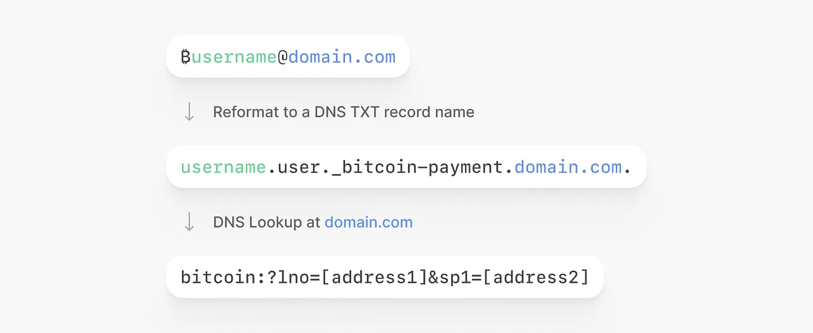

> *作者：Spiral*
> 
> *来源：<https://spiralbtc.substack.com/p/making-bitcoin-speak-human>*

*作者：Conor Okus & Mat Balez*

只要你发送过真正的点对点比特币支付，你一定知道这个过程有多令人焦虑。我们要复制一段看起来非常奇怪的字符，然后粘贴到我们的钱包软件中，同时祈祷自己不会一不留神搞错一个字符，然后将钱币发送到永世不得超脱的地狱中。

“人眼可读的比特币地址（Huam Bitcoin Addresses，HBAs）” 是我们为 [BIP 353](https://github.com/bitcoin/bips/blob/master/bip-0353.mediawiki) 标准提议的用名；这个标准可以将用户在 Cash App、Venmo 和 Paypal 这些应用中熟悉的、符合直觉的使用体验带到比特币应用中。用户不必再处理长而吓人的钱包地址，HBA 让发送比特币就像发送邮件那样简单。

作为一项建立在 “域名系统（DNS）” 之上的开放行业标准，BIP353 将收款标识符从 “bc1q0zv3j4kzv…” 这样的形式（地址），转变成了人眼可读的形式，比如 “<strong>₿conorokus@twelve.cash</strong>” 。这是易用性的巨大进步，它可以帮助减少在复制粘贴过程中发生的错误，也能帮助人们消除完全不敢自己发起交易的畏难情绪。

DNS 已经是人们在使用互联网时习以为常的事物。它是一个强大的命名系统，计算机用它来沟通彼此，将一个域名（比如 “[www.google.com](http://www.google.com/)”）转化为实际的 IP 地址（比如 “[142.251.16.100](https://mxtoolbox.com/SuperTool.aspx?action=a:google.com&run=toolpage#)”）。当人们在浏览器的地址栏里输入域名的时候，就是在使用这个系统。我们可以在比特币世界中实现类似的效果，区别这是，这将用于支付。

## 把钱发送给名字，而不是随机的字符串

在支付应用中使用名字，更加方便、清晰且容易记忆。比如说 “**$judysmith**” 和 “@**moneyball**”。它们是用户体验的桥了，将大部分的底层复杂性 —— 比如身份、合规规则、支付渠道以及它们之间的所有东西 —— 都隐藏起来。

## 比特币是强大的，但依然让人感觉难用

作为一项技术，比特币被开发成去中心化、开放和全球化的，但我们依然用人类感觉完全陌生的东西来 “解决” 人类（译者注：这里是一语双关，英文中的 “address” 既有 “解决” 的意思，也可以表示 “地址”）：

1. “**把你的区块链地址发给我吧**”。这需要支付者仔细检查，然后复制和粘贴一段较短的、看起来完全没有规律的字符串。
2. “**请给我一张闪电发票**”。这也需要支付者仔细检查，然后复制粘贴一串很长的、没有规律的字符串。

你要不是比特币圈子里的人，要发起支付的时候根本不会这么说话，这正是它可能影响比特币成败的原因。我们必须直接面对比特币应用中最主要的使用体验问题之一：能不能创造出一种对人类友好的地址系统，同时保留比特币的核心属性？

这是一个大问题，但如果能得到正确的解决，就能带来下一波用户，同时移除用户采用的一个显然的障碍。

## 解决一个重要的点对点障碍

HBA 的首要应用场景是，它让比特币支付可以互操作，不仅能跨越整个生态系统，还能跨越不同的 L1 和 L2 支付协议。它让你可以从 *任何* 钱包或交易所给 *任何另外一个* 钱包或交易所即时且隐私地发送只发布，不需要事先的协调或特殊的启动设置。

但 HBA 也可以用来提升原子化的清扫。它让你可以从一个托管商移动资金到你自己的钱包，安全、隐私、没有摩擦 —— 一切操作都是避免地址复用的。它是从 “我买了比特币” 到 “我控制着我的比特币” 的简单路径。

最后，当你在硬件签名器商检查收款人地址时，HBA 让这个过程更加清楚、更少出错。要确认一个你可以识别的简短名称，比扫描一长串字符要容易得多。

## 打开引擎盖

一个 HBA 可以用来接收比特币，不论其中用还到了什么支付协议。它的工作原理是，指向一个存储在安全的 DNS 记录中的 [BIP 321](https://github.com/bitcoin/bips/blob/master/bip-0321.mediawiki) URI，从而让 HBA 运行在我们已经拥有的互联网基础设施上。他们（HBA 和互联网）使用同一套全球化的、经过压力测试的 DNS 系统：你每次在浏览器地址栏里输入一个 URL，都是在运行一次 DNS 查询，只是你不会发觉。这也是钱包软件的熟悉领域。

- HBA 的 DNS 查询流程，来自 <a href="https://bitcoin.design/guide/how-it-works/human-readable-addresses/#how-it-works">Bitcoin Design Guide</a>  -

（译者注：请注意，在上图中，解析出来的 BIP321 URI 带有两种信息，一种是闪电网络要约；另一种是静默支付地址。）

为了讲得具体一些，我们设想 Bob 想要接收一些比特币。

整个过程会是这样的：首先，Bob 的钱包软件或者服务会帮助他建立一个人类可读的比特币地址。在这背后，他的支付指令，比如一个 BOLT12 要约，会安全地存储在 DNS 中。然后，如果 Alice 想要给 Bob 支付，她不需要让 Bob 生成一张发票，也不需要实时协调任何东西。Bob 只需用自己喜欢的方式分享自己的 HAB 给 Alice：可以是文字消息，可以打电话，也可以放在自己网站上，甚至是名片上 —— 这都不重要。当 Alice （在比特币钱包软件中）输入 Bob 的 HBA 时，钱包软件会从 DNS 自动查询 Bob 的支付信息、获取 Bob 的 BOLT12 offer，然后给 Alice 准备好支付信息。只需点一次屏幕，她的钱包就会通过闪电网络给 Bob 发送支付。

而且，当有了异步支付协议的支持（近期已在 LDK0.2 中实现）之后，Bob 是否在线也不重要了。当他的节点或者服务回到线上的时候，祝福就会送达。所有这些都无需中心化的服务器、也不需要 Bob 保持在线，任何一方，都只需分享一个简化之后的地址。

- 涉及 DNS 查询、用户钱包和 闪电/比特币 网络 的支付流程，来自 <a href="https://bitcoin.design/guide/how-it-works/human-readable-addresses/#how-it-works">Bitcoin Design Guide</a>  -

## 保持比特币的比特币性

也许 HBA 最重要的东西是，它是用户体验上的突破，既能帮助比特币拓展到日常生活中，又 *无需* 牺牲让比特币成为 *比特币* 的品质。以下是 HBA 跟比特币的愿景保持一致的地方：

- **隐私性**：没有第三方服务器可以跟踪支付信息（比如发送者、数额和元数据）。
- **抗审查性**：因为不需要中心服务器充当中间人，所以也无人能阻塞、过滤或者冻结你的支付。
- **安全性**：HBA 的设计消除了一个服务商居间替换掉你的发票、盗窃发送给你的支付的风险。而且，DNSSEC 自身保护着支付指令，确保它们不会被篡改。
- **互操作性**：HBA 打开了封闭的支付孤岛，让支付可以跨越多个系统。它可以在一个人类可读的名称下统一和集成其它的支付协议。

HBA 提高了比特币的易用性，而不会牺牲它的原则。

## HBA 是最终的比特币标识符

因为 BIP 353 HBA 位于其他寻址方案之上，所有它有望成为最容易交互、最面向未来的唯一标识符。

对这样的解决方案的需求已经存在很长时间了。但现在，随着比特币支付准备好了扩大规模、新的协议带着自己专有的命名格式涌现（比如 Spark 和 Ark，还有很快会到来的东西），这个问题变得越来越重要。没有一个统一的标准，整个生态系统就有可能分裂成无法互相兼容的地址方案，以及令人困惑的使用体验凡是。

HBA 给了这个行业一次机会，能够形成一个简单、对人类友好的标识符，可以跟每一种协议搭以及每一位用户搭配使用。

## 那么 “闪电网络地址” 呢？

“闪电网络地址”（通过 [LNURL](https://github.com/lnurl/luds) 协议得以实现）是类似的人眼可读地址，在多年以前就出现了，早于 BIP353 的存在；它是为了解决类似的用户体验需求，只是在两个方面有重大让步：

1. **信任第三方服务器**，意味着他们能够监视你的支付对象、审查你可以支付的对象，甚至在特定设置中可以盗窃你的资金。这不是比特币扩容成为所有人服务的道路。
2. **它只适用于闪电网络**，不是为了跟其它协议（比如 Ark、Spark、Cashu）和区块链支付（比如 “静默支付”）互操作而设计的。LNRUL 将用户锁在生态系统的一个组成部分中。

闪电地址可以认为是一种权宜之计，现在已经完成了它的使命。使用 **BIP353 + BOLT 12**，我们现在有了一种人眼可读的地址系统，可以实现类似的用法，而 *不需要* 中心化、信任因素和互操作性局限性。

## 新的起点

现在，我们有了一个更好的解决方案，是时候该推动 HBA 走向大规模采用了。“Phoenix 钱包” —— 可能是最好的自主保管移动端消费者钱包软件 —— 在 2024 年退出了向 HBA 发送和通过 HBA 收款的全面支持（在 “设定（Settings）”-> “实验性功能（Experimental）”）中找到。已经有数十款钱包软件和比特币应用支持发送资金到 BOLT12 Offer 。“Cash App”（拥有 570 万存量用户）已经表示他们正在开发这样的支持。势能正在积累，我们渴望看到更多的钱包软件和比特币产品跟上脚步。

以下是我们认为在你的应用中支持人类可读比特币地址的实用路径：

1. **采用 BIP 321 作为常见的地址格式**

   支持 BIP 321 URI 作为表达支付指令的统一方式（不论使用什么协议）、为互操作性和面向未来的特性创造出一个坚固的基础。令人鼓舞的是，这已经得到了绝大部分的钱包软件和交易所的支持，只有一小部分例外。

2. 支持发送给 BOLT 12 和 HBA

   对于绝大部分钱包和服务来说，这是相对轻量的转变，对用户体验的影响也不到。目标很简单，让你的用户能够给 *任何* 拥有一个 HBA 的人支付，不论对方使用什么钱包、什么网络。只要做到这一点，就能为网络和你的用户创造很大的价值。许多跨生态的钱包和应用都已经添加了前置性的对 BOLT 12 的支持，为下一步添加对 HBA 的支持准备好了基础。

- BOLT 12 采用状况的截图，来自 <a href="http://bolt12.org/">bolt12.org</a> -

3. 支持通过 BOLT 12 和 HBA 来收取支付

   这会创造更大的价值，因为你的用户将能在一个稳定、可记忆和可以互操作的地址上收取比特币 —— 就在你的域名里面。它要求你的 DNS 服务商实现 DNSSEC，还要加上一些后端和使用体验的开发（例如，用户名挑选、管理 Offer）；但这是有价值的，这样你的用户就可以在任何地方出示自己的 HBA 了。

终有一天，比特币将不再给人感觉是一个小众的、复杂的金融工具。人们会觉得它是透明的、用起来毫不费力的。通过人眼可读的域名，支付将经过不同的 app、国界和货币，最终送达。到那时候，用户就不再考虑协议、支付渠道和层级了。事实上，他们将完全不再需要思考这些东西，这正是理想的状态。

*要开始尝试使用人眼可读的域名来发送支付，请下载 [Phoenix](https://phoenix.acinq.co/) 钱包，你可以在其中亲身体验魔法。如果你更懂技术，希望实现自我托管的 HBA 解决方案，请看这个[教程](https://youtu.be/PhuwsoaACQ0?si=V05t2VZ_D07Bn-K5)。*

（完）