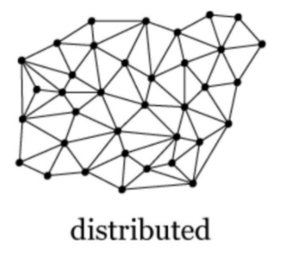
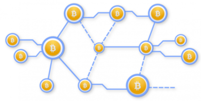
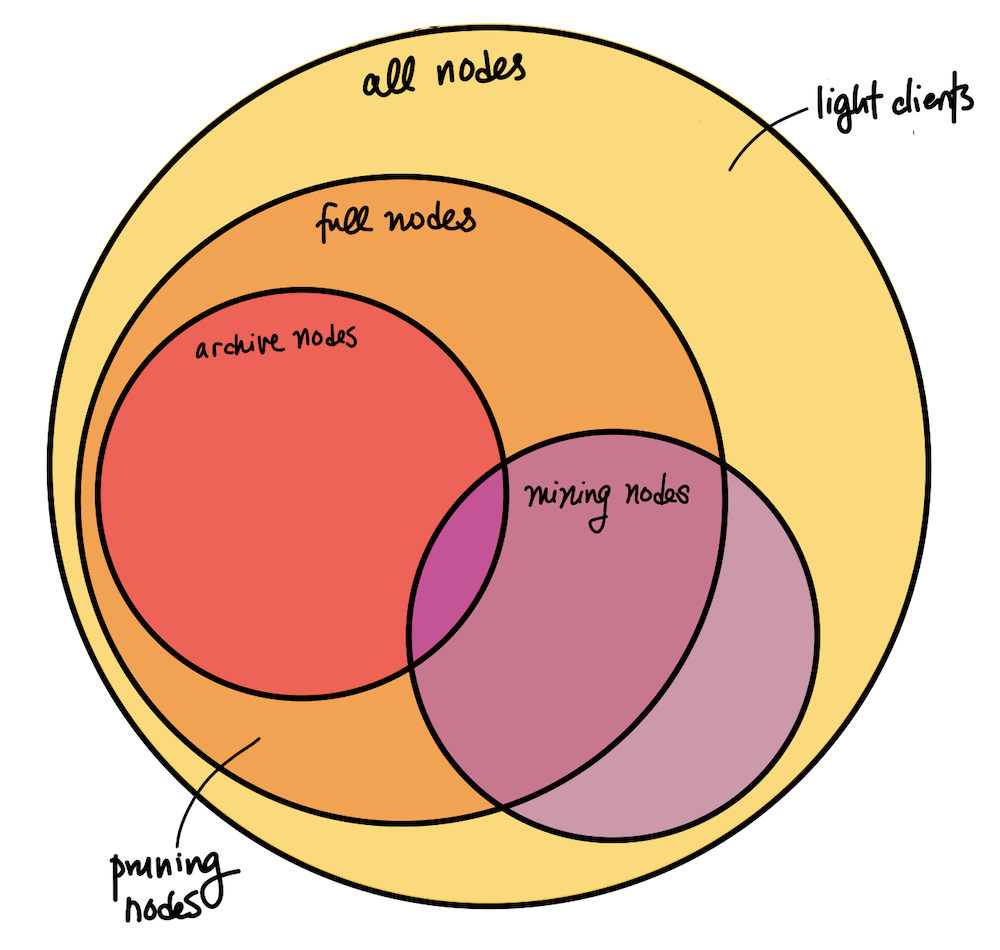
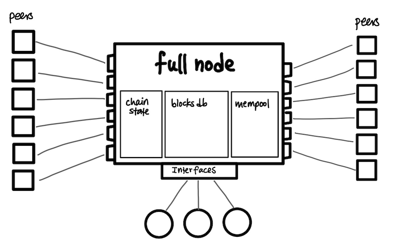
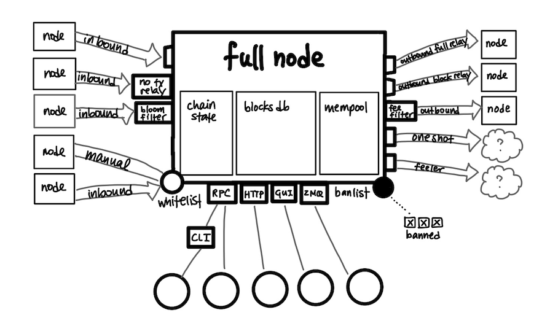
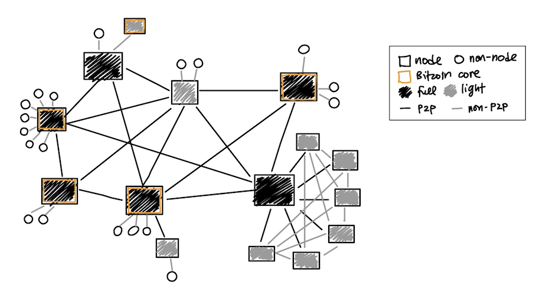

> *作者：Gloria Zhao*
> 
> *来源：<https://medium.com/@gloriazhao/map-of-the-bitcoin-network-c6f2619a76f3>*

比特币网络常被描述为点对点（P2P）、分布式或去中心化的。它常被绘制成如下方所示的同构图：



或某个结构相似，但使用了不同表现的顶点和边的图，如下所示：

节点是什么？它们发挥什么作用？它们是服务器还是客户端，还是二者皆是？在不计其数的比特币软件中，哪些才算作节点？比特币网络中的所有参与者（用户、矿工、节点、钱包）彼此间是如何交互的？

本文用图解的方式阐明了比特币网络中节点相关的定义，并隐去了一些复杂内容。首先，我们根据 服务器/客户端 的功能对不同节点进行分类，并描述它们之间的点对点连接关系。本文主要聚焦于枚举网络中存在的各种可能性，并不提供整个网络的统计数据。

## 简要回答

首先，顶点代表点对点网络中的节点，边代表两个节点之间的连接。节点类别可以根据节点服务其它节点和客户端的能力进行划分。节点可以充当服务器、客户端，或身兼二职。

**节点** = 实现[比特币点对点协议](https://en.bitcoin.it/wiki/Protocol_documentation#Message_types)的点对点网络上的参与者。节点只要遵守该协议就行，并不非得运行某个软件。

**点对点连接** = 网络连接直接在使用比特币点对点协议通信的两个节点之间建立。通常来说，如果一个节点对点连接到其它节点，后者就是前者的“对等节点”（反过来说也是）。

## 节点类型

从广义上来说，我们可以根据节点维护的状态及其可以提供的服务将节点分成 4 大类。

**全节点（完全验证节点）**是能够验证交易和区块的节点。全节点不会在每次验证交易时都搜索区块数据库，而是会存储一些状态，即，UTXO（未花费交易输出，即，比特币）集合。

因此，比特币节点不必为了验证而存储完整的区块链副本，只要维护一些区块元数据和最新的 UTXO 集合即可。**剪枝节点**（pruning node）就是这么做的：它们会下载并处理新的区块以构建验证所需的数据库，然后删除之前的区块来节省磁盘空间。剪枝节点拥有所有信息并且可以验证所有新的区块和交易，因此它们同样是全节点。

**归档节点（Archive Node）**是存储完整区块链副本的节点。归档节点能够验证待上链的交易和区块，查询任意历史区块和交易数据，包括那些与验证无关的数据（因此被命名为“归档”）。归档节点发挥至关重要的作用，因为新加入的节点需要同步完整历史才能成为全节点。为此，新节点必须从归档节点那里一个区块一个区块地下载历史。

**挖矿节点** （Mining Node）是生成新区块的节点。挖矿节点需要维护一个未确认交易池，验证新的交易并通过解开 PoW 哈希难题（即，找到 nonce）来创建区块。挖矿节点通常要使用额外的硬件（即矿机）来帮助他们解开哈希难题或加入矿池。从技术上来说，矿池内也有非全节点，连接到管理矿池的全节点，帮助求解 PoW 难题而不进行任何验证（因此存在非全节点的挖矿节点）。

**轻客户端**指不存储完全验证所需完整状态的节点，因为这类节点相信其它节点会这么做。轻客户端可能会为了验证自己的交易而存储少量数据，但是它们并不验证所有区块。在 Bitcoin Core 中，“轻客户端” 常被用作**简易支付验证（SPV）节点**的同义词，但是请勿将其与剪枝节点混淆。在某些语境下，这类客户端不被称为“节点”，因为【全】节点做的大多数事情它们都不做。

这几类节点的重叠情况如下图所示：

## 其它有关节点的概念

有的节点还具备其它一些特征，影响到了它们在网络中的参与情况，但是这些节点并不相互孤立，也不游离于上述 4 类节点之外。鉴于比特币的去中心化特性和对可及性的需求，**只要节点实现点对点协议并遵守共识规则**，具体的实现细节和决定采用哪些特性均由节点运营者决定。

**初始化区块下载（IBD）**：节点尚未追赶至当前区块高度，还在下载区块链的临时状态。发信号称自己存储了完整区块链副本的全节点可能仍处于 IBD 状态，能够提供的服务也有限（即，无法告诉你它们还没有同步到的交易的信息）。getblockchaininfo RPC 调用会返回节点是否处于 IBD 状态的信息。

**仅验证区块模式（Blocks Only Mode）**：全节点只验证区块及区块内交易的非临时模式。在这种模式下，全节点不验证任何未确认交易（他们自己的交易除外），不维护交易池，并且要求对等节点不要将交易转发给自己。

**Bitcoin Core**：最初由中本聪编写、现由多位贡献者维护的开源软件，可以在 [bitcoincore.org](https://bitcoincore.org/) 或[比特币的 github 库](https://github.com/bitcoin/bitcoin)中找到。我们知道 Bitcoin Core 并非比特币点对点网络中唯一存在的软件。有的节点会运行自定义补丁来实现特定行为，有的节点可能会使用无法理解新型协议消息的旧版本 Bitcoin Core。重要的是，我们要认识到哪些新功能需要全网合作，不奢求所有节点都诚实守信、不会出错，并且考虑到节点运营者面对软件升级时犹豫拖延的情况。

**作恶**：任何蓄意破坏网络的行为（不包括漏洞、网络因素或其它非蓄意行为）。比特币假设了一个高度敌对的环境，包括 DoS 攻击的可能性、意图进行双重花费的 女巫/日蚀攻击、试图将地址去匿名化的间谍节点，等等。

## 将节点作为服务器

如上文所述，每个节点都 *依赖* 对等节点传播所需信息。此外，节点通常通过非点对点界面（如 RPC、HTTP/REST 和 GUI）为大量用户和客户端软件提供服务。

以下是一些可能会使用节点作为服务器的非节点客户端示例：

- **用户**运行节点来发送和接收比特币。

- 用于管理密钥、创建交易的**钱包。**有的钱包还会保存与密钥相关的部分 UTXO 状态，但是不会保存完整的区块链副本，而是依靠节点来获取最新信息。

- **面向用户的软件服务和应用**，例如，区块浏览器、交易所和通过全节点查询信息展示在网页或应用上的服务商。

- **开发者**在 regtest 模式下创建节点以便亲自测试功能和接口。

- **面向开发者的软件**，例如，SDK、API 和其它接口。例如，Bitcoin Core CLI（bitcoin-cli）使用 RPC 接口实现了命令行界面。

虽然这些连接对于一个服务器节点的对等节点来说是不可见的，但是它们构成了比特币功能的重要部分。Bitcoin Core 开发者在开发新功能或决定支持哪些功能时都会充分考虑这些参与者。

既然我们已经了解了节点作为服务器和客户端分别发挥什么作用，下面我们放大看看节点的样子：

- 简化后的节点视图 -

## 点对点连接的类型

比特币中的点对点连接都“说同一种语言”，因为它们都使用点对点协议进行通信，但是通信内容多种多样。Bitcoin Core 实现试图通过促进对等节点发现和管理连接来平衡稳定性（倾向于静态连接）和可及性（倾向于接受来自新节点的连接请求）。Bitcoin Core 根据连接的发起方式将连接分为三大类，通常会影响点对点关系的本质。

**出站**：你的节点通过对等节点发现发起的自动连接。[节点发现](https://en.bitcoin.it/wiki/Satoshi_Client_Node_Discovery)首先会获取已有节点的 IP 地址列表，然后持续动态宣传你自己的地址，并尝试连接你知道的地址。你的节点可能会按需求（例如，在 IBD 状态下）优先选择能够提供特定服务（例如，提供过去的区块和交易）的连接。

**入站**：你的对等节点向你的节点发起的自动连接（对于你的对等节点来说是出站连接）。为确保安全性，入站流量是默认关闭的，你需要完成一些网络和防火墙设置才能启用。

**手动**：手动（例如，通过 CLI 或 RPC）而非自动发起的连接。你可能会因为想要连接自己信任的人所运行的节点或正在测试软件或需要控制连接而创建手动连接。

## 其它关于点对点连接的概念

### **出站连接的多样性**

出站连接可以根据收到的信息和连接的持续时间作进一步细分。

**全转发**出站连接可以交流一切信息，包括区块、交易和[地址](https://en.bitcoin.it/wiki/Protocol_documentation#addr)（用于寻找对等节点，类似 IP 地址，请勿将其与交易中使用的钱包地址混淆）。**仅转发区块**出站连接只接收区块，但不同于仅验证区块模式。全节点只与 1 到 2 个对等节点建立仅转发区块连接，与其它参与者建立全转发连接是再正常不过的事。

**一次性连接（One-Shot）**和**感知连接（Feeler）**都是在节点发现过程中使用的临时出站连接。一次性连接用于请求可以找到新的对等节点的地址列表。感知连接用于验证一个地址是否对应真正的节点。

### 个体差异

正如上文所言，每个节点提供的服务可能不同，需要向对等节点请求的信息也有可能不同。每个连接都从版本握手开始，即，节点发送关于自己的信息（例如，最大区块高度），交涉想要对话的内容（例如，只对区块感兴趣）。连接也有可能因后续消息而发生变化，例如，节点可以通过[手续费过滤消息](https://en.bitcoin.it/wiki/Protocol_documentation#feefilter)来表示它们只愿意转发手续费不低于某个阈值的交易。

### 失去信任、断开连接和拉黑

Bitcoin Core 节点会追踪有恶意行为或运行失灵软件的节点。一旦发现有对等节点行为不当，节点可能会不再信任它们（标记其不当行为，甚至与之断开连接，连接新的对等节点），或者与之断开连接，或者拉黑。

### 权限和白名单

节点还会保存每个对等节点的权限列表，例如，对等节点提供的特定服务或对会被惩罚的不当行为的容忍度。每次连接的版本握手期间都会进行服务协商。自定义的个人轻客户端和由相互信任的人运行的节点都支持手动将不当行为添加至白名单。节点还可以将特定 IP 地址加入白名单。

### 非对称的重要性

请注意，每个连接都是双向的，但是具有**非对称性**：发起方节点理解的可能是【全转发】出站连接、仅转发区块连接、感知连接或一次性连接，但是接收方节点看到的可能只是带有既定规则的入站连接。这是因为节点行为被模糊化，其内部机制或连接本质无法被揭露。

例如，如果一个节点知道其对等节点处于仅验证区块模式（即，拒绝所有待验证交易信息），就知道该对等节点发送给它的所有交易都来自该对等节点的钱包地址。但是，接收方地址实际上看到的只是关闭了交易转发的入站连接，无法区别这是仅验证区块模式、仅转发区块连接还是连接偏好。

更详细的节点视图（请注意箭头方向仅反映连接的发起方，而非表示通信不是双向的）如下图所示：

- 较为复杂的节点视图 -

## 全景图

每个节点掌握的网络信息都是有限的。节点实际上只能看到自己的对等节点，对等节点可能会谎报自己的节点类型。如果一个节点遭到了日蚀攻击，那么它的所有对等节点有可能都是由同一个人运行的。这有利于保护隐私性和安全性，因为攻击者也面临同样的情况。信息局限性会让发起有针对性的攻击变得更难。虽然节点可以通过建立大量的临时连接来大致了解网络中有多少节点，但是无法得到全面的信息。

例如，一个节点是否加入了矿池在网络上并非一目了然。在大致了解哪些节点属于矿池，并观察其出块情况后，一些网站能够生成[算力比例](https://btc.com/stats/pool)分析。但是这些分析可能具有误导性，因为一个实体有可能运行多组节点乃至多个矿池。

综上，我们可以想象出一个简化的网络图：

- 简化后的网络图 -

上图反映了多种 *可能性*，而非网络大小（过于庞大）或拓扑结构（是动态且不可知的）。请注意，有以下几种可能性：

- 一个 Bitcoin Core 全节点通过非点对点接口连接至多个客户端，例如，一个用户从 bitcoincore.org 上下载软件并使用 CLI 或 GUI 发送和接收比特币。

- 轻客户端连接至尽可能多的全节点来为其客户端提供服务。

- 一个全节点服务于一个或多个轻客户端。有一种可能是某个比特币爱好者在利用一些云服务提供商及其个人设备上的轻量级应用运行一个全节点。

- 一个自定义全节点（例如，矿池管理者）通过点对点网络和私有网络连接至一组自定义轻客户端（例如，个人矿池参与者）。

## 结论

希望本文能够帮助读者更好地理解“节点”和“点对点网络”，以及网络中的参与者是如何进行交互的。我还希望能让读者了解 Bitcoin Core 是如何实现点对点连接来保护隐私性、让新节点加入网络的。感谢阅读！

感谢[ John Newbery](https://medium.com/u/f172f16c0e36?source=post_page-----c6f2619a76f3--------------------------------) 和 [Amiti Uttarwar](https://medium.com/u/ac2f03ed1cfa?source=post_page-----c6f2619a76f3--------------------------------) 不吝时间帮助我理解这部分知识。

（完）