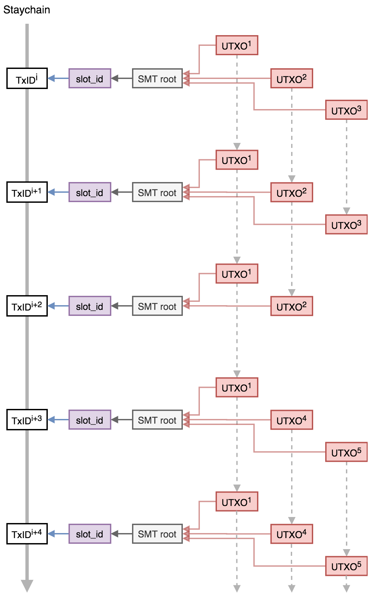
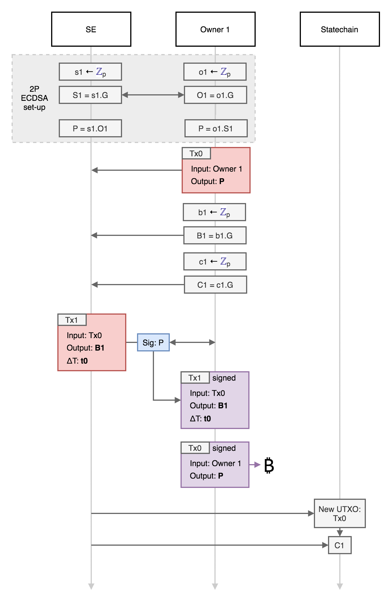
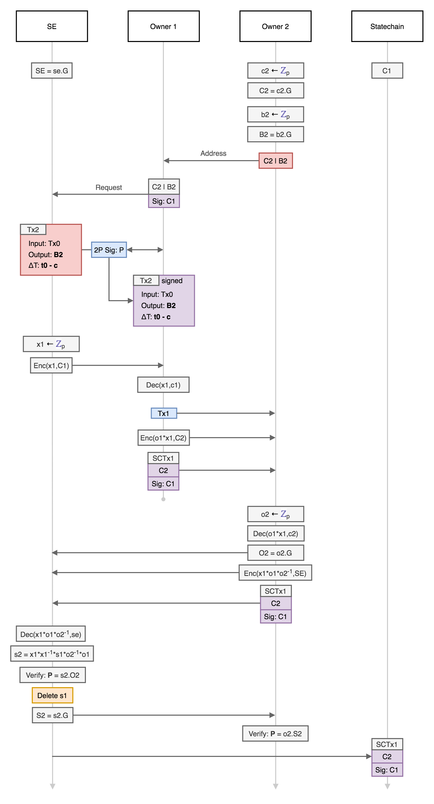

> *作者：CommerceBlock*
> 
> *来源：<https://github.com/commerceblock/mercury/blob/master/doc/statechains.md>*

本文描述了 Mercury 状态链（statechain）[1] 系统的规范，及其不执行链上交易而能在多方间转移比特币（或其它基于 Elements）的 UTXO 的所有权的操作。这种无需链上交易确认（挖矿）的转账执行能力，在许多应用中都有多种好处：

- 所有权的转移可以更快（即时完成）而且成本更低（没有链上交易费）
- 所有权的转移可以更隐私（转账只会记录在状态链上）
- 可以转移一个多签名的 UTXO 的一个公钥的所有权，比如一个谨慎日志合约（DLC），或者一个闪电支付通道，而无需跟对手方合作

这个功能需要一个受信任的第三方，称为 “状态链实体” 或者 “SE”，该实体作为服务提供方，可以收取手续费。但是，至关重要的的是，SE 绝对无法托管相关的 UTXO，这就尽可能地降低了合规上的要求以及 SE 所需的信任。SE 可以由单个实体来做，也可以是多个实体的一个 *联盟*（通过密钥分割来实现，所有参与者都要参与签名生成，见下文的 *联盟状态链实体*）。

## UTXO 类型 

在比特币这样的密码学货币中，UTXO 是定义价值及其所有权的基本单元。一个 UTXO 由一个交易标识符（` TxID `）以及输入索引号（`n`）来标识，并有两个属性：1）价值（以 BTC 计）以及 2）花费条件（以 Script 语言定义）。这个花费条件可以任意复杂（在共识规则的范围内），但最常用的是一个公钥（或者公钥的哈希值），表示只能用对应的私钥签过名的交易来花费。这就是所谓的 “Pay-to-Public-Key-Hash（P2(W)PKH）” 输出。其它更复杂的花费条件包括多签名输出（花费的交易必须由条件中指定的 n 个公钥中的 m 个的签名（`n >= m`）），以及时间锁和哈希锁输出（包括用在闪电网络和 DLC 中的哈希时间锁合约）。

这里描述的状态链模型可以在各方间转移签名单公钥花费条件的能力，或者 2-of-2 多签名的一方参与权，从而允许我们转移（更新） DLC 或者闪电网络通道的对手方位置。

## P2PKH 输出的转移

Mercury 系统最简单的功能就是允许由单个公钥 `P` 控制的单个 UTXO 的所有权转移；并且这种转移无需使用链上的比特币交易（或者说无需改变花费条件）。SE 协助这种所有权的转移，但无法没收或者冻结这样的输出。为了实现这个功能，`P` 的私钥 ` s ` （即  ` P = s·G ` ）要在 SE 和所有权人之间分割，使得没有任何一方完整掌握整个私钥（也即 ` s = s1 * o1 ` ，而 ` s1 ` 是 SE 的私钥碎片， ` o1 ` 是所有权人的私钥碎片），所以花费这个 UTXO 需要所有权人和 SE 的合作。但是，这样分割私钥，SE 就可以跟原始的所有权人配合改变自己的私钥碎片（ ` s1 -> s2 ` ）而不改变整个私钥，即，使用一个新的所有权人密钥碎片使得 ` s1 * o1 = s2 * o2 ` ；这个过程没有一方需要公开自己的私钥碎片，也无法知晓完整的私钥。这样一来，UTXO 的排他性控制权就可以传递给新的所有权人，而无需发起链上的交易，只需要新的所有权人相信 SE 会遵守协议、删掉/覆盖掉 跟原所有权人成对的私钥碎片即可。

这个关键的 更新/转移 机制还可以额外跟一套 *后备* 交易系统相结合，后者可以帮助 UTXO 的当前所有权人在 SE 不配合或者消失的情况下拿走 UTXO 中的价值。后备交易是在所有权转移发生时，由新的所有权人和 SE 共同签名的，将资金支付给新所有权人控制的一个地址。为了防止前任所有权人（所有并非最新所有权人的人）广播他们的后备交易并偷走资金，交易的  ` nLocktime ` 值会被设定为未来的一个区块高度，每当 UTXO 的所有权转移，交易的  ` nLocktime ` 的值就递减，因此最新的所有权人总是能最快发起交易拿走 UTXO 中的价值。

- 图 1. 已经确认的充值交易，以及在链下由 4 个所有权人分别签过名的后备交易；后备交易的 nLocktime 是递减的 -

递减的时间锁备份机制限制了在一定的锁定时间内可以发起的转账次数，将由 SE 来指定和执行。为了保证有效的后备交易会在正确的时间广播到比特币网络中，并防止之前的所有权人盗窃资金，SE 运行多个 *瞭望塔* 服务器来监视区块高度并在需要时广播用户的后备交易。如果 SE 宕机了，那么用户就需要自己在合适的时间提交后备交易到比特币网络中；应用程序可以自动完成这个操作。

一笔 P2PKH 资金从存入一个状态链、在该状态链中转移、最后取出的生命流程可以总结如下：

1. 存入者（1 号所有权人）将 BTC 支付给一个由 1号所有权人和 SE 以分割的密钥控制的 P2PKH 地址，从而初始化一个 UTXO 状态链。此外，SE 和存入者可以合作签名一个花费该 UTXO 的后备交易；该后备交易会将资金转入一个由 1 号所有权人控制的地址，但它带有相对时间锁，只能在 `nLocktime ` 字段规定的区块高度之后才能上链；而且只需在 SE 不配合操作的时候才需要上链。
2. 1 号所有权人 可以通过一个密钥更新流程、可验证地将该 UTXO 的所有权转移给另一方（2 号所有权人）；密钥更新流程会覆盖 SE 与 1 号所有权人初始化的私钥碎片并 *激活* 2 号所有权人的私钥碎片。此外，转账过程可以带有一个新的后备交易的合作签名流程。这笔新的后备交易会将资金转入一个由 2 号所有权人控制的地址，但它带有相对时间锁，只能在 `nLocktime ` 字段规定的区块高度之后才能上链；而该笔交易的相对时间锁会比上一笔后备交易（1 号所有权人的那笔）的更短（相隔一个合理的确认间隔）。
3. 这个转账过程可以重复多次，直到最新一笔后备交易的 `nLocktime ` 已经降到当前的比特币区块高度。
4. 任何时候，最新的所有权人和 SE 都可以合作签名一笔交易来花费这个 UTXO 并将资金转入最新所有权人所控制的地址（这就是取款）。

- 图 3. 存入 UTXO、先后转账给 6 个新的所有权人并最终取款的图示 -

如下所述，UTXO 的多重花费（double spend）（由腐败的 SE 发起）被来自 Mainstay 协议的 “唯一性证明（proof-of-uniqueness）” 阻遏。所有权人之间的每一次 UTXO 转账都会被记录在 SE 状态链上，而每一次转账都需要一个来自当前所有者的签名（译者注：此处的 “current owner” 应指发起转账的旧所有权人，UTXO 的卖方）。除了最新的所有权人，任何人花费该 UTXO 的行为都可以被最新所有权人明确证明为欺诈。

## UTXO 状态链

Mercury 系统的本质功能是它让一个 UTXO 的 “所有权”（以及控制权）可以在两方之间转移、他们两方之间无需相互信任，而且只需通过 SE 而无需发起链上交易。只要 SE 值得信任会运行整个协议（并且不会存储关于旧的私钥碎片的任何信息，这至关重要），所有权的转移就是绝对安全的，即使 SE 后来被劫持或遭黑客也不会影响其安全性。任何时候，SE 都可以证明自己只拥有跟最新的所有权人配对的私钥碎片（而且只拥有跟 TA 配对的）。用户还需要额外信任 SE 不会重复花费这个 UTXO，但 SE 若要这样做，还需跟当前所有者串通，而新的所有者（即 UTXO 的买方）要自己防范这一点（即 SE 和当前的所有权人没有把所有权转移给两个乃至更多买家）（译者注：可以看出，这里的 “当前所有权人” 也是发起转账的人，是 UTXO 的卖方）。为了保证这一点，新的所有权人要请求一个他们的所有权的 *唯一性证明*：这是靠 UTXO *状态链* 来实现的 —— 不可更改而且独一无二的可验证的所有权转移序列。UTXO 的卖方需要用所有权密钥来签名一个 *状态链交易*（`SCTx`），以转移所有权给新的所有权人（也即一个新的所有权密钥）。这意味着，腐败的 SE 和旧的所有权人串通盗窃 UTXO 的行为可以被独立而确凿地证明。

这个 *所有权证据* 是一个 UTXO 的完整历史中的所有权密钥（以及签过名的转账）的唯一序列。这个完整历史由 SE 公开，并使用 Mainstay 协议来保证这个序列是唯一的而且不可更改的。这要用到比特币的全局状态（结果是每次所有权变更的一个可验证的 *出版证明（proof of publication）*）。

### 稀疏默克尔树

特定的 SE 可以通过单个 Mainstay 存储槽为其管理的所有 UTXO 所有权转移序列操作出版证明（详情见 Mainstay 协议的[文档](https://commerceblock.readthedocs.io/en/latest/mainstay-con/index.html)）。SE 会在每次更新所有权时承诺一个[*稀疏默克尔树（SMT）*](https://eprint.iacr.org/2016/683.pdf) 的树根到一个指定的存储槽里面（而这个存储槽又会每隔 一个区块/一个小时 得到比特币 staychain 的见证）。这个 SMT 的每个叶子都是一个由该 SE 管理的唯一 UTXO TxID（是 256 位的数字），这些 UTXO 的所有权每次变更时，新的 UTXO 状态链都记录到相应的叶子中。使用 SMT 使我们可以证明每一个叶子的承诺都对应于唯一的 UTXO TxID。

- 图 4. UTXO 的所有权（状态链）由稀疏默克尔树（SMT）来承诺；而 SMT 的根值又由确定的 Mainstay 存储槽（<code>slot_id</code>）来承诺；而存储槽又由发布到比特币区块链上的 staychain 交易来承诺 -

### 所有权转移

UTXO 的所有权序列由一个 *状态链交易*（`SCTx`）的链条组成（状态链交易即是转移所有权的见证）。这个链条从存入者的 *证据性公钥* 开始，每次 UTXO 的所有权从一个所有权人转移给另一个所有权人，原所有权人就必须签名状态链以及新的所有权证据性公钥。

具体来说，当一个用户跟 SE 存入一个 UTXO 的时候，他们提供一个证据性公钥 `C1` （只有存入者才知道对应的私钥 ` c1 ` ）。这个初始状态（ ` s_1 = H(C1) ` ，而 ` H(...) ` 表示 SHA 256 哈希函数）承诺到 SE 的稀疏默克尔树，叶子位置是 UTXO 的 TxID。

当存入者（ ` C1 ` ）转移所有权给 ` C2 ` 时，TA 提供对 ` s_1|C2 ` 的签名 ` sig_C1 ` ，而新的状态就成了： ` s_2 = H(s_1|C2|sig_C1[s_1|C2]) ` 。这个状态也在同样的 UTXO 的 TxID 的位置，承诺到 SMT。

当所有者 ` C2 ` 转移所有权给 ` C3 ` 时，C2 也提供对  ` s_2|C3 ` 的签名 ` sig_C2 ` 。新的状态时： ` s_3 = H(s_2|C3|sig_C2[s_2|C3]) ` 。以此类推。每当所有权从旧密钥转移给新密钥时，新状态都是： ` new_state = H(old_state|new_key|sig_old_key[old_state|new_key]) ` 。

如果在 Mainstary 两次见证期间所有权未发生变更，状态旧不改变（最新的存储槽见证依然是出版证明）。如果在存储槽的两次见证期间所有权变更得很频繁，那么，每次转账依然会更新所有权状态，而当前的状态就推迟到下一个间隔来见证。

- 图 1. UTXO 状态发布的默克尔证据。由 TxID 标记的 UTXO 的承诺状态随着所有权在公钥间的转移而更新。 -

### 欺诈证明

一个 UTXO 的状态链（及其发布在比特币 staychain 上的出版证明）可以被当前的所有权人用作所有权证明，以及在 UTXO 不经他们许可而被（保留了旧私钥碎片的腐败 SE）花费时用作欺诈证明。这是保证 SE 诚实的强有力激励，而且可以防止他们犯下大规模的欺诈。要花费这个 UTXO，当前的所有权人必须用他们的证据性公钥（ ` C ` ）签名一个  ` SCTx ` 交易，发往这笔比特币 UTXO 支付到的地址 —— 只要这个地址不同，就证明了 SE 是腐败的。

这个（通过 Mainstay 实现的）出版证明可以被所有权人用作 UTXO 所有权唯一性的证明，但是，它是有时延的，受制于 Mainstay 的见证周期（也即比特币区块的确认时间）。没有办法能够更快地确认所有权，但欺诈证明可以。状态可以即时承诺到未确认的 Mainstay 交易（并通过手续费替代（replace-by-fee）机制来更新），后者需要得到 Mainstay 运营者的签名。

## 协议

### 预备工作

SE 和每一个所有权人都必须安全地生成私钥并验证 UTXO 的所有权（这个可以通过一个钱包接口来实现，但严格来说应该需要连接到一个完全验证的比特币节点）。椭圆曲线点（公钥）表示为大写字母，私钥表示为小写字母。椭圆曲线点乘法（即从私钥生成公钥的算法）用符号 ` . ` 来表示。所用的标准化椭圆曲线（例如 secp256k1）的生成器点记为 ` G ` 。所有（在 Zp）中对秘密值的代数运算都对 EC 标准的域求模。

这个协议需要一个 2-of-2 的多方安全计算（MPC）ECDSA 实现（不会在这里描述 —— 有许多不同的算法在效率和安全假设间取舍：但初步的计划是使用 [4] 和 [5]）。这个 2-of-2 的 ECDSA 实现有两方参与（其私钥记为 ` a ` 和 ` b ` ），而共享公钥为 ` P = ab.G ` ，而且双方合作创建 ` P ` 的签名，无需公开 ` a ` 或者 ` b ` 。

此外，需要为在各方间发送的盲化私钥信息准备一种公钥加密方案。而且这种方案需要跟签名所用的椭圆曲线密钥兼容，所以我们使用 ECIES。使用 ECIES 操作的记号如下： ` Enc(m, k) ` ，表示使用公钥 ` K = k.G ` 来加密消息 ` m ` ； ` Dec(m, k) ` ，表示使用私钥 ` k `  来解密消息 m。

所有的交易都使用隔离的见证数据来创建和签名，隔离见证使得输入交易的 ID 可以在签名前被确定，从而防止交易变形。SE 指定和公开一个 Mainstary 存储槽 ID（ ` slot_id ` ），用于存储 SMT 的根；而所有的 UTXO 的状态链都可以根据这个 SMT 的根得到验证。

### 存入

一个所有权人希望存入一笔 BTC 到平台中，于是 TA 请求 ` SE ` 合作开展初始化和密钥生成的流程。为了防止对匿名服务器的 DoS 攻击， ` SE ` 可能在处理前会要求存入者为请求存入的资金提供所有权证明（即签名）。然后开展下列步骤：

1. 存入者（1 号所有权人）生成一个私钥 ` o1 ` （这个所有权人的私钥碎片）
2. 1 号所有权人计算私钥碎片  ` o1 ` 的公钥 ` O1 = o1.G ` 并发送给 SE
3. SE 生成一个私钥 ` s1 ` （即 SE 的私钥碎片），计算相应的公钥 ` S1 = s1.G ` 并发送给 1 号所有权人
4. SE 和 1 号所有权人把收到的公钥和自己的私钥碎片相乘，得到共享公钥  ` P ` ： ` P = o1.(s1.G) = s1.(o1.G) `  （该公钥对应的私钥是 ` p = o1 * s1 ` ）

> 上述的私钥分割方案跟两方的 ECDSA 协议 [4, 5] 所用的方案是一样的。这些现有的两方 ECDSA 实现的密钥生成例程可以用在上述步骤中（它们包含了额外的验证和证明步骤）

5. 1 号所有权人生成  ` b1 ` （后备私钥）并计算 `B1 = b1.G`
6. 1 号所有权人生成  ` c1 ` （证明性私钥）并计算  ` C1 = c1.G ` 
7. 1 号所有权人创建一个充值交易（ ` Tx0 ` ）来支付数额  ` A ` 到对应于公钥 ` P ` 的地址（但并不签名）【这笔交易可能也包含一个输出是支付给 SE 的手续费  ` F ` 】。这定义了 UTXO 的 ` TxID ` 。这笔交易会发给 SE。
8. 1 号所有权人创建一笔 *后备交易*（ ` Tx1 ` ），该交易花费  ` Tx0 ` 的 ` P ` 输出并支付给 ` B1 ` ，并将 ` nLocktime ` 设定为初始化的未来区块高度 ` h0 ` （ ` h0 = cheight + hinit ` ，此处的 ` cheight ` 是当前的比特币区块高度，而 ` hinit ` 是被指定的初始锁定时间）。
9. SE 从 1 号所有权人处收到后备交易 ` Tx1 ` 和证明性公钥 ` C1 ` ，并验证 ` nLocktime ` 字段。然后，1 号所有权人和 SE 通过两方的 ECDSA 签名流程，为 ` Tx1 ` 提供对应于共享公钥（ ` P ` ）的签名，然后 1 号所有权人存储 ` Tx1 ` 和相应的签名。
10. 1 号所有权人签名并广播存入交易 ` Tx0 ` 。这笔交易得到区块确认之后，存入操作就完成了。
11. SE 将公钥 ` C1 ` 添加到 SMT 上  ` Tx0 ` 的 TxID 位置的叶子中。然后，这个 SMT 的根值会写入存储槽 ` slot_id ` ，通过 Mainstay 协议得到比特币区块链的见证。

- 图 4. 存入协议 -

这套存入协议的设计目的是保证无论哪一方在哪一个阶段不合作，都不会使资金丢失。SE 签名了后备交易之后，资金就支付给共享公钥。

### 转账

1 号 希望将存入的价值  ` A ` 转移给一个新的所有权人（2 号所有权人）（比如是作为一个复杂贸易的一笔支付）。要处理这个转账，新的所有权人必须知道标记 SE 身份的公钥（ ` SE ` ）。新的所有权人要求当前的所有权人通过对一条消息签出自己发布在状态链上的公钥碎片（ ` O1 ` ）的签名，来证明自己的唯一所有权。这个协议运行如下：

1. 接收者（2 号所有权人）生成一个后备私钥 ` b2 ` 以及一个状态证明性私钥 ` c2 ` （为了隐私，将使用不同的私钥）。然后计算相应的公钥 ` B2 = b2.G ` 和 ` C2 = c2.G ` 。
2.  ` B2|C2 ` 表示 2 号所有权人的 “地址”，并告知 1 号所有权人（或者公开），以便后者 “发送” 所有权
3.  1 号所有权人请求 SE 协助转账给 2 号所有权人（而新的所有权人可以用 ` C2 ` 来验明正身）
4.  SE 生成一个随机密钥 ` x1 ` ，并使用 1 号所有权人的状态链公钥来加密它： ` Enc(x1, C1) ` 
5.  ` Enc(x1, C1) ` 被发送给 1 号所有权人，TA 使用 ` c1 `  来解密： ` Dec(x1, c1) ` ，从而获知  ` x1 ` 
6. 1 号所有权人计算 ` o1 * x1 ` ，并使用 2 号所有权人的状态链公钥（从 “地址” 中获得）来加密这个信息： ` Enc(o1 * x1, C2) ` 
7. 1 号所有权人创建一笔新的 *后备交易*（ ` Tx2 ` ），该交易将花费 ` Tx0 ` 的 ` P ` 输出并支付给 ` B2 ` ，并将该交易的  ` nLocktime ` 设成 ` h0 - (n-1) * c ` ，这里的 ` c ` 是确认的间隔，而 ` n ` 是所有权人的号码（在这里就是 2）。
8. SE 收到 ` Tx2 ` 之后，验证 ` nLocktime ` 字段等于 ` h0 - (n-1) * c `。然后 1 号所有权人和 SE 通过两方的 ECDSA 签名流程生成的 ` Tx2 ` 对应于共享公钥（ ` P ` ）的签名，然后 1 号所有权人可以保留下这笔交易和签名。

> 这里的步骤 3 ~ 8 只需要 1 号所有权人与 SE 交互，而且在 2 号所有权人有需要加入之前的任意时段都可以执行。

9. 1 号所有权人检索 UTXO 状态链（所有权序列），找出  ` Tx0 ` 并使用私钥 ` c1 ` 签名给 ` C2 ` 的所有权，这就是 ` SCTx1 ` 
10. 1 号所有权人给 2 号所有权人发送一条消息，消息包含四个对象： ` Tx2 ` 、 ` SCTx1 ` 、 ` Enc(o1 * x1, C2)

> 这个时候，1 号所有权人可以将所有必须的信息发送给 2 号所有权人，不再参与这个协议。2 号所有权人验证这四个对象的正确性和有效性，然后支付就完成了。然后 1 号所有权人就可以跟 SE 在任何时间完成密钥更新。

SE 的私钥碎片更新流程如下：

11. 2 号所有权人生成一个新的输出私钥碎片 ` o2 ` 并计算 ` O2 = o2.G ` 
12. 2 号所有权人解密对象 d： ` Dec(o1 * x1, c2) ` ，然后计算 ` o1 * x1 * o2_inv ` ，此处的 ` o2_inv ` 表示私钥 ` o2 ` 的模逆
13. 2 号所有权人加密 ` Enc(o1 * x1 * o2_inv, SE) ` ，并签出对应于 ` C2 ` 的签名，连带着 ` SCTx1 ` 和 ` O2 ` 发送给 SE。
14. SE 解密  ` Dec(o1 * x1 * o2_inv, se) ` 来获知 ` o1 * x1 * o2_inv ` 。
15. 然后 SE 可以用 ` x1_inv * s1 ` 乘以上面这个树来计算 ` s2 = o1 * o2_inv * s1 ` （ ` x1_inv ` 是 ` x1 ` 的模逆）
16. 然后 SE 可以验证 ` s2.O2 = P ` ，并删除私钥碎片 ` s1 ` 。如果 SE 的操作试运行在一个安全的环境中的，这个过程的一个远程见证数据可以发送给 2 号所有权人

>  ` s2 ` 和 ` o2 ` 现在成了公钥 ` P = s2 * o2.G `  所对应的私钥碎片，而公钥没变（即 ` s2 * o2 = s1 * o1 ` ），而且没有任何一方知道了完整的私钥。给定 SE 删除了 ` s1 ` ，那么除了最新这个所有权人（TA 知道 ` o2 ` ），没有任何人能花费这个输出。

17. SE 给 2 号所有权人发送公钥  ` S2 = s2.G ` ，后者可以验证  ` o2 * S2 = P ` 
18. SE 将公钥  ` C1 ` 加入到 SMT 位于 ` Tx0 ` 的 TxID 位置的叶子中，这个 SMT 的根后面会通过 Mainstay 协议的存储槽 ` slot_id ` 而得到比特币区块链的见证

- 图 5. 所有权转移协议 -

> SE 为用户建立一个后备交易的数据库，并在合适的时间广播这些交易（假如用户离线的话）。

### 有序取款

一笔存入资金的当前所有者总是能够从平台中取款，以获得共享密钥的完整控制，或者广播一笔联合签名后的交易。当前的所有权人可以请求 SE 配合签名一笔交易，将 UTXO 中的价值支付给由所有权人指定的地址。SE 可能希望收取一笔取款手续费（ ` F ` ），这个输出也可以包含在交易中。

整个流程如下：

1. 当前的所有权人（例如：2 号所有权人）创建一笔交易 ` TxW ` ，花费 ` Tx0 ` ，支付给地址 ` W ` 
2. 所有权人请求 SE 配合，为这笔交易生成对应于公钥 ` P ` 的签名
3. 所有权人用密钥 ` C2 ` 签名当前的状态以及 ` H(W) ` ，并发送给 SE
4. SE 和所有权人签名 ` Tx ` ，SE （译者注：应为所有权人）必须确认 ` TxW ` 是支付给 ` W ` 的（否则就要创建欺诈证明）
5. 完整签名的 ` TxW ` 广播到网络中并得到确认
6. SE 承诺关闭字符串到 SMT 位于  ` Tx0 ` 的 TxID 位置的叶子中，以保证 UTXO 所有权链条的关闭是可验证的。

### 后备交易取款

在 SE 消失或不与当前的所有权人配合的情形中，当前的所有权人可以通过提交踢出交易（kick-off transaction）以及（在时间锁延迟后）后备交易来转移资金到自己控制的地址。为了让踢出交易得到确认，所有权人必须同时提交一笔 CPFP 交易（花费父交易的子交易）来花费 ` TxK ` 的 ` OP_TRUE ` 输出。

整个流程如下：

1. 当前的所有权人创建一笔手续费支付交易 ` TxF ` ，该交易以 ` TxK ` 的带有 ` OP_True ` 的输出作为输入，以及其它签过名的输入；该交易要为 ` TxF ` 和 ` TxK ` 给出足够高的矿工费
2. 当前的所有权人广播 ` TxF ` 和 ` TxK ` ，等待这两笔交易得到比特币区块链的确认
3. ` TxK ` 得到确认之后，当前的所有权人在 ` nSequence ` 时间锁过期后，广播自己的后备交易（在这里是 ` Tx2 ` ）。

> 当前的所有者必须保证在时间锁过期后立即广播后备交易，以防止前任所有者在更长的时间锁过期后拿走资金。

[1] https://github.com/RubenSomsen/rubensomsen.github.io/blob/master/img/statechains.pdf

[2] https://github.com/bitcoin/bips/blob/master/bip-0068.mediawiki

[3] https://www.ncbi.nlm.nih.gov/pmc/articles/PMC6124062/

[4] https://eprint.iacr.org/2017/552.pdf

[5] https://eprint.iacr.org/2019/503.pdf

[6] https://adiabat.github.io/dlc.pdf

