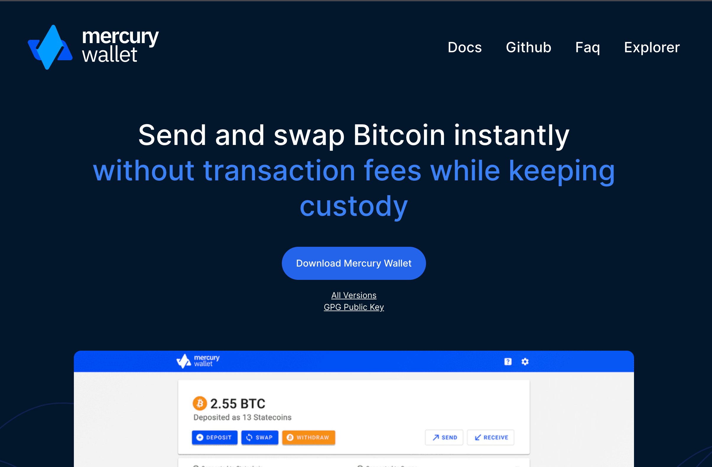
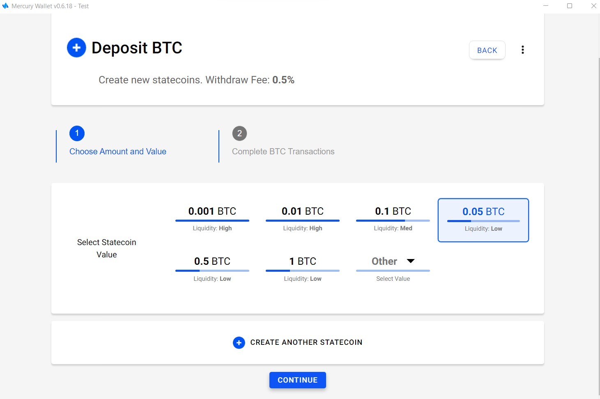
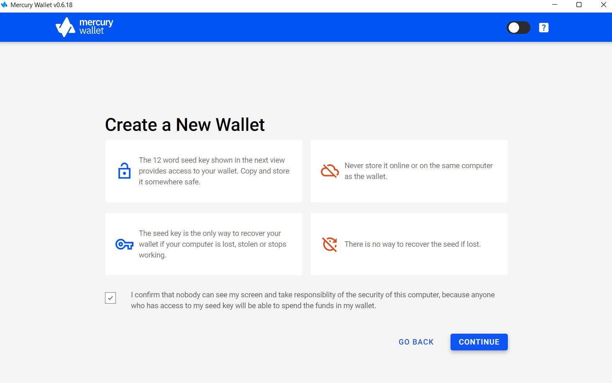
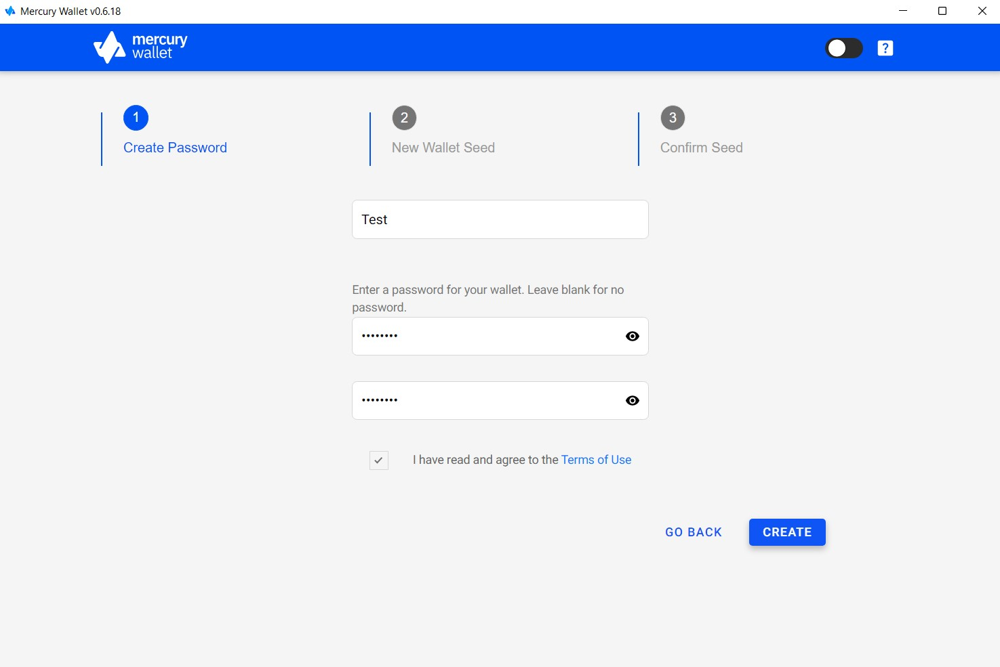
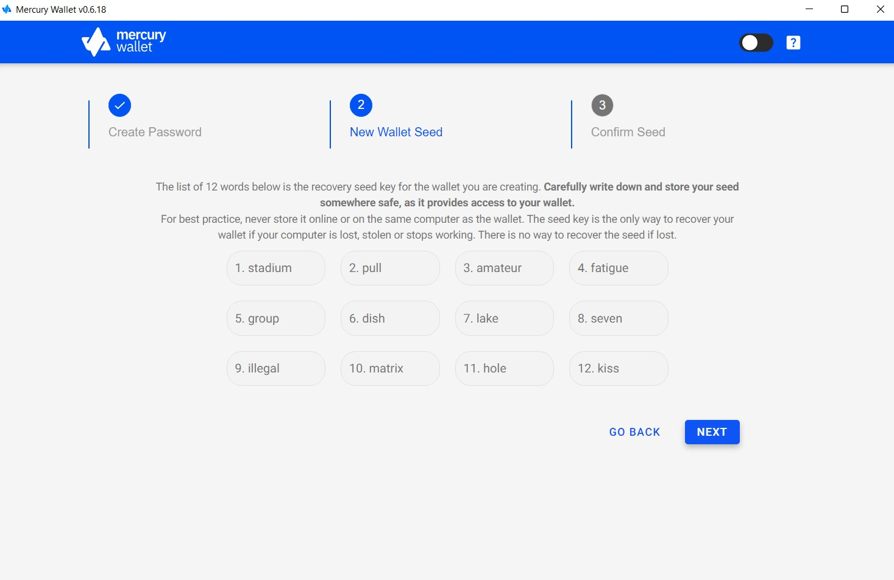
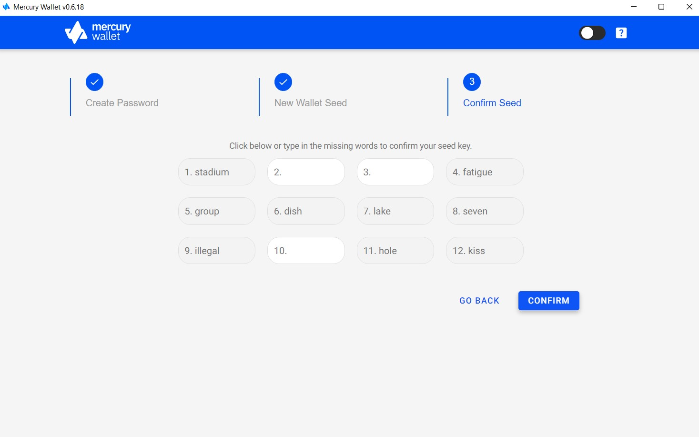
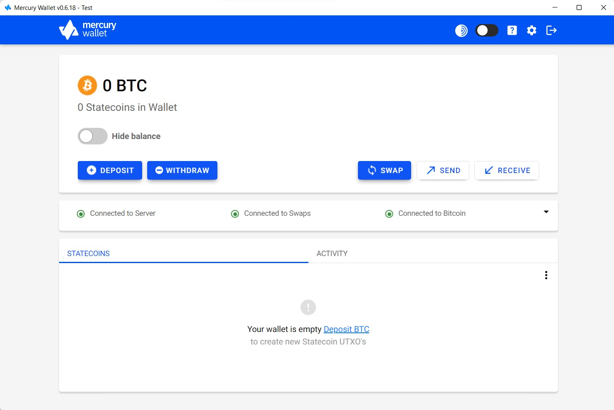
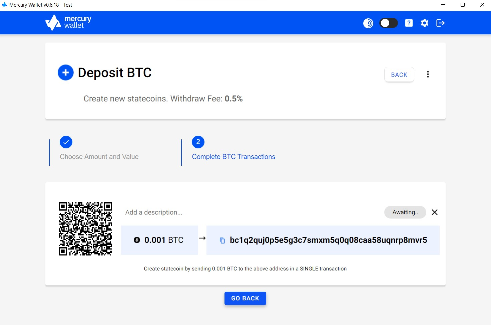

> *作者：Sudhir Khatwani*
> 
> *来源：<https://themoneymongers.com/crypto-wallets/mercury-wallet-review/>*

在日新月异的密码学领域，总有新兴事物可以讨论，令人沉迷其中。[Mercury 钱包](https://mercurywallet.com/)就是这样一款新产品。

Mercury 钱包可以让用户即时发送和互换比特币，而且无需支付任何交易费。不同于其它钱包，Mercury 钱包采用 Layer 2 状态链协议，支持比特币输出的链下转账和结算，同时让用户保有对比特币输出的完整控制权。

但是，如果你从未听过这个密码学钱包，那么你来对了。在本文中我会详细解释 Mercury 钱包的每一个细节。

## Mercury Wallet 是什么？



[Mercury](https://mercurywallet.com/) 是一种新型比特币钱包，基于新型比特币 Layer 2 扩容技术，并用到了状态链的概念。

也就是说，Mercury 钱包可以让用户在无需支付交易费的情况下玩转自己的比特币存款（UTXO），因为比特币无需通过链上交易即可在持有者之间安全转移。

因此，作为所有者，你能够即刻将一定数量的比特币的完整控制权转移给任何人。这有助于提高隐私性，同时可省去矿工费。

Mercury 钱包用到了 UTXO 的概念（UTXO 是定义比特币等密码学货币的价值和所有权的基本对象 ）。UTXO 由交易 ID（TxID）和输出索引号（n）标识。

Mercury 钱包系统的最简单功能是，无需通过链上交易即可将单个密钥控制的每个 UTXO 的所有权从一方转移至另一方。状态链实体可以在不使用链上交易的情况下实现所有权变更，但是无法强占或冻结输出。

## 速入门 Mercury 钱包

Mercury 钱包使用起来非常简单，支持使用 Mac 和 Windows 系统的电脑。但是，就像大多数密码学钱包那样，Mercury 钱包没有移动应用。另外，Mercury 钱包不支持除比特币以外的其它币种。

无疑，Mercury 钱包可以让你通过匿名方式转移并存储资金，而且使用起来非常简单。如果你是首次使用 Mercury 钱包，请参照以下步骤：

- 首先，通过官网下载 Mercury 钱包，并安装到桌面上。

- 安装完成后，启动钱包，你就会看到三个选项：“创建新钱包”、“通过助记词/备份恢复”和“载入已有钱包”。点击“创建新钱包”，然后点击“继续”。

- 进入下一个界面后，你会看到一些基本提示信息，例如，将你的 12 个助记词抄写下来保存到安全之处等等。请在确认后点击“继续”。

- 接下来，为你的钱包命名，创建长度为 8 个字符的口令，再点击“创建”按钮。

- 进入下一个界面，你会看到刚才创建的钱包的助记词。请抄写下助记词，以便日后找回钱包。（译者注：作者只是为了教学才把助记词公开，在现实中请绝对不要把向他人公开你的助记词，因为私钥代表着一个账户的完整控制权，得知了你的助记词的人就可以拿走你存放在该账户内的所有资金。）

- 确认过助记词后，你就可以使用你的 Mercury 钱包了。（译者注：这是钱包软件自动执行的一个安全步骤，为的是保证你已经记下了助记词。）

- 现在，你已经可以开始使用新创建的钱包了。下面，你需要创建一条状态链。在钱包的控制面板上点击“存款”按钮即可。

- 接下来 ，你要选择在一条状态链中存入多少钱。你既可以选择常见的数额，也可以输入一个你想要的值。（译者注：合适的数额可以让你更容易跟他人互换资金从而提高隐私性，所以钱包标出了不同数额的流动性高低，也即是互换的难易程度。详见下文。）

- 这会生成一个比特币存款地址。你要复制该存款地址，并将你的比特币发送至该地址。

- 存款成功后，你就可以使用 Mercury 钱包与其他用户互换状态币了。

## 什么是 Mercury 钱包的状态链和状态币？

不同于其它密码学钱包，Mercury 钱包基于状态链和状态币这两个概念。你可能会想知道这两个术语是什么意思。

让我来简单解释一下：

- **状态链**：状态链是一种密码学结构，包含一条由数字签名组成的链，用来在所有者之间转移特定状态币的所有权。就像区块链那样，状态链无法更改或编辑，充当状态币没有二次花费的证明。

- **状态币**：状态币代表被存入某个地址的特定数量的比特币，并且该地址的对应私钥由存款人和 Mercury 服务器（“状态链实体”）各持一部分。此外，存款人持有带有时间锁的备份交易，能够在指定锁定时间段后取回自己的比特币。状态币的对应私钥没有任何人知道。交易必须由所有人和状态链实体联合签署。

## 什么是互换？

Mercury 钱包也具备互换功能。互换可以用来增强隐私性，因为它可以让用户通过盲互换协议与其他用户匿名交换等价值的状态币。

Mercury 钱包会自动执行匿名用户之间的互换。你只需通过 Mercury 互换导体加入互换组。此外，Mercury 钱包还会为你提供钱包中每个状态币的隐私状态信息。

如需加入互换组，点击钱包控制面板上的“互换”按钮，然后点击“加入小组”，即可通过 Mercury 钱包与其他用户互换状态币。

## Mercury 钱包能侵占我的比特币吗？

Mercury 钱包不会侵占你的比特币。如果交易没有完成，你的比特币也不会丢失。在 Mercury 协议中，Mercury 服务器会通过基于 HSM（硬件安全模块）的 Intel SGX 安全删除私钥碎片。

Mercury 钱包永远都无法控制用户的存款，也无法释放比特币。如果 Mercury 服务器消失，或交易没有达成，原所有者必须等待锁定时间段结束才能重新获得对比特币的控制权。

## 状态币如何转移给新的所有者？

Mercury 钱包在所有者之间转移状态币的流程非常简单。首先，状态币的收款方会生成一个状态币地址，该地址是由 Bech32 编码的公钥，并以 SC 作为前缀。

付款方需要将地址输入其钱包，再由钱包与 Mercury 服务器联合生成经过编码的转账消息。

转账消息包含一个签了名的备份交易和一个盲密钥转账值。其中，备份交易声明了新旧所有权的密码学证明。然后，收款方会在其钱包内验证该转账消息，并通过服务器完成转账。

私钥碎片也会更新。因此，只有收款方的新私钥碎片才能用来与服务器共同签署有效交易。前所有者（付款方）的私钥会失效。

## 总结

这就是 Mercury 钱包的全部内容。基于状态链概念的 Mercury 钱包将成为比特币钱包领域的下一个热点。

此外，Mercury 钱包是能够实现链下交易的极少数钱包之一。但是，我希望在不久的将来，Mercury 钱包将支持更多币种。

快来试试 Mercury 钱包，亲身体验它的运作方式吧。如果你遇到任何问题，请在下方评论区留言。

（完）