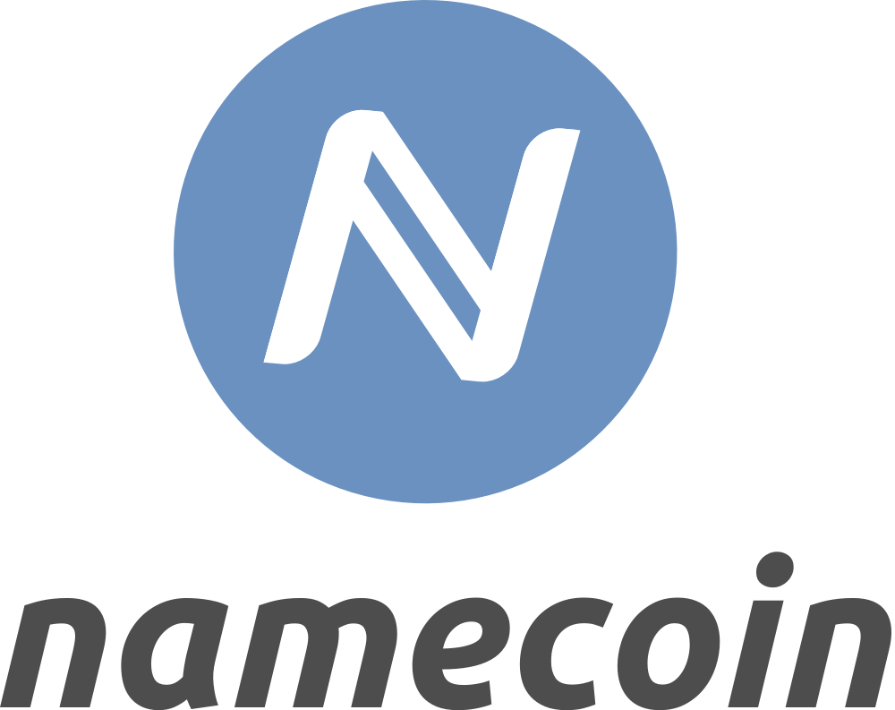
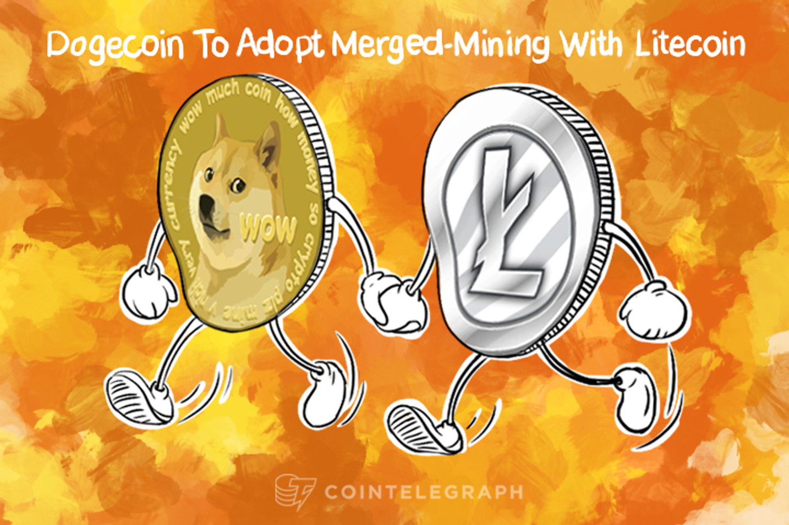
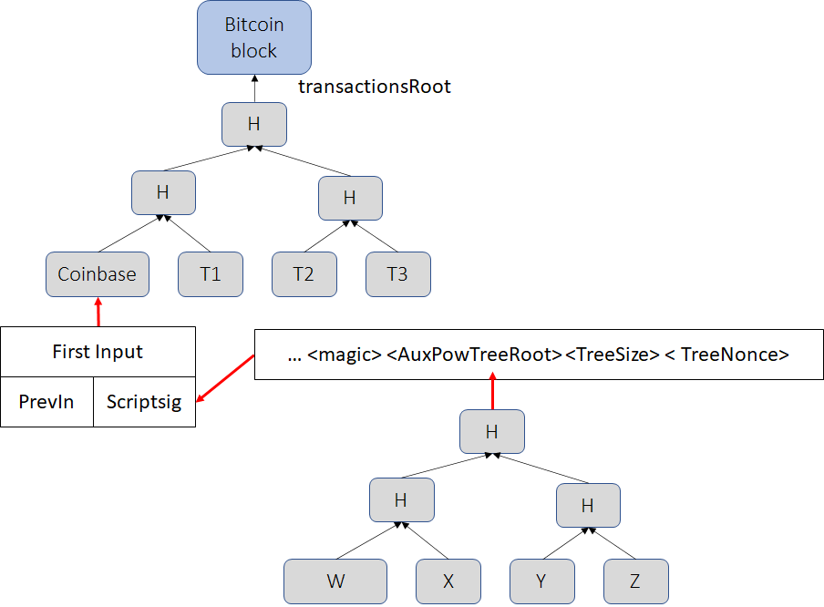
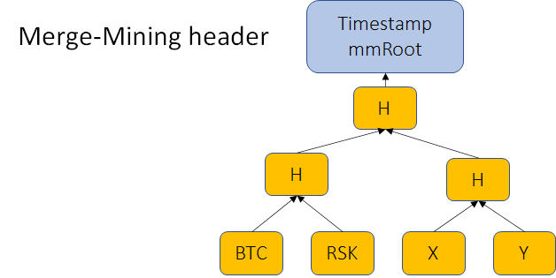
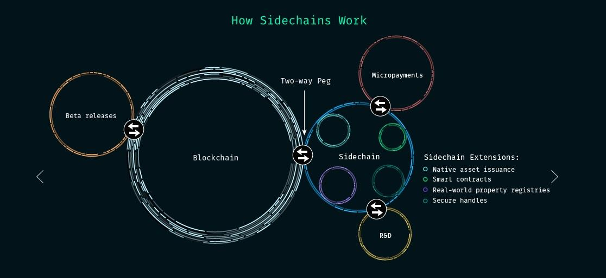

> *作者：Sergio Demian Lerner*
> 
> *来源：<https://bitslog.com/2022/11/22/merged-mining-part-i/>*

工作量证明（PoW）是 “[中本聪共识](https://bitcoinmagazine.com/guides/what-is-nakamoto-consensus-bitcoin)” 的基石，它有两个功能：其一，它是一种用来挑选区块生产者的抗女巫机制（Sybil resistance mechanism）；其二，它为逆转区块链提供了一种成本基准，并可不断提高这种攻击的成本。这就是为什么人们说 PoW 保护着比特币区块链。

“[合并挖矿（merged mining）](https://sec.cs.univie.ac.at/fileadmin/user_upload/i_sec/docs/teaching/thesis/azamyatin_merged_mining.pdf)” 是一种将花在保护一条区块链上的工作量复用、同时保护另一条区块链的技术。就像 PoW 为中本聪共识提供动力，合并挖矿也可以为另一条区块链的共识提供动力。合并挖矿链的共识可以是中本聪共识，也可以其某种变体，例如 [GHOST](https://eprint.iacr.org/2013/881.pdf) 和 [DECOR](https://eprint.iacr.org/2022/684.pdf)。应用合并挖矿技术的操作通常称为 “to merge-mine”。合并挖矿两条链的唯一要求就是它们俩的 PoW 使用同一种区块头哈希函数（以及难度检查）。

合并挖矿工作的方式很直接。首先，我们假设有一条主链（primary blockchain，假设是比特币）以及一条次级链 S。hB 和 hS 分别是比特币和 S 的两个新区块的区块头。假设 H 是任意一种密码学哈希函数。在挖矿的时候，合并挖矿的矿工必须在建构 hB 的模板时使之明确指向 H(hS) 。挖矿的过程没有很大不同。在挖矿的时候，矿工尝试找出一个 nonce 值，使得 hB 的工作量证明可以满足比特币网络的难度要求（即 SHA256D(hB) < targetb），跟只挖比特币没有什么区别。但是，如果矿工找到一个比特币区块头，其工作量满足合并挖矿链的难度要求（SHA256D(hB) < targetS），那么这个 hB、hS 以及一些额外的区块头关联信息，就成为次级链的一个有效的工作量证明。完整的合并挖矿区块可以包含这个工作量证明以及其他专属于这条链的数据（即由 hS 确认的交易）。这个区块会发到次级区块链的网络中，添加到次级区块链上。有了合并挖矿，一份力气就可以创建两种不同的工作量证明。

## 历史

合并挖矿技术的历史就跟比特币一样悠久。在 2010 年，中本聪自己就[提议](https://bitcointalk.org/index.php?topic=1790.msg28696#msg28696)使用合并挖矿来保护还是一种设想的 BitDNS 侧链（它的用途是存储去中心化的域名）。这个想法很快被实现了，然后推出了 [Namecoin](https://en.bitcoin.it/wiki/Merged_mining_specification) 。[Namecoin](https://en.bitcoin.it/wiki/Merged_mining_specification) 从 2011 年开始跟比特币合并挖矿，以实现更高的安全性。

在此期间，其它区块链也跟随这一趋势，开始跟比特币合并挖矿。读出好景不长。在 2012 年，LukeJR 对 Coiledcoin [发动](https://www.reddit.com/r/Bitcoin/comments/o6qwx/lukejr_attacks_and_kills_coiledcoin_altcurrency/)了一次 51% 攻击，当时该链正跟比特币合并挖矿。这一事件表明，合并挖矿并不是所有区块链的安全灵丹，而且，要让这套机制足够安全，新的合并挖矿链与老的链必须有高度的激励兼容性。

在 2014 年，另一个重要事件发生。Dogecoin（狗狗币）和 Litecoin（莱特币）使用了相同的挖矿算法，因此矿工开始在两个区块链之间频繁切换算力。当挖掘狗狗币收益更丰富时，矿工就去挖狗狗币；这会加快狗狗币的出块速度。当狗狗币的难度调整介入，使得挖矿更难盈利时，矿工就切换去挖莱特币；这样不断反复。这导致两条链的哈希率都不稳定，出块速度和货币发行也不稳定。此后，狗狗币的哈希率变得太低，已称不上安全。狗狗币决定开始接受[跟莱特币合并挖矿的区块](https://www.coindesk.com/markets/2014/09/11/dogecoin-community-celebrates-as-merge-mining-with-litecoin-begins/)。迄今为之，两者之间从没有一个社区的矿工尝试攻击另一个社区。没有攻击事件有一下几个原因：首先，合并挖矿对两个社区都有好处，因为合并挖矿使得出块难度和出块速度可以再次稳定下来；其次，这对矿工也有好处，因为他们可以暂时让收益翻倍（直到区块链的收益难度调整结束这个宽限期）；第三，有了可观的哈希率，就没有哪个矿工可以容易地攻击另一条链；第四，莱特币和狗狗币之间并没有意识形态分歧（我们可以自问是否能够从这两个社区中看到归属感），矿工就只是挖掘最为有利可图的链而已。

## 独立性

以往，合并挖矿受到推崇的原因之一是它可以创建完全独立的区块链。这个 “独立” 的意思是，即使主链停止了（因为技术问题或者没有社区支持而死亡），次级链也可以继续存活。次级链可以继续从合并挖矿的矿工处获得工作量证明。早年间，连比特币的未来也没有保证。Rootstock 侧链为自己的共识协议选择合并挖矿（而不是 Liquid 那样的联盟共识）是因为 Rootstock 是在比特币的区块大小战争期间创建的，那时候比特币真的有被攻击者破坏或者被分裂的社区撕裂的风险。

## 出块速度

另一个推崇合并挖矿的理由是，相比于其它继承比特币安全性的方式，合并挖矿可以让次级链实现更高的出块速度。

在比特币之后，所有新的区块链都被设计成支持更高的出块速度（更低的出块间隔）。这被认为对去中心化有负面影响，因为它会让独自挖矿的矿工挖出孤儿块的几率上升，迫使他们加入更大的矿池以保持竞争力。更高的出块速度也有一些好处，最明显的一个是用户的交易会更快得到确认。更高的出块速度有一个悖论性的好处：收益支付的方差降低了，这反过来降低了加入矿池的激励、提升了去中心化。出块速度代表着一种可用性与去中心化的权衡，最优的数值是很难找到的。

因此，想要跟比特币合并挖矿的算法设计者应该对出块速度非常谨慎。低于 10 秒的平均出块间隔且不使用[更加内含式的共识协议（inclusive consensus protocols）](https://fc15.ifca.ai/preproceedings/paper_101.pdf)会给合并挖矿的矿池带来额外的带宽压力、提高他们的成本，使他们处于对不合并挖矿的矿池的下风。

# 合并挖矿的竞争者

类似于中本聪的合并挖矿，有别的办法可以从其它链继承安全性。已知的第一种方法是由 [Mastercoin](https://bitcoinmagazine.com/technical/mastercoin-a-second-generation-protocol-on-the-bitcoin-blockchain-1383603310)/OMNI 协议实现的，后来被 [Counterparty 协议](https://counterparty.io/)沿用。新的项目例如 [RGB](https://www.coindesk.com/tech/2020/09/14/rgb-continues-its-work-to-bring-better-smart-contracts-to-bitcoin/) 也使用了这种方法。这种办法的基础是将另一条区块链（账本）的交易输入嵌入比特币交易中。RGB 依然使用这种嵌入方案，只不过，其内容是完全隐藏在 Tarpoot 树中的。但是，不论 Mastercoin/Counterparty/RGB 中的哪一个，其账本历史都不会形成一条专门的区块链。它们的账本历史仅仅是比特币区块中的特殊交易所形成的顺序列表。还有别的办法可以创建专门的区块链并从主链继承安全性，一般来说是尝试完全或者部分地同步两条区块链。这些方案都基于在 [OP_RETURN](https://link.springer.com/content/pdf/10.1007/s10723-020-09537-9.pdf) 输出中发布数据。一些例子有：[Veriblock](https://www.veriblock.org/)、[PoX](https://hackernoon.com/wtf-is-proof-of-transfer-and-why-should-anyone-care-wd2330p9) 和 [Syncchains](https://docs.rsk.co/SyncChain_WP.pdf) 。在这些 “同步” 链中，主链区块的逆转会自动逆转随后出现的次级链区块。这种模式的一个缺点在于，它迫使次级链节点必须运行主链节点。虽然相互关联的区块链可以提供共享的安全性（以及更快的跨链转账），同步的共识无法为次级链提供更快的出块速度，除非引入另一种可以切换的共识协议（即 [Bitcoin NG](https://www.usenix.org/system/files/conference/nsdi16/nsdi16-paper-eyal.pdf) 所用的 “微区块”）。相反，合并挖矿链就可以使用任意的出块速度，只不过，如上所述，这里面有一个阈值，假如超过了这个阈值，合并挖矿会因为高带宽要求而变得无利可图。

## 批评和演化

如今有许多论文[分析](http://www.wcse.org/WCSE_2018/W072.pdf)了中本聪共识的合并挖矿，既有[肯定意见](https://blog.bitmex.com/the-growth-of-bitcoin-merge-mining/)，也有[批评意见](https://eprint.iacr.org/2017/791.pdf)。不过，现在所有的研究都关注合并挖矿对去中心化的实际影响，但依然缺乏严谨的方法。学术研究还没有停留在 Namecoin 的合并挖矿机制，但这种机制已经优化了许多。2018 年 [Rootstock 侧链](http://rootstock.io/)的推出使研究重新活跃起来，使人们发现了更安全的合并挖矿协议，比如[可以感知分叉的变种](https://github.com/rsksmart/RSKIPs/blob/master/IPs/RSKIP110.md)。其中一些优化已经由 Rootstock 在连续几次网络升级中实现。但是，新的理论研究依然分散在网文和 RSKIP（Rootstock 升级提议）中，需要更好的归档。新的合并挖矿协议可以抵抗一些已知的攻击（我们会在后续的文章中详细讨论）。举个例子，人们通常认为合并挖矿的侧链在合并挖矿的哈希率较低（低于主链哈希率的 10%）时无法抵御重复花费攻击，但是一些新的协议是可以做到的（在稍有区别的安全性和活性假设之下）。

## Namecoin 的合并挖矿设计

Namecoin 跟比特币的合并挖矿机制是比较简单的。在区块奖励交易的 coinbase 字段，矿工写入 4 字节的数据，表明后面的是一个 [AuxPow](https://en.bitcoin.it/wiki/Merged_mining_specification) 记录。这种 4 字节的数据叫做 “魔法字节”，可以被 Namecoin 被用来发现 AuxPow 记录。在 AuxPow 记录中，矿工必须存入一棵默克尔树的根哈希值，这棵默克尔树保存的是合并挖矿的各个链的区块哈希值。AuxPow 记录之后是 treeSize（树大小）字段，指明包含在树内的不同链的合并挖矿区块的数量。最后是一个 treeNonce 字段，预设用途是避免链 ID 的混淆，但这个设计是有问题的，所以这个值也没使用过。下图演示了一个携带着包含 4 条不同合并挖矿区块链的 4 个区块（W、X、Y、Z）的 AuxPow 记录的比特币区块：

- Namecoin 的合并挖矿设计 -

当 Namecoin 节点要验证一个 Namecoin 区块的工作量证明时，区块必须包含如下字段：

- 一个默克尔路径，证明一笔 Coinbase 交易包含在了某个比特币区块交易树中
- Coinbase 交易自身（包含着 AuxPow 树根值）
- 一个默克尔路径，证明这个 Namecoin 的区块哈希值在这棵 AuxPow 树上

Namecoin 共识有一个验证合并挖矿证明和比特币区块头的工作量证明的规则（会忽略比特币区块的其它数据）。

## 主链/次级链 的区别

一般来说，我们会把一条主链和所有合并挖矿的次级链区别开来，因为次级链的区块需要一个额外的默克尔证明以允许工作量证明的验证。但从博弈论的角度看，没有什么主链不主链。所有的链都为[安全预算](https://braiins.com/blog/bitcoin-fees-security-threats)作出了贡献。如果主链的哈希率下降到了全部合并挖矿哈希率的 10% 以下，有人会说这个次级链已经变成了主链，因为这个区块链可能才是给出大部分安全预算的一个。这个区别更让人困惑的地方在于，一条合并挖矿的 “次级链” 可以获得比主链更多的工作量，比如 Rootstock 就是这样。虽然大部分的 [Rootstock 哈希率](https://stats.rsk.co/)都来自比特币矿工，但有时候也会有少量哈希率来自 Bitcoin Cash 矿工，因此 Rootstock 继承了来自两条主链的哈希率。

即使出于理念上的原因你不希望从（比如说）Bitcoin SV 矿工处获得哈希率，也无法轻松阻止他们这样做。从 Roostock 的共识视角来看，比特币和 Bitcoin SV 的区块头开起来是一样的（父区块或者难度字段可以用来启发式地区分它们，但也不是精确的）。因此，Rootstock 有可能获得比比特币还要高的哈希率，因为它可以合并所有 SHA256D 链的哈希率，包括比特币的。

因此，我们坚持一个语法上的定义：“主链” 指的是带有较短的合并挖矿证明的链，通常只有一个区块头；而 “次级链” 指的是需要额外的区块头及其哈希值的链。

## 区块链中立性

在 2011 年至 2013 年期间，bitcointalik.org 论坛上有[多种](https://bitcointalk.org/index.php?topic=198005.0)提议，主张硬分叉比特币、把比特币的工作量证明抽象成一个单独的 “主” 头链，然后所有的合并挖矿区块链（包括比特币）都从这个主头链中衍生出来。所有区块链的区块哈希值都是一个 Pow 默克尔树的一部分。但是，这些提案没有多少人关注（总的来说，没有哪一个硬分叉比特币的提议是获得的关注的）。

事实上，主头完全不需要是一条链的一部分。头可以很小，直接指定链区块哈希值的默克尔根值，以及这些区块头满足 PoW 要求的 nonce 值。我们将在后续的文章中了解点，为这样的微型头加入一个时间戳字段可以提升所有合并挖矿链的安全性。下图展示了这种假想的微型头，其中 X 和 Y 值得是其它合并挖矿的区块链：

- 一个没有主区块链的合并挖矿设计 -

如果这种数据结构被接受了，那在比特币的合并挖矿中就没有什么主链了。

在分析使用相同的工作量证明保护多于一条区块链的矿工的激励时，我们必须将所有的链一视同仁。为了分析合并挖矿的激励，我们必须关注 SHA256D 矿工（使用的是哪种哈希函数）而不是比特币矿工（使用了哪条链）。我们必须分析所有相关的区块链以及这些区块链为矿工提供的激励。

## 合并挖矿的侧链

[比特币的侧链](https://medium.com/iovlabs-innovation-stories/bitcoin-sidechains-74a72ceba35d)（[中文译本](https://www.btcstudy.org/2022/02/16/bitcoin-sidechains/)）提高了比特币的效用，因此也为比特币的价值作出了贡献。使用[侧链](https://www.coindesk.com/learn/an-introduction-to-sidechains/)，比特币人可以执行私密支付、创建 DAO（去中心化自治阻止）并开发新颖的用途，而不必把比特币换成波动更大的密码货币（有时候被比特币至上主义者称为 “垃圾币”）。现在主要有两条比特币侧链：[Liquid](https://blockstream.com/liquid/)（联盟共识）和 [Rootstock](http://rootstock.io/)（合并挖矿）。

[Rootstock 侧链](https://eprint.iacr.org/2022/684)提供了更便宜的转账和去中心化金融（DeFi）应用。其中一个有用的应用是以 rBTC 作为担保的[自贷型](https://www.sovryn.app/zero)稳定币。这个解决方案让比特币人可以使用以法币计价的代币，同时不必为日常花费而卖出比特币。

人们普遍认为，比特币上的 DeFi 会在未来几年里显著成长，而且不可预见的应用会在未来出现。这也使为什么大部分比特币人都支持 Rootstock 并希望它成长得更快。

Rootstock 侧链专门设计成为比特币社区提供激励。它通过合并挖矿的共识协议激励比特币人，尤其是比特币矿工，的参与。比特币和 Rootstock 可以成功地合并挖矿，因为激励和社区都是共享的。

在后续文章中，我会介绍 Rootstock 的合并挖矿公式模型，而且我会展示 Rootstock 社区的多项创新，这些创新显著提高了合并挖矿的安全性。我将证明，合并挖矿在长期中可以通过提高比特币的安全预算而使比特币获益。

## 总结

合并挖矿是一种基于 PoW 的共识协议的关键部分，它让一条区块链可以从一条主链处继承安全性，且不会让挖矿的成本倍增。中本聪共识搭配合并挖矿可能实现比基于权威证明（proof-of-authority）和权益证明（proof-of-stake.）的共识协议更高的去中心化。但是，主链的安全性只有在两者互惠互利之时才能为合并挖矿链分享。因此，合并挖矿是可以为比特币网络带来巨大价值的比特币侧链的理想解决方案。Rootstock 是第一个图灵完备的比特币智能合约侧链，它当前使用超过 50% 的比特币网络哈希率来合并挖矿，而且它的哈希率每年都在增长，所以它已经成为现在最安全的智能合约网络之一。Rootstock 使用了合并挖矿的一种分叉感知型变种，我们将在下一篇文章中介绍。

（完）

