> *作者：Nunchuk*
> 
> *来源：<https://nunchuk.io/blog/miniscript101>*


## 1. 引言

### 什么是 “Miniscript”？

比特币协议一直都带有一种强大的编程语言（Bitcoin Script），可以将资金锁定在 “一个正确的签名即可解锁资金” 以外的条件中。使用 Bitcoin Script，你可以将多个公钥、时间锁、哈希原像和复杂的逻辑分支结合起来。然而，在现实中，Bitcoin Script 很少被直接使用，因为难以编写正确的代码，而错误代码可能导致资金永久锁定，而且最终的代码几乎无法直接分析。

“Miniscript（[BIP-379](https://github.com/bitcoin/bips/blob/master/bip-0379.md)）” 是由 Pieter Wuille 及其合作者提出的一种 “以结构化方法编写 Bitcoin Script 代码的语言，带来了分析、组合以及通用签名的能力”。它解决了裸 Bitcoin Script 代码的可用性和安全性问题，同时保持了跟当前的比特币规则的完全兼容。

从内核来看，Miniscript 就像是比特币花费规则的乐高积木箱子。每一个积木都有一个小型的、准确定义的条件，比如某个公钥必须签名、必须经过一段时间，或者必须揭晓一个秘密值。一块积木可以换成另一块机密，也就是允许灵活低构造替代的花费路径。使用 “AND（和）”、“OR（或）” 以及 “阈值（threshold）” 这样的逻辑操作符将积木们结合起来，你就可以按需开发出所需的花费条件，无论是简单还是复杂。最重要的是，Miniscript 条件（policies）是可以分析的：钱包可以提前检查谁可以花费、在什么条件下花费，从而减少资金被无效脚本锁定的风险。

这种结构化的方法使我们可以安全地表示如下的花费条件：

- 要求 3 位董事中至少 2 位签名 —— 除非资金已经连续 6 个月没有移动过，那么只需其中 1 位签名就可以移动资金了。
- Alice 和 Bob 必须一起，才能花费资金；或者，在资金静置 1 年后，Charlie 可以独自移动其中的资金。
- 要么揭晓一个哈希值的原像，要么到待到区块高度 100 0000 之后（才能花费）。

### 它有什么意义？

使用 Miniscript，花费条件就可以超越单签名（single-sig）和简单的多签名（multisig）。你可以定义这样的规则：

- “A 和 B 一起可以随时花费资金；或者，C 可以独自在资金静置 1 年后花费资金”；
- “现在要求 3 个公钥中的 2 个一同签名；在资金静置  6 个月之后，就只需要 3 个公钥中的其中 1 个签名”。

这些灵活的条件契合实际的用途，比如遗产规划、分级的公司财务、紧急复原；它们让普通的比特币用户也能接触到高级的安全性。**重要的是，所有的 Miniscript  条件都是直接在比特币区块链上强制执行的，除了对比特币网络自身的信任之外，不需要任何额外的信任假设**。

## 2. Miniscript 的核心概念

现在，我们来看看 Miniscript 的核心模块。每一种元素（也即一种 Miniscript 片段）都代表着一种具体的花费条件，它们组合在一起，就能创造出灵活又安全的花费策略。

### 2.1 公钥

**公钥：pk(k)**

这是 Miniscript 中最简单的条件，表示要求一个具体的公钥的一个签名。它代表着基础的 “单签名” 花费条件，也用作更高级的花费条件的基础。

- **例子**：要求提供一个签名来花费资金
- **Miniscript**：`pk(Alice)`


<p style="text-align:center">- Miniscript 片段：公钥 -</p>


### 2.2 多签名

**多签名：multi(k, ...)**

传统的多签名花费条件，要求 n 个公钥中的 k 个提供签名。其子元素只能是公钥。

- **例子**：需要 3 个公钥中的 2 个提供签名才能花费。
- **Miniscript**：`multi(2, Alice, Bob, Charlie)`

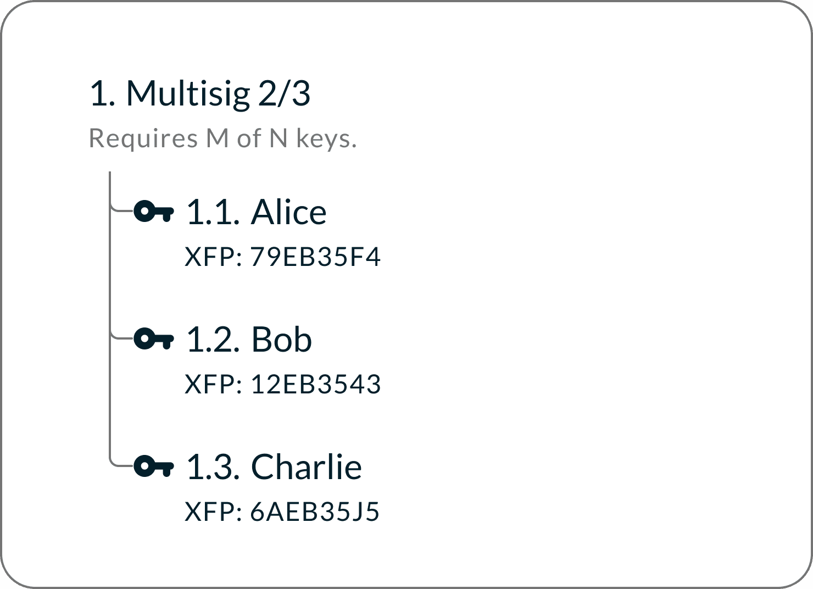

<p style="text-align:center">- Miniscript 片段：多签名 -</p>


### 2.3 时间锁

时间锁防止被它锁定的比特币在某个时间点之前被花费。它是 Bitcoin Script 的原生功能，也是最有用的 Miniscript 模块之一。

时间锁强制执行 “资金只能在 6 个月之后移动” 和 “这个公钥只有在资金存入的 30 天之后才能动用” 这样的规则。比特币网络中的节点会拒绝尝试在此之前花费这笔资金的交易。一旦越过这个时间点，资金就可以正常花费，而且被启用的花费路径不会再锁回去。

Bitcoin Script 有两种时间锁：绝对时间锁和相对时间锁。

**绝对时间锁：after(n)**

在网络到达某一个区块高度或者时间点之前，资金会一直锁定。一旦区块链增长到超过那个高度，带有这个时间锁的花费条件就激活并永久可用。

- **例子**：在区块链时间达到 UNIX 时间戳 17 5000 0000（大约是 2025 年 6 月）之后，用一个签名来花费。
- **Miniscript**：`and_v(v:pk(Alice),after(1750000000))`

*绝对时间锁会设置一个固定的未来时间；在一个绝对时间锁过期后，以相同条件设置绝对时间锁将不再有约束作用。*

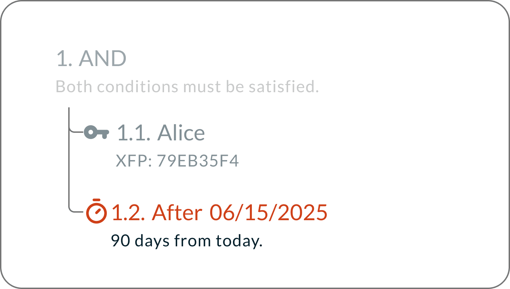

<p style="text-align:center">- Miniscript 片段：绝对时间锁 -</p>


**相对时间锁：older(n)**

锁定资金一段时间，直到这段时间过去。这段时间可以用区块数量来定义，也可以用日历时间（日期、小时）来定义。相对时间锁从带有它的 UTXO 被创造的一刻开始倒计时，一旦所定义的时间段过去，相关的花费路径也就激活。

- **例子**：在资金诞生的 1 2960 个区块（大约 90 天）之后，需要一个签名来花费。
- **Miniscript**：`and_v(v:pk(Alice),older(12960)`

*各个 UTXO 的相对时间锁是相互独立的，不会因为它们都处于同一个钱包中而统一计时。在一个 UTXO 的相对时间锁到期之后，可使用相同的时间锁条件来 “刷新” 倒计时 ——可以将它转移到同一钱包的新地址来重设时间锁。*

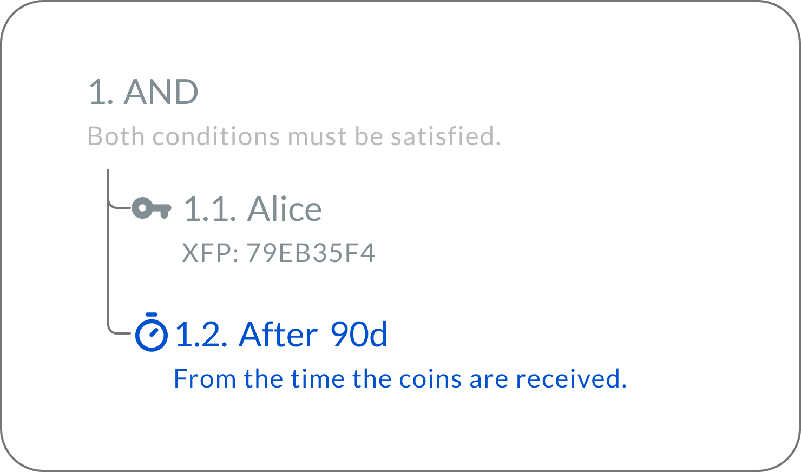

<p style="text-align:center">- Miniscript 片段：相对时间锁 -</p>


<p style="text-align:center">- - -</p>


在设定时间锁的时候，钱包软件界面所展示的日历日期只是一种估计。如果所设置的时间锁基于区块高度，那么网络到达那个高度之后，这个时间锁就过期。如果所设置的时间锁基于日历时间，比特币网络使用过往区块时间中值（具体来说，过去 11 个区块的时间戳的中值）来决定当前时间，会跟人们使用的日历和时钟有些偏差，所以，花费交易变得有效的时间取决于比特币网络的状态，不会跟人们的预期（界面所展示的时间）完全一致。

### 2.4 哈希锁

哈希锁要求揭晓与一个哈希值对应的秘密值（其原像）。除非秘密揭晓，否则这个锁不会解开。

- **例子**：揭晓一个 SHA256 哈希值 H 背后的原像，并提供一个签名，才能花费。
- **Miniscript**：`and_v(v:pk(Alice),sha256(H))
`

**Miniscript 中的哈希锁类型**

- `sha256(H)` —— 原像必须在 SHA256 操作后得到 H（预期原像是一个 64 位的十六进制字符串）
- `hash256(H)` —— 原像必须在连续两次 SHA256 操作后得到 H（预期原像是一个 64 位的十六进制字符串）
- `ripemd160(H)` —— 原像必须在RIPEMD-160 操作后得到 H（预期原像是一个 40 位的十六进制字符串）
- `hash160(H)` —— 也想必须在 HASH160 操作（先运行 SHA256 操作，再运行 RIPEMD160 操作）后得到 H（预期原像是一个 40 位的十六进制字符串）

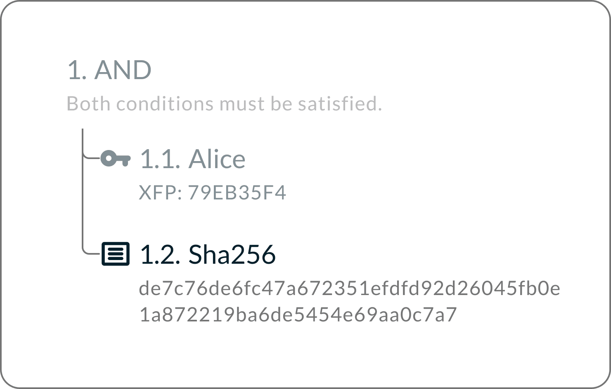

<p style="text-align:center">- Miniscript 片段：哈希锁 -</p>


### 2.5 逻辑基础：AND、OR、ANDOR

这三种逻辑操作符是 Miniscript 的基础。它们描述了不同的条件是如何组合的（通常通过时间锁）。

**AND**：要解锁，必须让两个条件都为真。

- **例子**：花费需要 Alice 的签名，并且要在收到资金的 1 2960 个区块（大约 90 天）以后。
- **Miniscript**：`and_v(v:pk(Alice),older(12960))`

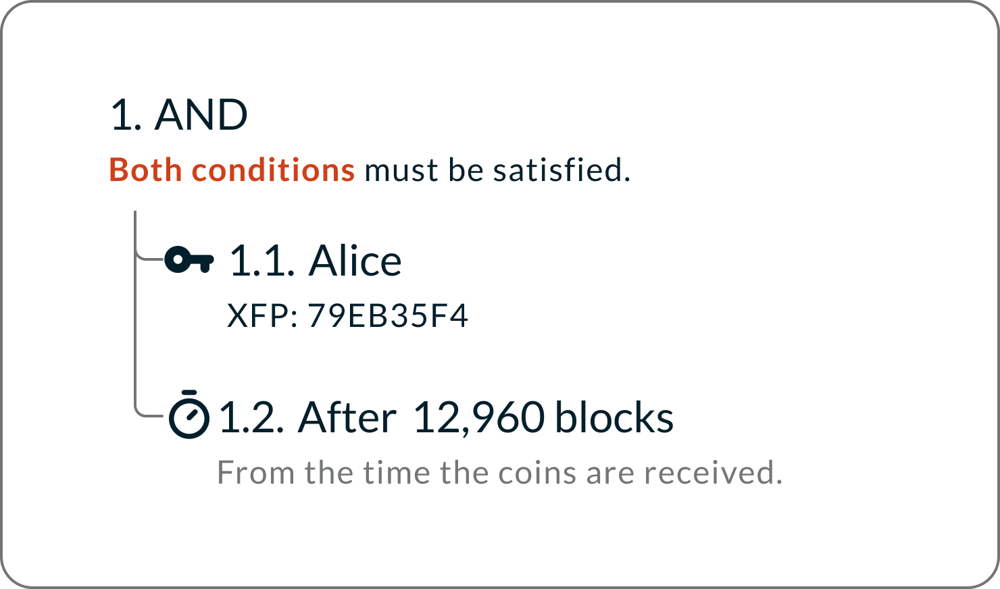


<p style="text-align:center">- Miniscript 片段：AND -</p>


<p style="text-align:center">- - -</p>


**OR**：两个条件中，至少一个为真，即可解锁。

- **例子**：花费需要两个公钥中的任意一个签名。
- **Miniscript**：`or_d(pk(Alice),pk(Bob))`

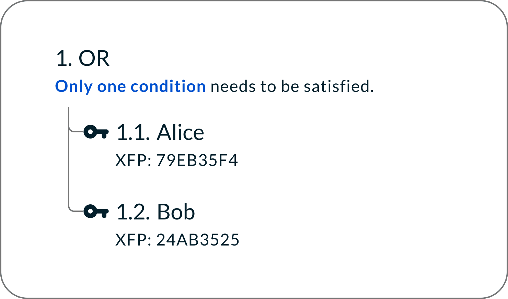

<p style="text-align:center">- Miniscript 片段：OR -</p>


**ANDOR**：资金会使用一个 if/else 规则来锁定：如果第一个条件为真，那么第二个条件也必须为真（才能解锁）；如果第一个条件为假，那么第三个条件必须为真（才能花费）。

- **例子**：如果 Alice 签名了，那么 Bob 也需要签名；如果 Alice 没签名，那么需要 Charlie 的签名。
- **Miniscript**：`andor(pk(Alice), pk(Bob), pk(Charlie))`

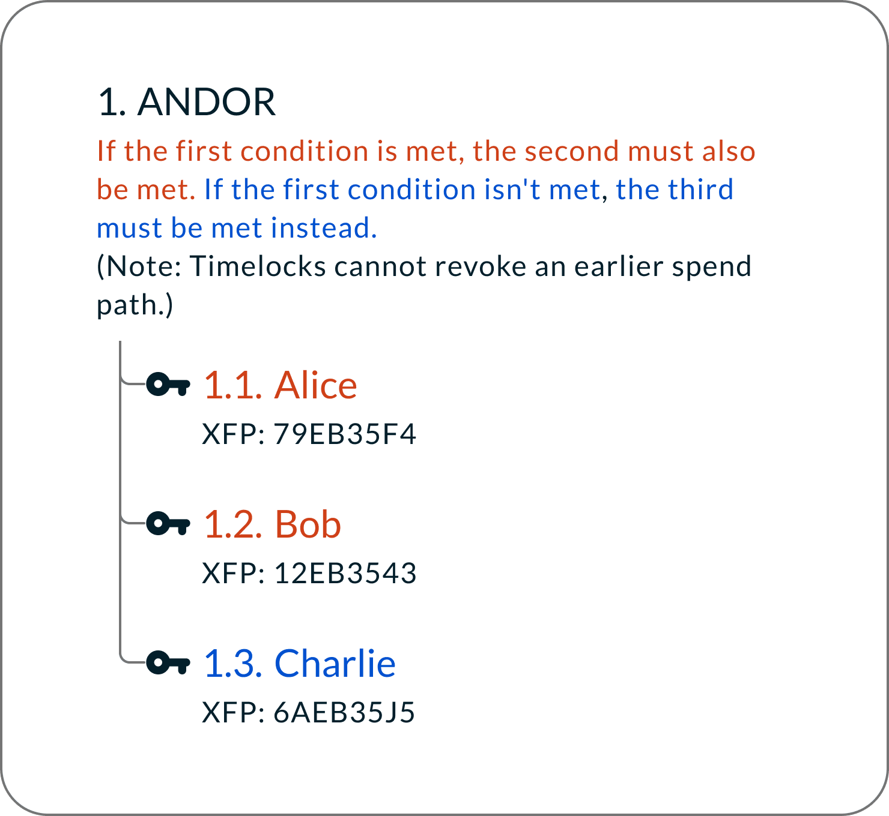

<p style="text-align:center">- Miniscript 片段：ANDOR -</p>


### 2.6 阈值

**阈值：thresh(k, ...)**

阈值条件比多签名更为灵活。它要求 k 个条件为真；但与多签名不同的是，它的子元素并不限于公钥，可以是逻辑表达式、时间锁、哈希锁，等等。

- **例子**：Alice 和 Bob 一起签名（才能花费）；资金静置 90 天以后，两个人中的任何一个都可以独自花费。
- **Miniscript**：`thresh(2,pk(Alice),s:pk(Bob),sln:older(12960))`

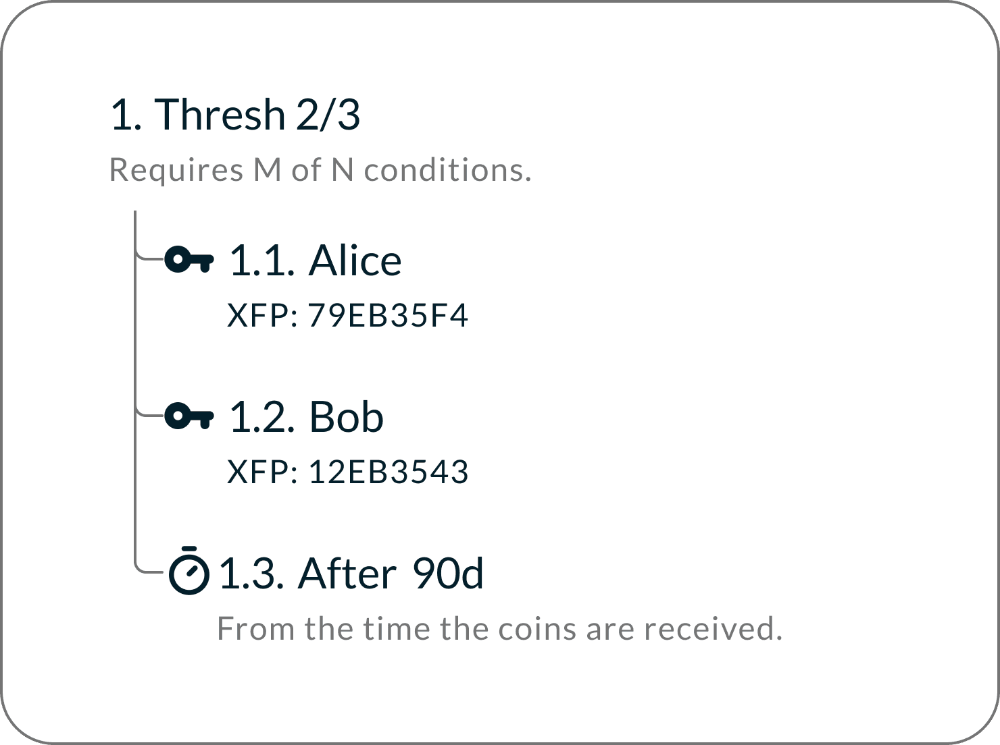

<p style="text-align:center">- Miniscript 片段：阈值 -</p>


### 2.7 Taproot Scripts

**Taproot** 让你可以为资金承诺多个花费分支，而在使用时只需揭晓一个（也就是你真正使用的那个）。它提供了两种花费方式：

- **密钥路径**：用一个聚合公钥来花费。这样的交易在区块链上的表现就是一个普通的单签名交易，即使这个公钥是由多个人共同构造的（比如使用 MuSig2）。
- **脚本路径**：使用被承诺的其中一个 Taproot 脚本分支。只有你用到的那个分支才会揭晓，其余分支会被隐藏。

这种结构兼顾了效率和隐私性：日常使用可以通过密钥路径；而更复杂的花费条件可以隐藏起来，直到需要动用的时候才揭晓。

- **例子**：日常花费使用密钥路径中的一个聚合公钥（称为 Alice）；如果聚合公钥无法签名，脚本路径允许 Charlie 随时用签名来花费，而 Bob 在资金创建的 90 天才能花费。
- **Miniscript**：`tr(pk(Alice), {and_v(v:pk(Bob),older(12960)),pk(Charlie)})`

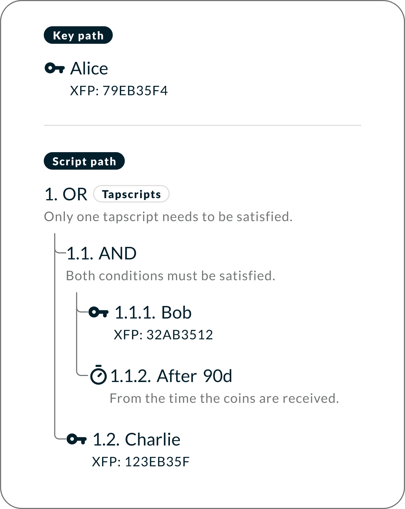

<p style="text-align:center">- Miniscript 片段：Taproot scripts -</p>


### 2.8 MuSig2

“MuSig2” 是一个基于 Schnorr 的多重签名方案，它让多个参与者可以一同生成一个聚合签名。在链上，这个聚合签名看起来跟常规的单签名没有区别。这提高了隐私性和效率，同时降低了交易体积和手续费。

- **例子**：需要 Alice、Bob 和 Charlie 三人中的两个签名才能花费。他们所生成的签名，在区块链上看起来就是一个单签名，所以没有人能够分辨出这是一个多方钱包。所以多方钱包变得更加隐私和高效了。
- **Miniscript**：`tr(musig(Alice, Charlie), {pk(musig(Alice, Bob)),pk(musig(Bob, Charlie))})`

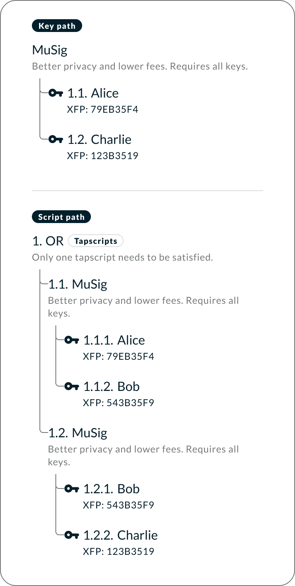

<p style="text-align:center">- Miniscript 片段：MuSig2 -</p>


## 3. 在 Nunchuk 中使用 Miniscript

### 3.1 创建 Miniscript 钱包

Nunchuk 让用户轻松就能用 Miniscript 构建高级的花费条件。你可以从现成的模板开始，也可以输入自己定制的脚本。

在 Nunchuk 中创建一个 miniscript 钱包：**Home → Create new wallet（创建新钱包） → Miniscript**

- **模板**：选择花费条件，比如 “Expanding Multisig（扩展的多签名）”、“Decaying Multisig（递减式多签名）” 或 “Flexible Multisig（灵活多签名）”。每一种模板都可以调整参数，比如公钥的数量、时间延迟，不需要你编写任何代码。

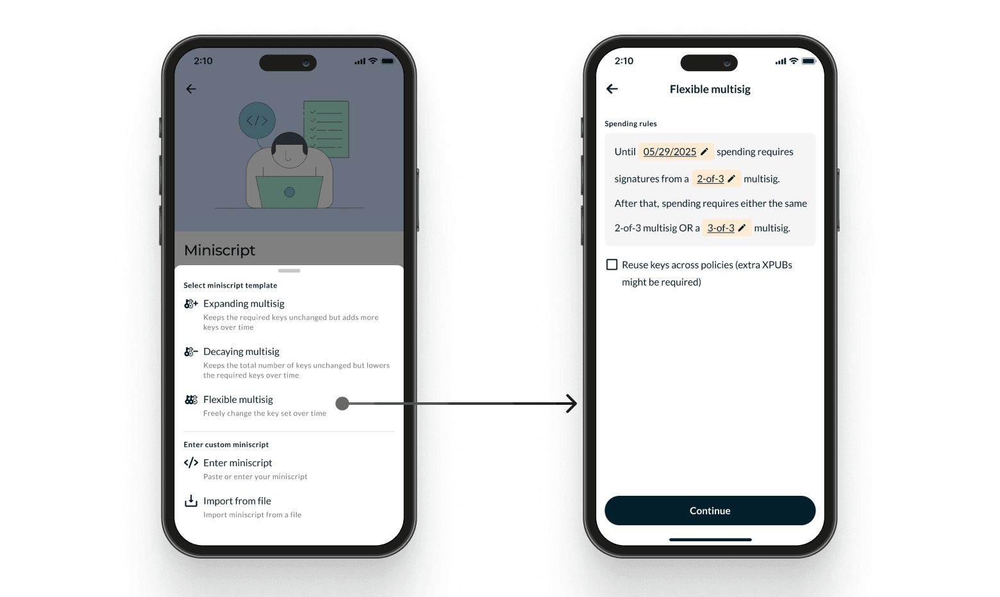

<p style="text-align:center">- 通过模板创建 miniscript 钱包 -</p>


- **自定义脚本**：对于高级用户，你可以粘贴一个明文的 Miniscript 花费条件，或者从文件中导入。Nunchuk 会自动分析脚本、检查正确性，并用大白话向你展示花费条件。

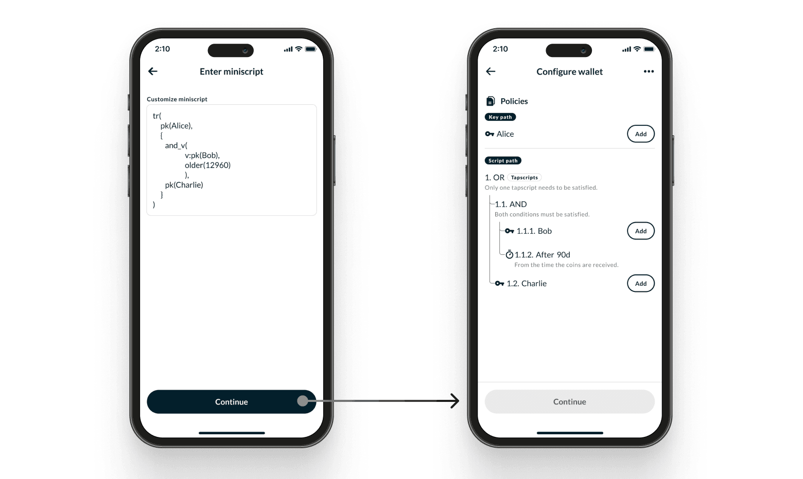

<p style="text-align:center">- 使用自定义脚本创建一个 miniscript 钱包 -</p>


### 3.2 Miniscript 团体钱包

Nunchuk 的 “团体钱包（Group Wallet）” 功能让使用多台设备的多个人可以一起管理一个比特币钱包，并且他们之间的数据通信是端到端加密的。每一个参与者都可以自己的密钥，而花费条件是集体强制执行的，不依赖于任何托管商。在跟 Miniscript 结合时，团体钱包支持高级的多方条件，可以反映现实世界中的治理机制。跟普通的 miniscript 钱包一样，你可以从现成的模板开始，也可以自定义脚本。

要在 Nunchuk 中创建一个 miniscript 团体钱包，请点击：**Home → Create new wallet（创建新钱包） → Group wallet（团体钱包） → Settings（设定） → Miniscript.**

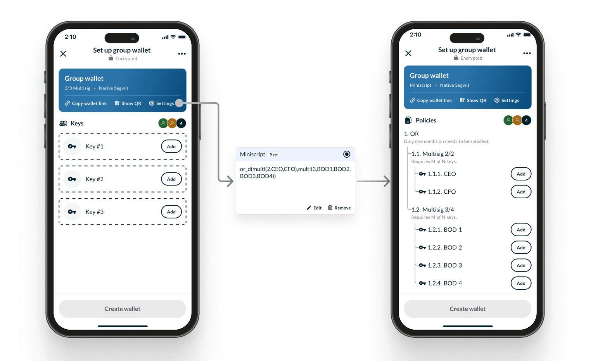

<p style="text-align:center">- 例子：一个公司的两位执行官和四位董事建立了一个团体钱包。日常操作只需要两个执行官签名；但在另一条花费路径中，四位董事中的任何三位都可以授权一笔交易 -</p>


### 3.3 Miniscript 钱包复原

要复原 miniscript 钱包，除了常用材料，比如私钥和原像，**备份好的钱包配置文件（无论是输出描述符形式还是 BSMS 文件形式），是绝对必要的。**

BSMS 格式是围绕 “输出描述符（Output Descriptor）” 的封装形式，包含了比如钱包的第一个地址这样的元数据。这些元数据作为一种校验和（checksum），并且可以快速定位钱包。钱包配置文件相当于一种地图，定义了一个钱包是如何构造出来的。

Miniscript 团体钱包也用同样的要求：没有钱包配置文件，钱包就无法重新构造出来，即使所有成员的私钥都没有丢失，也做不到。

要在 Nunchuk 中复原一个 miniscript 钱包，请点击：

**Home → Create new wallet（创建新钱包） → Recover existing wallet（复原现有钱包） → Recover using BSMS/descriptors（使用 BSMS/描述符 来复原）**

要在 Nunchuk 中复原一个 miniscript 团体钱包，请点击：

**Home → Create new wallet（创建新钱包 → Recover existing wallet（复原现有钱包） → Recover group wallet（复原团体钱包）**

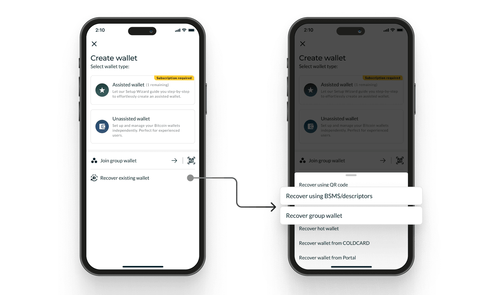

<p style="text-align:center">- 复原一个 miniscript 钱包或 miniscript 团体钱包 -</p>


```
BSMS 1.0
tr(xpub661MyMwAqRbcGgLWCDJNFcLYg8KgQimdffZdRobPJ585b93QjtCgqbPCo54DP3kpzwFpaZxoi6Snia3VDSV4oV81H4BxfaUbAzP2EpGHWDr/**,{multi_a(2,[8a0ba421/87'/0'/0']xpub6DWv19xigzHyBJJvE4iMTyTxQrn5TkBAr8k4gUJ8gycB8U7S7s8QRfBTa4Je2on9FE7jiUa3ijxuNyygEcpe8CGQUEz6W2PGtZ8SUJWc8fC/**,[d33f8331/87'/0'/0']xpub6C3RqV6jatGDLEiGpi92fsDLApCLC6SB28bMjwSaU4w3sdxmhWJRmzsxPDr8zv2hkyt1czkd3siMHJ6uAzN4T1gC5W6Vdd75XyJknN9N1Zb/**,[45c72f63/87'/0'/0']xpub6Ci35gULWq49uY6txiEHLJd8R9ESbadyed8zPACMgi6Cu5cd4BLG9p1ZDP3PnGNNaEHbGuy1uzEJDsEdWQck1C75DkaB13P8kX8UZkc7E8i/**),and_v(v:multi_a(1,[1e897bbf/87'/0'/0']xpub6CSCZZo8sDS2wjXUitr4FQUZwenEL1KcZrgYvi2mvSnVbYztYBxVLj5mKYcpNvB6RkLNEQzaaf8SWquzdhC6ncwasXk8STEjKwYRrd1QZcZ/**,[0cd15c3e/87'/0'/0']xpub6C3JCSGe5J2iqZymN7pKrYisD9po9FRqSRNot6561iLrzFjrPMNm8qn5VeYgTdWAtR66Kfr9oZWrjxSDLxB7GQ5dEi7hiUbjHyDxjaQxww6/**,[03c341e8/87'/0'/0']xpub6Bw2SYRUCc3Pcsgk39WkvkewHnxSLSERZmkUPBy91nrzKXehFBNLEzF2uJ2YiBhrS7kqagpGxBqhVziYawzUHePkB7pQGBMAnQmoYAxEAwz/**),after(1758819600))})
/0/*,/1/*
bc1pzmlufvqn5dpcquqysj4fr9skwxjj60wg7zyrpk4j8ftccz9ck9rs9fmjam
```

<p style="text-align:center">- 一个 miniscript 钱包的 BSMS 文件 -</p>


## 4. 应用场景和案例

### 4.1 应用场景

Miniscript 为超越基础多签名的花费策略打开了大门。一些现实世界的应用场景包括：

- **遗产规划**：一种保险柜，继承人可以在一个定义好的时延之后解锁，同时钱包的主人可以在自己生前完全控制其中的资金。
- **公司财库**：要求多位执行官签名以从财库支出，同时隐藏为紧急情形而准备的备用花费路径。
- **托管与交易**：使用哈希锁和时间锁来支出原子化的互换以及安全托管，无需中介。
- **保险**：保险供应商可以强制执行赔付条件（需要多个签名），或者，资金可以在时间锁过期、提供一个可验证的事件声明之后释放。
- **借贷**：贷款可以用比特币抵押品来担保；比特币抵押品可以通过阈值条件、时间锁和退款路径来强制执行还款或者清算，从而减少对可信任中介的需要。
- **紧急复原**：一个通常需要 2-of-3 多签名来解锁的钱包，在资金长期不移动之后，激活一个紧急复原花费条件，一个或一组复原密钥可以解锁资金。
- **保护隐私的托管**：使用 Taproot 和 MuSig2，即使复杂的多方条款，其花费交易在链上看起来也跟单签名交易一样，在保护隐私的同时，也保留了健壮的安全性。

### 4.2 案例

**A）带有时间锁的继承（一劳永逸的复原）**

- **花费条件背后的想法**：当前使用 2-of-3 多签名；在你离线 6 个月之后，一个指定的后备密钥可以取出钱包中的资金。

- **有何意义**：减少资金永久丢失的风险，同时，不将直接的控制权交给他人。

- **如何工作**：阈值签名和一个带有时间锁的复原路径。

- **Miniscript 例子**：

  ```
  andor(
        pk(backup_key),
        older(4224679),
        multi(2,A,B,C)
        )
  ```

**B）带有分级许可机制的企业财库**

- **花费条件背后的想法**：

  - 日常花费：任意 2 位财务总监 + 1 个联合签名机器（例如 硬件签名模块（HSM）/KMS（密钥管理服务器））
  - 大额支出：任意 2 位财务总监 + 首席财务官（CFO）
  - 延迟/紧急 访问：任何 2 位财务总监在为期 7 天的延迟之后可以花费

- **有何意义**：日常便利和安全保障。

- **如何工作**：阈值/AND 加上 OR 分支和一个可选的时间锁。团队在使用时自己选择分支。

- **Miniscript 例子**：

  ```
  and_v(
        or_c(
             pk(HSM),
             or_i(
             		v:pk(CFO),
             		v:older(4195485)
             		)
             ),
        multi(2,LeadA,LeadB,LeadC))
  ```

**C）用于 OTC 交易的可控托管**

- **花费条件背后的想法**：买方 + 卖方，或者，时间窗口结束后，任何一方 + 仲裁方

- **有何意义**：无托管者。清晰的、基于规则的调解路径。

- **如何工作**：带有一个时间锁备用条件的 OR 逻辑。

- **Miniscript 例子**：

  ```
  thresh(2,
  	   pk(Buyer),
  	   s:pk(Seller),
  	   sj:and_v(
  	   			v:pk(Arbiter),
  	   			n:older(4194472)
  	   			)
  	   )
  ```

**D）在链上难寻踪迹的多方钱包**

- **花费条件背后的想法**：三个设备共同控制；可以使用一个聚合公钥来花费，所以签名者的数量不会暴露。

- **有何意义**：实现团队安全性，同时无需暴露治理结构。

- **如何工作**：可以选择 Taproot 和 MuSig2 。MuSig2 将多个签名者聚合成一个公钥；Taproot 隐藏未使用的分支。在一个脚本路径中，只有被执行的分支才会揭晓。

- **Miniscript 例子（Taproot）**：

  ```
  tr(
  	musig(A,B),
     	{
     		pk(musig(A,C)),
     		pk(musig(B,C))
     	}
    )
  ```

## 5. 结论

比特币一向具有使用丰富花费条件的能力，但其低层编程语言太过困难，而且对绝大部分用户都很危险。Miniscript 通过提供一种结构化的、安全的、可组合的语言来表达花费条件，改变了局面。

使用 Miniscript，遗产规划、企业财库、原子化互换、保护隐私的托管等等高级用途都成为了囊中之物。

作为一款软件钱包，Nunchuk 将 Miniscript  带到了用户友好的界面中，比特币生态系统也获得了一种强大的新标准。最终，复杂的合约也可以用安全、可分析、易读的方式来表达 —— 开启下一代的比特币保管和智能合约设计。

**脚注：支持 MiniScript 的硬件签名器**

（最后更新于  2025年 8 月 27 日）

- 支持**单纯的隔离见证 Miniscript** ：Tapsigner、Coldcard（EDGE 固件 v6.3.3 及更高版本）、Jade（固件 v1.0.30 及更高版本）、Jade Plus（固件 v1.0.30 及更高版本）、Ledger（固件 v2.1.0 及更高版本）、Specter DIY（固件 v1.5.0 及更高版本）
- 支持 **Taproot Miniscript** ：Coldcard（EDGE 固件 v6.3.3 及更高版本）、Ledger（固件 v2.2.1 及更高版本）、Specter DIY（固件 v1.9.0 及更高版本）
- 支持 **MuSig2**：尚无（即当前只能使用软件密钥）

（完）