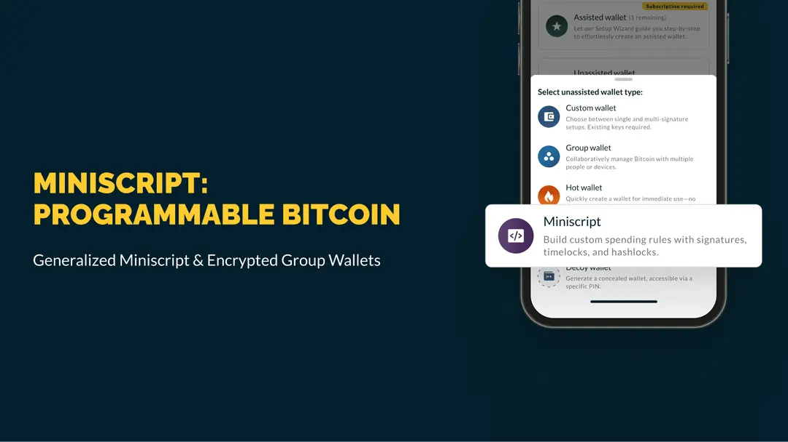
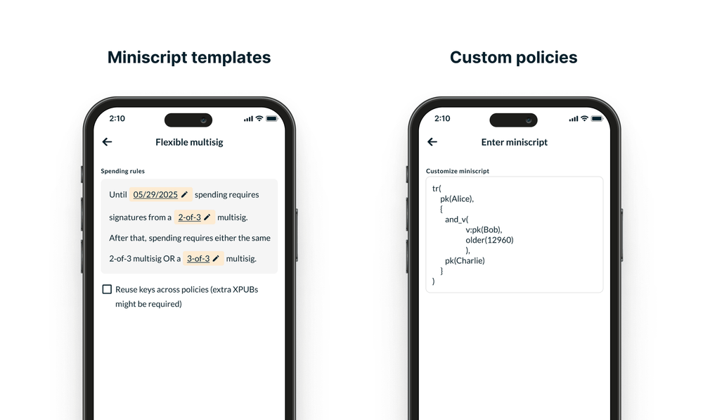
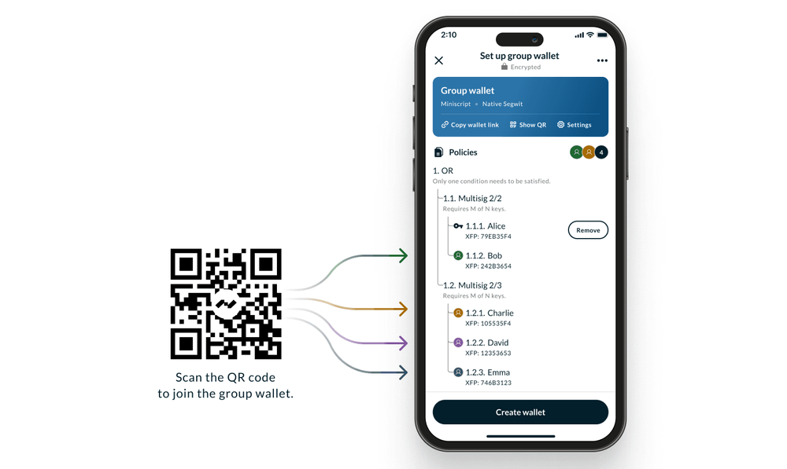
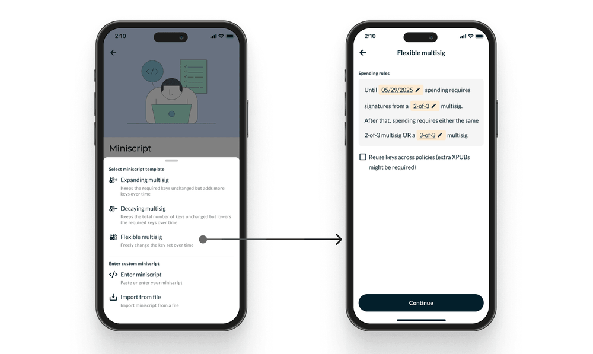
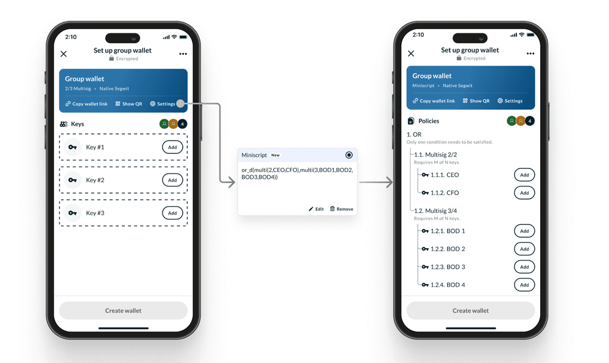

> *作者：nunchuk*
> 
> *来源：<https://nunchuk.io/blog/miniscript-programmable-bitcoin>*

比特币带来了可编程的货币，但创建复杂的花费规则一直是困难的、有风险的，也难以协调。今天，我们要改变这一切。

我们将在 Nunchuk 钱包中推出**通用的 Miniscript 特性**，让每一个人都能创建适合其真实需要的钱包，比如带有时间锁的继承规划钱包、带有分级许可和灾备的公司财库、非托管的安全保管，以及链上踪迹最小化的多方钱包。这一切都来自一款友好的、加密的钱包。

## 摘要

- **Miniscript**  将比特币内置的规则（签名、时间锁、哈希锁，等等）转化为安全、可组合的砖块。
- **Nunchuk 中的通用 Miniscript 特性**：不再只是集中预先设定好的脚本。你可以创建符合标准的比特币花费条款的任何 Miniscript 花费条款。
- **团体钱包也可使用 Miniscript**：安全地提出、创建和操作集体的 Miniscript 钱包。在创建好钱包之后，使用内置的聊天功能来协作，整个流程是端到端加密的（E2EE）。
- **可选 Taproot 和 MuSig2**：Taproot 可以将未使用的花费条件隐藏起来。MuSig2 可以将多个签名人聚合成一个结合密钥（不论放在密钥花费路径中，还是放在一个脚本分支中），从而提高隐私性和效率。
- **当前的硬件签名器支持**：
  - **支持原生的隔离见证 Miniscript**：Coldcard、Tapsigner、Blockstream Jade、Ledger、Specter DIY
  - **Taproot Miniscript**：Coldcard、Ledger、Specter DIY
  - **MuSig2**：（目前）只支持软件密钥。将随着更多供应商采用 Miniscript/Taproot/MuSig2 而改善。

## Miniscript 意味着什么（大白话）

比特币一直支持多签名和时间延迟这样的花费规则。但以往，创建和管理使用这些规则的钱包很复杂、容易出错，而且难以验证。

Miniscript （[BIP-379](https://github.com/bitcoin/bips/blob/master/bip-0379.md)）使用一种结构化的方式来表达这些规则，从而钱包软件可以安全地分析和表示它们。**把它想象成乐高积木**：使用签名、时间锁和秘密（哈希锁），你就可以组合出清楚、可靠的条款，而不需要手写脚本。

## Nunchuk 中的新特性

### 1. 通用的 Miniscript

你不再受制于少量小众的条款。你可以创建任何可以用 Miniscript 来表达、在标准的比特币花费规则可以采用的条款：门限条件；AND/OR 逻辑；时间锁；基于哈希的条件。

使用常见模式的薄板，或者粘贴一个定制的条款（如果你是一个专业的用户）。Nunchuk 会验证这个条款，检查它的正确性和标准型，并清晰地展示最终的结果，然后才允许你存入资金。

- Miniscript 模板 vs. 定制条款 -

### 2. 团体钱包，现已进入 Nunchuk

六个月以前，我们发布了[端到端加密的团体钱包](https://nunchuk.io/blog/group-wallet)。从今天开始，团体钱包从一开始就可以使用 Minicript 。

通过不安全的消息通道（电子邮件、标准的即时通信软件）来协调复杂的保管工作是一个重大风险。Nunchuk 解决了这个问题：任何的个人和设备集合都可以在 Nunchuk 中创建一个协作的 Miniscript 钱包，然后使用内置的加密聊天功能来开展后续的协商，比如支付请求和状态更新。

- 安全的协作钱包，以及可以定制的 Miniscript 条款 -

通用的 Miniscript 与协作式的团体钱包，两相结合，让可编程的货币在团队、家庭和组织中变得实用且安全。

### 真实世界案例（你现在可以开发出来的东西）

- Miniscript 应用案例 -

**A）带有时间锁的机场（设置好就可以忘记的复原方法）**

想法：平日，是个 2-of-3 的多签名钱包；在你离线长达 6 个月之后，一个指定的后备密钥可以找回钱包中的资金。

意义：减少永久丢失资金的风险，又不会给予任何人立即控制资金的权限。

工作原理：一个签名门限条件，和一个带有时间锁的复原花费路径。

> **蜜罐特性（下一次发布）指引**：对于我们的会员，[Honey Badger](https://nunchuk.io/individuals) 助手钱包将同时支持**链下**和**链上**的时间锁，用于继承规划。

**B）带有分级许可的企业财库**

想法：

- 平时：任意两位财务总监加上一个集团控制的签名器（例如 硬件签名模块/密钥管理系统）
- 高价值支出：任意两位财务总监加上 CFO（首席财务官）
- 带有时延的/紧急 访问：任意两位财务总监在为期 7 天的时延之后。

意义：兼顾日常支出的便利性与严格的安全保护措施。

工作原理：门限/AND 条件，加上  OR 分支以及一个可选的时间锁花费分支。团队在操作时候选择相应分支。

**C）为 OTC 交易保留你的控制权**

想法：买方 + 卖方，或者，在时间锁过期后，其中一方 + 仲裁者

意义：没有托管商，清楚、基于规则的解决方案

工作原理：OR 逻辑以及一个带有时间锁的后备方案

**D）私人的多方钱包，具有紧凑的链上踪迹**

想法：三个设备共享控制；花费交易可以使用一个聚合公钥，从而签名器的数量不会公开

意义：实现健壮的安全性，而不会公开内部的管理结构

工作原理：可选的 Taproot 和 MuSig2 特性。MuSig2 可以将多个签名器聚合成一个公钥；Taproot 可以隐藏没有使用的花费条件（在脚本花费路径中，只有被使用的花费条件才会揭晓）

## 隐私和效率（可选）

你可以在 Nunchuk 中使用原生的隔离见证 Miniscript 。如果你选择更高级的特性，[Taproot](https://nunchuk.io/blog/taproot-multisig) 可以在脚本花费时将未使用的条件隐藏起来，而 [MuSig2](https://nunchuk.io/blog/taproot-multisig) 可以将多个签名器聚合为一个公钥。聚合后的公钥可以用在密钥花费路径中，也可以用在脚本花费路径中。不管用在哪里，都可以减少链上足迹、加强隐私性。是可选使用的。

## 当前的硬件签名器之处以及下一步

**当前支持 Miniscript 的签名器**

- **支持原生的隔离见证 Miniscript**：Coldcard、Tapsigner、Blockstream Jade、Ledger、Specter DIY
- **Taproot Miniscript**：Coldcard、Ledger、Specter DIY
- **MuSig2**：只支持软件密钥

**下一步**

随着更多的硬件签名器供应商采用 Miniscript、Taproot 和 MuSig2，上面这个名单会扩充。我们将随着供应商发布兼容的固件和 SDK 而扩充名单。

## 如何在 Nunchuk 中使用 Miniscript

只需要几分钟就能上手。

### 单人的 Miniscript 钱包

1. **开始**：创建新的钱包 → Miniscript 

   - **模板**（推荐）：递减的、扩充的，以及灵活的多签名。配置密钥数量、要求的门限条件、时间锁条件和备用花费条件。
   - **定制条款**（为高级用户准备）：粘贴一个完整的 Miniscript 条款。Nunchuk 会验证它的正确性和标准性，然后向你展示它产生的钱包用法。

2. **添加密钥**

   连接的硬件签名器，或添加软件密钥

3. **校验并创建**

   确认条款总结和地址

4. **投入资金、测试**

   存入小规模的资金到你的新钱包并执行花费测试。

### Miniscript 团体钱包

1. **开始**：创建新的钱包 → 团体钱包（Group wallet）

   邀请成员或设备。团体通信是加密的。钱包会从一个默认的配置开始（例如，隔离见证原生的 2-of-3 多签名钱包）

2. **定制钱包**

   打开团体钱包的设定：**Settings → Miniscript → Add Miniscript**

3. **定制花费条件**

   使用一个模板或粘贴一个定制好的条款

4. **校验并创建**

   所有参与者安全地审核并一起许可最终的条款

5. **协调和花费**

   使用内置的聊天功能（在钱包创建后之花可以使用），协调后续事项，包括花费请求和状态更新

### 重要提醒：备份你的钱包配置

以 “**输出描述符**” 或 “**BSMS**” 格式导出你的钱包配置。BSMS 是一个围绕输出描述符的封装器，包含了额外的元数据（比如，这个钱包的第一个地址），用作一个校验和以及帮助你快速定位一个钱包。

关于钱包复原、核心的 Miniscript 元素以及其它技术细节，请看我们的互补篇章：[**Miniscript 101: A Technical Guide**](https://nunchuk.io/blog/miniscript101)（[中文译本](https://www.btcstudy.org/2025/09/03/miniscript-101-a-technical-guide-by-nunchuk/)）。

（完）