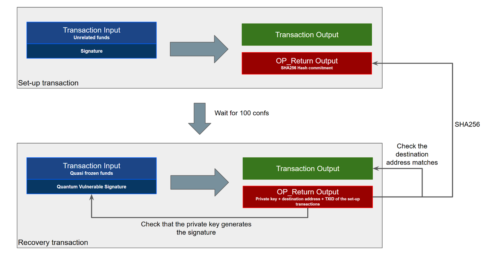
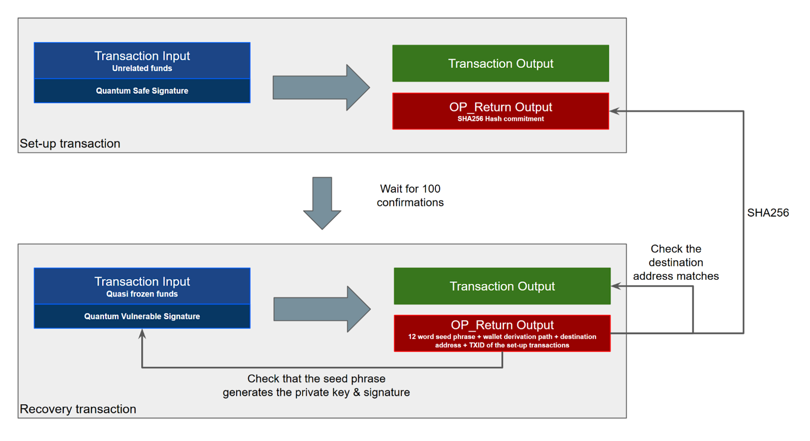
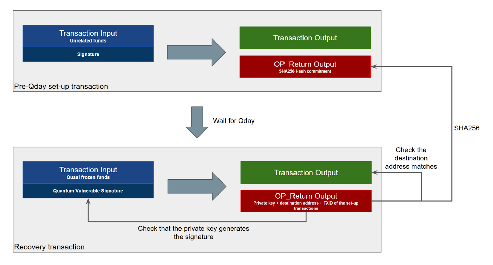
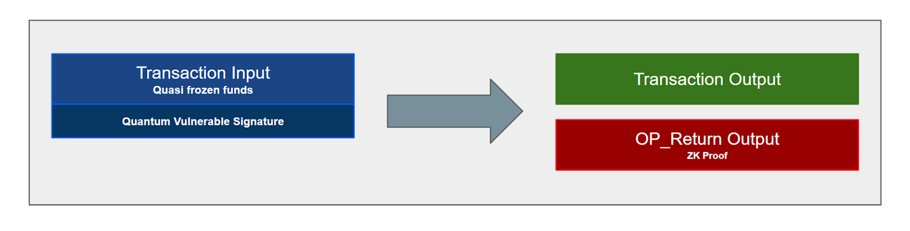

> *作者：Bitmax Research*
> 
> *来源：<https://www.bitmex.com/blog/Mitigating-The-Impact-Of-The-Quantum-Freeze>*

**摘要**：在本文中，我们研究了多种为应对量子计算机而提出的钱币冻结提议，它们通过允许接近冻结状态的钱币可以用量子安全的办法复原，来缓解冻结的影响。这可以通过使用两笔交易来实现：（1）准备交易（包含一个哈希承诺）；（2）复原交易。另一种办法只需使用一笔交易，要求添加一个 “零知识的证据（ZKP）” 到交易中，以证明花费者知道这个钱包的种子词。这些系统表明，在理论上，我们有可能构造出一种冻结方案，让几乎所有接近冻结状态的钱包都都可能复原。然而，复原的过程和允许复原的软分叉协议升级可能会非常复杂，而且可能还有其它缺点，比如说增加节点运营者的负担。不过，如果我们真的要冻结钱币，那么这些复原选项是值得考虑的。

## 概述

这是我们关于比特币应对量子计算机的系列文章中的第三篇。我们的第一篇文章探讨了 [Lamport 签名](https://www.bitmex.com/blog/quantum-safe-lamport-signatures)（[中文译本](https://www.btcstudy.org/2025/08/25/quantum-safe-lamport-signatures/)）、第二篇文章探讨了 [Tapleaf 量子安全花费路径](https://www.bitmex.com/blog/Taproot-Quantum-Spend-Paths)的好处（[中文译本](https://www.btcstudy.org/2026/02/02/taproot-quantum-spend-paths/)）。在本文中，我们要了解是，在为了应对量子计算机而冻结人们的量子脆弱钱币时，如何缓解冻结的影响，尤其是，通过多种量子安全的复原方案来减少潜在的钱币丢失。

（译者注：在应对量子计算机影响的讨论中，常有提议为缓解钱币被量子计算机盗窃或遗失钱币被量子计算机找回而对流通量造成影响，而冻结这些钱币；在这里， “冻结” 意味着禁用会被量子计算机攻破的花费方法，也就是单纯的椭圆曲线签名；“复原” 指找回对这些钱币的控制权 —— 将它转移到只有其主人能控制、带有安全花费方法的地方。）

## 承诺-复原 方法

承诺交易和 OP_Return 输出，可以用来在冻结钱币之后以量子安全的方式复原资金。这可以应用在标准的 P2PKH 输出上（前提是之前已经避免重复使用地址）。这种设计需要发送两笔交易，其中第二笔交易会以明文的形式在区块链上暴露私钥。

没有重复使用地址的 P2PKH 资金已经可以免疫量子长程攻击，仅有的风险是在你的花费交易被区块确认之前、 量子攻击者反算出了你的私钥。下图使用了一笔承诺交易和一个时长为 100 个区块的窗口，来防止攻击者发动这种攻击。

复原方法的结构也展示在图中：

我们逐步讲解这个过程：

1. 在一笔初步的 “准备交易” 中放置一个 OP_Return 输出
2. 等待 100 个区块的确认
3. 创建第二笔交易，也就是 “复原交易”，它花费量子脆弱的钱币；它本身需要提供正确的量子脆弱签名，从而，根据旧的、量子冻结以前的规则，这笔交易是有效的
4. 在第二笔交易的 OP_Return 输出，包含前后拼接的以下字段：
   - 私钥
   - 转账目标地址
   - 准备交易的 TXID
5. 准备交易的 OP_Return 输出，应该是复原交易 OP_Return 输出中的两个字段的哈希值，即 `SHA256(私钥 + 转账目标地址)` 。准备交易的 TXID 无法包含在这个承诺哈希值中，这是显然的，不过也不必要就是了。

这种复原方案将需要一套非常复杂的协议升级。这套协议升级需要指定，后面这笔复原交易，仅在该交易的 OP_Return 输出中的所有细节、都跟至少得到了 100 个区块确认的某笔交易的哈希承诺完全匹配；并且该复原交易还带有有效的签名，才是有效的。如果复原步骤没有正确完成，资金就仍是冻结状态。因为复原交易依然带有一个有效的量子脆弱签名，所以这笔交易在量子冻结以前的规则下也是有效的。因此，这套升级也许可以是软分叉（而不是硬分叉）。使用这种方法，花费者证明了自己在签名发送到区块链之前就知道了私钥，所以是量子安全的。

这种方案并不完美，而且只能使用一次。一旦你将私钥以明文形式在区块链上公开，那就人人都知道了，而且任何人都能在等待 100 个区块之后拿走任何剩余的资金。此外，只要复原交易没能在广播之后的  100 个区块内确认，资金就可以被几乎任何人偷走。换句话说，如果矿工们可以审查这笔交易长达 100 个区块的时间，那么他们就能偷走资金。我们不是在鼓吹这一种方案，只是把它当成一种演示：如何用相对简单的原语构造出一种抗量子的复原方案（本质上，这里只使用了哈希函数）。另一方面，升级协议、开发能够处理这个流程的钱包、告知用户有这种复原方法，可能是非常困难的事情。

还有一个问题是地址复用。P2PKH 输出们的公钥可能已经暴露在区块链上，只要它的地址已经不是第一次使用。如果允许这种复原方案，那么只要有地址复用，量子攻击者就一样能盗窃用户的钱币，那么冻结就没有效果了。规避这种情形的一个办法是只允许未曾重复使用的地址应用这种复原方法。但是，这就可能会给节点造成一个很大的负担，因为它们需要遍历比特币的整个历史来检查一笔复原交易的有效性。那么，在这种情况下，剪枝节点（pruned nodes），将无法检查复原交易的有效性。

## 种子词承诺方法

值得一提的是，许多人都使用 12 词或者 24 词的种子词组来生成钱包、保管比特币。比如说，他们会使用 [BIP-39](https://github.com/bitcoin/bips/blob/master/bip-0039.mediawiki) 种子词标准。为了从这个有序的词组得出钱包的种子，需要使用一种基于口令（password）的密钥派生函数。这里面涉及 SHA512 哈希函数，因此是量子安全的（至少就目前所知）。因此，虽然一台量子计算机理论上可以在区块链上看到你的公钥，然后使用量子魔法反算出你的私钥，但它完全无法一直倒推出你那有序的 12 词词组。

因此，有一种想法是，从 12 词词组得出主私钥的过程是量子安全的，那么，通过发布种子词词组来花费也就是量子安全的。这也要分两步走：一笔 “准备交易” 和一笔 “复原交易”。这种方法，甚至在公钥已经在链上暴露的情形（比如地址复用和 Taproot 输出）中也可以使用。

这种复原方法的结构见下图：

各步骤如下：

1. 在一笔初步的 “准备交易” 中放置一个 OP_Return 输出
2. 等待 100 个区块的确认
3. 创建第二笔交易，也就是 “复原交易”，它花费量子脆弱的钱币；它本身需要提供正确的量子脆弱签名，从而，根据旧的、量子冻结以前的规则，这笔交易是有效的
4. 在第二笔交易的 OP_Return 输出，包含前后拼接的以下字段：
   - 有序的 12 词种子词
   - 钱包派生路径
   - 转账目标地址
   - 准备交易的 TXID
5. 准备交易的 OP_Return 输出，应该是复原交易 OP_Return 输出中的三个字段的哈希值，即 `SHA256(种子词 + 派生路径 + 转账目标地址)`。如前所述，准备交易的 TXID 无法包含在内

这种方案跟前述的 “承诺-复原方案” 有许多缺点是一样的，只不过，在上述方案之外允许此种方案，有希望复原更多钱币。

## QDay 前承诺方法

这种基于承诺的复原系统甚至能用来复原在量子计算机面前最脆弱的 P2PK 输出 —— 这种脚本的公钥在它收到资金（这个输出创建）的那一刻就暴露了，那时候甚至都还没有种子词标准。下图展示了这种方法：

这种方法的奇特的地方是，准备交易要在 QDay（量子计算机成熟的那天）之前发布到区块链上。因此，我们可以假设，只有资金的当时的合法主人才知道它的私钥。这种复原方案听起来有点滑稽，因为跟前面提到的复原系统不同，它要求资金的主人在 QDay 之前就采取行动；但是，如果主人可以在 QDay 之前就采取行动，那资金完全可以转移到一个量子安全的输出中。毕竟，将资金转移到一个量子安全的输出应该比构造准备交易容易得多。

但是，这种复原方案可能对中本聪（或者说，那个在 2009 年获得了绝大部分挖矿产出的人）特别有用。中本聪可以在 QDay 之前构造准备交易。人们将不会知道这是中本聪在做什么，因为我们只能看到一笔普普通通的交易，在表面上跟中本聪的钱币无关，只是带有一个 OP_Return 输出（携带了 256 比特的数据）。这样一来，关于是否动用了这些古老的钱币，中本聪就可以保持合理推诿能力，但是，却能在 QDay 之后，以量子安全的花费方式找回这些钱币，只要 TA 愿意。当然，这是在假设中本聪对此感兴趣。

甚至，我们可以创造这样一种方案：承诺交易所携带的这个 256 比特的承诺是一棵巨大的默克尔树的默克尔根哈希值，带有数千个量子脆弱输出的复原条件。因此，只要一个 OP_Return 输出中的一个 256 比特的哈希承诺，就可以用来在日后复原数千个输出（可能带有成百上千个 BTC）。 在这种情况下，复原交易将带有一个体积非常巨大的 OP_Return 输出，因为需要提供从叶子到默克尔根的路径。（幸运的是，现在体积巨大的 OP_Return 输出在网络中也能转发了）。这种默克尔根方法也能缓解在 QDay 之前大家匆匆制作承诺交易而带来的区块链拥堵。

## 零知识证据种子词方法

上述方案都有一个致命的缺点：每个地址都只能发动一次复原操作。不过，这里有一种东西叫做 “零知识证明（ZKP）”。 零知识证明就是说，在你证明一些事情的时候，依然让这个过程的一些信息保密。比如说，一个零知识证据可以用来证明你拥有一个种子词（它生成了一个地址，并且可以生成对应的电子签名），但依然让这个种子词保密。虽然许多 ZKP 方案是量子脆弱的，但有一些，比如 [STARK](https://www.starknet.io/blog/bitcoin-has-a-quantum-problem-starknet-has-the-answer/)，是量子安全的。

这种 ZKP 方法如下图：

这种方案的一个关键有点是，使用一个零知识证据的时候，种子词本身并没有暴露，因此在这种方案中，同一个地址可以多次使用  ZKP 花费（复原）。这样一来，就不需要两笔交易（准备交易 + 复原交易）了，只需要一笔交易就可以了。这种 ZKP  方法只对种子词有用，不能用在 “承诺-复原方案” 中，因为量子脆弱的签名依然需要发布到链上，这样交易才是有效交易，所以私钥是必然会被量子计算机反算出来的。

这种方法还有一个好处：比特币人不需要在 QDay 之前移动资金。这种新的花费方式 —— 在 OP_Return 输出中携带一个零知识证据，证明花费者拥有种子词 —— 可以在 QDay 之后被当成一种新的花费方法。人们可以继续正常使用自己的钱包，直到冻结；然后升级钱包软件、添加 ZKP 输出、继续花费自己的钱币。在 QDay 之后，人们可以根据自己的需要，逐步将自己的资金转移到花费效率比 ZKP 更高的输出中（比如使用 SPHINCS+ 哈希函数签名的输出）。但关键是：在 QDay 之前，你不需要为迁移而焦虑。

这种 ZKP 方法的另一个可能的好处在于，隐私性可以提升 —— 发布种子词会揭晓一个钱包的所有过往交易记录。而使用 ZKP ，已经被花费的输出可能不会被关联到复原资金。

这种方法的重大缺点在于：并不是每个人都使用种子词来生成自己的钱包。不过，种子词钱包已经极为普及超过 10 年时间了。

## 结论

这些复原方案表明，在理论上，如果我们真的想，我们可以构造出一种量子冻结方案，使得几乎每一个接近冻结状态的钱币都有可能找回。支持多种复原选项可以增加找回钱币的概率。比如说，ZKP 种子词复原方法对有种子词的钱包有效；而如果一个钱包没有种子词，那么可以使用 承诺-复原 方法。这可能已经覆盖了绝大多数的钱币。只有既没有使用种子词，公钥又已经暴露的钱币，才会完全无法复原。下表列举了当前各种脚本类型所持有的钱币面额，并附带了可以应用的复原方案。

| **输出类型**     | **钱币面额**   | **供给量占比** | **可能的冻结缓解选项**                            |
| ---------------- | -------------- | -------------- | ------------------------------------------------- |
| P2WPKH           | 8,011,484      | 40.1%          | 承诺-复原方案，种子词承诺方案 以及 ZKP 种子词方案 |
| P2PKH            | 4,709,800      | 23.6%          | 承诺-复原方案，种子词承诺方案 以及 ZKP 种子词方案 |
| P2SH             | 4,045,377      | 20.3%          | 承诺-复原方案，种子词承诺方案 以及 ZKP 种子词方案 |
| P2WSH            | 1,296,835      | 6.5%           | 承诺-复原方案，种子词承诺方案 以及 ZKP 种子词方案 |
| P2PK             | 1,716,419      | 8.6%           | QDay 前哈希承诺                                   |
| Taproot          | 196,292        | 1.0%           | 种子词承诺方案 以及 ZKP 种子词方案                |
| 新的量子安全输出 | 0              | 0.0%           | 不需要复原                                        |
| **总计**         | **19,976,207** | **100.0%**     |                                                   |

数据来源：https://dune.com/murchandamus/bitcoins-utxo-set

这些可能的后量子 冻结-复原 系统各有缺点。比如它们可能很复杂、要求巨大的软分叉协议升级、可能给节点运营者带来麻烦（可能出现新的 DoS 漏洞）。不过，如果我们真的要冻结，至少这些复原方案是真的考虑的。起码，是一种有趣的思想实验吧。

（完）