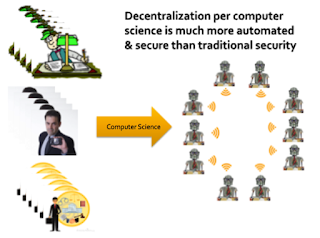
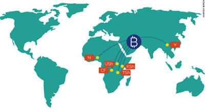
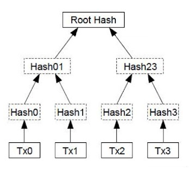
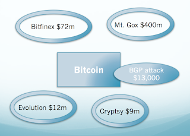

> *作者：Nick Szabo*
> 
> *来源：<http://unenumerated.blogspot.com/2017/02/money-blockchains-and-social-scalability.html>*

> 编者注：本译本首发于 [NervosNetwork 公众号](https://mp.weixin.qq.com/s?__biz=MzUzNzg4NTAzOA==&mid=2247484784&idx=1&sn=fbc6069a52b500b5c49e9de6e8189fcc&chksm=fae16571cd96ec67ac37557d52e134c1c118d55cebad5620d7817d8bd9fcea19199aa34a38a9&mpshare=1&scene=1&srcid=110779CQ0IpZNoEBF3f5F9lS#rd)，此处的版本经过了重新校对。

## 引言

当下，区块链风头正盛。其中最大、运行时间最长的区块链系统叫做[比特币](http://nakamotoinstitute.org/bitcoin/)。直到今天，在它迄今为止的八年发展史中（校对注：原文撰写于 2017 年 2 月），比特币的价值从 10,000 个币买一块披萨（在交易所用传统货币给比特币定价之前）上涨到每个比特币值 1,000 美元以上。在撰写本文时，比特币的市值已超过 160 亿美元。比特币连续运行八年，链上几乎没有经济损失，现在已经成为世界上一些重要领域最可靠和最安全的金融网络。

**比特币成功的秘诀绝不在于它的运算效率或资源消耗方面的可扩展性**。比特币挖矿的专用硬件得高薪聘请专家来设计，但它只有一个功能 —— 重复解开一个特定的、被故意设计得非常难的计算难题。这个难题被称为工作量证明，因为难题的答案除了证明一个计算机确实做了大量的计算工作，别无意义。**像这样的比特币解题硬件可能要消耗总计 500 兆瓦以上的电力，而比特币会令工程师和实业家感到无语的地方还远不止于此**。

**每台运行比特币软件的计算机并不是将协议信息尽可能减少，而是使用大量重复的 Inventory vector 消息淹没互联网，以确保其他的比特币节点能尽可能准确地接收到所有消息**。这样设计的结果就是，比特币网络每秒能够处理的交易数根本不可能和传统支付网络（如 PayPal 或 Visa ）那样相提并论。对那些追求资源利用最大化和性能极致的工程师和实业家来说，比特币简直是令人痛心疾首。

相反，**比特币成功的秘诀在于：用大量的资源消耗和差劲的计算扩展性来换取更有价值的东西 —— 社会扩展性。**社会可扩展性指的是制度的一种能力：制度指的是一切能约束和激励参与者行为的东西，包括但人们可以重复参与的关系和共同活动、习俗、规则，等等；那么，一个制度能在多大程度上克服人类思维的缺陷、避免参与者激励措施和限制措施上的漏洞？

社会扩展性关系到的，是随着组织参与者的多样性和数量增长，参与者能够在何种程度上、以何种方式来考虑行动、响应制度并处理与其他参与者的关系。这主要跟人类的局限性有关，而与技术上的局限性或者说物理上的资源限制无关。有一些独立的工程学科，比如计算机科学，用于评估技术本身的物理限制，包括用技术处理更多的用户或达到更高的使用率所需的资源容量。除了与社会扩展性作比较以外，这些工程可扩展性考虑并不是本文的主题。

社会扩展性跟认知局限和思维差异导致的行为倾向有关，而与机器的物理资源限制无关，这点很重要，但更重要的是（实际上往往至关重要）的是，思考和讨论制度背后的技术的社会可扩展性。**制度技术的社会拓展性取决于该技术如何限制或激励在该制度的参与行为，包括保护参与者和制度本身免受不良参与或攻击**。判断制度技术社会拓展性的其中一种方法是计算能从参与该制度行为中获益的人数。另一种方法是估量该制度能为参与者带来（或强制施加）的极端好处和惩罚，前提是（出于认知或者行为上的理由）参与的预期成本和其他伤害的增长速度还不至于比好处的增长更快。在参与一种制度时，个人能享受到的文化多样性和司法多样性也是很重要的，尤其是在全球互联网的语境下。一种制度越是依赖于地方性的法律、习俗或者语言，其社会可扩展性就越低。

没有过往那些制度和技术上的创新，可以参与共同活动的个体数量通常限制在最多 150 个人左右 —— 也就是著名的 “邓巴数（Dunbar number）”。到了互联网时代，新的发明也在不断扩展我们的社交容量。在本文中，我会讨论区块链（仅限于实现了密码学货币的公有链）如何能提高社会可扩展性，尽管伴随着计算效率和可扩展性的巨大牺牲，也物有所值。



- 认知能力（从物种大脑皮层的相对大小来说）限制了灵长类动物群体的大小。维系动物或人类亲密的群体关系需要大量的情感沟通和关系投资，比如人与人之间见面前的着装打扮、闲聊八卦、开玩笑、讲故事以及其他传统形式的谈话、歌会和唱戏等等。想要突破人类的认知能力为团体活动设下的身份和数量上限（著名的150人左右的“邓巴数”），需要制度和技术创新 [1]。-

社会拓展性的创新包括制度和技术的改进，将思想化为书条或者机器，降低认知成本，同时增加在头脑间流动的信息的价值，减少安全漏洞，寻找和发现新的互惠参与者。

阿尔弗雷德·诺思·怀特黑德（Alfred North Whitehead） [2] 说过：“有一种老生常谈，明明谬以千里，教科书和名人演讲却还在学舌： 我们应该培养思考的习惯，多思考我们正在做的事情。而事实却恰恰相反，**文明的演进，正是通过增加那些我们不假思索就能执行的规范来实现的**。”

哈耶克（Friedrich Hayek）补充道：“**我们不断运用我们并不真正理解的公式、符号和规则，通过对这些规则的使用，个人得以利用其自身并不具备的知识**。在一些已被证明在其自身的领域里有用的习惯和制度之上，我们发展出了此类利用他人之知识的实践和制度，而这些发展出来的实践和制度，又会反过来成为文明进一步演化的基础。”

各种各样的创新降低了我们对于参与者、中介和外部人员的隐忧，也因此降低了我们的对他们的关注的必要性，不需要我们以有限的认知能力去担心越来越多的、越来越多样化的人的行为。

另一类的创新可以促使越来越多（数量和种类）的参与者相互收集和传递有价值的信息。还有其他的创新也使更多的互利参与者能够发现彼此。

在人类史前和整个历史进程中，所有这些创新都提高了社会拓展性，甚至可以说这种效果非常明显，使得我们人口庞大的现代文明成为可能。现代信息技术（IT），特别是近代计算机科学的发现，往往可以发现更多互惠的匹配，激励人们提高信息质量，**并且可以减少某些类型的机构交易中对信任的需求，对于数量和种类越来越多的人来说，这些技术和发现以非常重要的方式进一步提高了社会拓展性**。

在头脑间流动的信息（也就是我所说的主体间协议 [3]）包括口头和书面文字、习俗（传统）、法律内容（规则，习俗和先例）、其他因素（例如在网络评级系统中很常见的“星级”排名）以及市场价格等等。

信任成本最小化（Trust minimization）则降低了参与者对彼此、对外部人士和中介机构有害行为的脆弱性。大多数经历了漫长的文化演变的制度，比如法律（降低暴力、盗窃和欺诈的漏洞）以及安全技术，总的来说，都以各种各样的方式帮助降低了我们对自己的人类同胞的脆弱性，因此也减少了我们对他人的信任需要（相比于不实施这些制度和技术）。

**在大多数情况下，一个常常被信任并且足够值得信赖的制度（比如市场）依赖于其参与者对另一个足够值得信赖的制度（如合同法）的信任（通常是隐性的）**。 自古以来，这些被信赖的制度就会通过最大限度地减少其参与者（例如会计师、律师、监管人员和调查人员）的脆弱性，来实施会计、法律、安全或其他控制措施，使自身更实时、更充分地被信赖、至少能够促进下游制度的功能。创新只能部分消除某些漏洞，即减少对其他人的信任需求或风险。当然，**世界上不存在任何一个完全无需信任的制度或者技术**。

即使我们有最强大的安全技术——加密技术，完全无需信任的制度还是不存在的。尽管一些密码协议确实保证了某些特定的数据关系，能以高概率对抗具有极高计算能力的对手，但如果你将所有参与者的所有可能行为都纳入考量，那密码协议也不能提供绝对的保证。例如，加密技术虽然可以强有力地保护电子邮件免受第三方的直接窃取，但发件人仍然需要信任收件人，他不会直接或间接地将该电子邮件的内容转发出去，或者泄露给任何不应该知道的第三方。

又如，在我们最强有力的共识协议中，比例远低于 100% 参与者或中间人（以所持有的计算能力、股份、身份或者历史计数来衡量）的有害行为也有可能破坏参与者之间事务或信息流的完整性，从而在总体上损害参与者。近代计算机科学取得的突破，的确可以减少漏洞，且往往效果显著，但这些技术进展远做不到消除一切潜在的漏洞。

**撮合技术可以促进互利参与者间的相互发现。这可能是互联网最擅长的一种社会扩展性**。像 Usenet News，Facebook 和 Twitter 这样的社会网络可以帮助人们发现志同道合的伙伴，互娱互乐，或者保持联系（甚至可能找到未来的配偶！）。在社会网络为人们提供更快发现彼此的可能性之后，接着便可促进不同层次的人际关系投资，人类访问社会网络的频率会从一开始的随便看看转变到频繁访问，最后痴迷其中。克里斯托弗艾伦（Christopher Allen）等人 [4] 对网络游戏和相关社会网络中互动群体的大小和时间进行了有趣而详细的分析。

eBay，Uber，AirBnB 和在线金融交易所通过交易撮合的大幅增加，带来了社会拓展性：搜索、寻找、汇集和促进互惠商业或零售交易的协商谈判。这些相关服务还有助于促进支付和运输等业务，以及对陌生人在这些交易中承担的其他义务是否已经履行的验证和就此交易的完成质量进行的充分沟通（如“星级评分”系统，Yelp 评论等）。

**互联网对社会拓展性的贡献是撮合，而区块链对社会拓展性的主要贡献在于信任成本的最小化**。区块链可以通过锁定一些重要业务（如货币的创建和支付）和重要信息流的完整性（integrity）来降低风险，未来可能减少一些重要撮合功能的完整性（integrity）瑕疵。对秘密又任意可变的私有计算过程的信任，可以被对基本不可变的公开计算的可验证的信心替代。本文将重点讨论这样的风险降低，以及它如何有助于促成一种对广泛的潜在交易者有用的标准化偿付手段（standard performance）（即信任最小化的货币）。

## 货币与市场

通过撮合互惠互利的买卖双方及使用普遍接受的标准化支付手段（counter performance）（即货币），货币和市场可以让每一笔交易的参与者直接受益。这里的市场是亚当·斯密所用的概念：指的不是用来聚集买卖双方的特定场所或服务（尽管有时可能会涉及到这些），而是大量成对交易的集合，可以让产品的供应链变得协调。

**在货币和市场的激励下，会出现更准确的价格信号，从而减少参与者在其他交换方式中所需的谈判成本、减少失误。可以说，货币与市场的有效结合，使得更多不同的参与者可以有效地协调他们的经济活动**，不像以前那种类似双边垄断（而非竞争市场）的交换机制。

**市场和货币可实现交易撮合（匹配买卖双方）、减少信任需求（依赖利己心理而非熟人和陌生人的利他心理）、可扩展的偿付手段【通过货币（一种广泛接受且可反复用于偿付的媒介）】以及优质信息流（市场价格）**。

最早讨论货币和市场问题的思想家是亚当·斯密。**在英国工业革命爆发之初，亚当·斯密在《国富论》中指出，即使是最简单的产品，也直接或间接地依赖于大量不同工种的劳动：**

> 观察一个文明繁荣的国家中最普通的技工或日工的生活用品，你会发现，与日用品生产相关的那些工业（虽然只是一小部分）雇佣来参与生产的人数，多得不可胜数。例如，日班工人穿着的看上去极其粗糙的羊毛外套，却是大量工人的共同劳动成果。
>
> 牧羊人、拣毛人、梳毛人、染色工、梳理工、纺工、织工、漂白工、缝纫工和许许多多其他工人，需要综合他们不同的手艺才能完成这样一件家用产品。除此之外，将原材料在这些住在偏远地带的工人们之间运输，需要多少商人和承运人！ 更何况，将染色工需要的不同染料（这些染料往往来自世界各地）运输到一个地方，需要多少次贸易和航运、多少船工、水手、制帆人、制绳人！ 为了生产这些工人所使用的最普通的工具，又需要多少劳动！
>
> 暂且不论像水手工作的船只、漂白工用的水车、织工用的织机这些复杂的器械，单说牧羊人剪毛时所用的大剪刀这种非常简单的工具，就需要多少复杂的劳动：必须综合矿工、熔矿炉建造工、伐木工、烧炭工、制砖工、砌砖工、熔炉工、技工、铁匠等不同角色的工艺才能生产出来。
>
> 如果我们以同样的方式看待这名工人的其它衣服和家具，如，贴身穿的粗麻衬衣、脚上穿的鞋子、睡觉的床铺和床铺上的各种寝具、做饭的炉子、由地下采掘出来而且也许需要经过水陆运输才能送到他手边供他烧饭的煤炭、厨房中一切其它用具，餐桌上的一切用具、刀子和叉子、盛放食物和分取食物的陶制和锡蜡制器皿，面包和酒，可以保暖、透光并能遮蔽风雨的玻璃窗，和那些使北方也能成为极舒适的居住地的发明，这些发明所必须借助的一切知识和技术，以及工人制造这些发明所用的各种工具等等。
>
> 总之，我们如果认真想想这一切东西，考虑每样东西上凝结的各种劳动，我们就会发现：如果没有成千上万人的劳动和协作，一个生活在文明国家的普通人根本无法获得这些日用品。然而，我们却错误地认为维持这样的生活是多么轻而易举。

这些都发生在 1776 年后发生的一系列工业革命和全球化浪潮出现之前。时至今日，劳动分工已经历过无数的改良，其复杂度和范围扩大了许多倍。与其相信陌生人会做出利他行为，还不如相信市场和货币，因为它们可以创造许许多多利益共同体，来激励这个由陌生人构成的大型网络做出有益于公众利益的行动：

> **在文明社会中，人类随时都需要大量合作和帮助，然而在短暂的一生中只能和少数人建立友谊… 相比起其他动物，人类更会经常遇到需要他人帮助的情况，然而只期待着别人施恩是不行的。交换这种行为能让我们从其他人那里获得远远更好的所需物品。我们所需的饮食，不是来自屠户、酿酒师或面包师的恩惠，而是出于他们对自身利益的打算。**

斯密接着又描述了劳动分工以及劳动生产率对于配对交换网络的依赖程度：“**正因交换导致了劳动分工，所以分工的程度必然受到交换能力的限制。换句话说，分工受市场的制约。**”随着国家乃至全球的交换网络不断壮大，越来越多的生产者参与其中，劳动分工得以细化，劳动生产率得以提高。

货币则通过提供更多交换机会来促进社会扩展性。作为被广泛接受且可反复使用的财富存储及转移媒介，货币通过减少交易中的偶然性问题（交换需求匹配以及转账需求匹配的偶然性）降低了交易成本，使得交换涉及的商品和服务种类越来越多，参与者也越来越多样化。

各种各样的媒介，包括口语、粘土 [5]、纸、电报、无线电和计算机网络等，都曾经被用来传达要约、承诺、由此产生的交易和价格，以及对执行的监督和其他商业沟通内容。关于市场和货币形成的价格网络，弗里德里希·哈耶克在他的《知识在社会中的运用》 [6] 中提出了很深刻的见解：

> 在一个有关相关事实的知识分散在许多人手中的体系里，价格能协调不同个体的独立行为……在任何一个多人协作的社会中，无论谁想要制定一种中央计划，或多或少都得基于某个知识。这个知识最初不是给规划者的，而是给其他人的，其他人必须再通过某种方式传达给规划者。
>
> 对于一切解释经济过程的理论来说，作为计划基础的知识通过何种方式传达给人们是至关重要的问题，至于最初分散在所有人中的知识的最佳利用方式是什么，这一问题至少是经济政策，或者说是设计高效的经济体系的主要问题之一…
>
> 每种商品都有一个价格（或更确切地说，各地的价格是相互关联的，其差别取决于运输费用等等），这个简单的事实似乎暗示着一种解决方法，如果所有信息都掌握在一个人手里，就有可能为所有商品都找出那个合适的价格，但这仅仅是在概念上有可能而已，实际上，所有信息都分散在每个涉及这一过程的人手中…
>
> 神奇的是，在诸如某种原料短缺的情况中，无需发出任何指令，也没有多少人知道其中原因，就会有成千上万的人（他们的身份花几个月时间也无法全部调查清楚）会自发地开始节约该原料或使用该原料生产的产品；也就是说，人们会做出正确的选择…
>
> 价格体系正是一种人类偶然发现但尚未理解的制度之一。人们正在学着利用价格体系（但是远远没有学会充分利用它）。价格体系使得劳动分工和资源协调利用在知识均匀分布基础上成为可能……解决方案在只掌握部分信息的人的交互协作中产生。

（编者注：台湾的夏道平先生将哈耶克此文题译为《散在社会的知识之利用》，“散在”一词，窃以为更切合哈耶克论文主旨。）

## 网络安全技术的社会可扩展性

很久以前，我们使用黏土，后来使用纸，如今通过计算机和数据网络上运行的程序和协议来实现大部分商业交易。虽然这种进步极大地改进了交易撮合和信息流动，却导致人类对作恶行为的防御力下降。

随着网络的发展，更多对彼此行为习惯和约束并不了解的人加入进来。基于根信任的访问控制来实现的安全系统只适用于小型办公室，例如，贝尔实验室，里面的工作者互相熟识，收入和支出都通过纸质流程而非办公室计算机上的电子程序控制。然而，随着组织机构变得更加庞大，组织边界更错综复杂，以及更有价值更集中的资源（如货币）被委托给计算机管理时，这种安全系统变得不再高效，也不再安全。

 接收越多来自陌生人的电子邮件，就越有可能受到网络钓鱼攻击或收到恶意软件。传统的计算机安全系统并不具备很好的社会扩展性。正如我在《可信任计算的黎明》[7] 中描述的一样：

> 当我们在蜂窝网络或互联网上使用智能手机或笔记本电脑时，与我们交互的另一端通常运行在其他独立计算机上，例如网络服务器。 **实际上，从架构上来说，所有这些机器都是为了方便一个人或一群相互了解信任的人控制而设计的**。从远程网络或应用程序用户的角度来看，这些架构建立在对某个未知的 “root”管理员完全信任的基础上。这个管理员可以控制服务器上发生的所有事情：
>
> 他们可以任意读取、更改、删除或屏蔽该计算机上的任何数据。即使通过网络加密发送的数据，最终也会被一台受控制的计算机解密和完全掌握。使用网络服务（实际上在这样的网络里我们很容易被攻击）意味着，我们相信计算机（或者某个控制该计算机的人，可能是内部员工或是黑客）会如实执行我们的任何命令并保护我们的付款。如果有人在另一端企图滤掉或者篡改你的网络指令，没有很好的安全措施可以阻止他们，只能依靠一些不靠谱又昂贵的人为制度，而这些制度往往走不出国家的边界。

很多服务器对于内部人员或外部人员来说没有足够的攻击价值。但是也有越来越多的服务器因为包含有利用价值的资源而招致频繁攻击。基于根信任的中心化安全系统难以扩展。随着计算机控制的资源变得越来越有价值且越来越集中，基于根信任的传统安全机制越来越像现实世界中的“有事找警察”。幸运的是，有了区块链技术，我们可以在大部分重要的计算场景中做得更好。

## 区块链与密码学货币

可扩展的市场和价格需要可扩展的货币。可扩展的货币需要可扩展的安全性，这样更多不同的人可以使用该货币，同时货币不会失效 —— 不能伪造、 不会通胀、也不会被盗。

2009 年，以中本聪为名的某个人或是一群人创造了比特币。中本聪在货币上的突破是通过信任最小化给人们提供了社会可扩展性：减少交易对手风险和第三方风险。中本聪使用计算成本高昂但自动化的安全系统代替计算成本低但制度成本高的传统安全系统，很好地增加了社会扩展性。一组只需部分信任的中间机构取代了原本单一的需要完全信任的中间机构。

- 打了“计算兴奋剂”的金融控制：区块链就像由机器人组成的军队，互相检查彼此的工作。-

当我们可以通过计算机科学而不是传统的会计师、监管人员、调查人员、警察和律师来保障金融网络的最重要功能时，我们会趋向于一个自动化、全球化且更安全的系统，而不是人为控制的、局限于本地的且不一致的安全系统。如果我们通过正确的方式在公链上实现密码学货币，就可以使用一大批计算机来替代传统银行业的大量官僚。

“**通过使用计算机来维护区块链，我们就能将互联协议中最关键的部分放在一个更加可靠和安全的基础上，让我们以前不敢在全球网络上尝试的信托交互成为可能**。”[8]

对于区块链技术，尤其是比特币来说，最有价值的特点包括：

- 可独立于现有机构运行
- 可无障碍地跨越国界运行

区块链之所以具备这些特点，是因为它可以在没有人为干预的情况下保持高水准的安全性和可靠性。如果没有高安全性，区块链将只是一种资源利用率极低的分布式数据库技术，依然需要依赖于当地官僚制度来保证其正常运行。

- 自 20 世纪中期以来，计算机的效率提高了好几个数量级，但人类的大脑并没有多少变化 。新的计算能力为突破人类的极限创造了许多可能性，而随着人类思维发挥到了极致，基于人类心智设计的制度也已经发挥到了极致。结果就是，人类没有剩余的心智来提升我们现有的制度了。

**但如果我们用计算机直接代替人类发挥功能，社会扩展性依然有很大的改进空间**。（重要提示：这个结论取决于上图中斜线的斜率，而不是人类能力线的绝对位置。上面显示的能力线位置是任意的，仅仅取决于我们对人类能力的估算）。

一个新的中心化金融实体，一个需要信任的第三方，如果不像传统金融机构那样拥有等效于“人工区块链”的制度，极有可能成为下一个 Mt. Gox。如果没有官僚制度，它就无法成为一个可信的金融中介。

计算机和网络的成本很低。扩展计算能力需要的额外资源成本也很低。若想以安全可靠的方式扩大人类传统制度的管理范围，我们需要更多会计师、律师、监管人员和警察，同时也要面临随之而来的官僚作风、风险和压力。律师费用高昂，监管成本更高。而计算机科学在保障货币安全方面远远优于会计师、警察和律师。

在计算机科学中，安全性与性能之间存在根本的权衡。比特币的自动化可靠性源自其运行和资源使用产生的高昂成本。直到现在，还没有出现既能大幅提高比特币区块链的计算可扩展性（例如交易吞吐量），又能保证这种改进不会影响比特币安全性的办法。

**对于比特币来说，很可能不存在两全其美（保持可靠性，同时大幅提高性能）的方法，这也许是无法避免的权衡关系之一。与现有的金融信息技术比较，中本聪做出了一些重要权衡，以牺牲性能为代价提高安全性。在这些权衡中，看似浪费资源的挖矿过程是最明显的一个，但不是唯一一个**。

另外一个权衡是消息传递的高度冗余。为实现数学上可证明的可靠性，消息需要在所有节点之间全面广播。比特币无法实现这一点，但即使要达到近似的目的也需要极高的冗余性。 因此，1 MB 的区块消耗的资源远比 1 MB 网页消耗的多，因为前者在传输、处理和存储方面需要更高的冗余度，以实现比特币的自动可靠性。

这些必要的权衡都以牺牲性能来实现足以支撑独立运作、全球化和自动化可靠性所必需的安全性。这意味着比特币区块链无法在达到 Visa 的每秒交易处理量水平的同时，保持自动化可靠性，**而自动化可靠性才是其相对传统金融系统的独特优势**。

相应地，我们只需要一个对信任最小化要求较低的外围支付网络（如 Lightning [9]）来承担大量小额比特币交易，而比特币区块链只需要定期对成批的外围网络交易进行结算。

**虽然比特币支持的交易吞吐量比 Visa 或 PayPal 都低，但它具有更强的自动化安全性，适用于重要交易**。任何满足互联网接入条件并拥有智能手机的人都可以支付 0.20-2 美元的交易费（这远低于当前的汇率手续费），然后在全球任何地方使用比特币服务。而低费用的小额交易可以在比特币的外围网络上处理。

你可以像使用法币一样使用比特币进行日常消费。例如，以比特币计价的信用卡和借记卡具备与法币信用卡或借记卡一样的秒级交易和请求退款 [10] 功能。我们还可以通过其它巧妙的方法来实现外围比特币小额付款，即，将小额付款放到链下处理，只定期在比特币区块链上进行批量结算。随着比特币使用量增加，比特币区块量将发展成为大额结算层，而小额比特币付款将由外围网络处理。

在设计 Bitgold 时，我已经认识到共识无法在保证安全的情况下扩展到高吞吐量的场景中去，所以我把它设计成了两层架构：（1）Bitgold 本身，作为结算层；（2）Chaumian 数字现金，作为拥有高吞吐量和隐私性（通过 Chaumian 盲签名实现）的零售级外围支付网络，但这个外围网络像 VISA 一样是需要信任的第三方，因此需要由会计师等角色组成的“人工区块链”来保证可靠性。

这个外围支付网络只涉及小额交易，因此只需要很少的人力就能避免重蹈 Mt. Gox 的覆辙。

- 拉尔夫·默克尔（Ralph Merkle）：公钥密码学的先驱，和层级式哈希树结构（默克尔树）的发明者 -

从设计上来说，货币必须在安全性的基础上具有社会可扩展性。例如，货币必须难以被任何使用者或者中间人伪造（以免稀释供给曲线，进而导致过度的或意想不到的通货膨胀）。黄金在世界上任何地方都具有价值，而且不会受恶性通货膨胀的影响，因为它的价值并不取决于任何一个中央权威机构。比特币在这些方面同样表现突出并且可以运行在网络上，它能让阿尔巴尼亚境内的人无需信任第三方 和/或 支付天价手续费的情况下，安心地向津巴布韦境内的人支付比特币。

现在“区块链”有着各种各样的定义，但几乎所有的定义都是出于营销炒作的目的。我建议给“区块链”一个可以将其内涵传递给外行人的清晰定义。区块链应该既有区块，也有链。链指的是默克尔树或其它具有不可伪造的完整性功能的密码学结构。此外，为了在客观上尽可能容忍最糟糕的情况和恶意参与者，受区块链保护的交易和其他数据应该用合理的方式复制下来（通常情况下，即使有 1/3 到 1/2 的服务器作恶，这个系统依然能正常运行）。

- 比特币的社会可扩展型安全性基于计算机科学，而不是警察和律师，所以它支持跨国界支付，例如，非洲的客户可以向中国的供应商无缝付款。私有链要做到这点很难，因为它需要可以在不同行政管辖区之间共享的身份验证、数字证书以及公钥基础设施服务（PKI）。-

因为这个特点，以及（但愿很少）可能出现的会导致历史区块无效的软件更新需求（一种叫做硬分叉的危险情况），区块链还需要一个人工治理层（虽然这一层也会面临政治斗争的风险）。最成功的区块链（比特币）之所以能维持其不可变性，一方面是因为技术专家们之间的去中心化决策，另一方面是因为秉持着不可篡改性原则。这种原则下，只有少数没有任何其它可行方案的重要漏洞修复和设计改进可以使用硬分叉。

在这种治理理念下，会计或法律层面上的决定（例如，更改账户余额或撤销交易）不能成为执行硬分叉的理由，它们应由系统外（或系统上层）的传统治理机制来实现（例如，通过法院禁令强制比特币用户发送一个新的交易，从而起到撤销旧交易的效果，或没收特定用户的密钥，从而没收该密钥所控制的代币）。

所谓的事后不可伪造性和不可变性，指的是一旦数据被提交到区块链上，就无法在不知不觉中被篡改。**与一些炒作所说的概念相反，我们没有任何办法保证数据上链之前的来源是否真实，或数据本身是真是假。这需要采取额外的办法，通常涉及高成本的传统制度**。

区块链不能保证数据的真实性；它只是把真相和谎言都以无法篡改的方式保留下来，让后来的人客观地分析这些信息，从而更有信心揭露谎言。**日常的计算机是一块算力画板；而区块链则是算力琥珀**。重要数据应该尽早地封装进区块链琥珀，最好是由生成数据的设备在签名加密后直接提供，最大限度地发挥区块链在保证数据可靠性上的优势。 

- 一个包含四笔交易的默克尔树（从 tx 0 到 tx 3）。让交易所组成的区块经由工作量证明机制形成链表结构，再加以适当的传播和复制，默克尔树结构就能依托共识机制，打造出交易数据的事后不可伪造性。在比特币中，这些数据会通过安全的方式计算得出默克尔树的根哈希，用于验证区块中的所有交易是否被篡改。 -

我在 1998 年提出的“[安全财产](http://nakamotoinstitute.org/secure-property-titles/)[证明](http://nakamotoinstitute.org/secure-property-titles/)”架构就使用了默克尔树和数据复制机制来容忍客观上存在的软件错误或恶意行为，但还没有区块的概念。这个架构证明了我的理论，即我们可以保护全球共享数据和交易的完整性，并在此基础上设计一个密码货币（Bitgold）。但 Bitgold 也没有像比特币那样更加高效且具有计算扩展性的区块和记账系统。而且它和今天的私有链一样，以可安全区分和计数的节点为设计前提。

因为一些公有链（如比特币、以太坊）的安全性目标受到了 51% 算力攻击的限制，我们都很关心，怎么分辨大矿工的身份，来推断“有没有可能联合其他人发动 51％ 算力攻击”。

**区块链的安全性有其客观上限**，区块链治理会严重受到 51％ 攻击可能性的影响。当然了，攻击者当然不会称之为“攻击”，可能会说成是“开明治理”或者“民主行动”之类的。一些用于修复漏洞或是改善协议的软件更新需要软分叉。另外一些软件更新则需要硬分叉，这会给比特币带来比软分叉更大的安全和连续性风险。

**比起其它网络协议，区块链虽然已经极大降低了信任要求，但实际上离免信任性仍然遥远**。矿工算是部分可信方。那些不是工程专家或计算机科学家但是投入大量时间学习区块链设计原理和代码的人必须充分信任开发者社区，就像那些想要理解一门专业学科的研究成果的非专业人士对该领域的科学家的态度一样。在硬分叉期间，交易所的影响力也很大，因为它们可以决定自己的市场和交易代号支持哪个分叉。

因此，公有链可以相对（但并不能绝对）地避开身份难题，设法在更高的现实或社会层面确认最有权力的矿工的身份，这可能比试着将身份这样（基于大脑）的天然模糊的概念映射到协议层更合适，[公钥基础设施](https://en.wikipedia.org/wiki/Public_key_infrastructure)在这方面的艰难尝试正是前车之鉴。

所以我认为有一些“私有链”有资格成为真正的区块链; 其他的则应该归类到更宽泛的“分布式账本”或“共享数据库”等类别下。它们的社会扩展性与免许可型公有链（比特币和以太坊）完全不同。

以下方案都有安全识别（可区分和可计算）服务器身份的要求，而非像公有链一样允许匿名身份。换句话说，他们需要其它一些在社会扩展性上差得多的方案来解决[女巫攻击](http://changingminds.org/techniques/propaganda/sockpuppeting.htm)问题：

- [私有链](https://blog.ethereum.org/2015/08/07/on-public-and-private-blockchains/)；
- [侧链](https://www.blockstream.com/sidechains.pdf)的“联合”模式（唉，现在没有人知道如何在降低信任要求的情况下开发侧链，尽管之前有过那么多憧憬和承诺）。侧链可以是私有链，二者非常匹配，因为它们在架构上和（对公钥基础设施的）外部依赖性上都非常相似；
- 基于[多重签名](https://coincenter.org/entry/what-is-multi-sig-and-what-can-it-do)的方案，即使是通过基于区块链的智能合约完成的；
- 基于阈值的将链下数据搬到链上的“信息输入机制”。

**要识别服务器的身份，主流但社会可扩展性通常较低的方式是基于[可信认证机构](https://en.wikipedia.org/wiki/Certificate_authority)（CA）的 PKI 体系**。为了避免[受信任的第三方变成安全漏洞](http://nakamotoinstitute.org/trusted-third-parties/)，可靠的 CA 自身就必须是高成本的劳动密集型官僚机构，这些机构通常会自行或是由其它机构来进行广泛的背景调查（例如商业调查公司 Dun&Bradstreet）。（我曾经带领团队设计、打造过这样的 CA）。CA 也充当守门员的角色，保护这些需要许可的系统。 CA 可以成为引起全局控制和故障的单点。 “**公有链是自动化的、安全的、全球化的，但身份认证是劳动密集的、不安全的、局域的**。”

基于 PKI 的私有链对于银行和大型企业来说是一个不错的选择，因为它们已经有成熟的内部 PKI 系统，用来认证批准重要交易所涉及的员工、合作伙伴和私有服务器。银行 PKI 相对可靠。我们也为 Web 服务器提供了半可靠的 CA，但这一般来说不包括 Web 客户端，即使人们在 Web 发明后一直在尝试解决客户端证书问题：例如，广告商们会希望有更安全的方式，可以替代电话号码和 Cookie 来追踪客户身份。但这还没有实现。

PKI 可以为少数重要的事情和人员很好地工作，但对于不那么重要的实体来说，它并不那么好或容易使用。**它的社会可扩展性受其所依赖的传统身份认证官僚体系的限制**。

- 上图是比特币生态系统中出现的一些重大盗窃事件。鉴于比特币区块链可能是现有的最安全的金融网络（事实上比特币在安全性上远远超过传统支付网络，才能保持其低廉的治理成本和点对点跨境转账的能力），基于旧的中心化网络服务器所打造的周边服务并不安全。（来源：作者） -

我们需要通过更具社会可扩展性的方法来统计节点数量，换句话说，需要更健壮的方法来尽可能抵抗腐败，评估节点对区块链完整性的贡献大小。这正是工作量证明和广播复制的关键：大幅度牺牲计算扩展性来提高社会扩展性。

**这就是中本聪的天才权衡。它的天才之处在于认识到人比计算机昂贵得多，且这种差距每年都在扩大。它的天才之处在于可以让人们跨越人类的信任边界（例如国界）安全地进行无缝协作**，不再像 VISA 或 Paypal 那样依赖于“有事找警察”架构，后者昂贵、容易出错，甚至会有腐败问题，仅仅在正常工作时，这些官僚机构才能提供一定程度的可靠性。

## 结论

随着互联网的兴起，各种网络组织如雨后春笋般崛起，包括社会网络、长尾零售商（例如亚马逊）以及为小型买家卖家提供交易平台的各种服务商（eBay、Uber、AirBnB 等）。这些只是对我们新能力的最初级尝试。由于近几十年来信息技术的巨大进步，限制网络组织参与者人数和类型的已经不再是计算机和网络，而是还没有充分跟上技术进步的人类思维和制度设计。

初期的互联网尝试都是非常中心化的。区块链技术通过计算机科学而不是“有事找警察”来实现数据完整性，使得信任最小化货币（密码货币）成为可能，它也必然为其它金融领域以及主要基于在线数据进行交易的场景带来进步。

这并不意味着，让我们的制度适应我们的新能力是一件容易的事，或在某些特定情况下困难会少一些。乌托邦的想法在区块链社区非常普遍，但它们不是可行的选择。对我们高度发展的传统制度进行逆向工程，甚至以新形式重塑一些旧制度，通常比从零开始、或者高谈宏大计划和博弈理论要好得多。

中本聪向我们展示了这样一种关键策略——牺牲计算效率和可扩展性（消耗相对便宜的计算资源）以减少为了实现陌生人协作所需要的社会制度（例如市场、大公司和政府）中的人力浪费，更好地利用人这种宝贵资源。

（完）

----

[1]：http://whatsupnah.com/2009/02/twitter-vs-the-dunbar-number-and-the-rise-of-weak-ties/

[2]：https://en.wikipedia.org/wiki/Alfred_North_Whitehead

[3]：http://www.fon.hum.uva.nl/rob/Courses/InformationInSpeech/CDROM/Literature/LOTwinterschool2006/szabo.best.vwh.net/tradition.html

[4]：http://www.lifewithalacrity.com/previous/2005/10/dunbar_group_co.html

[5]：https://nakamotoinstitute.org/the-playdough-protocols/

[6]：https://www.econlib.org/library/Essays/hykKnw.html?chapter_num=1#book-reader

[7]：https://unenumerated.blogspot.com/2014/12/the-dawn-of-trustworthy-computing.html

[8]：https://unenumerated.blogspot.com/2014/12/the-dawn-of-trustworthy-computing.html

[9]：https://lightning.network/lightning-network-paper.pdf

[10]：https://en.wikipedia.org/wiki/Chargeback

