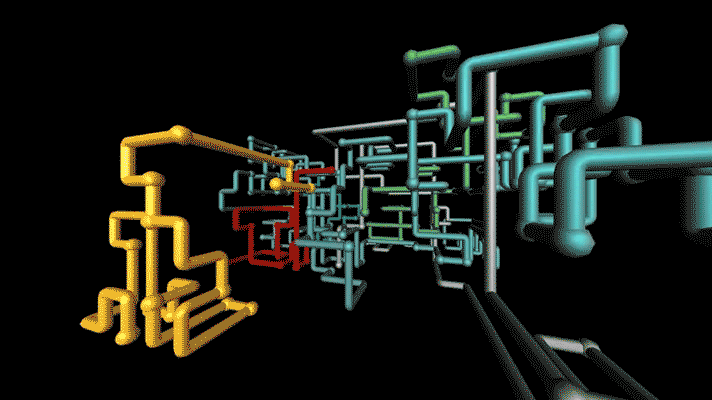
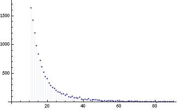
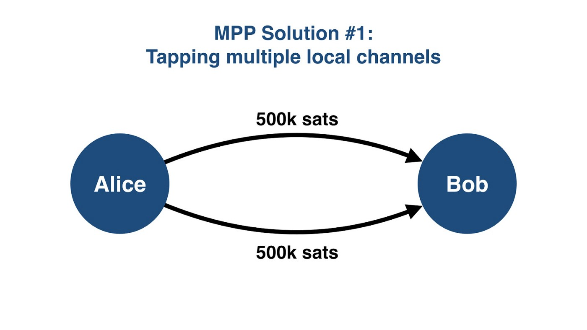
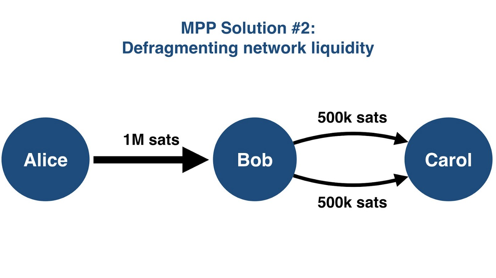

> *作者：Roy Sheinfeld*
> 
> *来源：<https://medium.com/breez-technology/mpps-wumbo-channels-optimizing-liquidity-on-the-lightning-network-6059bedea322>*

注：本文首发于 2020 年 9 月 14 日

有流动，才有流动性。在闪电网络上，比特币是液体，问题在于有多少比特币能够以何种速度转移。支付通道是闪电网络的管道，这些管道至今依然很小，而且一笔付款每次只能在一条管道中停驻或流转。水就在那里，但是它的流动情况并未达到应有水平。

过去的几个月里发生了如下变化：

1. [多路径付款（Multi-Path Payment, MPP）已于 2020 年 5 月随 LND 0.10 上线](https://lightning.engineering/posts/2020-05-07-mpp)，该功能可以将一笔付款分割成几部分，这些部分可以同时在不同的地方停驻或流转。
2. [Wumbo 通道已于 2019 年 8 月随 LND 0.11 上线](https://lightning.engineering/posts/2020-08-20-lnd-v0.11)。该功能可以让共享同一个支付通道的节点决定通道的容量，不再局限于过去的一刀切通道容量规则。

[在之前的文章中](https://medium.com/breez-technology/lightning-at-the-end-of-the-tunnel-overcoming-bitcoins-ux-challenges-5738171c759e?source=collection_home---2------17-----------------------)，我们已经从用户体验的角度分析了 MPP 和 Wumbo 通道。那时，我们完全从用户的角度进行思考。但是，随着我们深入思考闪电网络的结构要求，包括路由节点、[LSP（闪电网络服务提供商）](https://medium.com/breez-technology/introducing-lightning-service-providers-fe9fb1665d5f)和以付款为主的用户和以收款为主的商户之间的差异，我们意识到这两个功能会产生更强大的影响。MPP 和 Wumbo 通道有望优化整个闪电网络的流动性。

在本文中，我们将快速回顾 MPP 和 Wumbo 通道的功能，将它们与标准的支付通道对比，并说明这两个创新方案将如何让闪电网络改头换面。

-  Wumbo 通道和 MPP 拥有连马里奥和路易吉都要垂涎三尺的"超能力"（图源：<a href="https://www.phaidon.com/resource/pipes.gif">Phaidon.com</a>） -

## 标准支付通道及其局限性

我们之前就已写过两篇文章（[1](https://medium.com/breez-technology/understanding-lightning-network-using-an-abacus-daad8dc4cf4b?source=collection_home---2------24-----------------------)、[2](https://medium.com/breez-technology/lightning-payment-channels-a-flavor-for-every-palette-53cb975907ea?source=collection_home---2------7-----------------------)）深入分析了标准支付通道。因此，本文只提供必要信息：

- 闪电网络上的两方可以通过链上交易开启支付通道。

- 两方可以共同向支付通道内充值最多 0.1677 BTC，然后通过链下交易再分配。

- 如果两方之间没有直接通道，付款会经中间节点和通道[路由](https://medium.com/breez-technology/lightning-network-routing-privacy-and-efficiency-in-a-positive-sum-game-b8e443f50247?source=collection_home---2------13-----------------------)，直到到达预定目的地为止。一笔付款 = 一个哈希时间锁合约（HTLC）= 一条路由路线。

- 通道在开启状态时，资金就能在通道内不断转移，直到一方或双方通过链上交易关闭通道为止。

标准通道降低了用户的风险，但是分散了闪电网络的流动性，进而影响其效用和便捷程度。由于一次只能访问一笔有限的本地余额，而且只能通过一条路由路线进行转账，所有用户（尤其是路由节点）必须经常重新平衡他们的支付通道。

就像自行车上的辅助轮那样，标准通道只适合初始阶段的网络，等网络发展到一定阶段就会阻碍其速度和进程。标准通道正在成为闪电网络流动性的障碍。

## Wumbo 通道

标准支付通道的限制旨在帮助用户规避新兴网络的风险。[Ind 软件](https://github.com/LightningNetwork/lnd)仍处于 beta 阶段，以免用户因不可预见的漏洞而失去一切。

经过几年来的运营和数千个节点之间的[数万条通道](https://explorer.acinq.co/)，闪电网络已经证明了自己。迄今为止，事实证明闪电网络就如我们希望的那样安全稳定。Wumbo 通道更是为我们带来了惊喜。

- 图源：<a href="https://tenor.com/view/wumbo-spongebob-gif-10902129">ThisGuyFawkes</a> -

Wumbo 通道本质上是没有限制的标准支付通道（尽管有讨论说要[实现“软”限制](https://github.com/lightningnetwork/lnd/pull/4567)）。该通道可以让任意一方开启通道，并充值任意数量的比特币。

## Wumbo 作为中继通道

就像互联网本身那样，闪电网络是由网络组成的网络。目前，同时开启超过 1000 条公共通道的节点只有 3 个。如果你向下滑动[节点列表](https://explorer.acinq.co/)，就会发现随着开启通道数量递减，节点的密集度越高。节点的分布情况大致符合[幂次定律](https://en.wikipedia.org/wiki/Power_law)，如下图所示：

- 我一直觉得"幂次定律"会名垂青史（图源：<a href="https://commons.wikimedia.org/wiki/File:Power_law_density_plot.png">维基百科</a>） -

只有少数节点开启了多条公共通道，多数节点开启的公共通道较少。大多数用户只连接到一小部分节点，而这些路由节点必须维护彼此之间通道内的流动性，让资金流动起来。（没错，这是就是流动性集中化问题。我们曾在[这篇文章](https://medium.com/breez-technology/sources-of-centralization-on-lightning-and-why-they-matter-b7aa3352231f)中讨论过。）

鉴于大多数用户一般不会注意到 0.1667 BTC 的通道资金上限，这些路由节点需要彼此之间的中继通道能够处理更高的日交易量。Wumbo 可以让两个路由节点之间的通道显示其处理的交易量。这使得包括 Breez 在内的路由节点可以通过较少的通道和较少的链上交易来管理流动性。由于 Wumbos 降低了运行节点的难度和成本，我们能够花费更多的时间来改进 Breez 客户端和整个闪电网络。

有些讽刺的是，在优化闪电网络中心的同时也在提高去中心化程度。大容量的闪电网络节点操作起来并非易事，流动性管理在这项艰巨的任务中至关重要。随着路由节点的运行难度降低，会有更多人参与进来，从而提高闪电网络的去中心化程度。这样一来，不仅现有闪电网络运营者的负担得以减轻，还降低了节点运营者的准入门槛。

向 Wumbo 致敬！

## 多路径支付（MPP）

即使没有了通道限制，转账金额上限（直到最近）依然受到用户在特定通道内余额的限制。由于每笔付款只能包含在单个哈希时间锁合约内，且每个哈希时间锁合约只能处理一条路由路线，客户端必须寻找一条有足够余额的路由路线。强制要求沿单一路由路线付款意味着只有极少部分网络流动性能够用于特定交易。

标准通道和付款将闪电网络的流动性分割成无法相互访问的孤立部分。MPP 却能在保留所有权的同时，将流动性聚集起来，供闪电网络使用。

MPP 是如何做到的？MPP 会让 LND 变得更有耐心。LND 会先尝试像平常那样通过单个通道/路由路线执行一笔付款。如果这笔付款因超出金额上限或相关通道容量而执行失败，LND 将尝试只发送 1/2 的金额。一旦这 1/2 的金额发送出去，LND 就会为另外 1/2 的金额寻找适合的路径。如果再度失败，LND 就会尝试发送 1/4 的金额，重复上述过程。如此循环往复，直到转账成功或转账金额无法再分割为止。

由 MPP 发送的哈希时间锁合约会告诉接收节点预期到账的总付款额，而非预期整笔付款将一次到账。得益于[ HODL 发票](https://wiki.ion.radar.tech/tech/research/hodl-invoice)，接收节点会等待预期总付款额足额到账时才结算付款。无论是发送方还是接收方都无需担心或关心付款被分割成了几部分，经过了哪些路由路径。

当然了，闪电网络永远不会固步自封。虽然 MPP 只上线了几个月，已经提出了改进算法的计划。[其中一个有趣的提案](https://lists.linuxfoundation.org/pipermail/lightning-dev/2020-August/002778.html)是，按照黄金比例分割失败的转账，使其趋近斐波那契数列，而非简单地对半分割。这是为了尽可能减少找到最大可行转账额所需的步骤和计算量。

另一个改进方案是由鄙人所在团队提出的，即，先尝试将用户所在的所有通道内的本地余额全部转出，而非按照转账金额的一半进行转账。这样一来，用户就有机会在单笔付款中花费所有资金，无论这些资金是如何分布在不同通道中的。

我们来举几个例子。假设 Alice 想要向 Bob 发送 100 万 satoshi。他们之间有两条通道，但是 Alice 在这两条通道中分别只有 50 万 satoshi。如果没有 MPP，Alice 可以在单笔付款中向 Bob 发送最多 50 万 satoshi。如果她想要发送更多 satoshi，必须执行两笔独立的付款。

对于 Bob 来说也是如此。“一笔付款 = 一个哈希时间锁合约 = 一条路由路线”的规则同样适用于收款方。因此，如果没有 MPP，他每次只能从 Alice 那里收到 50 万 satoshi。

MPP 为付款方和收款方都提供了灵活性。它能够自动将一笔付款拆分成两个部分，经由两个通道发送，Bob 的客户端可以将这两个部分重组。

再假设 Alice 想要向 Carol 发送 100 万 satoshi，但是她不想开通与 Carol 之间的通道。没关系，闪电网络可是货真价实的网络。Alice 在她和 Bob 之间的通道内有 100 万 satoshi，已经整装待发。Bob 与 Carol 之间有两条通道，但遗憾的是，Bob 在两条通道内的余额分别只有 50 万 satoshi。如果没有 MPP，最大转账金额就会受限于路由路线上的最低本地余额。因此，如果 Bob 在与 Carol 之间的任意一条通道内只有 50 万 satoshi，Alice 同样会受此限制。就像所有液体那样，流速受限于最窄的管道。

MPP 实际上“重组”了 Bob 和 Carol 之间的流动性。在这种情况下，限制流速的不是最窄的管道，而是路由路线上的通道总数。MPP 可以将流动性碎片组成一个更大、更有用的整体。由于 Bob 和 Carol 之间所有通道的本地余额总和是 100 万 satoshi，Alice 的转账不会受到限制。

付款额虽然摆脱了路由路线上任意通道的最低本地余额限制，但是仍受到路由路线上任意节点的最低流动性总量限制。换言之，主要限制在于付款方的闪电网络钱包内有多少比特币，就这么简单。

网络层面的影响也不亚于此。网络中的路由路线不再像是一根根限流的“水管”，每个节点自身就是一个小型蓄水池。通道容量不再是分散的，而是叠加的。

现在，想象一下将 MPP 和 Wumbo 强强结合会是什么样子。由不限流支付通道连接的流动性池已经不能称之为“池”了，甚至不能称之为“湖”，因为它是一片“汪洋”。没有碎片化和壁垒，只有纯粹的流动性和最佳流动模式。

## Breez 和 MPP

由于我们努力消除了闪电网络的所有不足，再加上 MPP 帮助我们让整个网络的运作变得更加流畅，我们已经看到了 MPP 的效用，并开始付诸实现。Breez 已经可自动接收 MPP 了。

高级用户已经可以[开通多条通道](https://github.com/breez/breezmobile/wiki/Creating-Channels)来提升吞吐量。但是，Breez 尚不支持用户发送 MPP。这是为了迎接下一个重大更新。另外，我们还在努力简化创建多条通道的流程，并计划于近期实施改进方案。如此强大的 MPP 安忍弃之不用，我们正在将 MPP 刻入 Breez 的 DNA。

- 闪电网络就位于这片流动性之海上。这些浪涛从何而来？当然来自 Breez（图源：<a href="https://www.pxfuel.com/en/free-photo-xxexc">pxfuel</a>） -

## 闪电网络技术的协同进化

就像森林里的兔子、流行病幸存者和[进化生物学家](https://en.wikipedia.org/wiki/Coevolution)会告诉你的那样，任何物种的演化压力主要来自与之接触的物种。其生物功能或生理特征（奔跑、游泳、消化松针、鳃、翅膀和大脑）的效用取决于周遭生活着哪些生物，以及后者已经进化出什么功能和特征。任何东西都无法在真空中进化。

闪电网络技术的进化也是如此。Wumbo 通道能够增加路由节点的数量，扩大付款规模。但是，中继通道的主要目的只是为了改善用户体验，吸引用户及其流动性。MPP 将闪电网络的流动性碎片化，并增加交易量，让 Wumbo 变得更有必要，Wumbo 又能进一步扩大通道容量，为用户提供便利……

我们使用的这些技术协同进化、相辅相成，带来新的市场、机遇和挑战。就像所有进化流程那样，每一代技术的最佳创新都是新一代技术的奠基石。闪电网络会不断进化。我们只需要跟上它的脚步。

（完）