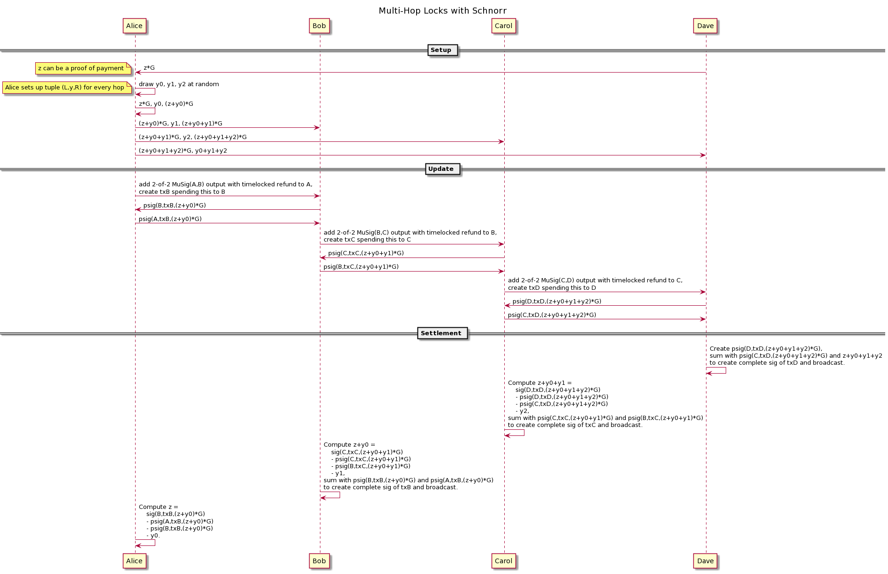

> *作者：Jonas Nick*
> 
> *来源：<https://github.com/BlockstreamResearch/scriptless-scripts/blob/master/md/multi-hop-locks.md>*


“多跳锁” 指的是让两方可以交换资金和支付证据、无需手动为多签名输出注资的协议。也就是说，这两方会通过两两具有共享的多签名输出的中间节点连接起来。当前，基于密码学哈希函数的多跳锁正在[闪电网络协议](https://github.com/lightningnetwork/lightning-rfc)中用于转发只是。

基于 “隐形脚本（scriptless script）” 的多跳锁是[在一篇 mimblewimble 邮件组的帖子](https://lists.launchpad.net/mimblewimble/msg00086.html)中出现的，然后在论文《[为区块链可扩展性和互操作性而实现的保护隐私的多跳锁](https://eprint.iacr.org/2018/472.pdf)》中得到了正式定义。通过使用隐形脚本，最终的交易体积更小、更接近于常规的交易，因此可以提高隐私性。更重要的是，它可以隐藏[支付之间的关联](https://medium.com/@rusty_lightning/decorrelation-of-lightning-payments-7b6579db96b0)，意思是，参与一个多跳锁的节点将无法确定自己是否在同一条路径上，也即无法知晓他们是否在转发同一笔交易（除非运行时序和资金数量分析）。支付关联攻击在整条转发路径的第一个和最后一个中间节点由同一人控制时会变得格外危险，因为他们将知道一笔支付的来源和目的地。此外，隐形脚本多跳锁还支持优化的支付证据以及 “原子化的多路径支付”（详见下文）。

## 记号

- `Pij` 是用户 `i` 和 `j` 的 MuSig2 聚合公钥。[MuSig2 论文](https://eprint.iacr.org/2020/1261)提供了更多细节。
- `T := t*G`，其中 `t` 是一个随机选出的数值，称作 “适配器秘密值”，而 `T` 称作 “适配器点”。
- `psig(i, m, T)` 表示来自签名人 `i` 对消息 `m` 的、使用适配器点 `T` 的碎片签名，该签名可以用来聚合成为一个 2-of-2 的 MuSig2 签名。出于简洁，另一个签名人没有表示在记号中；通常来说，另一个签名人是 `i` 与之有通道的节点，会随语境确定。之所以说这是一个 “碎片”，是因为它需要跟另一方的碎片签名加总，然后才能成为一个有效的 Schnorr 签名。此外，也有人会说它是 “预备” 的碎片签名，因为还需要加上适配器秘密值 `t`，才能成为一个常规的碎片签名。
- `sig(m, T) := psig(i, m, T) + psig(j, m, T) + t`，是最终来自用户 `i` 和 `j` 的完整 Schnorr 签名。

## 协议



在初始化阶段，支付的接收者先随机选出一个 `z`，并将 `z*G` 发送给支付的发送者。发送者将建立一套多跳锁，确保成功的支付会向她揭晓 `z`，并且仅向她揭晓。对 `z` 的知识可以成为一项支付证据，就像当前闪电网络中的 “支付原像” 类似（细节见下文）。

我们将支付流程描绘为从左边的发送者开始、经过中间节点、到达右边的接收者。

然后，发送者要按下述方式，为每一个节点 `i` 建立一个元组 `(Li, yi, Ri)`，该元组包括了 *左向锁* `Li` 和 *右向锁* `Ri`：

- 每一个 `yi` 都是一个均匀随机选出的标量（scalar）
- 发送者自己的左向锁 `L0` 被设置成了 `z*G`，是之前从接收者处收到的。
- 对于节点 `0 <= i < n` 的右向锁、以及节点 `j = i + 1` 的左向锁 `Lj`，发送者设为 `Ri <- Li + yi*G` 以及 `Lj <- Ri`（见上图）（译者注：意思是，上一个节点的右向锁即是下一个节点的左向锁）

注意，在闪电网络中，发送者不会直接把 `(Li,yi,Ri)` 发给中间节点：TA 会使用洋葱数据包，以携带这些数值，同时不让中间节点知道自己的身份。

在更新阶段，相邻的节点会在他们的链下交易中加入一个多签名输出，就像当今的闪电网络中在交易中添加一个 HTLC 输出一样。我们把这种新型的隐形脚本输出叫做 “点时间锁合约（PTLC）”。跟 HTLC 一样，PTLC 也有一个超时条件，让左边的节点可以在支付失败时回收自己的资金。但不同的是，PTLC 只是普通的 2-of-2 MuSig2 输出，而哈希锁是仅在收到一个碎片签名时隐式地加入输出中的（详见下文）。出于演示的目的，我们假设使用 [eltoo](https://blockstream.com/eltoo.pdf) 形式的通道，意味着双方有对称的状态，而且无需撤销。

如果支付没有超时，那么由相邻两个节点分享的隐形脚本 PTLC 输出中的资金会被右边的节点取走。因此，左边的节点 `i` 要创建一笔交易 `txj`，花费该 PTLC 并将资金发送到由右边的节点 `j` 控制的一个输出中。假设 MuSig2 签名协议所需的 nonce 值交换轮已在双方都更加方便的早些时候发生（例如，在建立一个连接的时候），从而这一轮通信不会发生再支付的关键过程中。

收到新 PTLC 的通知之后，右边的节点 `j` 会创建交易 `txj` 以及对 `txj` 的碎片签名 `psig(j,txj,Lj)`。左边的节点要验证这个碎片签名，然后给右边的节点发送自己对 `txj` 的碎片签名，在以下两种情形中：

- 左边的节点是发送者
- 左边的节点 `i` 收到了来自前序节点 `i-1` 对 `txi` 的签名 `psig(i-1,txi,T-yi*G)` 。结合刚刚收到的来自右边节点的碎片签名，就可以保管，只要右边的节点花费了资金，左边的节点可以开启左向锁、用 `txi` 取走资金，如上图所示。

因此，更新阶段从最左边的一对节点开始，一直持续到最右边的一堆节点。在收到来自左边的节点的碎片签名后，右边的节点可以在知晓其左向锁秘密值之后尽快补完那个签名。为了减少整体的通信轮次，启动节点和更新阶段可以合在一起（例如，使用闪电网络中的洋葱数据包）。

结算阶段则从接收者收到来自其左边的节点的碎片签名后开始。多跳锁是由发送者建立的，接收者可以将自己的秘密值 `z` 加到左边节点的碎片签名中，然后用自己的碎片签名再加总上面的结果。最终，TA 可以得到一个对右边节点（接收者）交易有效的签名。这时候，右边的节点可以可以广播交易、到链上结算了（如果左边的节点消失或尝试欺诈的话）。

在左边的节点知晓交易的签名之后，就可以通过减去之前从右边的节点收到的碎片签名以及自己的碎片签名、从而知晓右向锁秘密值：

```
sig(tx,T) - psig(i,tx,Ri) - psig(j,tx,Lj) = yj
```

或者，右边的节点可以直接将秘密值 `yj` 发送给左边的节点，然后请求更新承诺交易（基于 LN-penalty）或结算交易（基于 eltoo），从而移除 PTLC，然后左边的节点的输出就会减去支付数额，而右边节点的输出就会加上支付数额。如果左边的节点不跟着更新，右边的节点依然可以在 PTLC 超时之前广播自己的交易。

不论如何，只要接收者领取了支付，左边的节点就能知道右向锁秘密值，然后可通过减去 `yi` 计算出其左向锁秘密值、然后创建出对她自己的交易的最终 Schnorr 签名。每一个节点上都会发生这个过程，直至发送者，TA 将知晓用来完成支付的支付证据 `z`。

## 支付的证据（PoP）

基于 PTLC 的多跳锁与基于 HTLC 的多跳锁的区别在于，支付证据（`z`）只有发送者能够知道，而不是沿路每一个节点都能知道。因此，支付证据可以用来向接收者鉴别支付者的身份。不需要揭晓 PoP 本身，可以提供 `z*G` 的签名。因为支付间的关联被取消，中间节点无法将 PoP 与一笔关联起来。

显然，不止发送者能知道 `z`。接收者和发送者愿意与之分享 `z` 的任何人都可以知道，因此还是不清楚谁是真正的支付者。因此，来自接收者、发给发送者的一个签名陈述（闪电发票）应该包含 `z*G` 和发送者的公钥。然后，PoP 就既包括 `z` 的一个签名，也包括发送者私钥的签名，这是只能由发送者（或发送者选择合作的人）提供的。

理想情况下，如果一个静态的发票可以被多方支付，那就允许互助式支付，并且不需要跟接收者额外通信。但这跟支付证据是不相容的，因为 PoP 必须在每一笔支付发生时从即时的随机性中创建出来。不过，同一发送者的反复支付[可以使用哈希链条来实现](https://lists.linuxfoundation.org/pipermail/lightning-dev/2018-November/001496.html)。

## 原子化的多路径支付（AMP）

使用隐形脚本多跳锁，就有可能实现类似于 “[base MPP](https://github.com/lightningnetwork/lightning-rfc/pull/643)” 的多路径支付，同时，允许隐匿路径间的支付关联。发送者使用互无关联的锁来创建通向接收者的多条路径、使得接收者领取任何一部分支付都会向发送者揭晓支付证据（`z`）。因为接收者并不希望只领取一部分支付时就给出 PoP，她会等待所有路径都完全建立、然后一次性拿走所有的部分付款。

在最初的 “[base AMP 提议](https://lists.linuxfoundation.org/pipermail/lightning-dev/2018-February/000993.html)” 中，“原子性” 不是仅仅靠激励来实现的，还依靠于有意的路径规划、使得接收者的秘密值（`z`）仅会在所有路径都建立时才一次性揭晓。不过，在这一提议中，支付方无法获得支付证据。使用隐私脚本多跳锁，我们就技能获得原本的 base AMP 提议的原子性，又能获得支付证据。这被称作 “[high AMP](https://lists.linuxfoundation.org/pipermail/lightning-dev/2018-November/001494.html)”。

在 high AMP 中，发送者首先选出一个随机数 `q`，然后根据路径的数量 `n` 选出一些随机数 `q1,...,qn`、使得 `q = q1 + ... + qn`。发送者在每一条路径的接收者的支付点中都加入 `q*G`。这样依赖，接收者就无法领取任一部分支付，因为 TA 根本不知道 `q`。但是，在发送者规划的每一条路径 `i` 中，都向接收者发送了一个 `qi`。从而，当且仅当所有路径都成功建立，接收者可以计算出 `q` 并领取支付。

## 可取消的支付

在当前的闪电网络中，支付可能会被卡住很长一段时间，如果中间节点在转发支付时下线的话。支付者无法安全地重试（其它路径），因为（原路径的）中间节点可能又会在 PTLC 超时之前回到线上、让支付者重复支付。

案例场景：

1. Alice 给 Bob 发送一笔价值 10mBTC 的 PTLC，希望 Bob 转发给 Dave（Alice -> Bob -> Dave）。
2. Bob 收到这个 PTLC 之后并不转发任何东西给 Dave。
3. 等待少数几个区块之后，Alice 失去了耐心，尝试通过 Carol 来转发支付（Alice -> Carol -> Dave）。
4. 这一次支付成功了，Alice 正确地支付了 10mBTC 给 Dave，并且收到了支付证据。
5. 但是，Bob 在他的 PTLC 超时之前突然上线了，又转发了 10mBTC 给 Dave。
6. 对 Dave 来说，这是天上掉馅饼，所以 Dave 接受了，也回传了支付证据。
7. 最后，Alice 又收到了一次支付证据，但她已经支付了 20mBTC，而不是 10mBTC。

这是可以避免的，如果支付需要来自发送者的一个秘密值才能完成的话。这个解决方案最初用名 “[无滞支付](https://lists.linuxfoundation.org/pipermail/lightning-dev/2019-June/002029.html)”。

发送者的秘密值是 `y0 + y1 + y2`。在初始化阶段，Alice **不能**发给 Dave。Alice 把 `(z + y0 + y1 + y2) * G` 作为 Dave 的左向锁，也就是让 Dave 揭晓 `(y0 + y1 + y2) * G`。在更新阶段的末期，Dave 无法创建签名，因为他根本不知道 `y0 + y1 + y2`。Dave 可以向 Alice 请求 `y0 + y1 + y2`（并出示 `(y0 + y1 + y2) * G` 以证明自己已经收到了 PTLC）。当 Alice 收到这个请求时，她就知道，这个 PTLC 已经正确地传递给了 Dave。她可以安全地发送 `y0 + y1 + y2` 给 Dave，让 Dave 可以开启结算阶段。

注意，这不能防止支付在结算阶段空竹（如果有节点掉线的话）。但是，中间节点有大得多的激励在结算阶段保持在线：

- 在更新阶段，他们会收到来自左边的对等节点的比特币：他们还没有发送任何东西，所以唯一的激励是他们将收到的转发手续费
- 在结算阶段，他们已经发送了比特币给自己右边的对等节点：现在，他们有了激励回传支付证据，以收取入账支付

## 资源

- [MuSig2](https://eprint.iacr.org/2020/1261)
- [Lightning Network protocol](https://github.com/lightningnetwork/lightning-rfc)
- [Scripless Scripts in Lightning](https://lists.launchpad.net/mimblewimble/msg00086.html)
- [Privacy-preserving Multi-hop Locks for Blockchain Scalability and Interoperability](https://eprint.iacr.org/2018/472.pdf)
- [Payment Decorrelation](https://medium.com/@rusty_lightning/decorrelation-of-lightning-payments-7b6579db96b0)
- [eltoo](https://blockstream.com/eltoo.pdf)
- [Post-Schnorr Lightning Txs](https://lists.linuxfoundation.org/pipermail/lightning-dev/2018-February/001038.html)
- [Bolt11 in the world of Scriptless Scripts](https://lists.linuxfoundation.org/pipermail/lightning-dev/2018-November/001496.html)
- [Base AMP](https://lists.linuxfoundation.org/pipermail/lightning-dev/2018-November/001577.html)
- [Stuckless Payments](https://lists.linuxfoundation.org/pipermail/lightning-dev/2019-June/002029.html)

