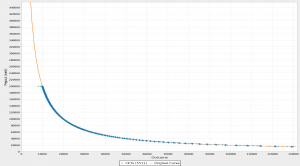
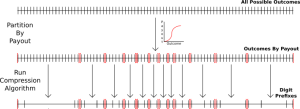

> *作者：Nadav Kohen*
> 
> *来源：<https://suredbits.com/multi-oracle-dlc-deep-dive/>*

几周以前，我们[宣布](https://suredbits.com/settlement-of-first-multi-oracle-dlc/)我们成功在链上执行了一个同时使用 Bitfinex、Pierre Rochard 和 Suredbits 三个断言机的谨慎日志合约（DLC）。在本文中，我们将深入讲解多断言机的 DLC 是如何实现的。

如果你还不熟悉 DLC 的想法和构造，我建议你读读我们[以前的博客系列](https://suredbits.com/discreet-log-contracts-part-2-how-they-work-adaptor-version/)，或者是[正在开发的 DLC 规范](https://github.com/discreetlogcontracts/dlcspecs)。

在我们讨论[波动性 DLC 的博客](https://suredbits.com/settlement-of-volatility-dlc/)里面，我们提到，一种压缩算法可以只需使用少量的 “合约执行交易（CET）”，就覆盖整条支付曲线。在此之上，如我们在[最新一篇关于 DLCFD 的博客](https://suredbits.com/settlement-of-dlcfd/)（[中文译本](https://www.btcstudy.org/2022/08/07/settlement-of-dlcfd/)）所说，我们可以使用一些舍入限制（minimal rounding）来进一步优化。

DLC 的功能依赖于为所有可能的结果创建支付交易和适配器签名，但当可能的结果非常非常多的时候（比如，当 3 个断言机要见证 20 万种可能的结果时，那就会产生接近 10 亿种可能性），压缩因此成为至关重要的事。在这个语境下，压缩指的是使用数字前缀（digit prefixes）将许多相邻的结果压缩成一个结果，从而为所有的可能性分组。举个例子，如果一个结果要用 5 个二进制数字来表达，那么，“010”的数字前缀就可以指代所有落在 8（01000） 和 11（01011） 之间的结果。这种压缩方法可以用在任何具有相同支付后果的可能结果的连续区间上。

下图就是这种压缩方法的结果的可视化，橙色曲线表示原本的支付结构，每一种可能的结果都需要一个适配器签名；而蓝色的每一个点都表示在舍入限制和压缩之后需要的一个适配器签名。

为了更好地理解我们如何在断言机之间限制差异，我们以一个 DLC 为例，了解一下它是如何建立的。Ben 和我先对合约的条款达成一致，例如担保品、支付曲线、超时时间、断言机服务，以及断言机之间可以有多大的不一致。支付曲线将 0 美元到 262143 美元（即以 18 比特来表示的结果）之间的每一种可能的结果映射成我们每一方可以得到的聪；而我们要压缩这条曲线。为此，Ben 和我需要对舍入的数量达成一致（在所有地方精确到 100 聪，而在超过 75000 美元的结果中精确到 1000 聪），然后将所有可能结果的整个集合，根据所产生的支付结果（以红色显示）划分成多个区间，然后对这些区间运行[压缩算法](https://github.com/discreetlogcontracts/dlcspecs/blob/898e81a23c30ac4bc66209b20697e76e4a1da7bd/CETCompression.md)，产生一系列的数字前缀（因为压缩是通过无视后面几位数字来实现的）以及它们的支付结果。

到目前为之，这个流程跟常规的、使用数字结果、使用单个断言机的 DLC 没有什么区别。也就是说，这些数字前缀以及它们的支付结果，代表了压缩后的所有可能结果，会直接用来创建 [CET 的适配器签名](https://suredbits.com/discreet-log-contracts-part-2-how-they-work-adaptor-version/)。为了让这组结果支持多的断言机，我们要使用这个 “主要” 数字前缀并构造一组 “次级” 数字前缀，以表示一致意见。

具体来说，Ben 和我要设定两个参数，“minSupport” 和 “maxError”。在上周的 DLC 中，我们将它们分别设置成 128 和 512。minSupprot 参数保证了，如果我们的 3 个断言机中的 2 个给出的价格差异在 128 美元以内，那么这表示达成一致，导致 DLC 执行。而 max Error 参数保证了，如果 2 个断言机给出的价格差异超过了 512 美元，那么这不能表示达成一致，这两个断言机的签名不能结算 DLC 。如果两个断言机给出的价格差异超过 128 美元，但在 512 美元以内，我们的 DLC 可能会执行，也可能不执行（详见下文）。

使用者两个参数，Ben 和我还为断言机的优先级排了个名（1：Pierre Rochard；2：Bitfinex；3：Suredbits）；我们是通过抛硬币来决定的，但用户应该将自己最信任的断言机排在最前面。现在，如果 Pierre Rochard 见证了一个价格，并且跟 Bitfinex 或者 Suredbits 所见证的价格差异在 minSupport（128 元以内），那就按 Pierre Rochard 的报价结算。也就是说，在可以结算 DLC 的任意断言机组合中，只有最受欢迎的断言机的结果会被用来决定支付结果。如果 Pierre Rochard 跟其他两个断言机的价格差异很大，但另外两者的价格差异在 minSuppor 以内，就会使用 Bitfinex 的报价来结算 DLC。在最糟糕的情况中，三个断言机都无法达成一致意见，那么 Ben 和我就不得不执行 DLC 的退款操作。

在每一种可以结算 DLC 的断言机组合（Pierre Rochard, Bitfinex）、（Pierre Rochard, Suredbits）、（Bitfinex, Suredbits） 中，我们使用压缩算法计算出来的数字前缀来表示 主要的/更受欢迎的 断言机的结果；并为（在我们的参数下达成一致意见的）次级的断言机构造一组数字前缀。这是通过选取每一个主要数字前缀的区间（即该数字前缀所覆盖的结果集合）、确定 [起点, 终点]，然后构造一组数字前缀，其区间覆盖至少 [起点 - minSupprot, 终点 + minSupprot] 中的所有结果和 （终点 - maxError, 起点 + maxError）的几乎所有结果，来实现的，如下图所示：

事实证明，为了覆盖这样的区间，最多只需要两个比特的前缀就够了，所以，要么只有一位的次级数字前缀表示跟主要断言机达成一致，要么是两位的数字前缀表示一致。而且，minSupprot 和 maxError 之间的差越大，只需一位次级数字前缀的概率就越大。

因此，需要适配器签名的 DLC 结果的总数，会有一个上限，等于：在单断言机情形下所需的（压缩后）结果的数量，乘以 3（可能结算 DLC 的断言机组合的数量），乘以小于等于 2 的某个数字（在达成一致的情形中需要 1 个或者 2 个适配器签名）。总的来说，在我跟 Ben 的 DLC 中，每一笔 CET 都需要 14826 个适配器签名，总体积是 5 MB（每一笔 CET）。

这种让次级断言机对来自一个主要断言机的结果表示一致的算法可能看起来有些奇观，因为它为断言机之间小于 minSupprot 和大于 maxError 的差异提供了完美的保证，但对两者之间的差异，都每一严格的保证。显然，如果有更严格的约束会更好（比如，让 minSupprot 等于 maxError），但事实证明，需要断言机签名的结果的数量，以及合约边界的严密性之间有根本的矛盾。

我开发出来的表示一致一件的算法，对任何给定的主要断言机结果，最多只要求 2 个适配器签名，但反过来它要求 maxEoor 至少是 minSupprot 的 2 倍（基本上，maxError  除以 minSupprot 的商越大，需要的适配器签名越少）。我的算法有一个变种，允许任何严格的约束，但它通常需要许多次级数字前缀（以及相应的适配器签名），有时候甚至需要 20 个适配器签名，按照 1~2 个适配器签名形成 5 MB 文件的比例换算，很容易变成 100 MB 的文件（而计算和验证的时间的倍增还要大得多）。而且，这样的算法在超过 2 个断言机时会呈指数级恶化，所以目前我们决定为了适配器签名的数量而优化、只使用更松散的合约边界。

多断言机方案值得一提的最后一个特性是：所有事情都是都客户端处私密完成的！这三个断言机跟我们使用单断言机的 DLC 时所用的美元任何区别。实际上，要不是我们写出了这篇博客，他们根本不会知道自己的见证消息是如何跟其他断言机的消息结合的。如前所述，断言机的所有操作，就是公开承诺并见证事件的结果，他们不需要对用户的知识，甚至不需要知道用户存在。

就是这样，形成任意支付曲线的任意数字结果，都可以用多个断言机的门限机制来保护，而且这些断言机都不会知道用户的存在。

（完）