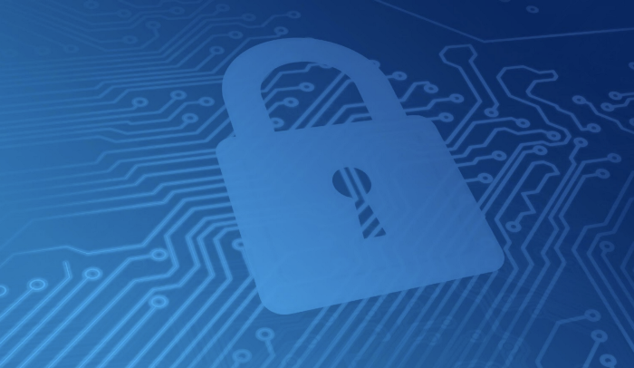

> *作者：Mike Belshe*
>
> *来源：<https://blog.bitgo.com/multi-sig-vs-mpc-which-is-more-secure-699ecefc8430>*
>
> *原文首次出版于 2019 年 9 月。*

作为 BitGo，我们呼吁用户使用多签钱包已经长达 6 年以上， 因为多签钱包具有极高的安全性和强认证特性。与此同时，我们也在评估新型密码学技术。最近几个月，一种叫作[多方计算（MPC, multi-party computation）](https://en.wikipedia.org/wiki/Secure_multi-party_computation)的新技术频繁被提及。MPC 可以很好地代替 [Shamir 秘密共享方案](https://en.wikipedia.org/wiki/Shamir's_Secret_Sharing)（SSS）。一些钱包提供商也表示 MPC 可能比多签技术更安全易用。在本文中，我们将介绍 MPC 的运作原理及其与多签钱包在安全性上的差异。我们认为 MPC 在与多签技术配合使用时的确可以发挥效用，但是目前用它来替代多签技术并非明智之举。

## MPC 的由来

MPC 是一种相对新颖的密码学技术，可将多个私钥拆分成多个部分。人们常常会将 MPC 与 20 世纪 70 年代诞生的 Shamir 秘密共享方案进行比较。后者被用来将单个私钥拆分成多个部分。这两个技术的核心思想是将一个密钥对中的私钥拆分成 N 个部分，分别维护，只要集齐其中 M 个部分就可以使用对应的私钥创建签名。这类技术又被称为 M/N，即，利用 N 中的 M 个部分保护底层数据。

和多签技术一样，SSS 和 MPC 也有助于减轻以下两个关键风险：

1. 盗窃：只要攻击者偷走或控制的私钥部分不超过 M，就不可能生成有效的签名。 
2. 丢失：在大多数情况下（M ＜ N），即使某一部分意外丢失，也可以通过备用部分找回。

MPC 相比 SSS 有一大突出优势。根据 SSS 方案，一个私钥的各个部分必须先在同一个机器上进行重组，才能用来生成签名。这就意味着，用来重组私钥的机器存在单点故障风险。相比之下，MPC 不要求在同一个机器上重组私钥。相反，每个部分只需在不同机器上使用同一个数学函数计算即可，而且只有当 M 个部分经由此数学函数计算后，生成的签名才有效。这样可以确保每个部分完全独立，避免单点故障问题。

SSS 和 MPC 都具备一个有趣的优点：无需在区块链协议层面支持它们。对于像门罗这样不提供原生多签功能的区块链，这一点很重要，因为 MPC 签名可以在外部应用。

## 与多签对比

从功能的角度来看，多签钱包需要使用 N 个私钥中的 M 个，基于 MPC 的钱包需要使用一个私钥的 N 个部分中的 M 个，二者非常相似。区别在于，多签钱包使用由不同私钥生成的不同签名来保护安全性，而基于 MPC 的钱包只需使用一个私钥创建一个签名，无论这个私钥被拆分成了多少个部分。

## 签名可问责性

不同于多签钱包，基于 MPC 的钱包引入了一个严重问题：可问责性。就多签钱包而言，每笔交易由哪些私钥签署都是可知的。明白这一点很重要，因为每个私钥通常会被分配给特定的人，知道哪些人签署了交易至关重要。但是，在使用 MPC 的签名场景中，我们根本无法分辨每笔交易是由私钥的哪些部分签署的。一旦 MPC 完成，所有签名看起来别无二致。

可问责性听起来可能不像是多么严重的问题，但它对货币系统的影响很大，尤其考虑到私钥的不同部分通常由不同类型的人通过不同方式保管：

- 保管人

密钥材料可能会由不同类型的人保管。如果密钥材料由公司高管（CEO、CFO、CSO 等）保管，且其中两位高管串谋作案，调查人员如何知道是哪两位高管实施了犯罪？在被问及是谁签署了交易时，无辜的高管如何自证清白？

-  存放地

密钥材料可能会被存放在不同的地点。如果签署交易需要用到存放在 5 个地点的私钥中的 3 个，取证的关键之一就是知道哪些地点的私钥参与了交易。

- 多机构安全性

密钥材料可能存放在不同公司。现在，一种常见做法是将备份密钥交由不同公司的独立人员保管。由于备份密钥可识别，使用多签方案时，代币所有者无需担心其代币会被备份密钥持有者窃取。但是，如果使用的是 MPC，缺少了可问责性，没人会愿意持有备份密钥，因为一旦出现欺诈交易，无法归责到具体的备份持有者。

## 同行评审

如今，很多 MPC 实现者都在使用自创的实现和方法，却很少经过公开评审。正如 [Schneier on Security](https://www.schneier.com/blog/archives/2011/04/schneiers_law.html) 所言， “*无论是谁，上至最优秀的密码学家，下至最无知的门外汉，都有可能创建出自己无法破解的算法。*”遗憾的是，很多密码学算法从未在数学上被证明过有效。然而，密码学家都非常依赖同行评审，而且需要经过足够长的评审期（以年乃至十年为单位计算）才能判定算法是否安全可信。由于 ECDSA MPC 太过新颖，提供商不愿意分享他们的算法、源代码和实现细节。就现有实现而言，实现者已经提交了很多专利申请，可能会进一步限制这些工具的使用。由于缺乏透明性，再加上提供商从中阻挠，外人无法验证这些算法的正确性和安全性，也无法预估授权费用。

相比之下，多签技术已经经过了时间的考验，它使用的是众所周知的、经过验证审查并且有多种实现的算法。基于多签的钱包不会引入额外的密码学风险，它们使用的都是经过严格审查而且久经实践的简单密码学算法。

## 缺少 HSM（硬件安全模块）支持

基于 MPC 的签名方案还有一个问题是缺少支持该技术的 HSM（硬件安全模块）。虽然金融机构使用 HSM 保护私钥材料已有数十年的历史，但是现有的 HSM 并不支持崭新的 MPC 密码学技术。安全专家早就意识到，密钥材料必须只能通过 HSM 存储和访问，才能提供基本的安全保障，MPC 也不例外。无论是密钥材料还是密钥部分都必须以安全的方式存储。如果 MPC 实现者没有为其技术打造专门的 HSM，他们的 MPC 方案可能还不如单一密钥系统安全。

## 对冷存储和 HSM 需求的影响

一些 MPC 支持者认为使用了 MPC 就可以不再需要“冷存储”，其实不然。

“冷存储”指 *离线* 存储私钥材料的钱包。相对地，“热存储”指 *在线* 存储私钥材料的钱包。无论私钥数量是 1 个还是 3 个，无论是否使用了 MPC，用户都需要采取措施保护其私钥材料。

事实上，黑客从未停止过攻击活动。Facebook 被黑过，Google 被黑过，美国政府也屡次惨遭毒手。如果 MPC 私钥部分被存储在网络上，它们很有可能像其它在线存储数据那样遭到黑客攻击或被盗。

## 总结

总之，目前安全系数最高的数字钱包还是多签钱包。MPC 可以用来将一个或多个私钥拆分成多个部分，以强化现有的多签方案。假设有 3 名用户负责保护一个 2/3 多签钱包，他们可以使用 MPC 将各自保管的私钥拆分成多个部分，并将这些部分存储在独立设备上。但是，只依赖 MPC 技术而不使用多签方案不仅会削弱安全性，还会失去交易时间可问责性。

（完）