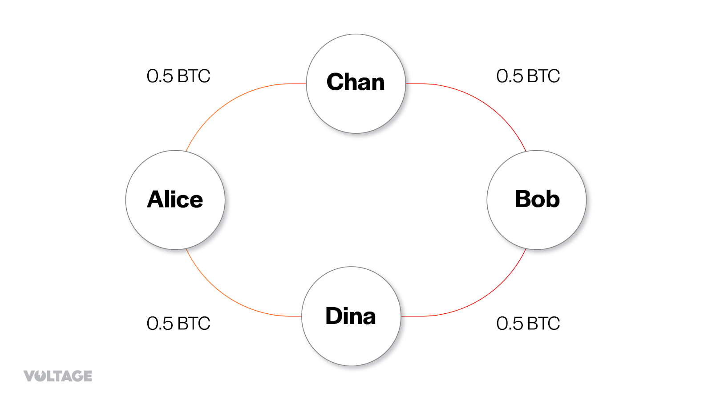
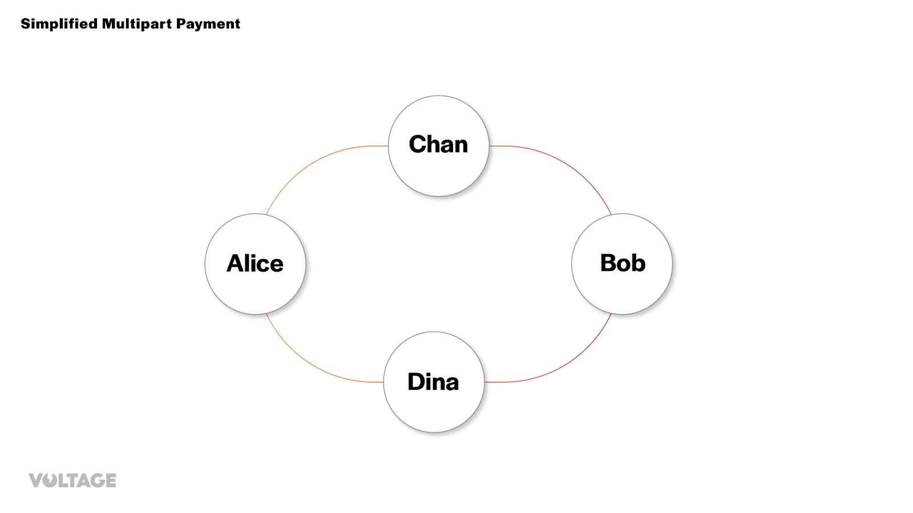
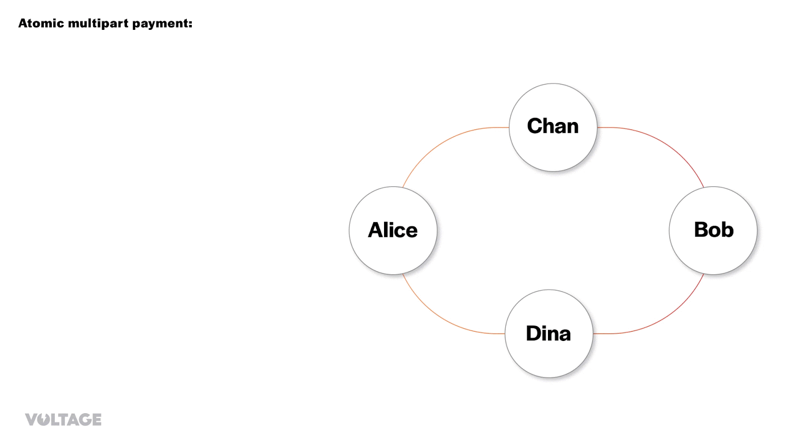

> *作者：Voltage*
> 
> *来源：<https://voltage.cloud/blog/lightning-network-faq/multipart-payments-on-lightning-network-break-down-amp-and-mmp/>*

在本文中，我们会讲解闪电网络中的 “多路径支付（multipart payments）”，这种关键性的提升克服了单路径支付的局限性，允许更大数额的支付通过分割成较小的多个部分来送达。我们探究了多路径支付的复杂之处、它对网络去中心化和隐私性的好处，以及当前可用的不同实现 —— 每一种都有自身的取舍。

## 单路径支付

我们先玩一个思维实验，以更好地理解多路径支付的目的。

假设 Alice 想通过闪电网络给 Bob 支付 1 BTC。Alice 有两条支付通道，一条是跟 Chan 开通的，另一条是跟 Dina 开通的。Chan 和 Dina 也各自跟 Bob 有一条通道 —— 所以她们都各自跟 Alice 和 Bob 各有一条通道。为了简化，我们假设每一条通道的容量都是 0.5 BTC。所以网络的拓扑图看起来是这样的：

当 Bob 发送 1 BTC 的发票给 Alice 的时候，Alice 的节点会搜索可用的支付路径。如果单路径支付是唯一选择，那么，因为 Alice 要发送 1 BTC ，这样的路径上的每一条通道的容量都必须大于 1 BTC。这也意味着，可以在网络中支付的最高数额会受到最大的通道的容量的限制。

但是，如果 Alice 可以将一笔支付分成几个部分呢？她这就不必在一条路径中给 Bob 发送 1 BTC，而可以将这笔支付分成两部分：一部分，通过她跟 Chan 的通道，支付 0.5 BTC；另一部分，通过她跟 Dina 的通道，支付 0.5 BTC。以前，最高的支付额度将受到容量最大的通道的限制。而现在，可以用到的所有通道的余额之和才会限制支付的最高数额。这就是多路径支付的本质：将一笔支付打散成数额较小的部分。

（译者注：一个用户在闪电网络中的最高支付额度受到各种各样条件的限制，给定一个用户作为发送者，TA 面对任意一个接收者，其支付额度都是不同的，这是由闪电网络的结构决定的。在绝大部分情况下，远远未企及网络中最大通道的容量之前，一个用户对另一个用户的支付就已经会撞上这样的限制而无法成功。严格来说，给定一条从发送者到接收者的路径，该路径可传递的最高支付额度是由支付发起时该路径的该方向上余额最小的节点决定的；因此，多路径支付确实提高了用户的支付额度，因为可以利用多条路径，但原文这里使用 “容量” 的概念来论证是过于粗糙的。容量是两方余额之和，因此不一定都可以被一方所用。）

注意，“multipart payments” 也常常被称为 “multipath（多路径）” 支付，但这是不准确的，因为所有的部分可以通过相同的路径，因此在这篇文章中我们统一使用 “multipart” 而不是 “multipath”。

（译者注：本译本在此没有遵从作者的想法，因为我认为 “multipath”  依然是更加根本的一点 —— 被打散的多个部分可能使用相同的某一段路径，但一定会在某一段使用不同的路径。）

## 网络得益

如我们在讨论[隐私的文章](https://voltage.cloud/blog/lightning-network-faq/lightning-network-privacy-explainer/)中说的 ……

（译者注：原文此处的推理不能成立，故不译。多路径支付主要能抵御的是一种被称为 “通道打探” 的隐私攻击 —— 通过控制多个节点、来回发送不同数额的支付来发现不同通道的余额变化，进而推测它们路由了某一笔支付，也即发现支付所采取的路径及接收者。当支付采取了多条路径，自然就更难被打探出全貌了。）

多路径支付的另一个好处是，它可以帮助网络变得更加去中心化。支付可以分散成较小的部分，通过更少容量的节点来路由，因此可以让这些节点变得更加活跃，而不必那么依赖于有足够容量的大节点。

最后，如前所述，多路径支付也让网络可以处理更加大额的支付，因为总额可以分割成较小的部分，因此不受单一通道容量的限制。

## 多路径支付的实现

如前所述，一笔多路径支付要分割成较小的部分。因为支付要通过闪电网络来路由，这种分割方法也必须兼容整个协议。在闪电网络上，实现多路径支付有多种方法。我们逐个了解它们的特性和取舍。

### 简化的多路径支付（SMP）

顾名思义，这是最简单的多路径支付实现，对协议的变更已经降到了最低。我们回到最初那个例子，Alice 需要给 Bob 支付 1 BTC，来看看 SMP 如何用来分割支付。

在启动支付的时候，Bob 先给 Alice 发送一张常规的 BOLT11 发票，请求 1 BTC。这个发票包含了必要的细节，比如 Bob 为这次支付安排的支付秘密值（原像）的哈希值，以及完整的支付数额，还有 BOLT11 所要求的必有信息以及可选信息。

有了 Bob 的发票，Alice 节点开始选择路径，并考虑分割支付以提升送达的效率。节点选择了两条路径：

- Alice → Chan → Bob
- Alice → Dina → Bob

然后，它开始创建 HTLC 和洋葱数据包，以通过这两条路径转发支付：在 “转发数额” 字段里填入 “0.5 BTC”，但在 “支付总数额” 里填入 “1 BTC”，从而通知路径上的所有节点：这是一笔分割成多个部分的支付。最后，Alice 通过各路径发送相关的洋葱数据包，就跟普通的单路径支付一样。

按照预期，Bob 会先后收到两笔 HTLC，而且 SMP 会跟单路径支付有很大的不同。当接收者从单路径支付中收到一个 HTLC 时，它会立即返回原像，从而为发送者提供支付证明。而在 SMP 中，Bob 需要等待所有的 HTLC 到达，然后才会发回支付原像。如果他收到第一个 HTLC 就立即返回原像，就失去了自己可以领取所有 HTLC 的价值的保证，因为支付秘密值已经公开，而且这个信息可以被任何人用于从自己得到的 HTLC 中领取资金。

虽然每一个 HTLC 都是原子化的，但是 SMP 不是原子化的，因为协议无法保证接收者仅在收到所有的 HTLC 之后才揭晓秘密值。唯一的保证是接收者自己的经济激励 —— 他要等到所有的 HTLC 到达，才能够得到所有的支付数额。

从这个 GIF 可以看出，Bob 在收到所有的 HTLC 之后才会返回支付秘密值（也即 Alice 需要的支付证据）。此外，要注意，在使用多路径支付时，Alice 可以收到支付证据，而且所有的 HTLC 都绑定到相同的支付秘密值。在所有的 HTLC 中使用相同的支付秘密值，也意味着支付应该是可以跟踪的，但恶意节点必须出现在所有路径中，才能将所有的部分关联起来。

### 原子化多路径支付（AMP）

原子化多路径支付是第一种多路径支付提议。它跟 SMP 不同，因为 —— 顾名思义，其支付是原子化的。这意味着，所有部分要么全都成功，要么全都失败。不像 SMP，在 AMP 中，接收者无法只领取一部分支付。

这个方案让路由不同部分的 HTLC 绑定不同的支付秘密值，从而让支付不可关联。另一个好处是，它只需发送者和接收者开启了 AMP 就可以准确地工作。但其缺点是，AMP 让支付者无法获得支付证据，因为发送者从一开始就知道所有的支付秘密值。

如果 Alice 希望用 AMP 给 Bob 支付，她要基于公开的 Bob 节点的信息，创建一个支付秘密值。然后，Alice 需要为每一部分支付创建一个秘密值碎片，并用在 HTLC 中。路由不同部分的 HTLC 会转发给 Bob。当 Bob 收到所有的 HTLC 时，他就能计算出不同部分的 HTLC 所需的秘密值，然后领取支付。

（译者注：在传递给 Bob 的洋葱数据包中提供了计算每一个 HTLC 的秘密值的必要数据；同时，这些支付秘密值是相互依赖的，也即只有收到了全部的 HTLC，才能分别为每一个 HTLC 计算出秘密值。）

（译者注：实际上，AMP 可以被理解成一种更加精致的 Keysend 方案：只需知道接收者的节点公钥就可以发送支付的方案，但同时也意味着无法获得支付证据，因为支付秘密值并不是由接收者生成的。）

### 使用 PTLC 的多路径支付（HIGH AMP）

如上所述，SMP 和 AMP 各有优缺点。SMP 可以收到支付证据，但支付路径的所有跳都使用相同的支付哈希值，这意味着这些支付是可以关联起来的，而且这个协议不保证原子性。而另一方面，AMP 则保证了原子性，并通过为不同部分的 HTLC 使用不同的支付哈希值，打破了不同部分支付的可关联性，但支付者就无法收到支付证据，因为支付秘密值是 TA 自己生成的。

还有第三种多路径支付，叫做 “高级原子化多路径支付（High AMP）”，它结合了上述两种方法，既支持原子性，又能得到支付证据，同时解决了支付可关联性的问题。不过，High AMP 需要在闪电网络中实现 [PTLC](https://voltage.cloud/blog/lightning-network-faq/point-time-locked-contracts/)（点时间锁合约）。

使用 High AMP 时，发送者选择一个基础私钥，并为每一条路径生成一个私钥、使得所有私钥的和等于基础私钥。然后，发送者在每一条路径中给接收者的支付点加上基础公钥。接收者在得到任何一部分支付时，都无法领取，因为 TA 不知道基础私钥。只有在所有部分都送达时，接收者才能用收到的数值计算出基础私钥，然后领取支付。

## 多路径支付与支付的可靠性

想让闪电网络成功，支付必须既便宜，又可靠。现在，提出和测试利用多路径支付来实现更高可靠性的不同支付手段和算法，是一个活跃的研究领域。

举例来说，[Rene Pickhardt](https://twitter.com/renepickhardt) 的[论文](https://arxiv.org/abs/2107.05322)《闪电网络上的最可靠及便宜的支付流》，提出了一种新方法，基于支付通道中的未知余额分布来分析多路径支付的成功概率。这个方法叫做 “最低成本流”，会使用从过往的成功和不成功支付尝试中得到的信息来更新路径的选择。

（完）