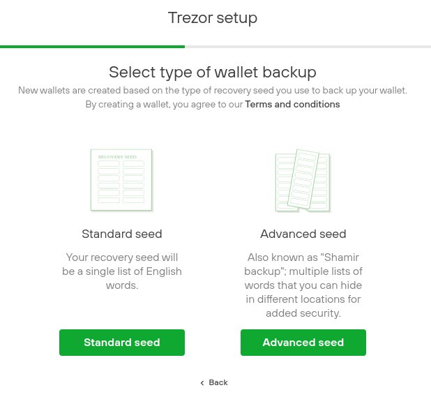

> *作者：SatoshiLabs*
> 
> *来源：<https://blog.trezor.io/multisig-and-split-backups-two-ways-to-make-your-bitcoin-more-secure-7174ba78ce45>*



随着比特币价格回暖，高水准的安全保管也变得愈发重要。多签地址和拆分备份（例如，Shamir 的密钥分割方案）是两种有效的安全存储方式，可用来长期保管密码学货币。

使用[助记词](https://wiki.trezor.io/Recovery_seed)是最简单的离线钱包备份方法。只要你保管好自己的助记词，就能随时找回自己的密码学货币。然而，一旦你的助记词因故缺失或丢失，你恐怕只能跟你的钱包永别了。

多签系统和密钥共享系统都属于自动防故障措施。因此，**即使你丢失了一把密钥或一个密钥份额（取决于你采用的是哪种系统），你依然掌控着自己的钱**。这两种系统各有千秋，适合不同类型的用户。

一般而言，个人用户会觉得使用拆分备份更方便，企业用户可能更适合由多位股东使用硬件钱包来参与的多签系统。

## 更适合个人用户的备份方式：安全拆分助记词

如果你个人或你的企业投资了密码学货币，请务必做好安全备份。多数人都知道应该将助记词藏在其他人无法触及之处，但是仅仅将助记词保存在银行金库或隐藏在一堆文件里是远远不够的。

这两种保管方式都很常见，但是都存在一定的风险。如果你采用第一种方式，银行内部人员可能会侵入你的金库或者把你的密码学货币上交国家；如果你采用第二种方式，你的助记词可能会遭到破坏、丢失或被盗，甚至是在你毫不知情的情况下。除了上述风险之外，Shamir 还可以防范更多风险。

[链接：Shamir 备份 —— 我们最新的安全标准](https://trezor.io/shamir/)

安全性不只是保护你的贵重物品不落到别人手里，还要**确保你永远都能取用自己的资产**。使用了 Shamir 备份后，你就可以高枕无忧了。哪怕银行内部人员偷看了你的助记词或者你用来记录助记词的文件被扔了，你也能找回自己的密码学货币。

## Shamir 备份的原理

当你首次设置你的 Trezor Model T 时，Trezor Suite 的引导流程会问你想要创建标准助记词（由 12/24 个单词组成的单词表）还是高级助记词（由 20 个单词组成的单词表，可以创建多个份额）。高级助记词背后的 [Shamir 备份](https://github.com/satoshilabs/slips/blob/master/slip-0039.md)是 SatoshiLabs 在 2017 年创建的公开标准，使用了著名密码学家 Adi Shamir 提出的密码学方法来安全地创建份额并因此得名。

- 在 Trezor Suite beta 版生成新的助记词 -

使用 Shamir 备份后，只要合并一定数量的份额即可找回钱包。你在创建份额时可以选择需要创建的份额总量以及找回钱包所需的份额数量。例如，一个钱包总共备份了 5 个份额，你只需要提供 3 个份额即可找回该钱包。

[Trezor](https://shop.trezor.io/product/trezor-model-t?utm_source=blog&utm_medium=link&utm_campaign=multi-sig_multi-seed) 最高可创建 16 个份额，而且支持用户自定义找回钱包最少需要的份额数量（从 1 至 16 均可）。因此，Trezor 是一种通用私钥保管方案，可满足企业和个人之需。

如果你**创建了 3 个份额并将找回钱包所需的最少份额数量设置为 2**，就等于不费吹灰之力给你的助记词续了一条命。但是，比起 Shamir 备份的强大潜能，这些就是小意思了。

Shamir 备份的推荐设置是 **3/5**，即，创建 5 个份额并将找回钱包所需的最少份额数量设置为 3。这样一来，即使发生了两个保存在安全隐蔽处的份额遭到破坏这样的小概率事件，你的私钥也还是安全的。只要将份额分别保存在不同的安全地点，你就可以防止其他人获得找回钱包所需的最少份额。

> **请勿将普通助记词拆分成几部分，这样会让你的助记词处于更危险的境地（任意份额一经丢失，你的助记词就不完整了）。Shamir 备份则不同。即使出现份额丢失的情况，只要没达到找回钱包的最低阈值，都不会影响 Shamir 备份的安全性。**

## 如何利用多签来保护你的密码学货币

在传统企业环境中，如何保管比特币私钥是一项艰巨的任务。为了高效管理股东对机构资金的访问，许多企业开始使用 Trezor 硬件钱包来实现多签。众所周知，多签和 Shamir 有一些相似之处，因为它同样需要**不低于某个阈值的私钥**来签署并广播交易。

多签钱包是使用多个现成的密钥（这些密钥可使用 Shamir 备份生成）创建的。只要将这些密钥的签名通过密码学方式结合起来即可生成一个由这些密钥共同控制的钱包。这个钱包的交易需要一定数量的签名才能签署。

如果你想知道如何自己创建多签钱包，请参阅 Saleem Rashid 关于如何使用带有 [Electrum](https://electrum.org/#home) 的 Trezor 钱包的指南：https://saleemrashid.com/2018/01/27/hardware-wallet-electrum-multisig/。

## 多签让企业更容易持有比特币

公司结构天然不适合将密码学货币储备的访问权限交由个人控制，这种做法是不切实际且极不安全的。因此，密码学货币应交由多个人共同管理并通过多签机制保障其安全性，而且每个交易都需要至少一名联合签署人在场，从而规避资金管理者恶意窃取公司资金的风险。

多签的优点其实很容易理解，我们以一个由 CEO、CFO 和银行组成的典型公司结构为例。公司资金托管在银行里，CEO 和 CFO 都需要取用资金的权限。过去，这是一个关乎信任和验证的问题。有了比特币之后，这就只是验证问题了。

CEO 和 CFO 可以各自持有一个包含多签账户密钥的**硬件钱包**。只有当双方都出具特定账户的密钥时，才能解锁并转移账户内的资金。但是，如果一方丢失密钥，就会导致问题。因此，为了防止密钥丢失或无法获取的情况，这里还需要引入由法人实体或公司董事会成员持有的**第三个密钥**来**增强系统的冗余性**。

上述多签机制还可以根据需要进行扩展，增加更多密钥，甚至备份重复的钱包。这样就可以轻松将资金分散到各个部门。有了多签机制，比特币可以迅速帮助各类组织提升支付效率。

## 联合托管

有一些方法可以解决部分关于如何管理密码学货币投资的问题。例如，将多签账户的密钥之一交由可信服务提供商保管，以便在内部密钥持有者失联的情况下提供签名。由于仅持有一个密钥，外部密钥持有者无法动用资金，必须获得公司内部密钥持有者的签名才行。因此，在这种情况下，资金始终是安全的。

[Unchained Capital 在最近发布的案例分析中](https://unchained-capital.com/blog/the-bitcoin-standard-of-custody/)提到了他们的客户 BlockYard Digital Assets Fund 作为案例来阐述联合托管的优点。这种方法不仅提供了易于访问的备份，还引入了可信的副属签名方，在实现便捷高效转账的同时让 BlockYard 保有对资金的完整控制权。

## 两种轻松提高安全性的有效方法

多签和 Shamir 备份互不排斥。无论是采用多签还是其它方式，所有密钥都应该通过**避免单点故障**的方式进行安全备份，这时 Shamir 就可以派上用场。使用 Shamir 备份设置 3/5 的钱包找回阈值，即可免去资金托管的后顾之忧。 

对于个人来说，多签可能很有吸引力，但是在很多情况下过犹不及。管理多个设备不仅会带来很高的成本，而且提高了出错的概率。设备的设置、备份和维护会变得越来越复杂，进而危及安全性。Shamir 备份提供了一种同样安全但是简单得多的方法来保护资金，无需维护多个硬件钱包。

对于企业来说，多签是一种安全便捷的比特币托管方式，可以让不同的利益相关者共同使用同一笔比特币。有了 Shamir 备份助记词，任何企业都可以根据自己的安全策略来灵活调整持币策略，更便于企业长期投资比特币。无论你是组织还是个人，都可使用 Trezor 硬件钱包进行备份，只需几分钟时间即可确保资产无虞。

（完）