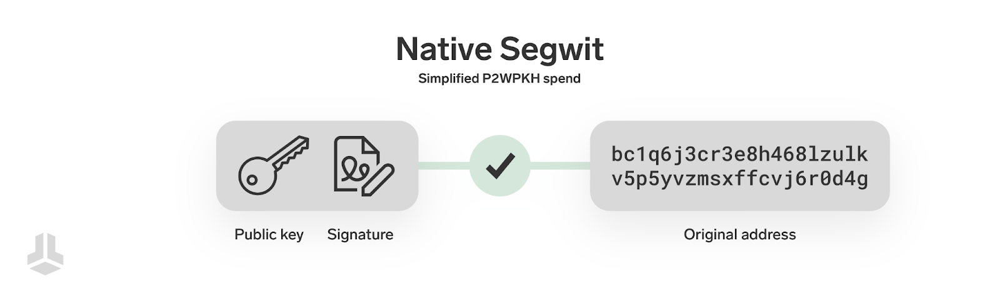
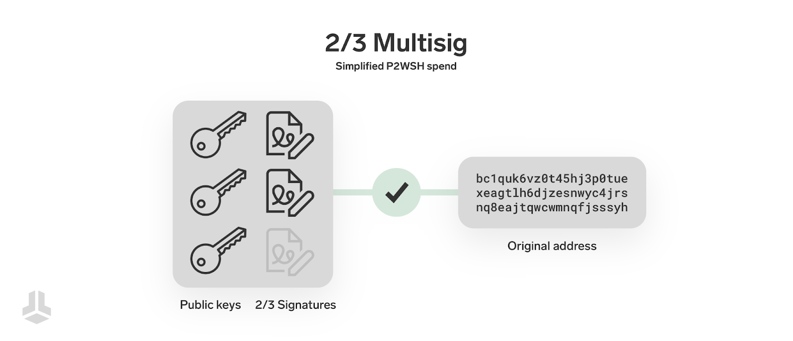
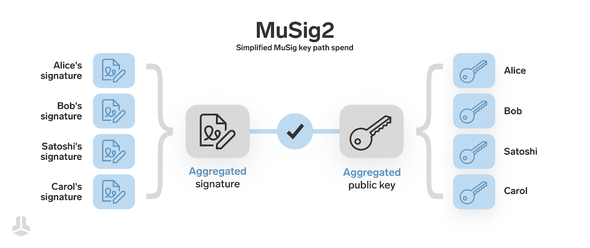
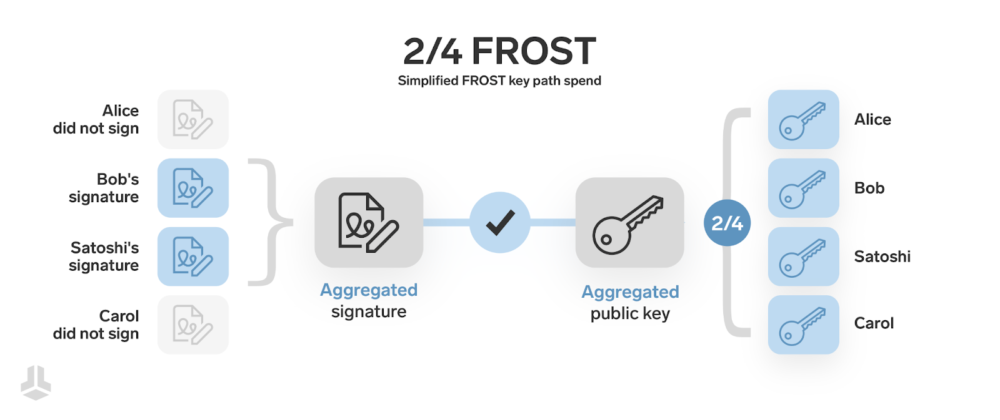

> *作者：Sebastian*
> 
> *来源：<https://blog.bitbox.swiss/en/musig2-and-frost-explaining-multisignature-schemes-on-taproot/>*

2021 年 11 月，[Taproot 升级](https://blog.bitbox.swiss/en/taproot-planting-the-seeds-for-bitcoin-applications/)在比特币上通过[软分叉](https://blog.bitbox.swiss/en/soft-fork-or-hard-fork-what-is-the-difference/)激活，给比特币交易带来了一些新的特性，以及相对更高效的 Schnorr 签名。虽然采用率在一开始增加得比较缓慢，当前，Taproot 形式的交易输出已经占据了[所有比特币未花费交易输出的 20%](https://transactionfee.info/charts/inputs-types-by-count/)，而且更多应用开始使用 Taproot 的更高级的特性。当然。BitBoxApp 和 BitBox02 [从 2022 年](https://blog.bitbox.swiss/en/bitbox-01-2022-maighels-update/)开始就支持 发送资金到 Tpaorot 地址以及用 Taproot 地址来收取资金。

在本文中，我们将在新的多签名方案（比如 [MuSig2](https://eprint.iacr.org/2020/1261.pdf) 和 [FROST](https://eprint.iacr.org/2020/852.pdf)）上展望未来；这些方案将让[多签名钱包](https://blog.bitbox.swiss/en/what-are-multisig-wallets-everything-you-need-to-know/)从 Taproot 钱包的增强的隐私性和经济性中获益。为了理解它们的工作原理，以及上述好处从何而来，我们要简单了解比特币的脚本和 Taproot，然后再申述了解这些签名方案。

## 比特币脚本编程

在你收取比特币支付时，你要把一个地址交给支付方，这个地址代表的是一个脚本；而发送者需要在某笔交易中创建一个新的交易输出，把资金发送到你给出的地址 —— 实际上就是**将一些比特币锁定到那个脚本**中。这样的脚本是一种小型的、简单的程序，决定了什么样的花费资金的交易是有效的；比特币网络中的每一个节点，都会凭借这样的程序来 检查/验证 交易。比如，原生的 Segwit 脚本 P2WPKH，仅在你（的交易）所提供的公钥与脚本中一个公钥哈希值相匹配、同时你能提供该公钥对交易的一个签名时，你才能够花费锁定在这个脚本中的资金 —— 就这么简单。再简单一些：这样的脚本确保了只有持有正确密钥的人才能花费被它锁定的比特币。

但是，使用这样的编程能力，也可以实现更加复杂的使用比特币的方式 —— **加入更多的花费条件**。一个广为人知的例子就是多签名钱包，被其中的地址锁定的资金需要多于一个签名才能花费。从一个多签名地址花费资金的时候，这个更加复杂的脚本需要公开，这一方面是为了验证脚本与地址相对应，然后是为了（根据脚本中的公钥）验证你所提供的签名是有效的。

这种多签名钱包（也是当前主流的多签名钱包）有两个缺点：首先，它的隐私性并不理想，因为每个人都能看到你的多签名装置的细节（不管你使用的是 2-of-3 设置、3-of-5 设置乃至更加复杂的方法，都会在完整脚本中暴露）；其次，你加入的花费条件越多，脚本的体积就越大，那么交易手续费就相对越高。

## 密钥路径与脚本路径

从一个 Taproot 地址花费资金的时候，可以选择**两种不同的花费路径**：密钥路径和脚本路径。两种花费路径各擅胜场，一起带来了更加隐私、更加高效的交易。

**密钥路径**

默认的，或者说 “更推荐” 的使用 Taproot 地址的方式是密钥路径；就其自身而已，非常容易理解：Taproot 脚本包含了一个公钥，只需一个签名就可以从中花费。如果在花费一个 Tarpoot 输出时，你什么都没提供，只提供了一个签名，那就是密钥路径花费。比如说，从 BitBoxApp 所创建的 Taproot 地址中花费时，每一笔普遍交易都是密钥路径花费。

密钥路径花费很棒，是因为它省去了所有无关的信息，在区块链上仅暴露一个公钥和一个数字签名。这让每一笔使用密钥路径的 Taproot 交易看起来都完全一样。你根本分辨不出创造签名的必要条件 —— 根本就没有线索。只要这个签名是有效的，这笔交易就是有效的。虽然它是一个标准的单签名，但你不知道后面藏着什么 —— 可能是多重签名钱包，甚至是一条闪电通道 —— 这个我们后面详细说。

**脚本路径**

脚本路径与当前的复杂花费条件类似，需要在比特币区块链上公开这样的复杂条件。它们被用作花费一个输出的替代方法，比如说，通常的密钥花费条件不能满足。一个这样的例子是，*常规条件* 可能是你的主力硬件签名器，而替代条件则是一个放在异地的后备密钥，当你的主力硬件签名器不可用的时候，你可以使用后备密钥。

但是，脚本路径花费依然能提供一些好处，因为**仅有部分的花费条件需要公开** —— 你可能有三种替代条件，但在花费时，只需要揭晓实际上用到的那种。这也可以提高隐私性，并获得更小的交易体积，因为并非所有细节都需要记录到比特币区块链上 —— 只有实际被用到、实际被公开的那部分，才会记录到区块链上。

Taproot 厉害的地方在于我们可以**全都要**！Taproot 脚本**既**允许通过一个签名来花费（密钥路径），**也**允许公开一个脚本路径并凭它来花费。你可能意识到了：Taproot 脚本中的公钥必定有着极为有趣的构造，显然 “不仅仅是一个简单的公钥”。没错！

## 你听过 “MuSig” 吗？

有了对比特币脚本编程和 Taproot 两种花费路径的了解之后，我们就可以真正开始了解几种多重签名方案以及它们如何利用 Taproot 的特性了。在上一节中，我们已经暗示了，可以将多签名钱包 “隐藏” 在单公钥的密钥花费路径之后；这是怎么做到的呢？一个签名怎么能够代表多个签名人？

### 签名聚合

Taproot 脚本所使用的电子签名方案是 “Schnorr 签名”，它有一种有趣属性叫做 “linerity”，因为着其签名结果是**易于相加的**，可以把来自多个签名者的电子签名 “聚合” 为单个签名。

基于这个原理，比特币专家和密码学们得出了一种优雅的多重签名方案。MuSig2 使用密钥聚合和签名聚合来启用 **n-of-n 多签名钱包**（例如，下图就展示了 4-of-4 多签名钱包），而且不需要在比特币网络中揭晓关于聚合前公钥和聚合前签名的任何信息。

除了参与了签名过程的人，没有人能看出 Alice、Bob、Satoshi 和 Carol 都参与创建了签名。甚至压根没有人能看出这笔交易来自一个多签名钱包 —— **因为混同在其它 Taproot 交易中，所以提高了安全性**。这样的聚合签名交易的体积跟常规的单签名交易是一样大的，因为也不需要暴露任何一个聚合前的公钥；交易体积缩减给用户带来的好处是需要支付的手续费会降低，而比特币区块链也会变得更加高效。

### 交互性

但也像生活中的别的事情一样，MuSig2 也有它的牺牲，那就是签名器之间需要交互。在传统的多签名钱包中，签名器只需要传出签名就行，这些签名会变成最终交易的一部分，而在 MuSig2 方案中，这些签名器必须来回沟通，不止一次，以安全地计算聚合公钥和聚合签名。

MuSig 的第一个版本要求三轮交互，而且出于安全理由，必须稍微调整，这也是为什么现在较为著名的是其后继者 “MuSig2”，该算法只要求两轮交互。当然，这很是给用户带来了复杂性，虽然隐私性和交易体积好处可能足以说服许多用户克服这些不便之处。

n-of-n 设施的另一个局限性在于，它无法直接形成阈值机制（例如，2-of-3），而这是大多数多签名钱包用户想要的东西 —— 这能帮他们对抗私钥丢失事件。为了加入这种安全冗余，就需要额外的脚本路径、形成不同密钥的 “后备组合”。这可以在实质上产生与之机制，但也需要更加复杂的脚本和设置。但你可能猜到了，我们还未穷尽所有可能性。

## FROST

“灵活且最优轮次的 Schnorr 门限签名” 协议，缩写为 “FROST”，是另一个类似于 MuSig2 的多签名协议，至少从创建和聚合签名的角度看。不妥，它使用了不同的密钥生成方式，从而**支持阈值机制**。

为了安全地使用阈值机制，让（比如说） 4 个预定公钥中的任何 2 个的签名都可以聚合成有效的签名，有两种创建公钥碎片的选择：（1）由一个受信任的参与者来生成和发放公钥，这是一种较为简单的方案，但显然需要签名器之间相互信任；（2）让签名参与者通过一个交互流程来生成密钥，这通常叫做 “[分布式密钥生成](https://en.wikipedia.org/wiki/Distributed_key_generation)（DKG）”，需要在签名器之间有安全的通信通道。

换句话说，**加入设定阈值的能力也会带来复杂性**，但也带来了更加通用、更强韧的设置。使用 FROST 协议的密钥路径花费，也跟其它使用密钥路径的 Taproot 交易没有区别，因此有更好的隐私性 —— 没缘分知道是哪些签名器参与花费了资金。

## 结论

如果你不是单独地思考这些概念，而是想象它们的组合方式（以及跟其它机制的组合），你会发现可能性几乎是无穷无尽。用户能够微调子集的设置，例如加入时间锁和复原路径，就像 [BitBox02 搭配 Liana Wallet 已经能做到的那样](https://blog.bitbox.swiss/en/exploring-bitcoin-miniscript-with-liana-and-the-bitbox02/)，从而能够组合它们、并从我们已经学到的高级方案中受益。闪电网络这样的扩容方案，也可以利用 MuSig 这样的方案，让通道管理更加高效、更加隐私。

MuSig2 和 FROST 的好处基本上会随着钱包设置的复杂度以及签名器的数量而上升，这让它们对财务管理有复杂要求的大企业非常有吸引力。但即便是对个人用户，也可以节约手续费、获得更好的隐私性。两者都还处在非常早的阶段，但 Taproot 以及它的好处是长期存在的，所以像 MuSig2 和 FROST 这样的签名方案的采用以及用户体验最终也会提上来。我们将继续关注这些开发工作，看看是否能让 BitBpx 用户从中受益！

（完）