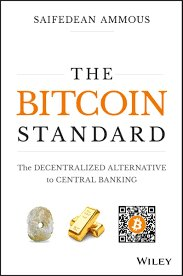

> *作者：Yorick de Mombynes*
> 
> *来源：<https://threadreaderapp.com/thread/985560599248756736.html>*

> 编者注：本文为 Yorick de Mombynes 从《The Bitcoin Standard》中节选出来的片段。他在 Twitter 上公开时，也受到了原书作者 Saifedean Ammous 的赞赏。我们提供译文，方便大家一窥《The Bitcoin Standard》的堂奥。
>
> 附：[豆瓣读书-《货币未来：从金本位到区块链》](https://book.douban.com/subject/35178904/)

1.最好把比特币当成是一套分布式软件，用于转移资金：它所用的货币不会出现意料之外的通胀，转移过程也无需依赖可信第三方。

2.虽说比特币是数字时代的新发明，但它试图解决的问题却与人类社会同样久远了：如何提供一种完全由拥有者控制的货币，并且能长时间持有（直到人类社会消失）。

3.人们的选择都是主观的，选择哪种货币都无关对错。选择会有结果，仅此而已。

----

4.我管这叫作 “贱钱陷进”：一旦某物被用作价值储存的手段，它们的供应量就会增加，而一旦该物品的供应量增加很快，则其代表的价值就会缩水。

5.要成为货币，就必须是难以生产的，否则借便宜生产手段渔利的诱惑会破坏储蓄者的财富，并破坏人们存储该货币的动力。

6.那些历久弥新的货币媒介，通常具有可靠的机制，能够限制它们的供应增长，换句话说，可以称为 “贵钱（hard money）”。

7.（在一个社会中）何物最适合用作货币，通常取决于社会的实际技术能力，这些技术条件决定了不同货物的畅销性。

8.人类文明的繁荣通常出现在健全货币被广泛接受的时代和地区，与之对应的，非健全货币通常意味着文明的消亡和崩溃。

9.无论是罗马，君士坦丁堡，弗洛伦萨还是威尼斯，历史表明，健全货币制度是人类繁荣的必要前提，否则，人类社会就会处于野蛮和毁灭的边缘。

10.历史表明，若他人手中的钱比你的手中的钱更贵，你不可能置身事外。

----

11.人类在金本位时代达成了一些非常重要的技术、医学、经济和艺术成就，因此，它在欧洲也被称为美好时代（la Belle Epoque）

12.一战后，货币由自由市场决定的时代结束了，取而代之的是政府货币时代。

13.政府货币类似原始货币和非黄金的商品：可以轻易增加供应，从而导致滞销，购买力破坏，最终使持有者变得穷困。

14.随着金本位被搁置，政府的战争消耗不再局限于国库中的钱，而是扩大到所有国民财富。

15.如果欧洲国家维持金本位，或者欧洲人民自己保管黄金，历史可能会被改写，第一次世界大战可能会在几个月内就结束。

16.第一次世界大战后，对金本位的偏离引起了1929年的经济大衰退。胡佛和罗斯福时期的政府管控及经济社会化，则深化了大萧条。

17.凯恩斯式的幼稚经济学认为，任何支出都是消费，无论是个人供养家庭的支出，还是政府发动战争的支出，这些消费都提升了总需求，降低了失业率。

18.本质上，布雷顿森林体系乃是希望通过中央计划实现 19 世纪自发形成的国际金本位制度

----

19.恶性通胀是使用政府货币的经济体所独有的，在金银本位的经济体中前所未见。

20.使用政府货币的经济体中，货币的生产成本趋于零，因此，整个社会见证货币财富在数月或数周内灰飞烟灭完全是有可能的。

21.恶性通胀不仅仅是一个令许多人损失惨重的恶性现象，更可能导致社会千百年来形成的经济结构分崩离析。

22.即使教科书中关于政府管控货币供应颇有益处的结论是正确的，世界上哪怕有一次恶性通胀发生，所带来的害处就会使得那些益处相形见绌。

23.Hanke 和 Bushnell 已经证实了历史上的 57 次恶性通胀，其中，只有一次发生在货币国家化之前，即 1795 年的法国大通胀，时值密西西比泡沫破灭之时。

24.不断增加的供应，会导致货币不断贬值，使得财富从货币持有者手中向货币发行者和货币的早期持有人转移，即坎蒂隆效应

25.无论是明目张胆的贪腐、“国家危机”或是通货膨胀学派的泛滥，政府总会找到理由印钱，从而扩大政府权力，掠夺持币者的财富

26.讽刺的是，在政府货币时代，政府拥有的黄金储备却远超 1871-1914 的国际金本位时代

-----

27.健全货币政策，使得人们只有在为他人提供有价值的服务时，才能获得个人收益。因此，整个社会将致力于生产、合作、资本积累和贸易

28.二十世纪，是万能政府和不健全货币当道的时代。人们被勒令禁止使用市场选择的货币，而被暴力胁迫使用政府发行的货币

29.健全货币是个人能不受专制和压迫所害，获得自由的基本前提。一个拥有发行货币能力的强权国家，将拥有可以为祸人民的权力，这些权力对那些宵小之辈充满吸引

30.健全货币政策是决定个人时间偏好的一个主要因素，该因素对个人决策有巨大影响，却经常被人忽视。时间偏好指个人评估的当前价值和未来价值之比

31.经济学家 Hans-Hermann Hoppe 解释说：当时间偏好率足够低，以致形成了储蓄和资本，或者耐用消费品时，时间偏好率下降的趋势将势不可挡，开始所谓的“文明的进程”

32.微观经济学关注个人之间的交易问题，宏观经济学关注政府在经济中的角色问题。对个人的幸福而言，最重要的经济决定取决于对自己未来预期的权衡

33.货币越保值，就越能激励人民延迟消费，配置资源用于未来的生产，从而积累资本，提高生活水平

34.长期来看，放弃能够保值增值的货币，而转用易贬值的货币，将产生严重后果：社会储蓄减少，资本积累减少，甚至可能开始吃老本

35.文明在健全货币体系下繁荣，反之则瓦解消亡，从罗马、拜占庭和现代欧洲社会，都是如此

----

36.对货币而言，重要的是它的购买力而非数量。只要货币数量能够满足持有者的交易和储蓄需求（能够分割和组合），就能保证其行使货币功能。

37.历史上最好的货币，就是那种把增发货币的影响限制到最小、让增发货币无利可图的货币。

38.如果政府货币更适宜记账和储值，就无需政府制定货币法来强制施行，也无需政府在全球采购黄金并储备到央行

39.事实上，央行继续保持持有黄金，甚至开始增加黄金储备，说明从长远来看，政府对自己的货币缺乏信心

40.健全货币，将随着时间推移而略微增值，也就是说，持有该货币，将增加购买力

41.非健全货币优于受到央行的控制（后者以保证正通胀率为使命），只能提供更小的经济激励让人们持有它

42.对于非健全货币，只有当回报高于货币的贬值时，才会有收益， 因此激励了人们进行高风险高回报的投资，或者直接消费

----

43.发达国家的储蓄率一直在下降（已经到了非常低的水平），而个人、地方和国家的债务却升高到过去想都不敢想的地步

44.凯恩斯经济学思想中最异想天开的一个莫过于 “国家债务无所谓，因为那是我们自己欠自己的”

45.信仰高时间偏好率的凯恩斯信徒，可能无法正确理解 “自己人” 的概念，在这里，“自己人”不是指当前的一群人，而是好几代不同的人。换句话说，当前不顾后果的消费，是以未来几代人为代价的。

46\. 20 世纪变成了消费主义的狂欢，跟健全货币的衰亡和凯恩斯思想的盛行两个方面都脱不开干系（后者贬低储蓄，并神化消费主义为经济繁荣的关键）

47.讽刺的是，在凯恩斯主义经济学的煽动下，现代经济学显得如此无知，它认为是资本主义导致了炫耀性消费（与资本积累相反），而资本主义正是基于通过储蓄进行资本积累的经济体系。

48.资本主义的诞生，正是由于人们降低时间偏好率，延迟满足，并对未来进行投资。说举债消费是资本主义的一部分，就如同说窒息是呼吸的一部分一样可笑。

49.经济增长的唯一原因，首先就是延迟满足，储蓄和投资，这些行为延长了生产周期，提高了生产率和生活水平

50.健全货币到贬值货币的变化，导致几代人的财富在一，二代人手里就浪费殆尽（炫耀性消费），并依赖负债来为消费提供资金。

51.如 H. L. Mencken 所说，每次选举都是对赃物的预先拍卖

52.政客向人们兜售的谎言：通过印钞，福利和退休金可以保持不变。事实却是，印钞使得家庭的投资日益缩水。

---

53.我们现代生活中的大部分技术都是在19世纪发明，受益于当时金本位制度下的经济发展（人们使用健全货币进行资本积累，使得储蓄不容易贬值）。

54.健全货币对人类繁荣的贡献不止局限于科学和技术进步，也生动地体现在艺术世界中。

55.在健全货币和低时间偏好时代，艺术家们钻研手艺，以制作出影响深远的有价值的作品

56.当代的艺术家，用狂妄、令人瞠目结舌的价值观、愤怒和存在主义的焦虑（以此博取受众的认同），取代了钻研手艺和长时间的练习，而且，时常加入一些故弄玄虚的政治理想（通常是幼稚的马克思主义）

57.当年政府货币取代健全货币时，一同被取代的还有那些拥有低时间偏好和精致品味的艺术赞助人，随之而来是品味尘下的政府官僚和粗鲁的政治流程

---

58.Friedrich Hayek 的《散在社会的知识之运用》，是有史以来最重要的经济学论文之一

59.在自由市场经济体系中，价格本身即是知识，是传递信息的信号

60.价格不仅仅是资本家的获利工具，它是经济生产中的信息系统，在世界范围内传递知识，协调复杂的生产流程。

61.任何试图取消价格的经济体系，都将导致经济活动的彻底崩溃，乃至退化为原始社会

62.米塞斯（Ludwig von Mises）揭示，社会主义的致命缺陷在于，没有了自由市场的价格机制，社会主义无从进行经济核算（这是分配资本品的关键因素）

---

63.在一个拥有中央银行和部分准备金银行的经济体中，由经济学家组成的委员会主导贷款资金的供应，它会受到政客、银行家、电视评论、（尤其是）军队的影响

64.增加纸币和数字账户以掩饰储蓄不足的行为，并不能真正增加社会财富，只会使得货币贬值，价格扭曲

65.只有理解资本结构，以及利率操纵如何摧毁人们累积资本的欲望，才能理解衰退的原因和商业周期的波动

66.商业周期是利率操纵的自然结果，操纵扭曲了资本市场，使得投资者以为他们可以靠着银行发给他们的不健全货币、拿到比实际可用的更多的资本

67.商业周期并不是凯恩斯主义所鼓吹的那样，是 “动物精神” 衰弱导致的神话现象，真正的原因（操纵利率）早在中央银行家们试着 “计划恢复经济” 时就已经悄悄种下了

68.经济学理论清晰地表明，衰退是利率操纵的必然结果，正如货物短缺是限价的必然结果

69.货币的历史证明，货币供应受到的操纵越严重，商业周期的波动和衰退也越严重

---

70.资本主义体系不能脱离自由资本市场而存在，在自由资本市场中，资本价格由供需决定，资本家们的决策则取决于准确的价格信号

71.央行对资本市场的干预，是所有衰退和危机的根源，而多数政客、记者、学者和左翼活动家却将其归咎于资本主义

72.幻想央行能够 “避免”，“打败” 或 “管理” 衰退，就如同让纵火癖管理消防队一样荒谬

73.中心化的信贷市场必然失败，因为它摧毁了市场的价格发现机制，该机制能够使市场参与者获得（准确的信号）反馈和激励，以控制生产和消费（数量）

74.这是典型的弗里德曼式自由主义者，他们将经济问题归咎于政府，然后糊里糊涂地推论，需要更多的政府干预以解决问题

75.只有当央行操纵货币供给和利率时，才有可能导致整个经济领域爆发大规模的倒闭潮，所有行业大量裁员

----

76.在货币自由市场中，个人可以选择他们愿意使用的货币。结果就是，他们会选择拥有最低存量增量比的货币，因为该货币在供需变化时波动幅度最小

77.令人震惊的是，1900 年的企业家，在进行全球性的经济规划时，可以使用任何一种国际货币进行计算，而不用考虑它们的汇率波动

78.浮动汇率和凯恩斯主义思想的结合，给世界带来了货币战争这一当代独有的现象

----

79.（使用）贵钱（hard money）可以解决政府及其附庸经济学吹鼓手导致的货币操纵问题，从而迫使每个人通过提高社会生产率，而不是依赖愚蠢的货币操纵行为来致富

80.在健全货币体系下，政府需要对财政负责，这种运作方式是在二十世纪经济周期性波动（叙事）中长大的几代人无法想象的

81.今天的我们，在二十世纪全能政府的宣传下长大，很难相信可以用个人的自由和责任来取代政府的权威

82.我们这个时代最根本的骗局就是认定需要政府来管理货币供应，但这却是所有主流经济学派和政党都不加批判的初始假设

83.无论是实质上的还是名义上，印钞能力将大大增强政府的权力，而政府对权力的渴望将使其无所不用其极

---

84.中本聪显然未采信标准宏观经济学教科书的观点，而是受奥地利学派影响更深（认定货币的数量不是最关键的），因此给比特币的供应加上了硬上限

85.货币价值稳定的社会，通常会发展为低时间偏好社会，人们会学着储蓄和为未来筹谋；而那些高通胀和货币不断贬值的社会，会发展为高时间偏好社会，人们将只顾眼前的苟且而忘却储蓄

86.如果使用健全货币，则政府为战争所作的（筹款）努力将只限于追缴税收，而使用非健全货币，政府可以通过不断印钞来轻易地挪用财富，挪用数量取决于货币崩溃的上限

87.非健全货币，在面临连任压力的现代民主政府手中，是特别危险的工具。现代选民，并不喜欢那些提供锱铢必较（符合经济规律）的经济提案的候选人

88.非健全货币的蛊惑人心之处在于，它使得大多数投票者和不幸学习过宏观经济学大学课程的人们深信：政府行为没有机会成本

89.当我们回顾历史上的暴君时会发现，他们都操纵着一个由政府发行的货币体系，这些货币不断通胀，资助政府运行

90.非健全货币使得政府权力不受限制，每个个体也深受其害，不得不在生活中以政治为中心，并将大量的社会能量和资源投入到争权夺利的零和游戏中去

91.法币的游戏规则中，获得央行的货币放款比服务客户重要的多。那些能获得低息贷款的公司将获得持久的竞争优势

92.银行业已经变成一种，给银行家带来无风险回报，给大众带来无回报风险的行业

93.在由央行分配信贷的世界里，大公司更容易获得安全的低息贷款，使得它相对小公司更具备竞争优势

----

94.比特币是第一个无需可信第三方中介进行数字支付的工程方案，是第一个可验证稀缺性的数字现金

95.现代央行创造新的货币用于借贷和政府开销，新创造的比特币则用于奖励消耗资源用于记账的矿工

96.难度调整是使得货币成为 “贵钱”（hard money）的最可靠的技术，并能限制存量增量比的提高，这使得比特币与其它货币截然不同

97.比特币是迄今为止最 “贵” 的货币（hardest money）：无论价格如何提高，都不可能影响货币供给；币价提高只能让网络变得更加安全

98.比特币的安全性基于 “上链-验证” 的非对称性：要把交易写入账本需要创建工作量证明，这是非常困难的，但是，验证工作量证明是否有效又是非常简单的

99.比特币交易账本可能是世界上唯一客观记录了事实的存在

100.比特币是第一种分发后就不再属于发送者的数字物品

101.比特币作为一种解决间接交易问题的货币方案，取得了重大的技术飞跃。这次飞跃，也许和货币从牛、盐发展成金银一样重要

----

102.如果没有保守的货币供给策略和难度调整，比特币就只能是一种理论上会成功的数字现金，而不可能被广泛使用（因为不够安全）

103.比特币价格的波动性源自其固化的供应和对需求变化的无动于衷，因为货币的增长率已经被预先设定了

104.随着市场规模的增长，金融组织会在更复杂和深入的场景下使用比特币，此时，比特币的波动性就会下降

105.只要比特币数量继续增加，它的价格就会像初创公司的股票一样快速升高。一旦比特币的增长停滞，它将不再吸引高风险的投资，从而成为普通的货币资产

106.比特币是投资未来的最便宜的方式，因为它是唯一保证不会贬值的货币，增值如何那且另说

107.拥有严格稀缺性的比特币，拥有物理货币的优点，却没有移动运输不易的缺点。比特币可能是迄今为止最好的价值存储技术

108.任何拥有比特币的人，相比它发明前，都获得了一定程度的经济自由

109.自现代国家出现以来，个人第一次拥有了可靠的技术，可以摆脱所在地政府的金融政策的影响

---

110.通常来说，比特币和密码学均是防御性的技术，目的是使财产和信息的防护成本低于攻击成本

111.如果比特币继续成长，占据更大的世界财富份额，则可能使得国家越来越像一种自愿加入的组织，只能向愿意接受其服务的人们征税

112.人们常常以为无政府主义者就是一群穿着连帽衫的小混混，但比特币的无政府主义完全不同，他们完全是温和的，只为个人提供免受政府控制和通胀的必要工具

---

113.比特币的发明，从根本上创建了一种不依赖任何中介的独立国际结算机制，可以完全独立地运行于现有的金融基础设施之外

114.比特币可以看作一种新兴的在线交易使用的储备货币，线上的类似于银行的机构可以发行以比特币作为准备金的代币，然后将比特币保存在冷钱包里

115.比特币的优点在于，将现金结算引入数字世界，创造了一种支持跨境、长距离大额支付的最快的结算方法

116.最好把比特币当成是央行和大金融机构结算层的竞品，相比它们，比特币更受喜爱，因为它有可验证的账本记录、密码学安全、并且不受第三方安全漏洞影响

117.由于比特币没有对手风险，且不依赖于第三方，使其特别适合扮演与（金本位时代的）黄金相同的角色

118.如果比特币价值继续增长，并且被更多的金融机构使用，它将成为新型央行的储备货币

119.第一个购买比特币的央行，将促使其它银行纷至沓来，并引起比特币价值的显著提升

120.尽管央行们大多对比特币的重要性不屑一顾，但这种情形不会持续太久。央行们可能难以相信，比特币会是它们业务的直接竞争对手

121.现代央行的业务模型正在崩溃，不得不靠颁布法律来维持竞争优势。但是它们面对的是数字世界的对手，不受物理世界的法律约束

122.如果将现代世界比作古罗马，美元比作奥里斯（aureus），那么它正遭受货币崩溃引起的经济危机，此时，中本聪就是我们的康斯坦丁，比特币就是他的苏勒德斯（solidus），互联网就是我们的君士坦丁堡

----

123.如果比特币价值能够保持某种程度的稳定，（使用）它将优于使用国家货币进行全球支付结算，因为正如今日所见，国家货币的价值受它们各自国家和政府状况的影响而起伏波动

124.比特币是唯一一种真正去中心化的数字货币，它自发地在矿工、开发者和用户之间发展出了微妙的平衡，谁都无法控制它

125.经过多年对其它数字货币的观察，目前没有一种能够像比特币那样，实现比特币利益相关者和其它破坏者（企图控制支付）之间的攻防平衡

126.我们应该停止追究中本聪到底是谁，并承认中本聪是谁与如何应用比特币这项技术无关，正如我们不关心到底谁发明了轮子

127.目前，没有任何一种数字货币拥有类似比特币的应变能力，这源于它真正的去中心化属性以及它为遵守协议的所有人提供的强大激励

128.实情不同于围绕比特币的大肆宣传，在商业和生活的所有领域，消除可信第三方，并不是无可争议的。

129.一个去除了比特币的区块链系统，是两者（区块链和非区块链）缺点的扭曲组合：笨重的区块链结构，维护可信第三方所需的高成本及安全风险

130.在区块链发明8年后，除了为它量身打造的比特币，该技术还没有一个获得突破性成功的商业应用

131.那些被吹捧的区块链潜在应用，包括支付、合同和资产注册，都只有在完全使用区块链的去中心化货币时才能运行

132.所有不基于数字货币的区块链应用，都无法从原型落地为商业实现，因为它们与市场上最好的同类（非区块链）应用相比，毫无竞争力

133.任何区块链应用具有商业意义的前提是，它的运作基于电子现金，并且电子现金（拥有的去中介特性）相比普通的货币和支付渠道，提供了更多好处

（完）