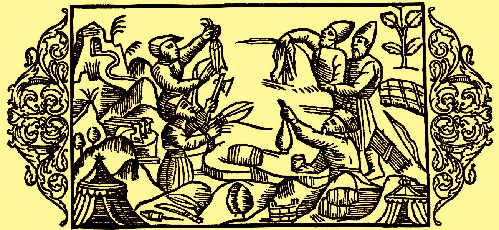

> *作者：George Selgin*
> 
> *来源：<https://www.alt-m.org/2016/03/15/myth-myth-barter/>*

有些人认为，想要痛打经济学家，只要用一些古老的 “棒子” 就可以了。

至少一部分人类学家及其同道是这么认为的。他们自以为是地认为，只要他们能证明某些信贷形式比货币交易或以物易物更早出现，就拿捏住了我们经济学界的泰斗。

在本文语境中， “棍棒” 指的是与当前经济学理论相悖的人类学证据。经济学教科书上的主流观点是，人类交换的形式发端于物易物，再发展成货币交易，最后出现信贷。如果只是为了反驳该观点，这根 “棍棒” 没什么杀伤力，因为在教科书里挑毛病简直易如反掌。但是，这些批评家将矛头主要对准了一位重量级人物：亚当·斯密（Adam Smith）。

在[《国富论》](http://www.econlib.org/library/Smith/smWN.html)中，斯密指出：

>  “分工一经完全确立，一个人自己劳动的生成物，便只能满足自己欲望的极小部分。他的大部分欲望，须用自己消费不了的剩余劳动生成物，交换自己所需要的别人劳动生成物的剩余部分来满足。于是，一切人都要依赖交换而生活，或者说，在一定程度上，一切人都成为商人，而社会本身，严格地说，也成为商业社会。” 
>
>  “但在刚开始分工的时候，这种交换力的作用，往往极不灵敏。假设甲持有某种商品，自己消费不了，而乙所持有的这种物品，却不够自己消费。这时，甲当然乐于出卖，乙当然乐于购买甲手中剩余物品的一部分，但若乙手中，并未持有甲当下希求的物品，他们两者间的交易，仍然不能实现。比如，屠户把自己消费不了的肉放在店内，酿酒家和烙面师固然都愿意购买自己所需要的一份，但这时，假设他们除了各自的制造品外，没有别种可供交易的物品，而屠户现时需要的麦酒和面包，已经得到了供给，那么，他们彼此之间，没有进行交易的可能。屠户不能作酿酒家和烙面师的商人，而酿酒家和烙面师也不能作屠户的顾客。这样，他们就不能互相帮助。然而，自分工确立以来，各时代各社会中，有思虑的人，为了避免这种不便，除自己劳动生产物外，随时身边带有一定数量的某种物品，这种物品，在他想来，拿去和任何人的生产物交换，都不会见拒绝。” （亚当·斯密：《国富论》（郭大力，王亚南译），译林出版社，2011）

上述观点哪里出了问题？用剑桥大学人类学家卡罗琳·汉弗莱（Caroline Humphrey）的话来说，问题在于 “没有任何关于以物易物经济的例子被记录在案，更别提货币的诞生了……所有民族志都表明所谓的以物易物经济从未存在过” 。这句话被[近期发表于《大西洋月刊》的相关文章](http://www.theatlantic.com/business/archive/2016/02/barter-society-myth/471051)引用（这篇文章正是本文的灵感来源）。

现在，缺少能够证明以物易物经济曾经存在过的历史或人类学证据虽然对斯密不利，但是仅仅如此并不足以反驳他的观点：毕竟，如果以物易物确如斯密形容的那样 “极不灵敏” ，找不到证据证明曾有社会依赖以物易物的交易方式又何奇之有？出现这种情况只能说明这些社会要么很快转向了货币交易，要么迅速消亡了。换言之，缺少以物易物经济存在过的证据并不能驳倒斯密的观点，只能反映[幸存者偏差](https://en.wikipedia.org/wiki/Survivorship_bias)。在[犀利评论格雷伯（Graeber）的《债：第一个 5000 年》](http://guilfordjournals.com/doi/abs/10.1521/siso.2015.79.2.318)时，胡里奥·华图（Julio Huato）有力地论证了这一观点。他在评论中写道：

>  “格雷伯的态度就好比一位化学家拒绝认同 “化学元素的不稳定放射性同位素有可能逐渐演变成稳定同位素” ，因为前者在大自然中很罕见，而后者很常见。” 

但是，据格雷伯所言，斯密的观点之所以值得商榷，不是因为人类学家找不到以物易物社会存在过的证据。相反，正是人类学家找到了大量证据表明，完全不依赖货币和以物易物的社会或许没有经历过繁荣，但至少存在过。这些社会虽然没有通过任何直接或间接的方式进行 “等价交换” ，但是采用了一些微妙的信用形式，也就是人情往来，而非单纯的馈赠。

正如《大西洋月刊》的通讯记者比喻的那样：

>  “假设你是个烘焙师，恰好家里没肉了，你没有直接拿着贝果去找屠夫换肉排。相反，你叫你的妻子去暗示屠夫的妻子，说你们夫妻俩最近有点缺铁。屠夫的妻子听了会说：‘天哪，真的吗？来吃个肉饼吧，我们这儿有的是！’之后，等到屠夫想要个生日蛋糕或搬新家时，你再还这个人情。” 

不可否认的是，这类交易确实会发生，即使在现代社会也不例外，而且不同时代的社区都离不开这种交易方式。我曾经教授过[一门关于经济人类学的短期课程](http://people.terry.uga.edu/selgin/intbus5100/Econ4710Syllabus.pdf)，里面有一节课讲的就是送礼和其它形式的 “人情交换” 。我坚决反对的是，人类学家大卫·格雷伯声称人情经济的存在削弱的不仅是亚当·斯密关于货币起源的解释，还有 “经济学的所有论述” 。

再听听《大西洋月刊》的通讯记者是怎么说的：

 “据格雷伯所言，一旦人类为物品赋予特定价值（在基于货币的经济体中人们就会这样做），为人类自身赋予价值同样变得轻而易举，这不一定是导致奴隶制……和帝国主义等制度建立的直接原因，但至少是一大诱因……” 

这下你该明白格雷伯的意思了：因为声称货币交易是社会繁荣发展的必要条件，亚当·斯密所推导出的 “经济学论述” ，会让一切事物（包括人自身）都通过金钱来衡量，从而 “促成” 奴隶制和帝国主义……以及所有的资本主义恶果。

（应当）不难看出，对于亚当·斯密来说，没什么能比格雷伯把他说成[奴隶制](http://digitalcommons.conncoll.edu/cgi/viewcontent.cgi?article=1026&context=econfacpub)和[帝国主义](http://www.let.rug.nl/usa/documents/1776-1785/adam-smith-from-the-wealth-of-nations-1776-of-colonies.php)的推动者更有失公允的了。但是，如果说格雷伯教授在公平公正上有所欠缺，对现代经济学原理的扎实理解就更不是他的强项了，哪怕是非常肤浅的理解他都不具备。如果格雷伯的目的不是记录经济学家对人类学的无知，而是暴露至少有一位人类学家对经济学一无所知的话，我敢说没什么能比写出《债：第一个 5000 年》更自曝其短的了。

在《债》的第二章《物物交换发端论的谬误》的开篇中，格雷伯阐述了自己的核心主张，即，对货币史认识不足是导致斯密误入歧途的关键原因：

>  “严格来说，纯粹的义务（一种应该按照某种方式行事的感觉，乃至对另一个人有亏欠感）和债务之间有何区别？答案很简单：货币。债务和义务之间的区别是，债务是可以精准量化的。这就要用到货币。” 

格雷伯在下文表示： “因此，债的历史必然是货币的历史。” 

这个逻辑很直白，对吧。但是，只要你稍作思考，就知道大错特错了。就像借钱一样，一个人可以通过借用某个非货币商品产生债务，偿还债务时同样使用该商品，而且量化精确度不低于货币债务。例如， “今天你给我一块肉饼，我周四还你两块” 就是负债（整整）两块肉饼。货币既是同质化的，又是相对（而非无限）可分割的，因此尤其适合充当债务合约的标的物。但这是程度上的区别，而非种类上的区别。

格雷伯在第二章节开头犯的错误绝非无关紧要，恰恰反映出他对现代经济学和商业社会的抨击背后的依据存在漏洞。在他漏洞百出的依据中，有一个观点是货币不仅是唯一（且精确）可量化的，而且能够精确衡量其它事物的价值：

> 我们口中的 “货币” 根本不是 “实际存在的东西” ，而是一种用比例来比较不同事物的数学思维：例如，1 个 X 等于 6 个 Y。

由此可见，货币交易

> 本质上就是等价交换（is all about equivalence）。这是一个涉及双方的往来过程，一方给予另一方的东西要和他从另一方那里获得的一样好……在每一场交易中，双方都试图压倒对方。但是，除非有一方让另一方彻底屈服，否则只要双方觉得结果或多或少有不公平之处，交易就无法达成。

换言之，货币交易既是一个 “非主观的” 数学问题，又是一场人与人之间的较量，要么双方不相上下，要么一赚一赔。相较之下，互赠礼物 “可能恰好相反 —— 是一场互比慷慨的较量，人们都在攀比谁能付出更多。” 

格雷伯是怎么通过重复这样的论述，将亚当·斯密（以及后来的大多数经济学家）打成奴隶制、帝国主义乃至全天下几乎所有恶行的辩护者的，我留给读者自己想象。

这里面其实只有一个问题。货币在 “可量化性” 上并不强于肉饼，相较后者也不是一个更好的 “价值尺度” 。我的意思不是说肉饼也能用来衡量其它物品的价值，而是肉饼和任何形式的货币都无法充当价值尺度。

就像 “交换必然是等价交换” 一样， “货币是价值尺度” 同样是由来已久的经济学谬误。[这](http://www.quebecoislibre.org/05/050915-11.htm)[个观点在亚里士多德的经济学论述占据核心地位；也不是什么偶然，亚里士多德也批评所有类型的 “资本主义” 活动](http://www.quebecoislibre.org/05/050915-11.htm)。斯密本人认同修正后的劳动价值论，因此未能摆脱该谬误。十分讽刺的是，格雷伯对斯密作出了各种不实指责，却唯独在一个没有争议的错误上与斯密站在了同一阵线。

尽管 “货币是价值尺度” 至今仍可见于一些教科书中，但它只是反映了 “经济交换就是等价交换” 这一错误观念的例子之一。像格雷伯一样，菲利克斯·马汀（Felix Martin）在其所著的《货币外传（Money: The Unauthorized Biography）》中非常重视 “价值尺度” 概念，并试图据此批判现代经济学和现代货币经济学。[在](https://www.alt-m.org/2014/11/12/mammom-dearest)[对该书的书评中](https://www.alt-m.org/2014/11/12/mammom-dearest)，我以日常生活中观察到的现象为例说明了马汀的错误：餐厅以 4.99 美元的价格向我出售培根和鸡蛋，这并不意味着它们就值这个价，不管是不是从普遍意义上来看。事实上，对于餐厅来说，这些培根和鸡蛋的价值低于 4.99 美元，对于我来说，它们的价值高于 4.99 美元。

真相已经初露端倪。顺藤摸瓜，我们就会发现马汀的批评不攻自破。格雷伯的批评连同他认为交换只有慷慨的人情往来和充满敌意的讨价还价两种类型的错误观点也基于相同的谬误之上，而且同样毫无价值。

但是，我主要担心的不是格雷伯对现代经济学或应当归咎于现代经济学家的论述的全盘否定，而是格雷伯声称斯密及后来的经济学家（包括卡尔·门格尔）关于货币起源的解释毫无价值。格雷伯坚持认为，不管这些经济学家如何争辩，货币都不可能源自以物易物，因为他们假设的 “传说中的以物易物之乡” 从未存在过。格雷伯认为，债务才是最早出现的（有时因其复杂微妙的形式很难与送礼区分开来），然后是金属币形式的货币。最后，以物易物

> 很大程度上是人们在使用金属币或纸币的过程中意外得到的副产品：从历史上来看，*这主要是习惯现金交易的人由于某个原因无法取得货币时采用的方法*（斜体是我加的）。

那么，格雷伯的说法有几分属实？是否能彻底打破经济学家喜欢挂在嘴边的 “假说” ？要想知道答案，我们只需要看格雷伯自己给出的证据即可。该证据本身就足以表明，尽管信贷比以物易物出现得更早，但是斯密的理论毕竟与事实相差不算太远。

你以为我在玩文字游戏？绝对不是。简单来说，虽然微妙的信贷形式或送礼可能足以影响关系紧密的社区的内部交换，但是并没有进一步促成专业化和分工。一旦两个乃至多个 *陌生人* 之间能够进行交易，专业化和分工就会在社区内部乃至社区之间出现。人们只需认清这一简单的事实，就能够看穿格雷伯看似致命的抨击，还斯密一个公道。简单的信贷形式可能是最早出现的，却无法进一步发展，因为它依赖于反复交互以及这种交互所允许和维系的信任。用斯密自己的话来说，这种情感和其它类似的 “道德情操” 同样发挥着很大的作用。我们可以透过一个事实明显看出这点：即使到了今天，货币交易和以物易物在家庭内部也几乎不起任何作用，因为每个家庭都可以称为遗留的 “送礼” 经济体。

难道斯密本人会认识不到，在家庭内部，人情债（或类似的东西）替代了以物易物和货币吗？难道他会否认在大型但关系紧密的社区内部依然会有人情往来吗？照常理推断，亚当·斯密在童年时期不会有过跟他母亲就食宿问题讨价还价的经历，也不会因欠缺双重需求偶合或现金而在努力保障这些或其它生活必需品时陷入 “尴尬而窒息” 的窘境。如果有人认为斯密的观点是互助只有在小家庭内部才重要，肯定没有阅读过斯密在《道德情操论》中的以下段落：

> 在游牧社会以及单靠法律不足以保护每位国民的国家，同一家族的不同分支通常会选择比邻而居。这种联系对于保护整个家族的安危来说往往必不可少。各分支自上而下对彼此或多或少都有一定的重要性。和则万众一心，不和则人心涣散，甚至有可能导致整个家族分崩离析。同一个部落的分支之间往来较多，不同部落的分支之间往来较少。在同一个部落中，最边缘的成员会声称彼此之间有联系，而且在其它条件都相同的情况下，相比没有作出这种声明的人有望获得更多关注。在不那么遥远的过去，苏格兰高地上的酋长曾将其部族中最贫穷的族人视作远房亲戚。据说，这种对亲属关系的高度重视同样可以在鞑靼人、阿拉伯人和土库曼人身上看到。另外，我相信凡是社会状态与本世纪初的苏格兰高地几乎相同的国家都存在同样的现象。

如果说斯密至少隐晦地承认了 “人情债” 代替以物易物和货币在家庭和其它关系紧密的社区中发挥功能，格雷伯也不得不承认，就 *陌生人* 之间的交易而言，信贷根本无能为力：

> 现在，所有这一切（指缺少证明 “传说中的以物易物之乡” 存在过的证据）并不意味着以物易物并不存在，或者从未被斯密口中的 “野蛮人” 实践过。这一切仅仅意味着，以物易物几乎从未 *像斯密想象的那样* 发生在同村村民之间。通常，以物易物只发生在陌生人乃至敌人之间（斜体是我加的）。

格雷伯又在后文写道：

> 所有通过以物易物达成的交易都有一个共同之处，交易对手方都是陌生人，以后可能再也碰不上面，遑论发展出长期关系……

> …… 以物易物是只有当你面对那些 *无法* 客套（或存在亲属关系或诸如此类的关系）的人才会做的事。

上述观点毋庸置疑。但是，这个问题对于斯密来说有多严重？别理会那些关于 “野蛮人” 的愚蠢指摘。（21 世纪的人类学家不应该从政治正确的角度去评判一个 18 世纪的苏格兰人的用词。）问题是，什么是斯密真正 “想象” 出来的？尽管他编造了屠夫和烘焙师的故事，但是他关于游牧社会的论点清楚表明，他明白 “村民” 之间的行为与陌生人之间的行为有何区别。我们也应该如此看待斯密关于货币起源的理论。根据该理论，当 *陌生人之间* 出现交易机会并为分工创造更多可能性时，如果交易必须通过以物易物的方式完成，会 “令人尴尬到窒息” 。然而，一旦以物易物引致货币出现，这一局面就会终结。在将这些情形描述为 “信贷” 执行以物易物功能的例外时，格雷伯也错失了：这些 “例外” 正是评价斯密理论的要点。

这也不能说明[斯密对货币起源的理解混淆了发生在同一个社会/社区 *内部* 的情况和发生在不同社会/社区 *之间* 的情况](http://socialdemocracy21stcentury.blogspot.com/2012/11/my-posts-on-origin-of-money.html)。这一观点完全基于死板的 “社区” 和 “社会” 定义，却忽略了它们的内在弹性：一旦原本独立的社区之间产生贸易往来，这就意味着它们的独立性已经弱化。斯密自己也承认了这一点。另外，斯密还认识到，（陌生人之间）贸易的兴起反过来会削弱亲属关系的相对重要性，进一步增强货币交易的重要性。以下段落同样摘自《道德情操论》，紧接在上述关于游牧社会的引文之后：

> 在商业国家，即使是社会最底层人士也能得到执法机关的良好庇护。同一家族的后代丧失了抱团取暖的强烈动机，自然会在利益和意愿的驱使下彼此疏远。很快，他们无需再依赖彼此，甚至在几代人之后变得互不关心，全然忘记他们的共同起源以及祖先之间的关联。随着时间的推移，这种文明在全世界落地生根，无论哪个国家的人民对远亲的关心都在逐渐减少。相比苏格兰，这种文明在英格兰流传得更久、根基更稳 。因此，尽管这两个国家之间的差异日渐缩小，但是苏格兰人民比起英格兰人民更关心远亲。在任何一个国家，大领主确实都以牢记和承认与其他领主（哪怕是相距最远的领主）之间的关系为豪。牢记这种显耀的关系极大提高了他们的家族荣誉感。这些记忆之所以能得到悉心维护，并非因为亲情或其它类似的情感，而是因为最幼稚无聊的虚荣心在作祟。如果这般大人物有个地位较低（尽管关系可能更近）的亲戚胆敢来认亲，他们往往会告诉对方自己对族谱不甚了解，而且对自己的家族史一无所知。恐怕人们不会希望以这种顺序来大肆扩展所谓的自然情感。

简而言之，善意地解读亚当·斯密，而不是有意将他塑造成人类学的门外汉，将产生一种较为复杂的观点，即，亲属关系和 “人情债” 最先占据主导地位，然后随着陌生人之间往来增多，被以物易物取代，最后又让步于货币交换。这反过来推动了贸易发展，最终削弱了亲属关系和基于亲属的信用关系的作用。

如果说格雷伯对斯密理论的解读是狭隘的，他对卡尔·门格尔（Carl Menger）观点的解读 …… 呃，显然格雷伯根本没读过门格尔的著作，否则他不可能写出门格尔主要 “通过添加各种数学方程式” 来改进斯密的理论和门格尔 “[认为在所有没有货币的社区中，经济生活只能采用以物易物的形式](http://www.nakedcapitalism.com/2011/09/david-graeber-on-the-invention-of-money-–-notes-on-sex-adventure-monomaniacal-sociopathy-and-the-true-function-of-economics.html)” 这样的话。（再者，要是读过，他也不可能没有注意到老门格尔的名字是以 “C” 开头的 “Carl” ，与[他那位数学家儿子](https://en.wikipedia.org/wiki/Karl_Menger)的名字 “Karl” 有一字之差。）相反 ，格雷伯必须承认门格尔很好地理解了（由格雷伯赋予了宽泛定义的） “信贷” 先于货币交换或以物易物出现。

[在门格尔于 1892 年撰写《货币》一文](http://books.googleusercontent.com/books/content?req=AKW5Qad8C6F0cX2rtwJ1gH_zxaxnSjbGbf8u56QFTWuYlepEuGqRX2cY3ZhllsAlg-O8Y44wHCm8u49Fax1Em1HXu5IqkgMfZLZPzXc234YTF5C9iMEvN4xSx-DM8SinZ4Dshh-tSjAn2gNrW90kdFCrtbSa9cfhcq7ZyTfKiLzjm0Ar1vlmwQu9ocrP-aXMwecDkPrrrU2e08JAi0m57Z_Qq6CdqLdVSqHxVN6O2xJ_lktL2PBfXtlvbugLHvc6UhDkwW8IQYoBjElQTPEewUHHCKqok1_b3qPjQmejs3dX8FcZQ-puLqM)中，我们尤其可以看出门格尔对自己口中 “无交换” 经济体重要性的理解。这篇文章收录于《政治科学全书（Handwörterbuch der Staatswissenschaften ）》（第 730-57 页）。门格尔还有另一篇知名度更高的文章《论货币的起源（On the Origins of Money）》同样收录于此。门格尔认为

> 无论是自愿的还是强制的单边资产转移（即，既非由一般的 “互惠合约” 又非由某个特殊的交换交易产生的转移，尽管这种转移偶尔也会基于默认的互惠原则）是我们能够追溯到的人类经济史上最古老的人际关系形式之一。早在商品交易诞生或开始发挥重要作用之前……我们已经发现了各种各样的单边资产转移：自愿和强制送礼、强制摊派、赔偿金或罚款、死亡赔偿金、家庭内部的单边转让等等。*

格雷伯声称经济学家 “基于一个彻底抹去了信贷和债的虚幻世界编造货币的起源故事” 。门格尔却不在此列，他明确承认了

> 在像部落和家族这样的无交换经济体中，人们可能在无法估量的漫长岁月里都没能成功满足自己的需求，直到私有财产，尤其是个人财产出现后，逐渐诞生出了各种贸易形式，让商品交换成为可能……直到那时，而且是在以物易物对于所有人或部分人来说还未到必不可少的程度时，货币诞生的客观基础和先决条件才得以确立。

鉴于上述证据（请记住，原文章的发表时间比[莫斯关于礼物交换的开创性著作](https://en.wikipedia.org/wiki/The_Gift_(book))早了几十年），无论是人们对格雷伯提出的批评的关注，还是[部分经济学家从中发现了价值（尽管只是暂时的）](http://delong.typepad.com/sdj/2011/09/economic-anthropology-david-graeber-meets-the-noise-machine.html)这一事实，都是在告诉我们，至少有一种冲动比起 “买卖、以物易物和交换的倾向” 更深地扎根在人们心中。当然了，我指的是上当受骗的倾向。

（完）

*摘自英译版《货币》，由 Leland Yeager 与 Monika Streissler 共同翻译，收录于 Michael Latzer 和 Stefan W. Schmitz 合编的《卡尔·门格尔与支付系统的演变：从以物易物到电子货币》（爱德华·埃尔加出版社），第 25-108 页。