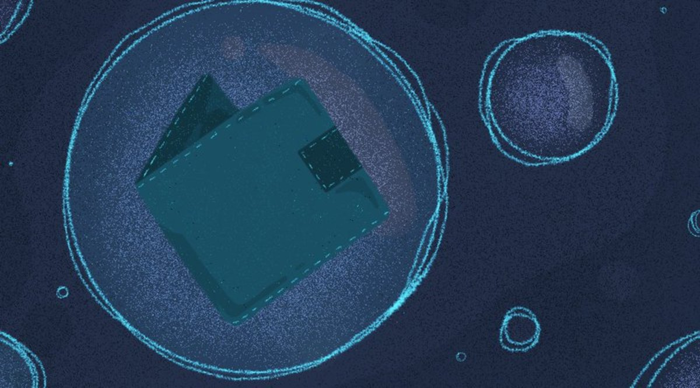

> *作者：Jimmy Song*
> 
> *来源：<https://bitcoinmagazine.com/culture/neutrino-privacy-preserving-light-wallet-protocol>*

近来，闪电网络非常火爆。虽然这是个令人激动的进展，但当前，用户还是必须运行一个全节点才能跟闪电网络交互。在本文中，我准备介绍一下 Neutrino，这种新协议可以让轻客户端获得自己想要的数据，同时保持隐私性并且无需信任任何中心化的服务器。

## 一些历史

在 2008 年撰写的初版白皮书中，中本聪描述了一种叫做 “简易支付验证（Spmplified Payment Verification，SPV)” 的技术。SPV 就是轻节点可以验证支付而无需下载、验证和存储整条区块链的原因。它也基本上是轻钱包基础。难搞的是，最初的 Bitcoin Core 软件没有实现简易支付验证，所以轻客户端无法在保护隐私的同时获得 SPV 必要的数据。

在 2013 年，BIP0037 加入到了 Bitcoin Core 中，SPV 也成为可能。BIP0037 创建了多种网络命令，让轻节点可以发起简易支付验证。此后，轻节点就可以向全节点请求某一笔交易包含在某个区块中的证明。这样一来，轻节点就可以验证返回的数据，同时无需信任服务端了。

为了实现这一点，轻客户端给服务端一个过滤器。服务端对一个新区块中的所有交易运行这个过滤器，并向轻客户端返回符合过滤器要求的交易以及相应的包含证明。然后，这个客户端再验证这个证明，并检查符合要求的交易中是否有属于自己这个钱包的。

但是，BIP0039 依然有缺点。别的不说，它被认为很难实现，所以大部分轻钱包都选择了别的实现方式。举个例子，Electrum 钱包使用了[自己的专有协议](https://electrum.readthedocs.io/en/latest/protocol.html)，并且这个协议是不保护隐私的；Mycelium 钱包调用 Mycelium 公司自己运行的服务器。此外，BIP0037 请求还有拒绝服务式攻击界面可以爆破服务端（比如要求运行大量过滤器）。

此外，BIP0037 的隐私性也被证明并不像想象中的那么强。服务端可以知道许多关于轻钱包的信息（比如 TA 可能有多少余额、TA 可能在跟谁交互、甚至 TA 在买什么东西），办法是找出交易的模式。

结果是，BIP0037 几乎已经被废弃了，尽管它自 2013 年一来就一直在 Bitcoin Core 软件中。

## Neutrino 是什么呢？

Neutrino 是一种验证支付的协议，但不同于以往的协议，在 Neutrino 中，大部分工作都是在客户端完成的。它不是让服务端过滤出客户端需要的交易，而是把一个区块内的所有交易（技术上来说是每一个输入和输出的 ScriptPubKey，除了 OP_RETURN 输出）都会被压缩并发送给客户端。客户端自己分辨其中是否有自己需要的交易。若有任何一笔交易与自己相关，客户端可以请求完整的区块来验证交易。

事实证明，压缩的效果可以是很惊人的。一个普通的区块有 1.4 MB 大小，但压缩之后（技术上来说就是把每一个 ScriptPubKey 都哈希成一个 64 比特的数据），只有约 20 KB。因为这个超级压缩的区块对每个轻客户端都是一样的，所以也没有对服务端拒绝服务攻击界面。这也意味着，服务端无法获得关于轻客户端的特殊信息，只知道对方想要什么区块。因此更少隐私泄露。

## 取舍

当然，增加了隐私性，我们也有别的一些东西要放弃。首先，有更多的数据要来回发送。虽然从 1.4 MB 的区块到 20 KB 的超级压缩区块可以节约大量带宽，但 BIP0037 本身允许更大的节约，如果区块中包含了轻钱包需要的交易，服务端也只需要发送大约 3 KB 的数据；如果没有，那更是只需要发送 80 字节。假设每天有一笔交易相关，那么 BIP0037 按区块平均的开销大约是 100 字节。所以，从带宽的角度看，Neutrino 要贵得多。

此外，客户端要做更多的验证工作，因为客户端现在要通过额外的验证来证明服务端提供的数据是正确的。

不过，在查找交易的时候，钱包的隐私性得到了保持。通常来说，钱包想找的是自己收款的交易。但是，对于发送资金的情形，Neutrino 也没有很大帮助，仍然有许多隐私风险（虽然洋葱网络和 [Dandelion](https://github.com/bitcoin/bips/blob/master/bip-0156.mediawiki) 可以有所帮助）。

最后，有可能必须增加对 coinbase 交易的一个新的承诺，来帮助 Neutrino 的运作，而这需要一次软分叉。

## 这对你有什么影响?

事实证明，Neutrino 不仅对比特币钱包有用，对闪电网络也有用。现在，要建立一个闪电网络节点并不容易，部分原因是你必须运行一个全节点，而全节点需要很长时间来同步。Neutrino 在 btcd 软件中已经可以使用了，但 Bitcoin Core 还不支持；在 Bitcoin Core 支持之前，轻钱包可能要花很长时间来找到愿意以这套协议提供数据的节点。这也使为什么 Wasabi 钱包不得不[让自己的服务器提供类似的超级压缩区块数据](https://medium.com/@nopara73/wasabi-privacy-focused-bitcoin-wallet-for-desktop-3962d567045a)。

等到 Neutrino 加入 Bitcoin Core 之后，闪电网络钱包将能够更容易作为一个轻客户端来运行。这意味着，你的比特币钱包在隐私保护上将高效得多。不是说光凭这个就能做到完全匿名，但你将可以享受到当前的全节点可以享受的大部分隐私性，而且无需存储、传输和验证整个区块链。

隐私泄露最终来说也是安全泄露，因为那些信息可能被用来针对你。

用基于 Neutrino 协议的钱包来发送交易意味着你的比特币交易（无论是链上交易还是闪电网络交易）泄露信息的可能性会更小。

## 更多信息

对 Neutrino 感兴趣的开发者可以看看 [BIP0157](https://github.com/bitcoin/bips/blob/master/bip-0157.mediawiki) 和 [BIP0157](https://github.com/bitcoin/bips/blob/master/bip-0157.mediawiki)，它们详细讲解了这个协议，而且来自 [Lightning Labs](https://lightning.engineering/) 的开发者提供了相应的[测试界面](https://github.com/bitcoin/bips/blob/master/bip-0158/testnet-19.json)。消费者们，则可以询问你的钱包服务商有没有计划实现 Neutrino。

## 结论

Neutrino 是一项迟来的技术。大部分轻节点都必须在某种程度上信任其他人，这不是密码朋克的理想情形。有了 Neutrino，钱包开发者将能够创建完全自我包含而且不需要信任某一个服务端的钱包。

（完）

