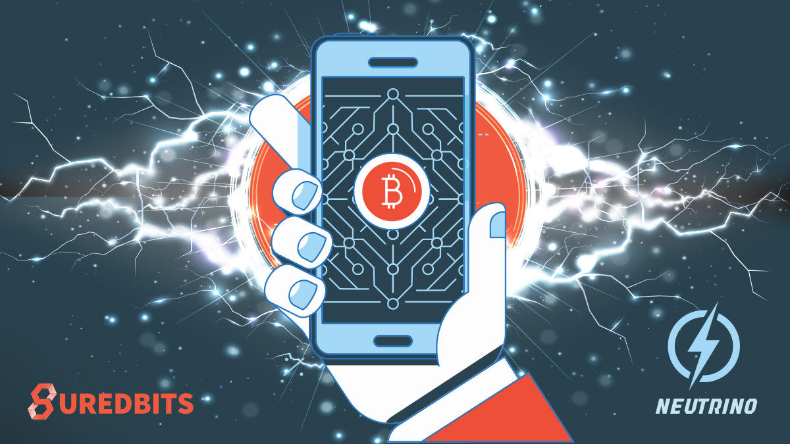

> *作者：Nadav Kohen*
> 
> *来源：<https://suredbits.com/neutrino-what-is-it-and-why-we-need-it/>*

比特币生态即将迎来最新最炫酷的轻客户端实现 —— Neutrino。Neutrino 与目前普遍采用的简化支付验证轻客户端有着天壤之别。在本系列文章中，我们将具体介绍 Neutrino 是什么，它为何有益于钱包，它是如何运作的，以及我们在实现 Neutrino 规范时经历了哪些趣事。

<strong>Neutrino 系列</strong>

<a href="https://suredbits.com/neutrino-what-is-it-and-why-we-need-it/">What Is Neutrino And Why We Need It</a> 
<a href="https://suredbits.com/neutrino-benefits-for-wallets/">Benefits for Wallets </a> 
<a href="https://suredbits.com/how-neutrino-works/">How Neutrino Works Part 1</a> 
<a href="https://suredbits.com/how-neutrino-works-part-2/">How Neutrino Works Part 2</a> 
<a href="https://suredbits.com/implementing-neutrino/">Implementing Neutrino</a>

 

运行比特币全节点是验证比特币区块链，也是确保你能准确获取你自己（以及其他人的）所有交易信息的唯一方法。但是，运行全节点需要消耗大量资源，因为你必须下载每个区块并验证每笔交易，同时追踪所有 UTXO（未花费交易输出）和其它各种数据集。截至撰文时，运行一个全节点至少需要 250 GB 的存储空间（这一下限仍在持续提高）。虽然这一成本对于某些应用场景（如交易）来说不算高不可攀，但是运行一个全节点对于很多比特币用户来说并不现实。

2012 年，[BIP 37](https://github.com/bitcoin/bips/blob/master/bip-0037.mediawiki) 提议了比特币简化支付验证（SPV）节点，可以让用户只追踪最少所需数据，同时保持较低的信任要求。实质上，SPV 节点只下载和更新区块头链，然后告诉它所连接的全节点自己想要了解哪些地址和交易。一旦任何一个目标地址出现在交易内，这些全节点就会通知 SPV 节点。全节点还提供区块内交易的默克尔证明。由于区块内的交易信息记录在默克尔树中（默克尔根存储在区块头内），SPV 节点能够验证区块头是否正确，以及付款是否被打包进了区块。

迄今为止，所有比特币轻客户端本质上都是 SPV 节点。这一方案可以让比特币用户在最低信任要求下运行部分验证节点，同时成本低到可以在智能手机上轻松运行。虽然轻客户端解决了这一问题，但是使用 SPV 节点已知会带来很多问题，其中一些并非轻客户端本身固有的。

第一个问题是，如果一个 SPV 节点的所有对等节点都是恶意的，这个 SPV 节点就很容易受骗。这一问题并非仅存在于 SPV 方案，而是任何轻客户端都要面对的问题（甚至全节点也不例外）。SPV 的另一个已知问题是，服务器容易遭受拒绝服务（DoS）攻击，即，恶意的 SPV 客户端向服务器发送大量无意义的地址，迫使服务器在区块链上无尽地寻找这些地址。

最后，众所周知，当前的 SPV 实现几乎没有为用户提供任何隐私保障。虽然 SPV 客户端没有把自己的公钥给对等节点，却给了与其公钥相匹配的布隆过滤器（[Bloom Filter](https://groups.google.com/forum/#!msg/bitcoinj/Ys13qkTwcNg/9qxnhwnkeoIJ)），同样会泄露其公钥信息。在上文提到的所有问题中，只有第一个（以及某种程度上第二个）问题不是 SPV 专有的。

2017 年 5 月提出的 BIP 157 和 158 引入了一种新型客户端，旨在解决 SPV 节点面临的诸多问题。这些客户端通常被称为 Neutrino 节点。Neutrino 彻底颠覆了 SPV 模型：客户端不再向服务器提供公钥过滤器，而是服务器向客户端提供区块内每笔交易中出现的所有脚本公钥的过滤器。一旦正确实现，Neutrino 就能解决 SPV 的隐私性问题，因为客户端不会将自己的公钥提供给服务器。这也有助于服务器攻克 DoS 弱点，因为区块过滤器只需计算一次，所以新型客户端无法在不花费任何代价的情况下强迫服务器执行复杂计算。

Neutrino 不仅解决了 SPV 节点面临的所有这些问题，还能维持轻量快捷！在主网上，一个新钱包只需 20 分钟不到即可完成初始同步。这意味着你可以在 20 分钟内准备就绪，并在比特币区块链上运行，同时拥有开通闪电网络通道等能力！另外，多数主网重新扫描也只需要 20 分钟左右。

在下一篇关于谨慎日志合约的文章中，我们将深入讨论 Neutrino 会带给钱包哪些好处。另外，我们还将在后续文章中详细讨论 Neutrino 节点的运作原理， 以及我们实现 Neutrino 客户端的亲身经历。

（完）

