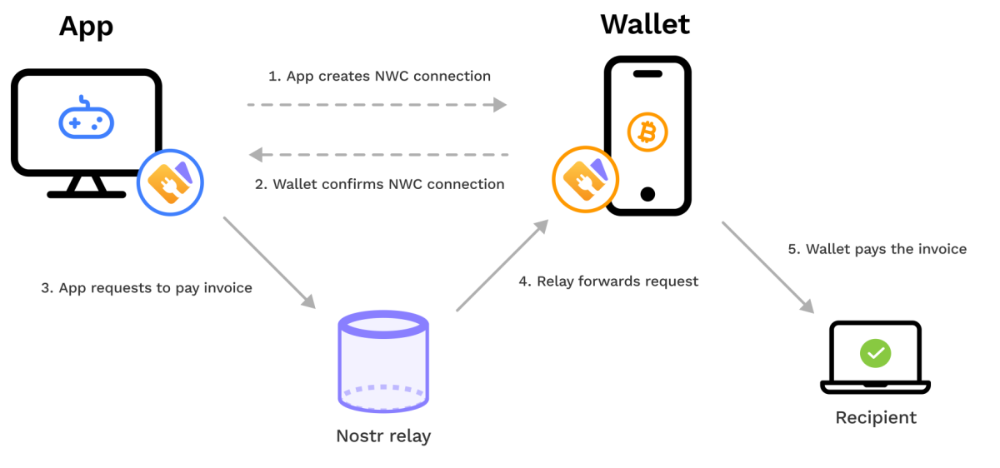

> *作者：SHINOBI*
> 
> *来源：<https://bitcoinmagazine.com/technical/nostr-wallet-connect-a-bitcoin-application-collaboration-layer>*

走向比特币普及和开发的未来，有一个软件交互的问题正在成为开发人员必须面对的首要掣肘因素：兼容性。随着行业里的应用和协议变得更加复杂、特性更加丰富，为了满足真实用户和应用场景的需要，这成了一个根本上只有两种答案的困局：要么，一个应用（或者说钱包软件）必须在内部集成所有的协议，并实现为满足这个目的而必须具备的特性；要么，不同的应用必须能彼此沟通。

暴露出这个问题的一个例子是将闪电钱包集成到不同的应用和软件工具中。但闪电网络是一套实现起来非常复杂的协议栈，它涉及许许多多子协议，都跟如何协调和处理闪电通道的状态更新有关。这涉及用来表达各通道的状态的交易结构、它要强制执行的东西、制作和签名新交易（以保证用户资金安全性）的有序步骤，还有观察区块链以自动化正确应对对手发布过时状态到区块链的功能。

对于一个应用开发者来说，要自己直接集成闪电节点实现到自己的项目中，是非常复杂的事情。显而易见的结论是，如果依赖已经生产出来的软件来处理实现闪电支付的问题很花力气，那就应该直接开发你的应用、让它能跟外部软件通信。但这又带来了下一个问题：要是你的应用的用户并不是使用你选择的那种闪电节点实现（钱包）的话，那又该怎么办呢？

即使可以外包一个应用的功能，开发团队依然无法完全解决这个复杂性问题。虽然他们不需要自己一手一脚实现闪电节点，但选择这条路线的开发者就要为用户可能使用的任何闪电钱包处理合适的 API 支持。这就需要追踪多种闪电钱包的所有更新和变动，从 API，到影响钱包工作的内部特性，以及额外受支持的特性。停止追踪，就会打破（那种钱包的）用户的使用。

需要一些标准化的机制来弥合软件们之间的鸿沟，使得只需实现一个东西就能让所有这些不同的工具沟通。这将让每一种应用的定法这、每一种闪电钱包的开发者，都可以直接集成并维护一套协议，就能让应用之间彼此沟通。

Nostr Wallet Connect 就是在这个方面做出尝试的一套协议，它想成为满足这个需要的一套真正通用的机制。在尝试在 Nostr 客户端中嵌入闪电支付功能时，所有这些复杂性都来源于嵌入的方式。

## 闪电网络与 NWC

Amethyst（一种 Nostr 客户端）和 Alby（一种网页版闪电钱包）背后的团队创造了 NWC 协议以解决 Nostr 用户希望在 Nostr 使用体验中集成闪电支付就需要使用专用钱包的问题。这套协议基于 Nostr 的身份架构：每一条通过 Nostr 协议发送的消息（在 Nostr 协议中称为 “event”）都由一个用作身份的密钥对签过名。这让应用可以直接生成一个 Nostr 密钥对，然后仅凭这一点实现一种密码学身份校验机制，从而跟外部的比特币钱包通信，以满足应用的需要。

使用这个密钥对在闪电钱包中登记外部应用，这个应用就可以通过你的钱包来发起一笔支付。当前的 NWC 规范支持支付 BOLT11 发票、keysend 支付（根据闪电节点的公钥发起的无发票支付）、同时支付多个发票、生成一个发票给要给你支付的人，以及允许应用查询支付历史和钱包余额的少量其它功能。

所有这些都是通过 Nostr 来协调的，这就允许使用多种多样的通信路径，不必依赖于单种即时通讯机制，也不需要依赖于复杂的软件（例如 Tor）或其它用于协调应用与（运行在用户家庭网络中的）钱包软件的网络连接新的协议。Nostr 也支持加密的直接通信，意味着钱包和应用之间的通信是完全私密的，不会向负责通信的 Nostr relay 泄露通关于支付的细节。

在 NWC 桥梁的钱包这边，可以实现安全限制，以在用于通信的 Nostr 密钥被泄露的时候阻止应用无拘无束地花费资金。 钱包端可以配置允许花费的数额、支付的频率。

NWC 的用法还不止于在 Nostr 应用中集成闪电支付。作为一套协议，Nostr 自身的设计哲学以简单为核心，简单到任何开发者只需少量时间和参考就可以正确实现整套协议。与 Nostr 无关的应用也容易集成 NWC 或类似的协议，几乎没有额外的运行开销和复杂性，就可以解决让自己的应用连接比特币的底层问题，而无需在应用中直接开发。

## 闪电网络之外

NWC 这样的协议，还有望为钱包和应用开发者提供巨大的价值，远不止集成闪电钱包到自己的应用中而已。除了一些已经萌发根本性突破的头脑，很少有人意识到，与比特币钱包交互的长期方向，是协助多个用户用户之间的交互式协议。

多方的 coinpool 就是一个最好的例子。大部分的设计提议，比如 Ark 和 “超时树”，都围绕着一个中心化的协调方，也可以叫服务商，服务商可以容易地指定用户钱包之间传递消息的工具，但这就让设计空间受限于这个单点故障。假设 100 名用户参加一个 coinpool，他们的资金都放在一个 UTXO 中，而它的安全模式是，每个用户都有一个预签名的路径，可以单方面在链上取出自己的资金。在出现故障或者服务商消失的时候，可以使用这种机制来保证资金不丢失，但这从根本上来说，这是一种能够应对故障，但低效的方法。

如果用户可以找出一种让彼此可以通信的机制，那就可以使用高效得多的合作退出操作：他们可以使用大群组的多签名来转移资金，这样占用的链上空间会更少（因此会更加便宜）。NWC 和 Nostr 是绝佳的工具。

多方之间的合作式多签名钱包也可以受益于这样的协议。结合 PSBT 这样的标准，简单的 Nostr 通信机制就可以极大地简化支持多签名特性的不同钱包协作签名交易的复杂性，让签名过程变得平滑，而且对用户友好。

谨慎日志合约（DLC）是这样的协议的另一个神奇应用场景。DLC 的整套机制都依赖于，参与合约的双方都能获得断言机的签名，从而能够单方面地正确关闭合约，即使对方不愿意合作，也不影响最终的结果。Nostr 也是断言机发布签名的完美机制。并且用户的钱包只需订阅断言机的公钥，就可以自动地跟踪和获得广播出来的签名。

以后，会有越来越多需要用户间交互、应用间交互的应用和协议建立在比特币上，没有单点故障的通用通信机制是绝对必要的。

Nostr 的惊人简洁性，以及可以利用大量 relay 的冗余性，使之成为了协助这些交互的绝佳顶层机制。NWC 就是它成为一个可用解决方案的最好例子。

（完）