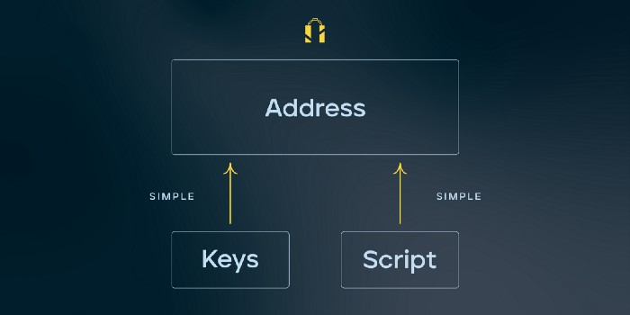
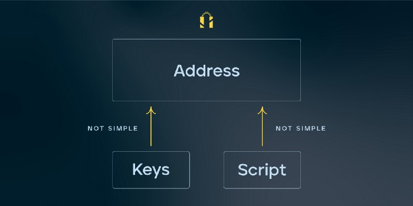
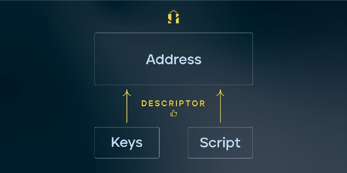

> *作者：Nunchuk*
> 
> *来源：<https://medium.com/nunchuk/not-your-keys-not-your-coins-is-not-enough-ef0be520715a>*

这句口号 “Not Your Keys, Not Your Coins（无钥即无币，币钥为一体）”（据说是比特币布道者 Andreas Antonopoulos 首创）在比特币社区内已经流行了一段时间，意思是只有私钥的持有者才真正拥有私钥控制下的比特币。

（译者注：原句严格来说是以否定形式表达的必要条件：只有你自己拿着私钥，那些币才真正属于你；但作者在这里将它解释为充分条件：只要你拥有私钥，你的币就不会丢；进而开展文中的讨论。所以中文翻译将者两个意思合在了一起。）

这句口号虽然在比特币诞生初期所言不假，但是时至今日已经脱离现实，而且过于片面。究其原因，越来越复杂的私钥生成和智能合约（包括但不限于多签机制）是关键。

**由于我们在 Nunchuk 的使命是推广多签，当务之急就是消除人们的误解。**接下来，本文将解释为什么这句口号已经过时。

## 基础知识：比特币地址

比特币地址由两个组件构成：（1）数据组件，（2）解释应该如何使用这些数据锁定比特币的脚本组件。

在比特币诞生初期，数据组件和脚本组件都非常简单。数据通常是一个未经过压缩的公钥。脚本组件同样很简单，要么包含一个操作 OP_CHECKSIG (P2PK)，要么包含稍微长一点点的一列操作（P2PKH）。无论哪种都是高度可预测的。归根结底，这个时期的比特币地址就像是公钥的别名。

在这种情况下，“币钥为一体” 说的没错。任何掌握私钥的人都可以推断出公钥，并根据公钥推断出地址。

掌握私钥意味着：

- 我们知道自己的比特币存储在哪个地址上

- 一旦我们知道了地址，该如何解锁比特币也就不在话下

## BIP16/BIP32



自比特币从 [BIP16（P2SH）](https://github.com/bitcoin/bips/blob/master/bip-0016.mediawiki)开始引入更先进的脚本功能起，事情起了变化（译者注：P2SH，顾名思义，给比特币脚本的哈希值支付，在链上曝光的只是哈希值而不是具体的操作，很复杂的脚本也只压缩成一个哈希值）。P2SH 赋予了脚本组件几乎无限的可能性。 [Peter Todd](https://bitcointalk.org/index.php?topic=293382.0) 的寻找密码学哈希碰撞赏金计划就是个很好的例子。不过，P2SH 更典型的应用场景是多签钱包，钱包内的资金由不止一把公钥控制。

由 P2SH 实现的多签钱包让地址变得不可预测，因为相关公钥的排序影响很大。例如，一个 2/3 P2SH 多签地址有 6 种不同的生成方式，取决于我们如何为 3 个公钥排序。如果我们没有备份 redeemScript（里面包含了多签公钥的顺序）（译者注：即 P2SH 的哈希值的脚本本体），我们可能不知道哪个地址是自己的。不过还有一丝希望，因为我们可以尝试所有排列组合。但是，这种暴力破解方法不仅成本高昂，而且不具备可扩展性，详见后文。

比特币地址中的私钥部分也有了发展。P2SH 创建后不久，分层确定性（HD）钱包诞生了，之后在 [BIP32](https://github.com/bitcoin/bips/blob/master/bip-0032.mediawiki) 中实现标准化。在 HD 钱包出现以前，钱包就只是互无关联的私钥的集合。HD 钱包创建了一个私钥分层结构，因此所有私钥都属于同一个家族，由同一个根（又叫主私钥）生成。

HD 钱包同样让地址变得难以预测。对于 HD 钱包中的每个地址，我们都需要知道对应公钥来自主私钥的哪一支派系。这就叫作 BIP32 派生路径。

总而言之，BIP16 和 BIP32 的采用意味着仅持有私钥已经远远不够了。我们可能还需要 redeemScript（针对 BIP16） 和派生路径 (针对 BIP32)，才能完全 “拥有” 比特币。

## SegWit 和 Taproot

[Segregated Witness](https://en.bitcoin.it/wiki/Segregated_Witness)（隔离见证）激活后，事情变得更加复杂。隔离见证是一组备受期待的协议更新，用来解决交易不定形（transaction malleability）等关键问题。

SegWit 引入了一种新的改良地址格式 Bech32。

问题是，现在我们可以通过更多方式根据单个主私钥生成地址。对于每种地址类型（目前有 3 种：传统型、原生 SegWit 型和被称为嵌套 SegWit 的混合型），我们都要面对与 BIP16 和 BIP32 同样的问题，最终通过一级又一级的排列组合找出所有可能的地址！

排列组合层级：

1. 地址类型
2. 脚本类型
3. 派生路径
4. 私钥顺序（针对多签）

这就是我们今天面对的情况。地址的私钥组件和脚本组件已经变得非常复杂，持有私钥只是获得资产所有权的条件之一。

在此期间，钱包提供商尝试通过自己特有的方式来应对不断提高的复杂性，结果却很不理想。首先，钱包之间的兼容性降低。例如，假设你通过某个提供商创建了钱包，想要通过另一个提供商找回该钱包，必须查找谜一样的 “找回路径” 并手动运行转换脚本（这个过程很容易出错）。其次，像 YPUB/ZPUB 这样糟糕的概念被创造出来，使得找回过程变得更加复杂，给用户造成更多困扰。我们将在另一篇文章中讨论 YPUB/ZPUB，以及为什么应该避免它们。

事情还没有结束。比特币很快就会引入更先进的脚本功能，如 [Taproot](https://github.com/bitcoin/bips/blob/master/bip-0341.mediawiki)。当 Taproot 激活时，地址的排列组合数量将进一步增加。

## 解决方案：描述符语言



可能是意识到了这一问题的严重性，核心开发者 Pieter Wuille 开始着手解决它。Pieter 发现我们真正缺少的是一种更高级的语言来驯服这种可怕的复杂性。他的解决方案 [Output Descriptor language](https://github.com/bitcoin/bitcoin/blob/master/doc/descriptors.md)（输出描述符语言）优雅地解决了这一问题。

描述符语言旨在更精确地表达私钥是如何派生的，以及如何用来创建地址的。

有了描述符，用户只需要为他们的钱包备份两个东西：主私钥（或 [BIP39](https://github.com/bitcoin/bips/blob/master/bip-0039.mediawiki) 助记词）和描述符。这样就不会再有任何不清楚的地方，无论是找出自己的链上地址，还是如何使用第三方工具找回钱包。

未来，将所有比特币钱包都转变为描述符优先的架构非常重要。

“无钥即无币，币钥为一体” 的时代已经结束了。或许现在更适用的表述是：

“**私钥是前提，但已不足用。存好描述符。币即在其中**（**Not your keys, not your descriptors, not your coins**）。”

（完）