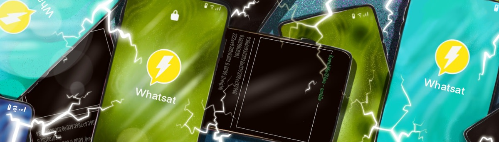
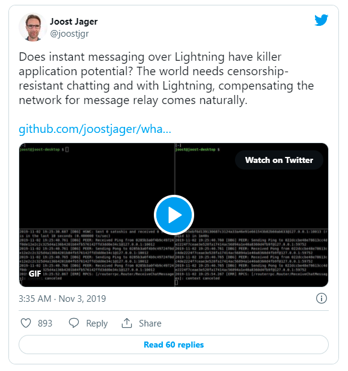
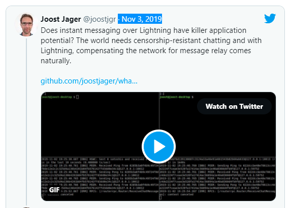
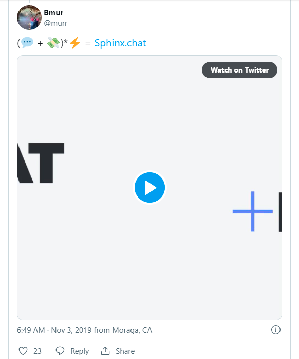

> *作者：COLIN HARPER*
> 
> *来源：<https://bitcoinmagazine.com/culture/on-lightning-messaging-apps-emerge-as-growing-use-case>*

- 闪电网络的本意是实现低成本、抗审查的私密交易。然而，即时通讯应用即将登陆闪电网络。这一“杀手级应用”会比传统的加密通讯平台更能赢得用户的青睐吗？ -

“闪电网络上的即时通讯应用有成为爆款应用的潜力吗？”

Lightning Labs 开发者 Joost Jager 首次发布他在闪电网络上的通讯应用 Whatsat 的 demo 时如是问道。

在一般的比特币用户眼中，即时通讯大概率不会成为闪电网络上的杀手级应用场景，至少在微支付、流支付面前还不够格。Signal、Keybase 和 Wire 等加密通讯应用会是他们的首选。

像 Facebook 的 Messenger 和 WhatsApp 这样的主流通讯应用则相形见绌，因为它们的加密选项充其量就是装点门面，在保密性上并没有实质提升。但是，Jager 认为加密通讯需要具备的不只是隐私性，还有抗审查性。闪电网络通讯恰好可以发挥用武之地。

Jager 告诉《比特币杂志（Bitcoin Magazine）》：“闪电网络通讯应用在加密性能方面与传统加密通讯应用相似：消息内容都是私密的。区别在于前者没有中心化服务器，既无法一举切断所有通讯，又无法有选择性地拒绝为特定用户提供通讯服务。”

## Whatsat：解决老问题的新方法

与比特币的基础层一样，闪电网络自上线之时就已支持通讯功能。[Blockstream Satellite](https://bitcoinmagazine.com/articles/messaging-via-blockstreams-satellite-lightnings-killer-app) 已经在闪电网络通讯实验中得到应用。此外，一些[私人短讯服务](https://bitcoinmagazine.com/articles/used-lightning-payments-private-sms-messaging-heres-worked)已经采用了闪电网络支付。不过，[经过近期的调整](https://github.com/lightningnetwork/lightning-rfc/pull/619)，闪电网络协议能够让用户更轻松地在付款时附带额外的数据，并使用类型-长度-值（type-length-value，TLV）负载将该数据传递给其它应用。

TLV 负载能够让用户使用通信协议将额外的无关数据附加到数据包上。就 Whatsat 而言，无关数据将作为消息绑定到闪电网络交易上。

Jager 表示，启用 TLV 负载的更新为 Whatsat 之类的构想铺平了道路。这类构想不仅满足了抗审查性的需求，还能通过改进消息的发送或路由方式为终端用户带来更为私密的通信体验。

Jager 告诉我们：“在闪电网络上聊天会让通信双方的身份变得更难识别。用户之间无需建立直接（可监控）的 TCP/IP 连接，也不存在能够重建通信路径的中心化服务器。”

在闪电网络上，消息（交易）是经过洋葱路由传送的，就像通过 Tor 网络发送的信息那样。消息在节点之间传递，每个节点只能识别向其发送消息的节点以及下一个排队等待接收消息的节点。

Jager 承认，如果一条路径上的绝大多数节点都由同一个实体运行，该实体就有可能识别通信双方的身份。

Jager 接着说道：“隐私性和安全性都是相对的。”

在某些情况下，用户之间建立直接的付款通道或许更好。例如，如果有 “监控者”或“攻击者”想要通过监控节点来揭露某个匿名用户的身份，那么如上文所述，经洋葱路由传送的付款的隐私性可能会受路径的影响而大幅降低。在这种情况下，直接付款通道的隐私性会更高。但是，如果监控方是互联网服务提供商（ISP），追踪的是 TCP/IP 地址，洋葱路由的隐私性更高。

直接通道能够提供完全免费的通讯服务，但是一些用户可能认为，相比在隐私性上得到的好处，这一优点根本微不足道。例如，闪电网络通讯已经是一项免费服务：消息发送者只能将消息作为付款的附加信息发送给接收者，但是接收者在打开消息后可以拒收付款（以 Whatsat 为例，表明付款已被拒绝的“退还发送者”消息就是对原始消息的确认）。

就像闪电网络支付那样，闪电网络通讯很有可能会催生出一个费用市场，为那些没有开启直接通道的用户提供消息路由服务。Jager 表示，这可以被视作一个缺点，但是一些用户或许愿意为了享受抗审查的私密通信服务而付出一些代价。

“在付出代价的同时，我们也会收获好处，”Jager 解释道，“如何权衡取决于用户对现有通讯系统弊端的认知程度。对大部分人来说，某个权力机构阻隔两个人之间的通信这种事只存在于想象世界，如果发生在现实世界，听起来就像恐怖的科幻小说。但是，在数字领域，这是绝大多数用户在通信时面临的现状。”

Whatsat 目前在测试网上运行，其[源代码在 GitHub 上](https://github.com/joostjager/whatsat)。但是，别指望 Jager 会很快发布 beta 版。在与 Jager 的对话中，他曾提到 Whatsat “只是概念证明”，而且是他的个人项目，与 Lightning Labs 无关。他希望这个因爱好而生的项目将 “激励其他人开启在闪电网络上的开发之旅”。

## Sphinx Chat：殊途同归

一些开发者已经开始探索起了闪电网络通讯的“高阶玩法”，而且即将发布内测版，不过没有参考 Jager 的源代码。

例如，Sphinx Chat 已经运营快一年了。项目负责人 Paul Itoi 告诉《比特币杂志》，其团队在纽约举办的 2018 年闪电网络黑客松上东拼西凑出了一个原型。据 Itoi 透露，在今年（注：2019 年）的[柏林闪电网络大会](https://bitcoinmagazine.com/articles/scam-or-iteration-in-berlin-bitcoin-diehards-still-believe-in-lightning)上，其团队发布了一个“面向 TestFlight 上一小部分用户的粗糙版本”，但是他们计划在近期发布新的 beta 版。



Sphinx Chat 得名于 [Sphinx protocol](https://bitcoinmagazine.com/articles/how-the-lightning-network-layers-privacy-on-top-of-bitcoin-1482183775)。[Sphinx protocol](https://bitcoinmagazine.com/articles/how-the-lightning-network-layers-privacy-on-top-of-bitcoin-1482183775) 是一项升级，能够在类似 Tor 的网络上通过洋葱路由的方式传送闪电网络交易。Whatsat 同样使用该协议来达到一定程度的隐私性。但是，Whatsat 不像 Sphinx Chat 那样只局限于 TLV 负载通讯，它还提供针对直接通道的免费通讯服务。

Itoi 告诉我们：“这两个项目都差不多。但是，[Jager 的项目]旨在避免交易费，因为它利用失败的付款来传递消息。目前，这种方式现在在闪电网络上是免费的。Sphinx 则将消息放入 [TLV]，使用 keysend 付款进行传递，需要按标准支付交易费。”

但是，TLV 尚不足以支持大规模通讯。就 Sphinx Chat 运行的闪电网络实例 LND 而言，该团队仍需在接收者一端启用 TLV 通讯。接收者虽然能够接收数据，但是无法处理数据。

Lightning Labs 正在[ GitHub 上](https://github.com/lightningnetwork/lnd/issues/3670)跟进这一问题。但是，在找到解决方案之前，Sphinx Chat 将依赖 Nodl 的特定节点来中继消息（这些自定义节点完全支持 TLV 负载）。

Itoi 告诉我们：“我们会继续在这些节点上运行 beta 版，直到功能正式上线为止。”

ltoi 补充说，一旦告别 beta 版，Sphinx Chat 将完全开源。这时，节点运营者可以建立消息中继费用市场，就像 Whatsat 那样。ltoi 将 Sphinx Chat 看作是 [StakWork](https://www.stakwork.com/) 的互补应用，后者是一个使用比特币支付报酬的外包应用。例如，StakWork 上的雇主可以通过 Sphinx Chat 通知受雇者，并向其付款。

## 加密通讯的未来

说到闪电网络通讯，或许你的脑海中冒出的第一个问题是：既然我们已经有了可靠的加密通讯应用，为什么还要开发这些新应用？

Jager 承认，这个问题确实切中了“要害”，因为“闪电网络比中心化服务更复杂”。另外，利用像闪电网络这样的去中心化系统“很难带给人们习以为常的用户体验，例如，如何向离线用户发送消息。闪电网络付款也面临同样的问题。”

尽管如此，那些认为闪电网络通讯优于中心化通讯应的人并非毫无道理。由于闪电网络是去中心化的，基于闪电网络的通讯应用具有更强的抗审查性，而且能够避免因单点故障而造成的服务宕机。Itoi 认为闪电网络通讯是不可或缺的，因为它将付款和通讯结合成了一个免许可实体。

Itoi 指出：“闪电网络通讯的主要优点是让用户能够使用同一个身份进行付款和通信。我们的核心信仰是：要让闪电网络为通信和付款提供同等水平的隐私性和抗审查性。将闪电网络应用于通信有助于加快比特币成为交换媒介的进程。”

这也为基于闪电网络的论坛提供了可能。从理论上来说，这类论坛有助于减少垃圾消息，因为每发送一条消息都是有成本的，就像 Sphinx Chat 那样。Itoi 认为通讯不仅限于人与人之间。根据他的设想，API 和物联网设备将来也能通过闪电网络彼此通信和付款（抱歉啦，[IOTA](https://www.iota.org/)）（译者注：IOTA 是一个主打可在物联网设备间实现通信和支付的项目）。

就像很多在比特币上构建的新兴应用和功能那样，闪电网络通讯仍有很长一段路要走。我们还需要思考另一个问题：除了可用性，用户是否愿意接受付费通讯。这种模式不禁让人回忆起过去按条收费的短信服务，尽管它会比后者便宜得多。闪电网络通讯的成本可以低至 1 satoshi 及以下，具体取决于路由消息的难度。

尽管如此，这样一种低成本、强隐私且抗审查的通讯应用有望面世（也有可能需要很长一段时间），Jager 依然非常看好它的应用场景。

“这并不意味者基于闪电网络的通讯服务永远无法具备像现有服务那样的易用性”，Jager 解释道，“我们当然还要付出很多努力，但是我不会断言这是不可能的。目前，人们普遍不会觉得现有的通讯服务有什么问题……但这只是当下的情况。未来或许会有变化。或许现有的通讯服务会改变其商业模式，或许会爆出大量元数据泄露的丑闻……我无法预料未来会如何，但是我认为探索替代方案是明智之举。”

（完）