> *作者：Gigi*
> 
> *来源：<https://twitter.com/dergigi/status/1425202084782264326>*

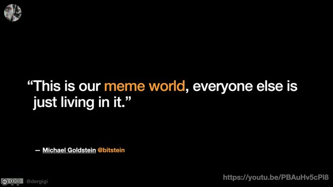

- “这就是我们的 meme 世界，每个人都生活在其中。” -

首先借用 [@bitstein](https://twitter.com/bitstein) 的这句话作为开场白。

这里，我要讨论的主题并非 meme，因为 Bitstein 已经剖析得很透彻了，我无论如何都无法超越他。我要探讨的是 “meme” 与 “世界” 之间的差异。

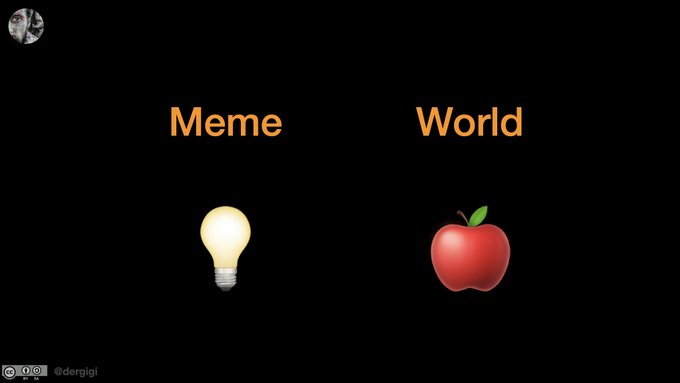

meme 是思想、观点和信息。

“meme 是文化实践和想法等文化信息的单位，通过口述或重复行为从一个人的脑中传递给另一人。”

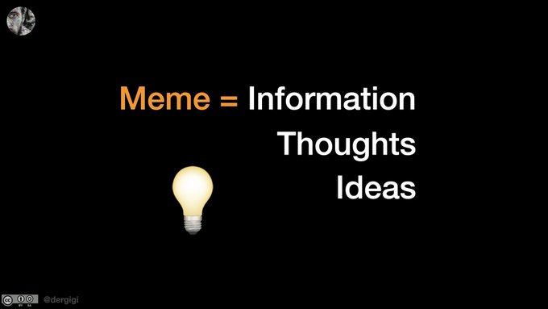

我们的世界是由物体而非 meme 组成的。所谓的物体，就是遵守物理学定律的有形物质。

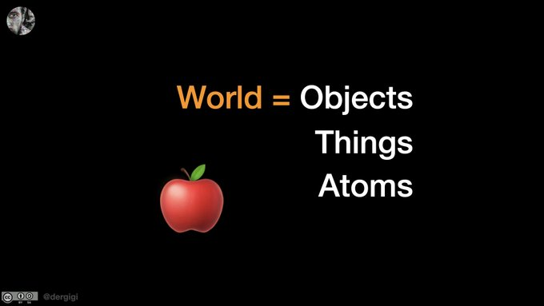

信息体和物体之间存在很大差别。它们的行为方式是不同的。我们可以将二者之间的差异转化为我们的优势。

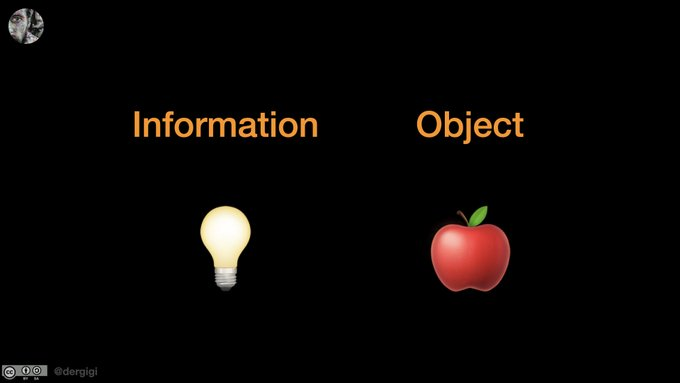

有句英语名言一语中的： “The map is not the territory（地图不等同于版图）”。地图可以说谎，现实却不会。

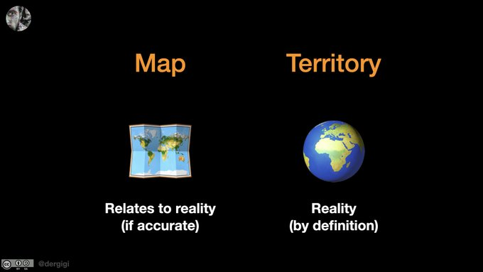

地图所绘可能与实际版图相似，但总是不完美的，因为地图和版图之间永远不存在一比一映射。现在如此，将来依旧如此。不可能就是不可能。

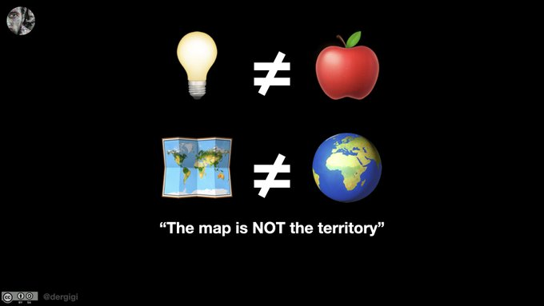

艺术家知道这点，哲学家知道这点。整个社会都知道这点。地图不等同于版图。下面这幅图也不是真的烟斗。

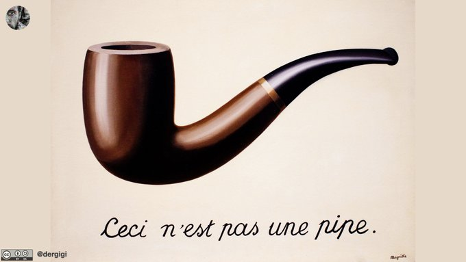

说句题外话，这也是法币的问题所在。法币就是没有现实基础的 “地图”。这个 “地图” 早就脱离了黄金和白银，成了无源之水、无本之木。

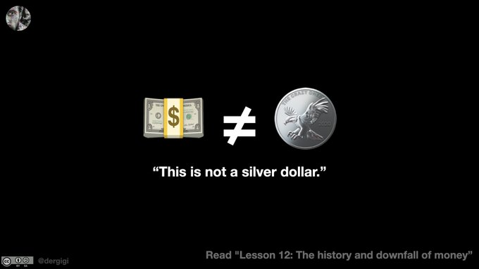

回到正题：信息是可以自由分享的。它不像物体具有稀缺性。你分享了自己的观点之后并不会失去它。将信息从一个媒介 “转移” 到另一个媒介的唯一方法就是复制它。

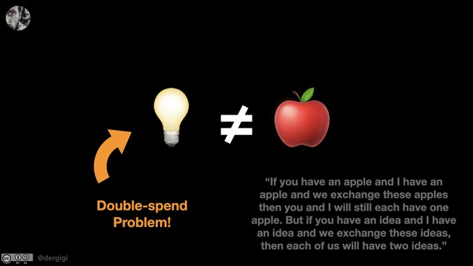

理解这点很重要，因为你会发现货币就是信息。

货币信息可以通过两种方式表示：信息列表和物理代币。“账本” 和 “代币” 代表的都是谁拥有什么、可向谁要求利益。

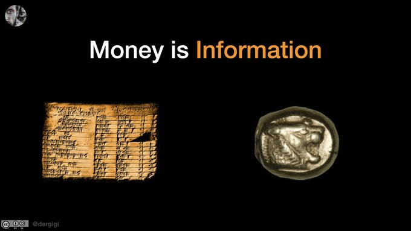

物理代币不证自明，信息列表则不然。信息列表有双重花费问题，需要信任，存在交易对手风险，而且有可能脱离现实。物理代币就没有这些问题。这就是为什么我们会说 “现金为王”。

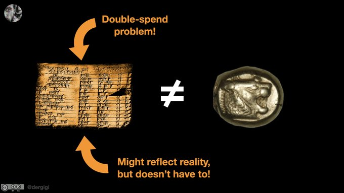

另外，物理代币通常造价高，无需许可即可使用，而且验证难度低。但是，物理代币也有问题：它们可以被暴力夺取和伪造。

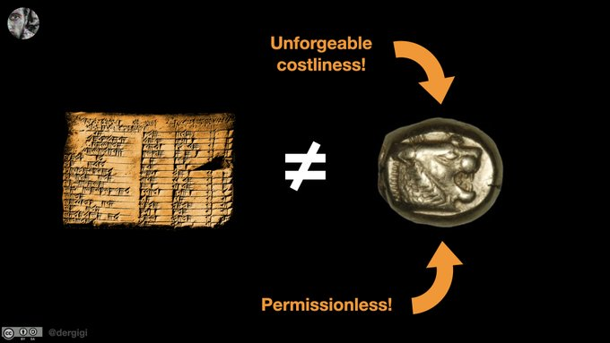

根本问题是：当你试图将现实映射到信息领域时，就是对当前世界状态拍摄了 “快照”。地图永远与现实世界脱离。说好听点是快照，说难听点就是谎言。

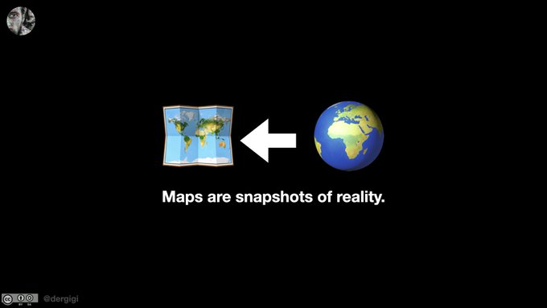

每当你将某个现实世界的物体表示为信息时，都会遇到信息断言问题（oracle problem）：你必须相信某人提供的信息准确反映现实。另外，你还需要依赖一个第三方在现实世界发生变化时更新信息。

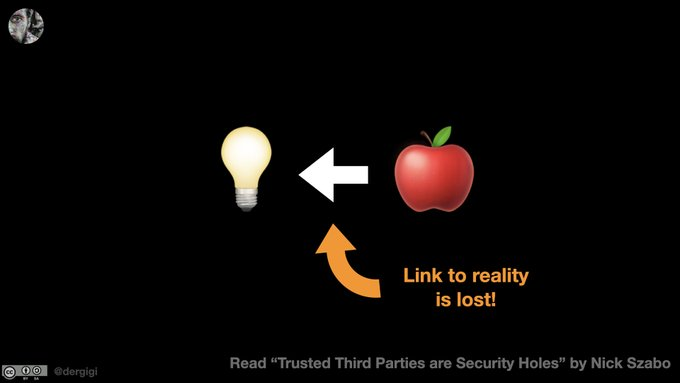

为了确保地图和版图同步，你需要一种神奇的信息列表，能够随着现实的变化而自动更新。这通常通过中心化方式解决：将一个信息列表作为事实来源，由可信机构负责更新该列表。

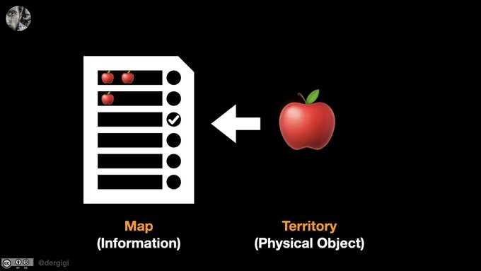

这就是为什么 “区块链上的香蕉” 和 “黄金背书的密码学货币” 行不通的原因。没有物体可以在不依赖可信第三方的情况下 “放到区块链上”。

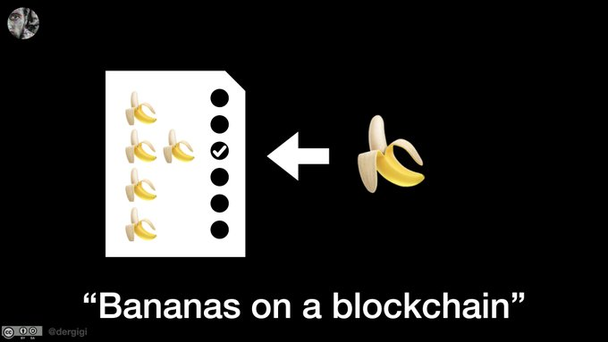

同理，数字香蕉和数字香蕉哈希值也一样。物体的哈希值好比是指纹，与物体本身不存在永恒的关系。二者本质上是割裂的。

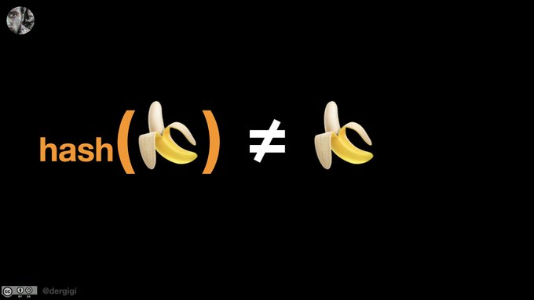

NFT 没有改变这一点。你 “拥有” 的图片可能会丢失、损坏、被复制或重新经过哈希计算再卖给另一个傻瓜。你拥有的是某个非稀缺物的哈希值，你无法单靠它来重塑这个物体。你拥有的只是被歪曲的地图，而非版图。

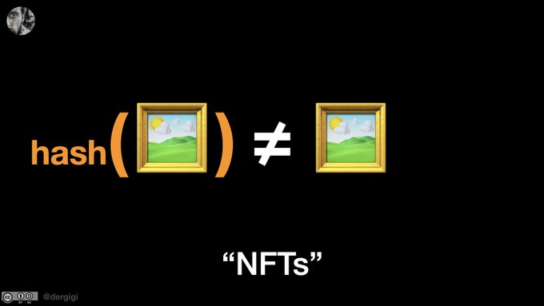

比特币则反其道而行之，解决了这个问题。比特币以信息为起点，通过持续操作来创建自己的现实。

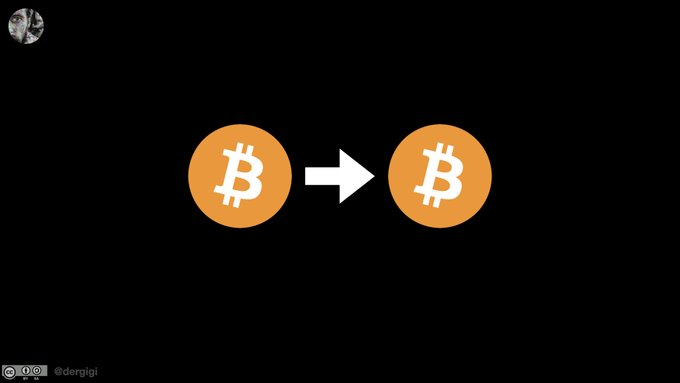

比特币不仅定义了地图，而且暗示了版图。所有参与者都自愿 “生产” 比特币，共享现实得以形成。

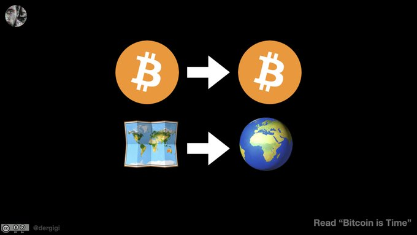

为了运行比特币这一信息体，我们需要消耗实实在在的电能。不付出现实世界中的真实成本，你就没法遵守比特币协议定义的规则。

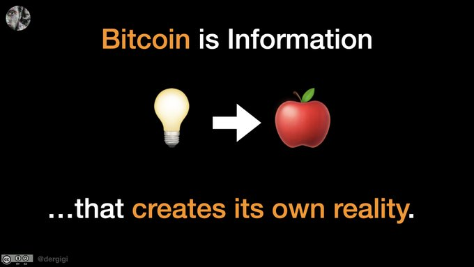

当然了，比特币并不能创造出苹果。它只能创建区块，即，符合特定模式的信息体。遵守该模式需要计算。计算则需要消耗时间和能源。

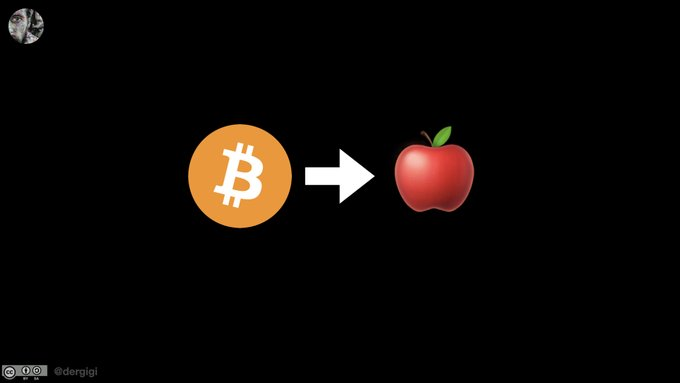

换句话来说，比特币这一信息体启动了一台机器（你也可以称之为比特币世界的发动机），会输出有效的账目。

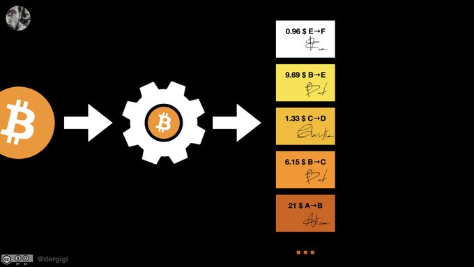

中本聪的天才之处在于通过内置难度调整机制来确保发动机不会停止。正是难度调整让比特币成为了一个自我再生系统：能够自我生产和维护。

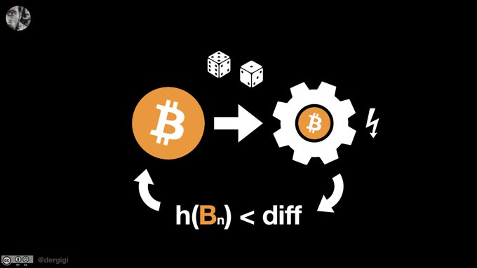

这一切之所以有效，是因为工作量证明需要消耗能源。在这上面，你无法弄虚作假、讨价还价，更别想做无本买卖。你必须消耗实实在在的电能来创建有效的比特币区块。

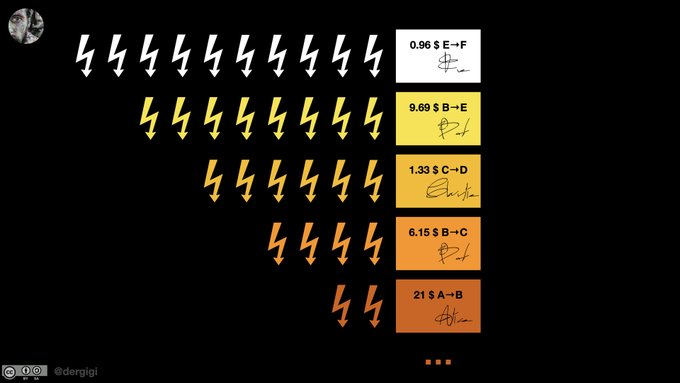

虽说其中的关系只有一定概率为真，但这没什么大不了。我们只看信息（不看其它）就可以对现实世界发生的事情做出足够准确的陈述。现实在一定概率上是直接包含在信息中的。

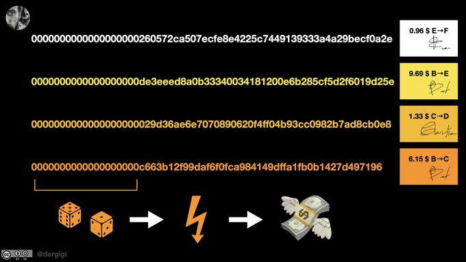

因此，在比特币系统中，地图等同于版图。我们只看地图就可以推断出我们关心的一切。我们通过概率推理来推断宇宙中必须发生什么事才能让我们获得想要的数字。

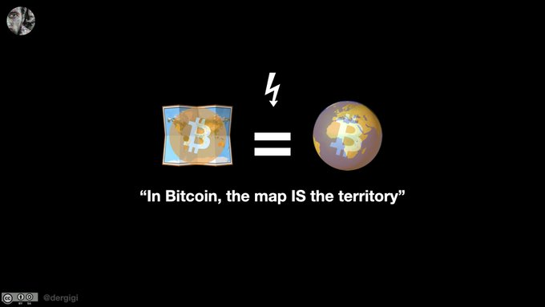

如果你想明白了这一点，一定会颠覆你的认知。仅仅通过一个数字，我们就可以基于热力学、信息和概率论对现实世界进行准确的推断。

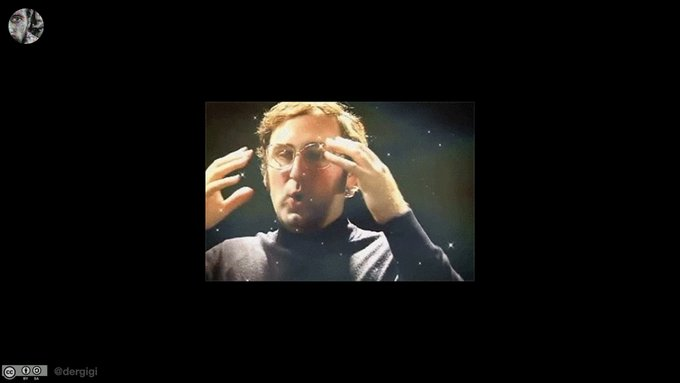

因此，比特币时间链是对过去事件最可信的记录。如果有人问 “这件事真的发生过吗？”，没有信息能比比特币时间链更具确定性。

正因如此，比特币能够成为未来世界的基础层。

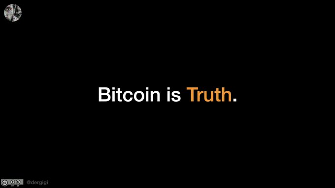

过去几年来，我获得了无数人的支持，这就是为什么我常把 “比特币就是爱” 挂在嘴边。虽然我说这话时是半开玩笑的，但事实就是如此。

所有交互都是非强制性的，而且必须如此。观点本身是非暴力的。

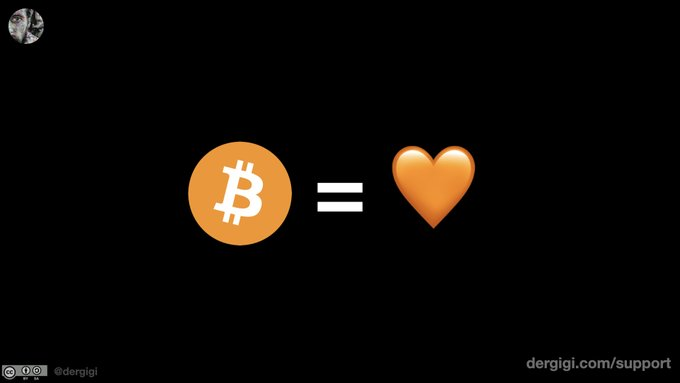

反对比特币就是在反对一个以自愿加入为原则的全球网络。这个网络唯一的功能就是利用数学和物理学通过信息交换来实现价值转移。

游戏已经开始，和平、友爱和真理都站在我们这方，我们将成为最后的赢家。

拭目以待吧。

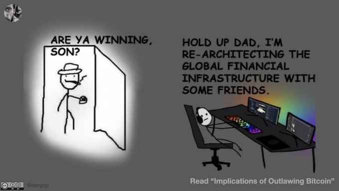

又：我希望能尽快公开这份幻灯片和相关的原始材料，并在我的下一本书写得足够好的时候尽快公开相关的章节。

这里有一份原始演讲的记录，是用德语作的：<https://www.youtube.com/watch?v=n9OWZq5z49I&t=29409s> 。

又又：这个演讲受到 [@nvk](https://twitter.com/nvk) 的一条评论的启发 —— 他当时尝试向 [@lexfridman](https://twitter.com/lexfridman) 解释这里的一些东西。我也尝试了，但我当时还被 Lex 屏蔽着。

（完）