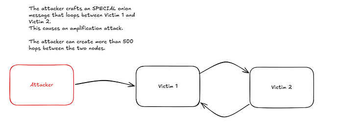

> *作者：erickcestari*
> 
> *来源：<https://delvingbitcoin.org/t/onion-message-jamming-in-the-lightning-network/2414>*

## 背景

BOLT 4 承认了洋葱消息路由（onion message routing）天然是不可依赖的，并且推荐各软件实现应用速率限制。一种常见的额外措施是仅仅转发来自有共同通道的对等节点的洋葱消息。

当前所有支持洋葱消息转发的实现都强制执行了入站消息的速率限制，并且会抛弃超出这个阈值的任何消息。 LND 还没有推出洋葱消息转发特性，但也将包含速率限制。这样做可以保护节点，但对保护整个洋葱消息网络没有意义。当前的实现中，没有任何一个使用了由  t-bast 提出的基于反向传播（backpagation）的方法（讨论见下文第三节）。

- **Core Lightning**：token bucket（“token 桶”）允许每个对等节点每秒最多发送 4 条洋葱消息。超过这个速度的对等节点会收到一条警告消息，并且后续的洋葱消息会被静默地丢弃，直到 token 容量恢复。
- **Eclair**：硬上限为每个对等节点每秒发送 10 条洋葱消息。只从共享通道的对等节点收取洋葱消息，也只转发给他们的消息。
- **LDK**：降低洋葱消息的优先级而不是实用严格的速率限制。总是先发送通道消息（包括 ping/pong）。只有出站缓存池为空时，才将洋葱消息加入队列，并且每个处理周期最多发送 32 条消息。
- **LND**：每个对等节点有限额 50 条消息的邮件箱，并且带有 “随机提早丢弃（RED）” 机制。从邮件箱用掉 80% 的容量（存放了 40 条消息）开始，消息会被随机丢弃，并且丢弃的概率会线性上升，直到邮件箱被占满，所有新到达的消息都被丢弃。一个[已经开启的 PR](https://github.com/lightningnetwork/lnd/pull/10713) 添加了一种两级的 token bucket 速率限制（按对等节点分置以及全局控制），应用在开始密码学处理之前，抛弃超过限制的洋葱消息（而不是排队）， 并限制为仅从共享通道的对等节点处接收洋葱消息。

本文源自 2026 年 3 月 9 日的闪电网络规范会议中的一场讨论。在会议上，有人提出为洋葱消息应用 “TTL（存活时间）”，作为一种缓解措施，主要是应对重播（replay）。虽然在防止重播上是有用的，TTL 并不能直接解决洪泛问题（flooding problem），因为攻击者可以生成新消息，而无需重播旧消息。下文所讨论的缓解措施关注的就是这个洪泛攻击界面。

## 问题

现有的速率限制策略正是让洋葱消息阻塞成为可能的原因。攻击者可以制作洋葱消息，让它们传遍整个网络。每一个中间跳（hop）都需要至少 86 字节的载荷（payload）（详见 “附录 A”）。虽然 BOLT 4 建议了两种标准的洋葱消息大小：1,366 字节 （对应 16 跳以内）和 32,834 字节（对应 382 跳以内），但它没有规定最大长度。实际的上限是 Noise 协议的消息长度限制，为 65,535 字节，这让一条洋葱消息最多可以传播 761 跳（详见 “附录 A”）。

通过建立节点和开设通道，攻击者可以用垃圾洋葱消息洪泛攻击整个网络，当足够多的节点之间触发速率限制之后，合法的消息就会跟垃圾消息一样被静默丢弃。 只有路径长度限制让情况变得更糟糕：因为洋葱消息是由最初发送者设置路径（source ronting）的，中间节点无法知晓完整的路径，所以攻击者完全可以让一条消息在两个受害者节点之间来回跳跃（例如，受害者 1 --> 受害者 2 --> 受害者 1 --> 受害者 2 --> ……），在最坏情形下，可以让一条消息来回跳跃 500 次。每一个受害者都会把对方当成洪泛的源头，所以按节点分设的速率限制会应用在受害者上，而不是应用在攻击者上。一条专门制作的消息可以极大地破坏两个诚实节点之间的关系。

- 反弹放大攻击：攻击者制作一条洋葱消息，让它在两个受害者节点之间循环转发，导致它们彼此限制对方的消息速率 -

## 缓解措施

简单限制洋葱消息的最大跳跃数量并不能解决这个问题，因为攻击者只需更多的入口节点，吉恩公制造相同的阻塞。不过，这确实能提高攻击的成本，Tor 就采用这种方法来缓解类似的洪泛攻击。结合其它缓解措施，它才能理想工作。在审视了多个提案之后，我挑出了四个我认为最能解决问题的：

### 1. 预付手续费（按消息的无条件支付）

为发送洋葱消息加入一个成本，让大规模的洪泛攻击在经济上不现实。**Carla Kirk-Cohen 的预付 HTLC 手续费提案（[lightning/bolts#1052](https://github.com/lightning/bolts/pull/1052)）**提供了最有前景的基础。这个提案最初是为解决通道阻塞而设计的，但可以自然延申到洋葱消息上，从而不必为支付和消息分别设立抗阻塞系统。

对于 HTLC，节点可以利用 `channel_update`（通道更新）消息中的一个新的 TLV 字段，广播一个无条件的手续费，按成功情形下手续费的一个百分比计算；路过的 HTLC 不论支付是否成功，都要支付。模拟的结果显示，1% 已经足够，应该限制在 10%  以内，以防止节点通过故意让支付失败来收取预付的部分。对于洋葱消息，节点提前广播一个向每条消息收取的扁平手续费，该费用要包含在洋葱载荷中，在每一跳中扣除。收到没有足够手续费的洋葱消息的节点可以直接丢掉它。重要的是，在垃圾消息轰炸中，作为攻击目标的节点实际上能够从转发手续费中获益，而不是因为它而受困。

**结算**。不需要设置新的协议消息类型。洋葱消息在自身的逐跳加密载荷中携带手续费，所以两个对等节点都知道具体的数额。 转发的一方构造更新的承诺交易（给自己增加预付的手续费）并发送 `commitment_signed`。发送的一方使用 `revoke_and_ack` 表示确认，然后转发者转发消息。如果发送者不确认，转发的一方就不转发。或者，对等节点可以立即转发，等转发的消息达到一定数量、或者在一段时间之后，以一条 `commitment_signed` 消息结算积累的欠费。不需要 HTLC ：洋葱消息作为一种隐式的通道状态更新。这在通道阻塞的解决上也是一样的，唯一的区别在于会给承诺交易增加一个 HTLC 输出。

**需要的规范变更**：（1）在 `channel_update` 消息中加入一种新的 TLV（类型-长度-数值）字段，用于说明固定的、按消息收取的洋葱转发非；（2），在洋葱消息的逐跳载荷（`encrypted_data_tlv`）中加入一种新的 TLV 字段，为该跳携带手续费；（3）在 `onion_message` 中加入一个新的  `channel_id` 字段，从而转发者知道要在哪条通道中结算。

**局限性与取舍**：资金充足的攻击者可以直接支付这笔费用，虽然比目前的免费洪泛攻击是贵得多了。将洋葱消息处理与承诺交易的更新相绑定，意味着消息的转发依赖于通道流动性以及状态机的可用性，并且增加了复杂性（当前的中继是无状态的）。这也将当前的只转发消息给通道对等节点的习惯编程一种硬性要求，因为没有通道的对等节点就无法结算这种手续费。按消息结算也会增加 P2P 通信负担：当前，洋葱消息的转发只处理一条消息，但有了预付费之后，就变成了 `onion_message` + `commitment_signed` + `revoke_and_ack`，并且每一跳都是如此（所以，实际上是两条 `commitment_signed` + 两条 `revoke_and_ack`，才算完成，只不过它们的体积比洋葱消息要小至少一个量级）。最大的代价是延迟。没有手续费，就只有 0.5 轮往返（`onion_message ->`）。有了预付费，就是 1.5 轮往返（`onion_message + commitment_signed ->`、`<- revoke_and_ack + commitment_signed`、 `revoke_and_ack ->`）。在高负载下，最后半轮问很久可以跟下一条洋葱消息串联起来（`revoke_and_ack + onion_message + commitment_signed ->`），从而压缩成大约 1.0 次往返，时延提升大约 2 倍。批处理可以减少结算的频率，但会增加复杂性。

- https://github.com/lightning/bolts/pull/1052
- https://eprint.iacr.org/2022/1454.pdf
- https://research.chaincode.com/2022/11/15/unjamming-lightning/

### 2. 3 跳限制 + 基于通道余额的权益证明（硬性/软性 限制）

这种方法由 University of Alberta 的 Bashiri 和 Khabbazian 提出（发表在 Financial Cryptography 2024），由两部分组成：

**元素 1，限制跳数**：

- **硬性限制**：严格限制跳数上限（例如，3 跳）。其中的推理来自 Tor，它用仅仅 3 跳实现了有意义的匿名性，虽然如果有需要的话也可以拓展成 8 跳。因为洋葱消息通过对等节点来路由（而不是通过通道）。绝大部分节点都能用更少的跳数触达。需要改变洋葱消息的格式来嵌入和验证这种跳数限制。
- **软性限制**：不使用硬性限制，但是发送者必须解决一个工作量证明挑战，并且挑战的难度随着跳数呈指数级上升。每一个节点都通过 goosp 宣布一个 PoW 难度目标，并且基于入栈消息的速率而动态调整。这为更长的路径保持了灵活性，同时让高容量、长路径的轰炸变得极度昂贵。如果不改变洋葱消息的格式，是无法采用的。

**元素 2，权益证明的转发规则**。不使用统一的速率限制，每一个节点都按照对等节点的聚合通道余额（根据从 gossip 消息中广播出来的情形）设置成比例的速率限制：`αA × FB`，其中 `αA` 是一个可调整的参数，而 `FB` 是由 B 持有的通道的容量总和。资金充足的节点将获得更高的转发额度，而资金较少的攻击者将只能得到更少的吞吐量。这篇论文证明了，敌手无法有意义地使服务降级，除非他们控制着整个网络的资金的很大比重。

**局限性与取舍**：3 跳限制将缩小发送者的匿名集，并且，闪电网络的围绕流动性中心的拓扑将让消息起源猜测比 Tor 更加容易。权益证明元素会让规模更大的节点获得优势，可能会带来中心化压力。攻击者可以开设大容量的通道，只为了增加他们可以从 gossip 上看出的余额，实际付出的代价只是锁定这些资金。软性限制为需要更长路径的诚实发送者增加了计算负担。仅有私密通道（未公开通道）的节点没有 gossip 可见的容量，因此其消息速率会被限制为 0 ，也就是被直接排挤在洋葱消息转发之外，这里面也包括在意隐私性的用户以及移动端用户。

- https://ualberta.scholaris.ca/items/245a6a68-e1a6-481d-b219-ba8d0e640b5d

### 3. 按带宽流量计费（按洋葱消息会话支付）

由 roasbeef 提议，这种方法也让转发可以得到一些补偿，而且洪泛攻击会变得更昂贵，就像预付费提议一样。关键区别在于支付模式：预付费不需要应用层的状态（不需要跟踪会话 ID、不需要统计带宽），并且按消息结算、在现有的通道状态机里结算；而按照带宽计费，则增加了每一个会话的状态（为了跟踪会话 ID、过期和剩余带宽，每个会话要增加大约 40 字节）， 并且通过一笔 AMP（原子化多路径支付）一次性预付。

**如何工作**：（受到  HORNET 的两阶段设计的启发）发送者先发送一笔 AMP 支付，为沿路的每一个中间节点投放手续费（按照 `node_announcement` 中广告的  `sats_per_byte`（聪每字节）和 `sats_per_block`（聪每区块）计价），并附带一个 32 字节的 `onion_session_id` 以及一个超时区块高度。接收方可以通过推送支付来接受，也可以通过拒收任何一份 HTLC 来拒绝。一旦接受，发送者就在后续的洋葱消息的 `encrypted_data_tlv` 中包含 `onion_session_id`。转发的节点在转发之前检查会话的有效性以及剩余的流量；这给每个会话的状态增加了大约 40 字节。

**局限性和取舍**：发送者可以为每一跳使用不同的会话 ID（因为会话 ID 是放在每一跳的`encrypted_data_tlv` 中的），所以串通的节点也无法光凭会话 ID 就将消息关联起来。不过，在任何一跳，所有使用相同会话 ID 的消息，都是可以关联的，这就跟无状态的洋葱消息转发中每一条消息看起来都独立，有了区别。支付和转发不是原子化的，所以一个节点可以先收取支付、然后拒绝转发， 虽然 “以牙还牙” 策略（小会话优先）可以缓解这一点。建立一个新的会话需要付出跟预付费类似的往返开销，因为 AMP 必须在每一跳完成一次承诺更新。不过，这部分成本，每个会话只需支付一次；后续的会话内消息都会得到转发而无需额外结算，直到预先付费的流量用尽。

- https://lists.linuxfoundation.org/pipermail/lightning-dev/2022-February/003498.html

### 4. 基于反向传播的速率限制（`onion_message_drop`）

由 t-bast 在 Oakland Dev Summit（奥克兰开发者峰会）上与 Rusty Russell 讨论后提出，这个方案使用了一种轻量的反向压力机制（backpressure mechanism），利用统计学来跟踪垃圾消息的源头。

**工作原理**：节点需要按节点为入站的洋葱消息应用的速率限制（比如，对共享通道的对等节点，每秒允许发送最多 10 条；对没有通道的对等节点，每秒最多允许发送 1 条）。在转发的时候，当事节点只为每一条出站连接存储最后一个发送者的 `node_id`（节点 ID）。

当一条消息超过速率限制时，接收者就发回一条 `onion_message_drop` 消息给发送者，后者再识别转发消息到这个连接的最后一个对等节点，继续回传抛弃信号，并将该对等节点的速率限制减半。如果该对等节点停止超载，速率限制会每隔 30 秒就倍增，直到恢复默认值。

`onion_message_drop` 消息中包含了一个 `shared_secret_hash`（Sphix 共享秘密值的 BIP 340 带标签哈希值），允许抛弃信号传回时，最初的消息发送者识别出消息传播的停止点，并尝试另一条路径。

**局限性和取舍**：因为每个节点都只记忆转发消息到各出站连接的 *最后一个* 入站`node_id`，抛弃信号有时候会误发给其他节点，虽然真正的发送者会受到与统计概，成比例的乘法。这种机制是被动的：正派的用户会反向压力生效之前经历服务降级。除了开启通道，攻击者无需支付其他代价，所以一个有恒心的敌手可以保持低程度的降级。恶意节点也可以发送假的 `onion_message_drop` 信号，从而故意调低对等节点的速率限制、抑制合法消息的转发，只是不造成拥堵。问题部分所述的 “反弹放大攻击” 对这种方案的破坏性尤其明显，因为它是直接利用反向压力机制来攻击受害者。

- https://lists.linuxfoundation.org/pipermail/lightning-dev/2022-June/003623.html

- https://gist.github.com/t-bast/e37ee9249d9825e51d260335c94f0fcf

## 结论

这四种缓解措施，每一种都解决了同一个问题的不同方面。预付手续费和按带宽计费，都通过补偿转发节点，让洪泛攻击更加昂贵，只是机制不同：预付手续费是无状态的，并且按消息收费，而按带宽计费则是使用带状态的、按照会话批量预付费，更适合持续的通信。使用权益证明的跳数限制，可以限制攻击者的攻击范围，并且将转发的能耐与经济承诺绑定。基于反向压力的速率限制提供了一种轻量的、被动的防御机制，并且不需要支付基础设施。每一种都有显著的取舍，并且在实现和部署的复杂性各有千秋。

LND 已经实现了洋葱消息转发特性，作为其 BOLT 12 路线图的一部分；最终的 PR 已经合并，就等发布。一旦发布，那么所有主要的实现都支持了洋葱消息协议，将极大低拓宽攻击界面。如果 BOLT 12 成为了请求发票、要约、退款和异步支付的标准方法，那么持续的阻塞攻击将严重危害用户体验。

通道阻塞攻击已经表明，在一个漏洞充分形成之后，升级缓解措施有多么困难。大量的研究和 BOLT 提议都在路上，但取得共识、在所有实现上部署一种解决方案，要花费很多时间。Tor 经历过类似的挑战：在 2022 年下半年，[一个持续的 DDoS 攻击](https://blog.torproject.org/tor-network-ddos-attack/)让其网络服务降级了几个月，变成要在压力之下开发防御措施。随着洋葱消息支持正在覆盖整个网络，我们有一个窗口来预先设计和发布缓解措施，并且也确实该这么做。

欢迎讨论各种方法（以及它们的组合体）的适用性，以及是否还有此处没有考虑的其它方向。

*致谢：感谢 Matt Morehouse 和 Gijs van Dam 审核本文的草稿。*

- - -

## 附录 A：最大跳数的推导

在转发洋葱消息时，中间的每一跳都要占用至少 **86 字节**的载荷，可以分成以下元素：

| 元素                                  | 字节数 | 注释                                                         |
| :------------------------------------ | :----- | :----------------------------------------------------------- |
| 最大字节数长度前缀                    | 1      | Length of the per-hop payload                                |
| `encrypted_recipient_data` TLV 封装器 | 2      | 1 字节表示类型 + 1 字节表示长度                              |
| 加密块                                | 51     | 35 字节的 ChaCha20-Poly1305 密文（编码了 `encrypted_data_tlv` 以及 33 字节的 `next_node_id`）+ 16 字节的 Poly1305 认证标签 |
| HMAC                                  | 32     |                                                              |
| **总计**                              | **86** |                                                              |

BOLT 4 建议了两种洋葱消息体积（1,366 字节和 32,834 字节），但没有强制的消息长度上限。因此，实际的上限是 **Noise 协议的 65,535 字节消息长度限制**。攻击者可以制作出这个限度以内的任意长的洋葱消息、尽可能增加跳数，从而放大一条垃圾消息的影响。

不过，洋葱包裹是包含在一种闪电消息结构中的。完整的 Noise 消息包含：

| 字段                        | 字节数      | 注释                           |
| :-------------------------- | :---------- | :----------------------------- |
| 消息类型 (513)              | 2           | 闪电消息类型标识符             |
| `blinding_point`            | 33          | 路由盲化点，独立于洋葱包裹     |
| `onion_routing_packet` 长度 | 2           | u16 长度前缀                   |
| 包裹版本号                  | 1           | 洋葱包裹头                     |
| 包裹 `public_key`           | 33          | 洋葱包裹头                     |
| `hop_data`                  | N           | 洋葱载荷（裸字节，无长度前缀） |
| 包裹 HMAC                   | 32          | 洋葱包裹头                     |
| **总计**                    | **103 + N** |                                |

洋葱包裹头占用 66 字节（1 字节的版本号 +  33 字节的公钥 +  32 字节的哈希消息认证码），因为封装在闪电消息内，要多占用 37 字节（2 字节的消息类型 +  33 字节的盲化点 + 2 字节的长度前缀）。因此，可用于各跳数据的空间是：65,535 - 103 = **65,432 字节**

| 包裹体积                    | 各跳数据空间 | 中间跳数 | + 最终一跳 | **总计跳数** |
| :-------------------------- | :----------- | :------- | :--------- | :----------- |
| 1,366 字节（建议）          | 1,300        | 15       | 1          | **16**       |
| 32,834 字节（建议）         | 32,768       | 381      | 1          | **382**      |
| **65,535 字节（最坏情形）** | **65,432**   | **760**  | **1**      | **761**      |

在最坏情况下，一条洋葱消息可以经过 **761 跳**，其放大乘数几乎是规范建议的最大包裹体积下的两倍。

（完）