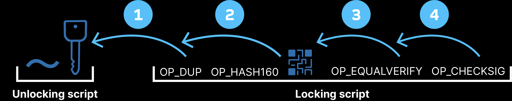

> *作者：Kiara Bickers*
> 
> *来源：<https://blog.blockstream.com/op_cat-the-purr-fect-solution-for-covenants/>*

OP_CAT 会激活吗？作为一种限制条款提议，它最近得到了 [347](https://github.com/bitcoin/bips/blob/master/bip-0347.mediawiki?ref=blog.blockstream.com) 的 BIP 编号。但在我们深入讲解它之前，先来了解一下 “限制条款（covenant）” 是什么，以及人们为什么想要这种功能。

比特币是电子 e-cash 的一种理想状态吗？还是说，我们想从链上的钱币中得到更多东西呢？

## 浮光掠影：比特币脚本的局限性

要理解 OP_CAT 这样的限制条款提议，我们先要理解今天的比特币脚本（[Bitcoin Script](https://glossary.blockstream.com/bitcoin-script/?ref=blog.blockstream.com)）的根本局限性。在表象之下，比特币允许创建基本的智能合约：用代码来定义锁定和解锁资金的规则。但是，其编程语言 Bitcoin Script 非常局限，仅在交易要移动资金时产生作用。

*在今天的比特币上，你没有办法预先配置或者说指定你的钱币的转移路径，也无法在锁定一笔资金时限定该笔资金的取款速度（除非你使用基于 PSBT（待签名的比特币交易）的非常规工作流程，但这既无法很好地处理交易手续费，也无法在决定不再使用时可靠地删除、阻止广播）。*

这种简洁性，虽说是比特币的安全模型的核心，还是给 Script 这种脚本语言支持（哪怕是基本的）智能合约的能力带来了显著的局限性。

### 线性执行模式

Bitcoin Script 的局限性之一在于其操作模式：[操作码](https://glossary.blockstream.com/opcode/?ref=blog.blockstream.com)是按顺序执行的，而且没有循环。

以这个 P2PKH 交易为例，你可以看出，脚本是线性执行的：复制公钥、将公钥哈希成一个地址、验证该哈希值与锁定脚本一致，最后用这个公钥来检查交易签名。

缺乏循环，意味着脚本不是图灵完备的、保证能终止运行，防止了可能会导致节点宕机或显著拖慢整个网络的无限循环操作。虽然这种设计选择让资源的消耗量是静态受限的，它也限制了 Script 管理复杂工作流的能力。

### 缺乏基本的算术

Bitcoin Script 只有不到 100 个重要的操作码，有时候会令人吃惊：它不能乘、除，也不能组合堆栈中的对象。许多对 OP_CAT 感兴趣的用户可能知道，中本聪在 2010 年[禁用了](https://github.com/bitcoin/bitcoin/commit/4bd188c4383d6e614e18f79dc337fbabe8464c82?ref=blog.blockstream.com)比特币的多个操作码，包括 OP_OR、OP_MUL（乘法）、OP_DIV（除法）以及 OP_CAT（字符串拼接）等。这些被禁用的操作码被移除了，因为它们的原本实现有可被爆破的漏洞，可能会牺牲网络的安全性。但缺乏这些操作码使得 Script 难以实现基本的数学运算，这在一些简单的场景中是有用的，比如，计算一个合约中的交易手续费。

### 交易数据不可见

浅薄地说，我认为绝大多数人都假设比特币的智能合约可以看到交易的数额以及其他部分的数据，因为这些信息在区块链上是公开可见的。但实情正好相反，比特币中的合约无法设置基于交易数据的花费条件，因为 Bitcoin Script 了解交易数据的能力是非常有限的。

如果脚本有能力内省交易数据中的更多细节，我们就可以开发出健壮得多的智能合约，它可以做到所有有趣的实情，比如强制执行某一个花费条件、创建分阶段执行的交易，以及启用更高级的安全保管特性（比如 “保险柜合约（vault）”）。

## 那么我们要怎么做呢？

我们知道比特币有这些局限性，而且过去几年中，人们讨论了许多引入（有时是重新引入）这些功能的提议。Bitcoin Script 上的更前卫的实验，例如 Simplicity 语言及其它，致力于提供替代堆栈形式约束的方案。而 OP_MULTISHA256、OP_LESS 和 OP_LE32TOLE64 这样的操作码，则旨在升级比特币的运算能力。OP_CTV 和 OP_CAT 这样的处理[内省操作码](https://glossary.blockstream.com/introspection-opcodes/?ref=blog.blockstream.com)的提议，则被归类为 “限制条款”。

那么，“智能合约” 与 “限制条款”，到底有何区别？

## 智能合约 vs. 限制条款

智能合约是自执行（self-executing）的交易，无需中介就能转移资金。在今天的比特币上，智能合约局限在使用 Bitcoin Script 锁定和解锁比特币的操作上。限制条款旨在通过允许用户控制自己的资金在未来的交易中如何花费，来强化比特币的智能合约功能。

如果允许 Script 内省交易数据，我们就在实质上允许了这些数据被用在合约逻辑中。

这里列举几个为限制条款功能而提议的更有趣的内省操作码：

1. OP_TXHASH：提供交易的输入（或输出）的哈希值，并给予 Script 基于交易数据来验证和强制执行条件的能力。
2. OP_CSFS + OP_CAT：这两种操作码允许脚本检查对任意数据（而不仅仅是对交易本身）的签名。这意味着，Script 可以验证基于交易数据和外部信息的条件，这就拓展了在比特币脚本内的验证操作的可能性。

这两种操作码是有意望宽泛方向设计的，所以可以支持复杂的验证流程以及内省能力。还有一些则是有意窄化的，设计成了更局限的限制条款。

1. OP_CHECKTEMPLATEVERIFY（CTV）：允许交易的输出嵌入后续一笔花费交易的模板，启用了更拘束的限制条款。
2. OP_VAULT：启用了一种专门用于保险柜合约的限制条款，让用户可以指定交易的目的地、但在时延结束之前不会真正移动资金。

还有就是 OP_CAT，它不是直接启用内省能力的操作码……

1. OP_CAT：允许 Script 将堆栈中的两个元素前后拼接，可以用来组合脚本中的信息碎片。

OP_CAT 看起来没有任何内省能力，那怎么会被归类为限制条款呢？

## OP_CAT：释放所有可能

2021 年，Andrew Poelstra 在一篇[文章](https://blog.blockstream.com/cat-and-schnorr-tricks-i/)中介绍了使用 OP_CAT 的内省技巧。他提供了具体的案例，只不过假设了读者对类似的技术有前置知识。

在 Bitcoin Script 中，只有三种主要的操作码可以内省交易数据：CHECKLOCKTIMEVERIFY（绝对时间锁）、CHECKSEQUENCEVERIFY（相对时间锁）以及 CHECKSIG（检查签名）。此外，它们还有一些变体，比如：CHECKSIGVERIFY、CHECKSIGADD、CHECKMULTISIG 和 CHECKMULTISIGVERIFY，本质上都是 CHECKSIG 的微型变体；前面两种让你可以看出检查是否能通过，只提供了非常狭窄的功能。CHECKSIG 是类似的，区别在于你可以从堆栈中抓取签名和公钥。有点意思。

以前，我们将 concatenation 理解成拼接两个元素的函数，但我们也可以使用它来分割一个元素 —— 将签名分割成 (r, s) 对。

怎么能从 OP_CAT（拼接） 中派生出 OP_SPLIT（分割）功能呢？

> “如果你有一些大体积的对象，你可以将它们分成两半，办法是要求用户在花费是提供这两段碎片。你可以 CAT 这两段碎片，再检查相等。每一种操作都可以用这种方法反转。使用 CAT，你就可以将签名分成两半。”
>
> —— Andrew Poelstra，[TABConf 2021](https://btctranscripts.com/tabconf/2021/2021-11-05-jeremy-rubin-andrew-poelstra-covenants/?ref=blog.blockstream.com)（[中文译本](https://www.btcstudy.org/2022/12/07/jeremy-rubin-andrew-poelstra-covenants-tabf-2021/)）

这到底是怎么回事？

用户先提供签名、公钥和被签名的交易，你可以将签名分成两半，然后用交易数据分别检查每一部分。这种技术可以视为一种分割，也可以视为一种拼接，因为它验证的是签名和公钥是一笔有效交易的一部分。

（译者注：此处的 “可以将数据分成两半” 指的并不是可以在脚本的运行中将一段数据拆成两段，而是将两段数据作为见证数据分别传入，然后用 CAT 将它们拼接起来，再运行原本要对完整数据运行的检查。有了这种办法，我们就可以在传入两段数据的时候先对它们进行额外的检查。）

这跟内省又有什么关系呢？

> “在 Taproot 中，我们已经有了 Schnorr 签名。使用 OP_CAT 和 Schnorr 签名验证操作码，经证明，我们可以得到一种非递归的限制条款：你可以确确实实得到一条交易的哈希值。不是被胡乱涂画过的交易哈希值哦，就是堆栈中所有交易数据的 SHA2 哈希值。”
>
> —— Andrew Poelstra，[TABConf 2021](https://btctranscripts.com/tabconf/2021/2021-11-05-jeremy-rubin-andrew-poelstra-covenants/?ref=blog.blockstream.com)（[中文译本](https://www.btcstudy.org/2022/12/07/jeremy-rubin-andrew-poelstra-covenants-tabf-2021/)）

Poelstra 在下文中演示了如何获得堆栈中剩下的交易输入或输出的 SHA2 哈希值。我们会跳过这些魔幻的数学，但启示就在于：使用 OP_CAT，我们将对交易的某些部分的约束，作为解锁脚本的要求。我们可以约束发送者的地址，或交易要发送的数额，而交易的哈希值将作为解锁资金的钥匙。

### 保险柜

使用相同的技巧，我们就有了交易内省能力，而且马上给我们一种基本的保险柜合约。沿着 Poelstra 在文章中的推理，一位名为 Rijndael 的开发者证明了我们只需 OP_CAT 就可以实现 [Purrfect Vaults](https://delvingbitcoin.org/t/basic-vault-prototype-using-op-cat/576?ref=blog.blockstream.com)（“完美的保险柜”）。

> “在堆栈中重构一个 TXID 以内省以往的交易，比我想象中要更加简单。”
>
> —— Rijndael

使用保险柜，用户可以指定资金下一步要前往的地址，这提供了在密钥泄露时复原资金的机制，减少了盗窃私钥的激励。

### 脚本内的默克尔树

在今天的比特币上，“[默克尔树](https://glossary.blockstream.com/merkle-tree/?ref=blog.blockstream.com)” 这种数据结构用于数据验证、同步，以及一定意义上 “绑定” 交易和区块。而 OP_CAT 可以拼接堆栈中的两个变量，当它跟公钥的 SHA256 哈希值一起使用的时候，就可以在脚本中实现一种直接的默克尔树验证程序。这种方法，最初由 Pieter Wuille 在 2015 年提出，已经在 [Liquid](https://liquid.net/?ref=blog.blockstream.com) 中实现。

想象一棵满布不同花费条件（例如哈希原像、时间锁和公钥）的树结构，就是所谓的 “树形签名”。

### 树形签名

> “（树型签名）提供了一种多签名脚本，其大小与公钥的数量呈对数关系，而且可以编码 n-of-m 以外的花费条件。举个例子，小于 1 KB 的交易，可以支持拥有 1000 个公钥的树形签名。它也打开了逻辑泛化的花费条件。”
>
> —— OP_CAT 作者 Ethan Heilman，发布于 [bitcoin-dev 邮件组](https://lists.linuxfoundation.org/pipermail/bitcoin-dev/2023-October/022049.html?ref=blog.blockstream.com)

这将能够验证树结构中的任何被哈希的内容，维持数据完整性以及可信度，而不会给区块链添加不必要的负担。

上面所有这些东西有趣的地方在哪里？

### 递归型限制条款

如果你可以解读一笔交易并对其特定部分施加约束，你就可以建立能在多笔条件中延续的条件，也就是创造持续约束的链条。这个概念就叫 “递归型限制条款”。OP_CAT 是一个独特的协议，因为它用仅仅 10 行代码给了我们强大的力量。它能够解决我们在前面提到的所有局限性：交易数据可见性、更好的数学功能，以及线性的执行模式。

虽然 OP_CAT 乍看起来平平无奇，它解锁了巨大的潜能，可以被创造性利用。它还可以作为一个砖石，在本文讨论范围之外的更多功能上发挥作用，比如抗量子计算的 Lamport 签名。

### 它安全吗？

在 OP_CAT 最初被移除之前，结合 OP_DUP（复制堆栈），即使堆栈中最初被操作的对象只有 1 字节，通过反复运用这一对操作码，堆栈对象的体积也会迅速膨胀，直至挤爆内存。这可以用作一种 DoS 攻击。新提议通过对堆栈元素施加 520 字节的限制，轻松地防止了这种攻击。

**是否有创造出无限运行的合约的风险？**

如果这个问题的意思是，OP_CAT 改变脚本的线性执行模式是否意味着脚本不再能静态地约束其资源使用量（使之成为脚本体积的一个线性函数），那么答案是否定的。

**限制条款会在比特币上带来一个发行其它币的市场吗？**

如果我们有了递归型限制条款，那么技术上来说，你可以开发出复杂的 2 层应用，包括 NFT、去中心化交易所、电子猫，等等。但是，要想做出来并不容易。难以看出这会形成一个可观的市场。

**你可以使用 CAT 永久 “玷污” 一笔钱吗？**

在染色币和 NFT 的案例中，发行资产实际上会 “烧掉” 一聪，标记它以象征 “layer-2” 资产的所有权。这个过程是所谓的 “玷污”。但只有一笔钱的所有者才能标记他的钱，而且比特币的钱包也不能理解这一切（除非开发者加入了额外的代码来启用这个功能）。最终得到的钱币也不会被比特币钱包接受。也许它们能被电子猫钱包或者别的什么东西接受，但它跟绝大多数比特币用户无关。

### 它会给比特币带来 MEV 问题吗？

比特币与以太坊的一个关键区别在于交易的可见性。不像以太坊，比特币中的合约并非所有方面都必然是透明的，因此比特币矿工并不具有跟以太坊矿工相同的看到合约内部状态并抢先执行某些操作的能力。

对 OP_CAT 的主要顾虑是在它可能影响经济激励，造成 “矿工可抽取价值（MEV）”。我的上一篇[文章](https://blog.blockstream.com/miner-extractable-value-mev-and-programmable-money-the-good-the-bad-and-the-ugly/)详尽地讨论了这个主题。许多用户担心的是，如果我们让 2 层合约在技术上变得可能，MEV 就不可避免会到来。但真是这样的吗？具体来说，如果你可以在比特币上发行 2 层币，是否就意味着它们一定会被采用？

你可以想象能开发出简单的互换合约，或者相对低效的 NFT，但开发带有自动化做市商的去中心化交易所这么复杂的东西就几乎不可能做到；而且，尽管 “技术上可行”，我们在 Liquid 上从未看到这样的东西被开发出来。

## OP_CAT 真是完美的吗？

当然不是。一些人希望看到递归型限制条款，而另一些人则完全不希望看到比特币会改变。

一部分比特币人，可以叫做 “固化主义者”，支持让比特币保持当前的状态，对任何协议升级都抱有怀疑态度。他们尤为担心重大的变更，比如限制条款的引入，可能会降低网络的去中心化。他们的主张基于一种信念：最好还是坚持比特币最初的愿景。讽刺的地方是，OP_CAT 就是最初的比特币的一部分，这就导向了完全相反的意见。一些人认为，让 OP_CAT 回归，更契合中本聪最初的愿景。

如果你希望得到一些由递归型限制条款带来的安全保管特性，那么 OP_CAT 就是好东西，但绝对不如成熟的 Lisp 式脚本语言那么好。问题在于，引入这样的东西将是巨大的变更，而且不太可能很快获得欢迎。

又或者，也许你站在另一边，你更喜欢非递归型限制条款（比如 OP_CTV 和 OP_VAULT）的简洁性。非递归型限制条款更简单，也更容易分析，没有创造不受控制的限制链条的风险。

但如果某种形式的递归型限制条款一定会出现呢？

过去几年中，开发者们已经注意到，几乎任何对交易验证逻辑的拓展都可以用来模拟 OP_CAT 的功能。

在 Script 的宇宙中，基于堆栈元素的体积，可以划分出两个世界。对于大于 4 字节的元素，你可以检查相等、将它们解读成公钥或签名，还可以哈希它们。而对于小于等于 4 字节的元素，你可以在上面作运算。使用一个运行在一个 BitVM 上的 [RISC-V](https://glossary.blockstream.com/risc-v/?ref=blog.blockstream.com)处理器，你可以作任何事情。任何允许你模拟 OP_CAT 功能（分拆堆栈元素或将它们拼接）的东西，都可以将这两个世界融合，从而允许你在脚本中 “做任何事情”。

一些研究员，比如 Andrew Poelstra ，预期我们可以用非常少量的新操作码来制作递归型限制条款。如果这是真的，那就有理由找出一种尽可能好的办法。

## OP_CAT 是最有可能通过的限制条款提议吗？

如果限制条款不仅是一个玩具，而是众望所归，我们如何保证它的实现方式会让更多比特币用户能够免信任地发送价值，就像中本聪最初期待的那样？虽然固化主义者还有分歧，OP_CAT 在限制条款辩论中依然是一个强有力的竞争者。

OP_CAT 不是最优雅的工具，但它的 功能/复杂性 之比是最高的，这将允许开发者创造一些惊人的新特性。

*注：本文的一个旧版本曾在 Bitcoin Magazine 出版，可以在此处[阅读](https://bitcoinmagazine.com/technical/op-cat-the-purr-fect-solution-for-covenants-?ref=blog.blockstream.com)。*

（完）