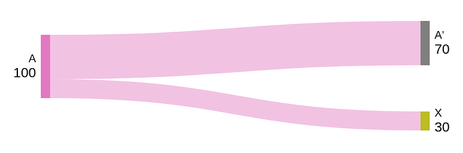

> *作者：salvatoshi*
> 
> *来源：<https://delvingbitcoin.org/t/op-checkcontractverify-and-its-amount-semantic/1527>*

我在形式化 `OP_CHECKCONTRACTVERIFY` 的语义上完成了一些工作。我也撰写了第一份 BIP 草稿以及在 `bitcoin core` 的实现：

- [BIP-443](https://github.com/bitcoin/bips/blob/master/bip-0443.mediawiki)（[PR 讨论](https://github.com/bitcoin/bips/pull/1793)）
- [bitcoin-core 实现草稿](https://github.com/bitcoin/bitcoin/pull/32080)

在本文中，我想简要介绍一下 `OP_CCV` 操作码的语义，然后拓展到讨论它处理数额的逻辑 —— 在我关于这个主题的上一篇文章中，这一方面没有得到全面的探索（也没有妥善地形式化）。我要提出的主张是，它提供了一个便利而且引人入胜的特性集，是那些更加 “原子化” 的操作码难以实现的。

## OP_CHECKCONTRACTVERIFY

为了使这个帖子独立成篇，我要先从简要介绍 `OP_CHECKCONTRACTVERIFY` 开始。

### 一言以蔽之：*携带状态的* UTXO

`OP_CCV` 开启了 *携带状态的* UTXO：你可以将一个 UTXO 视为一个上锁的箱子，它里面保管着数据、规则和一定数额的钱币。在你花费这个 UTXO 时，它让你可以窥视这个箱子（内省数据），然后决定下一个箱子的规则（程序）、数据和数额。

### 稍微展开

`OP_CCV` 在 P2TR 输入和输出上工作。它允许比较一个 输入/输出 的公钥与：

- 一个公钥，我们称之为 “*赤裸公钥（naked key）*”
- ……可选，使用一些数据的哈希值来调整（之后的公钥）
- ……可选，使用一棵 taproot 树的默克尔根来调整（之后的公钥）

类似于 taproot，*调整（tweaking）* 允许在一个公钥内创建一个对一段数据的承诺。因此，通过使用 “双重” 调整，你可以轻松承诺一段额外的非限定数据。因此，对输入的 taproot 公钥的双重调整的等式检查，就足以 “内省” 在这个输入内潜入的数据（如果有的话）；而对一个输出的 taproot 公钥的等式检查，可以强制让程序（*赤裸公钥* 以及  *taproot 树*）和输出的数据是我们想要的值。

（译者注：这种设计的关键一步在于将一个赤裸公钥与一个哈希值的椭圆曲线点合成为 Taproot 输出的 “内部公钥”；这个内部公钥再根据 P2TR 的规则与一棵 taproot 脚本树的默克尔根值合成为 Taproot 公钥。这样一来，就既不影响 Taproot 原有的密钥花费、脚本路径花费规则；同时，能够用等式检查来检查一个公钥是不是另一个公钥与一个哈希值的椭圆曲线点的和。为实现上述内省检查，它也暗含了一种获得 Taproot 输出的内部公钥的办法。）

结合一个允许创建 *向量承诺* 的操作码（比如 `OP_CAT`、`OP_PAIRCOMMIT` 和一种理论上的 `OP_VECTORCOMMIT`），它就可以 —— 理所当然的地 —— 承诺多段数据，而不止一段数据。

虽然这肯定不是唯一一种在脚本内实现动态承诺的方法，但它是我能想到最好的，并且有一些很好的属性。

**优点**：

- 完全兼容 Taproot 。密钥路径花费依然是可能的，而且一样便宜。
- 对节点来说没有额外的负担；状态是嵌入 UTXO 中的，不是显式存储的。
- 它在逻辑上隔离了 *程序*（taptree）和 *数据*（data）。
- 不需要访问嵌入数据的花费路径就不需要为数据的存在而花费额外的见证数据。

**缺点**：

- 只能与 P2TR 兼容。
- 相比于其它方法，tweak 在计算上更加昂贵。

## 数额逻辑

那么钱币的数额呢？如果只是关心输出的脚本，却不管分配给它的资金，以至于发个 0 聪给它也行，这不是太奇怪了吗？在绝大部分轻快下，我们都希望同时指定要把多少价值分配给它。

因此，在检查一个输出时，`OP_CCV` 允许一种便利的语义来指定数额的流动，它在绝大部分情形中都能奏效。有三种选项：

- *默认*：将当前输入的所有未分配的价值交给这个输出
- *扣减*：给这个输出分配当前输入的一部分（剩余部分则保持是未分配的）
- *忽略*：仅检查该输出的脚本，不检查其面额。

一个输出可以在多个输入的 *默认* 逻辑中使用，但一个输入不能同时是 *扣减* 检查和 *默认* 检查的目标，也不能是多个 *扣减* 检查的目标。

一个使用 `OP_CCV` 的构造良好的脚本将使用：

- 0 个或更多个 `OP_CCV` 使用 *扣减* 逻辑，将输入的部分金额分配给一些输出
- 仅仅 1 个 `OP_CCV` 使用 *默认* 逻辑，将所有金额（可能是剩余的价值）分配给某一个输出（可能是另一个输出 —— 没有成为扣减逻辑的目标的输出）

这保证了 *一个输入的所有价值都被分配给了输出*。

## 案例

### 1-to-1

**A** 使用 `CCV` 的 *默认* 逻辑，将所有价值发送给 **X** 。

这种用法，在所有 **A** 想把价值发送到预先定义的目标地的情形中，都是通用的，不论这个目的地是一个终结状态，还是另一个带有特定程序和数据的 UTXO 。

在一些情况下，**X** 可能反过来是 **A** 的程序一个拷贝，只是更新了嵌入其中的数据。在这种情况下，**A** 的输出会先使用 `CCV` 来内省它自身（是一个输入）的程序和数据，然后为输出计算新数据，然后使用 `CCV` 的 *扣减* 逻辑来检查输出的程序和数据。这将允许可以 *更新* 自身状态的长期存在的智能合约。

### many-to-1（汇集）

**A**、**B**、**C** 使用 `CCV` 的 *默认* 逻辑来发送所有金额给 **X** 。

### 发送部分金额

**A** 使用 `CCV` 来检查输入的程序和数据（如果有的话），然后检查使用 *扣减* 逻辑来检查第一个输出 **A'** 拥有相同的 程序/数据，然后使用 `CCV` 将剩余的价值发送给 **X** 。

这种方法用在保险柜合约（vault）这样的构造中，以允许部分价值立即出库。它也可以用在共享 UTXO 方案中，以允许其中一位用户从 UTXO 中取出自己的余额，而不影响其他用户留在资金池中（不过，这有可能需要一次 `CHECKSIG` 或额外的对发送到 **X** 的具体金额的内省，这是 `CCV` 无法独自提供的）。

### 发送部分金额，然后汇集

**A** 做的事情跟上一个案例中一样，但这里，另一个输入 **B** 也会使用 *默认* 逻辑将金额发送给 **X**，从而将它自身的金额跟 **A** 中（扣减掉发送给 **A'** 的部分之后）剩余的数额汇集起来。

## 讨论

有人建议将 `CCV` 的脚本内省与数额处理逻辑分离开来。那是有可能的，只不过：

- 如果没有对数额的有意义检查，你 *绝对不会* 想要检查输出脚本；所以，那（分离两者）将是浪费，而且可以说不那么符合人体工程学。
- *默认* 逻辑和 *扣减* 逻辑，如果使用更加原子化的内省操作码来实现，都是非常困难的。

甚至，启用 “[伟大脚本复兴](https://youtu.be/rSp8918HLnA)”  中的所有操作码也不足以容易模拟上面提到的数额逻辑。这是因为，这些检查天生就是属于交易层面的，无法轻松用单次输入脚本检查来表达（也许是完全不能？）。使用一个遍及所有相关输入的循环来实现它，又会导致复杂性平方级上升（如果每一个输入都执行这样的检查的话）。当然，人们可以专门构造一个特殊的输入，来检查所有其它输入的数额（这些输入又反过来检查特殊输入的存在），但那是非常反人类的解决方案 —— 对我来说，这是不对的。

通过合并将输入的金额 *分配* 给输出的数额逻辑（与脚本检查），与约束数额相关的实际计算就被转移给了脚本解释器。

我认为，这两种数额检查行为（*默认* 逻辑和 *扣减* 逻辑）是非常符合人体工程学的，并且覆盖了现实中需要数额检查的绝大部分情形。我能想到的唯一一种插件就是对输出金额的直接等式检查，这可以通过添加一个简单的 `OP_AMOUT`（或者 [OP_INOUT_AMOUNT](https://delvingbitcoin.org/t/op-inout-amount/549)）操作码，将一个 输入/输出 的面额推到堆栈中来实现；或者，使用一种更加通用的内省操作码，比如 `OP_TXHASH`）。

我使用 `OP_CCV + OP_CTV` 实现了一个[功能全面的保险柜合约](https://github.com/Merkleize/pymatt/blob/e9cd2077880422ff74c3a5817c8affad74a0ed39/examples/vault/vault_contracts.py)，大致上等价于 `OP_VAULT + OP_VAULT_RECOVER + OP_CTV`，在我开发的用于探索 MATT 想法的 python 框架中。此外，一个仅仅使用 `OP_CCV` 的功能削减的版本在 `OP_CCV` 的 `bitcoin core` 实现中作为一个功能测试。

## 结论

期待您对 `OP_CHECKCONTRACTVERIFY` 的规范、实现和应用的评论。

