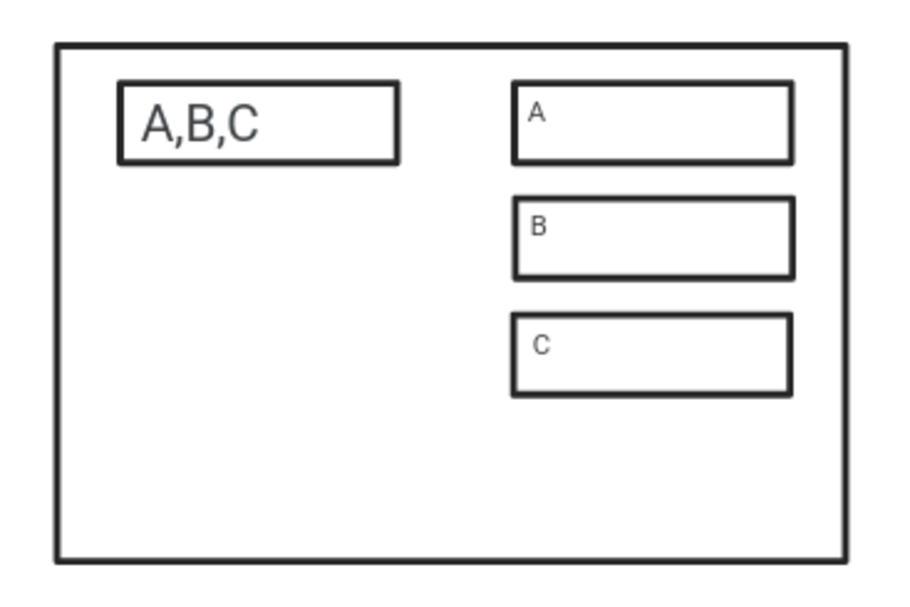
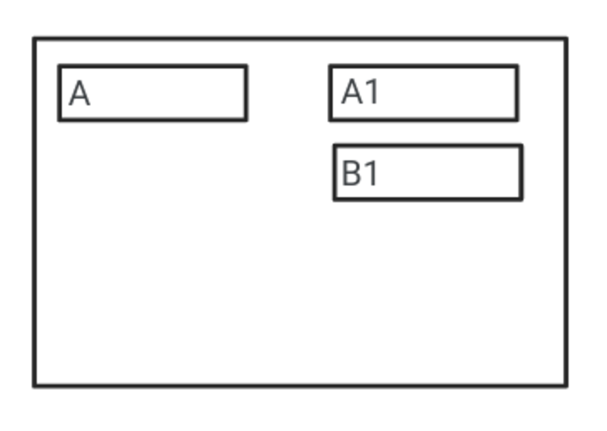
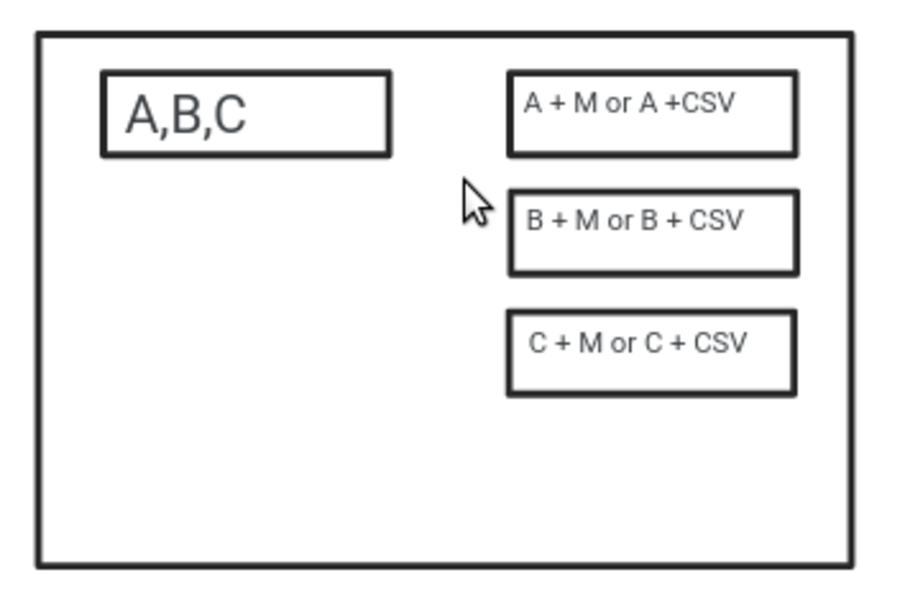

> *作者：Shinobi*
> 
> *来源：<https://bitcoinmagazine.com/technical/op-checkseparatesig-and-actuaries-fixing-multiparty-channel-factories>*

最近，许多人都开始意识到局限于两方参与的链下通道（即闪电通道）的缺点和局限性，以及为长期的扩展效果探讨允许多方参与的通道设计的必要性。这需要我们接受全新的取舍，即，为了解决闪电网络现有的问题，我们需要让超过两方共享对一个 UTXO 的控制权，但这就产生了一类全新的问题。

从两方到超过两方，所引入的最大的问题就是对交互性的需要。如果有 10 个人在同一个通道中、共享对同一个 UTXO 的控制权，你就需要 10 方同时在线，才能更新这个通道的状态。这就产生了困难得多的协调问题，因为在当前的闪电通道中，要使用一条通道只需两方同时在线。

目前，关于这个问题，最好的想法是通过一个实质上的联盟直接引入信任。闪电通道（以及未来的多方通道系统）是一种自主保管的系统，因为链上保管资产的脚本是 n-of-n 的多签名，它需要所有参与者都签名，才能改变资金的链下状态。如果你（作为一个成员）拒绝签名一个新的状态，那么任何人都无法移动你的资金。忽略保持在线和观察区块链以处理旧状态的要求，这个安全模式等价于在链上的独占式保管。没有 *你* 的签名，资金的控制权就无法改变。

将密钥阈值从 n-of-n 变成了 m-of-n，就完全降低了安全性，不再等价于链上的独占式保管。它实际上就变成了托管模型，因为你的密钥不再是转移资金控制权的绝对不可或缺的东西。ZmnSCPxj 为这个交互性问题[提出了一个有趣的解决方案](https://lists.linuxfoundation.org/pipermail/bitcoin-dev/2023-September/021942.html)。

## OP_CHECKSEPARATESIG

这个提议需要两个软分叉，SIGHASH_ANYPREVOUT（APO） 和 OP_CHECKSEPARATESIG。OP_CHECKSEPARATESIG 的范围非常小，小到有任何严肃的争议，都会让我感到意外。至于 APO，它已经在生态中获得了相对更大的共识，被认为是一个吸引人的变更。

OP_CHECKSIG 和 OP_CHECKSIGVERIFY 是当前在比特币脚本中验证签名的两种主要方法。一个签名有两个部分， `S` 值和 `r` 值。  OP_CHECKSIG(VERIFY) 将签名的 r 值和 S 值作为一个完整的参数，再取得公钥，作为第二个参数，然后检查这个签名是否有效。OP_CHECKSEPARATESIG 则将公钥、r 值和 S 值都作为单独的参数（总共取得 3 个参数），然后验证签名。

就这样，这就是这个提议的全部。OP_CHECKSEPARATESIG 这个软分叉甚至比 CHECKTEMPLATEVERIFY（CTV）还要更简单。为什么需要它呢？我们继续往下看。

## 无需每个人都在线的状态更新

- 一个多方通道 -

这就是一个非常基本的多方通道的初始状态的样子。一笔预先签名的交易，需要 Alice、Bob 和 Charlie 签名他们共有一个 UTXO，然后为每个人分配一个输出。如果 Alice 想要给 Bob 支付，但是 Charlie 不在线，那么她唯一的办法就是创建一个花费她的通道输出的预签名交易，将这些资金分成两部分，一部分给自己，另一部分给 Bob，就像这样：

- Alice 给 Bob 支付 -

这种做法的问题在于，在所有人重新在线并更新通道的状态之前，Alice 可以随时签名另一笔与之冲突的交易，从而撤销给 Bob 的支付；因为花费这个输出只需要用到 Alice 自己的私钥，所以 Bob 也无法阻止她。我们需要某种仲裁者，保证在 Charlie 无法响应的时候， Alice 无法重复花费她这样给 Bob 的支付。

你可以添加一个条件，要求 Actuary（M）也是每个人的输出的一个密钥持有者，意思是，无论谁要花费自己的通道输出，都必须得到 Actuary 的签名表示同意。问题在于，现在，Bob 就必须信任 Actuary 了。如果 Actuary 跟 Alice 勾结，Bob 依然会被欺骗。

*这就是我们需要 OP_CHECKSEPARATESIG 的地方*。一个签名中的 r 值是从这个签名所用的一次性随机数（nonce）中推导出来的。nonce 处理的一个关键风险正是：在同一个密钥的不同签名中重复使用相同的 nonce，会导致私钥泄露；其他人只需得到这两个签名就可以反算出用来签名的私钥。这可以用来扮演 Actuary 的角色并移除所需的信任。无论 Actuary 为这个角色使用了什么密钥，都可以附带一个随时可被没收的债券（译者注：指的是在同一个公钥的单公钥输出中存放一笔资金）。于是，我们像前面说的那样，在每个人的通道输出中添加 Actuary 的公钥，但是，在每个脚本中都指定 M 要用在签名中的 r 值。我们还给每个通道输出都添加一个 CSV 时间锁花费路径，在时间锁过期后只需本人的密钥即可花费。这样一来，在通道关闭的一段时间后，用户就绝对可以花费自己的钱，不会被 M 阻挠。

现在，如果 Charlie 离线了，但 Alice 想给 Bob 支付，那就可以使用预签名的交易来花费她的通道输出，她联系 Actuary 签名这笔交易。在签名完成之后，将交易的拷贝发给 Bob，他获得了更强有力的保证，Alice 的输出无法被重复花费。如果 Actuary 串通 Alice 来重复花费，他的私钥就会泄露，而他放在债券中的资金就会被没收。如果通道在链上关闭了，那么 Bob 可以在 Allice 能够独自花费她的通道输出之前将这笔 Alice 跟 Actuary 联合签名的交易广播出去，因为 Alice 必须等待一个相对时间锁（而 Bob 无需等待，因为 Alice 和 Actuary 联合签名的分支没有时间锁）。如果你在多方参与的基础通道上叠加更小的通道，那么可以在每一层都添加这样的条款。

这为 Alice 和 Bob 提供了在 Charlie 离线的时候更新多方通道的安全模式，严格来说，这不是免信任的，但已经是你能够做到的最接近免信任的程度了。Bob 有很强的信心自己不会被重复花费，只要 Actuary 在债券中锁定的价值大于给 Bob 的支付的价值，那 Bob 不被欺诈的概率实际上是 100%。而且 Alice 也可以在 Charlie 不在线的时候给出安全性足够好的支付。非全员在线可能是一个非常常见的情形，而这个机制就可以在这个时候派上用场；而且，当所有人都回到线上的时候，可以一起更新基础层的通道，从而移除使用这种机制的额外交易。

OP_CHECKSEPARATESIG 和它启用的 Actuary 角色解决了多方通道的一个巨大问题，让超过两人的通道可以扩展。我很确定，除了多方通道以外，还有大量其它情形，可以用债券来约束一些参与者只签名一个版本的交易。这应该成为比特币人严肃考虑的东西，它为一个已知的问题提供了一个巨大的解决方案，而且不引入复杂性，只需要稍微改变验证签名方式的一个侧面。

（完）