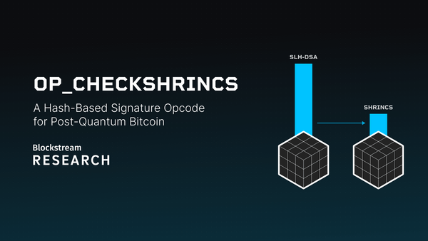
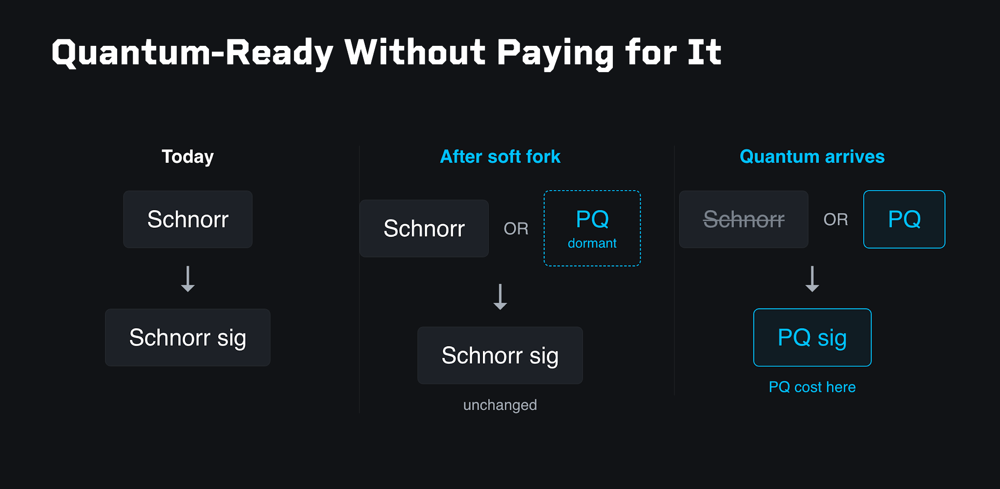
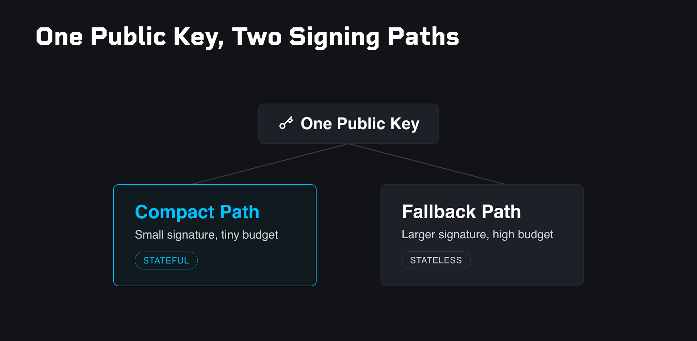
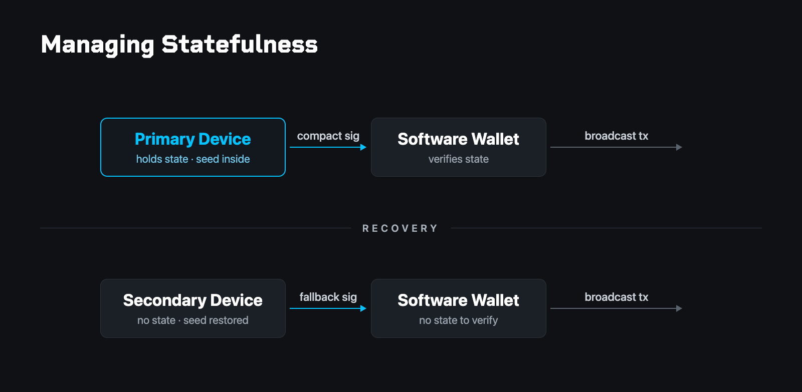
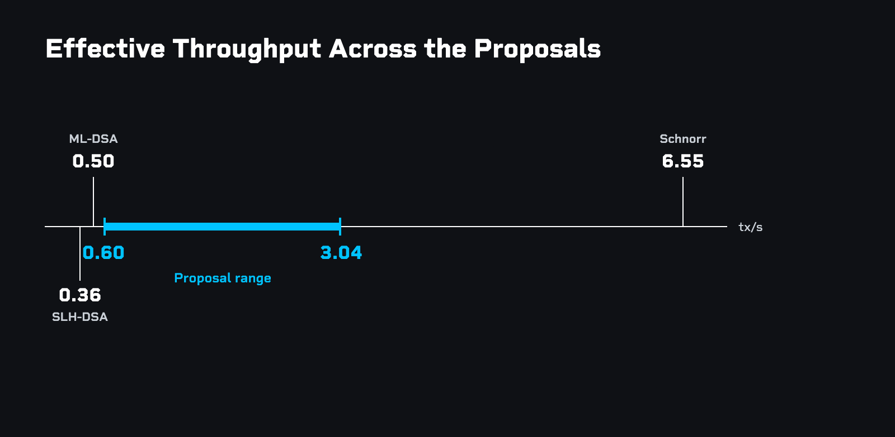

> *作者：Jonas Nick*
> 
> *来源：<https://blog.blockstream.com/op_checkshrincs-a-hash-based-signature-opcode-for-post-quantum-bitcoin/>*

目前，还没有在比特币中集成后量子签名方案的具体方案。在过去一年中，Blockstream Research 一直在研究这个问题。这篇文章分享了我们已经学到的东西，并且主张：优化后的基于哈希函数的签名，是比特币量子抗性的务实选择，近期就能部署。本文还介绍了 “SHRINCS” 和 “SHRIMPS”，它们是建立在成熟的密码学假设之上的、签名体积最小的后量子签名方案；然后，勾勒一个具体提议的雏形。

最新类型的比特币输出将资金锁定在一个 Schnorr 公钥上，花费这些输出需要一个有效的 Schnorr 签名。然而，Schnorr 签名在量子计算机面前是脆弱的。添加后量子签名验证的最自然的办法，是使用一种后量子选项来延展 Taproot 脚本树。 在一次软分叉升级后，一个比特币输出可以同时承诺一个 Schnorr 公钥和一个后量子签名公钥。因为 Taproot 只会揭晓实际被花费的脚本的默克尔树路径，用户可以继续使用 Schnorr 签名来花费（它体积较小，因此交易手续费将比较便宜），交易的成本几乎不会改变。 后量子选项可以在脚本树上静静等候。仅当足够强大的量子计算机出现之后，用户才需要换用第二种路径：使用后量子签名来花费，那时候才需要付出更高的交易成本。

## 后量子升级的失败情形

实现量子抗性的升级可能会因为不同的原因而失败，对这些情形的主动规避，塑造了后文要讨论的设计抉择。

- **吞吐量暴跌**。如果签名的体积太大，区块空间很容易就用尽，许多用户将完全无法确认交易。
- **验证成本**。如果验证签名的计算要求太高，完全验证节点的数量将减少，这会影响网络的中心化。
- **签名成本**。应该让硬件签名器和资源有限的设备能在合理时间内生成签名。
- **密码学被攻破**。使用了无法长期保持为真的安全假设。
- **无人采用**。升级提议过于复杂，或者无法集成到现有的基础设施。只有你自己采用这种提议是不够的：如果网络上其他人都被攻陷了，你的钱币哪怕是完美安全的，在经济上也毫无价值。
- **实现的复杂性**。提议的实现重包含了 bug，或者无法抵御攻击，而出于比特币的共识规则的特殊性，人们将不得不永远维护这套代码，不能意外地引入哪怕是最轻微的不兼容性。

能够避开这些陷阱的提议，才有机会获得粗略共识。

## 标准候选

第一组候选是由 NIST（美国国家标准及技术研究所）标准化的方案。这些方案都已经存在，并且有可用的实现，只需稍加努力，就可以转化为比特币升级提议（BIP）。比较的基准是用在 Taproot 输出中的 Schnorr 签名方案。如果每一笔交易都使用 Schnorr 签名，按照当前交易的平均大小，比特币网络可以（相当于）每秒处理 6.5 笔交易。本文中用到的所有 TPS（每秒处理交易数量）都假设平均每笔交易带有 2.27 个输入和 2.64 个输出（这是在 2026 年 3 月 30 日测算的 90 日平均值，根据 [ transactionfee.info](https://transactionfee.info/?ref=blog.blockstream.com) ），并且比特币区块的体积限制保持不变。

Schnorr 签名支持当前的钱包基础设施所依赖的特性，尤其是 BIP 32 未硬化的密钥派生。它也促成了整个生态系统近年在比特币上部署的效率升级（比如 MuSig2），以及计划中的隐私性和效率提升（比如门限签名、静默支付和跨输入的签名聚合）。

- **ML-DSA**，基于 “格（lattice）” 假设。吞吐量将下跌到每秒处理半笔交易（按 NIST 安全等级 3 计）；并且，Schnorr 签名的所有特性都会消失，包括 BIP 32 未硬化的密钥派生。
- **SLH-DSA**，基于哈希函数。哈希函数是比特币已经依赖的保守假设，因此可以将 NIST 安全等级 1 作为目标。不过，吞吐量将进一步下跌到每秒处理 0.36 笔交易；同样，Schnorr 签名的特性也会消失。

这两种方案都不是手到擒来的解决方案，并且它们都会让网络吞吐量暴跌。提高区块体积限制可以缓解吞吐量问题，但将一个有时效性、务实的后量子升级跟有争议的区块体积提升绑定在一起，不太可能成功。最好单独讨论区块体积限制。

## 需要更多研究的候选

由 NIST 标准化的方案们都易于部署，但它们的牺牲是难以接受的。其它候选承诺有更好的取舍，但在部署变成可靠选择之前需要多得多的研究和时间。

- [**Falcon^WS**](https://eprint.iacr.org/2025/1940?ref=blog.blockstream.com) 是一种较新的基于格的签名。它提供了显著更优的签名体积（吞吐量在 NIST 安全等级 5 下可以达到 1 TPS），但它还很不成熟，无法考虑部署。把它放在这里，是为了演示在格的基础上最终可能实现什么东西。
- **匹配 Schnorr 签名特性集合的格签名**，比如 BIP 32 和门限签名。这是一个值得进一步研究的有前景的方向。不幸的是，添加这些特性会显著增加签名的体积（相比忽略这些特性的格方案），可能会让吞吐量低于 Falcon^WS 的大约 1 TPS 。比如说，一种[修改后的 Raccoon-G 方案](https://eprint.iacr.org/2026/380?ref=blog.blockstream.com)支持层级式确定性密钥派生（包括非硬化派生），但是公钥体积达到了 16 kB，签名体积是 20 kB 。
-  **SQIsign**，基于 “同源（isogenies）”。签名体积很漂亮，吞吐量可以上升到大约 3.6 TPS（安全等级 5），而且同源有望支持 Schnorr 签名的特性。棘手的地方是它的密码学假设，远远不如格假设成熟。被攻破的风险是真实的，而且可能短期内都无法消除。要对新的密码学假设建立信心，需要花费许多年时间。
- **区块层签名聚合**，用一个简洁的证据（一个 SNARK）聚合一个区块中的所有签名。保守估计，每个区块需要一个 500 kB 的证据，那么吞吐量大概是 6.7 TPS 。最近在这条路线上出现的提议有 [BitZip](https://gnusha.org/pi/bitcoindev/Z_AoU94vMDskLJ4Z@console/T/?ref=blog.blockstream.com#m64a045ba0ad05ff817085916d0c4a94845a261fc) 和 [LeanVM](https://github.com/leanEthereum/leanMultisig/?ref=blog.blockstream.com) 。还有一些开放问题，比如谁来计算证据、如何避免挖矿中心化，而且工程复杂性也相当大。

## 优化基于哈希函数的签名以及签名配额

所有这些候选都存在于同一个多维的取舍空间中：安全假设、效率、特性和复杂性。对基于哈希函数的签名来说，两种方向似乎非常有前景。其一，我们可以添加一个新的维度：带状态性（statefulness），从而打开全新的设计空间。其二，我们可以接受稍微增加协议的复杂性，换来显著的性能提升。两相结合，基于哈希函数的签名就会成为有吸引力的候选。不加入新的密码学假设，就能提供更高的效率， 而且其密码学依然相对容易解释和实现。

“需记忆性” 用到了一个内置于每一种基于哈希函数的签名方案的概念：“*签名配额* ”，这个参数表明了单个公钥可以安全签名新消息的次数。在 SLH-DSA 中，配额被设为 2^64，对于任何实际应用场景来说，几乎就是无限大。有意缩减配额可以让最终签名的体积更小，然而一旦用尽配额，一个公钥的安全性就会被打破。

签名配额为 2^64 时，SLH-DSA 签名的体积是接近 8 kB，那么吞吐量是 0.36 TPS 。将配额减少到 2^40（每个公钥 1 万亿次），也依然是够用的：按当前的区块体积，不停签名几百年也用不完配额。按这个更小的配额参数， 签名体积将下降到 5.7 kB，吞吐量提高 33% 。

## SHRINCS

那么签名配额可以降到多低呢？在比特币基础层上，最佳安全习惯不鼓励地址复用，所以一个普通的公钥只会签名几次。因此，签名预算可以降得很低。对于需要超过这个数量的用户，可以提供一个后备选项。这种构造让一个公钥有两条签名路径：紧凑路径，在配额以内，制作出小体积签名；另有一条总是可用的备用路径，制作无需记忆签名次数的签名。

紧凑路径用起来也是有代价的：签名人必须一直追踪自己的签名次数，防止超出配额。这个计数器就是 *状态*，依赖于它的方案就是 *带状态的* 。在桌面钱包和移动端钱包这样的环境中，备份-导入 是常态化操作，难以支持带状态性。重新导入一个旧备份，就会在不知不觉中将计数器回滚到一个已经用过的数值。随后的签名会复用状态，这可能会让用户的资金置于危险之中。比特币开发者们，包括我们在 Blockstream Research 的团队，一直在努力保证比特币产品抵御误用。带状态的方案天然是更脆弱的（相比无状态的方案）。最初探索这个方向时，我们的看法是，这虽然是一种有趣的技巧，但并不怎么实用。

然而，有一种装置可以防止用户意外损坏状态：专用的签名设备。在初始化的事后，设备会生成种子词并设定初始状态，然后，这份状态就只会存在于这个设备中，永远不会离开。这个设备会制作紧凑的签名。因为这一状态可以公开，软件钱包可以添加一项额外的安全检查，在交易广播之前验证一个就绪的签名没有复用状态。 如果这个签名设备丢失、损坏或被替换了，那么用户可以将种子词导入一个新设备，它会自动退出到无状态路径上，制作出无状态的、体积更大的签名。将状态完全保留在设备上，就可以消除用户弄坏它的可能性。

我们将得到的构造命名为 “SHRINCS”。它依赖于两个核心想法：

- **让一个公钥可以使用两种签名路径**：紧凑的、带状态的路径，和一个无状态的后备路径。
- **设计非常高效的紧凑路径**：其中的细节已经超出了本文的范围，但这种构造是直接建立在已有的基于哈希函数的签名方案之上的。

吞吐量对比：

- **SLH-DSA**：0.36 TPS
- **签名配额下降到 2^40 的 SLH-DSA**：0.48 TPS
- **SHRINCS 紧凑路径**（签名体积为 580 字节）： 最高可达 3 TPS（假定每个签名都使用紧凑路径）

SHRINCS 的风险特征与其它后量子候选方案显著不同。那些方案带有影响网络上每一个用户的系统性风险：低吞吐量、可疑的密码学假设、共识协议变得脆弱。相反，SHRINCS 依赖于局部化的风险：各个设备的状态管理。考虑到安全部署的可能性以及这些吞吐量数字， SHRINCS 就不再只是一种有趣的技巧，而是一种务实的量子抗性选项。

## SHRIMPS

在 SHRINCS 方案中，将种子词导入一个新的设备是昂贵的，因为这会触发无状态后备路径，从而产生体积更大的签名。不过，这样的事情在一个密钥的生命中不会太多。SHRIMPS 利用这一点，专门为这些备用设备添加了第二条紧凑路径。使用 1000 个签名的配额，这条路径会产生体积大约为 3000 字节的签名。这是主设备签名体积的 5 倍，但依然比后备路径（SLH-DSA 签名）小 2.5 倍。

## 优化后备路径

带状态性是前面提到的两个方向之一。第二个方向是优化无状态后备路径自身。

从 SLH-DSA 签名的 7,872 字节（0.36 TPS）开始，可以叠加这些优化：

- **削减签名配额到 2^40** ，签名体积将缩减到 5,792 字节（0.48 TPS），体积缩减了大约 26% 。
- [**WOTS+C**](https://eprint.iacr.org/2022/778?ref=blog.blockstream.com)（Blockstream 的密码学家 Mikhail Kudinov 是其联合作者之一）和 [**PORS+FP**](https://eprint.iacr.org/2025/2069?ref=blog.blockstream.com)，它们是 SPHINCS+ 的直接可用的永华，但没有被 SLH-DSA 方案采用。这可以将签名体积缩减到 5,060 字节（0.54 TPS），也就是进一步缩减了大约 13% ，而且不影响性能。唯一缺点是偏离了 NIST 的标准。
- **接受 5 倍长的签名和密钥生成时间**，可以带来额外大约 11% 的体积缩减，得到 4,496 字节（0.60 TPS）。
- **允许每字节的验证时间上升到 Schnorr 签名的大约 1.5 倍**，可以再削减大约 13%，得到 3,896 字节（0.69 TPS）。

全部加在一起，可以让一个无状态的基于哈希函数的签名体积缩减到 SLH-DSA 签名的一半。再狠一点，以更长的签名或验证时间为代价，还可以继续缩减签名的体积。

## 一个幼稚的提案

本提案依赖于两个设计原则。

其一，不增加验证时间（相比 SLH-DSA 方案）。这是为了避免让区块体积限制在未来更加难以提高。 这也显著简化了 SNARK 证据的生成，如果区块层面的签名聚合能被采用的话。

其二，抛弃 “全方位适用一种签名” 的想法，为具体的应用场景引入多种签名方案。

- **桌面端和移动端的 layer-1 钱包**无法安全地保存状态，但它们通常有更快的 CPU 。它们可以使用牺牲签名时间、换来紧凑性的无状态签名方案：在 2^40 的签名配额下，签名体积为大约 4,496 字节。这个配额已经远远超出了意外可能达到的次数。
- **专用的签名设备**可以设计成能够安全地保存状态，但它们的处理器通常较弱，所以提高签名的成本并非正途。SHRINCS 和 SHRIMPS 使用带状态的签名来保证签名体积较小，并且签名速度较快。无状态的备用路径使用 2^32 的签名配额（没有人会在一个硬件签名器上重复按一个按钮 40 亿次）；主设备的签名体积大约是 580 字节；备用设备的（紧凑）签名体积将是大约 3,000 字节，备用路径的签名体积将是大约 4,336 字节。
- **闪电节点**天然是带状态的，并且能够从更快的签名速度中获得好处。通道更新使用跟专用签名设备的备用路径同样的无状态方案：2^32 的签名配额，大约 4,336 字节 的签名。即将达到 40 亿次签名次数的节点可以轮换成新的公钥。合作式通道关闭应该可以使用 SHRINCS 紧凑路径（大约 580 字节）。

结果是四种相互结合的专用签名变种。实际吞吐量在 0.60 到 3.04 TPS 之间，远远超过标准的 SLH-DSA 方案的 0.36 TPS 。

## 开放问题和缺点

本提案更多是一个起点，而不是已经完成的设计。它也有缺点，并且还有一些为解决的问题：

- **验证时间优先于体积**：本提案可以进一步优化签名体积，代价是验证时间。目前，每字节的验证成本比 Schnorr 签名低 6 倍，所以，理论上区块体积可以变成 6 倍而不会增加区块验证时间。更严谨的论证需要更好的基准测试。（译者注：网络的带宽瓶颈不会允许我们做这样疯狂的事。）
- **同质性和隐私性降低**：允许组合多种签名方案而不是只使用一种签名方案，将同时降低这些方案的隐私性。
- **覆盖面与 layer 2**：有没有哪些应用场景是本提案 *没有* 覆盖到的？本提案会如何与 layer-2 协议互动？
- **未来的 SNARK 聚合**：签名方案该如何设计，才能为未来可能通过软分叉引入的基于 SNARK 的签名聚合做好准备？这应该成为今天的考虑因素吗？
- **签名时间**：在不同的计算平台上，多长的签名时间是可以接受的？更好的签名时间基准测试将让我们可以显著缩减签名体积。
- **参考实现**：C++ 代码，还是一种形式化规范？在 LLM（大语言模型）时代，共识关键代码的形式化验证比以往更可行了。

## 下一步呢？

比特币后量子升级的设计空间是很大的，而且没有哪种签名方案是显然的正确选择。即使如此，优化之后的、带状态的基于哈希函数的签名，相比今天可用的标准方案，可以提供更好的取舍。它们有希望保持比特币可用，而无需依赖于未来的软分叉。与此同时，对更加长远的提升措施的研究，比如更好的基于格的方案、签名聚合，以及基于同源的密码学，应该并行推进。

幸运的是，部署问题跟签名方案的选择很大程度上是独立的：新的基于哈希函数的操作码可以通过 Taproot、 [Taproot v2](https://groups.google.com/g/bitcoindev/c/7jkVS1K9WLo/m/VDzAdnPTAgAJ?ref=blog.blockstream.com) 或 [BIP 360](https://github.com/bitcoin/bips/blob/master/bip-0360.mediawiki?ref=blog.blockstream.com) “支付到默克尔根” 来发布。

在基于哈希函数的签名方案之上，通过带状态性带来优化，这个领域还没有得到充分的探索。带状态性还有没有可能带来其它优化呢？谨慎的工程设计能否保证带状态装置的安全性？各 layer-2 协议能够直接利用带状态的签名吗？

想要了解基于哈希函数的签名以及它们的参数，可以阅读我们的论文《[为比特币考虑基于哈希函数的签名](https://eprint.iacr.org/2025/2203.pdf?ref=blog.blockstream.com)》。这里的[脚本](https://github.com/BlockstreamResearch/SPHINCS-Parameters?ref=blog.blockstream.com)可用来推导本文中出现的数字。GitHub 上还能找到一个 [C++ 语言的 SHRINCS 实现](https://github.com/BlockstreamResearch/shrincs-cpp?ref=blog.blockstream.com)，以及一个 [Simplicity 语言的验证者](https://github.com/BlockstreamResearch/shrincs-simplicity-verifier?ref=blog.blockstream.com)，还有一份[规范草案](https://github.com/BlockstreamResearch/shrincs-specification?ref=blog.blockstream.com)。SHRINCS 已经可以部署到生产环境中：[我们在 Liquid 侧链上已经演示了它](https://blog.blockstream.com/blockstream-research-demonstrates-quantum-resistant-transaction-signing-on-liquid-using-simplicity-smart-contracts/)，每个人都能自己尝试它。

（完）