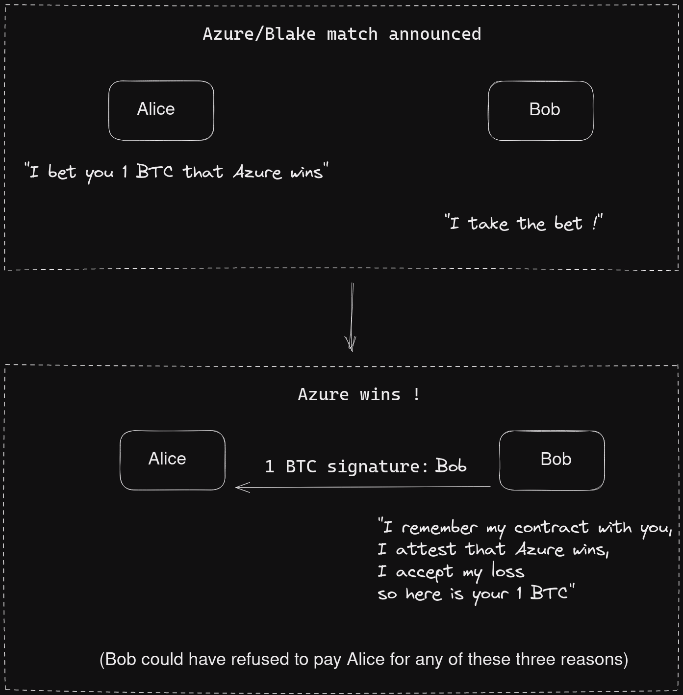
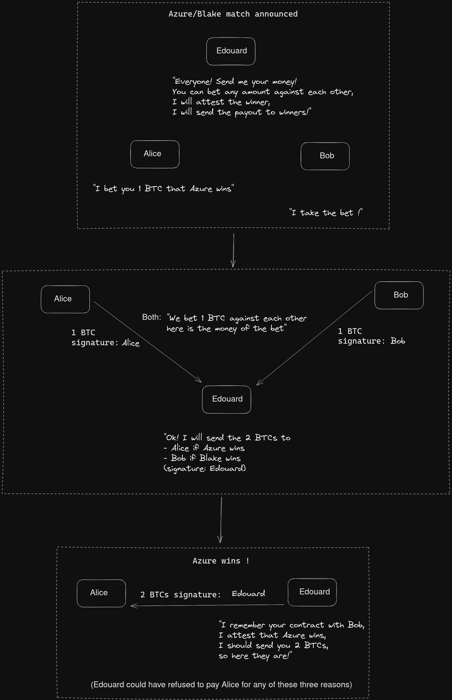
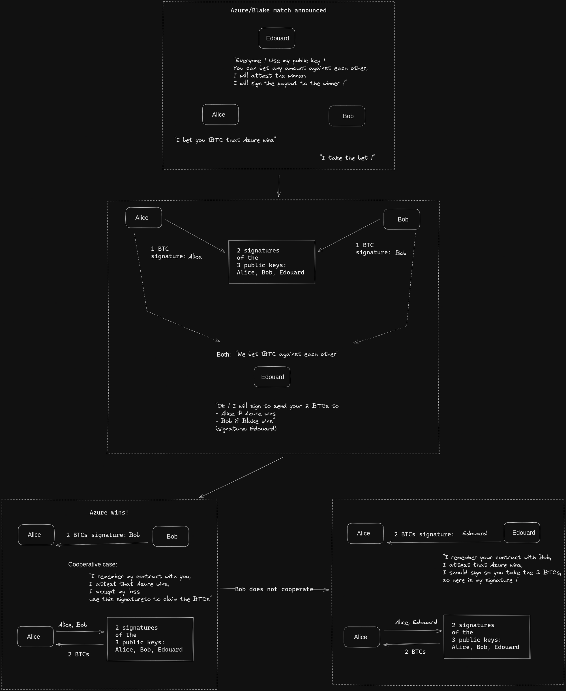
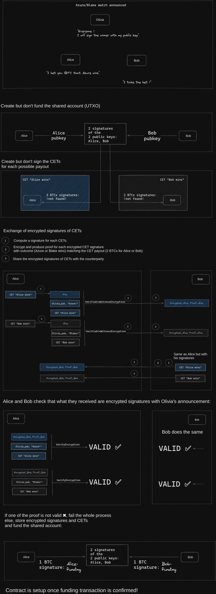
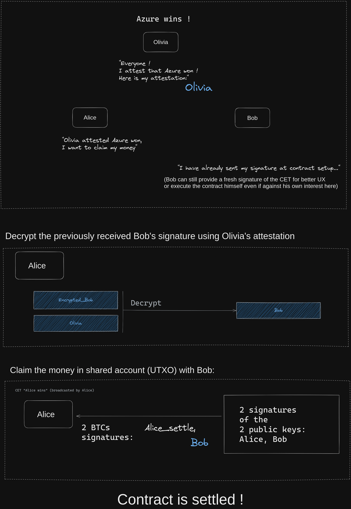

> *作者：Théo Pantamis*
> 
> *来源：<https://blog.lnmarkets.com/oracle-based-conditionnal-payment-on-bitcoin-2/>*

最近的 Taproot 软分叉是比特币的一个重大里程碑，它带来了让人兴奋的创新和应用开发的可能性。这些创新的其中一种是 “谨慎日志合约（Discreet Log Contract，DLC）”，这个概念最早是由 Taddeus Dryja 提出的。利用 libscep256k1 曲线上的 Schnorr 签名实现，DLC 成了比特币生态系统的关键基础设施。不过，就跟所有的新科技一样，DLC 也必须有详细的规范以及审慎的运用。幸运的是，我们已经看到了第一种基于 DLC 规范的产品放出，而 LN Markets 的团队也在积极探索利用这种新技术。那么，让我们一起钻进 DLC 的兔子洞，看看我们会走到哪里去吧！

（译者注：严格来说，DLC 基于 “适配器签名（adaptor signatures）”。ECDSA 算法（比特币在 Taproot 升级之前可用的唯一签名算法）也可以实现适配器签名从而支持 DLC。但 Schnorr 签名的适配器签名可能效率更高。）

在这篇文章中，我们会为 DLC 所解决的问题提供一个概要的解释，并比较现有的其它解决方案，以及为实现 DLC 所需部署的密码学技术。在下一篇文章中，我们会深入到相关的密码学元件的提议中去。最后，在最后一篇文章中，我们会解释 DLC 将带来的实际影响，尤其是对衍生品交易的影响。

## 条件式支付

### 作为一种特殊情形的日常支付

在金融世界里，由所有者的资金触发、由对方的账户接收的简单支付，是簿记系统的基础。但是，对于更复杂的金融合约，比如打赌、对冲、智能合约和衍生品来说，需要更复杂的支付方式。这些支付以现实中发生的具体事件为条件，并由账本上的见证消息（attestation）触发，而不是由所有者的授权触发。这类支付叫做 “条件式支付”。

这里的困难在于，账本只是对我们所作出的承诺的记录，除了这些在账本上写东西的人，账本跟真实世界并无关联。这就是为什么我们需要来自某一些人来证明某一件事情已经发生，不论是直接的还是间接的。这些见证消息，就成了无需支付者的授权就触发一笔支付的扳机。这就是为什么我们管它们叫 “条件式支付”。谨慎日志合约解锁了实现条件式支付的新的可能性。

### 条件式支付与托管

在条件式支付的世界中，支付者可能并不完全保管着所有的资金，因为这些资金在某一个事件发生时，无需支付者的签名就能触发支付。这个过程一般涉及两个独立的步骤：

- 注资：各方发送自己愿意损失的最大数额、到自己并不完全控制的地址中，表示接受合约
- 支付（结算）：某人根据被见证的事件，发布一条或多条被触发的交易，从而根据事件实现支付

这两个步骤就组成了一个合约，第一步是合约的建立，第二步是合约的执行。值得指出的是，两步之间可能有额外的步骤。

在合约持续期间（已经注资，但还未结算），任何一方都必须锁住自己承诺愿意损失的最大数额的资金，等到合约结算之后才能拿回资金。合约结算的标志是，缔结合约的参与者无法从合约中获得更多的资金。

### 简单的合作情形

我们用两个人物 Alice 和 Bob 来举个例子（每个密码学家都这样干，对吧）。他们俩想对 Azure 团队和 Blake 团队的比赛打个赌，并且用比特币结算。在一个理想世界中，人们总是正直又诚实，Alice 愿赌服输，Bob 也是如此。这种合作式结算合约的情形，如果能够做到，当然皆大欢喜。不需要第三方，他们俩的隐私也得到了保证，因为合约的结算靠一笔普通的交易就完成了。

- 在双方合作的情形中，条件式支付只是一笔普通的支付 -

但是，在现实世界中，每个人都有输掉之后赖账的动机。大部分情况下，Alice 和 Bob 同意跟彼此打赌，但他们不愿意相信对方会愿赌服输，他们希望确保赢了赌注就不必看对方的人品。他们希望有一种条件式支付：只有当 Bob 失去了他可能要发送给 Alice 的资金的完全控制权之后，Alice 才会认为 Bob 已经接受了合约；反过来 Bob 也一样。因此，使用一个第三方作为合约资金的托管商，似乎是明显的解决方案。

## 基于第三方托管的条件式支付

### 单一托管商

在账本的世界中，触发一笔支付是非常直接的 —— 只需要使用电子签名就性了。但是，在条件式支付中，各方必须失去对自己所承诺要加入合约的资金的完整控制权，所以必须加入一个第三方。这里假设有一个 Alice 和 Bob 都信任的托管商 Edouard，他提供了一个解决方案。

假设 Alice 和 Bob 不信任彼此，他们同意提前发送资金给 Edouard，后者将完全控制这些资金。使用 Edouard 的签名，Edouard 可以见证哪一支团队获胜了，并触发合约的结算：签名一笔交易，将资金发送给赢得赌注的一方。

这种方案叫做 “基于单一托管商的支付”，常用于托管式交易所。其主要优势在于，合约可以容纳任意多个参与者。

在单一托管商支付模式中：

1. 缔约的参与方宣布自己希望在托管商处达成合约
2. 托管商知晓自己将处理合约，并提供了一个自己控制的地址
3. 缔约的参与方将资金发送给托管商
4. 托管商等待结果
5. 根据合约的规则和结果，将资金发回给缔约的参与发

- 通过托管服务商形成的条件式支付 -

但是，它也有自己的缺点，主要是托管商有可能盗走资金。此外，因为托管商是中心化的，它出了任何问题都有可能导致资金损失，即使托管商自身诚实，即使 Alice 和 Bob 愿意合作，也无济于事。

**多签名的托管**

一种更好的办法是，使用一个 2-of-3 的多签名地址，让 Alice、Bob 和 Edouard 一起参与。这使得 Alice 和 Bob 只需使用 Edouard 的公钥就可以缔结合约。如果他们都同意比赛的结果，两人合作就可以结算合约。但是，如果他们不同意，他们可以通知 Edouaard，由 Edouard 提供一个签名来给赢家支付（赢家自己可以提供另一个签名）。

在这种基于多签名托管的条件式支付中：

1. 缔约的各方也许需要宣布跟托管商达成合约的企图
2. 将资金发送到使用托管商的公钥构造的 2-of-3 多签名地址中
3. 也许需要等待事件发生并合作式结算合约
4. 否则，将争议提交给托管商解决
5. 托管商知晓合约内容、见证一个结果
6. 托管商根据合约的规则，签名一笔交易，根据事件结果分发资金
7. 胜出的一方签名同一笔交易，并广播交易

- 在一个基于多签名托管商的条件式支付方案中，赢家由两种办法获得支付 -

这种方案对 P2P 交易所（比如 BISQ 和 Robosats）来说是合适的，因为它在双方合作的情形中提供了更好的隐私性，但它仅对两个参与者的合约有效（只需一个赢家和托管商一起签名，就可以结算合约）。

这种办法的另一个好处在于，Edouard 不能再直接盗取资金，也无法阻止缔约的参与者合作结算，甚至可能根本不知道有这么一个合约。但是，输家可能会尝试阻止赢家联系 Edouard，或者先一步联系 Edouard 并谎报合约的内容，从而欺骗 Edouard。

### 基于托管商的条件式支付的问题

任何基于托管商的条件式支付都会引入一个第三方托管商（在这里是 Edouard），TA 必须完成下列任务：

- 解读：正确理解 Alice 和 Bob 之间的合约
- 见证：确定自己要见证哪一个结果
- 执行：根据合约的规则以及事件的结果，签名交易，将资金分发给缔约的参与者

除非他们真的做好了不向托管商公开合约的准备，否则，Alice 和 Bob 应该尝试在争议发生前通知 Edouard 这份合约的存在。否则，Edouard 可能会被欺骗、误解合约条款并偏向某一方。比如说，如果 Bob 声称自己误将资金发送到了这个 2-of-3 多签名地址中。Edouard 可能签名交易将所有资金都发给 Bob，从而无意中欺诈了 Alice。

为了避免这种误会，Alice 和 Bob 必须明确表示他们跟 Edouard 缔结合约的意图，并确保 Edouard 完全理解了合约的条款。甚至 Edouard 可能会用一个签名来见证自己的理解。如此一来，如果 Edouard 在未来犯了错误，Alice 和 Bob 就可以证明他并没有正确执行合约，其他人将可以看出 Edouard 是不堪信任的。

虽然基于托管商的条件式支付是一种实用的方案，它也有重大缺陷，因为托管商既负责见证结果，又负责执行合约。这就是 DLC 所解决的问题：通过分离第三方的角色，移除了托管商执行合约的责任。

## 基于断言机的条件式支付

### 分离事件的见证合约的执行

一开始，人们认为托管商在条件式支付中是必需的，因为需要第三方来见证触发支付结算的事件，从而无需支付者的操作就结算合约。但是，让第三方签名来分发资金并不是必需的。更好的方案应该分拆条件式支付的不同部分

在见证事件时，第三方是必需的。在基于多签名的托管方案中，缔结合约的参与者可以共同保管资金，同时约束彼此，就像闪电网络中的支付通道一样。因此，第三方只需要见证事件，缔结合约的参与者就可以根据第三方的见证消息、单方面拿走合约中的资金。

这个 准-受信任 的第三方叫做 “断言机（oracle）”。缔结合约的参与者相信断言机会在事件发生时见证真正的结果，通常是发布数字签名。他们不必信任断言机会正确地分发资金，也不需要信任断言机会在合约持续期间将资金挪作他用。也不需要信任断言机会裁决争议；断言机仅仅见证事件，参与合约的各自己领取奖金。这就是 “基于断言机的条件式支付（ObC）”。

### 主要的密码学元件：可验证的加密

为了让第三方断言机 Olivia 可以见证事件结果，以及 Alice 和 Bob 可以单方面根据断言机的见证消息领取奖金，他们必须走一个特定的流程。

Olivia 必须使用自己的私钥签名一条跟她所见证的事件相关的信息，将每一种可能的结果与一个公钥关联起来。Alice 和 Bob 必须在为合约注入资金之前，交换根据每一种结果产生支付的碎片签名。这些预先签名的、放在链下的交易叫做 “合约执行交易（CET）”。每一种可能的资金分配情形都必须有一条 CET 并得到双方的签名。

但是，必须保证，每一方都不能不搭配 Olivia 对相应见证消息的签名就直接使用对方的签名（单向性）。因此，这些 CET 的碎片签名必须使用跟 Olivia 对对应事件结果的签名相关联的公钥来加密。不过，如果 Bob 要给 Alice 发送这样的加密签名（反过来也一样），问题就来了。她需要验证自己收到的数据正是 Bob 对某一个 CET 的加密签名、并且她可以用 Olivia 对特定消息的签名来解锁。否则，Bob 可以随便发送一堆数据给 Alice，Alice 也没法区分。为此，我们需要**可验证的加密见证数据**（verifiable witness encryption）。在这种加密技术中，一种证据可用来验证被加密的数据在解密后具有特定的数据，并且无需用到加密数据所用的私钥。

### 基于断言机的条件式支付与非此即彼的结果

验证某段加密的数据具备特定属性的能力，就是那块缺失的拼图。有了它，Alice 和 Bob 就可以建立一种合约，让 Olivia 的角色仅限于见证一个事件：使用自己的私钥对表示结果的消息签名。

使用这样的密码学元件的基于断言机的条件式支付的一般流程如下：

- Olivia 是一个已知的断言机。她打广告说自己会见证  Azure 和 Blake 的下一场比赛的结果，并签名赢家的名字。
- Alice 和 Bob 分别认为 Azure 和 Blake 团队会赢得比赛，所以打了一个赌。他们构造了一个 2-of-2 的多签名地址，并准备好了一笔充值交易。
- 他们准备好了花费充值交易输出的所有 CET 并签名。每一个 CET 都对应着一种可能的结果。这里只有两种结果：Azure 赢得比赛，所以 Alice 赢得赌注，拿走所有的资金；Blake 赢得比赛，从而 Bob 赢走所有赌注。
- 他们使用可验证加密方案的加密方法，为每一个 CET 的签名加密；这里用到了队名和 Olivia 的公钥；最后他们交换结果（加密签名）和证据。
- 他们使用可验证加密方案的验证方法，确保自己能够使用 Olivia 的见证消息为对应的每一个 CET 构造处一个有效的签名
- 如果所有检查都通过了，他们就交换一笔退款交易的签名。这笔退款交易有一个非常长的时间锁。然后他们签名充值交易并广播出去，让多签名地址获得资金。合约建立完成。

- 使用可验证的加密见证数据的断言机条件式支付的合约建立流程 -

在比赛结束后，Olivia 见证结果，Alice 和 Bob 就可以结算支付了：

- Olivia 签名胜出的队伍（假设是 Azure）
- Alice 赢得赌注，她可以直接跟 Bob 请求领取奖金。如果 Bob 承认自己输了，并且愿意签名将所有资金发给 Alice，这个合约就算合作式地结算了。
- 但是，如果 Bob 不愿服输，Alice 可以使用 Olivia 对 “Azure” 的签名来解密 Bob 给对应 CET（将所有资金发给 Alice 的那一个）的加密签名，从而获得 Bob 的有效签名；加上自己的签名就可以从 2-of-2 多签名地址中领走资金。
- 如果 Olive 无法用自己的私钥见证比赛的结果，Alice 和 Bob 可以在时间锁过期后广播退款交易，将资金原路返回。

- 结算流程。如果 Olivia 无法见证，带有时间锁的退款交易可以让 Alice 和 Bob 拿回自己的资金 -

## 结论

建立合约涉及制作条件式支付的程序，而在比特币中，支付一般以电子签名的揭晓为条件。但是，它们无法用现实生活中的事件来触发这些支付。

因此，我们需要第三方来见证事件，并触发条件式支付。比特币现有的解决方案依赖于受信任的托管商，由托管商来解读合约，并基于需要见证的事件的结果来执行合约。

基于断言机的条件式支付，通过移除托管商解释和执行合约的责任，来解决这个问题。相应地，托管商就变成了一个断言机，仅仅签名表示事实的消息。

为了在比特币上实现这样的支付，需要一种对比特币签名的高效可验证加密见证数据。在我们的下一篇文章中，我们会讨论不同提议的优点和缺点。众所周知的 DLC ，是一个可验证加密见证数据提议的一个突出例子。在第三篇文章中，我们会解释如何处理更加复杂的结果，比如根据价格来结算合约的情形。