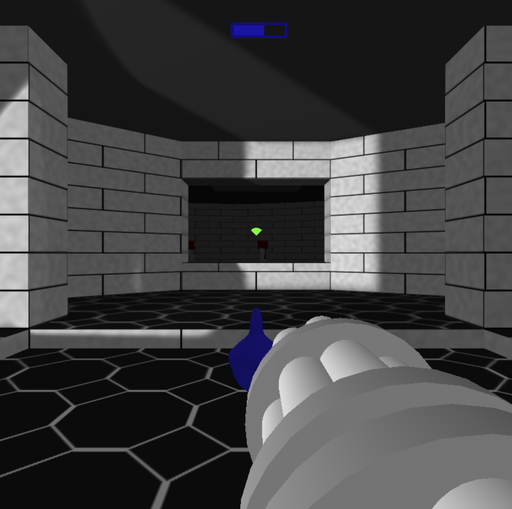
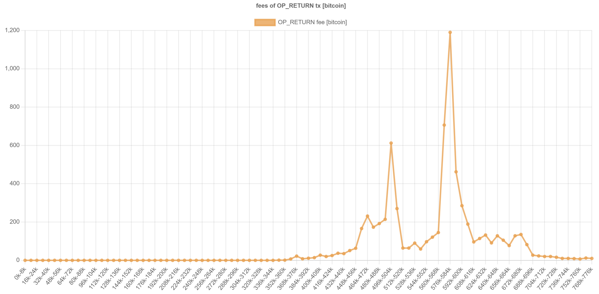
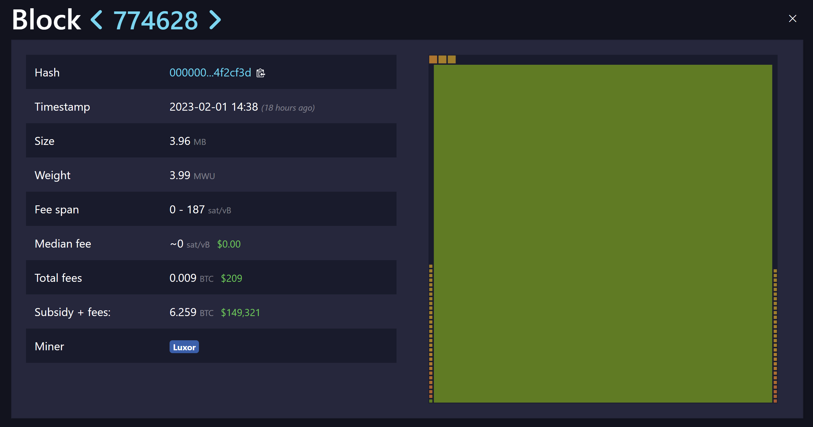
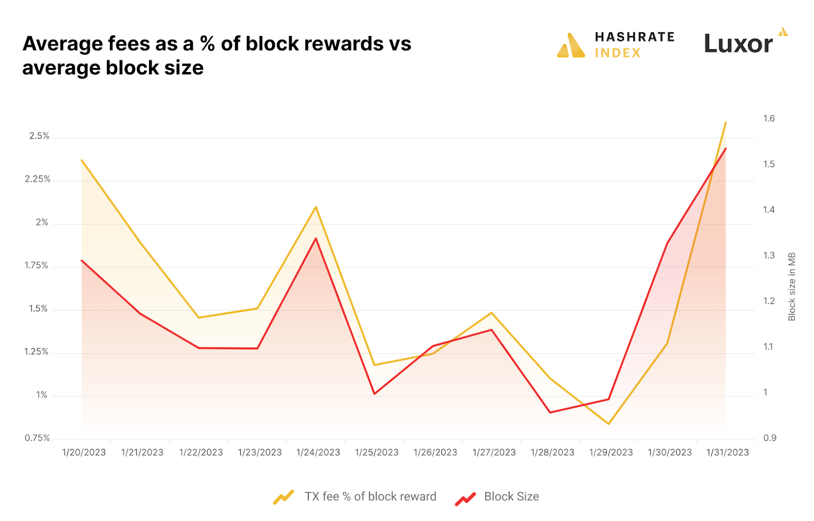
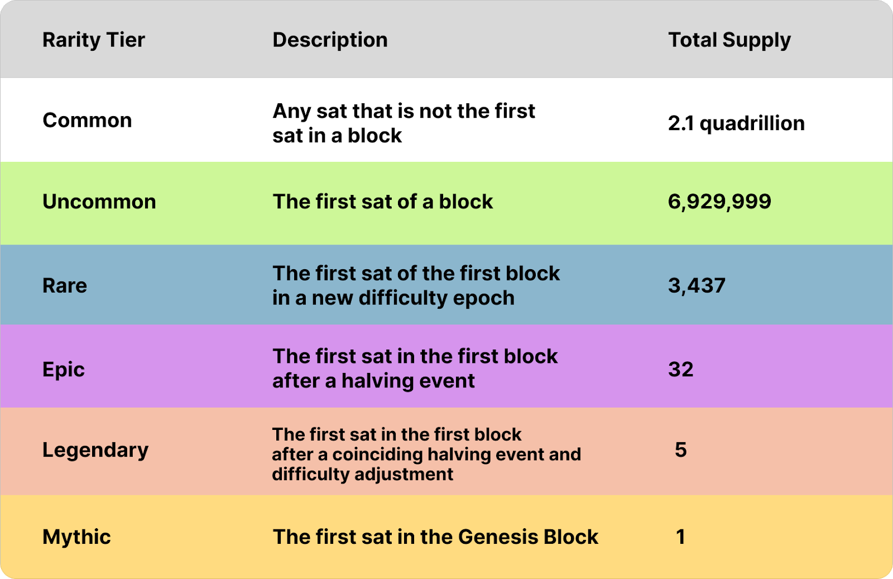

> *作者：在比特币区块链上铸造非同质代币*
> 
> *来源：<https://hashrateindex.com/blog/ordinal-nfts-inscriptions-digital-artifacts-oh-my/>*

意外还是惊喜？

最近出现了一种在比特币区块链上铸造非同质代币（NFT）的新方法，它可以将 NFT 的实质内容完全放到比特币区块链上。

只有这套标准的创造者 Casey Rodarmor 不乐意管这些东西叫 NFT。他认为这个词已经被污名化了，所以他将这些东西称为 “电子艺术品”。[不管你叫它 “电子艺术品” 还是 “序数 NFT”](https://ordinals.com/)，它们使用了 “序数理论” 来标记和跟踪这些 “铭文（inscriptions）”，也就是嵌入到区块链的 数据/内容。

所谓 “序数”，就是描述了一个序列内部的特定位置的数字（例如，“第一个”、“第二个”）。而在这里，“序数” 是指特定某一个聪（satoshi，比特币的最小单位）的 UTXO（未花费的交易输出）。这个聪 “包含” 了一段铭文，也就是 NFT 的内容，可以是文本、图片、HTML 文件，甚至是 MP3（音乐文件）；而序数将这个附加了铭文的聪标记成了一笔特殊的交易，所以用户可以定位和跟踪它们。令人惊讶的是，这样的为聪排序的系统，早在 2012 年就已经有人[提出来](https://bitcointalk.org/index.php?topic=117224.0)了。

自 1 月份推出以来，超过 1000 个电子艺术品已经在比特币区块链上永存。这些铭文包括推特截图、新兴的 NFT 系列、Keet.io 软件的广告，甚至一个 8 像素的视频游戏（[像是传统的射击游戏 Doom 的克隆版](https://ordinals.com/inscription/521f8eccffa4c41a3a7728dd012ea5a4a02feed81f41159231251ecf1e5c79dai0)，你可以在 ordinal 区块浏览器里玩到）。

除了这些琐碎但不乏乐趣的图片、视频游戏等等，序数 NFT 还可以用作敏感信息的抗篡改、抗审查存储。

- 传统的射击游戏 Doom 现在已经永存在比特币区块链上了 -

不像此前出现的基于比特币区块链的 NFT，序数 NFT **并不使用**比特币的 OP_RETURN 输出（该操作码也允许用户在链上存放任意数据）。相反，它使用的是比特币区块的交易 witness（见证数据）字段，以及 tapscript （因为 2021 年的 Taproot 升级而出现的脚本编程功能）。

序数 NFT 是原生于比特币的，所以它不需要一条新的区块链，也不需要一种新的代币。**而且它还把 NFT 的全部内容都存储在链上，不像其它的 NFT 标准那样仅仅把一条链接放到链上。**

这种创新已经解锁了区块空间的新应用场景（至少，是降低了进入新场景的门槛）。自然地，这使得一些矿工希望序数 NFT 能进一步推动对区块空间的需求，并产生更大的手续费收益，但并不是所有人都对这项创新感到高兴 —— 比特神教阵营的一些人认为，这往好了说就是一些微不足道的小玩意，而[从坏的一面看就是对比特币的攻击](https://twitter.com/BitcoinIsSaving/status/1619916042607919105)。

## Counterparty、Rare Pepes 和比特币 NFT 的回归

在我们深入了解序数 NFT 之前，我们先花点时间了解一下以往在比特币上铸造 NFT 的尝试。

不管怎么说，NFT 确实起源于比特币。在以太坊和 Solana 链上的素朋克和耷拉着眼睛的猴子变成名人的玩具之前，比特币上就已经有交易卡片和 “青蛙佩佩（Pepe the Frog）” 了（译者注：青蛙佩佩就是那个眼睛很大、经常作悲伤表情的形象。）

NFT 最早出现于 2015 年，是在 Couterparty 上出现的；这是一种区块链网络，使用比特币的 OP_RETURN 输出来制作非同质资产。OP_RETURN 于 2014 年 3 月引入之后，11 月，Robby Dermody、Adam Krellenstein 和 Ouziel Slama 就推出了 Counterparty。2015 年，这个平台的第一套 NFT 出现，是一种类似于 “万智牌（Magic-the-Gathering）” 的卡牌交换游戏，叫做 “Spells of Genesis”。

堵车，Counterparty 的真正爆发，是在[青蛙佩佩交换卡系列](https://rarepepes.com/)的 1774 个 NFT 推出之后。收藏家们使用 Counterparty 钱包保管这些 NFT，而 Counterparty 使用 OP_RETURN 输出，将这些 NFT 的索引锚定到比特币区块链。OP_RETURN 输出可附带的数据大小限制在 80 字节，只够 Counterparty 把 NFT 的描述、名称和数量放进去（但对序数 NFT 来说，数据体积的唯一限制就是比特币区块的体积限制，这个我们会在后面详说）（译者注：如果不要求连续地存储，OP_RETURN 这样挂载数据也可以认为仅受到区块大小的限制，但这个上限会比序数 NFT 的做法要低。）

OP_RETURN 交易的交易量在 2018 年末达到峰值，在 2019 年春天跌到谷底，然后在 2020 年随着 OMNI（Tether 最初发行 USDT 的平台）和 Counterparty 的退出而逐渐消失。2019 ~ 2020 同样也是 USDT 迁移到以太坊、以太坊上的早期  NFT 项目兴起的时间。

上图给还在萌芽期的序数 NFT 提出了一个响亮的问题：序数 NFT 会步他们的后尘吗？还是能够产生更大的影响呢？

## 什么是序数 NFT（电子艺术品、铭文）？

书接上回，我们来看看序数 NFT 的几个基本模块：

- 交易的见证数据字段：就是存放 NFT 的数据和内容的地方。
- 铭文：就是 NFT 的主体 —— 放到比特币区块链上的实际内容，NFT 代表的是对这些内容的所有权。铭文会刻在交易的输入的见证数据字段，而 NFT 就被赋予这笔交易的第一个输出的第一个聪。你也会看到人们把铭文称为 “电子艺术品/序数 NFT” —— 这三个词已经可以同义混用了。
- 信封：铭文会存放在（见证数据内的） Rodarmor 称为 “信封” 的区域，这个区域是由 OP_IF 和 OP_FALSE [操作码](https://en.bitcoin.it/wiki/Script)构成的。就像 OP_RETURN 一样，这些操作码是用来给比特币区块链发送指令的。[在 “信封” 这种用法中](https://twitter.com/rot13maxi/status/1618702549296779264)，OP_IF 存放被铭刻的数据，而 OP_FALSE 则确保这些数据永远不会被实际执行 和推入堆栈**（所以，虽然一些神教教徒在制造恐慌，但实际上，全节点并不需要处理和验证铭文，只需要处理和验证 UTXO 集，NFT 自在其中）**。
- 序数：用数字排序的数学理论，在这里的用途是将单个单个的聪辨识为 “电子艺术品”（也就是 “序数 NFT”）。序数将一笔交易的第一个输出的第一个聪定义为 NFT；一旦标记之后，这个聪就可以像别的 NFT 那样转手和交易。

不像 Counterparty NFT（在链上的部分只有 80 字节），**序数 NFT 没有体积限制，仅受交易见证数据字段的 4MB 体积限制**。所以，如果你的文件足够大，理论上你可以铸造一个序数 NFT，只用其铭文就将整个比特币区块塞满。

Taproot 升级带来的 tapscript，以及隔离见证升级带来的交易见证数据字段，让这一切可以组合起来。

在 2017 年隔离见证升级之后，比特币交易的签名就可以从 “脚本签名（ScriptSig）” 字段移到见证数据字段，而且这个字段中的数据不会被包含在区块的交易默克尔树中，而且是专门放在一个单独的区域中（这就是它的名字 “隔离见证（Segregated Witness）” 的由来）。

隔离见证实质上扩大了区块体积上限，因为包含在见证数据字段中的数据，都不会占用比特币原本为区块安排的 1MB 空间。也正因此，隔离见证升级引入了一种新的度量区块体积的方法，叫做 “区块重量”，放在见证数据字段中的数据，会比放在原本的区块空间内的数据 “更轻”。所以在隔离见证交易的见证数据字段内存放数据，会比在区块内存放数据（译者注：比如 OP_RETURN 输出）更便宜。这就是所谓的 “见证数据折扣”，也是让序数 NFT 得以产生的关键。

另一个关键是 Taproot 升级。虽然引入了见证数据折扣，但隔离见证依然为单笔交易可以在见证数据字段放置的数据量安排了限制。Taproot 升级放宽了这些要求，完全移除了限制，所以理论上你可以用全部的区块空间（译者注：准确来说是见证数据空间）铭刻一个内容高达 4 MB 的 NFT。（我们 Luxor 真的付诸实践了，挖出了一个带有 [3.9 MB 的电子艺术品](https://ordinals.com/inscription/0301e0480b374b32851a9462db29dc19fe830a7f7d7a88b81612b9d42099c0aei0)的[区块](https://mempool.space/block/0000000000000000000515e202c8ae73c8155fc472422d7593af87aa74f2cf3d)，这也是有史以来最大的区块）。

- <a href="https://mempool.space/block/0000000000000000000515e202c8ae73c8155fc472422d7593af87aa74f2cf3d">有史以来最大的区块</a>；铭刻的 NFT 有 3.94 MB，区块总大小 3.96 MB -

“附加铭文的交易是 taproot 输出的花费交易，会将相应的 tapscript 暴露出来，因此铭文的内容和文件类型也会暴露出来”，序数 NFT 的创始人 Casey Rodarmor 在一次手机访谈中说，“铭文会 ‘附着’ 在这样的交易的第一个输出的第一个聪上 …… 然后序数协议允许你使用普通的比特币交易转移这些聪。”

如比特币开发者 [Peter Todd 指出](https://twitter.com/peterktodd/status/1619692068519149568)的，序数 NFT 甚至在 2017 年 8 月隔离见证激活升级之前就可以实现。但 Taproot 让它们变得更加便宜，而且允许一次性上传更大体积的文件。一些评论员说 Rodarmor 是意外发现这项创新的，就像是偶然犯了个错。

“我不会称这是一场意外 —— 我觉得人们会为此感到惊喜”，Raodarmor 说。

比特币用户需要一种特殊的钱包和区块浏览器（[Ord Wallet](https://github.com/casey/ord)）来索引和跟踪序数 NFT，但可以使用任意的比特币地址来发送和接收这些 NFT。因为电子艺术品需要 taproot 才能铸造，所以 Ord Wallet 会默认启用 Taproot 地址。

还需要提醒的是：被附加了铭文的聪，从链上来看跟其它聪依然是没有分别的，意思是它就跟其它聪一样是可以花费的，而且花费方式也没有区别。现在，一个聪只能铭刻一次，但 Rodarmor 正在开发一种升级，让用户可以重新铭刻之前已经铭刻过的聪（叫做 “抄写”）。

## 序数 NFT 对比特币矿工来说意味着什么？

尽管序数 NFT 的创始人尝试以称呼它们为 “电子艺术品” 来避免争议，但序数 NFT 在比特币人中已是热门话题。

基本上有两种阵营。支持的一方认为比特币的区块空间是一个自由市场；只要你能支付手续费，你就可以使用区块空间，不论交易有多大、包含什么内容。反对的一方则[声称](https://twitter.com/BitcoinIsSaving/status/1620184997524291586) NFT 都是骗局，会占用区块空间，这些垃圾交易会挤出更有意义的经济交易（例如普通转账）；而且，这种 “占用” 会提高下载和运行比特币全节点的带宽需求。

序数 NFT 也因为比特币的安全预算问题（不管你怎么称呼它）而进入了更大的辩论中。支持者主张，这种新的应用将推动对区块空间的需求，对比特币的未来是有好处的，因为比特币的区块奖励最终会下降到零。自然，关于区块空间和手续费的辩论也引起了矿工的兴趣，手续费收入曾经占到他们总收入的 30%，但现在，*好的时候* 也只占 3%。

现在只有超过 1000 个序数 NFT 在流通，所以它们还不能达到让交易手续费率呈抛物线增长。也就是说，比特币交易的手续费和区块体积确实都在 1 月的最后两天显著增长，但增长的一部分原因可能是比特币的哈希率从历史最高点下降了 3%，也就是出块的时间变长了，因此导致交易入块时间变长以及手续费变高。但没有序数 NFT 的铭文热潮的话，我们很有可能不会看到交易手续费和区块体积的增大。

- 没有出现天文数字，但序数 NFT 确实对区块体积和交易手续费产生了影响。来源：<a href="https://data.hashrateindex.com/network-data/btc">Hashrate Index</a> -

序数 NFT 很有可能不会提高交易手续费。当然，它们是可能导致手续费提高的，但不是你想的那样。毕竟，因为得到了隔离见证的折扣，理论上一个装满电子艺术品的区块，可能比装满普通比特币交易的区块携带更少的手续费。

但如果足够多的用户开始铸造序数 NFT，他们就会跟普通交易激烈竞争区块空间，而广播普通交易的用户就需要提高手续费，才能让自己的交易被打包。这样一来，矿工可能会优先打包尽可能多的普通交易，因为它们为每自己的数据支付的手续费更高，所以打包的普通交易越多，手续费收入越高。

所以，即使序数 NFT 会产生手续费上涨压力，矿工也有可能会优先打包更多的普通交易，以产生更高的手续费。

## 稀缺性

真正会给矿工带来好处的可能不是交易手续费，而是挖出电子艺术品 —— 具体来说，就是稀缺的聪。

在一篇[论述序数理论的博客文章](https://rodarmor.com/blog/ordinal-theory/)中，Casey Rodarmot 列出了一份不同聪的稀有程度的图表。这个分类方法主要围绕比特币工作量证明的自我调节事件，也即难度调整事件和增发速度减半事件。例如，增发速度减半后的第一个区块中的第一个聪，会被分类为 “Epic” 聪；假设有这样的需求，这样的聪就可以在收藏家那里卖出更好的价钱。

图表如下：

- 稀有的聪，可以个矿工带来额外的、暴富的收入来源 -

一旦这样的收藏品市场出现，矿工将可以凭借向收藏家卖出这样的聪而赚大钱。当然，这种稀缺性完全基于这样的市场会出现的假设。但是，从[猴子](https://boredapeyachtclub.com/)、到[石头](https://etherrock.com/)，甚至[小鸡](https://www.cryptodickbutts.com/)，都在 NFT 交易的狂欢中找到了自己的收藏家，设想一些比特币人会加入这个浪潮、追逐新的减半周期的第一个聪、新的难度周期的第一个聪，也不是什么奇怪的事。

## 序数 NFT：反常吗？

Casey Rodarmor 的创新才刚刚出现了大概一个月，就已经成为了比特币圈子今年最有争议的话题。

反对的力量非常强，Bitcoin Core 的贡献者 Luke Dashjr 已经为节点运营者[编写了一个粗糙的过滤器](https://twitter.com/LukeDashjr/status/1620876981830295552)（译者注：可用于让节点不再接收这种交易到自己的交易池中，也不再转发），虽然[这个工具的功效和影响都还存在疑问](https://twitter.com/satofishi/status/1620966856071987201)。不管怎么说，OP_FALSE 意味着铭文数据不需要被验证，而且剪枝节点也完全不会保存交易的见证数据。

也有人站在另一边，许多人 —— 包括比特神教教徒和普通的密码货币爱好者 —— 都对这种新的 NFT 铸造方式感到兴奋。除了图片和收藏品，序数 NFT 还可以用来发布敏感的文件，可以从永久的、抗审查的存储和复制中受益。借用 Galaxy Digital 的  Brandon Bailey 的话来说，比特币用户可以通过铭刻序数 NFT 来策划一个 “不可篡改的图书馆”。

对矿工来说，这项创新可以导致日后的交易手续费增加，并为矿工开启额外的收入流（挖出稀有的聪），甚至产生 “矿工可抽取价值（MEV）”。

不论如何，序数 NFT 不会消失。有疑问的只是它们会造成多大的影响，以及铭文能不能够创造像以太坊和其他区块链一样的的 NFT 热潮。

（完）