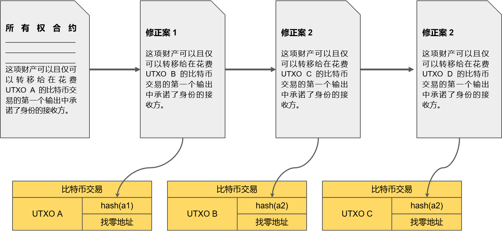
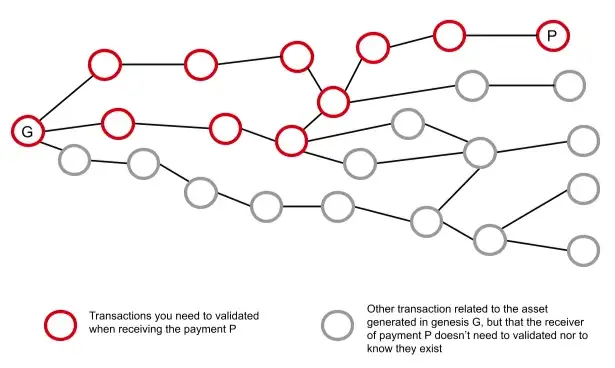
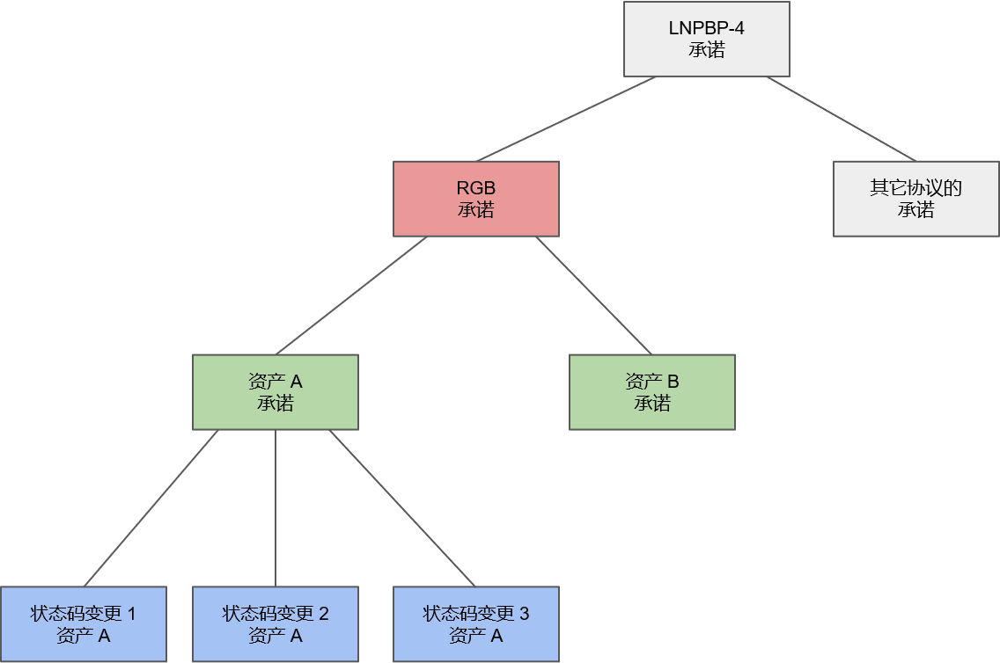

> *作者：Federico Tenga*
> 
> *来源：<https://docs.rgb.info/design>*


### 一次性密封条

实体的 “一次性密封” 是一种带有唯一编码的塑料带，通常用于检测存储和运输过程中的篡改。举个例子，当你在一个运输集装箱的门上锁好一个一次性密封条之后，如果你在再次开门的时候，发现印着自己预期中的号码的密封条完好无损，那么你就可以确信在运输期间没有人打开过这个集装箱（假设制造一个一模一样的密封条是足够困难的）。


类似地，使用电子的一次性密封条（最早由 [Peter Todd 在 2016 年](https://petertodd.org/2016/state-machine-consensus-building-blocks)提出），你可以对一条消息锁上一个电子密封条，确保这条消息只能被使用一次。举个例子，假设这条消息是某块土地的所有权证书，要是没有一次性密封系统，我可以对许多人展示这个证书，并说服每一个人我对这块土地有充分的权利，然后一地多卖。在证书上应用一次性密封条，我们可以将打开密封条的操作定义成卖出土地的必要步骤，因此，卖方就没有办法把同一块土地卖给多个人；一旦 TA 尝试这么做，第二个买方就会注意到这块土地已经卖出了，因为电子密封条已经打开过了。

实现电子化一次性密封条的一种简单方法是设置一个公证服务端，每当某一个密封条打开或者锁上时就在公开的注册处发布证书，这样任何人都能验证自己关心的密封条的状态。但是，这种设置需要用户信任这个公证服务端，因此，希望实现免信任性和抗审查性的协议不能使用这种方法。

### 基于比特币的一次性密封条

不必使用一个受信任的实体来证明电子密封条的开启和关闭，我们可以使用比特币的**未花费的交易输出**（[UTXOs](https://en.bitcoin.it/wiki/UTXO)）作为密封条。实际上，一个 UTXO 就可以被视为一个密封条：在创建它的时候，密封条锁上；在花费它的时候，密封条打开。根据比特币的共识规则，一个输出只能被花费一次；因此，如果我们拿它作为密封条，那么确保比特币共识规则得到执行的激励因素，将同样保证这样的密封条只能开启一次。

为提供一个更现实的例子，我们想象有一个所有权证书，定义了转移所有权给一个新的所有权人的必要条件是**花费某一个比特币 UTXO**（这个 UTXO 的私钥应该控制在当前的所有权人手中），而当这个 UTXO 被花费的时候，花费它的那一笔比特币交易将指明谁是这项被转移的财产的新所有权人。因为比特币交易的数据结构受到严格而刻意的规则的约束，将所有关于接收方的信息编码到比特币交易本身会有一些局限性（而且对相关方的隐私性有非常坏的效果），所以，更好的办法是，仅在比特币交易中添加一个关于接收者身份的承诺（例如，在输出字段中添加接收者的 UTXO 的一个哈希值）。

实质上，这就等同于，每次所有权转移的时候，我们都修改原始的合约，指明哪一个新的比特币 UTXO，是最新的所有权控制者。



### RGB 状态变更

RGB 协议使用上述的 “基于比特币的一次性密封条” 模式，这意味着，每当一笔 RGB 交易发生时，实际上就是发送者给某个合约（定义了被转移的权利的那个）创建了一次**状态变更**。就以同质化资产（fungible assets）为例。首先，合约的发行者设定了合约的创始状态，定义了合约的细节，例如资产的名称、总供应量，以及有权移动这些供应量的 UTXO。然后，当资产被第一次转移时，第一个 UTXO 的所有者就可以创建一次状态变更，定义哪一个 UTXO 将持有这项资产。

状态变更可以应用在变更资产所有权的权利上，也可以应用在别的类型的权利上，例如，在资产发行合约中，可以是二次发行的权利，或者是 添加/改变 资产的特定属性（例如：元数据）的权利。

### 验证

验证收到的 RGB 转账，跟验证收到的普通比特币支付有很大的区别。在比特币中，一个连接到网络的节点会持续不断地下载和验证区块以及交易池中的交易。这样的节点对 UTXO 集（区块链上所有未花费的输出的集合）总有一个实时更新的试图，当它看到一笔新交易时，要验证其有效性，只需要验证该交易的所有输入都是 UTXO 集的最新状态的一部分。

在 RGB 中，没有全局网络这样的、所有的交易都在其中传播的东西，因此也无法创建等价于比特币 UTXO 集的东西。这意味着，在接收一笔支付时，一个 RGB 客户端将不仅需要验证交易的最新状态是有效的，还必须对以往所有的状态转化作同样的验证，一路追溯到发行合约的创始状态。



与此同时，这也意味着，与比特币及任何其它全局共识系统不同，在 RGB 协议中，**一个客户端不需要知道、也不需要验证全局中发生的所有交易**，因为它只需要知道跟自己的钱包相关的交易即可。因此，每个客户端需要验证的数据量都更小，整个系统因此更加可扩展。

一个 RGB 客户端在收到一笔支付时需要一次性验证大量数据，这可能会被视为一个问题，因为它可能导致支付的处理速度比较慢 —— 花在验证上的时间会比较长。但是，仅当你初次持有一项具有很长的交易历史的资产时才会遇到这个问题；而且，可以开发出新的数据可得性层（data availability layers），让客户端可以自愿跟他人分享跟某个合约相关的状态转换数据，这样潜在的接收方可以提前开始验证一部分交易历史。

### 确定性的比特币承诺

RGB 利用了比特币区块链来**防止重复花费**，而且，这是通过在特定的比特币交易 —— 它花费了当前正持有要被转移的权利的 UTXO —— 中承诺 RGB 状态转换，来实现的。为了让这样的承诺既是可以验证的，又是安全的，我们要满足两个条件：（i）多次状态转换可以承诺到单笔比特币交易中；（ii）每一次状态转换都只能被承诺进比特币交易一次（否则就有重复花费的可能性）。

为了让多次状态转换可以放进一个承诺中，状态转换的内容要被多次聚合：首先，跟某一个合约（或者说资产 ID）相关的所有状态转换，要确定性地聚合（成一个承诺）；然后，所有被转移的资产的承诺，要被聚合成一棵默克尔树，而最终的根哈希值，就是最终的 RGB 承诺。为了保证跟其它无关 RGB、但同样也需要使用确定性比特币承诺的协议的兼容性，RGB 承诺和其它协议的承诺要再一次聚合（如 [LNPBP-4 标准](https://github.com/LNP-BP/LNPBPs/blob/master/lnpbp-0004.md)所述），如此得到的哈希值，才是实际上被嵌入比特币交易中的消息。



在最终的 LNPBP-4 消息就绪之后，有两种办法可以将其承诺到比特币交易中：

1. **Taproot 承诺**：一个包含了 LNPBP-4 消息的 OP\_RETURN 脚本，添加到一笔比特币交易的**第一个 Taproot 输出**的 TapTree（脚本树）的顶层的右叶子（top right leag）中；而且这层关系将仅在链下向 RGB 转账的接收方揭晓。这样一来，比特币交易就可以仅使用一个 taproot 输出，既将比特币找零发回给发送者，又包含这个承诺，而不必添加额外的数据，也不必暴露该交易可能包含一个 RGB 承诺的任何痕迹。
2. [**OP\_RETURN**](https://bitcoin.stackexchange.com/questions/29554/explanation-of-what-an-op-return-transaction-looks-like) **承诺**：LNPBP-4 消息直接嵌入到一笔比特币交易的第一个 OP\_RETURN 输出中。这将导致交易膨胀 46 字节，但同样不会揭晓关于这笔 RGB 转装的内容的任何消息，因为对区块链观察者来说，这就只是一个带有一个哈希值的 OP\_RETURN 输出（举个例子，跟 open timestamp 交易一模一样）。对比 Taproot 承诺，这种方法的优势在于简洁性和易于实现。

在多个承诺要插入比特币交易的情形中，只有第一个会跟 RGB 验证规则有关，其它都会被忽略，所以任何重复花费的尝试都是没有意义的。

## 批处理

因为我们可以在单个比特币承诺中包含任意数量的状态转换，大规模的批处理也成为可能。例如，假设某人想同时给多人支付，他只需为每一个接收者创建一个状态转换，并将所有的状态转换都承诺到同一笔比特币交易中，就可以了，不需要占用更多字节。这意味着，每笔 RGB 支付的链上手续费边际成本都可以非常小，因为同一笔手续费被任意数量的转账平摊了。

但是，这样的批处理技术只有在花费同一个 UTXO 时才有用，如果用户要花费多个 UTXO，那么每个 UTXO 都需要用作比特币交易的输入，则这笔交易的体积会增加、需要支付的链上手续费也会提高。这意味着，批处理对使用合并 UTXO 的服务供应商来说尤为有用，比如要给大量用户操作取款的托管式交易所。比如，一个交易所可以每 30 分钟将所有的取款请求聚合在一起，只需付出带有一个输入和一个输出的比特币交易的链上手续费，就可以及时给每个发起取款请求的用户支付。

### 隐私性

得益于客户端验证的设计（向区块链观察者隐藏了信息），RGB 已经得到了**更高程度的隐私性**，但是，为了进一步提升其隐私性，我们还给协议添加了其它特性。

#### 盲化的 UTXO

为了让转账的接收方获得对抗支付方的额外隐私性，RGB 使用了 “**盲化的 UTXO（blinded UTXOs）**” 而不是普通的 UTXO 作为支付的输出点。这意味着，当一名用户想要接收支付时，他不会分享自己希望用来接收资产的 UTXO，他会给出这个 UTXO 的一种盲化形式，由 UTXO 拼接一个随机盲化秘密值之后的哈希值组成。如此一来，支付方就完全不知道资产去了哪里，而且支付方也无法看到资产未来的花费方向（在常规的比特币链上支付中，支付方总是能看到这些信息）。

而在花费的时候，为了证明自己的 UTXO 正是某个资产的所有者，发送者需要跟接收者分享用来生成盲化 UTXO 的盲化秘密值，所以，在验证阶段，新的接收方可以验证出来，那个盲化的 UTXO，确实是从这个要花费的 UTXO 中推导出来的。

盲化 UTXO 的例子：

```
UTXO:
ad3ebdcda0f83b37fffab0439c89fd3ef7d99c41c353a45a98d5983d9ad00183:0

盲化秘密值：
8114079862469528952

盲化输出点：
txob1kewrvnf8sjmarq65gv98lz2xrgxylpnlta8lc3p78fjxaw9qda4qkewlwr
```

#### Bulletproof

为了隐藏一项资产的交易历史中的每一次状态转换的具体数值，RGB 还实现了**一种零知识证明机制**；这种机制叫做 “Bulletproof”，是由 Blockstream 公司开发出来的，它是 “机密交易（Confidential Transactions）”（已经用在 Liquid 侧链中） 的一种经过优化且效率更高的版本。感谢 Bulletproof，用户可以获得对抗未来的资产所有权人的隐私性。虽然未来的所有权人可以看到从创始状态到自己的状态这一路上用到的所有 UTXO，但他们看不到每一次状态转换中被转移的资产数量（但得益于零知识证明，他们依然可以验证此前任何时刻都没有出现过隐形的通胀）。

你可以从 [Blockstream 的博客](https://blog.blockstream.com/en-bulletproofs-faster-rangeproofs-and-much-more/)中了解 Bulletproof。

### 客户端间通信

为了达成一笔 RGB 转账，参与的客户端需要彼此分享一些数据。具体来说，发送者需要给接收者（们）分享 consignment，**这种数据结构包含了验证转账所需的一切信息**，包括可以追溯到合约创始状态的所有状态转换。

RGB 协议不关心用于这种数据分享操作的通信渠道，而且这确实也可以用许多方式实现。虽然你信鸽来分享 consignment 也是可以的，但 RGB 软件已经实现了更实用的电子化信道。当前，在 RGB 软件中主要有两种分享数据的方法：

* [Storm](https://github.com/Storm-WG/storm-spec)：一种点对点的即时通信和存储系统，基于闪电网络。
* [RGB 代理服务端](https://github.com/RGB-Tools/rgb-http-json-rpc)：一种标准化的 HTTP JSON-RPC 服务端，其客户端可以上传和下载数据。用户可以运行自己的代理服务端，也是使用第三方的服务端。依赖于第三方的服务端会影响隐私性和抗审查性，但不影响安全性。

通信方式的协调可通过一种[发票协议](https://github.com/LNP-BP/invoices)来完成，接收者提供一种或多种发送者可用于上传 consignment 数据的端点。

（完）