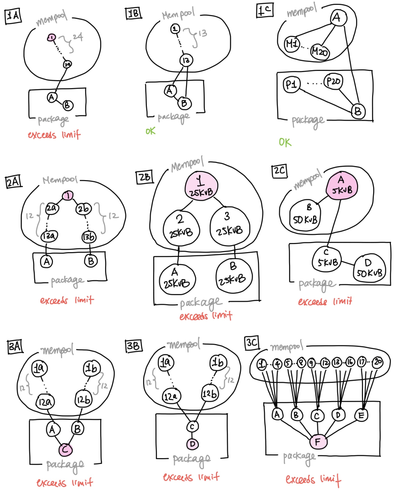
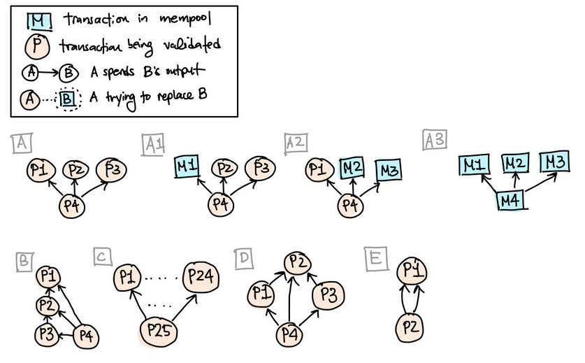
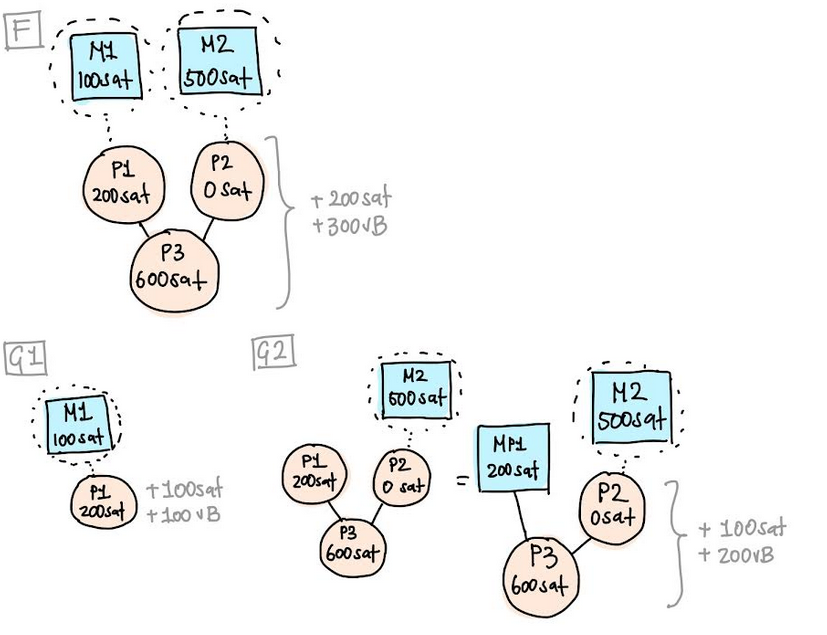
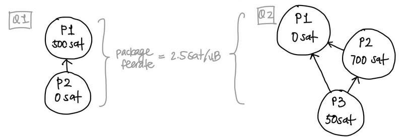
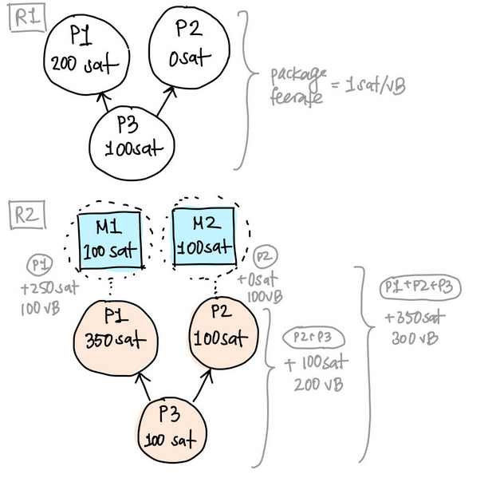

> *作者：Gloria Zhao*
> 
> *来源：<https://gist.github.com/glozow/dc4e9d5c5b14ade7cdfac40f43adb18a>*

我正在提议改变 `Bitcoin Core` 的一组交易池规则（policy，策略），以开启基于交易包的交易池验证（作为 “交易包转发” 特性的准备工作）。这不是共识层的改变，也不是 P2P 协议层的改变。但是，因为交易池规则将极大地影响交易的传播，所以我认为在邮件组里公开也是有意义的。

我的提案将允许多笔父交易和一笔子交易形成一个交易包并在网络中传播。如果你所开发的软件依赖于特定的交易转发假设 以及/或者 将在未来使用 “交易包转发（package relay）” 特性，我很希望能听到你对交易包规则在你的应用中的效用和局限性的反馈。

这份提议的一个草案实现可以在 [Bitcoin Core PR#22290](https://github.com/bitcoin/bitcoin/pull/22290) 找到。

## 背景

如果你已经熟悉交易池规则和交易包相关的术语，尽可以跳过这部分。

### 术语清理

- 交易包（package）：相关交易的一个有序列表，可以用一个 “有向无环图（directed acyclic graph）” 来表示
- 交易包手续费率：包内所有交易的修正后总费用（total modified fees）除以总虚拟体积
  - 修正后费用：一笔交易的基础费用（base fees）加上用户使用 `prioritisetransaction` 指定的手续费偏移量。因此，我们预计这个值在不同交易中各不相同
  - 虚拟体积：使用 [BIP141 虚拟体积](https://github.com/bitcoin/bips/blob/1f0b563738199ca60d32b4ba779797fc97d040fe/bip-0141.mediawiki#transaction-size-calculations)规则和 sigop 重量计算出来的虚拟体积最大值。[在 `Bitcoin Core` 的这里实现](https://github.com/bitcoin/bitcoin/blob/94f83534e4b771944af7d9ed0f40746f392eb75e/src/policy/policy.cpp#L282)
- 手续费追加（fee bumping）：用户/钱包 的动作，利用矿工的激励加速一笔交易进入区块的优先级，包括 “子为父偿（CPFP）” 和 “[BIP125](https://github.com/bitcoin/bips/blob/master/bip-0125.mediawiki) 手续费替换”。在交易池规则中，我们的目标是，判断出一笔新进入的交易是否比池内原来的交易更加经济，但不会开启 DoS 界面，所以也需要一些限制。

### 规则

交易池的目标是存储最好的（跟矿工的激励最相容的、手续费率最高的）区块内容候选。矿工使用交易池来构建挖矿区块模板。交易池也是一个有用缓存，可以加速区块转发、提高验证性能、协助交易转发，以及声称手续费率估计。

理想情况下，所有在共识上有效、支付了足够多手续费的交易，都应该能够通过常规的交易转发特性传递给矿工，而不需要专门的连接和矿工私人关系。但另一方面，节点没有无限的资源，而且一个设计上允许诚实节点广播自己的交易的点对点网络，也将交易验证引擎暴露在恶意对等节点的 DoS 攻击下。

因此，在考虑让我们的交易池接纳哪些未确认交易时，我们在共识规则之上增设了一组验证规则，主要是为了保护自己的资源不要耗尽，以及协助我们保存最高手续费的交易的工作。我们将这些规则称为交易池的 “policy”：一组（可配置的、各节点不同的）规则，用于限制哪些交易能进入我们的交易池。交易的 “标准化” 规则以及交易池限制（例如 “too-long-mempool-chain”）都是交易池规则的例子。

### 交易包转发和交易池把关

当前，在 “交易转发（transaction relay）”中，我们把交易提交给交易池的时候，一次只考虑一笔交易。这就限制了节点确定具有最高手续费率交易的能力，因为我们无法考虑后代交易的影响（即，无法使用 CPFP），除非所有的交易都在交易池中。类似地，在考虑 RBF 时，我们也无法使用一笔交易的后代。当一笔交易的单体费率达不到交易池的手续费率门槛、用户又无法直接创建一笔替代交易时，用户的交易就不会被这个交易池接受。

这种局限性对依赖于时间敏感型交易的应用和用户来说，成了一个安全问题。举个例子，闪电网络和其它协议创建了带有多种花费路径的 UTXO，其中一方的花费路径是在一个时间锁之后开放的，而另一方保护自己免受欺诈的办法就是及时在链上赎回资金。一个关键的安全假设是，各方都能广播交易并让自己的交易及时得到确认。如果手续费追加的方法无法按照预期工作，这种假设就会被打破。

交易包转发的终极目标是，同时考虑多笔交易，例如，一笔交易及其高手续费的子交易。这可以帮助我们更好地确定一笔交易是否应被交易池接纳，尤其是该交易本身够不上手续费门槛的时候；以及，该交易是不是一个交易包的更好的 RBF 候选。结合交易池验证逻辑、交易池规则和交易转发协议上的改变，我们将可以更好地传播最高费率的交易包给矿工，并让手续费追加的工具为用户发挥更大的作用。

交易包转发的 “转发” 部分需要点对点协议的消息的变更，但大部分只要求交易池的交易包验证逻辑变更。我们称之为 “交易包的交易池把关（package memool accept）”。

### 之前的工作

- 给定交易池验证是 DoS 敏感而且复杂的，随意添加交易包验证逻辑是危险的。人们已经做了许多工作，让交易池验证变得更清晰（见  [#16400](https://github.com/bitcoin/bitcoin/pull/16400)、[#21062](https://github.com/bitcoin/bitcoin/pull/21062)、[#22675](https://github.com/bitcoin/bitcoin/pull/22675)、[#22796](https://github.com/bitcoin/bitcoin/pull/22796)）。
- [#20833](https://github.com/bitcoin/bitcoin/pull/20833) 加入了基本的交易包验证功能，但只接受测试（不能提交到交易池）
- [#21800](https://github.com/bitcoin/bitcoin/pull/21800) 实现了对任意交易包的 祖先/后代 限制检查。依然只接受测试。
- 以前的交易包转发提议（见 [#16401](https://github.com/bitcoin/bitcoin/pull/16401)、[#19621](https://github.com/bitcoin/bitcoin/pull/19621)）。

### 现有的交易包规则

[#20833](https://github.com/bitcoin/bitcoin/pull/20833) 和 [#21800](https://github.com/bitcoin/bitcoin/pull/21800) 已经将交易包的验证引入到 `Bitcoin Core` 的 master 分支。在本文剩下的章节中，我会将它们视为 “给定的”，虽然它们也可能会变化，因此交易包验证现在只接受测试。

1. 交易包的交易笔数不能超过 `MAX_PACKAGE_COUNT=25`，总体积不能超过 `MAX_PACKAGE_SIZE=101KvB`。（#20833）

   *理由*：这是已经由交易池强制执行的 祖先/后代 数量限制。可以假设，一个包内的交易都是有关联的，所以超过这个限制也就意味着要么交易包会被分拆，要么它无法通过交易池规则的检查

2. 交易包必须是拓扑有序的：如果一笔交易依赖于另一笔交易，那么在列表上，父母交易必须出现在子交易以前的位置。（#20833）

3. 交易包内不能出现相互冲突的交易，即，没有任意两笔交易花费了相同的输入。这也意味着不能有重复的交易。（#20833）

4. 测试中的交易包在接受 祖先/后代 数量检查时，所有祖先和后代的结合都会被一起考虑。这本质上就是一个 “最坏情形” 的线索分析，也就是交易包内的每一笔交易都是其它交易的祖先和后代的时候。（#21800）

超过 祖先/后代 限制的交易包会被这种线索分析准确捕捉到：

还有一些限制，例如 CPFP carve out 规则不适用于交易包的交易。#20833 还禁用了交易包验证中的 RBF；本提案覆盖了这些限制，以允许交易包使用 RBF。

## 所提议的变更

交易包的交易池把关项目的下一个步骤是实现给交易池提交交易包，一开始只允许通过 PRC 方法。这将允许我们在将入口暴露给 P2P 网络之前测试提交的逻辑。

### 总结

- [交易包可能会包含已经在交易池中的交易](https://gist.github.com/glozow/dc4e9d5c5b14ade7cdfac40f43adb18a#packages-may-contain-already-in-mempool-transactions)。
- [交易包包含两代交易，允许多笔父交易和一笔子交易](https://gist.github.com/glozow/dc4e9d5c5b14ade7cdfac40f43adb18a#packages-are-multi-parent-1-child)。
- [手续费相关的检查将使用交易包的费率](https://gist.github.com/glozow/dc4e9d5c5b14ade7cdfac40f43adb18a#fee-related-checks-use-package-feerate)。这意味着钱包将可以创建一个交易包来使用 CPFP。
- [父交易可以在类似于 BIP125 的一套规则下凭手续费（RBF）替换交易池内的交易](https://gist.github.com/glozow/dc4e9d5c5b14ade7cdfac40f43adb18a#package-rbf)。这开启了 CPFP 和 RBF 的结合，让一笔交易的后代可以支付手续费以击败其在交易池内的冲突交易。

一个实现草稿见 [#22290](https://github.com/bitcoin/bitcoin/pull/22290) 。它还没有完工，但欢迎一切反馈。

### 细节

**交易包可能包含已经在交易池中的交易**

一个交易包可能包含已经在交易池中的交易；出于交易池把关的目的，我们会从交易包中移除这些交易（称为 “消除复制”）。如果在消除复制之后，交易包成了空的，那就不做任何事。

*理由*：网络上的每个交易池都有所不同。所以，完全有可能某些节点的交易池已经接受了交易（因为其交易池规则的差异和手续费市场的波动）。我们不应该因为一笔交易而拒绝或惩罚整个交易包，因为这可能变成一个审查攻击界面。

**交易包是 多笔父交易 + 一笔子交易**

只允许特定拓扑类型的包。也即，一笔交易包就是一笔子交易加上其所有未确认的父交易。在去除复制之后，交易包可能：不变、变成空的、只剩一笔子交易、一笔子交易加上部分未确认的父交易，等等。注意，父交易可能是彼此间的间接后代，或者说，某一个父交易会跟子交易共享另一个父交易，所以我们无法再作其它任何拓扑上的假设。

*理由*：这允许使用 CPFP 来追加手续费。允许多笔父交易，使得我们可以为一批交易追加手续费。限制交易包的拓扑类型，也使得交易包更容易分析，可以极大地减价验证逻辑。多笔父交易 + 一笔子交易 的模式，允许我们将整个包理解为一笔体积巨大的交易，其特性是：

- 输入 = 所有父交易的输入 + 子交易中来自于已经确认的 UTXO 的输入
- 输出 = 子交易的所有输出 + 所有父交易的未被交易包内交易花费的输出

遵循此规则的包的示例（示例 A 的变体展示了消除复制之后的可能结果）：

**手续费相关的检查使用交易包手续费率**

交易包手续费率 = 包内所有交易的修正后总费用（total modified fees）除以总虚拟体积

为了够得上交易池的两种手续费率门槛：预先配置的最低手续费率（`minRelayTxFee`）以及动态的交易池最低费率，我们使用整个交易包的手续费率（而不是某一笔交易的手续费率）。交易的单体手续费率可以低于这个门槛，只要交易包可以够得上这个门槛就行。举个例子：交易包内的父母交易可以使用 0 手续费率，而由子交易来支付手续费。

*理由*：这可以认为是 “交易包内的 CPFP”，解决了一笔父交易无法凭自身满足手续费率要求的问题。这使得 L2 应用可以在广播的时候调整自己的手续费，而不是只能高估手续费（不高估就要担心交易 卡住/被钉死 的风险）。

我们使用交易包 *消除复制* 之后的手续费率。

*理由*：使用已经在交易池内的交易的手续费是不正确的，因为我们不希望一笔交易的手续费被重复统计（在自身的 RBF 中被统计一次、在交易包 RBF 中又被统计一次）。

下图的案例 F 和 G 实际上相同的交易包；但在 G 中，P1 在交易包广播之前就已经提交了。在案例 F 中，我们可以看到，300vB 的交易包额外支付了 200 从的手续费，这不足以支付自身的带宽（根据 BIP125#4 规则）。而在案例 G 中，可以看到 P1 支付了足够多的手续费来取代 M1，但如果在交易包提交时再次使用 P1 的手续费，则看起来就像一个 200 vB 的交易包额外支付了 300 聪手续费。尽管在案例 F 中，考虑其手续费和体积的结果就是手续费是不够的，但 300 聪看起来足以为 300 vB 的交易包支付手续费。在消除复制之后，可以得出这个 200 vB 的交易包只额外支付了 100 聪的手续费，所以根据 BIP125#4 ，它会正确地传出失败。假设所有交易的体积都是 100 vB。

**交易包 RBF**

如果交易包满足了手续费率的要求，这个交易包就可以替代交易池内的交易，只要任何一笔父交易跟交易池内的交易相互冲突的话。子交易不能跟交易池内的任何交易冲突。多笔父交易可以替代同一笔交易，但为了交易包是有效的，不能有任何任何交易尝试替代另一笔交易的祖先（这会让某一些交易的输入不可用）。

*理由*：即使我们使用了交易包的手续费率，如果 RBF 依然要求每一笔交易都满足手续费率要求，那么交易包就依然不会按照我们的预期传播。

我们使用一组几乎跟 BIP125 一样的规则，如下：

- **信号（规则 #1）**

  所有可被替换的交易池交易，都必须用信号表明可替换性。

  *理由*：交易包的 RBF 信号逻辑，应该跟交易包 RBF 和单体交易 RBF 相同。如果单体交易的验证迁移到了完全 RBF，那么这一点也会升级。

- **新的未确认输出（规则 #2）**

  交易包内的所有交易，包括并不与任何交易池内交易直接冲突的交易，都只能包含一个未确认的输入，如果该输入已经被包含在另一笔直接冲突的交易池内交易中、或者来自交易包内的另一笔交易的话。

- **绝对手续费（规则#3）**

  交易包必须提高交易池的绝对手续费，即，交易包的总手续费，必须比它要替换的交易池内交易的绝对手续费更高。结合上述的 CPFP 规则，它跟 BIP125 规则 #3 不同：交易包内的某一笔交易的单体手续费可能比它要替换的交易的手续费更低。实际上，交易包内的父交易可能只有 0 手续费，是由子交易来为 RBF 支付手续费的。

- **手续费率（规则 #4）**

  交易包必须为自己的带宽支付费用；交易包的手续费率必须比被替换的交易高出转发手续费率的最小值（`incrementalRelayFee`）。结合上面待 CPFP 规则，它跟 BIP125 规则 #4 有所不同：交易包内的某一笔交易的单体手续费可能比它要替换的交易的手续费更低。实际上，交易包内的父交易可能只有 0 手续费，是由子交易来为 RBF 支付手续费的。

- **被替换的交易的总数量（规则 #5）**

  交易包不能替换超过 100 笔交易池内的交易。这跟 BIP 125 规则 #5 是一样的。

### 总是尝试先提交交易单体

我们应该总是先尝试提交交易单体，再对剩余的交易使用交易包验证逻辑。不这样做不会打破交易包验证，只是可能产生激励不兼容。

*理由*：交易包的用意是产生激励兼容的手续费追加操作。也就是说，仅当交易 A 是交易 B 的后代并且具有更高的手续费率时，A 才是 B 的合法的手续费追加交易。检查这一点的一种办法是分析交易包内的所有交易的手续费和关系，但先单笔单笔地提交它们会简单得多。

案例 Q1 和 Q2 展示了交易包手续费率的粗心应用可能导致 “父为子偿” 的行为。假设所有交易都是 100 vB；两个的交易包手续费率都是 2.5 聪/vB，但子交易的贡献都非常小。在 Q1 中，只接受 P1 就可以获得所有的手续费，而不必再接受 P2 的额外 100 vB，所以 P2 应被拒绝。而在 Q2 中，P3 贡献了 50 聪，但体积是 100 vB，所以它也应该被拒绝。注意 Q2 的一个临界情形：单独提交每一笔交易并无帮助，因为 P1 的手续费是 0 聪，而 P2 依赖于 P1。幸好，P1 + P2 也是一个有效的交易包，因此可以得到广播。

R1 和 R2 展示了交易包手续费率的粗心应用可能导致 “兄为弟偿” 的行为。假设所有交易都是 100vB 的体积。R1 勉强跨国手续费率的门槛，交易包手续费率为 1 聪/vB；我们会就这样接受这个交易包，但 P2+P3 会很快从交易池中逐出（P2 有一个后代交易，费率为 0.5 聪/vB）。

在 R2 中，交易包手续费率足以替代 M1 和 M2，但 P1 支付了绝大部分手续费。矿工挖掘 P1+M2 跟挖掘 P1+P2 所得的手续费是相同的。挖掘 P1+P2+P3 可以额外得到 100 聪，但需要路由额外的 200vB 体积的交易 —— 它们没有为自己的带宽付费。通过先接受 P1，然后再以交易包的形式验证 P2+P3，我们很容易贯彻交易包的规则。

*理由*：我们可以更快检查出错误。如果第一笔交易都没有通过签名检查，那就不需要运行交易包验证了。

*理由*：交易包验证仅仅应该在能够 *提升* 交易被交易池接纳的可能时运用；我们希望防止一些微妙的 bug：单体交易和交易包的规则上的少许不一致，使得交易包转发变成了单体交易的审查攻击界面。

### 预期 FAQ

> 问：是否可以仅接纳部分交易包到交易池中？

答：可以。如果接受某一些交易而不接受另一些会更经济的话，我们就会这样做。如果人们使用交易包来追加手续费（即，子交易为否则就不能进入交易池的父交易资助手续费），那么最常见的情况应该是：要么全部接受，要么全部拒绝。

> 问：我们应该允许交易包包含已经确认的交易吗？

答：出于实用的利用，不应该。在交易池验证中，实际上我们不能 100% 确认我们是不是在检查一笔已经确认的交易，因为我们要使用一个 UTXO 集来检查输入。如果我们有历史区块数据，可以在区块中搜索它，但这样做很低效，而且对剪枝节点来说也并不总是可行的，而且也是不必要的，因为我们也不能拿这样的交易做什么。因此，我们已经有一个预期，交易转发在一定程度上是 “带状态的”，即，没有人应该转发已经被确认的交易。类似地，我们不应该转发包含已经确认的交易的交易包。

## 致谢

感谢 John Newbery、Dave Harding 和 Mark Erhardt 在撰写本文中提供的帮助。

（完）