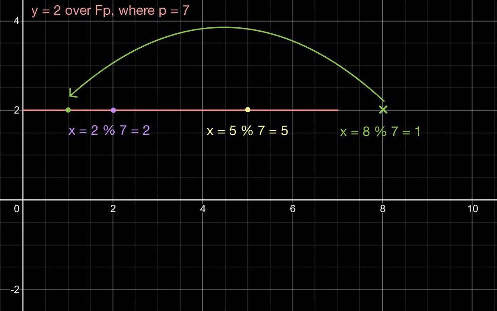

> *作者：RJ Rybarczyk*
> 
> *来源：<https://medium.com/galaxy-digital-bitcoin-mining/part-2-bitcoin-p2tr-transaction-breakdown-67b5a443554b>*


文末的 “进阶研究” 部分提供了许多很棒的讲解 Schnorr 和 Taproot 的资源。为了理解 Taproot 升级的好处，先理解椭圆曲线密码学会有很大帮助，因为椭圆曲线也跟比特币所用的数字签名方案 ECDSA 有关。本文简要介绍了公私钥的生成过程，并解释了为什么 Schnorr 签名不会影响当前的（比如 HD 钱包所用的）地址生成方法。本文还演示了一笔单签名脚本交易的传统的隔离见证 v0 形式（使用 ECDSA 签名）以及它的隔离见证 v1 形式（即 Taproot 交易，使用 Schnorr 签名）；此外，本文还演示了一笔更复杂的 2-of-2 多签名交易的传统 P2WSH 形式以及使用 MuSig 的形式（MuSig 是一种利用了 Schnorr 和 Taproot 的签名方式）。比较同一交易在不同形式下的重量（weight，比特币在隔离见证升级后使用的衡量交易占用区块空间的单位），证明了隔离见证 v1 交易类型相比隔离见证 v0 类型，交易体积有所下降。

本文所用的变量的释义如下表：

```python
G     - 生成点
point - 椭圆曲线上的点 (x, y)，等于某个标量乘以 G  
d     - 私钥
P     - 公钥，P = dG
k     - 随机的 nonce
R     - 随机的 nonce 点，R = kG
m     - 被签名的消息的 SHA256 哈希值
e     - SHA256(tag digest || R.x || P.x || m)
s     - k + e * d
Sig    - 签名算法
```

*注：本文的大部分技术信息都来自 Schnorr 和 Taproot 相关的 BIP（BIP340、BIP341、BIP342），以及出色的 [Bitcoin Optech Schnorr Taproot 研讨会](https://bitcoinops.org/en/schorr-taproot-workshop)。*

## 比特币密码学回顾

### 椭圆曲线密码学

*如果你熟悉 ECDSA、椭圆曲线密码学和 SECP256K1 曲线，可以跳过这一部分。*

椭圆曲线密码学（ECC）以大数乘法将平面上的许多点组合成一条曲线。这个平面上有许多的点 ` (x, y) ` ， ` x ` 和  ` y ` 都是标量（整数）。曲线的等式（就像任何其它等式一样）指定了平面上的哪些点落在这条曲线上。假设一条曲线的等式为  ` y = 2 ` （这是一条直线），那么点  ` (0, 2) ` 就在这条曲线上，但 ` (0, 3) ` 就不在这条曲线上，就这么简单。

下图展示了表示  ` y = 2  ` 的曲线（是的它是一条直线）以及落在曲线上的四个点  ` (x = -1.75, y = 2)`，`(x = 2, y = 2)`，`(x = 5, y = 2)` 以及 `(x = 9, y = 2) ` ，还有一个点  ` (x = 2, y = 4) `  则不在曲线上。


<p style="text-align:center">- 实数域中的 y = 2 -</p>


比特币所用的椭圆曲线只考虑正整数，所以点  ` (x = -1.75, y = 2) ` 自然是无效的了。

到此为止，我们还没有定义曲线  ` y = 2 ` 的边界，这意味着整条曲线的定义域是  ` [-∞, ∞] ` 。但是，在比特币的椭圆曲线中，平面是有边界的，其边界由一个非常大的质数来指定，这个质数被称为质数阶，用  ` p `  来表示，所以其定义域就是  ` [0, p] ` 。此外，这个域被描述为  ` p  ` 上的一个有限域  ` 𝔽 `（ ` p ` 我们说过了，是一个非常大的质数）。 这就意味着，超出 ` [0, p] ` 的  ` x `  值也是有效的，超出 p 的时候它就会回到定义域下界。

我们拿  ` y = 2  ` 的等式来举个回到定义域下界的例子，假设其定义域是质数  ` 7 ` 上的有限域，我们画出跟前面一样的有效点`x = 2`、`x = 5 ` 以及 ` x = 8`。点是否落在曲线上，是根据点的 x 坐标值对  ` p = 7 ` 取模来决定的。

```python
(x = 2, y = 2) -> x 坐标 = 2 % 7 = 2
(x = 5, y = 2) -> x 坐标 = 5 % 7 = 5
(x = 8, y = 2) -> x 坐标 = 8 % 7 = 1
```

请注意，当  ` x = 8  ` 时，实际上的点落在  ` x = 1  ` 上。用图看会清楚一些。

-<code>p = 7</code> 的有限域 <code>𝔽_p</code> 上的 <code>y = 2</code>-

现在我们已经知道定义在一个有限域  ` 𝔽_p ` 上的曲线的含义了，我们继续研究比特币的椭圆曲线密码学所用的那条曲线，SECP256K1。

### SECP256K1 曲线

许多不同类型的曲线都可以用在椭圆曲线密码学中。这些曲线可以表述成所谓的 “魏尔施特拉斯（Weierstrass）形式”，也就是  ` y² = x³ + ax + b ` ，其中 a 和 b 都是常量，决定了曲线的形状。比特币使用 SECP256K1 曲线，其  ` a = 0  ` 、 ` b = 7 ` ，因此最终的等式是  `y² = x³ + 7 ` 。如果用实数来绘制这条曲线，将如下图。


<p style="text-align:center">- 实数上的 SECP256K1  <code>y² = x³ + 7</code> -</p>


那么，这条曲线如何用来生成私钥和公钥呢？这对密钥必需具有某些属性，使我们能高度确信，给定一个私钥和生成点，公钥就可以生成出来；但给定生成点和公钥，你**没法** “倒推” 发现私钥。这种可以容易计算一个方向上的值、但很难倒推的能力，是由一种叫做 “陷门函数” 的函数实现的。在 ECC 这里，陷门函数是可以实现的，因为 ECC 的元件保证了可以很容易地计算大数乘法，但几乎不可能从乘积倒推出原本的乘数。

为便于理解这个概念，我们来看看下面这个例子。我们设 SECP256K1 曲线上有一个生成点  ` G ` ，然后我们让 G 与 G 相加许多次（也即是将 G 乘以某个数，乘数逐渐加大）。

先绘出 SECP256K1 上的生成点。


<p style="text-align:center">- SECP256K1 曲线上的生成点示例 -</p>


现在，我们使用一种叫做 “点倍增（Point Doubling）” 的办法来计算  ` 2G ` 。我们画出椭圆曲线上过  ` G ` 点的切线，然后找到这切线与曲线相交的地方，然后找出这个交点跟 x 轴对称的点，这就是 ` 2G ` 。


<p style="text-align:center">- SECP256K1 曲线上的 2G 示例 -</p>


现在，我们过 ` G ` 和 ` 2G ` 画一条射线，该线会在另一个位置与曲线相交。该交点与 x 轴对称的点，就是 ` 3G ` 。


<p style="text-align:center">- SECP256K1 曲线上的 3G 示例 -</p>


要计算  ` 4G ` ，只需如法炮制，在 ` G ` 和 ` 3G ` 之间画一条直线，找出该线与曲线的交点，再找出该点与 x 轴对称的点。


<p style="text-align:center">- SECP256K1 曲线上的 4G 示例 -</p>


在这种方法下，假设有限域的阶数比较小，计算几次乘法来找出点  ` dG ` 背后的乘数并不困难。但如果有限域的阶数非常大，与  ` G ` 自乘的次数就可以变得非常大。要便利所有的  ` d `  来找出曲线上某一点背后的  ` d ` 就会非常费时费力，乃至于完全不可能。

这就是所谓的 “椭圆曲线的离散对数问题”，也是比特币的公钥密码学所以安全的原因。乘数 ` d ` 就是私钥，最终的点 ` dG ` 就是  ` d ` 的公钥。

椭圆曲线密码学是非常有用的，因为你可以用点自乘，但因为曲线是模 ` p ` 的有限域，而  ` p ` 是专门选择的一个非常大的数，所以，如果你只有公钥和生成点，倒推算出私钥被认为是不可能的（也即不可能逆转乘法）。这就是比特币签名方案获得密码学安全性的办法。

```java
P(x, y) = d * G
```

比特币所用的生成点用到了非常大的 ` x ` 值和  ` y ` 值。

```java
G(x, y) = 
(0x79be667ef9dcbbac55a06295ce870b07029bfcdb2dce28d959f2815b16f81798, 0x483ada7726a3c4655da4fbfc0e1108a8fd17b448a68554199c47d08ffb10d4b8)
```

比特币所用的阶数  ` p ` 也是非常大的质数。

```java
p = 2²⁵⁶ - 2³² - 2⁹ - 2⁸ - 2⁷ - 2⁶ - 2⁴ - 1
p = 0xfffffffffffffffffffffffffffffffffffffffffffffffffffffffefffffc2f
```

这个质数定义了私钥的最大长度，换算成 10 进制是 77 位（非常大）。

而生成点的阶数 ` n ` 定义了曲线上的最大点，也即最大的公钥，但它稍小于  ` p ` 。

```java
n = 2²⁵⁶ - 2³² - 977
n = 0xfffffffffffffffffffffffffffffffebaaedce6af48a03bbfd25e8cd0364141
```

还有一件事需要说明。在实践中，SECP256K1 曲线并不像上面的图那样看起来如此平滑，如此精美。实际上，随着 ` p ` 的提高（请记住这条曲线的定义只包括整数，**而不是**所有实数），整条曲线看起来就像点形成的云团。


<p style="text-align:center">- <code>p = 257</code> 的有限域 <code>𝔽_p</code> 上的 SECP256K1 曲线 -</p>


### 椭圆曲线数字签名算法（ECDSA）

数字签名基于公钥密码学（也称 “非对称密码学”）。首先我们要生成一对公私钥（详情上文已述），然后用私钥来签名消息  ` m ` 。

数字签名是用来签名消息的。被签名的消息可以是任何东西，但在比特币中，被签名的消息就是用户想要发送的交易。

比特币当前使用的数字签名方案是椭圆曲线数字签名算法（ECDSA）。

要生成一条消息的 ECDSA 签名（在比特币中就是交易的一部分的签名），我们先要生成一对公私钥以及它们的地址，然后我们要创建一笔交易，花费该地址所控制的 UTXO（假设该地址已经拥有了一些 UTXO）。

## 隔离见证 v0 vs 隔离见证 v1：单签名

这里我们将展示单签名输出交易的隔离见证 v0 形式以及隔离见证 v1 形式。两种交易形式的签名过程都会详细写出，并且我们会比较最终的交易重量。最终，隔离见证 v0 交易的重量是 437，而隔离见证 v1 交易的重量是 349（使用 2-of-2 的 MuSig 方案的隔离见证 v1 交易也是同样的重量，下文有述）。节约了约 10% 的交易重量。

### 隔离见证 v0：单签名交易

本节展示了对一笔隔离见证 v0 交易生成 ECDSA 签名的步骤，这笔交易仅仅是从某地址向另一个地址发送交易，没有复杂的条件。这个过程也展示了 ECDSA 签名方案的细节。比特币当前就是这样工作的（译者注：准确点说，是 Taproot 以前的脚本就是这样工作的）。

1. 生成私钥和公钥（译者注：这是为了教学用途才将私钥写出，请千万不要将你的私钥公开给他人！）

```java
d = 0xe6075ae177834de90e007bef0307965f8a5b796b064cd86b6ac943c7ab8f5fca
P = 0x02e650125312253b7f53659637619f264d8f0b7d750075a9d8ec9533671d497569
```

2. 生成该公钥相关的地址。我们先计算出该公钥的 SHA256 哈希值的 RIPEMD160 哈希值。这个哈希就是见证程序。这个见证程序加上网络版本号（这里使用  ` 0x00 ` ，表明它是隔离见证 v0），生成一个 bech32 编码的地址。我们将这个地址称为发送地址。

```java
bcrt1qw0xl67sk04nrgnxq4gcgzv48lhsh6uz5z7etkx
```

3. 在这个例子中，我们把发送地址中的比特币发到另一个也由同一个密钥对按照步骤 2 生成的地址中。本质上来说，我们这是把钱从左口袋发到右口袋。接收地址如下：

```java
bcrt1qpe494cttjy5kwp7z3m6apqm0q3n8hkhrrjesxr
```

4. 然后我们创建一个从发送地址发送 1 btc 到接收地址的隔离见证 v0 待签名交易。

传统交易的版本号是 ` 0x01000000 ` 。输出点（outpoint）则说明使用的是该交易的索引号为 0 的输出。

```java
afb466816ddcf2003bcc64a73b4c3ce627d5af42dd1654b8c4e35e894db73ada00000000
```

这笔交易将形成一个输出，面额为 50,000,000 聪（也就是 0.5 btc）。这个输出包含了一个锁定脚本，这个锁定脚本是从接收地址推导出来的，可以保证这个输出只能被持有接收地址的私钥的人花费。这个锁定脚本签名要加上声明其长度的字节：

```java
0x1600140e6a5ae16b91296707c28ef5d0836f04667bdae3
```

最终的待签名交易如下所示：

```java
0100000001afb466816ddcf2003bcc64a73b4c3ce627d5af42dd1654b8c4e35e894db73ada0000000000000000000180f0fa02000000001600140e6a5ae16b91296707c28ef5d0836f04667bdae300000000
```

这串数据到底是什么意思呢？

```java
01000000 - 交易的版本号
01 - 交易输入的数量
afb466816ddcf2003bcc64a73b4c3ce627d5af42dd1654b8c4e35e894db73ada - 前序交易的 id
00000000 - 前序输出的索引号
00 - 传统签名占位符
00000000 - 序列号
01 - 输出的数量
80f0fa0200000000 - 输出的数额，50,000,000 聪 = 0.5 bitcoin 1600140e6a5ae16b91296707c28ef5d0836f04667bdae3 - 输出的锁定脚本
00000000 - 交易的时间锁
```

再说一遍，这就是我们的 ECDSA 算法要签名的内容。

5.  ` z ` 是从这个隔离见证 v0 的待签名交易的 sighash 中推导出来的。所谓的 “sighash”，就是交易的多个部分的 SHA256 哈希值，以及 sighash 的类型（表明签名覆盖的交易字段，也即表明签名的意图，在这个案例中是 SIGHASH_ALL）。

锁定脚本必需首先从上面创建的见证程序中推导出来。

```java
witness program = pubkey hash = 0x73cdfd7a167d66344cc0aa308132a7fde17d7054
P2PKH locking script = [ OP_DUP, OP_HASH160, witness program, OP_EQUALVERIFY, OP_CHECKSIG ]
P2PKH locking script = 76a91473cdfd7a167d66344cc0aa308132a7fde17d705488ac
```

现在，我们已经获得生成 sighash 的所有元素了，sighash 的值就是  ` z ` ，就是我们要签名的内容。

```javascript
nVersion = 0x01000000 (交易版本号)
outpoint = 0xafb466816ddcf2003bcc64a73b4c3ce627d5af42dd1654b8c4e35e894db73ada00000000（输出点，标记交易所使用的输入，也即资金来源）
nSequence = 0x00000000
lockingScript = 0x76a91473cdfd7a167d66344cc0aa308132a7fde17d705488ac（输入所用的锁定脚本）
amount = 0x00e1f50500000000 (100,000,000 sats = 1 bitcoin)（输入的面额）

SHA256(outpoint) = SHA256( 0xafb466816ddcf2003bcc64a73b4c3ce627d5af42dd1654b8c4e35e894db73ada || 0x00000000 ) = 0x7544688d2df453bd49836f034e3eb36ed3e410a0578019310f2d58282693a6ba

SHA256(nSequence) = SHA256(0x00000000) = 0xb90ca5b5653eabdc3341c6f96b3b80689cdd1bd6870265adfe17c8172501b98c

SHA256(txouts) = SHA256() = 0x85daff2e158d437f078d3c9289c86a2b037e67cf68e6eb994f3113ba0f0831b0

SIGHASH_FLAG = SIGHASH_ALL = 0x01000000

z = sighash = SHA256( 
nVersion || SHA256(outpoint) || SHA256(nSequence) || outpoint || lockingScript || amount || nSequence || SHA256(txouts) || nLockTime || SIGHASH_FLAG)

z = sighash = SHA256(0x01000000 || SHA256(0xafb466816ddcf2003bcc64a73b4c3ce627d5af42dd1654b8c4e35e894db73ada || 0x00000000 ) || SHA256(0x00000000) || (0xafb466816ddcf2003bcc64a73b4c3ce627d5af42dd1654b8c4e35e894db73ada || 0x00000000) || 0x76a91473cdfd7a167d66344cc0aa308132a7fde17d705488ac || 0x00e1f50500000000 || 0x00000000 || 0x85daff2e158d437f078d3c9289c86a2b037e67cf68e6eb994f3113ba0f0831b0)

z = sighash = SHA256( 01000000baa6932628582d0f31198057a010e4d36eb33e4e036f8349bd53f42d8d6844758cb9012517c817fead650287d61bdd9c68803b6bf9c64133dcab3e65b5a50cb9afb466816ddcf2003bcc64a73b4c3ce627d5af42dd1654b8c4e35e894db73ada000000001976a91473cdfd7a167d66344cc0aa308132a7fde17d705488ac00e1f5050000000000000000b031080fba13314f99ebe668cf677e032b6ac889923c8d077f438d152effda850000000001000000)

z = sighash = 0x28b67faf17c13ced9f2ccf2acd3ee28ebd5c2bc9adb9634073e3336cf2a41141
```

6. 现在才是真正要用到 ECDSA 签名算法的地方。为便于理解，我们温习一下 ECDSA 签名的定义。

```
s = k⁻¹ * (z + r * d) mod n
```

生成另一个大小在  ` [1, n] ` 之间的随机私钥 ` k ` 。这是一个一次性的私钥，用它来生成公钥点  ` R ` 。

```java
k = 0x7925f65c88fc66ee2fecfd4d8f678d4706762e5300023902af006345a9aec9f3
R = (R.x, R.y) = (0x4f0c7a2ed699f37346edb7e10a7d9978b94b6623c3b844e6c5208ddac998933b, 0x60fa3861fc04dac9054398e79407afb088c0aaf8be7e78484a7756319197065d)
```

ECDSA 签名中的 ` r ` 是公钥 ` R  `  的 x 坐标对 n 求模。

```java
r = R.x mod n = 0x4f0c7a2ed699f37346edb7e10a7d9978b94b6623c3b844e6c5208ddac998933b mod 0xfffffffffffffffffffffffffffffffebaaedce6af48a03bbfd25e8cd0364141
    
r = 0x4f0c7a2ed699f37346edb7e10a7d9978b94b6623c3b844e6c5208ddac998933b
```

这个  ` k⁻¹ ` 是  ` k mod n ` 的模逆。

```java
k⁻¹ = 0x14ec7a2f5f095cb2b83cb22f852876ba810ce9c84c162ebcd02e2308efb8c755
```

现在我们拥有计算 ECDSA 签名的所有元素了。

```java
s = k⁻¹ * (z + r * d) mod n

s = 0x14ec7a2f5f095cb2b83cb22f852876ba810ce9c84c162ebcd02e2308efb8c755 *(0x28b67faf17c13ced9f2ccf2acd3ee28ebd5c2bc9adb9634073e3336cf2a41141 + 0x4f0c7a2ed699f37346edb7e10a7d9978b94b6623c3b844e6c5208ddac998933b ) mod 0xfffffffffffffffffffffffffffffffebaaedce6af48a03bbfd25e8cd0364141

s = 0x68ad1571330a5cbcfd0746702a092233c05aa3232fad8059acce0f8ff687cf8e
```

7. 最终的 ECDSA 签名使用 DER 编码格式。

```java
0x30 - DER 序列指示器
0x45 - 序列长度指示 (69 bytes)
0x02 - 表明下一个值是整数
0x21 - 整数的字节长度 (33 bytes)
r    - 随机 nonce 点
0x02 - 表明下一个值是整数
0x20 - 整数的字节长度 (32 bytes)
s    - 签名
SF   - SIGHASH 标签 (1 byte)
```

使用上面的  ` r ` 和  ` s ` ，即可得出最终的 DER 编码格式。

```java
0x30
0x45
0x02
0x4f0c7a2ed699f37346edb7e10a7d9978b94b6623c3b844e6c5208ddac998933b - r
0x02
0x20
0x68ad1571330a5cbcfd0746702a092233c05aa3232fad8059acce0f8ff687cf8e - s
0x01 - SIGHASH_ALL

Sig = 0x304402204f0c7a2ed699f37346edb7e10a7d9978b94b6623c3b844e6c5208ddac998933b022068ad1571330a5cbcfd0746702a092233c05aa3232fad8059acce0f8ff687cf8e01
```

最终签好名的交易如下所示：

```java
01000000000101afb466816ddcf2003bcc64a73b4c3ce627d5af42dd1654b8c4e35e894db73ada0000000000000000000180f0fa02000000001600140e6a5ae16b91296707c28ef5d0836f04667bdae30247304402204f0c7a2ed699f37346edb7e10a7d9978b94b6623c3b844e6c5208ddac998933b022068ad1571330a5cbcfd0746702a092233c05aa3232fad8059acce0f8ff687cf8e012102e650125312253b7f53659637619f264d8f0b7d750075a9d8ec9533671d49756900000000
```

这笔隔离见证 v0 交易的重量是 437。在下一节，我们会以隔离见证 v1 格式（Schnorr 签名和 Taproot）重构这笔交易，然后比较最终交易的重量。

### 隔离见证 v1：单签名

我们上面讲的是使用 SECP256K1 曲线上的 ECDSA 签名和 SHA256 哈希值给比特币交易提供授权的过程。本质上，BIP340 所定义的 Schnorr 签名实现使用了相同的椭圆曲线密码选。也就是说，使用了相同的 SECP256K1 曲线，而且原理也都是一样的。这是很棒的，因为这意味着相同的私钥可以用来创建 ECDSA 签名和 Schnorr 签名。这也意味着，在使用 Schnorr 签名方案时，层级确定性钱包（HD 钱包，由 BIP32 定义）这样的技术依然是可以使用的。

使用 Schnorr 千克的过程与 ECDSA 类似。私钥、秘密 nonce，生成点，随机 nonce 点，公钥，都是一样的。

Schnorr 签名定义是：

```java
Sig(s, R)
s = k + e * d
其中 e = SHA256(R || P || m)
```

我们使用跟上面的 ECDSA 签名案例同样的交易来演示 Schnorr 签名的不中。不过，这次我们不是使用隔离见证 v0 格式，而是使用新的隔离见证 v1 格式。

```java
0100000001afb466816ddcf2003bcc64a73b4c3ce627d5af42dd1654b8c4e35e894db73ada0000000000000000000180f0fa02000000001600140e6a5ae16b91296707c28ef5d0836f04667bdae300000000
```

1. 生成一把随机私钥以及对应的公钥。使用了跟上面的 ECDSA 案例同样的密钥对。

```java
privkey, d: 0xe6075ae177834de90e007bef0307965f8a5b796b064cd86b6ac943c7ab8f5fca
pubkey, P: 0x02e650125312253b7f53659637619f264d8f0b7d750075a9d8ec9533671d497569
```

使用 Jacobi 符号来检查公钥是对域大小求模的二次剩余（quadratic residue）。如果不是，就对这个公钥求反（negate the public key）。这是为了避免在随机 nonce 点 R 中包含 y 坐标。要求验证者做这个检查，我们就能避免在签名的随机 nonce 点  ` R ` 中包含 y 坐标，从而能够将签名的体积从 96 字节降低到 64 字节。本质上，它是为验证者提供了一种标准化的方式来独立获得 y 坐标。除了检查对域大小求模的二次剩余，还有别的办法，但这是最高效的。

这个公钥是对域大小求模的二次剩余，所以我们不必放弃。

2. 使用见证程序推导出 bech32 隔离见证编码的发送地址。隔离见证 v1 交易的见证程序就是公钥的 32 字节的 x 坐标（删除了前缀的  ` 0x02 ` 字节），而不像隔离见证 v0 那样是公钥 SHA256 哈希值的 RIPEMD160 哈希值。

```
witness program = 0xe650125312253b7f53659637619f264d8f0b7d750075a9d8ec9533671d497569
```

发送地址是一个 bech32 编码的地址，由隔离见证 v1 版本（ ` 0x01 ` ）和见证程序推导出来

```java
bcrt1puegpy5cjy5ah75m9jcmkr8exfk8sklt4qp66nk8vj5ekw82fw45sv76ace
```

3. 在这个例子中（跟 ECDSA 的例子一样），比特币会从步骤 2 所生成的地址发送到步骤 1 所生成的同一个密钥对的另一个地址中，也即同样是自己发送给自己。这个接收地址是：

```java
bcrt1q5lpjwpcnrzcjry7ahewqk986mfje9hu8gwrtw8
```

4. 然后我们创建一笔隔离见证 v1 的待签名交易，该交易把发送地址的 1 btc 发给接收地址。

```java
0100000001fb40c6b15742604fd8c70c21ddea55f64c03c27e1344ebd6c73d83dac67fd6040000000000000000000180f0fa020000000
0160014a7c327071318b12193ddbe5c0b14fada6592df8700000000
```

完整的解释如下：

```java
0x01000000 - 版本号
0x01 - 输入的数量
0x04d67fc6da833dc7d6eb44137ec2034cf655eadd210cc7d84f604257b1c640fb - 前序交易的 id
0x00000000 - 前序输出索引号
0x00 - 传统的签名占位符
0x00000000 - sequence number
0x01 - 输出的数量
0x80f0fa0200000000 - 输出的面额，50,000,000 sats = 0.5 bitcoin 
0x160014a7c327071318b12193ddbe5c0b14fada6592df87 - 输出的锁定脚本
0x00000000 - 交易的锁定时间
```

这就是我们的 Schnorr 签名要覆盖的东西。

5. 为了决定  ` e ` ，我们需要这笔待签名交易的隔离见证 v1 sighash（也就是 Taproot sighash）。

产生我们正在消费的 UTXO 的交易如下：

```java
020000000001012048b235a15d5514a1ff9750bcd01e340b2ecd8bc7b6c2f185b20232988215f50000000000ffffffff0100e1f50500000000225120e650125312253b7f53659637619f264d8f0b7d750075a9d8ec9533671d49756902473044022062672201ecf2a933a83367f6ca121da9529638fa205d55d9805322544ca5fe4802202627a1fcac38bd537ea6c058e518753e9caf0f7f82e654224c2a4cfe4cfca80e01210240cecf455225bf42ffd09cdfb8ca6aea29c57dfcdf11453b065129a46a7fa16500000000

被花费的 UTXO 的锁定脚本: 0x225120e650125312253b7f53659637619f264d8f0b7d750075a9d8ec9533671d497569
```

通过使用名为 ` TapSighash ` 的带标签哈希函数并拼接交易的不同部分，我们就可以算出这笔交易的 sighash。

Taproot 引入了一种新的 sighash 标签 ` SIGHASH_ALL_TAPROOT ` 。

```
0x01 - SIGHASH_ALL
0x02 - SIGHASH_NONE
0x03 - SIGHASH_SINGLE
0x81 - SIGHASH_ALL | SIGHASH_ANYONECANPAY
0x82 - SIGHASH_NONE | SIGHASH_ANYONECANPAY
0x83 - SIGHASH_SINGLE | SIGHASH_ANYONECANPAY
0x00 - SIGHASH_ALL_TAPROOT
```

这个标签跟  `0x01` `SIGHASH_ALL `  有相同的语义，但不必包含这个字节，而是隐藏掉了。所以，除非另有指定，一笔 taproot 交易的签名默认带有 ` SIGHASH_ALL ` 标签。

```java
sighash = Tagged Hash( "TapSighash", 
0x00 || SIGHASH_ALL_TAPROOT || nVersion || nLockTime || SHA256(outpoint) || SHA256(amount) || SHA256(nSequence) || SHA256(txout) || SPEND_TYPE || locking scrpt of UTXO being consumed || prevIndex )

sighash = Tagged Hash("TapSighash", 0x00 || 0x00 || 0x01000000 || 0x00000000 || SHA256(0x04d67fc6da833dc7d6eb44137ec2034cf655eadd210cc7d84f604257b1c640fb || 0x00000000) || SHA256(0x80f0fa0200000000) || SHA256(0x00000000) || SHA256(80f0fa020000000
0160014a7c327071318b12193ddbe5c0b14fada6592df87) || 0x00 || 0x225120e650125312253b7f53659637619f264d8f0b7d750075a9d8ec9533671d497569 || 0x00000000)

sighash = Tagged Hash("TapSighash", 00000100000000000000342803b540671e08fbc1452d83d80eef3a88c0894dbba6cb52764a950f6b86e12c3417ea6a6d07f4a0218f5b1d380037c8b95c24eeb4e70299776a634a0dffa2df3f619804a92fdb4057192dc43dd748ea778adc52bc498ce80524c014b8111997baae7ecdb0eee1e5e66b27a0dd8562a70fda6768f9ef570a6584d0096779f800225120e650125312253b7f53659637619f264d8f0b7d750075a9d8ec9533671d49756900000000)

sighash = 0xb09f298288a1656c160c31d3d7445404bfa6a838bf53f1ca486ec1bc4241a43c
```

6. 现在就要 Schnorr 签名上场了。我们温习一下签名的定义：

```java
s = k + e * d
```

为了确定性地生成随机 nonce 值 ` k ` ，生成 ` k `  的第一个字节是拼接私钥 ` d ` 和消息本身（sighash）后使用名为 ` BIPSchnorrDerive ` 的带标签哈希算法推导出来的。这个数据叫做  ` nonce bytes ` 。

```java
nonce_bytes = Tagged Hash("BIPSchnorrDerive", d || sighash)

nonce_bytes = Tagged Hash("BIPSchnorrDerive", 0xe6075ae177834de90e007bef0307965f8a5b796b064cd86b6ac943c7ab8f5fca || 0xb09f298288a1656c160c31d3d7445404bfa6a838bf53f1ca486ec1bc4241a43c)

nonce_bytes = 0x70603f193eeb790b0c8c40a9536f7161314d1b30ad1dcebc5c7db88eca1871e6
```

然后 nonce bytes 对阶数  ` n `  求模，得到 ` k' ` 。

```java
k' = nonce_bytes % n
k' = 0x70603f193eeb790b0c8c40a9536f7161314d1b30ad1dcebc5c7db88eca1871e6 % 0xfffffffffffffffffffffffffffffffebaaedce6af48a03bbfd25e8cd0364141
k' = 0x70603f193eeb790b0c8c40a9536f7161314d1b30ad1dcebc5
c7db88eca1871e6
```

然后我们用  ` k' `  来生成一个公钥，也就是 nonce 点 ` R ` 。

```java
R = (0x50ed3e867619db28fa917c8b6b86912fa68c9140b8dda1ce864c796b918fad36, 0xeedb98506fba05feb5c1606b015594c1d2d9227c2874a2e0ff421fb3957627ee)
```

使用 Jacobi 符号检查  ` R.y ` 是对域大小求模的二次剩余。如果是，就设定 k 等于 k'。如果不是，对  ` k ` 求反 。在这个案例中，  ` R.y ` 不是对域大小求模的二次剩余，所以我们对 ` k ` 求反。

```java
k = n - k'
k = 0xfffffffffffffffffffffffffffffffebaaedce6af48a03bbfd25e8cd0364141 - 0x70603f193eeb790b0c8c40a9536f7161314d1b30ad1dcebc5c7db88eca1871e6
k = 0x8f9fc0e6c11486f4f373bf56ac908e9d8961c1b6022ad17f6354a5fe061dcf5b
```

 ` e ` 是使用 nonce 点的 x 坐标 ` R.x ` 拼接公钥的 x 坐标 ` P.x ` 和消息（sighash）后使用带标签哈希值计算出来的：

```java
e = tagged hash(BIPSchnorr, R.x || P.x || sighash)
e = tagged hash(BIPSchnorr, 0x50ed3e867619db28fa917c8b6b86912fa68c9140b8dda1ce864c796b918fad36 || 0x02e650125312253b7f53659637619f264d8f0b7d750075a9d8ec9533671d497569 || 0xb09f298288a1656c160c31d3d7445404bfa6a838bf53f1ca486ec1bc4241a43c)
e = 0xa7eb946b6b143a8419445e87c3ef24bb541e3098e84c90a6b2b21e51b79f2518
```

现在我们已经拥有了计算 Schnorr 签名所需的所有元素。

```java
s = k + e * d mod n
s = 0x8f9fc0e6c11486f4f373bf56ac908e9d8961c1b6022ad17f6354a5fe061dcf5b + 0xa7eb946b6b143a8419445e87c3ef24bb541e3098e84c90a6b2b21e51b79f2518 * 0xe6075ae177834de90e007bef0307965f8a5b796b064cd86b6ac943c7ab8f5fca % 0xfffffffffffffffffffffffffffffffebaaedce6af48a03bbfd25e8cd0364141
s = 0x50ed3e867619db28fa917c8b6b86912fa68c9140b8dda1ce864c796b918fad36bbf1edd482f1edf878f88e51fc9ede51cc732e7d3df2c4146a746208701251ce
```

最终的签名交易如下所示：

```java
01000000000101fb40c6b15742604fd8c70c21ddea55f64c03c27e1344ebd6c73d83dac67fd6040000000000000000000180f0fa0200000000160014a7c327071318b12193ddbe5c0b14fada6592df87014050ed3e867619db28fa917c8b6b86912fa68c9140b8dda1ce864c796b918fad36bbf1edd482f1edf878f88e51fc9ede51cc732e7d3df2c4146a746208701251ce00000000
```

这笔交易的重量是 396 vbytes。

**将它的重量与 SegWit v0 的单签名脚本交易相比较，我们可以看出它有约 10% 的体积缩减**。

## 2-of-2 的 P2WSH vs. 2-of-2 MuSig

Bitcoin Optech Taproot 工作坊给出了一个详解 2-of-2 MuSig 交易的绝佳例子，点出了使用 MuSig 相比传统的 P2WSH 2-of-2 多签名设置的好处。

这里我们会详尽地展示每一个案例，并比较最终的交易重量。最终的 2-of-2 P2WSH 交易的重量是 549，而最终的 2-of-2 MuSig 交易的重量只有 349（跟上面的单签名隔离见证 v1 交易一样）。这节约了近 28%。

### 2-of-2 P2WSH

1. 生成一个 2-of-2 的 P2WSH 输出和地址。为此，我们要先生成两个公私钥对，以及一个多签名花费脚本。这个脚本的 SHA256 哈希值就是见证程序，并会跟版本号 ` 0x00 ` 一起生成 bech32 编码的发送地址。

```java
d1 = 0x2876e4fadeece50216d855e3815ce3ccc77b97d0e023abf5d2527183c30759d6
P1 = 0x0273e7ab3bcbd3194f01f9a60468cafc557d29043c3d230c98c57107e366ebd0ed

d2 = 0x32ba129753cb36df53626da1d89a5026ed5e13a71de71eace95850d97f189f3f
P2 = 0x02ed714a5d314dc046d39e07966425d7615c18e4dc787eccd963109308f9b34e5e

multisig script = [OP_2, P1, P2, OP_2, OP_CHECKMULTISIG]
multisig script = 52210273e7ab3bcbd3194f01f9a60468cafc557d29043c3d230c98c57107e366ebd0ed2102ed714a5d314dc046d39e07966425d7615c18e4dc787eccd963109308f9b34e5e52ae

program = SHA256(52210273e7ab3bcbd3194f01f9a60468cafc557d29043c3d230c98c57107e366ebd0ed2102ed714a5d314dc046d39e07966425d7615c18e4dc787eccd963109308f9b34e5e52ae)
program = 0x62bdb00923ba58c766b4399bdc8e42e5aaa6e8e26b1a4022fc4498a93f39b824
bech32 address = bcrt1qv27mqzfrhfvvwe458xdaerjzuk42d68zdvdyqghugjv2j0eehqjq68lm9r
```

我们先通过一笔隔离见证 v0 交易发送 1 btc 到这个地址：

```java
0200000000010133109b8039aa3e727c8806321157af598808495422b1a61f52f98e90c8d035290000000000ffffffff0100e1f5050000000022002062bdb00923ba58c766b4399bdc8e42e5aaa6e8e26b1a4022fc4498a93f39b82402473044022073717413b96c99a3f915925a9053ff2944459a05241845444f9cc1f9e31c79cf02204229a4580e4c3d727197ab34a960bfd66efe994602e3e52469dfdcabbb56f703012102af229d0af30a53f5d8009f53e081c26e57582d01bab48a0e15d5f15984c5742900000000
```

这笔交易的 id 是： ` 0xd0faa3906f521839670df16adb1824b87e07e31d75f82757aeb675f1d80e02de `。

2. bech32 编码的接收地址使用同一个密钥对生成出来。

```java
bcrt1qpane38w0679vxm4dcvys4xgcf0lqzt99a5tc5d
```

3. 现在，我们生成一笔待签名的隔离见证 v0 花费交易，花费我们上面的交易所生成的 UTXO、发送 0.5 btc 到接收地址。

```java
0100000001de020ed8f175b6ae5727f8751de3077eb82418db6af10d673918526f90a3fad00000000000000000000180f0fa02000000001600140f67989dcfd78ac36eadc3090a99184bfe012ca500000000
```

4. 生成这笔待签名交易的隔离见证 v0 sighash。

```java
0x8da30679fd0b4f2012862539abc716b3d0c446820f21c66fbb5f31008d59c48f
```

5. 使用上述的两把私钥生成两个 ECDSA 签名。

```java
sig1 = 30440220311f0ea149bc953e7f5b7f60aca0e2fad3816dd286d98dca4a0a649ffd686fb60220103ea52d3f3c5c11a67fd5afb33a7447b7f76bebd19f9ac67a01bfcd786f5a0901
sig2 = 3045022100d1d291d247ce598fba05b3b523c05297b5b4dcdc51d1a141612c0832048a0d5902202f97bbf7a7f3976c609d9dadf77fcc9
3bd2b01bd2b8949d6d269c85216ad791201
```

6. 用这两个签名和多签名脚本构造见证数据。

```java
witness = sig1, sig2, multisig script
witness = 30440220311f0ea149bc953e7f5b7f60aca0e2fad3816dd286d98dca4a0a649ffd686fb60220103ea52d3f3c5c11a67fd5afb33a7447b7f76bebd19f9ac67a01bfcd786f5a0901,
3045022100d1d291d247ce598fba05b3b523c05297b5b4dcdc51d1a141612c0832048a0d5902202f97bbf7a7f3976c609d9dadf77fcc93bd2b01bd2b8949d6d269c85216ad791201,
52210273e7ab3bcbd3194f01f9a60468cafc557d29043c3d230c98c57107e366ebd0ed2102ed714a5d314dc046d39e07966425d7615c18e4dc787eccd963109308f9b34e5e52ae
```

7. 然后完整的隔离见证 v0 花费交易就构造好了。

```java
01000000000101de020ed8f175b6ae5727f8751de3077eb82418db6af10d673918526f90a3fad00000000000000000000180f0fa02000000001600140f67989dcfd78ac36eadc3090a99184bfe012ca504004730440220311f0ea149bc953e7f5b7f60aca0e2fad3816dd286d98dca4a0a649ffd686fb60220103ea52d3f3c5c11a67fd5afb33a7447b7f76bebd19f9ac67a01bfcd786f5a0901483045022100d1d291d247ce598fba05b3b523c05297b5b4dcdc51d1a141612c0832048a0d5902202f97bbf7a7f3976c609d9dadf77fcc93bd2b01bd2b8949d6d269c85216ad7912014752210273e7ab3bcbd3194f01f9a60468cafc557d29043c3d230c98c57107e366ebd0ed2102ed714a5d314dc046d39e07966425d7615c18e4dc787eccd963109308f9b34e5e52ae00000000
```

这笔隔离见证 v0 交易的重量是 549。在下一节，我们会以隔离见证 v1 形式构造这笔交易（使用聚合 Schnorr 签名），并比较最终交易的重量。

### 2-of-2 MuSig

1. 使用跟上一例相同的私钥和公钥。这些密钥也用来生成相同的多签名脚本、见证程序、bech32 编码的发送地址

```java
d1 = 0x2876e4fadeece50216d855e3815ce3ccc77b97d0e023abf5d2527183c30759d6
P1 = 0x0273e7ab3bcbd3194f01f9a60468cafc557d29043c3d230c98c57107e366ebd0ed

d2 = 0x32ba129753cb36df53626da1d89a5026ed5e13a71de71eace95850d97f189f3f
P2 = 0x02ed714a5d314dc046d39e07966425d7615c18e4dc787eccd963109308f9b34e5e
```

2. 为了防止相关的密钥攻击，每一个公钥都使用一个 *挑战因子* ` c ` 调整过，这个  ` c ` 跟参与的所有公钥有关，但每个参与者的 c 都是独一无二的。每个参与者都先哈希所有的公钥，将这个哈希值与自己的公钥相拼接，再对这个结果作 SHA256 运算，就得到了挑战因子。当我们有了每一个公钥的挑战因子，就可以生成出聚合公钥以及相应的地址。

每一个参与者都必须能确定性地生成挑战因子，这意味着最初被哈希的公钥的顺序必须相同。为保证这一点，我们先去除公钥的前缀（ ` 0x02 ` 或 ` 0x03 `），然后按从小到大的顺序排列（请记住公钥也是一个数）。排好序之后，它们就拼接起来，运行 SHA256 运算。我们管这个哈希值叫  ` Lh ` ，然后每个参与者都能用它算出自己的挑战因子。

```java
Lh = SHA256(P1 || P2)

Lh = SHA256(73e7ab3bcbd3194f01f9a60468cafc557d29043c3d230c98c57107e366ebd0eded714a5d314dc046d39e07966425d7615c18e4dc787eccd963109308f9b34e5e)

Lh = 0x62f6d67ea8270a2ff1e1a84596a500b8caf0128d3ff2bd78e9bea4ff66e31dd4
```

对公钥列表中的每一个公钥，挑战因子都可以用 ` Lh ` 以及对应的公钥拼接后作哈希运算计算出来（注意，公钥没有  ` 0x02 ` 或 ` 0x03 ` 的前缀）。

```java
c₁ = SHA256(Lh || P₁)
c₁ = SHA256( 0x62f6d67ea8270a2ff1e1a84596a500b8caf0128d3ff2bd78e9bea4ff66e31dd4 || 0x73e7ab3bcbd3194f01f9a60468cafc557d29043c3d230c98c57107e366ebd0ed)
c₁ = 0xecce388649143900eb4f2b107fcbde7d240336b7f4ad5c37c987701c0eb9159b

c₂ = SHA256(Lh + P₂)
c₂ = SHA256( 0x62f6d67ea8270a2ff1e1a84596a500b8caf0128d3ff2bd78e9bea4ff66e31dd4 || 0xed714a5d314dc046d39e07966425d7615c18e4dc787eccd963109308f9b34e5e)
c₂ = 0x2b9449f654043b1920e5e17d89bf20d9e6e3e449b2f49122621b18d7756a495d
```

要创建聚合公钥，每个公钥都先乘以自己的挑战因子。这个相乘的步骤就是所谓的 “*调整* 公钥”。调整后的公钥，标记为  ` P1' ` 和  ` P2' ` ，加在一起，最终的结果就是聚合公钥  ` P' ` 。如果最终的聚合公钥是一个负数，那么它将与每个挑战因子一起被求反。这里的聚合公钥是整数，所以不必求反。

```java
P₁' = P₁ * c₁
P₁'  = 0x73e7ab3bcbd3194f01f9a60468cafc557d29043c3d230c98c57107e366ebd0ed * 0xecce388649143900eb4f2b107fcbde7d240336b7f4ad5c37c987701c0eb9159b
P₁'  = 0x031601087da98f7b3afe201984821727f55cc3176278dbcbb1eabbbeb5695da454

P₂' = P₂ * c₂ 
P₂' = 0xed714a5d314dc046d39e07966425d7615c18e4dc787eccd963109308f9b34e5e * 0x2b9449f654043b1920e5e17d89bf20d9e6e3e449b2f49122621b18d7756a495d
P₂' = 0x029294b0c19c018d1495339476a1901b16799c2d00eb7e6b96e85716bab5067348

P = P₁' + P₂'

P = 0x1601087da98f7b3afe201984821727f55cc3176278dbcbb1eabbbeb5695da454 + 0x9294b0c19c018d1495339476a1901b16799c2d00eb7e6b96e85716bab5067348

P = 0x03f2fe19e10684956111438fa7c69f953e91206d12553b8d898a7e0c43b8a93663
```

因为我们用调整过的公钥创建了聚合公钥，为了让私钥依然有效，私钥也必须用同样的因子来调整。

```java
d₁' = d₁ * c₁
d₁' = 0x2876e4fadeece50216d855e3815ce3ccc77b97d0e023abf5d2527183c30759d6 * 0xecce388649143900eb4f2b107fcbde7d240336b7f4ad5c37c987701c0eb9159b
d₁' = 0x07cd6d2b4ab956d89bbdf36d6a2b8e27023042ea173f786a9cd86bcdc8cab1dc

d₂' = d₂ * c₂
d₂' = 0x32ba129753cb36df53626da1d89a5026ed5e13a71de71eace95850d97f189f3f * 0x2b9449f654043b1920e5e17d89bf20d9e6e3e449b2f49122621b18d7756a495d
d₂' = 0xb05127d427a5422eb473ea9f90622acbebd5d87065aef83fc5d7e4e93a94ac23
```

见证程序依然是公钥的 x 值，只不过这里我们使用了聚合公钥：

```java
witness program = P'.x
witness program = 0xf2fe19e10684956111438fa7c69f953e91206d12553b8d898a7e0c43b8a93663
```

现在，我们可以使用见证程序和隔离见证 v1 版本号（ ` 0x01 ` ）推导出 bech32 编码的隔离见证 v1 发送地址了。

```java
bcrt1p7tlpncgxsj2kzy2r37nud8u486gjqmgj25acmzv20cxy8w9fxe3s4evuhr
```

3. 接收地址也使用这个聚合公钥生成出来。

```java
bcrt1qye7d8y5v63uan3kaer5f5a83rkvzt0qajlzm38
```

4. 创建出待签名的交易，该交易将把发送地址的 0.5 btc 发送到接收地址。

```java
0100000001868e26971f2460b6e2f01aadfdc075ba5518fbd9afb1b0ba11396a55399eae650000000000000000000180f0fa0200000000160014267cd3928cd479d9c6ddc8e89a74f11d9825bc1d00000000
```

5. 用上文 “隔离见证 v1：单签名” 章节中的步骤 5 相同的方法创建隔离见证 v1 待签名交易 sighash。

```bach
sighash = 0xab73194e488ee26cf6dd58d2be4b40f969b5647f902e6be19688db491f1959c6
```

有一部分的推导需要用到被花费的 UTXO 的锁定脚本：

```java
locking script of UTXO being consumed 225120f2fe19e10684956111438fa7c69f953e91206d12553b8d898a7e0c43b8a93663
```

6. Schnorr 聚合签名的形式与 Schnorr 单签名的形式没有什么区别，只不过使用了聚合数值。

```java
s' = k' + e * d' mod n
```

每个 nonce 都是一个随机的私钥，其对应的公钥就是 nonce 点。如果公钥的 y 值**不是**对域大小求模的二次剩余，就设定 k 等于阶数 n 与 k 的差值。

```java
k₁ = 0x43ae27db41923ba9268683ba53feaa517eabec8b5db62a1612045656dbf64744
R₁ = (0xb642edebb19b616054e945b8dfb9a215dbe56ecaa869cebf0c97c368db35ed48, 0x6a3bf699a3f17b7007ad8f14349270df6b63007ac4ee585104e9af5e9dc9377a)

k₂ = 0x5a7dc060ae2a65a22ddc9e5d10b6b51ee588d0a6c8436014ebc4bae0a4ddb023
R₂ = (0x95c86d7887190be800d05cba00fd44b9805daf7e6eb39a1811a7aa3cccb3c743, 0xef833128e30b2a06eadb6c86ce1e63c150af91fe171a8bfe5e979db83da5355c)
```

在这个例子里面，两个 k 都不是，所以我们要更新这两个 nonce 点。

```java
k₁ = n - k₁
k₁ = 0xfffffffffffffffffffffffffffffffebaaedce6af48a03bbfd25e8cd0364141- 0x43ae27db41923ba9268683ba53feaa517eabec8b5db62a1612045656dbf64744
k₁ = 0xbc51d824be6dc456d9797c45ac0155ad3c02f05b51927625adce0835f43ff9fd

k₂ = n - k₂
k₂ = 0xfffffffffffffffffffffffffffffffebaaedce6af48a03bbfd25e8cd0364141-0x5a7dc060ae2a65a22ddc9e5d10b6b51ee588d0a6c8436014ebc4bae0a4ddb023
k₂ = 0xa5823f9f51d59a5dd22361a2ef494adfd5260c3fe7054026d40da3ac2b58911e
```

生成最终的 nonce 值和 nonce 点（带有  ` 0x03 ` 字节前缀的 x 值）。

```c
k₁ = 0xbc51d824be6dc456d9797c45ac0155ad3c02f05b51927625adce0835f43ff9fd
R₁ = 0x03b642edebb19b616054e945b8dfb9a215dbe56ecaa869cebf0c97c368db35ed48

k₂ = 0xa5823f9f51d59a5dd22361a2ef494adfd5260c3fe7054026d40da3ac2b58911e
R₂ = 0x0395c86d7887190be800d05cba00fd44b9805daf7e6eb39a1811a7aa3cccb3c743
```

现在，两个 nonce 和 nonce 点都生成号了，聚合 nonce 值和 nonce 点也可以生成出来了。

聚合 nonce 点  ` R' ` 是两个 nonce 点的 x 坐标值之和。检查聚合 nonce 点的 y 坐标值**不是**对域大小求模的二次方剩余。如果是，就对  ` R' ` 和 ` k1 ` 及 ` k2 ` 求反。在这个例子中我们不必求反。

```c++
R' = k₁ + k₂
R' = 0x03b642edebb19b616054e945b8dfb9a215dbe56ecaa869cebf0c97c368db35ed48 + 0x0395c86d7887190be800d05cba00fd44b9805daf7e6eb39a1811a7aa3cccb3c743
R' = 0x02338b807352528dc74d83bb717f5560ef34f8c94b340f4867d0129a2107e228a7
```

 ` e ` 是拼接 nonce 点的 x 坐标值  ` R'.X ` 、聚合公钥 x 坐标值 ` P'.x ` 以及消息（sighash）后，使用名为 ` BIPSchnorr ` 的带标签哈希算法推导出来的。

```java
e = tagged hash(BIPSchnorr || R'.x + P'.x + sighash)
e = 0x8d507fb1955660ee2180917046f767d2c2a174a497348268a8af0aed2c7dd9f7
```

现在，我们已经有了让每一个参与者各自创建 Schnorr 签名的一切元素了。

```java
s'₁ = k₁ + e * d'₁ mod n
s'₁ = 0xbc51d824be6dc456d9797c45ac0155ad3c02f05b51927625adce0835f43ff9fd + 0x8d507fb1955660ee2180917046f767d2c2a174a497348268a8af0aed2c7dd9f7 * 0x07cd6d2b4ab956d89bbdf36d6a2b8e27023042ea173f786a9cd86bcdc8cab1dc
s'₁ = 0xfe37255454d8e26b4ff666b93f36588522c796ac2e3e45c7cd4a6699120cae09

s'₂ = k₂ + e * d'₂ mod n
s'₂ = 0xa5823f9f51d59a5dd22361a2ef494adfd5260c3fe7054026d40da3ac2b58911e + 0x8d507fb1955660ee2180917046f767d2c2a174a497348268a8af0aed2c7dd9f7 * 0xb05127d427a5422eb473ea9f90622acbebd5d87065aef83fc5d7e4e93a94ac23
s'₂ = 0xfe37255454d8e26b4ff666b93f36588522c796ac2e3e45c7cd4a6699120cae09
```

最后，我们聚合每个参与者的签名，产生聚合公钥的最终签名。

```java
s' = s'₁ + s'₂ mod n
s' = 0xfe37255454d8e26b4ff666b93f36588522c796ac2e3e45c7cd4a6699120cae09 + 0xfe37255454d8e26b4ff666b93f36588522c796ac2e3e45c7cd4a6699120cae09 mod 0xfffffffffffffffffffffffffffffffebaaedce6af48a03bbfd25e8cd0364141
s' = 0xc77d4dad11f338b0e05f76b67dfa06b769d12572160adc45767172673d242493

sig' = R'.x || s'
sig' = 338b807352528dc74d83bb717f5560ef34f8c94b340f4867d0129a2107e228a7c77d4dad11f338b0e05f76b67dfa06b769d12572160adc45767172673d242493
```

最终签好名的交易如下所示：

```typescript
01000000000101868e26971f2460b6e2f01aadfdc075ba5518fbd9afb1b0ba11396a55399eae650000000000000000000180f0fa0200000000160014267cd3928cd479d9c6ddc8e89a74f11d9825bc1d0140338b807352528dc74d83bb717f5560ef34f8c94b340f4867d0129a2107e228a7c77d4dad11f338b0e05f76b67dfa06b769d12572160adc45767172673d24249300000000
```

这笔交易的重量是 396。

**比较可知，隔离见证 v1 的交易比起隔离见证 v0 的 2-of-2 P2WSH交易，可以节省 28% 的交易体积**。

<p style="text-align:center">- - -</p>


## 进阶研究

- [Bitcoin Optech Schnorr/Taproot 研讨会](https://bitcoinops.org/workshops/#taproot-workshop)是一个非常棒的资源，可以学到更多关于签名和交易的内容，还能上手玩耍。最新的分支是  ` 32-bytes-keys ` 分支。在本地克隆时请使用 ` Taproot_V0.1.5-proposed ` 分支。在这个分支上开发并保证你启用了钱包。
- [Bitcoin Optech: Taproot](https://bitcoinops.org/en/topics/taproot/)
- Murch’s [2-of-3 inputs using Pay-to-Taproot](https://murchandamus.medium.com/2-of-3-multisig-inputs-using-pay-to-taproot-d5faf2312ba3)
- [Bitcoin Technology Development Talks: Schnorr signatures](http://diyhpl.us/~bryan/papers2/bitcoin/bitcoin-tech-dev-talks-schnorr-signatures.2018-02-01.pdf)

<p style="text-align:center">- - -</p>


衷心感谢 Valentine Wallace、Mark Erhardt、Carl Dong 和 Harry Sudock 的反馈。

<p style="text-align:center">- - -</p>


## 参考文献

[1]: Pieter Wuille, Jonas Nick, Tim Ruffing. (January 19, 2020). *Schnorr Signatures for secp256k1*. [https://github.com/bitcoin/bips/blob/master/bip-0340.mediawiki](https://github.com/bitcoin/bips/blob/master/bip-0341.mediawiki#design).

[2]: Pieter Wuille, Jonas Nick, Anthony Towns. (January 19, 2020).*Taproot: SegWit version 1 spending rules*. [https://github.com/bitcoin/bips/blob/master/bip-0341.mediawiki](https://github.com/bitcoin/bips/blob/master/bip-0341.mediawiki#design).

[3]: Pieter Wuille, Jonas Nick, Anthony Towns. (January 19, 2020). *Validation of Taproot Scripts*. [https://github.com/bitcoin/bips/blob/master/bip-0342.mediawiki](https://github.com/bitcoin/bips/blob/master/bip-0341.mediawiki#design).

[4]: Bitcoin Optech. (October 29, 2019). Bitcoin Optech Schnorr Taproot Workshop. https://bitcoinops.org/en/schorr-taproot-workshop/.

[5]: Bitcoin Wiki. (April 24, 2019). Secp256k1. https://en.bitcoin.it/wiki/Secp256k1.

[6]: Wolfram MathWold. (2021). Weierstrass Form. https://mathworld.wolfram.com/WeierstrassForm.html.

[7]: Wikipedia. (February 19, 2021). Jacobi symbol. https://en.wikipedia.org/wiki/Jacobi_symbol.

[8]: Bitcoin Optech. (October 29, 2019). Bitcoin Optech Schnorr Taproot Workshop: 2.1 segiwth version 1. https://colab.research.google.com/github/bitcoinops/taproot-workshop/blob/Colab/2.1-segwit-version-1.ipynb#scrollTo=FviLk51twL_X.

（完）