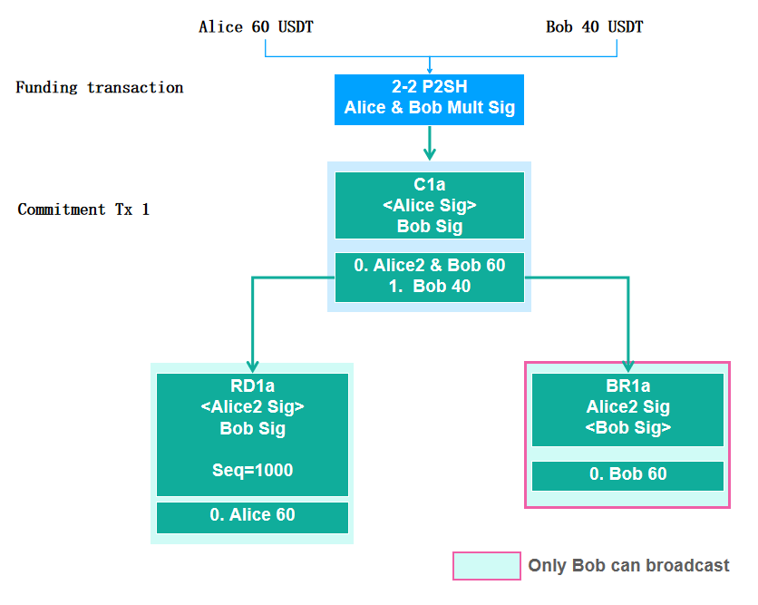
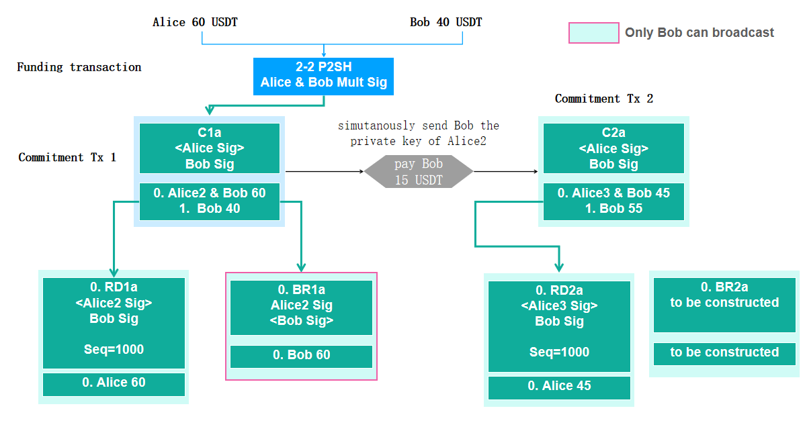
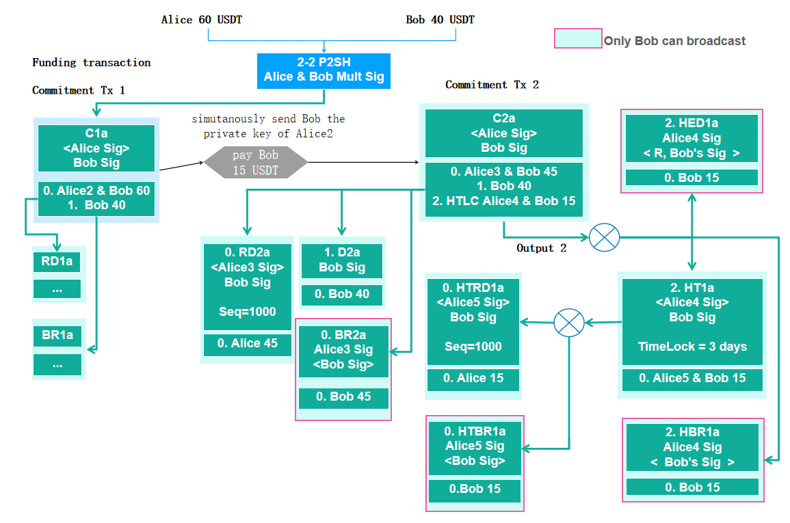

> *作者：OmniBOLT*
> 
> *来源：<https://medium.com/omnibolt/part-i-omnibolt-detailed-introduction-178f00fe9364>*


为了帮助社区更好地理解 OmniLayer、OmniBOLT、闪电网络和相关的程序，我们写了一篇详细解释它们的文章，而且分成了上下两部分。本文是上半篇。而且，我们将在下半篇中详细解释 OmniBOLT 的核心模块 —— 通道间的原子化互换。那么，我们就先从探究**闪电网络旗舰协议 OmniBOLT** 开始吧！

## 引言

闪电网络致力于为比特币网络扩容，它能在网络中的独立对等节点之间协助快速的比特币链下支付。基于闪电网络的基础理论，OmniBOLT 为比特币网络上的智能资产层 —— 尤其是那些通过 OmniLayer 协议发布的资产 —— 定义了快速流通协议。

**因为对智能资产的基础性支持，当前的 LND 和 BOLT 实现不仅能支持瞬时的 BTC 支付，还有下列优势**：

- **通过 OmniLayer 发行的智能资产的即时支付。**
- **不同资产的跨通道原子化互换。**
- **基于闪电通道的去中心化交易所，而且具有极快的交易速度。**
- **基于原子化互换的担保借贷合约。**
- **为去中心化金融而生的更灵活的合约。**

（译者注：LND 是一种闪电网络节点实现；BOLT 的全称是 “Basis of Lightning Technology”，闪电网络基础。）

有兴趣的读者可以直接阅读 GiHub 上的 OmniBOLT 规范库：[**第六章：去中心化交易所、担保借贷合约、线上商店，等等**](https://github.com/LightningOnOmnilayer/Omni-BOLT-spec/blob/master/OmniBOLT-06-Mortgage-Loan-Contracts-for-Crypto-Assets.md)，了解更多例子。

OmniBOLT 极大地延伸了比特币闪电网络的功能。它是在 2019 年 8 月 1 日出现的。

## 1. 闪电网络和 OmniLayer

基于闪电网络的基础协议，OmniBOLT 规范定义了让 OmniLayer 资产通过闪电通道转移的方法，以及 OmniLayer 资产如何能从神奇的快速支付理论中获益。根据链下比特币转账的 Layer-2 协议规范 [BOLT (Basis of Lightning Technology) ](https://github.com/lightningnetwork/lightning-rfc/blob/master/00-introduction.md)，我们提出了 OmniBOLT 特殊协议来延伸基础理论的范围，以支持更广泛的资产类别。

OmniBOLT 自身并不发行代币。所有代币都会发行在 OmniLayer 上，然后通过基于 P2(W)SH 的通道进入 OmniBOLT 网络；由此，代币会被锁定在主链上，但随时可以在 OmniLayer 主链上赎回。

## 2. 概念

- **OBD**：OmniBOLT 后台程序。
- **通道**：闪电网络中的 Poon-Dryja 式通道（译者注：Poon 和 Dryja 是闪电网络白皮书的两位作者）。通道写成 ` [Alice, USDT, Bob] ` ，表示 Alice 和 Bob 开设的、注入了 USDT 的通道。
- **财产**：在 OmniLayer 上发行的代币，等同于 “资产”。
- **RSMC**：可撤销的序列式到期合约（Revocable Sequence Maturity Contract）的设计用意是惩罚恶意的对等节点，他们可能会广播更老的承诺交易以获得相比最新余额更多的钱。
- **HTLC**：哈希时间锁合约，将多个通道串联在一起，为并无直接通道相连的对等节点传送代币。
- **承诺交易**：创建出来但默认不会广播出去的交易，在下一笔承诺交易出现后就会 “作废”。
- **BR**：RSMC 所用的违约救济交易，如果 Alice 靠广播更老的承诺交易搞诈骗，BR 将把她所有的通道余额都发给 Bob。
- **RD**：从 2-2 P2SH 交易的输出中支付的可撤销分发交易，在 Alice 广播最新的合法承诺交易时生效。它将立即给 Bob 分发其应得的余额，并在一段时间（比如 100 个区块以后）后给 Alice 分发余额。
- **HED**：哈希时间锁合约执行分发。
- **HT**：哈希时间锁超时。
- **HBR**：哈希时间锁违约救济，也就是 HTLC 中的违约救济交易
- **HTRD**：HTLC 中的可撤销分发交易。
- **HTBR**：HTLC 超时违约救济，惩罚在时间锁期间广播更早的哈希时间锁交易的 Alice。
- **原子化互换**：原子化互换技术使得密码货币可以彼此互换，而不必使用中心化的中介（比如交易所）。
- **HTLSC**：哈希时间锁互换合约，由两笔单独的 HTLC 组成，带有额外指定的交换汇率和时间锁定器。

## 3. 可撤销的序列式到期合约

为了避免恶意对手拒绝签名通道交易、让资金永久锁在通道（P2SH 输出）内，我们构造出可以撤销的 “承诺交易”。这是我们最先引入 “可撤销的序列式到期合约（RSMC）” 的地方；这种合约是由 Poon 和 Dryja 在闪电网络白皮书中发明的。

所以， ` funding_created `  交易并不意味着双方就将资金锁进了通道了。通道双方通信的第一回合只是建立一个 P2SH 地址、构造一笔注资交易但并不广播，以及构造一笔 RSMC。然后，Alice 或者 Bob 可以广播注资交易，将 Omni 资产转入通道中。

下图展示了参与者在广播 注资交易/承诺交易 之前**必须**做的启动操作。BR1a（违约救济交易）可以稍后再创建，但必须在下一笔承诺交易构造之前。



总的来说，RSMC 由下列 5 步组成：

步骤 1：Alice 使用临时私钥 Alice2 构造一个临时的 2-2 多签名地址，记为 Alice2 & Bob；并等待 Bob 的签名。

步骤 2：Alice 使用 Alice & Bob（多签名输入）构造一笔承诺支付 C1a，该支付的一个输出将 60 USDT 发送给  ` Alice2 & Bob ` ，另一个输出将 40 USDT 发送给 Bob。

步骤 3：RD1a 是 C1a 的第一个输出，它会给 Alice 支付 60 USDT，但有一个序列号来防止 Alice 立即拿走这些钱。

步骤 4：Bob 签名 C1a 和 RD1a，并将数据发回给 Alice。

步骤 5：OBD 构造退款交易：C1a/RD1a。

下图展示了在一个通道中发生的一笔承诺交易，解释了资金是如何转移的。



## 4. 哈希时间锁合约

> “一条双向的支付通道只能保证通道内可以安全转移资金，为了让资金在通道所组成的网络中历经多跳而送达目的地，还需要另一种构造：哈希时间锁合约。”
>
> ——  Poon & Dryja，比特币的闪电网络：可扩展的链下即时支付

关于使用 HTLC 将通道串联，一种常见而且重大的误解是，如果 Alice 想给 David 支付 10 USDT，她可以使用 2 跳来送达：

```
Alice ---(10 USDT)---> Bob ---(10 USDT)---> Carol ---(10 USDT)---> David
```

这会把人搞蒙，因为闪电网络中没有个人账户的概念。闪电网络的唯一基石就是通道。所以正确的表示应该是：

```
[Alice --(10 USDT)--> Bob] ==(Bob 拥有两条通道)== [Bob --(10 USDT)--> Carol] ==(Carol 拥有两条通道)== [Carol --(10 USDT)--> David]
```

Alice 在 ` [Alice, USDT, Bob] ` 通道内给 Bob 转移 10 USDT，然后，Bob 在 ` [Bob, USDT, Carol] ` 通道内给 Carol 转移 10 USDT，最后，Carol 在 ` [Bob, USDT, Carol] ` 给  David 转移 10 USDT。

HTLC 实现了以下流程：

如果 Bob 可以告诉 Alice  ` R ` （这是  ` HASH(R) ` 的原像），Bob 就可以在  ` [Alice, USDT, Bob] ` 通道内拿走 10 USDT；而 Bob 也给 Carol 开了同样的条件：如果 Carol 可以告诉 Bob 这个  ` R ` ，就可以在  ` [Bob, USDT, Carol] ` 通道中得到 Bob 支付的 10 USDT.

使用了 HTLC 之后，资金的内部转移 ` [Alice --(10 USDT in HTLC)--> Bob] ` 就成了来自注资交易的、跟 [RD1a/BR1a](https://github.com/LightningOnOmnilayer/Omni-BOLT-spec/blob/master/OmniBOLT-03-RSMC-and-OmniLayer-Transactions.md#the-commitment_tx-and-commitment_tx_signed-message) 一样的不广播输出。



## 参考文献

闪电网络白皮书

BOLT 规范：https://github.com/lightningnetwork/lightning-rfc

闪电网络实现 LND：https://github.com/lightningnetwork/lnd

OmniLayer 规范：https://github.com/OmniLayer/spec

OmniBOLT 规范：https://github.com/omnilaboratory/Omni-BOLT-spec

OmniBOLT 项目：https://github.com/omnilaboratory/obd

OmniLayer 钱包：https://github.com/OmniLayer/omniwallet

OmniJ：https://github.com/OmniLayer/OmniJ42