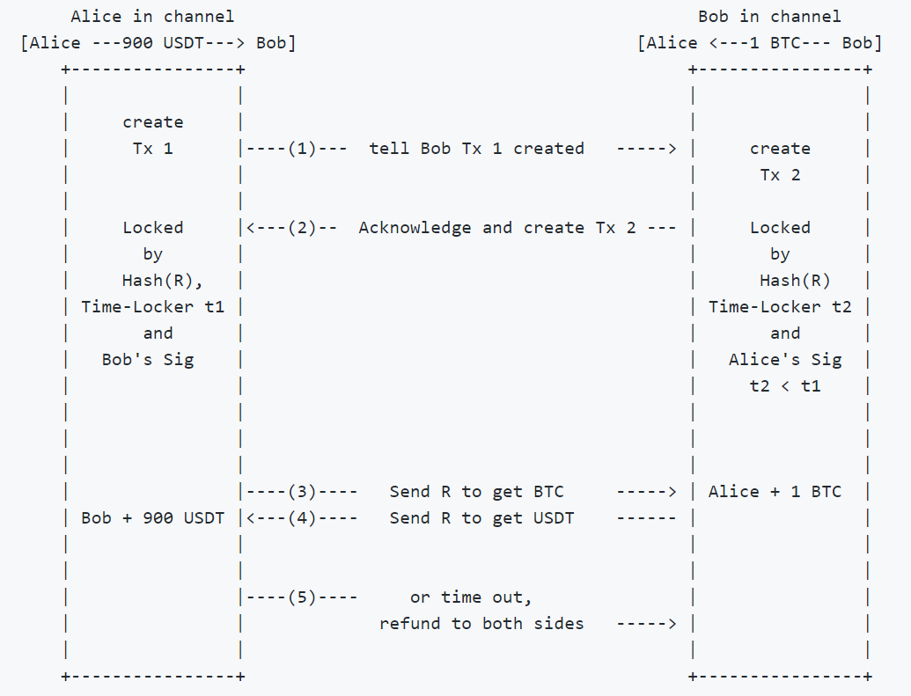
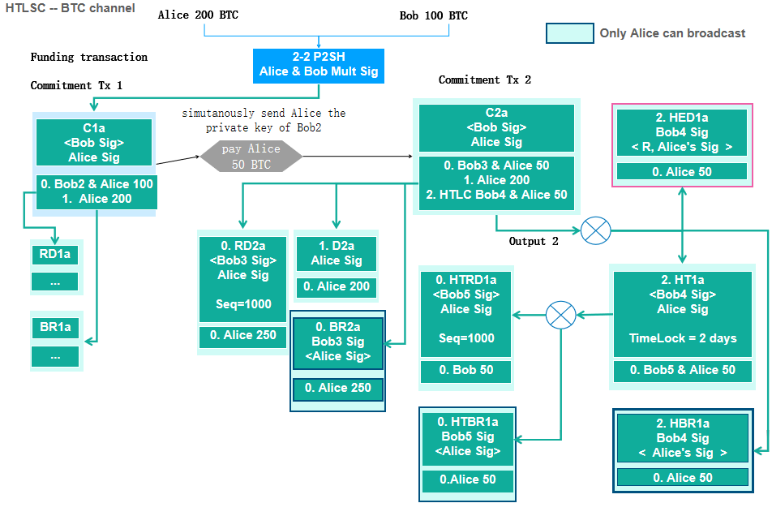

> *作者：OmniBOLT*
>
> *来源：<https://medium.com/omnibolt/part-ii-omnibolt-detailed-introduction-3a98c0cd714a>*
>
> *[前篇中文译本](https://www.btcstudy.org/2022/08/09/part-i-omnibolt-detailed-introduction/)*


为了帮助社区更好地理解 OmniLayer、OmniBOLT、闪电网络和相关的程序，我们写了一篇详细解释它们的文章，而且分成了上下两部分。本文是下半篇。我们将详细解释 OmniBOLT 的核心模块 —— 通道间的原子化互换。

## 5. 通道间的原子化互换

一般而言，原子化互换发生在不同区块链之间，用于让互不信任的用户交换彼此在不同链上的代币。OmniBOLT 所定义的通道可以锁入在 OmniLayer 上发行的任何代币。如果某人想要把自己手上的代币（比如 USDT） 跟另一个人的比特币相交换，双方都要使用一个密码学哈希函数建立一个时间窗口，并在这个窗口内确认收到了 USDT 和 BTC。如果某一方无法在窗口内确认交易，整个交易都会无效，资金会原路退回。这种特性消除了对手方风险。

通道内的标准互换流程如下所示：



```
- Tx 1 将在通道 [Alice, USDT, Bob] 内转移 1000 USDT 给 Bob，且这笔资金用 Hash(R) 和 Bob 的签名锁定
- Tx 2 将在通道 [Alice, BTC, Bob] 内转移 1 BTC 给 Alice，且这笔资金用 Hash(R) 和 Alice 的签名锁定
```

哈希时间锁互换合约（HTLSC）由两笔 HTLC 组成，它们额外指定了代币的汇率以及时间锁。

一次互换有 5 个步骤。在步骤 3 中，Alice 将 R 发送给 Bob，因为她可以在通道 `[Alice, BTC, Bob] ` 中解锁 Tx2 来获得 1 BTC。这样一来 Bob 也知道了 R，然后就可以用 R 在  ` [Alice, USDT, Bob] ` 内解锁自己的 900 USDT 了。

没有任何一方可以欺诈对手。一旦 R 在一条通道中曝光，Tx1 和 Tx2 就成了广义的承诺交易，这就跟 [HTLC 转化成一笔承诺交易的流程](https://github.com/omnilaboratory/OmniBOLT-spec/blob/master/OmniBOLT-05-Atomic-Swap-among-Channels.md#terminate-htlc-off-chain)完全一样。

在通道  ` [Alice, USDT, Bob] ` 内，Alice 创建了一个 HTLC 及其在 Bob 一端的镜像交易，使用了时间锁  ` t1 ` ，比如说是 3 天（如图所示）。


与此同时，Bob 在通道 ` [Alice, BTC, Bob] ` 通道中创建另一个 HTLC 及其在 Alice 一端的镜像交易，将协商好的 BTC 数量发送给 Alice。此处的时间锁  ` t2 `  被设置成 2 天，小于  ` t1 = 3 ` 天。



原子化互换是许多区块链应用的基石。下一章我们会解释一些例子，是比较符合直觉的案例，可以帮助我们的读者为现实世界的商业开发更复杂的应用程序。

## 6. 应用：担保借贷，在线宠物商店，等等

下面的案例在特定场景中使用了多阶段的原子化互换。整个流程可以实现为一个使用图灵完备的语言（比如 Javascript 和 Soldity）撰写的程序，它会调用 OBD API 来完成基本的任务。所有参与者都应该运行程序来检查是否所有交易都有效、对手方是否诚实。

### 担保借贷合约（CLC）

担保借贷合约服务于这个特定的用途：

> 你将一些有价值的东西作为担保品，锁入一个托管账户中，我会根据合适的 LTV（Loan to Value，贷款额与担保品的价值之比）给你放贷。如果你在约定的时间内偿清贷款，我将归还你的担保品；否则，我将拿走你的担保品。

实际上，HTLSC 为贷款中的参与者创建了一个托管账户。我们假设这样一种常见的场景：

Bob 希望跟 Alice 借款 900 USDT，并表示可以使用 1 BTC 作为担保。

所以，Bob 构造了一笔互换交易（HTLSC 1）：

```
Bob → Alice：互换(数量 = 1 BTC, 资产 = USDT, 汇率 = 900, 时间锁 = 30 天, Hash(R1), …)
```

这笔交易在通道 ` [Alice, BTC, Bob] ` 内创建了 HTLSC。

```
Alice → Bob: 接受互换(数量 = 900 USDT, 汇率 = 900, 时间锁 = 20 天, Hash(R1), …)
```

这笔交易在通道  ` [Alice, USDT, Bob] ` 内创建了 HTLSC。

与此同时，Bob 需要创建赎回互换交易（HTLSC 2）来拿回自己的 1 BTC：

```
Bob → Alice：互换(数量 = 900 USDT, 资产 = BTC, 汇率 = 1/900, 时间锁 = 60 天, Hash(R2), …)
```

这笔交易在通道  ` [Alice, USDT, Bob] ` 内创建了 HTLSC。

```
Alice → Bob: 接受互换(数量 = 1 BTC, 汇率 = 1/900, 时间锁 = 50 天, Hash(R2), …)
```

这笔交易在通道 ` [Alice, BTC, Bob] ` 内创建了 HTLSC。

只有当参与者们都接收这两笔互换的时候，他们的 OBD 会帮助创建 HTLSC 所需的所有对应交易，Bob 将能使用 R1，在通道 ` [Alice, USDT, Bob] ` 的 HTLSC 1 中获得 900 USDT，因此 Alice 也会得到 Bob 的 1 BTC 作为担保品。

在一段时间之后，Bob 希望赎回自己的 1 BTC。他使用 R2，在通道  ` [Alice, BTC, Bob] ` 的  HTLSC 2 中拿回自己的 1 BTC，这样 Alice 也会在通道 ` [Alice, USDT, Bob] ` 中拿回自己的 900 USDT。

当然，Alice 可以根据她对 BTC 价格的知识要求一个贷款利率。比如，她要求 Bob 创建汇率为 1/905 的互换，这样当 Bob 赎回自己的 BTC 时，她就可以得到 905 USDT。

### 在线宠物商店

这个案例是一阶互换，非常直接：

1. Alice 在 OmniLayer 上发行一种智能资产 “PET”，每个代币都代表着一只虚拟猫。
2. Bob 跟 Alice 建立了一个 USDT 通道和一个 PET 通道，并注入了 USDT 资金。
3. Bob 使用 HTLSC，用 1000 USDT 跟 Alice 买入一只虚拟猫。

就这么简单！

### 7. 实现和钱包 API

OmniBOLT 规范的实现可以在这个库中找到：https://github.com/LightningOnOmniLayer/LightningOnOmni

API 的在线文档可以在这里找到：https://api.omnilab.online/

Javascript API：https://github.com/LightningOnOmniLayer/DebuggingTool/blob/master/js/obdapi.js.

图形界面的调试工具：

https://github.com/LightningOnOmniLayer/DebuggingTool

（完）