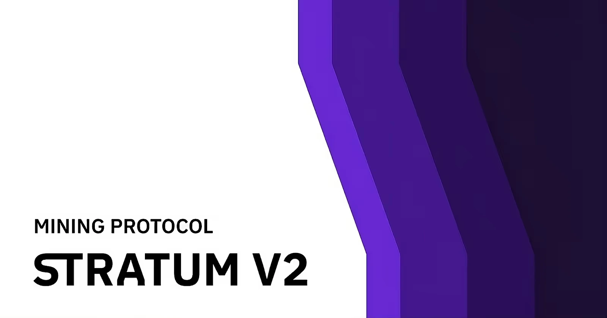
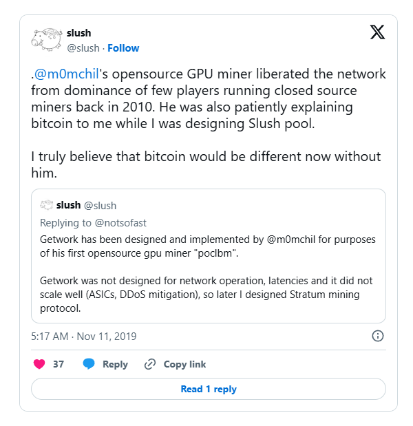
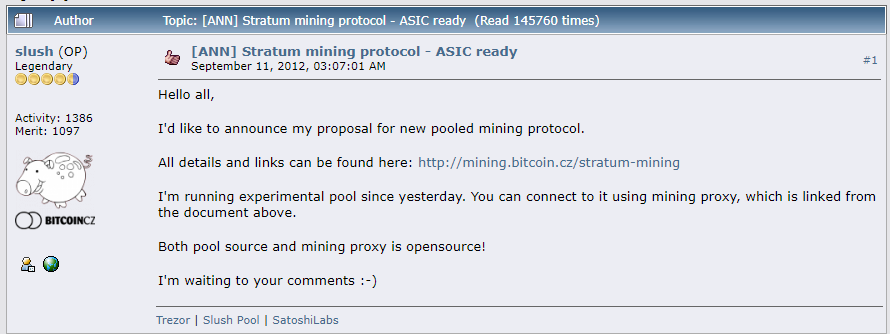
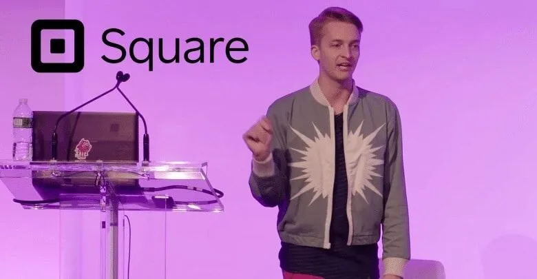
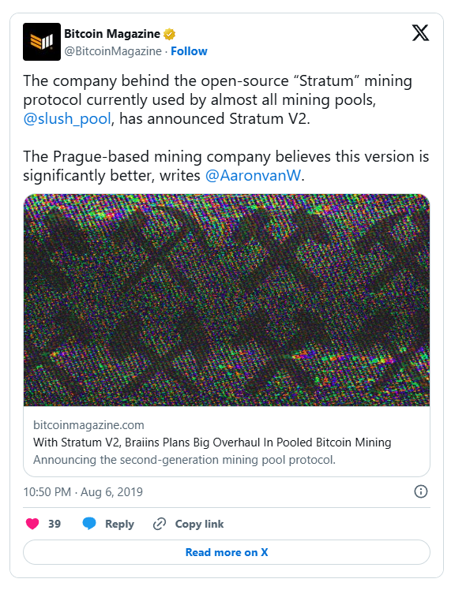
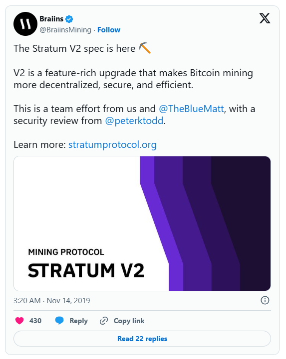
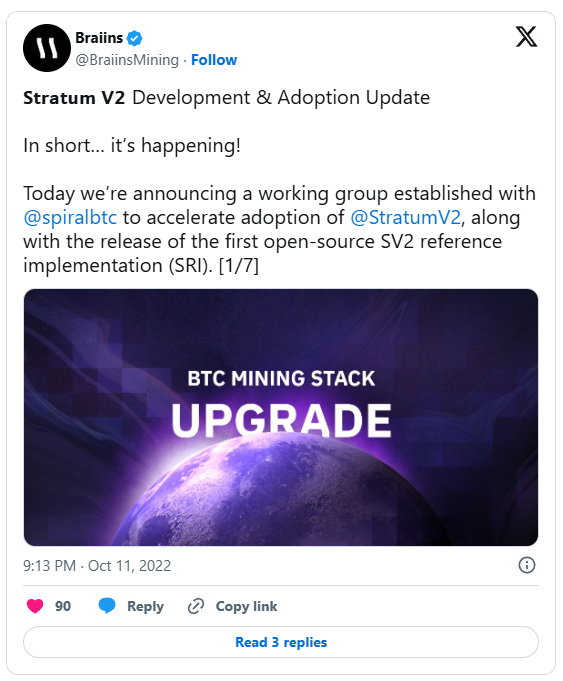

> *作者：Braiins*
> 
> *来源：<https://braiins.com/blog/past-and-future-of-bitcoin-mining-protocols-stratum-v2-overview>*

在这篇博文中，我们将了解比特币矿池网络连接协议的历史沿革，以理解为了 Stratum V2 正在塑造比特币挖矿的未来。“Stratum V2” 是下一代的矿池协议，它产生自当前的 Stratum V2 和 Betterhash 协议。它提高了安全性，让数据传输更为高效，也降低了挖矿基础设施的门槛。此外，它让加入矿池的矿工可以自己选择要挖掘的交易，从而提升了挖矿的去中心化。

## 矿池和挖矿协议的历史

最初，矿工必须通过运行全节点来连接到比特币协议并与之交互。

为了标准化矿工与比特币协议之间的沟通，一种开源的 “getwork” 协议被用作快速且简单的解决方案，帮助彼此独立的矿工开始挖矿。Getwork 协议使用 HTTP 协议作为跟比特币协议连接的方法。但是，HTTP 一般用在网页上，对于协调对等节点来挖掘比特币并不理想。**因此，随着挖矿变得更加流行，其低效之处也即逐渐暴露出来**。

到了 2012 年，随着挖矿行业发生了巨大变化、网络哈希率迅速增长，getwork 的低效率已经成了大问题。它让可观数量的网络带宽发生在矿工之间，而且，服务端（也即矿池）为了支持日渐增多的矿工，要花费数量高不可攀的带宽。

**这时候，事情已经很显然了：getwrok 协议不是一个能够扩容的解决方案**。

**入池挖矿越来越流行，getwork 协议的局限性也就越来越明显**。这让 Marek "Slush" Palatinus —— 他在 2010 年创建了 Slush 矿池 —— 开发了 stratum 协议（Stratum V1）用于矿池和矿工的沟通。从此，Stratum V1 就一直是矿池挖矿的标准协议，尽管比特币网络和挖矿行业产生了巨大的增长（ ~ 10 TH/s 增长到 600 EH/s）。（译者注：这里的 “H/s” 是 “每秒哈希次数” 的意思，是度量挖矿算力（哈希率）的单位。）

## 矿池协议的现状

### Stratum (V1) 以及对它的批评

Stratum V1 [被批评一开始是秘密开发的](https://bitcointalk.org/?topic=557991.msg6079772#msg6079772)，然后才摆到台面上，因为没有用正式的 BIP 来描述其实现。但是，可以说 **Stratum V1 跟比特币的协议和实现都无关 —— 它只是一个定制化的池化挖矿插件，所以不应该要求一个正式的 BIP** 。

另一个争议的源头是，就在 Stratum V1 开发期间，社区花了几个月时间来开发一种叫做 “[getblocktemplate(BIP22)](https://en.bitcoin.it/wiki/BIP_0022)” 的开源协议，以取代 getwork 协议。就在 Stratum V1 发布的几乎同一时间，getblocktemplate 协议的直接采用开始停滞。不过，应该指出的是，Stratum 的服务端在背后也使用了 getblocktemplate 协议，只是围绕它添加了许多的优化。

**不幸的是，使用 getblocktemplate 协议有一个重大的缺点，就是矿工会失去构造自己的区块模板（也即在自己挖掘的区块中选择包含哪些交易）的能力**。虽然这完全不影响矿工的经济激励，因为矿工总是被激励在自己的区块中打包手续费最高的交易，但它确实带来了一个漏洞 —— 矿池运营者可能被劫持。这就是为什么我们要在 Stratum V2 中重新引入[矿工构造自己的区块](https://braiins.com/news/stratum-v2-bitcoin-decentralization)的能力。

[Slush 在 2012 年发布了 Stratum 协议](https://bitcointalk.org/index.php?topic=108533.0)，只需简单浏览帖子，你会发现很多这样的批评。

最后，还有安全性问题。正如 Ruben Recabarren 在自己的论文《[Stratum：比特币矿池协议及其加强](https://arxiv.org/pdf/1703.06545.pdf)》中指出的，**Stratum V1 无法抵御可能的中间人攻击**。虽然没有 “哈希率劫持” 的显著案例曝出，在不为人知的地方，依然有可能发生，因此，比特币挖矿行业迁移到更加安全的协议就变得更加重要。[防范哈希率劫持](https://braiins.com/news/hashrate-robbery-stratum-v2-fixes-this-and-more)是 Stratum V2 的另一个关键特性。**Stratum V1 在自己的实现中做了出色的工作，但比特币网络还在持续增长，新的开发也一直在社区中涌现**。

### Matt Corallo 的 BetterHash 提议

在比特币历史上的绝大部分时间，矿池运营者都控制着在他们挖掘的区块中要包含哪些交易。矿池给矿工提供任务（分发任务），而矿工提交符合要求的工作量证明。**这让矿工在一定程度上依赖于矿池的诚实和公平**。

为了解决矿池中心化问题，Chaincode Labs 的工程师（现在供职于 Spiral）Matt Corallo 提出了一种新的挖矿协议。[Matt 在 2018 年提出 Betterhash](https://github.com/TheBlueMatt/bips/blob/betterhash/bip-XXXX.mediawiki#Abstract)，作为更新挖矿协议的尝试。

- Matt Corallo 因为 Stratum V2 和 BetterHash 而知名。他也曾在 Blockstream、Chaincode Labs 和 Square 担任开发工作。 -

**BetterHash 挖矿协议取代了 getblocktemplate 协议，并为矿工带来了一系列的品质改进。最大的改进之一是，矿工可以构造自己的区块模板、矿池可以采用这样的模板来分发任务**。

BetterHash 的初衷是，通过让矿工自己挑选交易、而不是只能接受来自矿池的区块模板，将权力还给矿工。通过提醒矿工，矿池可能会在不经济的区块构造中审查交易，这提供流去中心化。

但是，BetterHash 有一些故障，使得矿池很难实现它，所以最终也没有迈过规范阶段。

### 对比挖矿协议：Stratum V1、BetterHash、Stratum V2

**Stratum V2 是 BetterHash 和 Stratum V1 的改进版，主要在效率、安全性和矿工自主性上有所改进。它减少了带宽用量，加速了挖矿沟通，并引入了更健壮的安全性来防范中间人攻击**。此外，它给了矿工更大的交易挑选控制权，这是在 Stratum V1 有限、在 BetterHash 中得到一定程度提升的东西。这些强化让 Stratum V2 成为了更优化、更安全也更去中心化的挖矿解决方案

|                  | Stratum V2         | Stratum V1         | BetterHash         |
| ---------------- | ------------------ | ------------------ | ------------------ |
| 矿工低开销       | √ |                    | √ |
| 矿池低开销       | √ |                    |                    |
| 协议容易更新     | √ |                    | √ |
| 容易延展         | √ |                    | √ |
| 哈希率劫持防范   | √ |                    | √ |
| 自定义任务选择   | √ |                    | √ |
| 专设任务挑选协议 | √ |                    |                    |
| 带有固件实现     | √ | √ |                    |
| 空块消除         | √ |                    |                    |
| 瞬时后端切换     | √ |                    |                    |

## Stratum V2 ：矿池协议的最终胜出者

### SV2 有利于矿工、矿池和其他所有人

Stratum V2 由 Braiions 的创始人 Pavel Moravec 和 Jan Čapek 在 2019 年推出，也结合了 Matt Corallo 和其他行业专家的努力。

[Youtube 视频](https://youtu.be/zFoffeeVMCA)

它既是最初的用于比特币挖矿的 Stratum 协议的升级版本，也是 BetterHash 的进化。

这套新协议提供了多种好处：**它让挖矿变得更加安全、让数据可以更高效率地收发，还降低了对高负载的挖矿设备的需要**。此外，Stratum V2 还给了矿工选择要在自己挖掘的区块中打包哪些交易的权力，帮助分散决策权和比特币挖矿的去中心化。

[Youtube 视频](https://youtu.be/b5JcrotnIqI)

得益于这些升级，**Stratum V2 简化了挖矿作业，提高了安全性，并鼓励一个更加分散、去中心化的挖矿业态**。

### SV2 开源参考实现

一些矿池，比如 Braiins Pool，正在积极使用这一协议来优化挖矿体验，并且，Stratum V2 的开发在近年也一直在继续。在 2024 年 3 月，一群开发者[发布了正式的 SRI](https://stratumprotocol.org/getting-started/)（Stratum V2 参考实现）v1.0 版本，这推动了协议上的开发工作，并增加了额外的特性，使之超越了 Braiins 的创始人和 Matt Corallo 所制定的规范。

**我们相信，SV2 拥有光明的未来，并且有潜能引领挖矿行业的革新。**敬请期待下一篇博客！

**贡献和实现 Stratum V2**

SV2 运动日益壮大，几家知名的公司也加入了。详情请看这个网页：https://stratumprotocol.org/

（完）