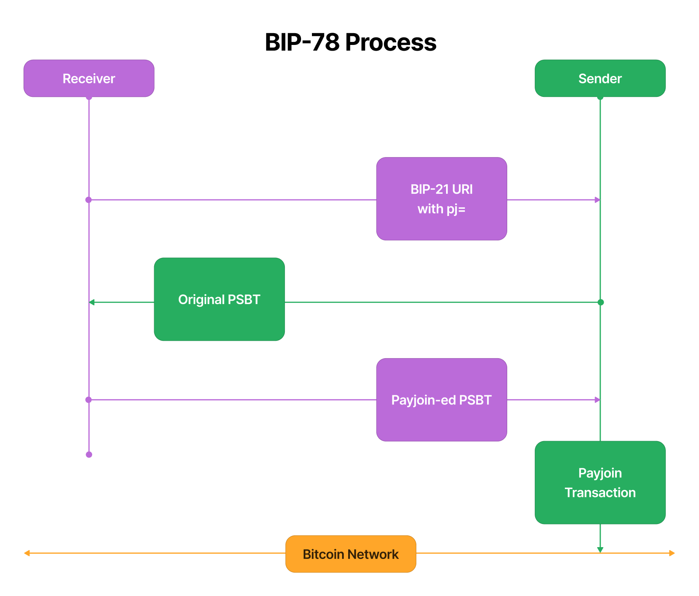
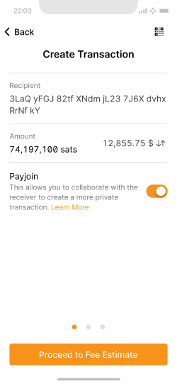
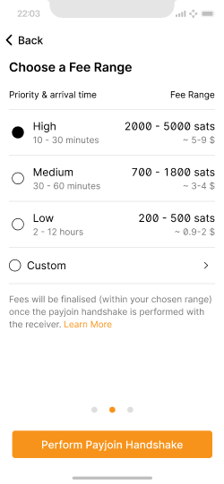
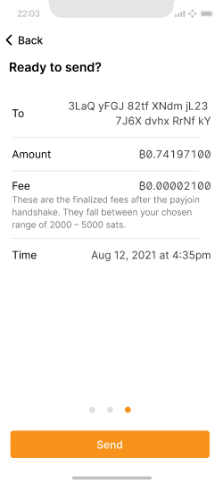
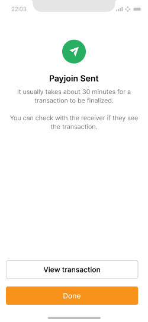

> *作者：Bitcoin Design*
> 
> *来源：<https://bitcoin.design/guide/case-studies/payjoin/>*

Payjoin 指的是发送方和接收方通过协作来共同构建一笔比特币交易。作为一种强大的工具，Payjoin 交易能为用户提升隐私性、节省手续费，并整合 UTXO。但由于其交互式和同步的特性，Payjoin 也面临着一些挑战和权衡。

**在支付过程中，Payjoin 交易能够打破一些链上分析的[启发式算法](https://github.com/bitcoin/bips/blob/master/bip-0078.mediawiki#motivation)。然而，构建这种交易需要发送方和接收方通过一个端点进行实时协调。**

本案例研究将:

- 阐明发送方和接收方各自的动机与目标。
- 分析交易双方的 Payjoin 用户体验（UX），并提出相应的设计方法。
- 提出具体的用户流程，并尽可能提供可行的设计方案。

本研究的核心结论是：对于接收方而言，虽然初始设置较为繁琐，但后续每笔交易几乎无需任何额外操作。  

而对于发送方来说，除了要使用支持 Payjoin 的钱包外，几乎无需额外设置。并且，根据他们的选择以及具体实现方案的成熟度，其用户体验可以做到与普通交易完全相同或几乎一致。

## 什么是 Payjoin？

在 Payjoin 交易中，发送方和接收方会以协作的方式，共同为这笔交易贡献输入。Payjoin 机制也被称为“Pay-to-Endpoint”（P2EP），因为整个协作过程是由接收方运行的一个网络端点（endpoint）来协调的。这个端点的地址会和支付地址、金额信息一起，通过 [BIP-21](https://bitcoinqr.dev/) 格式的 URI 来传递。

在 Payjoin 的流程中，双方会对交易进行编辑、签名和多次传递，直到最终版本确认后才进行广播。 [BIP-78](https://github.com/bitcoin/bips/blob/master/bip-0078.mediawiki#user-content-Respecting_the_minimum_relay_fee_policy) 提案正式定义了一个包含两轮交互（或在地址共享之外，再进行一轮交互）的协议，正如下处图示。

## 背景  
本案例研究源于一项[设计挑战](https://bitcoin.design/guide/resources/design-challenges/#challenge-6-private-purchase)，目标是设计一个基于 Payjoin 的发送方支付流程。

Payjoin 对交易双方的实时协作提出了独特的挑战，我们需要一套全新的用户流程，才能健壮而优雅地实现 [BIP-78](https://github.com/bitcoin/bips/blob/master/bip-0078.mediawiki) 所启用的各项功能。

截至 2023 年初，Payjoin 尚未在比特币生态中获得广泛的采用。

## 我们的方法

本案例研究遵循了以下步骤：

- 理解发送方与接收方的用户及技术要求。
- 调研 Payjoin 的具体实现： [BlueWallet](https://bluewallet.io/) （发送端）和 [BTCPay Server](https://btcpayserver.org/) （接收端）
- 基于以上研究，为发送方和接收方设计用户流程。

## 理解用户与需求  

从技术上来讲，任何在比特币链上进行交易的人都可以使用 Payjoin。本案例研究从以下两个维度对用户进行分类：

1. 机构（企业、交易所等）与个人
2. 支付的发送方与接收方

**接收方的目标**

- 交易隐私性
- 节省手续费
- 成功交易

**作为接收方，我希望：**
- 创建一个启用 Payjoin 的支付链接并分享给发送方。
- 能为某个钱包、账户或用户启用  Payjoin 功能。
- 创建一个热钱包并将其用于 Payjoin。
- 为新创建的热钱包充值，使其拥有可供使用的 UTXO。
- 将一个已有的热钱包连接到我的 Payjoin 设置中。
- 补充主钱包（观察钱包）的余额。
- 设置地址替换，以便补充观察钱包余额或进行无关支付。
- 监控 Payjoin 的状态。
- 排查 Payjoin 流程中的错误。

**发送方的目标**
- 交易隐私性
- 优化手续费并控制确认时间
- 交易成功

**作为发送方，我希望：**
- 使用 Payjoin 进行隐私支付，打破链上启发式分析法。
- 支付时自行选择是否使用 Payjoin。
- 在交易广播前查看要支付的手续费。
- 控制交易的确认时间。
- 若 Payjoin 流程失败，能够中止交易。

**发送方要求**

- 一款支持发送 Payjoin 的应用
- 在 Payjoin 交易过程中全程保持在线

发送方通过 Payjoin 获得隐私保护，通常需要承担更高的交易手续费。

**接收方要求**

- 热钱包
- 热钱包中有资金
- 一款支持接收 Payjoin 的应用
- 一个在交易期间保持在线的端点

接收方有望获得以下好处:

- 增强交易的隐私性
- 整合 UTXO 集合
- 节省交易手续费

## 发送 Payjoin  

对于发送方来说，参与 Payjoin 交易的流程相对简单。只需使用支持 Payjoin 的钱包，并在交易过程中保持在线即可。

### 调研：分析 BlueWallet

我们分析了 BlueWallet 在 2020 年率先实现的 Payjoin 用户流程。详细内容见[调研报告](https://docs.google.com/document/d/1_de2pkMREGpZQwOefQdH-MZNSUPazObgRK1cruiWBmo/edit#bookmark=id.jamlvi37p922).

主要发现如下：

- 在 Payjoin 的交易流程中，随着交易体积的增加，实际的手续费率会下降，可能影响预估的交易确认时间。
- 该流程产生的交易在移除一个输入后，其手续费率会变为一个整数，而这可能成为链上分析公司识别 Payjoin 的线索。

### Payjoin 发送方流程

我们设计了一套新的发送方流程，试图解决上述问题。

为了创建这套流程，我们假设接收方只提供 UTXO 而不承担手续费，因为这样可以让双方的流程更简单和自动化。

**简而言之，我们设计的这套发送方流程要求用户选择一个手续费区间，而非具体的手续费金额（或费率），而流程的其余部分则与普通交易几乎一致。我们通过这个设计来设置 BIP-78 中规定的 3个可选参数，从而构建一个简洁而高效的 Payjoin 实现方案。**

详细思路见此[文档](https://docs.google.com/document/d/1IPCQsdoVBGEceUnWhOeEhi-xcNF049RG1tRAchz-Iuc/edit?usp=sharing).

可通过此 [Figjam 文件](https://www.figma.com/file/69uUDWVc8N9t5Bej8pZEsF/PayJoin-User-Flows?node-id=0%3A1&t=8eOBQa7JofjZ3p3z-1) 查看该流程。详细过程和考量见此 [文件](https://www.figma.com/file/NzMvwyzP7x5jfGmwNUKRov/PayJoin-Process-Flows?node-id=336%3A619&t=BhGymSWCzl2Xm2oO-1)。

### Payjoin “握手（Handshake）”

**我们引入“Payjoin 握手”这一术语，旨在简洁地描述发送方与接收方之间自动化的往返交互过程。在此过程中，一份最初仅包含发送方输入的 PSBT，会转变为一份包含双方输入、已签名且可广播的最终交易。**

以上步骤对于参与交易的用户来说并不重要，也无需他们任何一方执行额外的操作。通俗地说，交易双方甚至无需察觉这一过程，只要在交易过程中保持在线即可。

### Payjoin 发送方流程原型

**我们的目标是让这套用户流程的体验无限接近于常规流程。对于那些必须有所区别的环节，我们会通过 UI 来指导和帮助用户。**

支持 Payjoin 的钱包会展示一个默认启用该功能的界面。

用户会看到一个和常规界面非常相似的手续费区间选择页。

接着，屏幕会显示一个过渡界面，提示用户 Payjoin 交易正在构建和签名中。

Payjoin “握手”完成后，进入交易广播前的最终检查界面，上面会显示最终的手续费。

最后，支付成功界面会告知用户，该 Payjoin 交易已成功广播。

每个界面的详细说明见此[文档](https://docs.google.com/document/d/1laHP3TqU6zzf0ajpQfQ5qaP0wUUQXNNnoMvVrVVU7K0/edit?usp=sharing)。设计稿见此 [Figma 文件](https://www.figma.com/file/hCHA4qjxQGiX06ddnWADyW/%5Byashraj's-copy%5D-Bitcoin-Wallet-UI-Kit-%26-Design-System?node-id=4331%3A66395&t=uV0lFmRXrQiv2AAB-1)。

## 接收 Payjoin

基于 BIP78 协议，[接收方的门槛](https://bitcoin.design/guide/case-studies/payjoin/#understanding-users--requirements) 要远高于发送方。 发送方只需要一个兼容的移动钱包，但接收方仅靠移动钱包无法维护一个始终在线的端点。而企业和机构则面临另一种困境：虽然他们有能力轻松地部署一套 Payjoin 接收方案，但对热钱包的安全顾虑又令其望而却步。

**尽管几乎所有移动钱包都是热钱包，为其充值也很简单，但要专门运行一个在线服务器来进行 Payjoin 握手，无论在技术上还是实践中都颇具挑战。这或许是当前阻碍 Payjoin 获得支持和普及的最大障碍。**

### 调研： BTCPay 商户/接收端

作者于 2023 年 2 月成功测试了 BTCPay v1.7.12 的 Payjoin 接收功能。

主要发现如下:

- 一旦设置完成，系统会自动生成启用了 Payjoin 的链接。
- 如果用户选择添加一个已有的热钱包，BTCPay 不会像新建热钱包时一样在同一页面提供启用 Payjoin 的选项。
- 无论是在新建钱包还是添加已有钱包的设置中，如果用户选择了观察（冷）钱包，他们将永远不会接触到 Payjoin 功能（因为签署 Payjoin 交易的过程需要用到私钥）。
- 商户只能连接一个比特币钱包（除非通过 [BTCPay Vault](https://docs.btcpayserver.org/HardwareWalletIntegration/)），因此使用了冷钱包就无法再设置热钱包（也就无法使用 Payjoin）。
- 如果热钱包中的余额不足以执行 Payjoin 交易，BTCPay 不会提示或警告用户，从而导致支付失败。
- 没有专门用于管理和监控 Payjoin 的地方。

[在 BTCPay 上接收 Payjoin 的完整调研见此分析报告](https://docs.google.com/document/d/1_de2pkMREGpZQwOefQdH-MZNSUPazObgRK1cruiWBmo/edit?usp=sharing)。

### 建议的接收方流程
在此，我们将为可以始终在线的销售终端（POS，point-of-sale）系统设计一套用户流程。此流程不适用于移动钱包。

接收方应当能够在平台（应用或 POS 系统）的初始配置过程中、或之后任意时间点设置 Payjoin。以下展示的是一个独立的 Payjoin 设置流程。

集成了初始配置过程的详细流程图见此 [Figjam 文件](https://www.figma.com/file/NzMvwyzP7x5jfGmwNUKRov/PayJoin-Process-Flows?node-id=0%3A1&t=wSwewTOkQddWhagl-1) 。

### 请求 Payjoin

一旦 Payjoin 设置生效， 所有支付请求（BIP-21 支付链接或二维码） 都应该包含执行 Payjoin 交易所需的信息（包括端点地址），无需用户额外操作。

### Payjoin 状态/设置

在设置页面中开辟一个版块，提供一个用于管理 Payjoin 设置和监控其状态的专属空间，会是个不错的设计。这个版块还能为使用冷钱包的用户提供一个发现并设置 Payjoin 功能的入口。该版块可以包含以下内容：

- Payjoin 设置流程
- 其它 Payjoin 功能，例如：第三方端点、地址/输出替换、补充冷钱包余额等
- 监控 Payjoin 就绪状态：热钱包状态、Payjoin 端点状态等

## 洞见

在本案例研究的过程中，我们收获颇丰，而我们所设计的用户流程已经应用了其中的许多洞见。

- Payjoin 允许接收方整合 UTXO，长远来看，这让参与者能够支付更低的手续费。这一点对于交易所尤其有用，因为他们最需要这个功能，同时也完全具备部署一套稳健可靠的系统的技术实力。
- 考虑到交易双方可能需要经历多达数轮的迭代与协作，本案例研究引入了“Payjoin 握手” 这一术语，用来概括用户操作之间的所有自动化交互。
- 维护一个始终在线的端点似乎是 Payjoin 实现的最大障碍，文中也列出了一些替代方案。
- Payjoin 虽然对接收方提出了更高的要求，但也为其带来了更多的好处和机会。
- 输出替换：这是源自 BIP-78 的一个强大构想。虽具风险，但也能成为 Payjoin 用户的有力助手。
- 输出替换：Payjoin 让接收方可以发布静态的支付信息，但在实际收款时使用不同的地址，避免了地址重用。
- Payjoin 接收方无需额外设置钱包，可以直接使用其日常消费钱包作为 Payjoin 的热钱包。
- Payjoin 实现需要留意用于识别 Payjoin 的“整数费率”分析法，应当自动化处理，无需用户干预。

## 新的可能
由于涉及多方协作和众多不确定的环节（如端点），无论是理解还是实现 Payjoin 都有着较高的门槛，但这也为各式各样的新功能和服务打开了大门。

以下是一些例子：

- 接收方可以选择使用第三方端点（关闭地址替换），牺牲一部分隐私来换取便利性。
- 目前有一些激动人心的工作围绕 [无服务端的](https://gist.github.com/DanGould/243e418752fff760c9f6b23bba8a32f9) Payjoin 实现展开，这一方案非常适合同时支持比特币和闪电网络的平台。
- 接收端的实现方案可以使用地址替换，来让用户自行发起支付。
- 可以通过 NFC（或其它无线近场通讯技术）来进行 Payjoin 协作
- 可以利用 BIP-78 增加一轮额外的交互，允许发送方在“握手”后调整手续费，然后发回给接收方进行广播。

本案例研究深入探讨了围绕 Payjoin 的设计问题，希望能借此激发社区对其多样化用例和潜在价值的兴趣。

*致谢*:

- 感谢 BTCPay 的 [Pavlenex](https://pavlenex.com/)  提供的支持 Payjoin 的 BTCPay  实例，我们用它测试了接收流程。
- 感谢 [Nicolas Dorier](https://twitter.com/nicolasdorier) 审校本案例研究的内容并积极参与 Payjoin 的相关讨论。
- 最后，感谢 [Dan Gould](https://twitter.com/bitgould) 的宝贵指导、耐心和热情。

## 资源

- [BIP-78](https://github.com/bitcoin/bips/blob/master/bip-0078.mediawiki)
- [Bitcoin Optech 主题：Payjoin](https://bitcoinops.org/en/topics/payjoin)
- [Payjoin 处理流程](https://www.figma.com/file/NzMvwyzP7x5jfGmwNUKRov/PayJoin-Process-Flows?node-id=0%3A1&t=wSwewTOkQddWhagl-1)
- [Payjoin 用户流程](https://www.figma.com/file/69uUDWVc8N9t5Bej8pZEsF/PayJoin-User-Flows?node-id=0%3A1&t=8F4jOa71i6X1Slbz-1)
- [调研报告: 在真实环境中测试 Payjoin](https://docs.google.com/document/d/1_de2pkMREGpZQwOefQdH-MZNSUPazObgRK1cruiWBmo/edit?usp=sharing)
- [BTCPay Server Payjoin 指南](https://docs.btcpayserver.org/Payjoin/#btcpay-server-payjoin-guide)
