> *作者：Brandon Lucas*
> 
> *来源：<https://brandonlucas.net/articles/bitcoin/payjoin>*

Payjoin 是一种协议，运用一种简单、聪明的技巧来构造比特币交易，一石多鸟地解决了许多问题。它是设计初衷是解决比特币最大的[隐私性问题](https://decrypt.co/107376/bitcoin-privacy-problem-what-cypherpunks-are-doing)，但也可以帮助解决[扩容问题](https://en.wikipedia.org/wiki/Bitcoin_scalability_problem)，也因此可以帮助人们[节约手续费](https://github.com/orgs/payjoin/discussions/91#discussion-5439172)。它尤其可以跟闪电网络节点兼容，因为它当前的设计对交易的接收方有活性要求（liveness requirement），意思是接收方在接收支付的时候必须在线（就像一个闪电节点一样）。在未来，甚至这种要求也会消除，从而可以在离线时使用。它[很容易可以集成到钱包软件](https://geyser.fund/project/payjoin#:~:text=Payjoin%20is%20easy%20to%20integrate%2C%20but%20can%20only%20take%20off%20when%20software%20supports%20sending%20and%20receiving%20via%20the%20BIP%2078%20spec)中，而且可以在支付的同时[一次性开启许多闪电通道](https://github.com/payjoin/nolooking)，而且它可以被动使用，所以你完全不知情也可以享受到它的好处。Payjoin 的隐私性好处是层累的，所以即使[只有一小部分人使用它](https://reyify.com/blog/payjoin#conclusion)，也可以让每个人都得到隐私性上的好处。而且，也许最棒的一点是，payjoin 并不要求硬分叉或者软分叉。它可以，而且已经用在比特币上了，而且事实上是从比特币软件的第一个版本开始就可用了。

Payjoin 是 [Coinjoin](https://en.bitcoin.it/wiki/CoinJoin) 的一种衍生。Coinjoin 更加古老，也需要更多的在线交互，意味着用户必须重度参与才能使用它，这必然会降低可用性并阻止采用。不过，尽管如此，迄今为之 coinjoin 的采用还是比 payjoin 高很多，尽管 payjoin 的好处和易用性更加明显。对开发者来说，复杂、不明确的方向，阻止了它被钱包软件采用。

Payjoin 已经存在了很多年了，而且，考虑到：

1. 它具有上面提到的 *许多* 好处
2. 提供被动的、不打扰的用户界面的能力
3. 钱包供应商集成它的容易程度

为什么 payjoin [迟迟不见大规模采用](https://en.bitcoin.it/wiki/PayJoin_adoption)？

尤其是，为什么相比之下需要更多交互、更难使用、也更昂贵的 coinjoin 协议，反而得到了更多采用？

在本文中，我们会了解当前对比特币隐私性的攻击，从隐私性的视角看到的 payjoin 的历史，payjoin 的工作原理以及何以它能提供这么多的好处而不需要改变比特币，最后是当前的采用情况。如果 payjoin 可以极大地提高隐私性、可扩展性并帮助节约手续费，那么钱包为集成它而付出小小努力就会是值得的。

## 为什么隐私性对比特币很重要

在讨论 payjoin 的重要性之前，我们必须理解隐私性的重要性。如果你已经不需要我说服你，那么你可以直接跳到下一节，了解 payjoin 的历史和工作原理。

在西方民主国家，隐私性的极端重要性是难以言说的，因为它的好处对人们来说似乎依然是隐形的。很难让人信服地解释为什么隐私性很重要（尤其在面临更高的成本或者更大的不便利的时候），如果他们从未感受过坏人掌握太多关于他们的信息常常会造成的糟糕后果；也可能是因为这需要人们思考这些入侵会造成的长期后果。

当然，隐私性似乎是越来越多人在乎的东西（从理论上来说），但他们一般都很少主动去接近它，触发障碍非常低，而且不影响便利性。因此，希望保护人们的隐私性的技术必须被设计成尽可能不需要用户交互，而且尽可能地便利。

### 同质性

隐私性并不是 payjoin 可以帮助解决的唯一一个问题，但创造它的初衷就是解决这个问题。人们一直为比特币先天缺乏隐私性感到遗憾，比特币社区也一直非常严肃地看待这个问题。比特币的设计初衷是协助直接的一对一交易，并且是抗审查的。但是，因为它允许追踪未来发生的支付，所以一旦某笔资金跟某个身份关联起来，就有可能导致歧视。这会摧毁同质性 —— 同种货币的某一些钱币跟相同数量的另一些钱币的无差别程度 —— 而同质性是良好货币的首要属性。

如果买家可以被跟踪，不仅现在由非法人员持有的钱币会被拒绝，*曾经* 被用于非法用途的钱包也可以被标记出来然后被商家拒绝，不论现在的持有者是否通过完全合法的手段获得了它们。设想一下，你手上的钱不能用来买牛奶，因为它曾被某人用来买药物，他们说 “你的钱不干净” 对你来说公平吗？你是否应该因为别人犯了罪而受惩罚？你又会怎么对待这些钱币呢？你会觉得这些钱是没有价值的，因为持有它只会让你的购买力受损。而且一部分钱币（“干净的钱”）会比另一部分钱币更有价值，这完全没有道理。一块钱就应该等于另一块钱，不论它到底是哪一块钱，否则这种钱币的转移价值的能力就会受损。

### 犯罪者迷思

常常有诋毁比特币和隐私性的人说，只有犯罪者才需要隐私性。这就类似于 “如果你干的不是坏事，拿那你就没有什么可以隐藏的”。这是很容易反驳的：

- 很少人愿意在网络上直播自己洗澡和如厕的画面。这难道是因为这在犯罪吗？这仅仅表明，*每个人* 都希望隐藏一些东西，而这种隐藏并不天然就是错事。
- 更广义地说，政府有责任为何为犯罪提供法律上的定义，但这种定义总是可能改变的。如果人们不能自由地拥有隐私，那他们也将不能自由地拥有任何东西，因为（不论拥有什么都会被他人知道）他们的行为将受到周边的社会环境的严厉限制（甚至政府会直接参与限制）。即使做的是完全合法的事情，人们会被指指点点，不断受到攻击。[隐私性是选择性公开自我的权力](https://nakamotoinstitute.org/cypherpunk-manifesto/)。

除了这种简单的、不证自明的离谱言论，实际上，犯罪者跟绝大多数守法的公民不一样，他们愿意接受高昂的代价来获取隐私性，因此，损害基本隐私性的措施对普通人的伤害远比犯罪者大得多。即使政府利用限制隐私的措施来抓捕罪犯时做得不糟，而是 “挑挑拣拣”、有选择性地监视公民，结局也是一样的。如果一个公民说了当权者不喜欢的话（而且当权者不喜欢的东西可能一天一个样），那么 TA 就会被选择性地逮捕和伤害。

最后，对隐私性的渴望不单单是对政府越权的恐惧。它还有出于实际的，对安全性和荣誉的顾虑。如果有人能找出你有多少钱、你住在哪里，那偷你的东西有多难呢？你想想自己要在互联网上多少地方输入你的地址、支付细节、照片，等等。你相信运行这些网站的每个人都会保证你的个人信息安全吗？你不应该信任他们，因为即使是最好的系统也有可能崩溃，犯罪者会愿意支付大笔金钱给黑客，让他们爆破系统、盗出这些有价值的信息。

### 隐私性与民主制

在任何极权国家，控制公民的先决条件都是 *了解* 公民的言论、信息渠道以及金融活动。没有这些了解，就无法知道要攻击什么、叫停什么，因为无法操纵叙事以及进一步加强控制。如果政府不能可靠地获得这些信息，就无法随心所欲地针对某个公民。在过去的极权社会（比如苏联和纳粹德国）中，他们通过给人洗脑、让人们报告自己的家庭成员在私人谈话中表露出来的反对意见，腐蚀了人们的隐私性，也破话了家庭内部的信任关系。当相同的腐蚀隐私性的措施发生在货币上的时候，它的威力比发生在言论上还要可怕。砍断资金来源是一种非常有效的打击政治异见的手段。

## 比特币的隐私性易受攻击

>“永远不要浪费一场恰到好处的危机。”
>
>—— 马基雅维利

正是以打击犯罪（哈马斯（Hamas）恐怖主义袭击）的名义，人们投机提议新的监管措施，要将比特币中的保护隐私的方法定性为非法措施。

在 2023 年 10 月 10 日，[华尔街日报](https://www.wsj.com/world/middle-east/militants-behind-israel-attack-raised-millions-in-crypto-b9134b7a)出版了一篇文章，报告称哈马斯通过密码货币获得了 1 亿 3 千万美金的资金。一周之后，参议院伊丽莎白·沃伦（Elizabeth Warren）给总统拜登（Biden）写了[一份公开信](https://www.warren.senate.gov/imo/media/doc/2023.10.17%20Letter%20to%20Treasury%20and%20White%20House%20re%20Hamas%20crypto%20security.pdf)，敦促他在 10 月 31 日前解决他的行政分支如何回应 “恐怖主义使用密码货币”  的问题，这封信就引用了华尔街日报的报道，作为迫切需要此类监管的证据。这封信获得了 100 位参议院议员中的 29 位以及 76 位众议院议员的签名。蹊跷的是，10 月 19 日，也就是这封信发出的两天之后，金融犯罪执法局（Financial Crimes Enforcement Network）公开了一份[提议](https://www.fincen.gov/sites/default/files/federal_register_notices/2023-10-19/FinCEN_311MixingNPRM_FINAL.pdf)，要求为洗钱风险而监管密码货币混淆操作。该提议列出了用来混淆交易流向的方法：

> “使用编程或者说算法代码来协调、管理或者操控一笔交易的结构：这种方法涉及使用软件来协调两人乃至多人的交易，让这些交易合并，从一个协调过的输入中产生多个可能的输出，从而混淆每一笔交易的独特性、降低辨识出每一笔交易的相关人的概率。”

这个定义包含了 coinjoin 和 payjoin，虽然 “使用算法代码” 这个描述范围非常广，足以包含任意交易，也因此允许任意的审查。

但华尔街日报那篇文章，为那篇公开信提供观点并尝试为这样的监管辩护，非常糟糕地错误解释了数据 —— 真正跟哈马斯有关的实际数额只有 [45 万美元](https://www.chainalysis.com/blog/cryptocurrency-terrorism-financing-accuracy-check/)。密码货币从来都不是哈马斯的主要资金来源。哈马斯自身也明确声称，他们不想通过比特币来获得资金，因为比特币是可以跟踪的。

讽刺的是，现在被提议的监管措施，据说是为了对付恐怖组织而提出的，但对恐怖组织的影响是最小的，而对其他想要使用比特币和其它密码货币的普通人来说影响是最大的。

毫无疑问，比特币的隐私权之战在美国已经打响，而且可以预见，它会以对抗外国的国家安全理由为幌子。更重要的是，从现在开始，理解比特币上的隐私保护技术并开始使用，以打击削弱这些技术的企图。

> “[不论我们想要什么东西，都必须捍卫我们的隐私权](https://nakamotoinstitute.org/cypherpunk-manifesto/)。”

## 1. 比特币交易的形式

为了理解 payjoin 的作用以及它的工作原理，我们有必要理解比特币交易的形式。每一笔比特币都联系着一些 *输入* 和 *输出*。输出定义了这些比特币发送给了哪个公钥或者说 “地址”。而输入定义了这笔交易的资金 “来源”，也即用来创建这笔交易（及其新输出的）*前序* 输出。一个很好的类比是我们使用不同面额的现金来付款。假设你想要给餐馆支付 25 元的晚餐钱，还要给侍应生 5 元的消费，总计是 30 元（这就是你的交易要产生的输出，两 “份” 不同的钱，给到两个不同的人 —— 餐馆和侍应生）。

那么你要怎么支付呢？假设你手上有这么多张纸币（也就是你的输入）：

- 1 张 20 元的
- 2 张 10 元的
- 5 张 5 元的

那么，在建构这笔交易的时候，你可以使用 1 张 20 元的纸币和 2 张 5 元的纸币，其中 1 张 5 元的单独给侍应生：

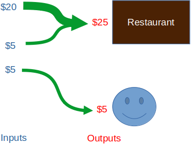

注意一个重要的方面，也是我们拿现金来类比的不恰当之处：这里的 20 元和 5 元会 *合并* 成 “一张”。这就更像是你把两块金子熔铸成更大的一块，从而可以支付所需的数量，而不是给出多个金块。比特币允许你分割以及合并输入，从而产生我们想要的输出。

你可能也会使用 2 张 10 元的和 2 张 5 元的纸币，就像这样：

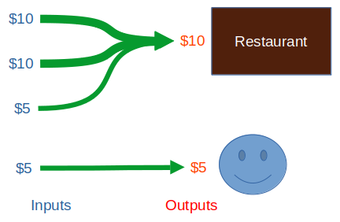

或甚至使用 6 张 5 元的：

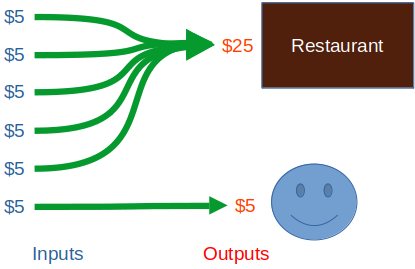

在我们把手上的钱花掉之前，这些单个单个的比特币 “纸币” 叫做 “未花费的交易输出（UTXO）”。这个名字听起来很奇怪，但只要你花时间想一想，你会意识到它非常准确 —— 它们是一些交易的 “结果”（输出），而且尚未被 *另一笔* 交易花费。一个 *尚未被花费* 的交易输出，就是你 *可以花费* 的输出。因此，实际上，UTXO 就像你钱包里的纸币。在它们被花费之后，它们就变成了交易的输入，然后变成了另一笔交易的输出（别人钱包里的现金），而且你不可能再花费它了，但是，你花过这张纸币的 *记录* 会永远留在区块链上。

跟现金不同的是，比特币交易若要生效，就需要发送者的许可。这是通过发送者的 *数字签名* 来实现的，这个数字签名也作为他们意图花掉这笔资金的证据。一个有效的签名（也即，跟 UTXO 的地址相匹配的签名）需要展现在使用该 UTXO 的交易输入中。签名的存在 “解锁” 了这个 UTXO，并表示该 UTXO 的所有者有意在这样一笔交易中花费它。

下图就是撰文之时得到 1 次区块链确认的一笔真实交易：

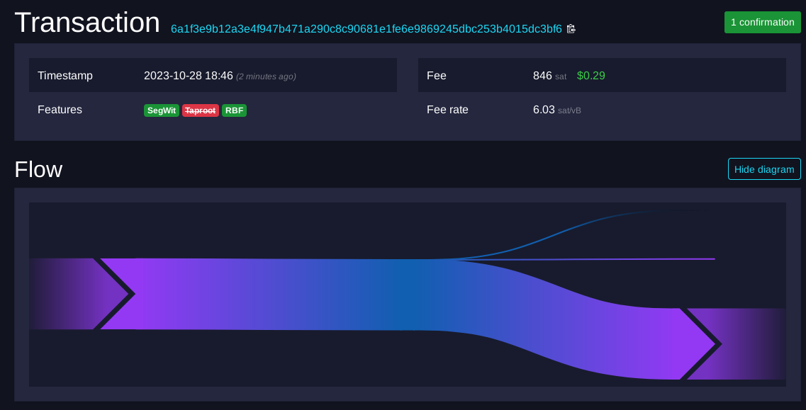

- <a href="https://mempool.space/tx/6a1f3e9b12a3e4f947b471a290c8c90681e1fe6e9869245dbc253b4015dc3bf6">资料来源</a> -

可以看出，上面这笔交易花费了 1 个输入，创建了 2 个输出，一个表示真实的支付，而另一个则几乎确定是作为找零，发回给了花费者。而输入和输出之间的差额则是手续费，交给了挖出首次确认这笔交易的区块的矿工。

这种 “UTXO 模式” 是非常强大的。因为每一笔交易都有输入和输出，而且因为一笔交易的输出会变成后续的另一笔交易的输入，最终我们会得到一个交易的链条，而且可以跟踪比特币所有权的转移。因为比特币的供应量是有限的，而且从这个事实得到它关键的 “不通胀” 特性，能够随时审计有多少比特币在流通当中（或者说 “未花费”），是非常重要的，而 UTXO 模式就可以支持。

这同时也是比特币的隐私性问题的根源。*每一笔交易都有自己的历史*。交给你的所有比特币，以及你将它发到了什么地方，都是 *容易* 跟踪的。整个系统被明确设计为支持这种特点，虽然它没有追踪个体的意图。在这个系统中，你唯一真正的筹码是永远不让你的真实身份跟你的公钥产生关联，而这在大规模监视的时代，是非常难以做到的。

## Payjoin 的历史起源

### 中本聪的小错误

当中本聪在 2008 年出版[比特币白皮书](https://bitcoin.org/bitcoin.pdf)的时候，他意识到隐私问题来源于将每一笔交易都公之于众的要求，这与保证私密的要求相冲突。

他提出了两个建议，以避免真实身份跟交易产生关联：

1. 保持公钥匿名
2. 不要重复使用公钥

这都是好建议，但是，对 1）来说，很难保证我们的真实身份跟我们的支付完全隔离，除非在网上支付时具备极端的谨慎；对 2）来说，即使不重复使用公钥，只要产生自多个密钥的输出在后续支付中又一起被花费，对跟踪者来说就不难辨认哪些公钥属于哪个人。这些建议，即使集合在一起，也是很难做到，而且不完美的解决方案。

在这些建议之后，中本聪又犯了一个很小的错误，夸大了他这个系统的弱点：

> “作为一道额外的防火墙，每一笔交易都应该使用一对新的密钥，以保证它们不会指向一个共同的所有者。一些关联依旧是无法避免的，多输入的交易必然会表明这些输入都来自于同一个所有者。风险在于，如果某个公钥的所有者曝光，这样的关联可能会曝光属于同一个所有者的其它交易。”

中本聪的假设，以及我们迄今为之展示的所有例子，都默认一笔交易的所有输入都属于同一个所有者。换句话说，一笔交易花费的所有 “纸币” 都来自于你的钱包；这是一个合理的假设，但并不 *必然为真*。这个假设叫做 “[输入所有权同一性线索](https://en.bitcoin.it/wiki/Common-input-ownership_heuristic)”。对于任何交易都几乎为真，这也是链上活动监视的基础。

## Coinjoin

在 2013 年开头，Gregory Maxwell 在 [bitcointalk.org 论坛](https://bitcointalk.org/index.php?topic=139581.0)上玩了一个有趣的游戏，他提供了一个自己的 UTXO（价值 1 BTC），还有一个他的地址，并询问是否有人能创建一笔新的交易，使用这个 UTXO 作为输入。如果这样的交易创建者给他发送的数量少于 1 BTC，等于是从他这里拿走了一些钱；而如果发送给他超过 1 BTC，就等于是多给了他一些钱；但是，如果发给他的数量不多不少，正好是 1 BTC，那么，就等于是使用他的资金（和地址）来增加隐私性，因为这个输入 *看起来* 就仿佛是交易创建者自己的 UTXO，而实际上并不是。当 Maxwell 的一个输出被花费、又发回给他的地址时，他提供了另一个 UTXO，这样其他人可以继续这个游戏。从一家区块链活动分析公司得角度看，这会让他们以为 Maxwell 看起来很富有！因为他的地址是公开得，而且许多 UTXO 都被用来构造包含了这些地址的交易，所以任何分析这些交易并假设交易所有输入都来自同一个人的分析者都会以为 Maxwell 有很多很多比特币（超过他实际拥有的数量），因此他的帖子的标题是：“我真的很有钱！”

当然，这个游戏并不隐私，因为 Maxwell 在一个公开的论坛上发布了自己的地址，但它提供了一个非常重要而且应运而生的概念。如 Maxwell 所说：

> “许多人错误地假设如果一笔交易花费了多个地址，就表明这些地址都来自于同一个人。这在一般情形中是对的，但并不必然为真：人们可以相互合作，一起构造一笔交易，而且有安全和免信任的方法。”

在同一年的一篇[后续的帖子](https://bitcointalk.org/?topic=279249)中，Mavwell 正式将这个想法提炼成一个概念，他称为 “Coinjoin”：

> “在思考比特币所有权的历史时，你可能会将一笔花费了多个不同脚本公钥的交易视为汇聚这些资金的所有权，并因此假设：除非是同一个人控制着这几个地址，不然它们怎么能一起花费呢？
>
> [……]
>
> 这个假设是不正确的。用在同一笔交易中，并不能证明这些资金的所有权同一（虽然现状是基本都成立），而且这就是 Coinjoin 可以实现的理由：
>
> 签名是每个输入一个的，即使在同一笔交易中，也是完全相互独立的。这意味着，比特币用户可以一起同意花费一组输入并产生一组输出，然后各自分别签名交易，然后合并他们的签名。除非每个人都提供了自己的签名，否则交易就无法生效，也不会被网络接受，而且没有人会签名自己不满意的交易。”

这就意味着，实际上，任意数量的人都可以合作创建交易，每人都提供和签名自己的输入，而 *完全不必* 担心被其他人盗窃资金。

然后，他之处了 coinjoin 交易的另一个好处，就是这样可以 *批量处理* 交易，从而节约手续费：你可以在你希望支付时找到其他也想发起支付的人，一起创建交易：

> “同样的想法也可以用得更随意一些。当你希望发起一笔支付时，找到其他也想支付的人，一起创建一笔联合支付。这样做不仅会提高隐私性，也会让你们的交易体积更小，因此更容易在网络中传播（而且手续费也会更低）；额外的隐私性是一种福利。”

最后，coinjoin 还是这样一种协议，只要足够多的人使用它，那么所有人都赢了，每个人都可以从中得到隐私性收益：

> “这样的交易跟使用常规方法创建的交易在表象上是没有区别的。因此，只要这些交易足够广泛，它们甚至也会提高那些并不使用这种技术的用户的隐私性，因为输入和混合不再能被当成控制权同一的有力证据。”

为了提供一个具体的例子，假设我们找到了 3 个希望参加一次 coinjoin 的人。他们预先同意混合 0.1 比特币，通过产生 3 个等额的输出、使他人无法分辨这三个地址分别来自谁，他们可以得到隐私性上的好处。对于分析员来说，找零地址跟输入的关系还是很清楚的，但这三个等额的输出就搞不清是谁的了。

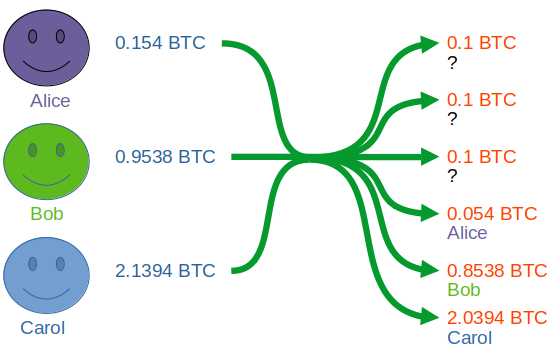

只有 3 个参与者的时候，这样的隐私性收益并不一定很大，尤其其他参与者可能会在后续交易中将自己去匿名化（跟自己的真实身份产生关联），但这可以让同一笔钱通过多轮的 coinjoin 或者使用更大的匿名集来改善。

总结一下，<strong><em>coinjoin 是一笔使用来自多方的输入和输出创建的交易，这样其他人就难以断定哪个输出属于谁</em></strong>。

想要更深入低了解如何创建一笔 Coinjoin 交易、有哪些工具可用，可以看[这个指南](https://bitcoinmagazine.com/technical/a-comprehensive-bitcoin-coinjoin-guide)。

Coinjoin 是最有效也最被广泛采用的比特币隐私解决方案之一，但它也又一些重大缺点：

1. **交互性**：coinjoin 需要来自参与者的重度交互；他们需要同意一个相等的输出面额，而且必须全部在一定时间内提供自己的签名。重度交互需求会给用户带来摩擦，也因此阻碍了它被更多用户采用。
2. **中心化的协调者**：Wasabi 和 Whirlpool 是当前最流行的 Coinjoin 方法。他们也为执行的协调工作收取手续费，这些手续费并不包含为参与交易而交给矿工的区块确认手续费（因为 coinjoin 交易又许多的签名数据，因此手续费是相当高的）。Join Market 是一个非协调式服务的例子，但取舍就是需要更多的用户交互。
3. **需要多次参与以强化隐私性**：为了获得更好的隐私性，通常的建议是参与多次 coinjoin（因为单次参与可能会因为匿名集太小而收获甚微）。但多次参与既花时间、又增加了交互，而且还要支付更多手续费。
4. **Coinjoin 看起来跟普通交易并不完全相同**：coinjoin 交易有一个明确的、可以辨识的特征：来自多方的多个输入会产生多个 *相同面额* 的输出。这就意味着，如果你的钱币在你参与 coinjoin 之前已经被识别出来了，那么监视者也会知道你参与了 coinjoin。他们也许无法知道你的资金去了哪里、你在 coinjoin 之后又做了什么，但他们知道你有多少资金，而且你参与了一次 coinjoin

显然，由于这些局限性，coinjoin 并不是比特币隐私的终极解决方案，尤其是对于更多想要默认隐私方案的被动用户来说。

几年之后，一种更好的结局方案出现了，这种方案不需要交易相关方采取 *任何* 额外的步骤，是直接一对一的，不需要中心化的协调者也不需要市场（因此很节约时间和金钱），而且看起来跟普通的交易没有区别：Payjoin。

Payjoin 是由一系列更早的创新构成的，我们来看看。

### BIP-21

早期比特币的一个重要的用户体验（UX）提升是 BIP-21。“[BIP](https://github.com/bitcoin/bips/tree/master)” 是 “比特币升级提议” 的缩写，它包含一系列的标准，要么是要求比特币协议的共识变更（例如，硬分叉或者软分叉），要么是提供跟比特币交互的有用信息和方法。

BIP-21 是一种定义 URI 用法的标准，它简化了用户跟比特币交互的流程，使得用户只需点击一个链接或者扫描一个 QR 码，就能发起支付。少数的查询参数，例如 `数额`、`标签` 以及 `消息` 也得到了定义，所以客户端软件可以容易地获取和解析它们，提供更好的用户体验。这里是一个带有一些参数的 BIP-21 URI [案例](https://github.com/bitcoin/bips/blob/master/bip-0021.mediawiki)：

重要的是，这个标准是可以延展的，你可以创建自定义的查询参数，而且可以在上面开发新的标准。举个例子，除了比特币地址，你还可以添加定制化的参数 `lightning`，提供你在闪电网络中的收款方式，从而用户可以通过任一种方式给你支付：

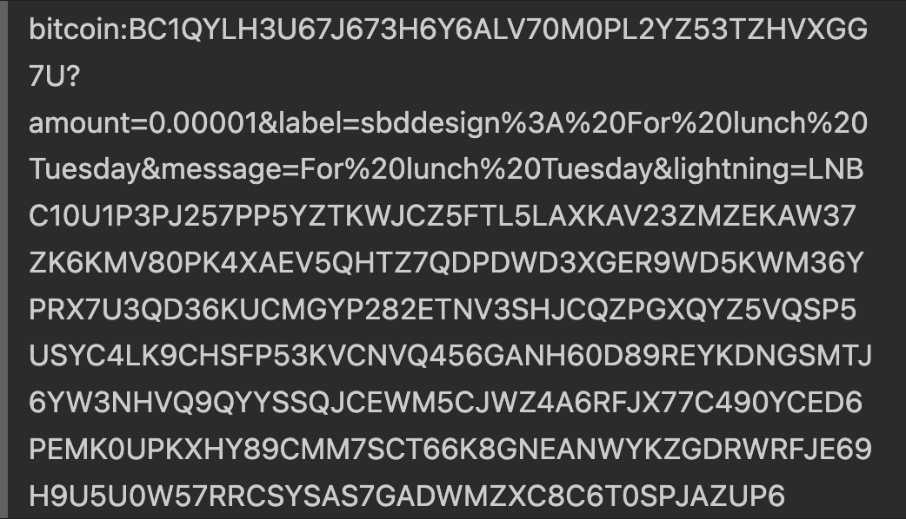

这个强大而且灵活的 BIP 被证明在结合来自 coinjoin 的概念时相当有用。

### Pay-to-Endpoint（P2EP）

我找到的[最早提到 payjoin 概念](https://blog.blockstream.com/en-improving-privacy-using-pay-to-endpoint/)的文献来自 Blockstream，出版于 2018 年 8 月，该文引用了产生出这个概念的[一次研讨会](https://nopara73.medium.com/pay-to-endpoint-56eb05d3cac6)。该文将最终的想法称为 “Pay-to-Endpoint”，因为它结合了 coinjoin 的概念和 BIP-21，让交易的发送者和接收者可以合作、通过一个由接收者提供的兼容 BIP-21 的网络端点（endpoint）为这笔交易提供输入。下图就是一个由该文给出的例子，展示了由接收者提供的端点的样子：

特别值得注意的是这里的 `p2ep` 参数，其数值是一个网络端点（在这里是一个 `.onion` 地址，但也可以是简单的 `http://` 地址或者任何其他兼容的网络端点），可以向接收方的钱包发送信号表示发送者愿意尝试 P2EP 支付。如果 P2EP 支付不成功，钱包会反馈给发送者，要求正常给某个地址支付，并且只使用发送者的输入。

因为输入的贡献是通过 P2EP 来协调的，而且不会产生 coinjoin 那样的 “带有污点” 的等面额输出，所以 payjoin 交易更难识别出来。

这个想法是向正确方向迈出的一大步，但依然处于萌芽阶段，没有定型，而且需要移除一些额外的复杂性。

**题外话：中本聪的 Pay-to-IP**

这个想法的一种变体，叫做 “[Pay-to-IP](https://www.reddit.com/r/Bitcoin/comments/4isxjr/comment/d30y3k4/)”，实际上由中本聪在 *最早的一版* 比特币软件中实现过。但是，这种办法会带来重大的隐私性困，所以在后续版本的比特币软件中被抛弃了。

### Bustapay

在同一个月的晚些时候，Ryan Haver 在比特币开发者邮件组中提出了 P2EP 的一个[改进版本](https://lists.linuxfoundation.org/pipermail/bitcoin-dev/2018-August/016340.html)，并正式形成了一个 BIP，称为 “[Bustapay](https://lists.linuxfoundation.org/pipermail/bitcoin-dev/2018-August/016340.html)”。这个版本简化了最初的 P2EP 协议，而且为了简洁，移除一些复杂性，他的想法是，简单对普及是至关重要的。

Bustapay 提议依然有一些重大的问题，需要提炼，而且协议也没有到达应有的完善程度。但这是正确方向上的又一步，而且它为了让钱包集成而专注于简洁性，是关键性的一步，尤其对比特币开发者这个行动缓慢而谨慎的生态系统来说。虽然 Bustapay 从未得到推广，但它是今天的 payjoin 提议的最后一个先驱 —— 我们已经准备好钱包集成、积极改变链上交易了。

### Payjoin 提议

最后，在 2019 年中，Bustapay 和 P2EP 的概念被 Nicolas Forier（BTCPayServer 的创始人）和 Kukks进一步提炼和增色，形成了 [BIP-78](https://github.com/bitcoin/bips/blob/master/bip-0078.mediawiki)，题为 “一种简单的 Payjoin 提议”。

在了解了催生 payjoin 的协议的背景之后，这份提议开头的摘要的含义和目的就十分清楚了：

> “本文档提议一种用于两方在他们发生支付时协商一笔 coinjoin 交易的协议。”

该提议提供了比以前的方法严格得多的信息，指明如何在一个发送者和接收者之间构造一笔 coinjoin 交易，从而打破交易输入所有权同一性线索，并且是简单、灵活而且便宜的。

## Payjoin 的工作原理

假设 Alice 希望给 Bob 支付 1.1 BTC，然后一个区块链监视公司看到了一笔这样的交易：

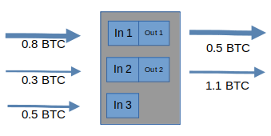

他们可能会认为 Alice 给 Bob 支付了 0.5 BTC，然后将剩余的钱作为找零转给了自己，也就是这样：

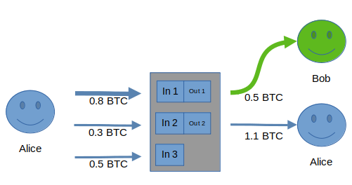

而且大多数时候，这么认为并没有问题！毕竟，通常情况下，找零的面额总是比较大，而且 0.5 更像一个 “整数”，更有可能用在支付中（相比于 1.1）。

他们可能也会怀疑，为什么 Alice 用了一个没有必要的输入（0.8 和 0.3 这两个输入都是多余的），但他们永远无法肯定这不是一笔普通的交易，也无法断定为什么使用了额外的输入 —— 可能 Alice 只是在整理自己的钱包，以便日后管理。这 *可能* 是一笔 payjoin，但就算你这么想，哪个 UTXO 是 Alice 的、哪个是 Bob的呢？没法知道。因为大部分交易 *都不是* payjoin，他们更有可能错误地认为这不是一笔 payjoin 交易。

但是，Alice 既聪明又希望保护自己的隐私，而且她知道 payjoin，所以她请求 Bob 也为这笔交易提供一个输入。Bob 也同意了，所以他创建了一笔交易，花费了自己的一个（甚至多个）UTXO 作为输入，然后发回给 Alice。如果这笔交易对 Alice 没有问题，那么她会广播到网络中。这笔交易实际上是这样的：

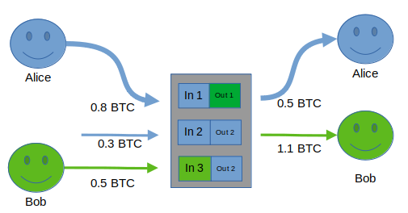

只要链监视者假设所有输入都来自于 Alice（就像在第一个例子中那样，而且现在也确实是这么做的），他们关于哪些输入属于 Alice 和 Bob 的看法会错得离谱！

有趣的是，Alice 和 Bob 都为所有人提供了隐私性好处。因为，跟 coinjoin 不同，这笔交易更像一笔普通交易，只要足够多人使用 payjoin，监视者就无法断定哪些交易是普通交易。在挫败监视者的实话，Alice 和 Bob 也让 *每一笔* 交易都变得有些可疑。只要足够多的人这么做，所有的交易都会变得可疑。链上隐私性通常是一个数字游戏，参与的人越多，每个人的隐私性也就越好。

在这个案例中，Alice 和 Bob 合作创建了一笔交易，用上了他们各自的输入，以保护隐私性。当然，整个过程是可以自动化的（而且在现实中也确实 *是* 自动化的）。

在 BIP-78 中，整个过程的更加正式的定义如下：

1. 接收者向发送者展示一个带有查询参数 `pj=` 的 BIP-21 URI，这个参数的数值指向一个 网络端点/服务端，人们可以向该端点发送 “部分签名的比特币交易（PSBT）”。这个端点可以使用 HTTPS、.onion 或其他任何使用身份加密的协议，例如：

   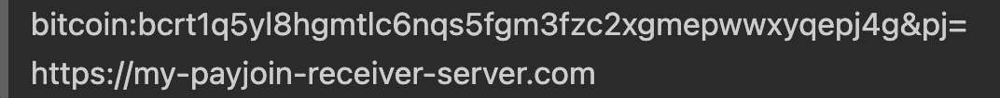

2. 发送者仅使用自己的、完全可以满足支付需要的输入，创建一个成型的、可以广播的 PSBT，发送到接收者的端点。这个 PSBT 称为 “初始 PSBT”。

3. 接收者修改这个 PSBT，以包含自己的输入，并签名自己的输入，然后将修改后的 PSBT 发回给发送者。接收者并不修改发送者的任何输入或者输出。这个 PSBT 称为 “Payjoin 提议”。

4. 发送者验证这个提议，然后重新签名自己的输入以敲定整笔交易，最后广播到网络中。

不管在整个过程中的哪一步中出错，比如接收者没有可用来创建 Payjoin 提议的 UTXO，那么 TA 只需广播初始 PSBT 即可，这就会是一笔普通交易。虽然这笔交易的所有输入都来自同一个所有者，只有足够多的人使用 payjoin，你就无法断定两方 *没有* payjoin，而且监视者将只能假设大家都 payjoin 了，然后找出别的办法来跟踪支付。

## Payjoin 的诸多好处

### 打破更多监视线索

输入所有权同一性假设，并不是 payjoin 可以打破的唯一一种影响隐私性的假设。BIP-78 指出了另外两种可以用来辨识所有者的线索：

- 通过 `脚本公钥` 来辨识找零：

  在比特币中，`脚本公钥` 就是 “锁定脚本”，指定了可以花费一笔比特币的条件。之所以称为 “脚本公钥”，是因为锁定条件需要一个跟某公钥（地址）相匹配的有效签名来解锁它。换句话说，只有控制着这个 UTXO 的关联公钥的私钥的人，才能解锁它。

  脚本公钥有几种类型，例如：P2PKH、P2WPKH、P2SH、P2TR。一般来说，钱包为所有交易使用相同的 `脚本公钥`，因此，*找零输出*（除去支付和手续费以外，发送者发回给自己的资金）将很可能跟发送者的输入使用相同类型的脚本公钥，而发送给接收者的输出更有可能使用别的类型。这就意味着，在同一笔交易中使用相同脚本类型的 UTXO [可以被辨识](https://en.bitcoin.it/wiki/Privacy)为可能属于发送者，也即假设发送给接收者的输出会是不同类型的。

  BIP-78 指定了一种方法，允许接收者仅使用发送者相同类型的脚本公钥，这就打破了上述可能暴露支付输出和找零输出的线索。

- 通过支付数额（整数）来辨识找零和支付：

  正常情况下，给朋友支付总是会选择整数，因为这会自然得多。如果 Bob 要向 Alice 收费（而且他们没有按照 “更接近整数” 的法币价格来收取比特币），那么他很可能会收取 0.0001 这样的设e，而不是 0.00010231 这样的非整数。如果交易的一个输出是整数，那么很有可能这是支付输出，而非整数输出则是找零输出（至少当前是如此）。

  Payjoin 也描述了一种方法，让接收者可以在构造 Payjoin 提议时添加额外的整数输出，从而打破这种线索。

### 通过联合更广大的群体获得不对称的收益

如前所述，从隐私性的角度看，coinjoin 的一个主要缺点在于：1）coinjoin 交易跟普通交易很容易区别开来；2）很少有人会专门去做 coinjoin，而普通交易则不然。这就产生了比特币的同质性问题，因为很可能有些人会把 coinjoin 过的钱认为是污染过的，因为就是有人有这种 “追求隐私等同恶意” 的可笑想法。当然，如果 *大部分交易*，甚至只是一定比例的交易，都是保持隐私的，那追求隐私的交易就不显眼了。

Payjoin 看起来就跟别的交易一样，因此并不起眼。外部观察者甚至没有理由多看这样的交易一样，因为它并不表现出有混淆支付和找零输出的意图。

因为看起来就像别的交易，甚至采用 payjoin 的边际收益也意味着每个人的隐私性都会更难侵犯，因为监控的线索很快就会变得不再可靠。Adam Gibson（JoinMarket 的奠基性贡献者，也是比特币隐私性的专家）[总结得非常好](https://reyify.com/blog/payjoin)：

> “即便你非常小心，这些 PayJoin 交易也跟常规支付没有什么分别 [……] 那么，酷的事情来了：假设这种技术的微小采用也会被大家观察到。假设 5% 的交易用到了这种方法。重点在于，没人知道到底哪 5% 是 PayJoin 交易。这是一个伟大的成就 [……]，因为这意味着所有的支付，也包括那些并不使用 Payjoin 的支付，都获得了隐私性上的好处！”

### UTXO 整理

显然，payjoin 及其先驱都致力于解决隐私性问题。但使用 payjoin 有一个很棒的辅助作用，BIP-78 也明说了：UTXO 整理。

中本聪提议为每一笔收款交易使用一个心得地址，这就导致用户的钱包会有许多 UTXO 要管理。当这些 UTXO 都被用作输入、产生一笔新的交易时（假定着不是一笔 coinjoin 或者 payjoin 交易），这样的交易要花掉很多手续费。因为手续费是按照交易的体积（字节数量）来收取的（对应于作为稀缺资源的区块空间），所以更多输入等价于更大的交易、更多的手续费。

需要指出的是，在 UTXO 整理时使用 payjoin 并不必然能节约手续费，因为每个出现在链上的 UTXO 都仍然需要支付手续费。但是，它让这部分手续费在一个长时间段中分散开来，并且提供了在支付的时候批量处理 UTXO 的机会。批量处理会让 UTXO 的整理更加便宜（比起专门为整理而发起一笔交易）。它也让 UTXO 的关联更加容易、更少占用硬盘空间。此外，钱包还可以实现一种办法，让接收者提前指定自己想在低手续费时整理哪些 UTXO，从而让 UTXO 的整理自动化，变得更加平滑。

## 闪电网络和 Payjoin：天生一对

### 使用 Payjoin 开启闪电通道

[闪电网络（LN）](https://lightning.network/lightning-network-paper.pdf)是一种建立在比特币上的二层解决方案，将交易放在链下以实现即时、极低手续费的结算，因此极大地提高了交易的吞吐量、提升了隐私性，并允许比特币进入新的应用场景（例如 “[微支付](https://brandonlucas.net/articles/bitcoin/micropayments)”）。它使用了由节点之间的支付通道构成的网络来路由支付，将资金从发起的地方转发到目的地。这些通道要求各节点运营者与自己的通道对手锁定一些 “流动性”（比特币，然后这些比特币就可以在一个节点及其通道对手之间流动）。你在一个通道中能花费多少比特币受限于这条通道中 *属于你的一端* 有多少流动性。

在维护一个闪电节点时，绝大部分的复杂性都来自于开启这些通道以及管理各通道的流动性。新用户的入门是最大的痛点之一，因为涉及许多个步骤。假设 Alice 希望跟 Bob 开启一条通道；她已经安装好了一个全新的闪电节点，只是还没注入资金。那么她需要做以下这些事：

1. 发送一笔链上交易，为她新创建的闪电钱包注入链上资金，资金数量至少要能够开启通道；然后等待这笔交易得到确认（至少要等待 10 分钟）
2. 使用她的闪电钱包软件跟 Bob 协商一笔开启通道的交易，并等待这笔得到确认

最起码，Alice 必须支付两次手续费，并为每笔交易等待约 10 分钟，这是很乏味的。

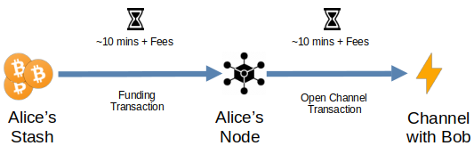

Payjoin 可以简化这个过程并帮助 Alice 节约资金：Alice 可以将给闪电钱包提供资金和开启通道在一笔交易中完成。

在这个场景中，Alice 预先配置好自己的 payjoin 接收端点，加入她要开启的通道的细节：要锁定多少比特币、跟哪个对手开启通道。然后，使用一个支持 payjoin 的 钱包，某个人（也包括 Alice）可以向端点发送一个初始 PSBT、协商一笔 payjoin 交易，而端点会完成必要的 API 调用，跟 Bob 的节点开启一条通道。

换句话说，发送者（则这里也可以是 Alice）跟 Alice 接收 payjoin 的端点通信、创建一笔交易，直接将资金发到 Bob 和 Alice 的 2-of-2 多签名输出中，从而在两个节点之间构造一条闪电通道。这就将整个过程变成了一笔交易：

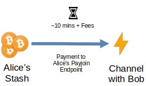

一个有趣的事情是，闪电通道的开启和 payjoin 都有 *活性* 要求（虽然，至少 payjoin 不会要求[很长时间](https://gist.github.com/DanGould/243e418752fff760c9f6b23bba8a32f9)），这就意味着在交易发生的时候，参与者必须全部在线。这跟链上比特币交易相比是非常受限的（那只要求支付者在 *支付的一刻* 在线）。但是，这也让两套协议可以完美地结合在一起。

举个例子，闪电网络因为将支付放在链下，所以可以很好地提高隐私性，而且可以极大地提升比特币用作交易媒介的能力（即，真正能够用于购买日常必需品），而且无碍于其价值存储特性。但是，需要在链上开启通道也意味着，你用于开启通道的资金，以及跟你打开通道的人，都会在链上留下踪迹。出于我们已经讨论过的理由，payjoin 可以混淆并摧毁窥探者的许多线索。

这也让事情变得更加 *简单*，因为用户将只需发起一笔交易，而不必发起两笔交易；变得 *更快*，因为只需等待一笔交易得到确认；更 *便宜*，因为只需支付一次手续费。事实上，这种办法可以一次性开启多条通道。你可以制作一个你希望开启通道的节点的列表，配置到一个 BIP-21 payjoin 接收端点中，然后在接收支付时一次性、自动化地全部开启，而且只需等待一次确认、支付一次手续费。完全可以！

已经有一个项目在实现这个想法了，叫做 “[Nolooking](https://github.com/payjoin/nolooking)”，允许你列出一组公钥，然后一次性 *批量* 打开多条闪电通道！这样一来，Alice 不仅可以跟 Bob 开启一条通道，还可以跟 Bob、Carol 和 Dina 开启通道，而且 *只需一笔链上交易*！毫无疑问中，这种能力可以大大简化闪电网络的用户体验。想想就令人激动：未来的闪电钱包会默认启用 payjoin，而 *事实上* 的用户体验就是只需选择你的通道伙伴，只需发起一笔比特币交易，就 *完事了*！你的闪电节点现在有许许多多的通道了，而且为了开启它们你只发起了一笔交易。这该多么令人惊讶？

很容易设想，这会简化自主保管型闪电通道的采用。如果闪电钱包软件可以有一个 “快速启动” 按钮，用户要做的只是输入他们想要锁定多少比特币（也即他们想要多少流动性）、设置一个开启少量大小合理的通道的默认值、在路由和手续费上略微牺牲，那该多有趣。对于高级的用户，只需提供一个 “我知道我在干什么” 按钮。

## 弱点

任何协议都有弱点，payjoin 也不例外。

一个主要的问题在于活性（联网）要求。在当前的实现中，接收者的 payjoin 网络服务端必须在构造交易时在线，因为发送者和接收者要协商最终的交易（当然，这都是编程好的）。这可能会限制商家服务器以及闪电节点的采用，而他们又是唯一有激励持续在线的人群。从用户的角度看，如果交易能够随时发送，而不必管接收者的服务端在不在线，那就更好了。

另一个不太可能利用但更危险的弱点是，如果一个 payjoin 服务端（即接收者的服务端）是在一个不安全的服务器上的，那么接收者的输出可能会在[运行中](https://github.com/bitcoin/bips/blob/master/bip-0078.mediawiki#unsecured-payjoin-server)（回传给发送者之前）被篡改，导致属于接收者的资金被盗。

不过，我们接下来会说到，人们已经提出了解决上述两个问题的解决方案。

最后，payjoin 协议还有一个弱点是，它面临采用上的门槛，因为钱包必须付出开发工作来集成它。一个特别的挑战在于，理想的用户界面应该是默认采用 payjoin 的。发送者的钱包和接收者的钱包都会直接尝试 payjoin，而不必由用户主动在隐私设置里打开。最好的隐私是默认实现隐私，因为要求用户主动采取行动，他们可能就泄气了。因此，若要让 payjoin 被普通用户采用，需要有一种他们不必费力理解的顺滑体验。钱包应该默认开启它。记住，协议已经内置了在 payjoin 失败时候的反应：回退成常规交易，无需用户的手动介入。

### 无需服务端的 Payjoin

Dan Gould 已经为版本 2 的 payjoin 提交了一份 [BIP 草案](https://gist.github.com/DanGould/243e418752fff760c9f6b23bba8a32f9)，允许在 *异步* 以及无服务端的情境下完成 payjoin。这种 *无需服务端的 payjoin* 将解决要求接收者在接收支付时在线的问题，以及与之相关的服务端安全问题。因为永远在线的 payjoin 接收者服务端可能是 payjoin 的用户采用的最大障碍，这个 BIP 的实现可能会给 payjoin 的采用以及比特币的被动隐私带来很大好处。

## Payjoin 的采用状况

截至 2023 年底，payjoin 的采用依然相对较少，但从 2018 年其诞生开始，也在[持续增长](https://payjoin.substack.com/p/tracking-growth-in-payjoin-adoption)。因为 payjoin   在当前已经可用了，而且并不需要任何比特币共识变更，唯一的阻碍就是编写出能够支持它的钱包软件；而帮助开发者的工具每天都在进步。[Payjoin Dev Kit (PDK)](https://payjoindevkit.org/introduction/) 是一种新的 payjoin 实现，带有钱包可以用来集成 payjoin 的模块。它甚至有一个 `payjoin-cli` 工具，你可以用命令行来创建 payjoin。这个库是用 Rust 写的，但允许其它语言使用它的 binding 正在开发。

### 钱包支持

BTCPayServer 和 JoinMarket 已经支持 payjoin 的发送和收取，虽然不是默认的。BlueWallet、Sparrow、Wasabi 和 BitMask 支持发送。少数其他钱包通过一个插件来支持它，包括 [Bitcoin Core](https://github.com/payjoin/rust-payjoin)。还有活跃的 PR 试图在 Mutiny Wallet 中集成 payjoin。[这里](https://en.bitcoin.it/wiki/PayJoin_adoption)列出了当前的采用状况。

## Payjoin 与比特币的未来

前面已经引用过 Adam Gibson 的说法：即使只有 5% 的链上交易使用 payjoin 来构造，也会对比特币的隐私性有很大影响。我们只需越过一个门槛，就足以让分析公司无法放心地假设他们能正确地解释交易。一旦他们监视我们的方法被打破，那些既不了解比特币隐私性的好处、也无意保护我们的权利的人所施加的不明智的、武断的、恶意的限制也会变得无关紧要。

而且如我们所见，因为 payjoin 会带来的许多可能性，它不仅仅是一种隐私解决方案，也是一种可延展的合作式交易协议，允许节约手续费、单笔交易开启多条闪电通道等等有趣用途。它可以为比特币带来的好处是无可限量的，而且现在就能实现，无需改变比特币自身。

那我们还等什么呢？

## 支持

如果你希望支持 payjoin 的开发或者作贡献，请加入 [discord](https://discord.gg/6rJD9R684h)、[给我们捐赠](https://geyser.fund/project/payjoin/)或者了解 [payjoin.org](https://payjoin.org/)。

## 致谢

衷心感谢 Dan Gould 审核这篇文章并提出了非常宝贵的建议。

（完）