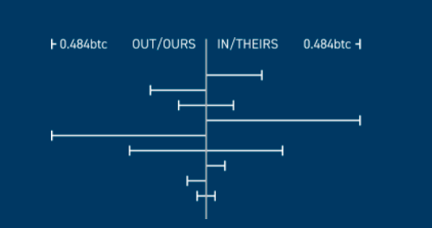
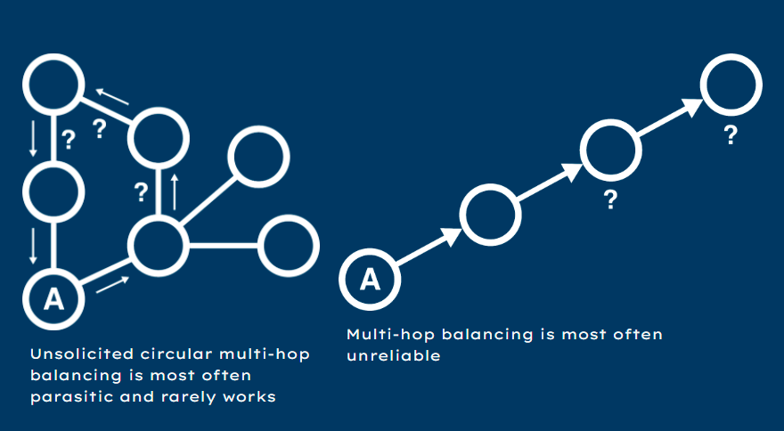
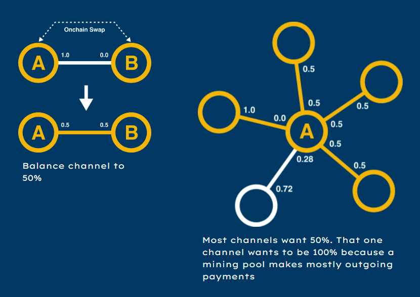
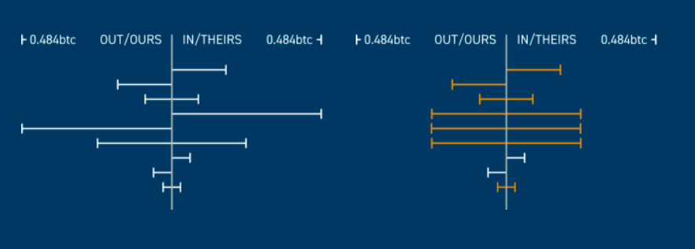
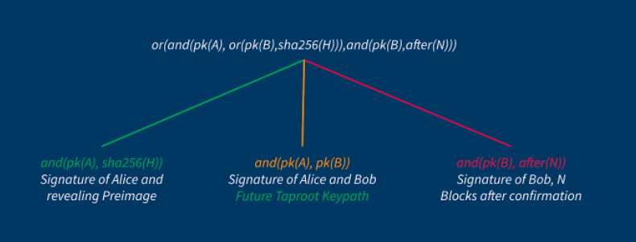

> *作者：PeerSwap*
> 
> *来源：<https://www.peerswap.dev/>*

## 概述

PeerSwap 是一种闪电节点的点对点通道余额调节协议。它让你可以用链上的资产来重新调节通道内的余额。

当前的 PeerSwap 支付 CLN 和 LND 节点实现，其它闪电网络节点实现已经参与到了协议标准的讨论中。现在 PeerSwap 适合具备 Linux 系统技巧的开发者和节点运营专家。控制面板的图形界面实现正在开发中，这样的图形界面将对普通的终端用户更为友好。

请加入我们的 Discord 频道，参与讨论和支持我们：[discord.gg/MSNt8eyZrT](https://www.google.com/url?q=https%3A%2F%2Fdiscord.gg%2FMSNt8eyZrT&sa=D&sntz=1&usg=AOvVaw3_mhSSxd-qa3Aq3xXs60EF)

## 完整的技术规范和 Github 代码库

协议的技术规范和 Github 代码库见此处：https://github.com/ElementsProject/peerswap

## 为什么要选择 PeerSwap？

### 最难的问题：闪电网络通道的余额调节

- 绝大部分放在闪电网络通道中的资本都因为通道不平衡（译者注：指通道双方的支付能力远远不对等）而一直受困。
- 不平衡的通道的生产能力远远较弱。路由算法会记住失败的路径并降低优先级。
- 大部分人都希望通道平衡在 50%（双方的余额各占通道容量的 50%）。
- 大部分现有的指南都推荐开启更多的通道作为 “解决方案”。
- 大部分已有的解决方案都用到了多跳路由。

- 不平衡的通道图示 -

### 多跳的平衡方案可能是有害的

- 大部分现有的解决方案都利用了多跳路由来调节你的中介通道的余额。
- 多跳路由时非常不可靠的，因为
  - 从设计上来说，你并不知道其它节点的能力有多大
  - 为平衡你的通道，常常会导致其它节点的通道失衡
  - 协作型的环路逐通道平衡没有成本而且好处很大 —— 但这种情形是极为罕见的，也很费劲，需要在 2 个以上的节点运营者之间实时沟通
  - 主动的（普通的）环路平衡是寄生性的
    - 收取较高费率的节点会从定价较低的竞争者处吸取一切可用的流动性 —— 不然就会像后者一样沦为受害者
- 最终来说无法逃脱零和游戏
  - 需要一些其他手段来避免整体情形恶化

- 主动的环路多跳平衡通常是寄生性的，而且很难实现；多跳平衡常常不可靠 -

## 那么 PeerSwap 怎么做？

- 跟你的直接对等节点通过定制的消息协商链上的原子化互换
- 跟大多数现有的平衡方法相反的思路：
  - 跟你的通道对手平衡通道 —— 可靠
  - 不开启更多和更大的通道，你可以便宜地为自己已经得到想要余额的通道再注入资金
  - 改善平衡而不会伤害其它节点
- 开启新的通道不再是为了平衡支付能力，而是为了跟你频繁互动的 支付来源/支付目标 节点建立直接的链接
- 多种条件性互换类型
  - 当前支持 BTC 和 L-BTC 的链上互换
  - 额外的钱包支持正在开发

## PeerSwap 的优点

- 简单 —— 在大部分现有的闪电网络节点上都可用
- 成本最低
- 因为单跳，所以可靠
- 完全点对点和去中心化。没有协调者
- 不需要为了平衡而开启更多通道
  - 减少了热钱包风险
  - 减少了资金成本
    - 更多的通道总是使得生产能力更差
  - 减少了为入站容量支付的需要
- 只要自己不想，终端用户就不需要开启新通道！

## 余额调节方案比较

（从缺）

## PeerSwap 的 Swap

（译者注：这是一个描述符，描述了原子化互换的原理：该支付是一个三个解锁条件并列的合约：要么，Alice 揭示原像并用自己的签名解锁；要么，Alice 和 Bob 一起解锁；要么，Bob 在一段时间后用自己的签名解锁。Alice 和 Bob 就是交换的双方。）

### Swap 的类型

|          | 比特币链                | Liquid 链                     | 其它链*                                        |
| -------- | ----------------------- | ----------------------------- | ---------------------------------------------- |
| 资产     | BTC                     | L-BTC                         | ？                                             |
| 到账时间 | 3 次确认（30 分钟左右） | 2 次确认（2 分钟左右）        | ？                                             |
| 隐私性   | 公开                    | 盲化                          | ？                                             |
| 钱包     | 闪电网络原生的钱包      | 支持 Elements 平台的钱包、GDK | ？                                             |
| 好处     | 完全免信任              | 可预测的完成时间              | ？                                             |
| 缺点     | 到账时间不确定          | 联盟托管                      | ？（* 指一切可以可以通过揭示原像来花费的方法） |

## 常见问题

- 为什么要使用 PeerSwap，而不用 **Loop**、**Boltz** 或其它中心化的互换服务呢？
  - 中心化的互换服务商为了送达支付，会在闪电网络中使用多跳支付。但多跳支付比起跟通道对手互换，要不可靠得多，也要贵得多
- **splicing** 和 PeerSwap 有什么区别？
  - PeerSwap 非常简单，而且已经可以工作了，无需改动闪电网络协议。但 splicing 还未实现。
- **liquidity-ads** 和 PeerSwap 有什么区别？
  - Liquidity Ads 是一种激励他人开设对你的通道来使你获得入账容量的办法。但 PeerSwap 是你可以用已有的通道来调节余额。
- 为什么 PeerSwap 比开设新通道的办法要更好？
  - 闪电网络的开启对确认延迟的容忍度更低，因此它在设置链上手续费率时需要更加保守。PeerSwap 更能容忍延迟，所以其手续费应该会低一些。
  - 相比之下，为已有的通道补充资金更加安全，资金效率也更高。
  - PeerSwap 支持其它互换资产，比如  L-BTC。