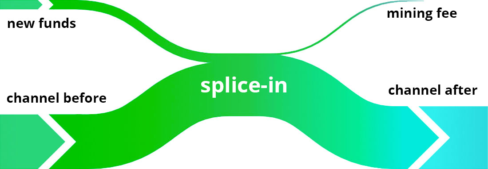
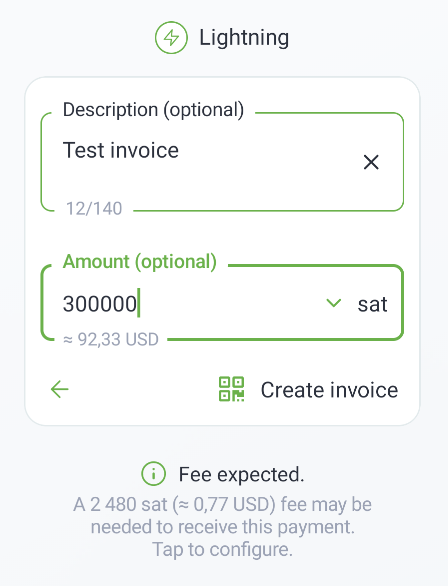
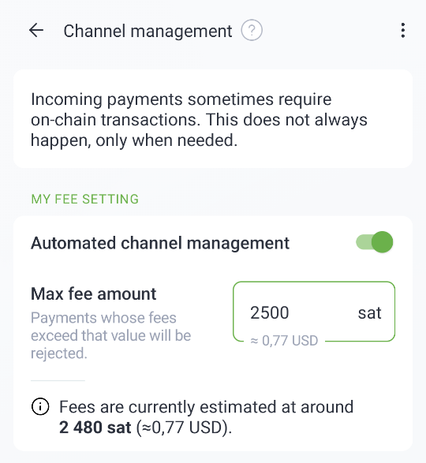
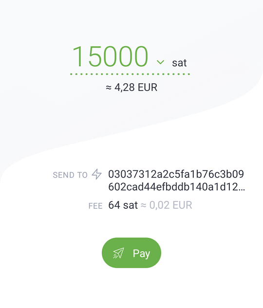
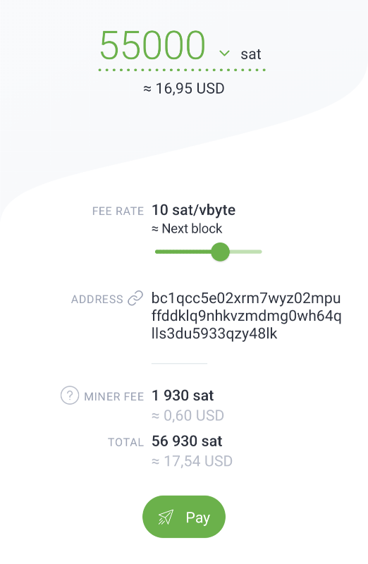

> *作者：ACINQ*
> 
> *来源：<https://acinq.co/blog/phoenix-splicing-update>*

**长话短说**：“通道拼接” 改变了一切。现在 Phoenix 可以管理单条动态大小的通道，用户不再需要为入账流动性支付 1% 的手续费，可以更好地预测和控制自己的资金，还可以实现免信任的互换。新的手续费方案的详细描述[见此处](https://acinq.co/blog/phoenix-splicing-update#fee-comparison)。

当前仅可用于 Android 系统，请发邮件到 phoenix@acinq.co 申请测试。预计需要几周时间才能在 iOS 推出。

- 通道拼接 -

## 单条动态大小的通道

几年前我们第一次推出 Phoenix 的时候，我们称之为 “第二代钱包”，因为它引入了自动化通道管理的概念，比起更早的闪电钱包是巨大的提升。

但是，其中的内核依然相当粗糙，因为一旦通道开启，就无法再调整。这个局限性导致了许多问题：

- 随着时间推移，因为使用量的变化，Phoenix 会创建多条通道。一个用户拥有十多条通道并不是什么罕见的事。在常见的 “只进不出” 情况下，每一笔入账支付（闪电支付或链上支付）都会变成一条新通道。
- 因为入账流动性分散在许多通道中，所以很难预测入账支付会不会导致新通道创建。实际上，是根本没法预测，因为这取决于发送者要怎么分切自己的支付。这种不可预测性让用户很挫败，因为开启通道是有成本的。
- 从钱包供应商的角度看，每一条通道都有自己的风险，因为通道需要在未来（也许很遥远的未来）的某个时间点，以根本不可知的手续费率关闭。这个风险无法随着时间得到来自用户的复合收益的补偿，因为新通道一直在创建出来。这就是为什么开启一条通道的代价至少是 3000 聪，哪怕这时候注资交易上链的手续费只要 200 聪（许多用户对此感到困惑）。

利用叫做 “通道拼接” 的技术，新版 Phoenix 可以重新调节通道的大小，从而解决上面的所有问题：

- 每个用户都只需拥有一条通道
- 不再有流动性分散的问题
- 向通道增加或移除资金不会带来额外的未来风险，所以可以按当时的成本来定价：用户不再需要支付 1%/至少 3000 聪 的手续费，而只需支付在当时让交易上链的挖矿手续费。

看待它的另一个角度是，我们可以让一个用户拥有 N 个 UTXO，变成每一个用户只拥有 1 个 UTXO。这就是当前比特币上自主保管的最佳选择。未来进一步缩减链上的踪迹，将意味着许多用户会共享同一个 UTXO，要么是简单的需要信任的模式（托管钱包），要么需要引入类似于 “虚拟 UTXO” 这样的概念。

我们认为，通道拼接带来的效率收益，是现象级的，所有钱包最终都会实现它。这就是何以这个技术提升，标志着新一代的自主保管钱包的诞生。

## 更强的可预测性和控制力

在之前版本的 Phoenix 中，我们得到的一个常见的反馈是，新通道的创建（以及相应的手续费）常常会让用户感觉惊吓。

新版本将不会再创建新通道，相反，它会将收到的资金 “拼进” 现有的通道中（如果你没有足够多的入账容量的话），但是，这依然需要一笔链上交易。通道管理费原来是 1%（同时以 3000 聪为下限），现在只需是拼接交易的链上手续费。

- 通过 “splice-in” 给一条通道添加资金 -

现在，Phoenix 可以准确地预测什么时候入账的闪电支付会产生通道管理费，而且会提前显示一个提示：

- 友好的手续费提醒 -

用户可以在收款时调整自己愿意为通道管理支付的最高费用。如果网络的手续费太高，Phoenix 会等待并在稍后尝试（拼接交易），或者拒绝（闪电支付）。

- 手续费管理页面的控制选项 -

发送闪电支付的手续费现在会提前显示，而且是固定的 0.4%，而不是浮动的 0.05% ~ 0.5% 。这让用户可以在支付的时候验证手续费，同时跟钱包供应商达成激励兼容（之前需要信任钱包供应商会选择最便宜的路径）。钱包供应商现在被激励去寻找预算约束下最好（最可靠、最便宜）的路径。

- 发起闪电支付之前会显示的手续费 -

## 免信任的互换

几乎所有闪电钱包都提供发送和接收常规比特币交易的爽快体验。但是，到目前为止，这都是通过互换服务来实现的 —— 互换服务成了链上和链下资金的桥梁。

在原本的 Phoenix 中，互换服务是非常基础的，需要信任，而且不让用户选择 swap-out 时候的手续费率。其他互换服务可能是免信任的（例如，潜水艇互换），但也都不灵活。

### Swap-out（支付到比特币地址）

拼接让链上资金和链下资金的界限进一步模糊。从通道中移出资金（本身叫做 “splice-out”），本质上就是从你的通道直接发起链上交易。这里不需要互换服务，而且操作也是免信任的。不仅你可以随心所欲设置交易的挖矿手续费率，你甚至还可以追加手续费，以加速区块确认，就像常规的链上钱包一样。

- 为链上交易设置你想要的手续费率 -

需要指出的是：

- 互换服务有一个好处，就是切断了链上交易与链下交易的关联，但 splicing-out 会揭示你的 UTXO（它就像是一笔普通的链上交易）
- splice-out 会缩小通道的容量，同时你在通道中的余额会变少；而使用外部的互换服务会保持通道的容量，同时增加你的入账流动性（因为你通过闪电网络给互换服务发送了资金）

所以，某一些交易，你可能依然希望通过外部的互换服务来完成。

### Swap-in（用链上资金给 Phoenix 钱包支付）

在之前的 Phoenix 中，在收款页面中显示的比特币地址，并不是由 Phoenix 钱包控制的，由互换服务控制；对于每一笔进入的链上交易，都会创建一条新通道。

使用新版 Phoenix，资金将由 Phoenix 钱包控制。如果已经有一条通道，那么资金会拼接到这条通道中，让通道的容量增加跟支付额相同的数额。如果还没有通道，则会使用双向注资技术产生一条新通道。

此外，Phoenix 还使用了一种启发自 “[swap-in-potentiam](https://lists.linuxfoundation.org/pipermail/lightning-dev/2023-January/003810.html)” 提议（[中文译本](https://www.btcstudy.org/2023/03/06/swap-in-potentiam-moving-onchain-funds-instantly-to-lightning/)）的机制，从而实现零确认的互换：当把资金发送到 swap-in 地址的交易得到确认，这些资金将马上就可以使用。

无论是拼接交易还是创建新通道，挖矿手续费都将由用户支付，但用户可以手动配置（如上文所述）。因为资金在 Phoenix 控制之下，用户可以设置非常低的手续费限额，从而让互换延迟到比特币的交易池空荡的时候再确认。这样一来，哪怕向 Phoenix 钱包存入 500 聪，也是可行的（在条件很好的时候）。比起之前的 3000 聪/1%，门槛下降了很多。

## 手续费比较

主要的变化是，入账链上交易的 1% 手续费改变了，出账闪电支付变成了 0.4% 的手续费。

这并不意味着入账支付是免费的，因为需要支付挖矿手续费，但在手续费率较低（低于 10 聪/字节）的时候，就比之前便宜。而在 1 聪/字节的时候近乎于免费。

| 操作                                                     | 改版之前的手续费          | 改版候的手续费               |
| -------------------------------------------------------- | ------------------------- | ---------------------------- |
| 通过闪电网络发送支付                                     | 0.05% ~ 0.5%              | 0.4 %                        |
| 通过闪电网络接收支付                                     | 没有手续费                | 没有手续费                   |
| 发送链上支付                                             | 挖矿手续费                | 挖矿手续费                   |
| 在链上接收资金（swap-in 或闪电通道没有充足流动性的时候） | 1% 手续费，下限为 3000 聪 | 挖矿手续费（+ 每次 1000 聪） |

## 下一步？

- 盲化路径：让闪电支付实现更好的隐私性
- BOLT12/Offer：静态的闪电发票
- Taproot：更便宜的通道管理，以及更好的链上隐私性

（完）